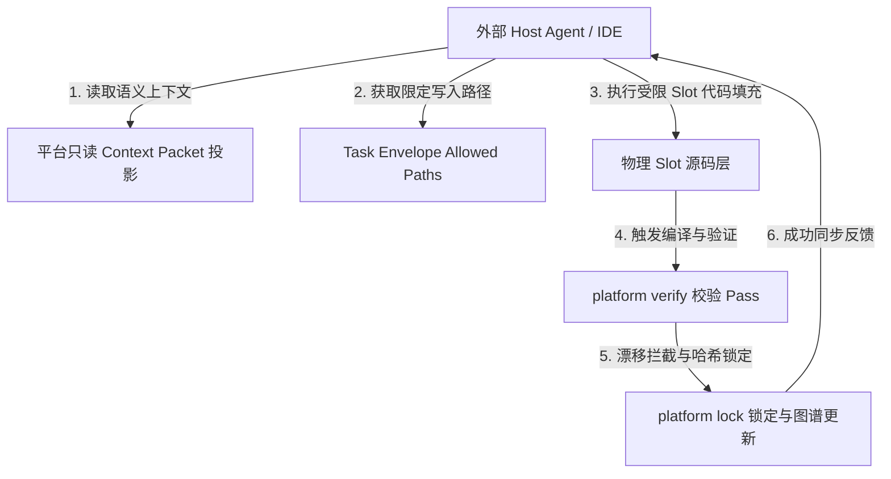

# AI Runtime、任务信封与治理规范

> 目标：定义 AI 角色边界、task envelope schema、写入控制、上下文组装规则。

## 1. AI 角色边界

### 当前阶段

- `v0.1`：只启用 `Slot Synthesis Agent`（已实现）
- `v0.2+`（部分已实现）：`Interface Alignment Agent`、`Repair Agent`、`Review/Explanation Agent`

### 全局原则

- AI 不是系统主循环控制器，是编译链中的受限 pass。
- AI 不能决定新增/移除 block，不能绕过 compile contract。
- AI 必须优先使用结构化对象（plan/graph/manifest/slot/acceptance/provenance/report）定位任务。
- 整仓搜索、整仓重写或自由聊天不是默认工程动作。

### 外部入口优先级

CLI first → MCP second → IDE plugin third。所有入口都是 Runtime API 的 adapter，不得绕过 task envelope。

## 2. Task Envelope Schema

```yaml
taskId: fill_slot_customer_normalizer
taskKind: adapter-slot
phase: adapt
targetBlock: entity/customer-basic
targetFile: source/code/slots/customer_normalizer.ts
sourceSlot:
  id: customer_normalizer
  status: filled
  runtimeTarget: custom/customer_normalizer.ts
  sourcePath: source/code/slots/customer_normalizer.ts
  writableZones: [source/code/slots/customer_normalizer.ts, custom/]
  provenanceHints:
    generator: mock-local-synthesizer
    verifiedBy: []
allowedPaths: [source/code/slots/customer_normalizer.ts]
requiredSymbols: [normalizeCustomerInput]
forbiddenOperations: [modify_other_files, add_dependencies, access_database, change_exports]
inputContracts:
  inputType: CustomerInput
  outputType: NormalizedCustomerInput
testsToPass:
  - tests/customer_normalizer.spec.ts
  - tests/acceptance/customer-flow.spec.ts
budget:
  maxAttempts: 2
  timeoutSeconds: 90
  maxTokens: 16000
expectedOutput:
  type: source-file
  language: typescript
```

除了上述 YAML 格式，任务信封在编译器内部以及向 MCP/子模型传递时，采用如下 JSON Schema 物理表征：

```json
{
  "taskId": "task_normalize_customer_001",
  "targetSlot": "source/code/slots/customer_normalizer.ts",
  "signature": "export function normalizeCustomerInput(input: CustomerInput): CustomerOutput",
  "context": {
    "dependencyTypes": "interface CustomerInput { name: string; email: string; phone?: string; }",
    "allowedImports": ["lodash-es", "change-case"],
    "forbiddenOperations": ["fs-write", "network-fetch", "direct-db-query"]
  },
  "verificationRules": {
    "typecheckRequired": true,
    "policyRules": ["tenant-isolation-enforcement"]
  }
}
```


## 3. Envelope 字段表

| 字段 | 必填 | 说明 |
| --- | --- | --- |
| `taskId` | 是 | 全局唯一 |
| `taskKind` | 是 | adapter-slot / policy-slot / repair / alignment |
| `phase` | 是 | 所属 pass |
| `targetFile` | 是 | 主要写入文件 |
| `sourceSlot` | 是 | 来自 lock 的 slot 状态、writable zones、provenance hints |
| `allowedPaths` | 是 | 实际允许写入的文件（收窄自 writableZones） |
| `requiredSymbols` | 否 | 必须保留或导出的符号 |
| `forbiddenOperations` | 是 | 禁止操作集合 |
| `inputContracts` | 否 | 类型/schema 约束 |
| `testsToPass` | 否 | 必须通过的测试 |
| `budget` | 是 | maxAttempts / timeout / maxTokens |
| `expectedOutput` | 是 | 目标输出类型 |

## 4. 写入控制

- 写回前校验目标路径在 `allowedPaths` 内。
- 若 diff 触及未授权路径 → `SLOT-WRITE-001`。
- 语义权限 = 文件路径 + task kind + phase + zone + artifact ownership + forbidden operations。
- `acceptance`、policy、`testsToPass`、verification report 是约束输入，不是 AI 可修改的输出。
- Workbench/IDE 变更 `source/app.yaml` 必须先写 `source/views/mutations/*.json`。

## 5. 上下文组装

### 优先级

1. Task envelope
2. `graph.lock.json` 中的相关 slot/block/pass 状态
3. 相关 block manifest 摘要
4. acceptance / verification report / provenance / explain graph 摘要
5. 相关类型签名与测试
6. 目标文件骨架

### Context Packet 投影

Context Packet 是 task envelope 在执行时的只读上下文投影，不是新的事实源、持久化 artifact 或独立状态机。它由 task envelope、lock、manifest、acceptance、verification、provenance、explain graph、runtime evidence 和必要源码骨架组装。

允许暴露的投影字段包括：`task`、`affectedGraph`、`blocks`、`pins`、`policies`、`writableAnchors`、`readonlyAnchors`、`cannotModify`、`mustPreserve`、`verification`、`provenance`、`issueClassification`、`runtimeEvidence`。

权限仍只由 `allowedPaths`、`forbiddenOperations`、task kind、phase 和 zone 决定；Context Packet 不能扩大写入范围，也不能把外部 provider evidence 提升为 authoring truth。Graph-It-Live/MCP、GitNexus、Graphify、trace、IDE graph 或其他工具结果只能作为 `runtimeEvidence` / evidence reference 进入投影。

### 源码下钻规则

只有结构化上下文不足时才下钻源码。范围从 `targetFile`、`requiredSymbols`、`testsToPass` 推导，禁止扩大到整仓。

## 6. Budget 与降级

默认 budget：`maxAttempts=2`、`timeoutSeconds=90`、`maxTokens=16000`。

- 第一次失败 → 返回错误摘要并重试一次
- 第二次失败 → 标记 task failed，不自动扩大上下文/放宽路径

## 7. Governance 审计

每次 AI task 记录：`taskId`、`phase`、`modelId`、`startedAt`、`finishedAt`、`allowedPaths`、`result`、`testsRun`、`verificationStatus`。

## 8. 结构化修复反馈环 (Repair Feedback Loop)

当子模型或 Agent 填充 Slot 代码后，如果后验验证阶段（`se verify`）失败，编译系统不会抛出杂乱无章的原始控制台输出，而是将其转换为结构化的 `repair-plan.json` 反馈环以引导下一次精准修补：
1. **结构化归因**：编译系统的错误处理器自动将 TypeScript 编译器诊断信息和 Playwright/E2E 错误进行提取与定位，归因到具体的符号（如特定函数）和 AST 节点。
2. **生成修复信封**：将 `repair-plan.json` 反馈包（包含出错的堆栈摘要、目标 AST 节点源码切片、违背的 Policy 规则条目、以及推荐的修复策略建议）封装进新的任务信封。
3. **精准二次修改**：子模型/Agent 在沙盒中仅针对信封内指定的 `allowedPaths` 内的错误节点进行修改，在限定范围内执行修复，直到通过 Playwright 端到端断言，以此阻断全局越权修改导致的“错误蔓延”。

## 9. 极客战略：AI Agent Harness 的宿生定位与外部 IDE 宿主赋能

对于本平台的终极演进形态，我们做出了一个决定性的极客战略决策：**绝不重复制造重型 IDE 壳壳（如 VS Code 甚至自研编辑器界面），也不重复编写底层的通用 AI 编码引擎，而是采取“高内聚、强契约、带只读验证闭环的织布架”定位，主动寄生并赋能于任何外部先进的 Agent 与 IDE 宿主！**

### 9.1 战略考量与护城河

1. **宿主（Host）的极速演进**：Cursor、Windsurf、Roo Code 及各种先进的 MCP 工具链演进极其迅猛，在代码编辑、模糊上下文匹配、全库理解等“体力活”与“操作面”上做得非常好。试图与它们竞争去重复造 IDE 壳无异于用自己的短板碰别人的长板。
2. **宿生（Symbiote）的绝对受控**：外部 Agent 唯一的致命缺陷是 **"失控与漂移"** —— 它们在修改代码时会产生大量的 Hardcode、API 破坏、架构碎屑、隐式副作用，且极难在每次修改后完成 100% 架构对齐。
3. **平台的核心壁垒**：SpecEngineer 平台提供的是一套高度内聚的 **L3 语义契约约束（Engineering IR）与物理只读验证沙盒**。我们做的事情是给外部 Agent “戴上项圈与手铐”，让他们在极度受控、极度安全的契约沙盒下发挥强大的编码效率。

### 9.2 宿生赋能（Parasitic Symbiosis）工作流架构

外部 Agent（如 Cursor / 任何宿主 IDE）将 SpecEngineer 当作只读执行底盘与治理中枢，实现极致安全的受控开发：



1. **只读上下文投影 (Context Packet)**：外部 Agent 启动后，SpecEngineer 不会向其敞开整个 Git 仓库的代码，而是向其投影高内聚的 `Context Packet` 结构化数据（包含 App 拓扑、Prisma 缝合关系、API Contract 及 Acceptance 测试描述），让 Agent 瞬间获得完全精确、无歧义的逻辑实体描述。
2. **任务信封 (Task Envelope) 越权拦截**：平台为 Agent 的每一次修改动作派发 `Task Envelope`，严格收缩其 `allowedPaths` 至单个 `source/code/slots/` 物理文件，并列出 `forbiddenOperations`（如禁止操作数据库、禁止越权修改其他文件）。
3. **后验只读验证闭环 (Verify & Lock)**：外部 Agent 编写完代码后，必须通过平台内聚的 `verify` 和 `lock`。一旦检测到生成产物与 provenance 的哈希基线存在非受控漂移，或者触发 policy violation，平台将直接阻断并拒绝合流，生成 `repair-plan.json` 反馈包迫使其在原位进行修补。

通过这种“寄生”机制，人类可以通过任何自己喜爱的先进 IDE（Cursor/Windsurf 等）甚至强大的外部 Agent 来调用 SpecEngineer 编译器。我们专注于**极致的架构拼缝、只读拦截、哈希 provenance 追溯与 100% 受控的可视化 review 面**，这才是契约驱动开发平台的终极工业尊严！


## 10. Custom Slot 沙盒安全防御与 Prompt 注入拦截

在外部 Agent 充当编译 Pass 自主填充 Custom Slot 的开发过程中，存在被恶意第三方通过 Prompt 注入攻击（Prompt Injection）导致在 Slot 源码中偷偷埋入“数据泄露或提权后门”的风险。平台在编译验证期和运行时实施双重**确定性安全拦截**：

### 10.1 编译期静态 AST 越权审查

1. **语法树强解析与危险依赖封禁**：
   - 验证器（se verify）在分析修改后的 Slot 文件时，利用 TS-Morph 静态加载其 AST。
   - 强行审计该文件中的所有 `ImportDeclarations`（导入声明）和 `CallExpressions`（调用表达式）。
   - **拦截规则**：严禁在 `source/code/slots/` 下的任何自定义 Slot 源码中引入危险的 Node.js 核心底层包或命令执行函数（如 `child_process`、`fs`、`os`、`cluster` 等），一旦查出，抛出 **`SLOT-SECURITY-002`** 并强行阻断编译，拒绝数据合流。

### 10.2 运行时物理隔离沙盒 (Process Sandboxing)

1. **有限权限子进程包裹**：
   - 对于运行期执行的非可信 Custom Slot 业务函数，平台将其包裹在极度收敛的运行时沙盒进程（如 V8 Isolates 或 WebAssembly 沙盒环境，在本地通过轻量的 Bun Sandbox / ts-node 受限子进程模拟）中执行。
   - **确定性沙盒拦截规则**：
     - **磁盘 I/O 封禁**：沙盒进程除当前 Slot 所需的临时只读缓存路径外，剥夺其对硬盘上任何其他目录的物理读写权限。
     - **网络出口拦截 (Egress Block)**：严禁沙盒进程在运行时主动发起任何未经白名单声明的外网 HTTP/TCP 网络连接，从物理层面彻底阻断后门代码向黑客服务器发送“线上多租户数据库数据”的通路。
     - **系统资源配额 (Resource Quota)**：限制该沙盒进程的 CPU 上限与内存配额，对超时 Slot 强行终止，防御恶意的死循环 DDOS 攻击。


