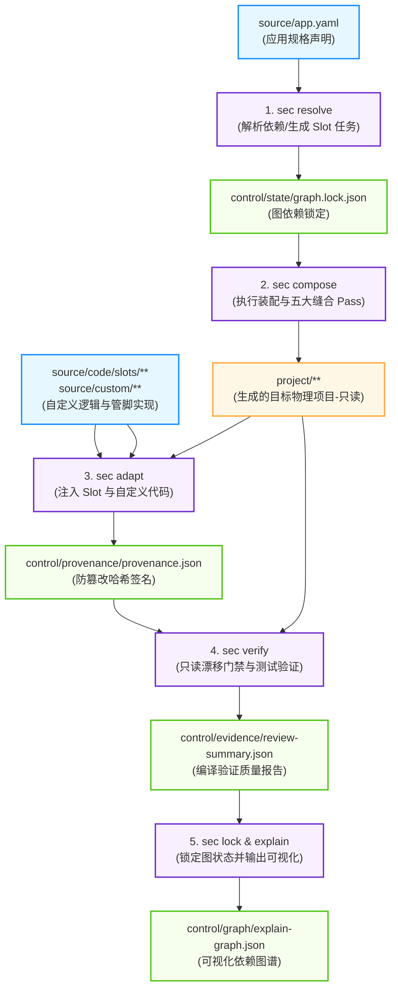
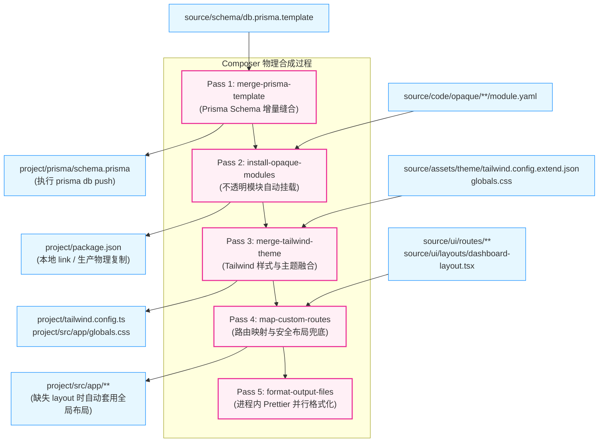
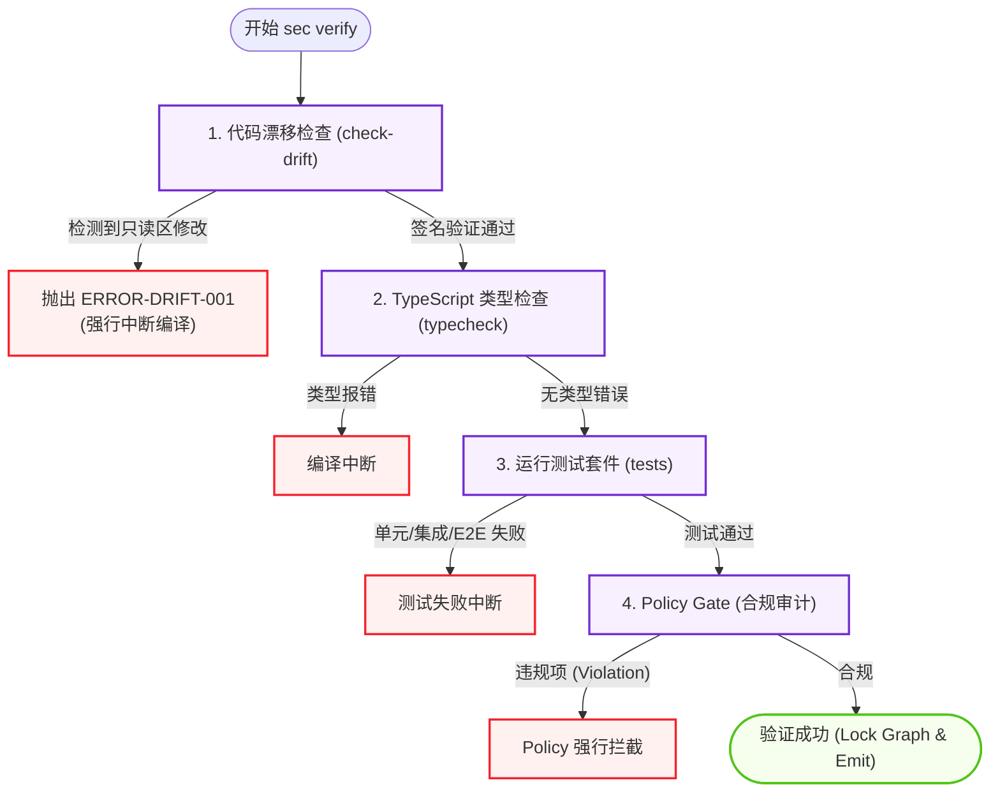
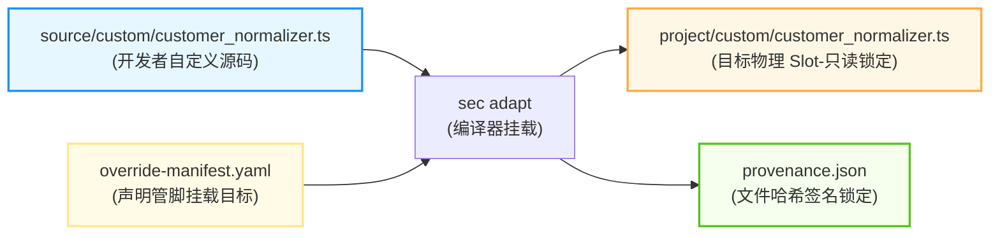

# 编译管道与行为流图示

> 目标：提供 SpecEngineer 编译器各命令管道、五大 Stitching Pass 以及验证（Verify）流程的直观图示，减小开发者与 AI 的心智负担。

> **代码生成约束（v0.2.x 末段起）**：compose 层所有生成 `.ts`/`.tsx` 源码的子节点（RPC route / RPC client / route graph / slot skeleton 等）均由 `CodeBuilder`（LLVM IRBuilder 风格）程序化构造，详见 `05` §9.10。下方图示中的"代码生成"节点默认指向 `CodeBuilder`，不再画大段模板字符串拼接路径。

---

## 1. 编译器生命周期主管道 (Compiler Command Pipeline)

下图展示了从声明式的 `source/app.yaml` 规格输入，到最终在 `project/` 生成物理运行项目的完整编译与验证流程：

---

## 2. Composer 缝合引擎五大 Pass 细节 (Composer Stitching Passes)

在 `sec compose` 阶段，除了直接的文件拷贝，编译器会执行 5 个增量缝合 Pass，将开发者的非结构化自定义代码无缝且安全地组织到生成的物理项目结构中：

---

## 3. 验证与门禁执行流 (Verification & Gate Execution Flow)

在 `sec verify` 阶段，系统对生成项目进行极其严格的多重防御拦截，拦截任何未经平台允许的带外编辑行为，保障生成的物理项目不会发生退化：

---

## 4. 自定义代码（Overrides & Slots）管脚挂载流

自定义代码通过声明式的 Override 规则被映射在编译产物的物理 Slot 位置。以下是注入与哈希签名追踪流：

