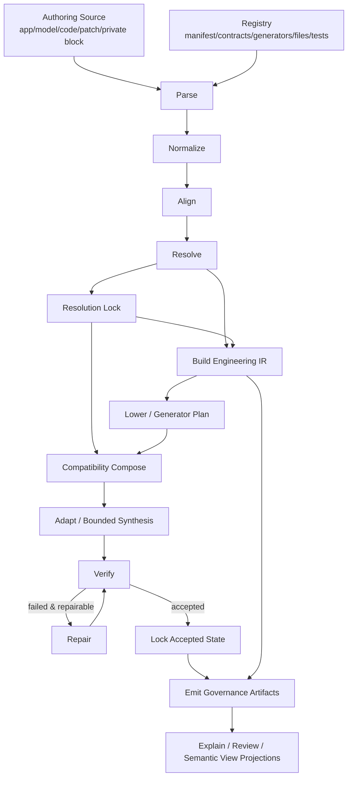
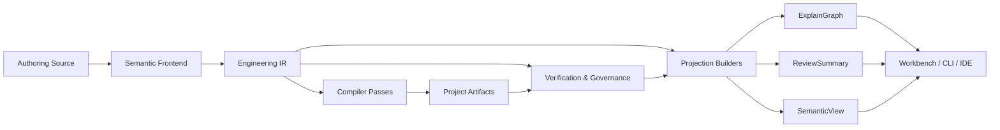
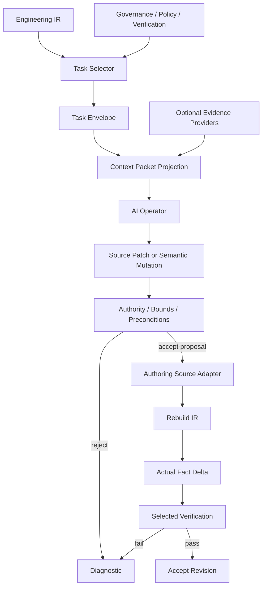
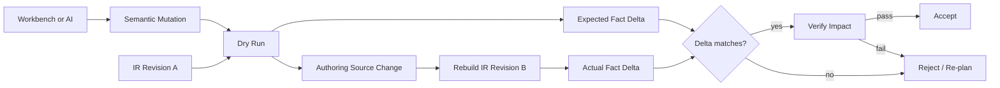
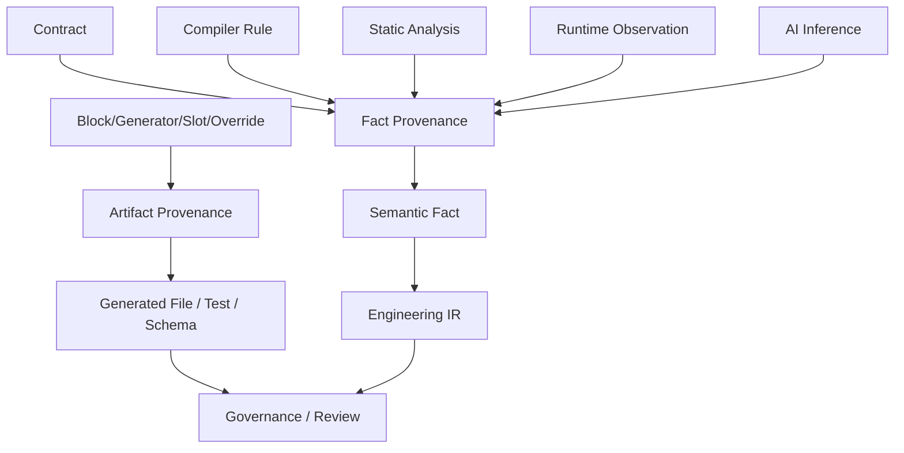
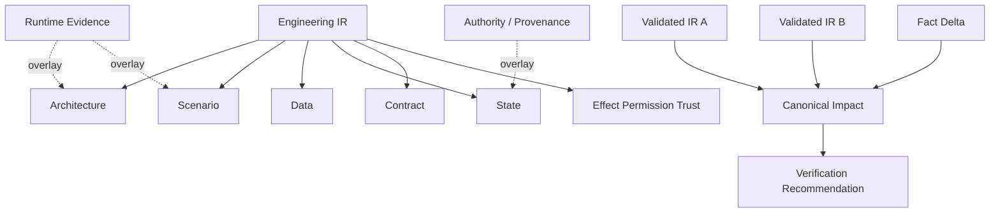

# 编译管道与行为流图示

本文只提供当前目标架构的数据流图。字段和状态以对应实现规范为准。

## 1. 总体编译链

`Normalize`、正式 `build-ir` 与 IR-owned `lower` 已进入 v0.3 主链；文件装配继续兼容，但 Generator 不再由 resolve/raw Contract 旁路规划。

## 2. Canonical 与 Projection

约束：`ExplainGraph`、`ReviewSummary`、`SemanticView` 都不能反向成为 canonical semantic source。

## 3. AI 执行链

AI 永远不直接写 IR。

## 4. Semantic Mutation

## 5. Artifact 与 Fact Provenance

Artifact origin 不能自动成为文件内所有 Semantic Fact 的 authority。

## 6. 七类投影

Impact 是 Fact Delta 与两端 validated graph 的只读语义推导，不是仅由 Delta 构成的 UI overlay。Workbench 展示同一语义空间的不同投影，而不是维护七套业务事实。
