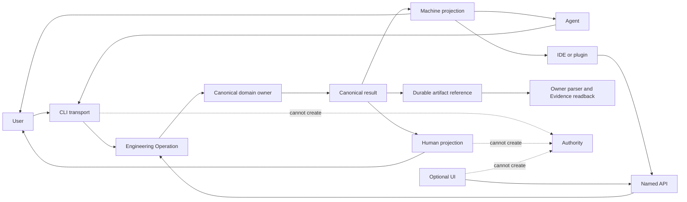
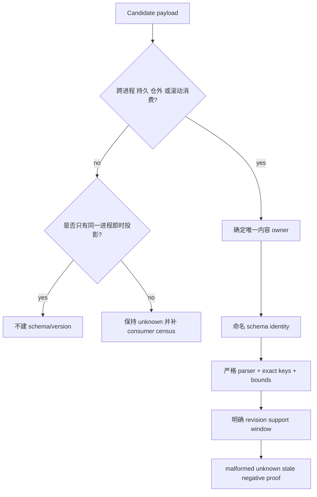
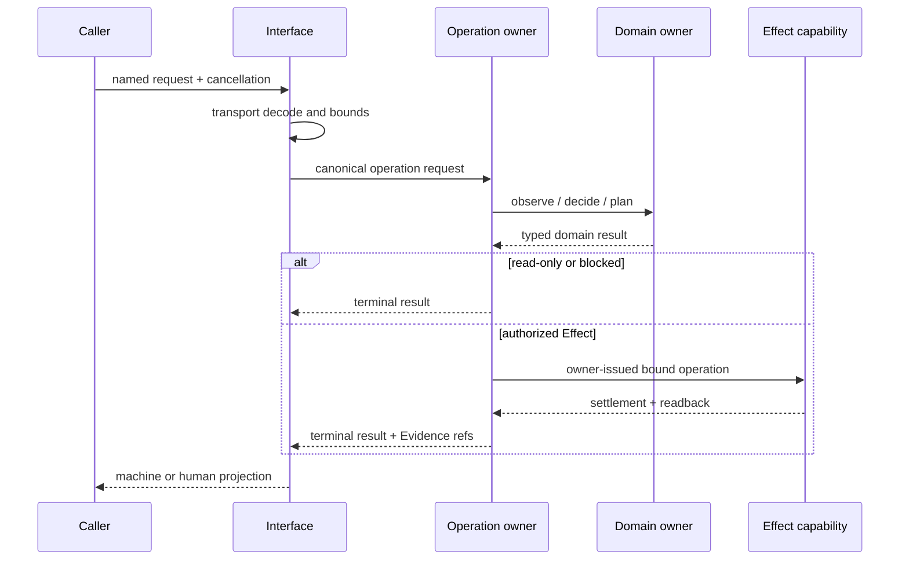
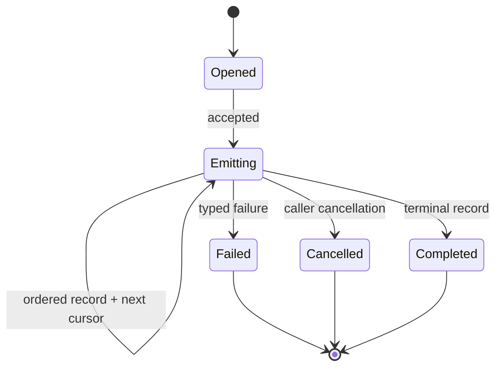
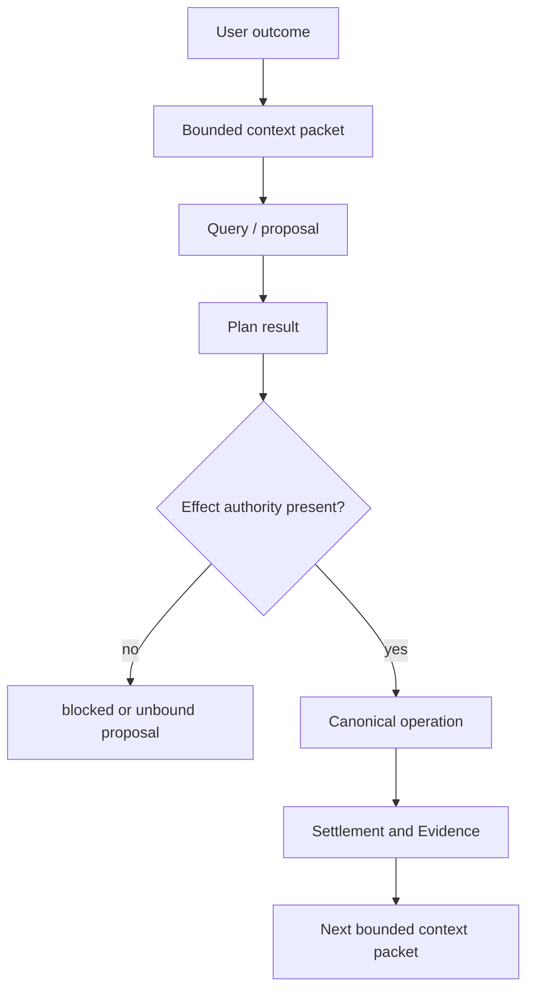

# Agent 与用户机器接口

## 1. 职责

SEC 是本地优先的工程语义与受控操作系统。CLI、Agent、IDE、未来可选 UI 都是同一领域结果的投影者，不是新的事实、决策或权限 owner。

| 本域拥有 | 本域不拥有 |
|---|---|
| 命令寻址、输入解码、输出通道、退出语义 | 产品目标、领域状态、WorkDecision |
| domain result 到人类/机器表示的无损投影 | ScopeGrant、Effect authorization、Verification PASS |
| 命名公共 payload 的发布目录与支持窗口 | Engineering IR、Delta、Impact、Evidence 的内容真值 |
| stdout/stderr、分页、游标、取消、背压 | 外部 Provider 的身份、凭据、物理能力 |
| secret redaction 与 presentation policy | browser、HTTP/SSE UI、Workbench runtime |

## 2. 公共面拓扑



核心等式：

```text
InterfaceResult = Project(CanonicalDomainResult, Audience, DetailLevel)
Authority(InterfaceResult) <= Authority(CanonicalDomainResult)
Meaning(compact) = Meaning(full) = Meaning(canonical)
```

投影可以删减展示细节，不能改变状态、阻断数量、unknown、digest、Evidence 引用、Effect 权限或退出结论。

## 3. 公共对象目录

| 对象 | 内容 owner | 接口 owner 的责任 | 稳定条件 |
|---|---|---|---|
| Command request | operation/domain owner | 参数寻址、解码、取消、transport error | 有真实调用者与命名输入合同 |
| Command result | domain owner | stdout/stderr/exit projection | machine consumer 已声明支持窗口 |
| Engineering Operation | operation owner | plan/apply/query/recover 路由 | 同一 operation identity 与权限边界 |
| Engineering IR / graph | semantic owner | 输出格式选择、引用与分页 | strict parser、identity、revision、digest |
| Review / Evidence artifact | verification owner | locator 与 readback projection | durable bytes、producer、parser、retention |
| Agent Context Packet | agent-interface owner | bounded facts 与引用 | 只引用 canonical identity，不携 Effect grant |
| TypeScript API | domain owner | package export 与调用错误投影 | 与 CLI 使用同一 domain contract |
| Event stream | operation owner | 顺序、游标、背压、终止 | 可从 operation journal 重放且无第二状态源 |

未进入此目录的 JSON 只是临时 presentation，不能自称稳定公共合同。

## 4. Schema 存在裁决



| 情形 | Schema | Revision/version | Parser | 兼容 |
|---|---|---|---|---|
| 同进程、单 producer、即时对象 | 不需要 | 不需要 | 类型检查 | 原子升级 |
| CLI 仅人读文本 | 不需要 | 不需要 | 不适用 | 不承诺机器兼容 |
| CLI 稳定 machine JSON | 每个 payload 独立命名 | 仅真实 consumer 区分状态时存在 | strict、bounded、unknown reject | 明确支持窗口 |
| durable artifact/journal | 必须 | 必须绑定 byte grammar | strict、duplicate-key/unknown-key reject | migration owner 管理 |
| event stream | stream 与 event 分别命名 | consumer 需要时存在 | 顺序/游标/终止验证 | 只能按声明窗口重放 |
| 内部调试 JSON | 不得冒充公共合同 | 不需要 | best effort | 无兼容承诺 |

禁止：

- 一个全局 `formatVersion` 同时代表不相容 payload；
- writer、formatter、测试各复制一次 schema identity；
- 只有版本数字断言而没有真实 reader；
- 用 API 名称中的代际后缀冒充数据格式；
- 为“未来也许使用”发布无 producer/consumer/support window 的空协议。

未来义务应记录为 capability obligation；只有 consumer 激活时才编译为公共 schema。

## 5. 命名 machine contract

每个稳定 payload 的 owner record 至少包含：

| 字段族 | 必须证明 |
|---|---|
| Semantic identity | 这个 payload 表达什么，不依赖文件路径或命令名 |
| Schema identity | 哪个 byte/object grammar 有权解释它 |
| Applicable revision | 适用于哪个 subject/provider/environment epoch |
| Producer | 谁能签发；测试 fixture 不能冒充生产 producer |
| Consumer census | 谁读取、哪些字段影响行为 |
| Bounds | 最大字节、条目、深度、时间、分页、并发 |
| Integrity | canonical encoding、digest、duplicate/unknown key policy |
| Authority ceiling | 它最多证明什么，明确不能证明什么 |
| Failure vocabulary | malformed、unsupported、stale、unavailable、unknown |
| Support window | 当前写入、允许读取、迁移与退役条件 |

Domain owner 同时拥有类型、schema 常量、parser、validator 与 canonical serializer。接口 owner 只登记“命令或 API 使用哪个 owner contract”，不复制字段定义。

## 6. 命令与 Operation



命令不是业务流程 owner。一个命令可以调用一个 Engineering Operation；不能在 formatter、flag parser 或 shell wrapper 内重算业务决策。

### 输入规则

| 输入类别 | 处理 |
|---|---|
| semantic identity / selector | 交给 domain parser 解析 |
| path | 仅作为 Address；进入物理 owner 后绑定 identity |
| deadline / cancellation | 只允许收窄 parent operation |
| credentials | 不进入普通 JSON、日志或 argv；交给 Provider owner |
| caller-supplied result/receipt | 默认不可信；必须经 production origin gate |
| unknown field/version | fail closed，不猜测、不静默忽略 |

### 退出规则

| Machine status | 退出语义 | stderr | 可重试性 |
|---|---|---|---|
| completed | 请求的终态已 readback | 仅诊断 | 不需要 |
| blocked | 已知前置条件不成立 | typed blocker 摘要 | 输入或外部状态变化后 |
| unresolved | 无法证明所需事实 | unknown 原因 | 获得权威 observation 后 |
| failed | operation 执行失败且已 settlement | failure identity | 按 failure policy |
| residue | 终态未闭合、需 recovery | residue locator，不泄密 | 仅 recover operation |
| cancelled | parent operation 取消且 effect 已结算 | cancellation detail | 新 operation |

进程退出码是 machine status 的 transport 映射，不是独立业务状态。映射由接口 owner 唯一定义，domain consumer 读取 machine payload，不从 stderr 文本反推状态。

## 7. 人类与机器通道

| 通道 | 内容 | 禁止 |
|---|---|---|
| stdout machine mode | 单一命名 payload 或声明的 record stream | 日志、颜色、进度动画 |
| stdout human mode | 高密度摘要、表、图、下一步 | 被脚本当协议解析 |
| stderr | bounded diagnostic、进度、非秘密 failure context | canonical result、token、完整环境 |
| durable artifact | owner serializer 产生的完整结果 | presentation formatter 改写 |
| exit code | machine status 的稳定映射 | 表达领域细节 |

`compact` 与 `full` 只是同一结果的投影级别：

```text
Digest(full canonical result) is invariant
compact.blockingCount = full.blockingCount
compact.unknownCount = full.unknownCount
compact.status = full.status
compact.authority = full.authority
```

默认 compact 只返回行动所需的分类、聚类、计数、typed blocker 与完整结果 digest。full 只在显式请求或真实 artifact consumer 存在时返回逐项记录；不得为生成 full 重新扫描业务事实。

## 8. 流、游标与大结果



流式输出必须：

- 绑定一个 operation identity、result schema 与 snapshot revision；
- 使用单调序号和不透明游标；
- 明确总量未知与 exact total 的区别；
- 有背压、单一 absolute deadline 与总字节/记录预算；
- 终止记录绑定完整结果 digest；
- lost connection 后从 journal/readback 恢复，而不是重做 Effect；
- compact/full、分页与重连不改变记录集合语义。

## 9. Agent 接口



Agent Context Packet 只包含当前行动所需的 canonical references、typed state、unknown 与预算；大图以 digest/locator 引用。它不能携带自签 Scope、Verification、Review、merge 或 Effect 权限。上下文压缩、模型切换或 UI 重连后，从 operation journal 和 canonical owners 重建 packet，不把聊天摘要升级为事实。

Agent proposal 永远是 proposal；只有 operation owner 将其绑定到 live facts、scope 与 capability 后才可能执行。

## 10. Secret、隐私与诊断

| 数据 | 默认输出 | full 输出 | durable Evidence |
|---|---|---|---|
| token / credential / cookie | 禁止 | 禁止 | 仅不可逆 identity/epoch 引用 |
| 环境变量 | allowlisted names + redacted origin | 仍不输出值 | canonical environment digest |
| 文件内容 | 摘要与 digest | 仅 owner 允许的 bounded excerpt | retained artifact/bytes digest |
| command argv | secret-free canonical args | 同左 | operation record |
| provider raw output | typed projection | owner-redacted bounded bytes | provider receipt locator |
| 用户路径 | logical Address 或 workspace-relative projection | 必要时明确标注 physical | physical binding Evidence |

任何 diagnostic 都必须有最大字节数、redaction policy 与 truncation marker。截断后的 diagnostic 不能作为 parser 输入或 Evidence。

## 11. 可选界面

未来 GUI、Web、插件或远程界面必须作为独立 package 或 repository：

```text
OptionalInterface -> Stable machine/API surface -> Canonical operation
Core -/-> OptionalInterface
```

可选界面只拥有 presentation、local interaction state 与 transport session；不能写 canonical IR、重算 WorkDecision/Delta/Impact/Verification、持有隐藏 Effect grant或成为 core 默认依赖。界面未安装时，核心能力完整可用。

SEC 自身不拥有 browser/Playwright/Workbench/UI runtime。Target workspace 可在自身 Target Profile 与 Verification requirement 明确选择外部 Browser Provider；这不把 browser 变成 SEC core 依赖。

## 12. 无代码逻辑验证

| 场景 | 必须得到 | 必须拒绝 |
|---|---|---|
| 两个 payload 都恰好处于第一代 | 两个独立命名合同或无版本合同 | 共享全局版本数字 |
| machine JSON 出现 unknown field/revision | typed unsupported/malformed | 忽略后继续 Effect |
| compact 与 full 请求同一结果 | 相同 status/count/digest/authority | 重新扫描后得到不同结论 |
| human formatter 改变文本 | machine bytes 与退出语义不变 | 文本变化破坏脚本 |
| stream 断线且 Effect 已发生 | journal readback/replay | 重新执行 Effect |
| caller 提交伪造 receipt | production origin gate 拒绝 | structural shape 通过即授权 |
| Agent 只有聊天摘要 | bounded unresolved 或重建 context | 摘要签发 scope/authority |
| UI/browser 未安装 | core operation 正常 | core 启动失败 |
| diagnostic 超限或含 secret | 截断且 redacted | 原始输出泄漏 |
| 未来 consumer 尚不存在 | obligation 保留但不发布空 schema | test-only contract 长期存在 |

## 13. 完成条件

```text
InterfaceClosed =
  every public payload has exactly one content owner
  AND every machine consumer uses the owner parser
  AND human and machine channels are disjoint
  AND compact/full/stream preserve canonical meaning
  AND no interface can mint domain authority
  AND secrets, bounds, cancellation and settlement are explicit
  AND optional interfaces are removable without core capability loss
```
