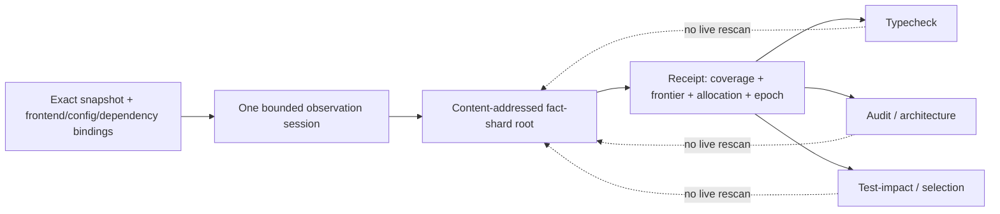

# Brownfield 导入

## 1. 所有权

本文拥有既有工程与外部类库进入 SEC 的 Attach→Lift→Reconcile→Adopt→Normalize 生命周期、typed invocation、owner migration、unknown/opaque 与安全导入条件。TypeScript 是首个 frontend；identity、Evidence 与阶段语义保持语言无关。Adopt 后的 entity realization、Placement、Change Locality、round-trip implementation 和旧地址退役由 `docs/implementation-architecture.md` 拥有；本文不能从路径/名字直接签发实现 owner。

~~~mermaid
flowchart LR
  A[Attach physical facts] --> L[Lift source model]
  L --> R[Reconcile candidates]
  R --> AD[Adopt governed authority]
  AD --> G[Govern operations]
  G --> N[Normalize deterministic projection]
~~~

每阶段增加可证明的理解或治理权力；源码可读、类型正确、AI 可生成调用都不等于业务语义恢复。

## 2. Subject 边界

`SEC repository`、`Target workspace`和`Project`的产品含义只引用[产品词汇](product.md)，本片段不重新定义。Brownfield 只增加导入所需的物理关系：

| Import subject | 含义 | 不能混用 |
|---|---|---|
| external package/source snapshot | 独立外部输入的 exact content subject | SEC authored source、业务 Definition |
| Git worktree observation | 某个 repository revision 的物理 checkout | workspace/project identity |
| path | snapshot 内的 Address | semantic identity、owner、permission |

裸 workspace/source/worktree/path 不能跨边界授权读取、写入或复用；它们只能通过产品词汇与本片段的 typed relation 进入导入闭包。

## 3. Attach：物理事实

Attach 对 exact physical identity 建 inventory，只回答“看见什么”。

| Inventory facet | 内容 |
|---|---|
| structure | repository/workspace/package/target/application/module |
| Git/content | tracked/untracked/ignored、mode、encoding、digest |
| topology | symlink/reparse、case、Unicode、containment |
| classification | source/generated/vendor/binary/secret/protected/temp/opaque |
| surface | public/release entry、config、resource、owner |
| package | exports/types/peer/transitive/lock/integrity/native/install/build |
| environment | toolchain/build system/workspace resolution |
| frontier | unreadable/unsupported/excluded/unresolved + reason |

Attach 默认不执行 target code、package scripts、build、browser 或 network。扫描/权限/parser/provider coverage 失败是 unknown，不是 absent。

## 4. Lift：Source Program

~~~mermaid
flowchart TD
  I[Physical inventory] --> F[Language frontend]
  F --> S[Syntax symbol type module facts]
  S --> A[Analysis candidates]
  A --> M[Canonical Source Program]
  M --> P[Bounded projections]
  P --> AU[Audit]
  P --> TI[Test Impact]
  P --> AR[Architecture]
  P --> AI[AI Read Plan]
~~~

### 模型层

| Layer | Facts |
|---|---|
| physical | workspace/package/target/file/module |
| language | export/declaration/type/reference/span/import/resolution |
| invocation | function/constructor/method/generic/overload/call candidate |
| analysis | control/data-flow/state/effect/framework candidate |
| classification | generated/vendor/protected/opaque |
| frontier | unresolved/ambiguous/provider conflict |

模型绑定 exact snapshot、compiler/provider/config/dependency generation、coverage、canonical digest，并 strict validate/order/freeze。rename/move、merge、overload、conditional export、monorepo、generated source、case/reparse 与 version skew 都必须有策略。

### One snapshot, one graph

同一 exact source snapshot 只编译一个 canonical Source Program。CLI、hook、workflow、test、Impact、Architecture 与 audit 只消费 bounded projections，不各自创建 AST、Language Service、resolver、path census、entrypoint list 或 cache。

~~~text
SourceClosure =
  entrypoint
  → handler
  → operation
  → capability/provider
  → Effect
  → settlement
  → readback
~~~

dynamic load、shell composition、reflection 或 external runner 无法解析时保留 unknown。consumer-zero 删除裁决必须覆盖 source/generated/runtime consumers、dependency/integrity、external capabilities、durable readers/writers、migration/retirement 与 opaque frontier。

Compiler/provider 只发布其能证明的 language facts；SEC 组合唯一 repository graph，不重写成熟 parser。clean/incremental outputs 必须 byte-equivalent。

### 4.1 一次观察会话、可验证事实分片与重算边界

“一次图”必须有可复用的输入凭证；仅约定消费者“不要重扫”不能阻止第二个
scanner。Source Program owner 对 exact snapshot 签发唯一观察凭证，所有下游只消费它
及其内容寻址分片：

```text
SourceProgramObservationReceipt = exact owner-issued {
  sourceProgramRef,
  sourceProgramDigest,
  exactSnapshotBindingRef,
  frontendBindingRef,
  compilerConfigRef,
  dependencyGenerationRef,
  factShardRootRef,
  coverageAndFrontierDigest,
  resourceAllocationRef,
  observationEpoch,
  receiptDigest
}

SourceFactShard = immutable derived {
  shardRef,
  sourceProgramReceiptRef,
  semanticKeyRange,
  declarations/references/effects/unknowns,
  predecessorShardRefs,
  shardDigest
}
```

`resourceAllocationRef`只引用[统一资源账本](system-architecture/operations-and-resources.md)，
不在 Brownfield 重复声明 timeout、bytes 或 process 数字。Receipt 是观察与复用的
边界，不是业务 Definition、Grant、Effect ticket 或 Evidence verdict；fact shard 是
加速投影，不是第二 Source Program。其判定链为：



```text
Reusable(receipt, consumer) iff
  verifyIssuerAndSourceProgram(receipt)
  ∧ exactSnapshot/frontend/config/dependency generation still active
  ∧ readback(factShardRootRef, shardDigest, coverageAndFrontierDigest)
  ∧ consumerQuery ⊆ receipt.coverage
  ∧ consumerAllocation ⊆ receipt.resourceAllocationRef
```

消费者禁止重新创建 AST、Language Service、resolver、PATH/文件 census 或直接读取
当前 filesystem/environment；若 Receipt 失效，只能由 Source Program owner 在父
operation 的剩余 allocation 内重新开启一次观察会话。失效原因（snapshot drift、
provider/config/dependency 变化、shard 缺失/损坏、权限、reparse、deadline、abort 或
opaque frontier）保持 typed `unresolved`，不得降级成空图、普通 cache miss 或隐式
全量 fallback。

| 模式 | 唯一允许的物理工作 | 禁止的捷径 | 结果边界 |
| --- | --- | --- | --- |
| cold | 一次 bounded census/parse，流式生成 shard，并在同一 allocation 内 readback | 先独立做 byte 全扫描，再让每个 consumer 重读 | receipt + shard root；未覆盖项进 frontier |
| warm | 验证 receipt、root physical/epoch 与所需 shard；只读取 reverse-reachable 分片 | 以 path、mtime、进程内对象或旧 PASS 跳过验证 | 与 cold 相同的语义 bytes |
| delta | 观察变更的 exact bytes，按反向依赖失效并重编受影响分片 | 因单文件变化重建全图，或以文件名猜 impact | unaffected shard 保持原 digest |
| budget/abort | 所有 read/parse/hash/settlement 消费同一父账本的 remaining；耗尽保留 frontier | 重置 timeout、另起 scanner/进程、把未读视为零 | typed `resource-exhausted`/`aborted`，不签发完整 coverage |

Windows ACL、目录链、进程句柄等物理事实属于其 Provider 的 retained capability；
观察会话只引用 provider-issued binding。新进程不得各自启动 PowerShell 证明；若同一
host capability 可安全复用，Provider 以 epoch/物理 readback 重验证后共享；否则返回
`capability-unavailable`，不以环境变量或路径字符串替代。该优化不引入 TypeScript
daemon：Language Service/本地 retained session 只能作为可替换 Provider，永远不能
拥有 Source Program 或跨消费者的语义 authority。

```text
OneObservationInvariant:
  one exact snapshot + one active frontend/config/dependency binding
  → at most one observation session and one canonical shard root

SemanticReuseInvariant:
  cold(receipt) ≡ warm(receipt) ≡ delta(receipt, unchanged closure)
  in semantic graph, coverage, unknown frontier and ActionKey inputs
```

任何直接消费 live source、创建第二 shard root、绕过 Receipt、扩大 allocation 或把
warm/delta 结果写成不同语义都产生 `source-observation-duplication` 或
`source-observation-authority-bypass`，在 Source Program/Implementation conformance
阶段拒绝。新增语言、Provider 或缓存只扩展其 Binding/Conformance，不复制这条观察链。

## 5. Generic external library binding

~~~mermaid
flowchart LR
  P[Exact package identity] --> E[Exported symbol]
  E --> T[TypedInvocation]
  T --> B[ExternalCallBinding]
  B --> C[Type-correct Target call]
  C --> D[Declared governed invocation]
  D --> PC[Provider or Adapter candidate]
  PC --> V[Conformance and Adopt]
~~~

### TypedInvocation contract

| Binding | 内容 |
|---|---|
| package | source/version/integrity/module export |
| symbol | function/constructor/method identity |
| call | call/construct、generic、overload |
| type | parameters、return、throw/async shape |
| data | input/output bindings |
| target | module resolution/Target requirement |
| unknown | Effect、Permission、resource、runtime behavior |

TypedInvocation 只承诺 observed call shape 与 typecheck；不承诺 business contract、Effect、idempotency、retry、timeout、cancellation、security 或 runtime behavior。

用户声明 Contract/Effect/Permission/resource/error/Target/Verification/owner 后，它成为 Governed Extension/Custom Provider candidate，不自动成为事实。源码、types、docs、tests、examples、trace 与 AI 可以补 candidate/Evidence；只有 External Provider governance、conformance、security/license 与 Adopt 后才能进入正式 catalog。

## 6. Maturity 与 Provider

Brownfield 生命周期和 external provider maturity 是两个正交轴：

| Brownfield state | 表示 |
|---|---|
| Attach | 物理可见 |
| Lift | 结构可理解 |
| Reconcile | 候选被比较 |
| Adopt | scope 内治理 authority |
| Govern | operations 受控 |
| Normalize | SEC-owned deterministic projection |

Provider maturity taxonomy、catalog eligibility 与 Support Claim 由 external-provider owner 独立拥有。一个 package 的不同 capabilities 可处于不同 maturity。

Provider receipt 绑定 identity、scope/revision、coverage/unsupported、authority class、diagnostics/unknown、Evidence refs 与 resource/Effect boundary。Provider 只能增加 Evidence/candidates；不能创建 authoritative Fact、source owner、writable path、Binding 或 Normalize decision。多个 providers 一致不升格。

## 7. Reconcile

Reconcile 只读比较 Source Program、Contract、Engineering IR、repository identity、owner policy、Target、Provider Evidence 与 competing explanations。

| Result | Meaning |
|---|---|
| accepted | 该 claim/binding 被 policy 或人接受 |
| rejected | 保留理由/Evidence，不等于删源码 |
| conflicted | 权威或候选互不兼容 |
| ambiguous | 多种解释仍可行 |
| unknown | coverage/semantics 不足 |
| opaque | 边界已知，内部不建模 |

同名、邻近路径、运行时偶遇、高 confidence、同 AST/API/signature 或框架惯例都不建立 canonical relation。

外部调用必须分开 observed type facts、user-declared Contract/Effect、inferred Provider candidate、conformance Evidence、catalog eligibility。

## 8. Adopt

~~~text
Adopted =
  explicit scoped decision
  + stable identity/source binding
  + one owner/writer/public surface
  + allowed operations/effects
  + Contract/Policy/Permission/Acceptance
  + owner-issued Verification obligations
  + preservation/migration/recovery/retirement
~~~

Adopt 不复制源码进 IR，不提高 inferred confidence，不把整个文件或 Provider 升格。没有 Block 的工程仍可有 Responsibility、Contract 与 governed mutation；历史 Slot grammar 不因 extension 需要而恢复。

Adopt Provider 只允许其进入 candidate catalog；最终选择属于 Implementation Resolution。

## 9. Normalize

~~~mermaid
flowchart TD
  G[Governed source] --> S{Semantic completeness?}
  S -- no --> K[Remain governed or opaque]
  S -- yes --> R{Round-trip and runtime parity?}
  R -- no --> K
  R -- yes --> M[Migration plan]
  M --> C[Consumer cutover]
  C --> D[Old writer adapter dependency retirement]
  D --> N[SEC-owned projection]
~~~

Normalize 必须证明：

1. Entity/Fact/behavior/Effect/Permission/error 完整；
2. source mapping、format/comments/public surface 符合政策；
3. Target lowering、Binding 与 bytes deterministic；
4. runtime/Acceptance + Compatibility Decision 证明适用 parity；
5. consumer migration、actual Delta/Impact 可接受；
6. rollback/recovery 可验证；
7. old writer/adapter/dependency/authority 已退役。

不能生成 TODO、any、empty adapter 伪装完成。

## 10. Implementation Resolution 边界

Brownfield 提供 adopted existing implementations、verified Provider/Adapter candidates、typed/custom governed candidates、Evidence/unknown、owner/Target/migration constraints。

它不拥有 hard eligibility、policy/tie-break、ResolutionDecision/Binding、Target Program 或 artifact publication。Resolver 选择 candidate 不能反向把 inferred behavior 变成 authoritative semantics。

## 11. Governed write

Attach、Lift、Reconcile 零 Effect。Adopt 后写入必须：

~~~mermaid
sequenceDiagram
  participant O as Operation registry
  participant S as Source owner
  participant T as Transaction
  participant V as Verification
  O->>S: resolve exact governed region
  S->>T: source binding + byte identity
  T->>T: lease journal isolated transform
  T->>T: source and semantic CAS
  T->>V: actual Delta Impact requirements
  V-->>T: typed result
  T->>T: publish or rollback/recovery
~~~

不完整 mapping、ambiguous owner、opaque side effect fail closed。Codemod/AST/LST/AI patch 是 proposal；parse/typecheck success 不等于 semantic/runtime parity。

## 12. 配置、资源与多语言

配置、thread/process/network/storage/environment/deployment/native capability 先是 observations；只有独立 owner、identity、lifecycle、Impact、Mutation、Verification 后才成为 domain/Target/Provider field。

| Language capability | Responsibility |
|---|---|
| frontend | syntax/symbol/type/module resolution/source map |
| analysis | control/data/effect/framework candidates |
| language service | reference/rename/import queries |
| transform | AST/LST/codemod/comment preservation |
| backend | Target Program → bytes |
| build/runtime adapter | physical toolchain/environment |

语言 AST/bytecode/compiler IR 不是 Engineering IR。同一品牌/package 不能隐式拥有全部 capabilities。

## 13. 安全

默认不上传源码、不读 secret/environment、不跟随越界 topology、不执行 install/build/test。runtime trace、package manager、browser、native helper 或 network 需要显式 capability、isolation、deadline、aggregate budgets、redaction、cleanup 与 Evidence scope。普通 temp directory 或 compiler validation 不是 sandbox。

## 14. 无代码逻辑验证

| 场景 | 必须结果 | 禁止 |
|---|---|---|
| scan permission denied | unknown | absent |
| package有types但Effect未知 | TypedInvocation | supported Provider |
| 多Provider给同一候选 | competing Evidence | majority authority |
| file moved | binding re-evaluation | path identity |
| adopted region含unowned comments | preserve | regeneration overwrite |
| Normalize缺runtime parity | remain governed | deterministic projection |
| no Block | normal Responsibility/Contract | Block-as-license |
| frontend parse dynamic import失败 | opaque frontier | regex补图 |
| current test imports package | consumer evidence | whole package consumer-zero |
| AI生成Adapter | candidate | catalog eligibility |

## 15. 完成条件

~~~text
BrownfieldClosed =
  exact bounded physical inventory
  AND one Source Program per snapshot
  AND explicit unknown/opaque frontier
  AND Reconcile is read-only
  AND Adopt is scoped and authoritative
  AND governed writes use canonical transaction
  AND Normalize proves parity/migration/retirement
  AND Provider and Resolution owners remain separate
~~~
