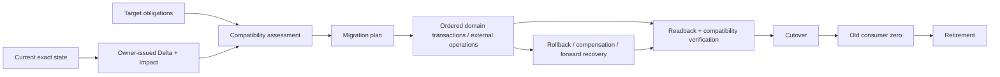
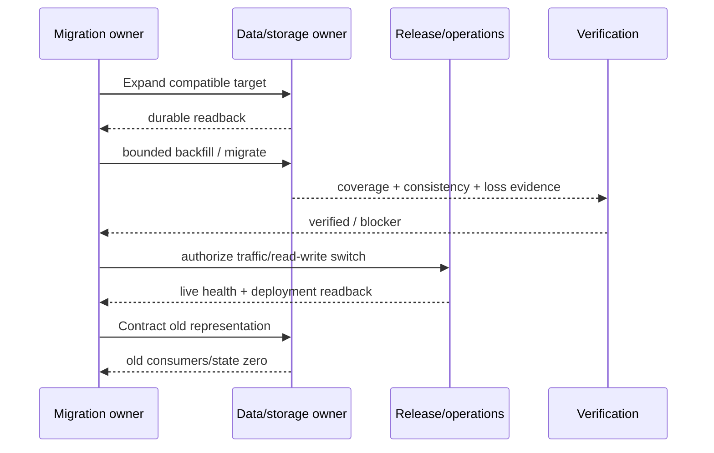
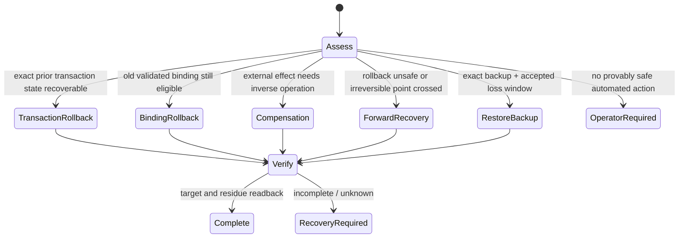

# 升级、迁移与变更管理

本文拥有跨 revision/system 的 Compatibility Decision、Migration、Binding migration、rollout、recovery strategy、deprecation 和 retirement。单次 canonical/source 写事务由 `docs/semantic-mutation.md` 拥有；Fact/Binding Delta 与 Impact 由 `docs/delta-and-impact.md` 拥有；本文只消费 owner-issued references，不重算 comparator、transaction 或 deployment truth。

## 1. 变更模型



变更维度彼此独立：

| Dimension | 可能变化 |
| --- | --- |
| Semantic | Contract、identity、Fact、Responsibility、state/effect/permission |
| Implementation | Provider、Adapter、package/config、Decision、Binding |
| Source/Artifact | Authoring Source、generated target、repository layout、distribution |
| Protocol/Data | schema、wire、database、message、durable runtime state |
| Runtime | Host、Target、toolchain、dependency、resource、external system |
| Governance | owner、workflow、Agent operation、Verification、Support |

一个 package/version/hash 不能代表全部维度；每个领域保持独立 identity/revision，Migration 只通过 typed refs 协调。

## 2. Mutation 与 Migration 边界

| Owner | 拥有 | 不拥有 |
| --- | --- | --- |
| Semantic Mutation | pure plan、workspace lease、CAS、journal、stage、verify、publish、transaction rollback/recovery/terminal | cross-version compatibility、consumer rollout |
| Delta/Impact | old/new exact structural differences 与 affected closure | migration choice、Effect |
| Change Management | compatibility、ordered migration、deployment、compensation、retirement | source-byte write、transaction terminal |
| Domain operations | exact Effects、settlement、independent readback | aggregate migration truth |
| Release/Operations | deployment/live health/support observation | source or compatibility truth |

```text
MigrationResult = compile(
  constituent transaction results,
  external operation settlements,
  compatibility verification,
  deployment/readback,
  recovery and retirement obligations
)
```

Migration 不得改写 constituent result。底层 `recovery-required` 时整体必须暂停并引用唯一恢复路径。

## 3. Upgrade/Migration Plan 合同

| Plan facet | 必须绑定 |
| --- | --- |
| Identity | preserved/replaced/split/merged/retired subjects |
| Delta | exact Fact/Binding/Artifact/Runtime Delta refs |
| Compatibility | direction、surface、rules、unknown |
| Impact | consumers、Responsibilities、Effects、permissions、artifacts、support |
| Operations | discriminated migration kind + ordered domain operations |
| Verification | old guarantees、新行为、failure/property、environment |
| Deployment | order、coexistence、backfill、switch、canary/downtime |
| Recovery | rollback/compensation/forward/backup/operator/irreversible point |
| Retirement | old writers/readers/providers/schemas/paths/tests/docs/state |
| Intent absorption | current observable value + accepted future obligations + lifecycle cost |

Plan 只携带该 migration kind 实际需要的字段；不适用字段在 type 中缺席，不使用 `null`、zero digest、dummy revision 或默认 Binding。执行前重新验证 source/target/policy/provider/consumer/Delta/Evidence/environment；任一变化使 Plan stale。

### 3.1 Intent absorption

```text
Supersedes(new, old) =
  current observable semantics covered
  ∧ accepted future obligations covered or explicitly rejected by owner
  ∧ failure/recovery/security/authority not weakened
  ∧ migration/retirement reachable
  ∧ lifecycle cost improved or justified by stronger proven correctness
```

future obligation 只有绑定 issuer、named consumer/Target、activation、acceptance、review/expiry 和 retirement 才成立。comment、roadmap词条、dead API、Vn、test name 和“以后可能”不是证据。

## 4. Compatibility Decision

Compatibility 不是 boolean：

| Axis | Values |
| --- | --- |
| temporal | backward / forward |
| operation | read / write / execute |
| surface | source / binary / schema / wire / behavior / semantic contract |
| environment | Host / Toolchain / Target / platform / dependency |
| provider | default behavior / timeout / retry / cancellation / errors / serialization / consistency |
| deployment | isolated / rolling coexistence / data migration / rollback |

### 4.1 决策矩阵

| Observation | Contract preserved? | Adapter can preserve? | Authorized semantic change? | Decision |
| --- | --- | --- | --- | --- |
| all directions verified | yes | n/a | n/a | compatible |
| default differs, explicit bounded adapter restores all obligations | no | yes | n/a | compatible-with-adapter |
| current provider ineligible, another candidate fully qualifies | no | n/a | no | provider-switch + migration |
| no candidate preserves semantics | no | no | yes | semantic-migration |
| coverage/Evidence incomplete | unknown | unknown | any | unknown / blocked |
| safety/data/authority invariant violated | no | no | cannot waive | breaking / rejected |

semver、package name、API shape、typecheck、release note、popularity 或 green tests 不决定 compatibility。Breaking change 需要 explicit decision、consumer census、migration、deprecation window 和 release authorization。

### 4.2 Binding migration outcomes

| Outcome | Required closure |
| --- | --- |
| Contract preserved | new Decision/Binding + re-verification |
| Adapter-preserved | versioned/bounded Adapter + Binding + conformance + retirement |
| Provider switch | new resolution + exact Binding Delta + compatibility + consumer/artifact migration + old provider zero |
| Semantic migration | authorized Contract change → new resolution → full migration |

Dependency bump 不能静默改变语义；pin/require/custom 不能绕过 hard eligibility；Adapter 不能吞错、隐藏 Effect 或降低 Acceptance。

## 5. Compatibility 只属于有终点的 Migration

| Required migration fact | 含义 |
| --- | --- |
| subjectIdentity | old/new stable SubjectRef；split、merge、replacement必须显式声明 |
| contractRevision | exact old/new schema、protocol、provider或API grammar revision |
| addressBinding | exact old/new Address与PhysicalBinding；path不能冒充Subject identity |
| externalStateClass | bounded physical universe；不是“也许有用户” |
| readers/writers | 分开列出；cutover先停止old writer/dual-write |
| census | byte-safe exact count + unknown frontier |
| converter | one-way conversion + CAS + readback + recovery owner |
| exitCondition | old state/consumer/unknown all zero |
| retirementAction | 同批删除 reader/parser/adapter/test/path/registry |
| expiry | 无进展/超窗 fail closed，不自动续期 |

at-rest durable state 的旧 grammar 只进入 authenticated one-way Migration，normal reader 单代际。只有真实 external negotiated/rolling protocol 无法原子切换时，才允许有 expiry 的 dual-read；dual-write 还需证明 writer authority 不冲突。仓内 caller、fixture、CLI flag、re-export、alias、default field 或同进程 API 不构成兼容理由。

## 6. 版本存在证明

### 6.1 版本判定矩阵

| 条件 | Schema/protocol version |
| --- | --- |
| 一个当前 grammar；全部 consumers 可原子迁移 | 删除 version 字段/后缀/dispatcher |
| 只在名称、constant、fixture、test 中出现 | orphan/duplicate-owner；删除 |
| durable bytes 有真实旧状态并需解释 | required；strict current parser + migration-only old parser |
| cross-process/external producers 并存 | required；negotiation/support window |
| rolling deployment 两代真实共存 | required；bounded compatibility + expiry |
| content revision/digest/epoch 仅用于 identity/CAS/freshness | 不是 schema version；保留在自己的 owner |

required version 必须绑定 versioned Subject、comparison/negotiation、support window、consumer set、Compatibility Decision、Migration/recovery、retirement 和 Evidence invalidation。release、schema、provider protocol、source revision、operation epoch、Evidence revision 彼此独立，禁止一个全局 `version`。

测试验证跨代行为、旧状态转换和 unknown/incompatible rejection，不验证数字本身。最后一个旧 consumer 退役时，old reader/converter/tests 同批删除。

## 7. Durable Schema

一个 required durable grammar 只有一个 owner，并同时提供：

| Boundary | Contract |
| --- | --- |
| identity | one schema identity constant + literal type；writers/readers/migrations import it |
| bytes | exact UTF-8/raw bytes、duplicate-key/trailing-data detection、canonical serialization |
| shape | strict keys/values、unknown schema/version reject |
| provenance | subject/producer/operation/source-target revision/artifact-set consistency |
| write | writer validation、durable publish、parent durability、exact-byte readback |
| failure | invalid/unknown/expired/unsafe/provenance mismatch保持typed blocker |
| evolution | compatibility/migration/recovery/retirement/resource budget |

normal reader 只接受 active grammar；old parser 只在 migration operation 内可达。partial/fork/foreign/digest drift/unsafe path/permission/deadline 不能降为 absent/cache miss/rematerialize。

Upgrade/version overlay 的存在由真实 `producer → resolver → migration → artifact → readback` 证明。保留时闭合全链；退役时原子删除 resolver、metadata、writer/reader、CLI、resources、tests、docs 和 registry。

## 8. Migration kind

每个 kind 必须声明：

| Category | Required fields |
| --- | --- |
| identity | kind、OperationKey、source/current/target revisions、scope |
| precondition | applicable Delta/Binding/Compatibility refs and physical preimage |
| preview | deterministic summary + expected Effects |
| execution | ordered operations/transactions、idempotency、reentrancy、checkpoint |
| lifecycle | apply/partial/pause/resume/terminal |
| reversibility | reversible / compensatable / forward-only / backup / operator / irreversible-after |
| proof | compatibility、verification、deployment、readback |
| exit | consumer migration、deprecation、retirement |

Migration不能重复执行“碰运气”；checkpoint只证明已观察状态，下一动作由 exact journal/result/external readback 决定。

## 9. 数据与部署



数据迁移额外要求：exact storage Binding、job identity/lease/checkpoint、bounded batches/rate/resources、deployment ordering、feature gate、loss/corruption verification、failure injection、backup loss window 和 irreversible point。删除旧字段/index/message/format/contract前必须证明全部 readers/writers/history/backups/recovery 已裁决。

## 10. Override

| Kind | Status | Required handling |
| --- | --- | --- |
| Manual generated-target edit | Drift | block upgrade；adopt、rule-back、absorb 或 discard |
| Rule-backed override | governed input | target/owner/precondition/provenance/verification |
| Implementation override | require/pin/custom constraint | only narrows eligible candidates |
| Emergency patch | bounded incident operation | owner/expiry/normalization or recovery plan |

Override 不得伪造 IR/Evidence、写 control truth 或绕过 Effect/Permission/Ownership/State contracts。改变 semantics 的 patch 必须进入 explicit Contract/Migration decision。

## 11. Recovery strategy



Artifact rollback 从 accepted canonical revision + validated Binding 重新生成；旧 output copy 不是 authority。Compensation 改变当前状态但不改写历史。越过 irreversible point 后只允许 forward recovery/operator path。

## 12. Deprecation 与 Retirement

Deprecation record：

```text
owner + affected consumers + replacement
+ support start/end + warning surface
+ migration Evidence + review trigger
```

Retirement admission：

```text
consumerZero =
  producers=0 ∧ readers=0 ∧ writers=0
  ∧ external/durable state=0
  ∧ active bindings=0
  ∧ accepted future obligations=0
  ∧ unknown frontier=0

retired =
  consumerZero
  ∧ replacement/semantic history still explainable
  ∧ support/deployment refs closed
  ∧ implementation/schema/provider/path/test/doc/registry removed
  ∧ retirement readback complete
```

任何维度非零为 typed blocker；任何维度全零则整图删除，不保留备用 Provider、compatibility shell 或空抽象。备用实现只有真实 failover contract、health/freshness、re-resolution 和定期 physical proof 才成立。

## 13. 冲突优先级

```text
Safety / non-waivable policy
≻ Data integrity
≻ Authoritative Contract + explicit product decision
≻ verified Compatibility + Migration
≻ governed Override
≻ automatic preference
≻ manual generated-target edit
```

AI confidence、mtime、代码量、Provider多数票、semver或merge成功不参与越权裁决。

## 14. 无代码逻辑验证

| Scenario | Required result | Forbidden shortcut |
| --- | --- | --- |
| package minor 但 retry/error 改变 | behavior unknown/breaking；migration required | semver=compatible |
| old durable records存在 | migration-only old parser；normal read blocked | default missing fields |
| all callers可同批更新 | breaking atomic cutover | dual-read alias |
| provider A unavailable | new Resolution + conformance or blocked | 自动选“最像”B |
| manual edit overlaps generated target | conflict + explicit user decision | mtime/AI merge |
| crash after backfill before switch | resume from checkpoint/readback | rerun whole migration |
| traffic switched, rollback unsafe | forward recovery/operator | copy old artifact |
| new system covers current behavior but drops accepted future obligation | design-intent-unresolved | zero import=delete |
| last old consumer removed | retire reader/converter/tests/state in same evolution | permanent compatibility |
| any constituent transaction recovery-required | aggregate migration paused | mark failed and continue |

## 15. 完成判据

```text
MigrationComplete =
  target in single canonical chain
  ∧ exact Delta/Binding/Compatibility traceable
  ∧ all transactions/operations terminal with readback
  ∧ compatibility directions and consumer rollout closed
  ∧ data/external Effects have owner settlement + physical readback
  ∧ recovery/irreversible/deployment boundaries resolved
  ∧ old writers/readers/providers/adapters/schemas/routes retired
  ∧ new artifact/deployment/support maturity independently observed
  ∧ migration machinery itself retired or still has a live migration consumer
```

Plan、dry-run、commit、typecheck、test、dependency install、PR merge 或 deployment command 只证明其各自一层。
