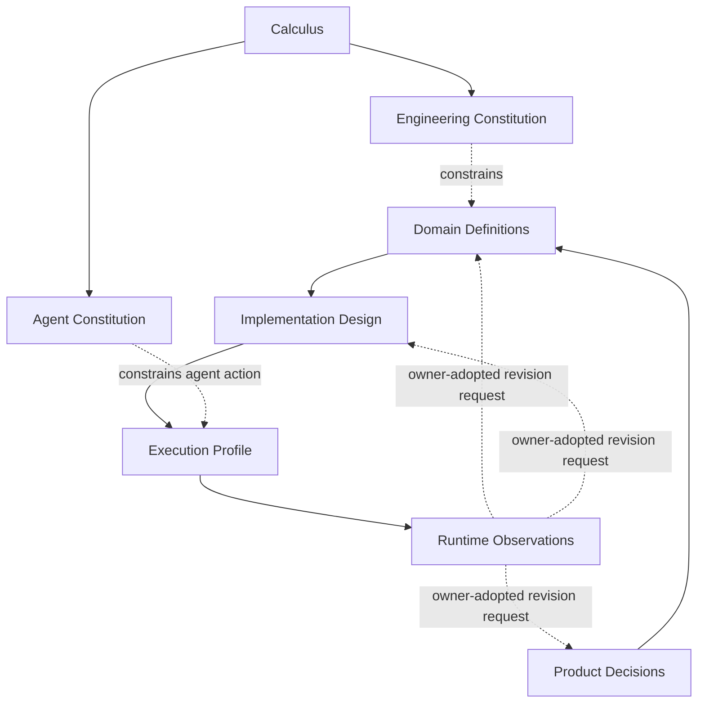

# 设计演算与原则语言

本文只拥有跨工程通用的statement、relation、constraint、behavior与principle表达代数。它不拥有SEC产品目标、Domain边界、Agent行为、实现技术、Provider选择或当前状态。设计候选合成与模型检查见 [Compilation](design-calculus/compilation.md)；知识产物、冻结、递归完成与演进见 [Freeze and Evolution](design-calculus/freeze-and-evolution.md)。

## 1. 因果语言

```text
Outcome → Definition → Requirement
        → Provision + AuthorityGrant → Binding → Allocation
        → Effect → Observation → Settlement/Readback
        → Claim/Evidence → Verdict/Unknown
        → Evolution/Cutover/Retirement
```

相邻项不互相蕴含。所有设计语言必须保持以下禁止转换：

```text
Hypothesis      -/-> Fact
Decision        -/-> Observation
Authorization   -/-> Truth or Capability
Provision       -/-> Authority or Success
Binding         -/-> Allocation or Effect
Observation     -/-> Definition or Authorization
Effect          -/-> Settlement or Verdict
Evidence        -/-> Effect or Claim identity
Unknown         -/-> Absent / False / PositiveClaim
Projection      -/-> Source / Owner / Grant
```

只有由对应owner定义、满足前置条件且可读回的typed transition才能改变statement或lifecycle种类。

## 2. Source strata 与依赖偏序



| stratum | owns | cannot own |
| --- | --- | --- |
| calculus | syntax/semantics of relations, constraints and derivations | engineering law、product answer |
| engineering constitution | universal engineering invariants | product/path/tool/current state |
| agent constitution | universal epistemic/action constraints for agents | product truth、runtime authority |
| product decisions | accepted outcome/non-goal/tradeoff | implementation、Effect、PASS |
| domain definitions | Subjects/invariants/state/failure/public operations | Provider availability、Evidence verdict |
| implementation design | logical→target realization | new product meaning、runtime success |
| execution profile | capabilities/bindings/resources/platform constraints | business definition/result |
| runtime observation | what actually happened and coverage | stable definition/future obligation |

Source strata是typed dependency order，不是物理目录、数字层级或强制阅读顺序。项目视图只聚合refs；不得成为额外source stratum或owner。

### 2.1 Named construct admission

命名空间不是架构。每个命名构件在一个generation中恰有一个primary role；role不同只能通过typed refs连接，不能复用同一payload冒充：

| role | 成立条件 | 不拥有 |
| --- | --- | --- |
| primitive | 不能由现有primitive及组合无损表达，并完成meta-model evolution | 产品名、工具名、当前实现 |
| semantic profile | 由primitive组成，具有独立laws、producer/consumer与failure semantics | 自动成为Domain、service或folder |
| accepted carrier | authorized owner采用的Definition/Decision/Policy/FutureObligation | implementation、Evidence、runtime success |
| compiled artifact | closed inputs + algorithm产生，可重建且有真实consumer | 上游meaning、issuer authority |
| runtime instance | exact operation generation中的Grant/Binding/Allocation/Attempt/Settlement等实例 | stable Definition、跨epoch identity |
| purpose view | 对既有refs的consumer/disclosure-bound projection | 新事实、owner、writeback |

```text
namedConstructAdmitted(x) iff
  exactlyOne(primaryRole(x))
  and exactlyOne(definitionOwner(x))
  and distinctLawsOrLifecycle(x)
  and (liveConsumer(x) or acceptedFutureObligation(x) or irreduciblePrimitive(x))
  and notDerivableAliasOfExistingConstruct(x)
```

算法、predicate和query是对构件求值的规则，不自动成为Subject；`Model`、`Graph`、`Package`、`Manager`、`Service`、任意容器名、`Vn`、文件或目录后缀都不提供存在证明。普通aggregate/value/function不需要升格。重复owner合并时保留meaning、rationale、consumer与reversal refs，删除别名而非删除业务义务。

文档伪代码使用以下判读，不让记法制造实体：

| form | meaning |
| --- | --- |
| `Noun = exact { ... }` / `Noun = A \| B` | 一个schema或closed ADT |
| `verb(inputs) = output` | derivation/query；不是owner |
| `...Closed`、`...Required`、`...Admitted`、`...Safe` | predicate；不是实体 |
| `...Ref` | 对既有identity/generation的引用；不复制payload |
| table/diagram/view | 同一refs的表达投影；不增加semantic node |

以下高风险词必须带role限定，禁止裸词跨层复用：

| word | canonical use | forbidden inference |
| --- | --- | --- |
| owner | ResponsibilityAssignment、RelationAuthorityAssignment或issuer policy | 文件、目录、团队、compiler、最后写入者 |
| source | KnowledgeSource、AuthoredSource或SourceObservation；只是carrier/input role | 文本天然正确或自行授权 |
| contract | 必须限定public semantic、durable schema、capability port、provider protocol或conformance boundary | 任意DTO、type、test文件 |
| compiler | exact input到typed output的pure transformation family | service、进程、owner、scheduler、Effect executor |
| model / graph | 必须限定purpose、generation、schema与coverage的artifact或view | 因后缀获得identity/authority |
| plan | 默认只指pure description；执行必须另有admission/grant/allocation | plan存在即获Effect权 |
| artifact | immutable carrier或compiled output | 其payload的semantic owner |
| package | 具有真实安装/发布/ABI/runtime/support lifecycle的分发单位 | 设计章节、scope容器、目录美观 |
| Project / Workspace | Project仅指独立产品/业务identity；Workspace是内容与交互环境实例 | 源码目录、worktree、IDE窗口互相冒充 |
| revision / generation / epoch / version | 分别是单Subject变化、闭合refs集合、运行有效期、兼容grammar discriminator | 用一个`Vn`或数字同时表达四者 |

## 3. 最小构件

```text
Subject    := stable semantic identity
Statement  := typed proposition about one or more Subjects
Relation   := issuer-owned typed connection among Subjects/Statements
Constraint := decidable predicate over Statements/Relations/Transitions
Transition := admitted change from exact pre-state to post-state
```

这是五个不可约语法构件。`Proof`不是第六种对象，而是`Claim + Evidence + proves relation + Verdict`的profile；`Frontier`不是第七种对象，而是`Unknown statements + affected relations + closure predicates`的profile。两者拥有严格laws和consumer，却不复制根ontology。

| primitive | 不可由其余项无损替代的能力 | 若错误合并 |
| --- | --- | --- |
| Subject | 在statement变化、address移动和generation演进间保持referent identity | 内容、路径或最新观察冒充身份 |
| Statement | 表达可被采纳、观察、证伪或判定的命题及认识状态 | 对象存在被误当成事实为真 |
| Relation | 表达多个exact subjects/statements之间有issuer的连接 | 字段共置、目录或时间相邻冒充因果 |
| Constraint | 对候选state/trace/relation集合做可组合的合法性判定 | 普通statement无法执行admission或产生最小冲突核 |
| Transition | 表达带pre/post、时序、权限和settlement义务的合法变化 | 静态relation无法区分允许结构与实际状态演进 |

若未来能给出保持全部laws、failure、consumer与演进语义的无损编码，其中任一primitive都必须继续合并；“已写很多schema”或兼容旧名称不是保留理由。

可消费项携带最小envelope：

```text
SemanticEnvelope = {
  identity,
  issuer + issuerAuthorityRef,
  subjectRefs + subjectRevisions,
  exactInputRefs + algorithmRef,
  generation/snapshot/operation epoch,
  coverage + unknownFrontier,
  validity + invalidation + retirement
}
```

Envelope只提供引用完整性与authority ceiling，不是全局可选字段DTO。Domain payload必须使用其自己的closed ADT/schema。

### 3.1 Statement kinds

```text
Statement.kind ∈ {
  Fact,
  Hypothesis,
  Decision,
  Authorization,
  Requirement,
  Provision,
  Observation,
  Evidence,
  Claim,
  Verdict,
  Unknown
}
```

每种variant有独立producer、admission、consumer与failure语义。缺失variant必须演进meta-model；不能放进`kind: string`、`misc`、nullable payload或默认branch。

系统高频名词是primitive的closed profiles，不是新增root types；下游owner只能收窄，不能重新解释：

| profile | primitive composition | exact specialization owner |
| --- | --- | --- |
| Outcome / NonGoal | Product owner采用的Decision + observable Behavior/Constraint refs | Product |
| Definition | Subject + accepted Statements/Relations/Constraints + adoption/assignment/reversal refs | owning Product/Domain responsibility |
| Invariant | 对允许states/transitions/traces的hard Constraint | owning state/contract responsibility |
| Policy | 条件到permit/require/forbid/derive结果的Decision/rule set | named policy responsibility |
| Responsibility | cohesive Definitions/decisions/state/public obligations的scope profile | System Architecture |
| Operation | input/precondition到Transition/result/failure/settlement obligations的behavior profile | owning Domain responsibility |
| Contract | 有独立consumer与evolution边界的Definition/Requirement/Result集合 | Engineering Semantics及qualified boundary owner |
| Workflow | public Operations的typed composition；不读取private state | System Architecture |
| Domain | 经boundary proof成立的cohesive semantic scope | Product definition + System Architecture proof |
| Proof | exact Claim、independent Evidence、`proves` relation与Verdict的闭合组合 | Claim/Evidence/Verdict responsibilities |
| Frontier | Unknown statements、affected closure与closure predicates的闭合组合 | 产生unknown的responsibility + closure owner |
| Artifact / View | exact meaning refs的representation或projection | producer/compiler或interface owner；无meaning ownership |

`Definition`因此不是Fact：Fact陈述在某coverage/snapshot下什么成立；Definition承诺某Subject在一个accepted generation中意味着什么。Observation可以触发Definition revision proposal，但不能直接改写Definition。

### 3.2 Behavior 与 Claim semantics

```text
BehaviorSemantics =
  | ExactFunction
  | DiscreteTransitionSystem
  | PartialOrderConcurrentSystem
  | ContinuousOrHybridDynamics
  | StochasticDistribution
  | AdversarialGameEnvironment
  | AdaptiveFeedbackSystem

ClaimSemantics =
  | ExactPredicate
  | BoundedPredicate
  | TemporalProperty
  | QuantitativeMetric
  | StatisticalClaim
  | RobustnessClaim
  | RelationalHyperproperty
```

Variation、measurement uncertainty与epistemic unknown正交。随机结果不是unknown；采样Evidence不能证明全称exact Claim；simulation不能证明physical Effect；单轨迹PASS不能证明noninterference或observational equivalence。

Adaptive/continuous/stochastic系统必须显式绑定model/data/policy revision、population/environment、sampling/calibration、feedback delay、guardrail、drift、human authority与retirement。模型范围外的输入形成frontier。

## 4. Typed relation algebra

| relation | answers | required refs | cannot replace |
| --- | --- | --- | --- |
| `defines` | Subject是什么、承诺什么 | owner/decision/reversal | implementation/test |
| `contains/scopes` | 哪些meaning共享cohesion parent | scope/boundary proof | dependency/path |
| `requires` | operation/consumer需要什么 | outcome/constraints/failure/terminal | provider/argv |
| `supplies` | capability/provider可供应什么 | provider/platform/limits | Requirement/Grant |
| `grants/delegates` | principal可做什么Effect | scope/precondition/expiry/revocation | availability/success |
| `binds` | exact Requirement采用哪个Provision/Grant | requirement/provision/grant/epoch | lookup/default |
| `allocates` | 从parent ledger保留多少 | demand/capacity/remaining | static ceiling |
| `observes` | 实际读/执行/计量什么 | method/target/coverage | expected/permission |
| `settles` | obligations、release、readback、residue | attempt/all effects/resources | exit/return |
| `proves` | Evidence支持哪个Claim | exact claim/independence/freshness | PASS/report |
| `projects` | 为consumer呈现哪些既有meaning | source closure/disclosure | new fact/owner |
| `evolves` | 代际如何preserve/migrate/retire | old/new/consumer/recovery | suffix/alias |

同一对象可参与多种relation；relation不可互换。Containment形成single-parent递归scope，其他relation保持graph/hyperedge/state-machine语义。

```text
RelationAdmitted(r) =
  exactSchema(r)
  and exactlyOneActiveRelationAuthorityAssignment(r.kind, r.subjectUniverse)
  and issuerMatchesAssignment(r)
  and exactSubjectRevisionsAndConstraintsAgree(r)
  and finiteAcyclicAuthorityClosureToActiveRoot(r)
```

同owner、同invariant、同revision/lifecycle且无独立consumer的relations可co-locate；否则必须以refs组合。正交分解不要求每个relation变成文件、class、service或runtime join。

## 5. Constraint algebra

```text
ConstraintResult =
  | Satisfied
  | Violated { code, evidenceRefs }
  | Conflicted { minimalConstraintCore, provenanceRefs }
  | Unresolved { frontierRefs }

admit(target) iff
  every hard constraint is Satisfied
  and every Unresolved frontier is disjoint from target dependencies
```

Hard constraints不可投票；一个identity/authority/integrity/evidence failure不能被多个PASS抵消。Soft preference只在所有hard constraints满足、无conflict且semantic trace合格的候选间比较。

```text
combine(A,B) = canonical(normalize(A ∪ B))

require commutative(combine)
    and associative(combine)
    and idempotent(combine)
```

`Conflicted`必须回到有权Decision owner；不得按输入顺序、priority或last-write-wins暗选。`Unresolved`不得降为普通violation、false或默认候选。

## 6. Identity、revision 与 representation

```text
semanticIdentity ⟂ activeOwner ⟂ scopeMembership ⟂ lifecycle
                 ⟂ subjectRevision ⟂ serializationNamespace
                 ⟂ address ⟂ presentationLabel
```

`SubjectRef`由有权identity namespace一次签发为稳定opaque key；owner、scope、lifecycle和Definition revision均通过独立typed relations绑定，不能嵌入identity。`SubjectRevisionRef`绑定`SubjectRef + exact accepted Definition generation/digest`，用于使旧meaning consumer与derived artifact精确stale。Owner transfer、scope reparent、address move或representation变化保持`SubjectRef`；真正split/merge/replacement必须使用显式identity evolution与consumer migration，不能复用或悄悄换key。

Schema/version仅在真实durable、cross-process、external或migration consumer需要区分可观察grammar时存在；serialization namespace也不能成为SubjectRef。Path、prefix、`Vn`、类型名、当前owner和显示标签均不能反向拥有identity。

Representation可以是ADT、schema、table、graph、state machine、formula、pseudocode或prose；每个representation只引用同一semantic node。换一种表达不能增加事实、Authority或完成状态。

## 7. 原则语言

```text
Principle = {
  principleRef,
  applicabilityUniverse,
  subjectRefs,
  preconditions,
  modality: require | forbid | permit | derive,
  predicate,
  observableOrRejection,
  rationaleRefs,
  counterexampleRefs,
  reversalCondition,
  ownerAndRevision
}
```

一项原则可有多个精确投影：

| view | purpose |
| --- | --- |
| normative sentence | 人类快速理解 |
| formal predicate | compiler判定 |
| role/boundary matrix | 明确owner、输入输出和禁区 |
| graph/state/sequence | 表示关系、层级与时间 |
| machine rejection | 使违反可观察且typed |
| counterexample/reversal | 暴露适用边界与演进条件 |

这些view共享一个`principleRef`。重复换措辞、历史争论、路径清单和仅强调“不要犯错”的文本不构成新知识。

### 7.1 Rationale closure

```text
DesignDecision = {
  decisionRef,
  subject and decision-dimension refs,
  problem/outcome refs,
  candidate and hard-constraint refs,
  selected candidate ref,
  objective/tradeoff and consequence refs,
  premise/evidence and rejected-candidate refs,
  responsibilityAssignmentRef,
  reversal predicates,
  decisionRevision
}
```

不可推导选择只author一次，并由该decision dimension的唯一`ResponsibilityAssignment`采用；cost vector、dominance、impact和projection由compiler生成。可由closed rule唯一推出的结果是derivation，不伪装成owner Decision；未闭合候选是Frontier，不允许compiler、scheduler、Provider、AI或当前文件作者暗选。理由不能依赖该选择后来产生的implementation、test或Verdict，否则是post-hoc self-proof。

删除任何设计知识前必须证明其meaning、rationale、future obligation与reversal在canonical graph中仍唯一可达。Git历史、AI记忆和“以后可以重想”都不是保存机制。

## 8. 通用性边界

Design Calculus适用于任意软件/系统，但不会强迫每个系统使用每个construct。Compiler按accepted behavior、relations和purpose计算applicability；无authority、resource、tenant、external、durable或migration关系的scope不会看到相应细节。

```text
CalculusClosed =
  every admitted construct has closed syntax and semantics
  and every conversion is explicit and owner-authorized
  and every relation has distinct laws and authority assignment
  and constraints compose deterministically
  and representation cannot alter meaning
  and unknown/open-world cases cannot gain positive semantics
  and meta-model extension preserves the old expressible subset or records retirement
```

<!-- sec-clause {"blocker":null,"kind":"stable-decision"} -->
## 规范片段

Design Calculus只定义跨工程通用的typed statements、relations、constraints、behavior、identity和principles；产品、Domain、Agent、实现与运行事实由其各自owner实例化。任何隐式类型转换、可选字段万能对象、representation升权或unknown降级都非法。
