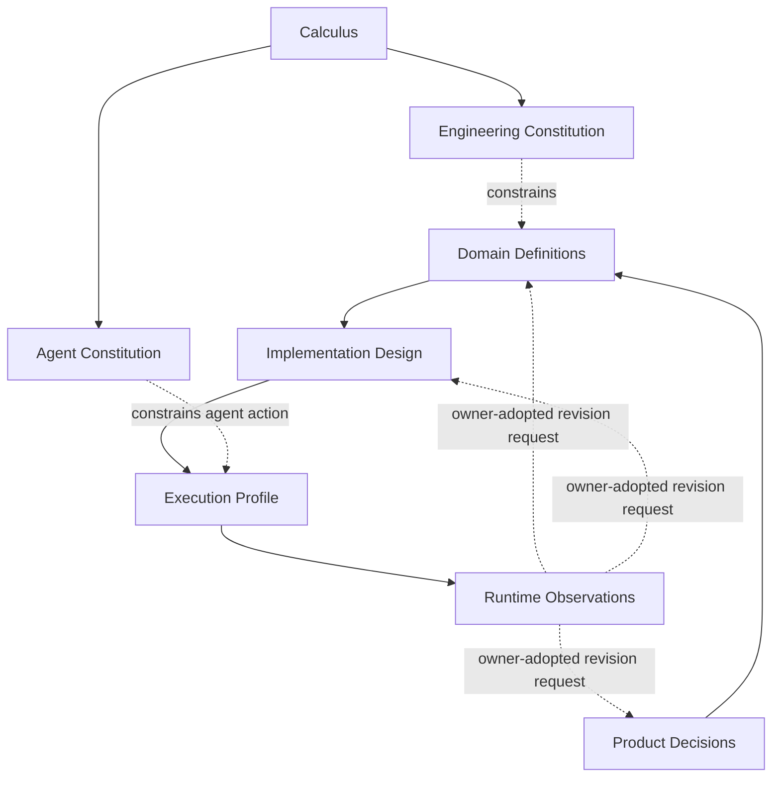

# 设计演算与原则语言

本文只拥有跨工程通用的 statement/semantic-role、typed relation、principle record、identity/representation separation 与 meta-model extension laws。Constraint 的可判定边界、Claim lowering、cost vector/Pareto/scalarization由 [Constraint、Claim Lowering 与多目标裁决](design-calculus/constraints-and-decision.md) 唯一拥有；candidate synthesis/model exploration由 [Compilation](design-calculus/compilation.md) 拥有；design knowledge/freeze/frontier/evolution由 [Freeze and Evolution](design-calculus/freeze-and-evolution.md) 拥有。

它不拥有 SEC 产品目标、Domain boundary、Agent 行为、实现技术、Provider选择、运行 Authority 或 current state。

## 1. 因果语言只表达关系，不自动蕴含下一层

```text
Outcome → Definition → Requirement
        → Provision + AuthorityGrant → Binding → Allocation
        → Effect → Observation → Settlement/Readback
        → Claim/Evidence → Verdict/Unknown
        → Evolution/Cutover/Retirement
```

这是一张 typed relation projection，不是把对象压成一条不可变流水线。以下转换永远需要独立 owner/transition：

```text
Hypothesis      -/-> Fact
Decision        -/-> Observation
Authorization   -/-> Truth or Capability
Provision       -/-> Authority or Success
Binding         -/-> Allocation or Effect
Observation     -/-> Definition or Authorization
Effect          -/-> Settlement or Verdict
Evidence        -/-> Effect or Claim identity
Unknown         -/-> Absent / False / PositiveClaim
Projection      -/-> Source / Owner / Grant
```

## 2. Source strata 与 Authority root 正交



Source stratum回答“meaning来自哪类 canonical source”；Authority root回答“谁有权采用/签发该 exact decision/effect”。Universal law definition 与 project adoption 不能被图上的上下游关系混成一个 owner；具体 root kinds见 `docs/system-architecture/authority-roots.md`。

## 3. Canonical kernel primitive

```text
CanonicalKernelPrimitive =
  | Subject
  | Statement
  | Relation
  | Constraint
  | Transition
```

这里的“canonical kernel”表示**当前最小且有独立工程语义的根角色集合**，不宣称已经形式证明它们在逻辑意义上绝对不可约。每个 primitive 只有在拥有独立 identity/admission/invalidation/consumer semantics，且删除/合并会丢失可观察工程区别时才保留。

| primitive | 独立能力 | 错误合并会造成 |
| --- | --- | --- |
| Subject | 跨内容、Address、revision保持 referent identity | 路径/内容/最新观察冒充身份 |
| Statement | 表达可采用、观察、证伪、授权、要求或未知的命题状态 | 对象存在被误当“事实为真” |
| Relation | 表达 exact Subjects/Statements 之间由 issuer 负责的连接 | 共置、目录、时间相邻冒充因果 |
| Constraint | 在 bounded typed universe 上执行合法性判定 | 普通 statement 被误当可机器 admission |
| Transition | 表达 pre/post、authority、effect/settlement 的合法变化 | 静态 relation 冒充实际状态演进 |

Constraint 的精确定义与 richer Claim 的 proof-obligation lowering不在本文件重复。未来若有更小 algebra 能保留全部 laws/failure/consumer/evolution semantics，应通过 meta-model evolution 合并；“已经有很多 schema”不是保留理由。

## 4. Named construct admission

命名空间不是本体。任何命名构件在一个 generation 中必须有一个 primary role：

```text
NamedConstructRole =
  | Primitive
  | SemanticProfile
  | AcceptedCarrier
  | CompiledArtifact
  | RuntimeInstance
  | PurposeView
```

```text
namedConstructAdmitted(x) iff
  exactlyOne(primaryRole(x))
  and exactlyOne(definitionOwner(x))
  and distinctLawsOrLifecycle(x)
  and (liveConsumer(x) or acceptedFutureObligation(x) or primitiveAdmission(x))
  and notDerivableAliasOfExistingConstruct(x)
```

`Model`、`Graph`、`Package`、`Manager`、`Service`、`Vn`、文件/目录后缀都不产生存在证明。算法、predicate、query是求值规则；只有它们本身存在独立 public/durable/evolution contract 时才升格为有 identity 的构件。

文档伪代码遵循：

| form | canonical interpretation |
| --- | --- |
| `Noun = exact { ... }` / `Noun = A \| B` | schema / closed ADT |
| `verb(inputs) = output` | derivation/query，不自动是 Subject/owner |
| `...Closed/...Required/...Admitted/...Safe` | predicate，不自动是 artifact |
| `...Ref` | identity/generation reference，不复制 payload |
| table/diagram/view | projection，不增加 semantic node |

## 5. Statement kinds

```text
StatementKind =
  | Fact
  | Hypothesis
  | Decision
  | Authorization
  | Requirement
  | Provision
  | Observation
  | Evidence
  | Claim
  | Verdict
  | Unknown
```

每种 variant 有独立 producer/admission/consumer/failure semantics。缺失 variant 必须通过 meta-model evolution 增加；不能塞进 `kind:string`、`misc` 或 nullable 万能 payload。

### Definition 不是 Fact

Definition 是 owner 对 Subject 在 accepted generation 中 meaning/invariants/public behavior 的采用；Fact/Observation 描述在某 exact world/snapshot/coverage 下观察到什么。Observation 可以触发 Definition revision proposal，但不能直接改写 Definition。

## 6. Semantic profiles 不是更多根 primitive

工程中高频对象由 kernel primitive 组合：

| profile | canonical composition / purpose | specialization owner |
| --- | --- | --- |
| Outcome / NonGoal | Product adopted Decision + observable behavior/constraint refs | Product |
| Definition | Subject + accepted Statements/Relations/Constraints + adoption/reversal | Product/Domain responsibility |
| Invariant | allowed states/transitions/traces 上的 hard constraint/proof obligation | state/contract responsibility |
| Policy | 条件到 permit/require/forbid/derive 的 adopted rule/Decision | named policy responsibility |
| Responsibility | cohesive Definitions/decisions/state/public obligations scope | System Architecture |
| Operation | input/precondition到Transition/result/failure/settlement obligations | Domain responsibility |
| Contract | 有独立 consumer/evolution boundary 的 Definition/Requirement/Result集合 | qualified semantic/contract owner |
| Workflow | public Operations 的 typed composition | System Architecture |
| Domain | 由 DomainBoundaryProof 成立的 cohesion scope | Product + System Architecture proof |
| Proof | Claim + independent Evidence + proves relation + Verdict | Verification responsibilities |
| Frontier | Unknown statements + affected closure + closure predicates | unknown producer + closure owner |
| Artifact / View | exact refs 的 representation/projection | compiler/interface owner，无 meaning ownership |

profile 拥有独立 laws/consumers 并不意味着要创建全局 service、folder、base class 或新的 root ontology。

## 7. Behavior 与 Claim semantics

```text
BehaviorSemantics =
  | ExactFunction
  | DiscreteTransitionSystem
  | PartialOrderConcurrentSystem
  | ContinuousOrHybridDynamics
  | StochasticDistribution
  | AdversarialGameEnvironment
  | AdaptiveFeedbackSystem

ClaimSemantics =
  | ExactPredicate
  | BoundedPredicate
  | TemporalProperty
  | QuantitativeMetric
  | StatisticalClaim
  | RobustnessClaim
  | RelationalHyperproperty
```

`ClaimSemantics` 不等于 `Constraint`。它必须由 [Constraint and Decision](design-calculus/constraints-and-decision.md) lower 到 decidable constraint、deductive proof、bounded model check、measurement/statistical/relational/robustness Evidence obligation 或 bounded frontier。

随机结果不等于 epistemic unknown；采样 Evidence 不能证明全称 exact Claim；单轨迹 PASS 不能自动证明 noninterference/observational equivalence。

## 8. Typed relation algebra

| relation | answers | required refs | cannot replace |
| --- | --- | --- | --- |
| `defines` | Subject 是什么、承诺什么 | owner/decision/reversal | implementation/test |
| `contains/scopes` | 哪些 meaning 共享 cohesion parent | scope/boundary proof | dependency/path |
| `requires` | operation/consumer 需要什么 | outcome/constraints/failure/terminal | provider/argv |
| `supplies` | capability/provider 可供应什么 | provider/platform/limits | Requirement/Grant |
| `grants/delegates` | principal 可做什么 Effect | scope/precondition/expiry/revocation | availability/success |
| `binds` | exact Requirement采用哪个Provision/Grant | requirement/provision/grant/epoch | lookup/default |
| `allocates` | parent resource owner给operation什么 allocation | demand/dimension/ledger | static ceiling |
| `observes` | 实际读/执行/计量什么 | method/target/coverage | expected/permission |
| `settles` | obligations/release/readback/residue | attempt/all effects/resources | exit/return |
| `proves` | Evidence 支持哪个 Claim | exact claim/independence/freshness | PASS/report |
| `projects` | 为 consumer 呈现哪些既有 meaning | source closure/disclosure | new fact/owner |
| `evolves` | 代际如何 preserve/migrate/retire | old/new/consumer/recovery | suffix/alias |

Containment形成 single-parent semantic scope；其他 relations保持 graph/hyperedge/state-machine semantics。relation kind 不能因为图里都画箭头就互相替代。

```text
RelationAdmitted(r) =
  exactSchema(r)
  and exactlyOneActiveRelationAuthorityAssignment(r.kind, r.subjectUniverse)
  and issuerMatchesAssignment(r)
  and exactSubjectRevisionsAgree(r)
  and finiteAcyclicAuthorityClosureToAdmittedRoot(r)
```

## 9. Principle record

一句口号不能成为工程原则。稳定 principle 最少包含：

```text
PrincipleRecord = exact {
  principleRef,
  normative statement,
  rationale / reality basis refs,
  assumptions and scope,
  formal predicate or proof-obligation refs,
  compiler input/output contract,
  rejection code,
  minimum counterexample,
  issuer/consumer refs,
  reversal predicate,
  machine projection refs
}
```

自然语言、公式、表、图、role matrix是同一 PrincipleRef 的不同 projection；任何 projection 不得独立改变 meaning。

## 10. Rationale 与不可推导选择

```text
DesignDecision = {
  decisionRef,
  subjectAndDecisionDimensionRefs,
  problem/outcomeRefs,
  candidate/hardConstraintRefs,
  selectedCandidateRef,
  objective/tradeoff/consequenceRefs,
  premise/evidence/rejectedCandidateRefs,
  responsibilityAssignmentRef,
  reversalPredicates,
  decisionRevision
}
```

可由 closed rule 唯一推出的是 derivation，不伪装成 owner Decision；多个 non-dominated 候选由该 decision dimension 的 ResponsibilityAssignment裁决；无 owner 时保持 Frontier。Cost/dominance 只引用 `design.cost-model` owner的结果，不在本文件重算。

理由不能依赖该选择后来生成的 implementation/test/Verdict 作为前提，否则形成 post-hoc self-proof。

## 11. Representation non-amplification

```text
Meaning(Project(x, view)) = permittedProjection(Meaning(x))
Authority(Project(x, view)) <= Authority(x)
```

文件、标题、表、图、JSON、IR、cache、UI、public docs、AI context都只是 carrier/projection。Representation 改变不能签发新的 Fact/Decision/Grant/Claim。

Semantic identity 也不由 representation address产生；Document/Clause 等具体规则由 Documentation owner refinement。

## 12. Future / open world

未来需求只有成为 owner-issued `FutureObligation` 才进入正式 design frontier；“以后可能”“名字像扩展点”“留下空接口更灵活”不是 Evidence。

新信息 x 的默认吸收路径：

```text
x as typed Statement/Relation/Observation/Constraint input
→ only its actual consumers gain an edge
→ reverse-reachable design/derivation closure stale
→ unrelated identities/artifacts remain stable
```

只有 x 无法由现有 kernel/profile/laws 无损表达，并具有新的独立 admission/authority/lifecycle/failure/consumer semantics 时，才允许 root meta-model evolution。

## 13. 通用性边界

Design Calculus适用于任意软件/系统，但不会强迫每个系统使用每个 profile。Compiler按 accepted behavior/relations/purpose计算 applicability；无 authority/resource/tenant/external/durable/migration关系的 scope 不生成对应细节。

```text
CalculusClosed =
  every admitted construct has one role/definition owner
  and every conversion is explicit and owner-authorized
  and every relation has distinct laws and authority assignment
  and constraint/claim evaluation routes to its sole owner
  and representation cannot alter meaning/authority
  and unknown/open-world cases cannot gain positive semantics
  and meta-model extension preserves the old expressible subset or records explicit migration/retirement
```

<!-- sec-clause {"id":"design-calculus-root","blocker":null,"kind":"stable-decision"} -->
## 规范片段

Design Calculus只定义跨工程通用的typed statement roles、relation algebra、principle/identity/representation laws；Constraint/Claim lowering/cost由独立owner拥有。当前五类kernel是可演进的canonical minimal kernel而非未经证明的绝对不可约集合；产品、Domain、Agent、实现与运行事实由各自owner实例化，新信息默认只局部增加typed edge并反向失效实际消费者。
