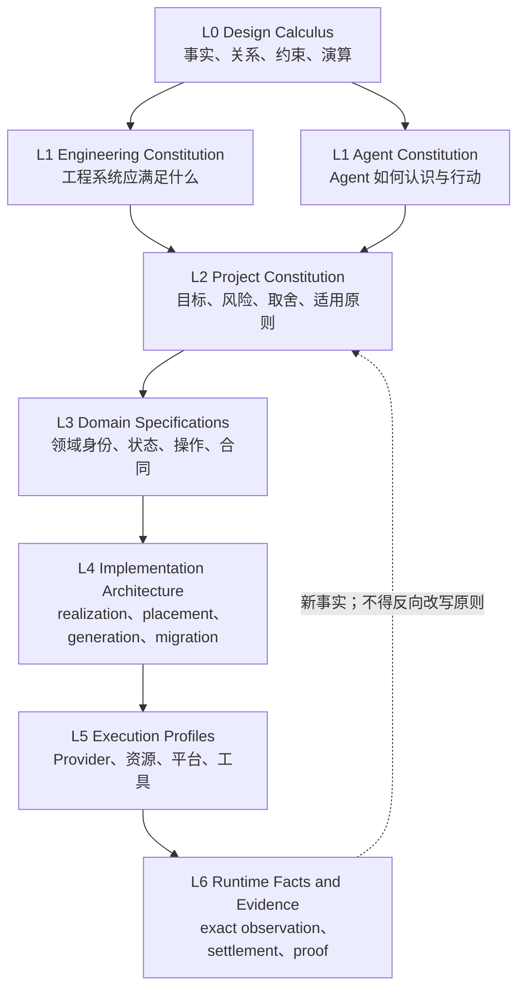
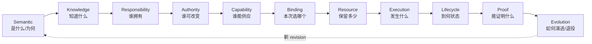
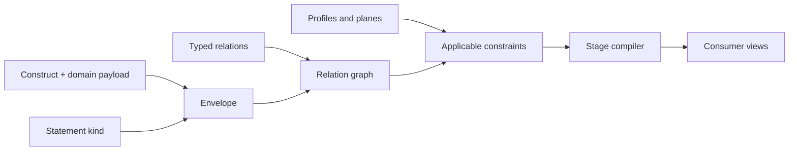
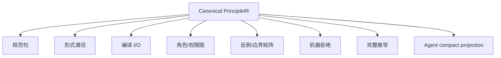
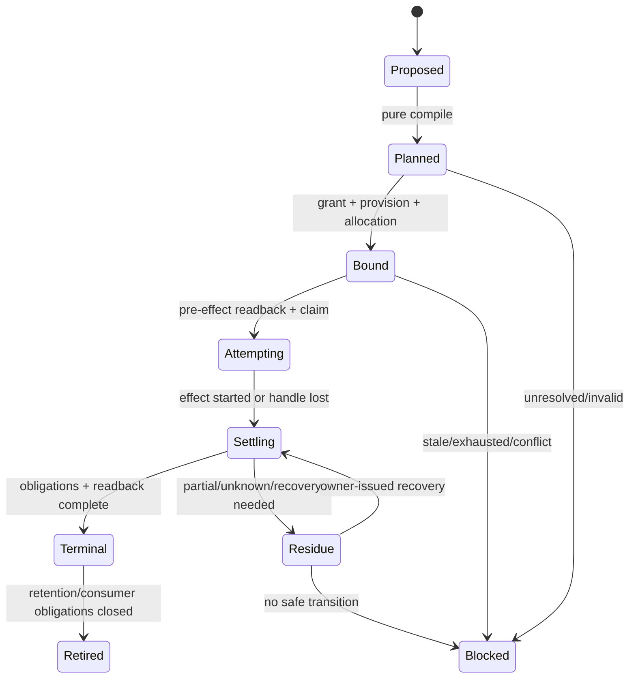
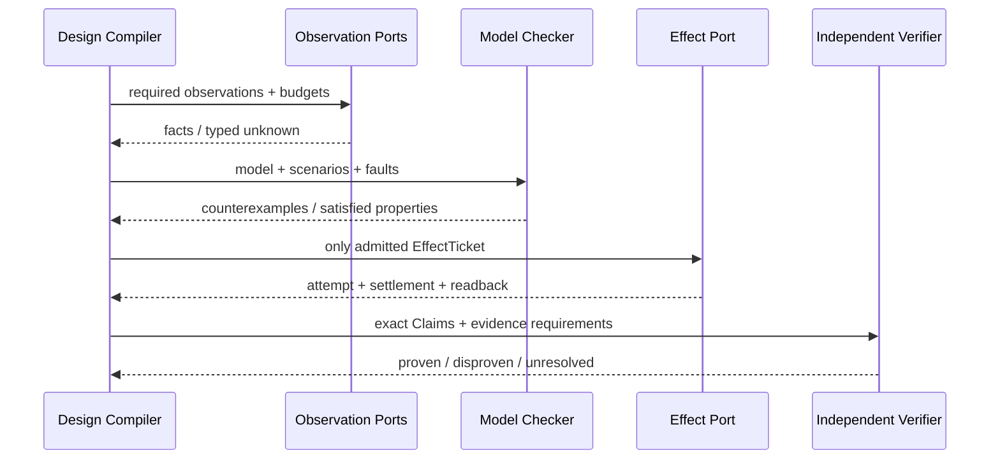
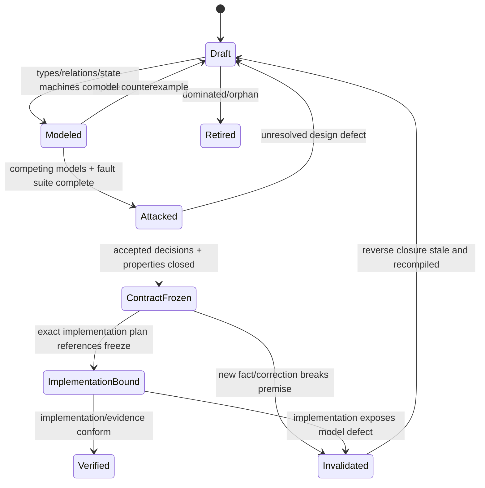
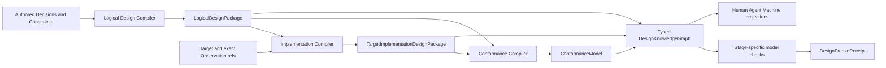

# 设计演算与原则语言

本文拥有跨项目可复用的设计逻辑：事实种类、正交关系、约束组合、原则记录、设计编译、反事实裁决、模型演算和演进判定。本文不拥有任何产品目标、工程取舍、Agent 行为、实现技术或当前状态。

## 1. 权威栈



| 层 | 只拥有 | 不得拥有 |
| --- | --- | --- |
| L0 | 表达和演算规则 | 工程原则、Agent 原则、产品答案 |
| L1 Engineering | 普适工程不变量 | 某项目路径、工具、当前实现 |
| L1 Agent | 普适认识与行动不变量 | 产品需求、工程事实、任务授权 |
| L2 Project | 项目目的、风险、全局取舍、原则实例化 | 领域字段和运行结果 |
| L3 Domain | 领域语义、状态机、操作、失败代数 | 外部能力可用性、独立证明 |
| L4 Implementation | logical→CodeUnit/package/file/generated realization、局部变更、迁移 | 产品目的、领域语义、运行成功 |
| L5 Execution | capability、binding、allocation、平台约束 | 产品目的、业务成功 |
| L6 Runtime | observation、settlement、evidence、unknown | 稳定定义、未来义务 |

依赖只能向下消费语言、向上产出受限事实。下层不能以“已经实现”“测试绿色”或“工具不支持”改写上层定义；上层不能以 prose 宣称下层 Effect、状态或 Evidence 已存在。

### 1.1 Constitution partition decision

| Alternative | Disposition | 原因 | 反转条件 |
| --- | --- | --- | --- |
| 一份总架构文档同时拥有逻辑、工程、Agent、项目机制 | rejected | owner 混叠；通用原则随项目细节漂移；投影无法证明不扩权 | none；只可作为 generated combined view |
| 只拆 Engineering 与 Agent 两层 | rejected | 两者会重复事实种类、关系、约束和原则表达语言 | 存在另一项不复制且更小的共享语义机制 |
| Design Calculus + Engineering Constitution + Agent Constitution + generated Project composition | selected | meta-language、工程真值、Agent 行为正交；项目只实例化；可单独演进和验证 | 出现不能由 typed reference 组合、且必须共同原子演进的真实语义反例 |
| 每个项目复制一套通用原则 | rejected | 多 owner、漂移、纠错不能全局传播 | 项目原则语义已证明不再通用，应迁成项目 decision 而非复制 |

`selected` 的含义是唯一 owner 和依赖方向，不要求人类按四份文档顺序阅读；human/Agent/project views由 registry 和 compiler 按问题生成最小闭包。

## 2. 最小逻辑代数

### 2.1 基本构件

```text
Subject    := 具有稳定语义身份的对象
Claim      := 关于一个或多个 Subject、可判定真假的命题
Relation   := 由明确 issuer 签发的 typed edge
Constraint := 对一组 Claim/Relation/Transition 的可判定谓词
Transition := 从 exact pre-state 到 post-state 的允许变化
Proof      := Evidence 对 exact Claim 的支持关系；不是 Claim 本身
Unknown    := 已知覆盖边界之外、尚不可安全归真的命题集合
```

每个可消费的 Claim、Relation、Transition 与 Proof 都携带同一最小封套：

```text
Envelope = {
  identity,
  issuer + issuerAuthority,
  subjects + subjectRevisions,
  exactInputs + algorithmIdentity,
  snapshotOrOperationEpoch,
  coverage + unknownFrontier,
  validity + invalidation + retirement
}
```

封套提供引用完整性，不提供万能 payload。领域数据由领域合同拥有；禁止用“所有字段可选”的全局对象替代领域类型。

### 2.2 陈述分类

```text
Statement =
  | Fact               // 已观察且有来源、覆盖、freshness
  | Hypothesis         // 可证伪解释或方案
  | Decision           // 有权主体接受的不可推导取舍
  | Authorization      // 对 exact Effect 的上限
  | Requirement        // consumer/operation 所需合同
  | Observation        // exact read/attempt/measurement
  | Evidence           // 支持特定 Claim 的独立事实
  | Unknown            // 无法安全归类或覆盖不足
```

禁止转换：

```text
Hypothesis   -/-> Fact
Decision     -/-> Observation
Authorization-/-> Truth
Observation  -/-> Authorization
Evidence     -/-> Effect
Unknown      -/-> PositiveClaim
```

只有显式、由 owner 定义并满足前置条件的 transition 才允许改变种类。

## 3. 正交关系与相互约束

正交表示“回答不同问题、不能相互替代”；约束表示“一个维度的合法性可引用另一个维度的 exact 事实”。两者不是冲突：维度保持独立，合法性通过 typed reference 组合。



| Relation | 回答 | 必需引用 | 不能替代 |
| --- | --- | --- | --- |
| Address | Subject 在 exact snapshot 中位于何处 | subject revision、snapshot | identity、owner、长期语义 |
| Definition | owner 接受的意图、不变量、结果、未来义务 | subject、issuer、reversal | implementation、test、current fact |
| Requirement | consumer/operation 需要什么语义、能力、资源、失败和终止 | consumer、operation、constraints | provider、argv、path |
| Provision | capability/provider 能供应什么 | provider identity、platform、limits | requirement、authority、成功 |
| AuthorityGrant | principal 可对哪些 exact Subject 做哪些 Effect | principal、scope、preconditions、expiry | capability、计划、caller DTO |
| Binding | 本次 Requirement 与 exact Provision 的匹配 | requirement、provision、grant、epoch | lookup result、default provider |
| Allocation | 从 parent ledger 实际保留多少 | binding、parent ledger、remaining | static ceiling、局部 timeout |
| Observation | 实际读到、加载、执行或计量什么 | exact target、method、coverage | expected、plan、permission |
| Settlement | 使用、释放、终止、readback、residue 的结果 | attempt、all obligations、resources | exit code、callback return |
| Lifecycle | create→active→terminal/residue→retired | state owner、legal transitions | boolean、file exists |
| Derivation | output 如何由 exact inputs 和 algorithm 确定产生 | all inputs、algorithm、unknown | 名称相似、时间相邻 |
| EvidenceSupports | 哪些独立事实支持哪个 exact Claim | claim、observations、independence | 无 Claim 的 PASS、report |

### 3.1 约束组合

```text
ConstraintResult = satisfied | violated(code, evidence) | unresolved(frontier)

admit(target) iff
  all hard constraints(target) = satisfied
  and every unresolved frontier is disjoint from target dependencies
```

硬约束不可投票：一个 authority、identity、durable integrity 或 evidence honesty 失败不能被多个 PASS 抵消。软偏好只在所有硬约束均满足的候选之间做 dominance 比较。

### 3.2 引用而非继承

```text
Requirement.resourceRef -> ResourceBudget.identity
Binding.grantRef         -> AuthorityGrant.identity
Settlement.attemptRef    -> Attempt.identity
Evidence.claimRef        -> Claim.identity
```

引用方保存 identity/digest，不复制被引用对象的 fields。被引用 revision 变化时，依赖图使引用方 stale；禁止靠字段继承、字符串拼接或路径镜像保持“同步”。

### 3.3 信息坐标：这些概念不是同义层级

`construct / statement / relation / profile / plane / constraint family / stage / entity family / view` 是同一设计事实的正交坐标，不是九套并列 ontology，也不是从抽象到具体的单链继承。

| 维度 | 回答 | 典型值 | 不回答 |
| --- | --- | --- | --- |
| Construct | 这个事实由哪种最小逻辑构件表达 | Subject、Claim、Relation、Constraint、Transition、Proof、Unknown | 来源是否可靠、属于哪个业务 |
| StatementKind | 当前陈述凭什么成立 | Fact、Hypothesis、Decision、Authorization、Requirement、Observation、Evidence、Unknown | 它和谁连接、何时执行 |
| RelationKind | 两个 exact Subjects 怎样连接 | Definition、Requires、Provides、Binds、Allocates、Settles、EvidenceSupports | payload 内容、执行顺序 |
| Profile | 哪组已接受规则适用于当前 Project/Target/Environment | Project Constitution、Target Profile、Execution Profile | 新事实、实现成功 |
| Plane | 从哪个独立责任维度观察系统 | Semantic、Knowledge、Responsibility、Authority、Capability/Resource、Execution、Lifecycle/Proof、Evolution、Interface | 时间阶段、文件位置 |
| ConstraintFamily | 哪类合法性必须合取验证 | identity、uniqueness、authority、resource、recovery、coverage 等 | 软偏好、实现候选排名 |
| Stage | 哪些输入必须先存在才能纯编译下一产物 | outcome→observation→semantics→responsibility→operation→execution→proof→evolution | owner 身份、物理并发线程 |
| EntityFamily | domain payload 属于哪种可独立拥有和演进的业务族 | Operation、Grant、Binding、State、Evidence、Migration 等 | 通用 relation 的语义 |
| View | 哪个 consumer 需要哪种无增权投影 | human、machine admission、Agent context、runtime query | 第二真相、裁剪掉的 blocker |

任一可消费事实都有一个概念坐标，但不实现为“所有字段可选”的万能 DTO：

```text
InformationCoordinate =
  domainTypedPayload
  + Envelope reference
  + StatementKind
  + applicable Plane/Profile/Constraint refs
  + typed Relations
  + lifecycle/coverage/unknown
```



组织规则：Construct 定义表达能力；StatementKind 保存认识论来源；Relation 组成因果图；Profile 选择适用规则；Plane 保持责任正交；Constraint 做合法性合取；Stage 规定因果偏序；EntityFamily 承载领域 payload；View 只做无增权投影。新增概念前必须证明无法由这九个坐标之一表达，否则属于重复 meta-model。

### 3.4 系统不等于一张无类型的图

关系图只是共同底座；完整系统模型还包含领域 payload、合法性、数量、时间、状态和覆盖：

```text
SystemModel =
  typed attributed hypergraph(Subjects, Relations, Envelopes)
  + constraint algebra
  + transition/state machines
  + resource quantities and ledgers
  + temporal/freshness rules
  + Profiles and layer grammar
  + coverage and Unknown frontier
```

一条多方约束可表达为有 identity 的 relation node/hyperedge，而不是复制成若干二元布尔字段。State transition、allocation consumption、deadline 和 settlement 不能只靠静态 edge 表达；它们分别由 transition、resource 与 temporal semantics 验证。

系统共享一个 canonical identity/reference space，但不构造一个所有字段可选的 monolithic graph：

| Generated projection | 只回答 | 必须保持 |
| --- | --- | --- |
| semantic/causal graph | 什么成立、为何成立 | Definition、provenance、unknown |
| owner/dependency DAG | 谁拥有、谁可依赖谁 | unique owner、acyclic layers |
| workflow DAG | 哪些 DomainOperations 以何种结果依赖组合 | operation boundary、guards、compensation |
| capability/binding graph | 哪项 Requirement 由哪个 Provision 满足 | grant、profile、freshness |
| resource graph/ledger | 哪个 parent 向哪些 attempt 分配多少 | conservation、release、leak |
| state/transition system | 哪些状态变化合法 | pre-state、CAS、terminal/residue |
| provenance/Evidence DAG | observation 可支持哪些 Claim | independence、coverage、freshness |
| evolution graph | old/new generation 如何迁移和退役 | conservation、cutover、consumer-zero |

每个 node/edge 都引用 `layer + plane + owner + revision`；跨层只能使用声明过的 `refines | materializes | observes | binds | settles | proves | projects | migrates` 等 relation。不同层级信息只能在`DesignKnowledgeGraph`中通过typed refs组合验证，不能共用identity、payload或writer；任意view只保留所需refs和typed frontier，不能把多个层压成一份自由JSON。

### 3.5 正交分解不等于物理碎片化

语义分解与实现聚合是两次不同演算：

```text
SemanticSplitRequired(a, b) iff
  owner(a) != owner(b)
  ∨ authority(a) != authority(b)
  ∨ lifecycle(a) != lifecycle(b)
  ∨ revisionOrInvalidation(a) != revisionOrInvalidation(b)
  ∨ consumerCanLegitimatelyObserveOneWithoutTheOther(a, b)

PhysicalCoLocationPreferred(a, b) iff
  sameOwnerAndTrustBoundary(a, b)
  ∧ sameAtomicConsistencyAndLifecycle(a, b)
  ∧ highCoChangeOrReadTogether(a, b)
  ∧ noIndependentPublicConsumer(a, b)
  ∧ lifecycleCost(coLocated) < lifecycleCost(separate)
```

| 语义结果 | 实现结果 |
| --- | --- |
| 不满足`SemanticSplitRequired`且强共变 | 同一typed aggregate/CodeUnit，不造relation、port或文件 |
| 语义独立但同owner、同事务、总是一起消费 | payload保持typed字段，物理共置并一次parse/commit |
| owner/Authority/lifecycle/version独立 | 分离identity与contract，通过typed ref组合 |
| 跨cell高频稳定组合 | compiler物化content-addressed package/index/view，consumer一次读取 |
| 开放式低频查询 | 按需求编译最小closure，不预聚合全世界 |

`Orthogonality`禁止概念冒充，不要求“一项关系一个对象、文件、包、服务或网络调用”。`Composition`也不是每次业务执行时临时join所有原子；authoring graph经compiler形成按consumer裁剪且可缓存的immutable aggregate。任何拆分必须给出独立变化/权限/生命周期/consumer收益和全生命周期成本；否则判为`over-factored`并合并。任何合并必须证明不会吞掉独立owner、invalidations或unknown；否则判为`boundary-collapse`并拆分。

## 4. 原则记录与多视图精确表达

一条原则只有一个 identity。权威语义是可计算的 `PrincipleIR`；自然语言、图和 compact context 都是投影：

```text
PrincipleIR = {
  identity,
  class,                 // engineering | agent
  quantifiedSubjects,
  predicates,
  precedence,
  compilerInputs,
  compilerOutputs,
  roles,
  rejectionCodes,
  counterexampleFamilies,
  reversalPredicate,
  materializationTargets
}

PrincipleRecord = {
  semanticCore: PrincipleIR,
  purposeRefs,
  sourceStatementRefs,
  premiseRefs,
  alternativeSetRef,
  selectedBecauseRef,
  avoidedFaultFamilyRefs,
  acceptedConsequenceRefs,
  proofObligationRefs,
  carryingCostRef,
  reversalPredicateRef,
  supersedesRefs,
  acceptedBy + authority
}
```



这些视图可以长度不同、表达方式不同，但必须语义等价：

```text
meaningDigest(view) = digest(canonical PrincipleIR)
blockers(view)       = rejectionCodes(PrincipleIR)
unknown(view)        = unknownSemantics(PrincipleIR)
```

`PrincipleRecord`只保存不可推导选择及typed refs；候选生成、约束结果、成本、fault traces与投影由compiler产生。自然语言只能解释这些refs，不能改变IR；若文字无法由IR和refs支持，投影拒绝发布。多种表达只适用于原则等需要消歧的高阶约束；普通事实选择一项最合适的载体。不得为了“多视图”复制状态、路径、实现清单或当前结果。

### 4.1 来源、目的与理由闭包

“为什么”不是一个自由文本字段，而是对不同事实种类的typed query。每个可接受的设计node/edge必须能沿唯一知识图回答其适用问题：

| Query | 必须返回 | 不得用作答案 |
| --- | --- | --- |
| `sourceOf(x)` | statement kind、issuer、authority、coverage、freshness、contradiction frontier | 聊天摘要、作者名、同名常量 |
| `purposeOf(x)` | accepted outcome/non-goal/future obligation refs | “可能有用”、实现已存在 |
| `whyExists(x)` | requirement reachability或accepted FutureObligation + deletion counterfactual | 文件被引用、测试存在 |
| `whyThisShape(x)` | exact premises、适用constraints、candidate coverage、dominance trace | 首个可行方案、个人偏好 |
| `whyNot(a)` | hard violation或被另一候选支配的exact trace | 没实现过、名字不好 |
| `avoids(x)` | fault/counterexample → rejected outcome/constraint → selected property | 手写风险清单、空泛“更安全” |
| `costOf(x)` | 全生命周期cost vector与承担者 | 仅代码行数或单次命令时间 |
| `proves(x)` | conformance obligation、independent evidence class、unknown | producer自报PASS |
| `whenReverse(x)` | reversal predicate、invalidation reverse closure、retirement obligation | “未来再评估” |

```text
DesignSourceStatement = {
  identity,
  statementRef,
  statementKind: Fact | Hypothesis | Decision | Authorization | Requirement |
                 Observation | Evidence | Unknown,
  semanticRole: outcome | non-goal | obligation | principle | domain-definition |
                external-contract | measurement | constraint-input,
  issuerRef + issuerAuthority,
  subjectRevisionRefs,
  coverage + freshness,
  contradictionRefs + unknownFrontierRef
}

DesignExplanationTrace =
  | ProvenanceTrace(sourceStatementRefs, issuerChain, coverage, contradictionFrontier)
  | PurposeTrace(outcomeRefs, nonGoalRefs, obligationRefs)
  | DerivationTrace(exactInputRefs, algorithmRef, outputRef, unknownFrontier)
  | ExistenceTrace(requirementReachability, deletionCounterfactual, carryingCost)
  | SelectionTrace(candidateCoverage, hardConstraintResults, dominance, rejectedCandidates)
  | FaultAvoidanceTrace(faultRef, rejectedOutcomeRef, preservedPropertyRef)
  | ConsequenceTrace(benefitRefs, acceptedCostRefs, costBearers, lostOptionRefs)
  | ProofObligationTrace(claimRefs, conformanceRefs, independence, unresolved)
  | ReversalTrace(predicateRef, invalidationReverseClosure, retirementObligations)

DesignRationaleIndex = {
  subjectRef,
  applicableQuerySet,
  explanationTraceRefs,
  unresolvedQueryRefs,
  meaningDigest
}
```

`applicableQuerySet`由subject kind、plane和relations编译，不要求无关对象填写空字段。`DesignRationaleIndex`与各trace从owner records、exact observations和compiler traces生成，不是第二份decision log。事实使用provenance，派生结论使用derivation，授权使用issuer chain，选择使用selection，未知使用frontier；禁止把所有对象强塞进`DesignDecision`，也禁止用一个万能trace或自由“rationale”掩盖不同认识论来源。

| Source statement kind | 可参与设计的方式 | 不能产生 |
| --- | --- | --- |
| Decision | 定义accepted outcome、non-goal、tradeoff或FutureObligation | Observation、Effect、PASS |
| Fact / external contract | 作为有coverage与freshness的premise/constraint | 无界全局真理 |
| Requirement | 进入requirement closure并由consumer reachability验证 | Provision、Authority |
| Observation | 更新exact world model、cost或counterexample | 永久Definition、授权 |
| Evidence | 支持exact Claim并携带independence/freshness | Product choice、Effect |
| Authorization | 只收窄当前设计/实现operation可做的Effect | 设计正确性、长期owner |
| Hypothesis | 生成候选、实验或可证伪解释 | accepted设计 |
| Unknown | 扩大frontier、阻断受影响正向Claim | absent、mismatch、success |

用户欲望或maintainer取舍只有在对应Product/Domain decision authority接受后才成为`Decision`；用户提出的技术形状、Agent建议、Skill规则和既有代码默认是`Hypothesis`。这既不把用户终局结果降格，也不把任一技术措辞自动提升为永久架构真理。

```text
RationaleComplete(x) =
  sourceOf(x) is typed
  ∧ purposeOf(x) reaches accepted outcome/non-goal/obligation
  ∧ (derived(x) -> exact Derivation trace)
  ∧ (chosen(x) -> bounded candidate coverage + dominance + consequences)
  ∧ (effectRelevant(x) -> avoided fault + settlement/proof obligations)
  ∧ reversal and unknown frontier are explicit
```

理由必须在实现admission前绑定到输入revision。实现成功、测试PASS、已有调用者或迁移成本只能成为后续Observation/cost input，不能反向改写原选择理由；否则是post-hoc rationale laundering。方案空间不可能宣称无限完备，只能证明已声明设计轴的generated coverage，并把未覆盖轴保留为bounded unknown。

## 5. 设计编译器

### 5.1 输入与输出

```text
DesignInput = {
  acceptedOutcomes,
  nonGoals,
  classifiedStatements,
  exactObservations,
  declaredUniverseAndCoverage,
  engineeringPrinciples,
  projectDecisions,
  domainDefinitions,
  capabilityFacts,
  resourceFacts,
  existingGraph,
  futureObligations,
  candidateGenerators,
  costAndDominanceCriteria,
  unknownFrontier
}

DesignVerdict = {
  status: admitted | blocked | proposal | retired,
  coverageTensor,
  minimalCausalGraph,
  candidateModels,
  objectDispositions,
  ownerDag,
  requirementDag,
  purePlan,
  effectObligations,
  proofObligations,
  evolutionPlan,
  attackResults,
  unknownFrontier,
  lifecycleCost,
  dominanceProof,
  reversalConditions
}

ObjectDisposition =
  required | derivable | duplicate-owner | dominated | orphan | future-obligation | unknown
```

### 5.2 编译流水线

```mermaid
flowchart LR
  I[Classified input] --> O[Outcome closure]
  O --> W[Exact world and coverage model]
  W --> Q[Requirement-space expansion]
  Q --> Y[Competing architecture synthesis]
  Y --> G[Minimal causal models]
  G --> D[Deletion and replacement counterfactuals]
  D --> U[Owner/consumer assignment]
  U --> R[Requirement DAG]
  R --> P[Provision eligibility]
  P --> B[Binding/resource plan]
  B --> T[Transition/recovery model]
  T --> V[Proof/evolution obligations]
  V --> A[Adversarial model checks]
  A --> C[Cost/dominance reduction]
  C --> X[Verdict + exact frontier]
```



每一阶段是纯编译；外部观察和 Effect 由明确 port 执行后作为新输入进入下一 revision。编译器不得在分析中隐式执行命令、写缓存、建目录、安装依赖或改变外部状态。

### 5.3 核心伪函数

```text
classify(statement, provenance) -> Statement | Unknown
compileOutcome(decisions, constraints) -> OutcomeGraph | Conflict
observe(port, requirement, budget) -> Observation | TypedFailure
buildCausalGraph(outcome, observations, definitions) -> Graph + Unknown
expandRequirementSpace(capabilities, dimensions, reachability) -> CoverageTensor
synthesizeCompetingModels(requirements, existingGraph, providerFacts) -> CandidateModels
counterfactualDelete(node, graph) -> OutcomeDelta + CostDelta + ObligationsDelta
counterfactualReplace(model, alternative) -> TraceDelta + CostDelta + RiskDelta
classifyNode(node) -> ObjectDisposition
assignUniqueOwners(graph) -> OwnerDAG | DuplicateOwner
compileRequirements(graph) -> RequirementDAG
resolveEligibleProvisions(requirement, facts) -> ProvisionSet | Unavailable
bind(requirement, provision, grant, epoch) -> Binding | TypedFailure
reserve(parentLedger, binding, demand) -> Allocation | Exhausted
compileTransition(preState, intent, invariants) -> PurePlan | Conflict
admitEffect(plan, grant, binding, allocation, currentReadback) -> EffectTicket | Blocked
settle(attempt, obligations, readback) -> Terminal | Residue | Unknown
verify(claim, independentEvidence) -> Proven | Disproven | Unresolved
compileEvolution(oldGraph, targetGraph, obligations) -> CutoverPlan | Blocked
```

没有默认成功分支。所有闭集必须显式枚举；开放世界输入必须保存 `Unknown`。

### 5.4 全局架构合成与递归自攻

Design Compiler 不能只验证提交给它的单一方案；它必须从相同需求空间生成结构不同的竞争模型。至少覆盖下列 realization 轴，随后由 constraint、trace equivalence、全生命周期成本和 reversal 做 Pareto reduction：

| 设计轴 | 必须比较的候选族 |
| --- | --- |
| existence | delete/derive/project、active implementation、bounded FutureObligation |
| ownership | single domain owner、shared lower-level primitive、独立 platform owner、external owner |
| composition | direct pure call、typed port、compiled workflow、policy-free microkernel、external workflow Provider |
| state | stateless、ephemeral attempt、durable journal、external authoritative state |
| execution | in-process、retained child process、durable local worker、remote Provider |
| topology | centralized mechanism/decentralized policy、partitioned cells、distributed service |
| reuse | no sharing、contract/algorithm/fact/port/provider/workflow-pattern reuse |
| production | governed-authored、deterministic-generated、mature external capability |
| evolution | atomic replacement、bounded migration、retirement、typed unavailable |

不存在“默认选最抽象、最集中、最少文件或最新工具”。候选只有在全部 hard constraints 成立、业务 trace 不弱化、unknown 未越界，并且在 owner/scan/state/test/context/resource/recovery/maintenance 成本上非支配时才可接受。开放世界不能证明绝对全局最优；可声称的最强结论是：

```text
DesignOptimalWithinCoverage =
  exact declared universe
  ∧ generated requirement/alternative coverage
  ∧ no known hard-constraint violation
  ∧ Pareto non-dominated among generated candidates
  ∧ explicit bounded unknown and reversal frontier
```

架构系统自身也是被设计的 Subject，必须递归通过同一闭包：

```text
ReflexiveArchitectureClosure(A) =
  BusinessCapabilityClosure(A)
  ∧ counterfactualDelete(A components)
  ∧ competingMetaModelSynthesis(A)
  ∧ implementationRefinementTotal(A)
  ∧ all runtime controls trace to A inputs
  ∧ independent verification of A claims
  ∧ bounded meta-model evolution
```

任何反例证明active calculus、coverage dimensions、fault families、compiler stages、entity/relation grammar或实现机制缺项时，依赖该假设的design packages、plans、conformance models与Evidence全部stale。修复顺序是扩展唯一meta-model、验证既有可表达子集等价、重编所有受影响projection，再迁移/退役被替代generation；禁止只在发生反例的domain追加字段、检查或Skill。

## 6. Operation 与 Effect 参考模型



```text
EffectAdmitted =
  OutcomeBound
  ∩ DesignAdmitted
  ∩ LiveAuthorityGrant
  ∩ ExactCapabilityBinding
  ∩ ReservedResources
  ∩ FreshPreimage

Terminal =
  all(settlementObligations fulfilled)
  ∧ exact domain readback
  ∧ resources released or residue recorded
```

启动、PID、回调返回、进程退出、HTTP 2xx、commit、push 或测试 PASS 都只是 Observation，不能单独成为 Terminal。

## 7. 未来义务与无当前 consumer 的设计

“没有当前 consumer”不自动等于垃圾；“未来可能有用”也不构成存在证明。

```text
FutureObligation = {
  identity,
  acceptedOutcomeRef,
  missingConsumerOrCapability,
  activationCondition,
  targetOwner,
  maximumCarryingCost,
  proofAtActivation,
  retirementCondition,
  reversalCondition
}
```

| 状态 | 处置 |
| --- | --- |
| 当前 consumer 必需 | `required`；进入 active graph |
| 完全可由 owner 事实生成 | `derivable`；删除存储镜像 |
| 已接受未来义务且维护成本有界 | `future-obligation`；保留为 proposal/spec，不进入 runtime active graph |
| 同义 owner 已存在 | `duplicate-owner`；迁移后删除 |
| 有更小完整方案 | `dominated`；删除 |
| 无 outcome、consumer、future obligation | `orphan`；删除 |
| 外部 consumer/价值无法判定 | `unknown`；限制 Effect，不伪删也不伪保留 |

未来抽象不得以 active facade、空 index、兼容 alias、公共 DTO 或第二 dispatcher 占用生产图；激活时从义务重新编译当前最小设计。

## 8. 模型演算

### 8.1 性质

| Property | 必须满足 |
| --- | --- |
| Safety | 不允许的 Effect、真值、身份、权限和数据状态不可达 |
| Liveness | 在授权、资源和合法下一步存在时能到达 Terminal；无无界等待 |
| Determinism | 相同 semantic inputs/algorithm/unknown 产生 byte-equivalent pure output |
| Recoverability | 每个 admitted Effect 到达 Terminal、typed Residue 或 Blocked |
| Compositionality | 子图合同成立且边界满足时，组合不新增未声明权威 |
| Monotonicity | 新 Evidence 只收窄 unknown 或推翻 Claim，不凭投影扩大 authority |
| Evolution | cutover 后旧 active writer/parser/route consumer 数为零 |
| Economy | 正确变更的 scan/state/test/context/recovery/maintenance 总成本不增或有接受理由 |

### 8.2 故障注入接口

```text
simulate(model, trace, faults) -> {
  reachedStates,
  emittedEffects,
  settlements,
  evidence,
  residues,
  violations
}

faults = {
  staleSnapshot, concurrentReplacement, missingProvider,
  budgetExhaustion, cancellation, timeout, partialWrite,
  processCrash, lostHandle, duplicateDelivery, reorderedEvent,
  malformedPersistentState, unknownSchema, credentialRedirect,
  pathAlias, dependencyCycle, externalMutation, contextLoss
}
```

模型发布前必须生成最短反例；没有反例不代表正确，只有覆盖声明内未发现反例。

## 9. 通用对抗族

| ID | 攻击 | 必须观察 | 合法结果 | 禁止结果 |
| --- | --- | --- | --- | --- |
| F01 | 同名/同路径冒充身份 | issuer、revision、physical/logical binding | typed mismatch | 按字符串接受 |
| F02 | stale snapshot | exact revision、invalidation | stale/block/reobserve | 沿旧 plan Effect |
| F03 | unknown 穿越边界 | dependency frontier | bounded block | unknown→false/cache miss/success |
| F04 | 权限放大 | principal、grant、requested Effect | intersection | caller DTO 自授权 |
| F05 | Provider 替换 | requirement、provision、binding | rebind or unavailable | ambient fallback |
| F06 | 资源重置 | parent ledger、all child allocations | exhausted/bounded | 每层新 timeout/counter |
| F07 | 并发非重入 | session contract、ordering | sequence/join/typed conflict | 放宽 capability |
| F08 | handle 丢失 | durable intent、domain readback | terminal/recovery/unknown | blind retry |
| F09 | cleanup 失败 | primary error、cleanup obligations | preserve both/residue | cleanup 覆盖主错误 |
| F10 | crash 中间态 | journal、pre/post identity | recover/quarantine | 当 absent 重新 Effect |
| F11 | schema 漂移 | schema identity、exact parser、migration | migrate/block | 同 identity 放宽 parser |
| F12 | owner/facade 成环 | declaration/reference DAG | move contract/invert dependency | 双向 import/callback 绕环 |
| F13 | projection 镜像 | derivation inputs、consumer | generate/delete mirror | 手写路径/计数/版本清单 |
| F14 | 自证 Evidence | producer/evidence issuer | independent/unresolved | producer PASS=完成 |
| F15 | duplicate Effect delivery | OperationKey、claim、readback | join/dedupe/recover | 第二次执行 |
| F16 | future abstraction | accepted obligation、activation | proposal/activate/retire | active empty shell/自动误删 |
| F17 | context loss | durable facts、authorization | re-admit/continue/block | summary 生成事实/权限 |
| F18 | external consumer unknown | protocol evidence、support window | bounded unknown | repo `rg` 零即删公共协议 |
| F19 | cache poisoning | ActionKey、producer、environment、readback | miss/reject | path/mtime-only hit |
| F20 | migration coexistence | old/new readers/writers、cutover | one active generation | 永久双写/兼容壳 |
| F21 | hidden source graph | executable bytes、parser ownership | typed source/opaque | 字符串藏代码逃逸分析 |
| F22 | large/unbounded input | entries、bytes、depth、time、signal | bounded residue | 只限制一维 |
| F23 | presentation as protocol | machine interface/schema | strict parser | 解析人类文本 |
| F24 | architecture change | old/new consumer graph | transactional cutover | 移文件后手修路径 |

## 10. 场景规格模板

每个项目场景只填写此模板，不复制演算规则：

```text
Scenario = {
  identity,
  acceptedOutcome,
  exactInitialFacts,
  relationGraph,
  applicablePrinciples,
  competingModels,
  deletionCounterfactual,
  requiredObservations,
  allowedTransitions,
  forbiddenTransitions,
  faultSet,
  expectedSettlement,
  proofObligations,
  unknownFrontier,
  reversalCondition
}
```



## 11. Design Freeze 与知识产物



除bounded experiment外，生产实现只消费`ContractFrozen`的`LogicalDesignPackage`与`TargetImplementationDesignPackage` refs；experiment只能消解指定unknown，不能进入active product graph或签发完成。

```text
DesignKnowledgeGraph = {
  authoredDecisionRefs,
  principleAndConstraintRefs,
  exactPremiseAndObservationRefs,
  rationaleIndexRefs,
  logicalDesignPackageRef,
  targetImplementationDesignPackageRef?,
  conformanceModelRef?,
  alternativesAndDominanceRef,
  unknownFrontierRef,
  invalidationGraphRef
}

DesignPackageEnvelope = {
  stage: logical | implementation | conformance,
  exactInputRefs,
  exactOutputRef,
  unresolvedFrontierRef,
  modelRevision,
  contentDigest
}
```

`DesignKnowledgeGraph`只连接不同 owner 的 typed refs，不复制它们的 payload；`DesignPackageEnvelope`只封装某一设计阶段的可重算产物。逻辑、实现与符合性信息绝不压进一个自由对象，也不共用 revision 或 writer：

| Knowledge product | 唯一内容 | 不得包含 | Authority |
| --- | --- | --- | --- |
| `DesignDecision` | 不可推导取舍、前提、备选、选择理由、反转条件 | 可重算 graph、实现清单、运行结果 | 仅对应 Product/Domain/Policy 决策 |
| `LogicalDesignPackage` | Domain、Operation、Workflow、State/Failure、Authority/Resource/Proof/Evolution 语义 | file/package/provider/store/process/deployment | 无新增 Authority；引用 accepted decisions |
| `TargetImplementationDesignPackage` | components、ports、data topology、placement、runtime、toolchain、performance realization | 新产品语义、当前仓盘点、迁移批次 | 无新增 Authority；证明对逻辑设计的 refinement |
| `ConformanceModel` | 跨逻辑与实现的性质、生成场景、fault traces、expected observations、Claim obligations | producer 自报 PASS、当前执行结果 | 定义验证问题，不签发 verdict |
| `ArchitectureMigration` | 某个 exact observed graph 到已冻结 target 的一次性演进 | target design 修改、永久兼容、通用原则 | 仅在独立 change operation 授权内 |
| `DesignFreezeReceipt` | exact package/model checks 已结算的事实 | 被验证设计的内容副本、实现或发布权限 | 只证明相应 freeze Claim |

不可推导的设计取舍用同一 owner 内的结构化决策记录保存，不另建平行日志：

```text
DesignDecision = {
  identity,
  questionRef,
  purposeAndNonGoalRefs,
  sourceStatementRefs,
  exactPremiseRefs,
  requirementAndConstraintRefs,
  candidateCoverageRef,
  selectedAlternativeRef,
  acceptedConsequenceRefs,
  implementationAndConformanceObligationRefs,
  unknownFrontierRef,
  acceptedBy + authority,
  reversalPredicateRef,
  supersededDecisionRefs
}
```

`hardConstraintResults`、`dominanceAndCostResults`、`rejectedReasons`、`avoidedFaultTraces`和`invalidationImpact`不由人重复填写；它们由上述refs编译成typed `DesignExplanationTrace`并挂入`DesignRationaleIndex`。后来者在inputs、premises、candidate coverage和reversal未变化时直接复用裁决；出现新事实时沿reverse closure进入演进，而不是重新做无边界讨论或在旧结论上叠补丁。

### 11.1 权威输入、编译产物与持久载体

Design Calculus 是纯演算规则，不是记录库、全局 registry 或工作流 owner。设计信息按权威和生命周期分层：

| 信息 | 唯一 owner / carrier | 可持久化位置类别 | Authority |
| --- | --- | --- | --- |
| Product/Domain Decision | 对应 Product/Domain canonical owner | versioned authored source，由 documentation/semantic registry 定位 | 定义 accepted outcome/取舍 |
| Principle/Constraint | Design Calculus 或 Engineering/Agent Constitution | versioned canonical authority source | 定义演算/拒绝语义 |
| exact premise/Observation | observation/provider owner | immutable receipt 或 runtime state | 只证明观察范围内事实 |
| DesignDecision | 提出问题的同一 canonical owner | owner source 内的 structured decision；不建第二 decision log | 保存不可推导取舍 |
| DesignKnowledgeGraph | Design Compiler | typed refs + content-addressed generated index，可随 inputs 重建 | 无独立 Authority；不复制 payload |
| LogicalDesignPackage | Logical Design Compiler | content-addressed generated artifact，可随 decisions/definitions 重建 | 无独立 Authority；引用 Product/Domain inputs |
| TargetImplementationDesignPackage | Implementation Compiler | content-addressed generated artifact，可随 logical/target/catalog facts 重建 | 无独立 Authority；只签发 realization decision |
| ConformanceModel | Conformance Compiler | content-addressed properties/scenarios/obligations | 不签发运行 Verdict |
| DesignFreezeReceipt | architecture/change operation state owner | durable runtime state | 只证明某 package/revision 已通过指定 model checks |
| human/Agent/machine view | projection compiler | generated documentation/context/artifact | 无增权投影 |

```text
DesignKnowledgeComplete =
  every accepted outcome/invariant/choice has one authored owner ref
  ∧ every source is typed by statement-kind/role/issuer/authority/coverage/freshness
  ∧ every design subject has a generated DesignRationaleIndex
  ∧ every derived conclusion has exact inputs + compiler/model ref
  ∧ every realization has a LogicalDesignPackage refinement ref
  ∧ every proof obligation has a ConformanceModel ref
  ∧ every unresolved question has an owned frontier + closure condition
  ∧ every projection contains no unique information
```

删除任何载体前先证明其中每项信息在上述关系中仍可达；“别处提过”“Git能找回”“AI记得”或“可以重新分析”都不构成知识保存。反之，同一meaning在两个authored载体中出现不是保险，而是必须删除的competing owner。



物理path由对应Placement/lifecycle owner选择，不进入任何设计产物的semantic identity。领域尚未采用machine-native Decision IR时，canonical authority document可作为authored carrier；结构化owner启用后，文档只保留由该IR生成的阅读投影，不能双写。

只有 `DesignDecision` 中的 accepted choice 是不可重算的 authority input。constraint evaluation、cost vector、dominance、fault traces、impact 与 projections 都从 exact refs 编译；同 digest 直接复用，premise/reversal/model revision 变化只使反向依赖的 package、conformance model 与 freeze receipt stale。设计理由因此由原决策 owner 保留，计算过程由派生产物保留，任何阅读文档都不需要复制整套知识。

### 11.2 伪实现完整性

| 维度 | 伪实现必须给出 | 不能拖到编码期 |
| --- | --- | --- |
| semantic | ADT、identity、invariants、unknown | 用可选字段临时拼对象 |
| ownership | owner DAG、public surface、consumer edges | 写完再移动文件/解环 |
| operation | pure decision functions、Requirement DAG | 在 Effect callback 内做策略 |
| capability | ports、eligible provisions、typed unavailable | 直接绑首个工具/环境 |
| authority | grant input、intersection、expiry、delegation | caller boolean/self-digest |
| resource | parent ledger、dimensions、allocation/return | 每层补 timeout |
| effect | preimage、linearization point、idempotency | 用 exit code定义成功 |
| lifecycle | states、legal transitions、terminal/residue | catch 中随意 cleanup/retry |
| durable | exact schema/parser/writer/readback/migration | `JSON.parse as Type` |
| proof | Claims、independence、freshness、reuse | 绿色测试=完成 |
| performance | cold/warm/delta cost model、ActionKey | 出现 14 秒后才加 cache |
| evolution | cutover、consumer-zero、retirement | 保留永久兼容/alias |
| placement | cell/layer/visibility/lifecycle derived path | 边写边改目录 |
| test | property/effect/failure/protocol scenarios | 镜像实现细节 |

### 11.3 设计逻辑验证

```text
validateDesignPackage(package):
  assert exactSchema(package)
  assert everyDesignSubjectHasTypedSourcePurposeAndRationaleIndex(package)
  assert noRationaleDependsOnItsOwnImplementationOrVerdict(package)
  assert everyChosenAlternativeRecordsConsequencesAndObligations(package)
  assert everyAcceptedCapabilityHasGeneratedConcernAndFaultClosure(package)
  assert candidateModelsCoverEveryApplicableRealizationAxis(package)
  assert everySelectedModelHasDominanceProofAndReversal(package)
  assert acyclic(package.ownerDag, package.referenceGraph)
  assert uniqueOwners(package.identities, writers, parsers, resolvers, terminals)
  assert everyRuntimeControlTracesToAcceptedDefinitionOrExactObservation(package)
  assert everyOperationHasRequirementsAndPureDecision(package)
  assert everyEffectHasGrantBindingAllocationSettlementRecovery(package)
  assert everyDurableStateHasStrictReadbackAndEvolution(package)
  assert everyClaimHasIndependentEvidenceSemantics(package)
  assert everyFutureObjectHasConsumerOrFutureObligation(package)
  assert everyAuthoredOrPublicNodeHasComplexityExistenceProof(package)
  assert counterfactualDeletionAndReuseAlternativesAreEvaluated(package)
  assert allApplicableFaultFamiliesHaveExpectedTerminalTrace(package)
  assert reflexiveArchitectureClosure(package.metaModelAndCompiler)
  assert modelCheck(safety, liveness, determinism, recovery, evolution, economy)
  assert projectionsPreserveMeaning(package)
```

| Adversarial attack | 检测 | 必须拒绝 |
| --- | --- | --- |
| source laundering | 沿issuer/authority/coverage回溯每项premise | suggestion、summary、path或self-digest冒充Fact/Decision |
| post-hoc rationale | 检查decision input revision先于implementation/verdict，并禁止反向依赖 | “因为已经写了/测过/迁移贵所以正确” |
| reason mirror | 比较authored payload与generated trace meaning | 文档、测试、代码各写一份理由 |
| candidate theater | 对适用realization axes重算coverage | 只列一个方案后宣称最优 |
| fault-list theater | 从graph concern families生成fault closure | 手工挑选容易通过的反例 |
| consequence hiding | 检查selected candidate的cost承担者、失去能力和future obligations | 只写收益、不写代价或非目标 |
| conformance loop | 检查实现包不引用ConformanceModel/Verdict/Evidence producer | 实现按自己的验证器定义正确 |
| future-abstraction purge | 检查accepted FutureObligation与closure condition | 仅因当前consumer为零删除已接受未来能力 |
| speculative shell retention | 检查obligation reachability与existence proof | 用“以后可能有用”保留空owner/alias |
| knowledge loss | 删除前重算typed reachability和projection uniqueness | 依赖Git历史、AI记忆或重新分析恢复理由 |
| unbounded optimality | 核对declared axes与unknown frontier | 把有限候选比较称为全局绝对最优 |

### 11.4 反例传播

```text
invalidate(premise, observation):
  affected := reverseClosure(premise,
    designDecisions + implementationPlans + codeDeltas + tests + evidence)
  markStale(affected)
  preserveUnrelatedState()
  return newDraft(exact observation, unresolved frontier)
```

不得在被推翻的 Design Package 上继续加字段、测试、兼容 alias 或 Skill 说明。

## 12. 设计完成

```text
DesignClosed =
  accepted outcomes and non-goals are explicit
  ∧ all statements are typed
  ∧ every design subject resolves all applicable rationale queries or preserves exact unknown
  ∧ minimal causal graph is complete within declared coverage
  ∧ every identity/parser/writer/resolver/terminal has one owner
  ∧ every accepted capability has generated concern/fault closure
  ∧ every applicable realization axis has competing candidates
  ∧ every selected model has dominance proof and reversal
  ∧ every runtime control traces to accepted Definition or exact Observation
  ∧ every Effect has grant, binding, allocation, settlement and recovery
  ∧ every Claim has proof semantics and independence requirements
  ∧ every unknown has an exact affected frontier
  ∧ every future abstraction has accepted obligation or is removed
  ∧ every authored/public node has an existence proof and deletion counterfactual
  ∧ all fault families applicable to the graph have expected outcomes
  ∧ active meta-model/compiler passes reflexive architecture closure
  ∧ safety/liveness/determinism/recovery/evolution/economy are checked
  ∧ project projections reference rather than copy this calculus
```

未满足时输出 exact frontier、owner、反例与下一项纯设计动作；不得以“文档已写”“以后测试”“实现时再看”结束设计。
