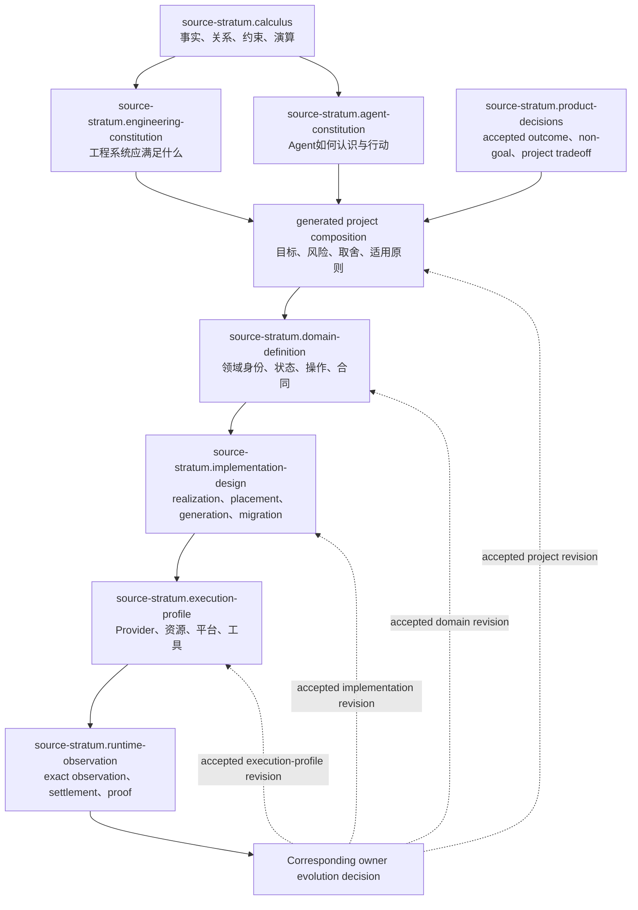
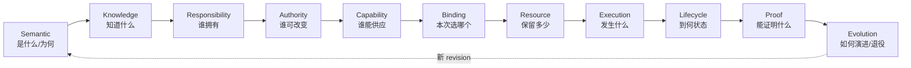
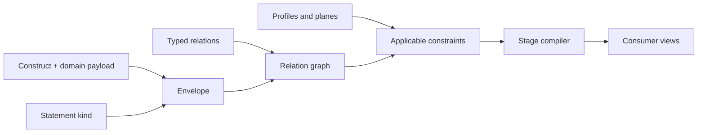
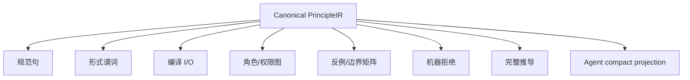

# 设计演算与原则语言

本文是 design-calculus 的公共 root，拥有事实种类、正交关系、约束组合与原则记录。设计编译/模拟和冻结/演进由本文件列出的规范片段拥有。整个 domain 不拥有任何产品目标、工程取舍、Agent 行为、实现技术或当前状态。

## 1. 来源与实现偏序



| Source stratum | 只拥有 | 不得拥有 |
| --- | --- | --- |
| `calculus` | 表达和演算规则 | 工程原则、Agent原则、产品答案 |
| `engineering-constitution` | 普适工程不变量 | 某项目路径、工具、当前实现 |
| `agent-constitution` | 普适认识与行动不变量 | 产品需求、工程事实、任务授权 |
| `project-composition` (generated) | 从 Product decisions、适用通用原则与有权 project-level decisions 生成项目目标/风险/取舍投影 | 独立事实、原则 owner、领域字段和运行结果 |
| `domain-definition` | 领域语义、状态机、操作、失败代数 | 外部能力可用性、独立证明 |
| `implementation-design` | logical→CodeUnit/package/file/generated realization、局部变更、迁移 | 产品目的、领域语义、运行成功 |
| `execution-profile` | capability、binding、allocation、平台约束 | 产品目的、业务成功 |
| `runtime-observation` | observation、settlement、evidence、unknown | 稳定定义、未来义务 |

source strata形成typed偏序而不是数字等级。`project-composition`不是一个可作者化的source stratum，而是由 Product decisions、适用通用原则和有权 project-level decisions 生成的无所有权投影；它不能产生新的事实、原则、权限或领域字段，也没有独立文件、registry row、writer 或 revision。Domain decisions 只能沿显式引用进入相应 domain-definition，不得回流成为 project-composition 的隐藏输入。实现方向只消费上游定义，runtime方向只返回受限Observation/Result；后者只有经相应authorized owner接受后才能形成新Definition revision。实现或观察不能以“已经实现”“测试绿色”或“工具不支持”改写上游定义；上游也不能以prose宣称下游Effect、状态或Evidence已存在。

### 1.1 Constitution partition decision

| Alternative | Disposition | 原因 | 反转条件 |
| --- | --- | --- | --- |
| 一份总架构文档同时拥有逻辑、工程、Agent、项目机制 | rejected | owner 混叠；通用原则随项目细节漂移；投影无法证明不扩权 | none；只可作为 generated combined view |
| 只拆 Engineering 与 Agent 两层 | rejected | 两者会重复事实种类、关系、约束和原则表达语言 | 存在另一项不复制且更小的共享语义机制 |
| Design Calculus + Engineering Constitution + Agent Constitution + generated Project composition | selected | meta-language、工程真值、Agent 行为正交；项目只实例化；可单独演进和验证 | 出现不能由 typed reference 组合、且必须共同原子演进的真实语义反例 |
| 每个项目复制一套通用原则 | rejected | 多 owner、漂移、纠错不能全局传播 | 项目原则语义已证明不再通用，应迁成项目 decision 而非复制 |

`selected` 的含义是唯一 owner 和依赖方向，不要求人类按四份文档顺序阅读；human/Agent/project views由 registry 和 compiler 按问题生成最小闭包。

## 2. 最小逻辑代数

### 2.1 基本构件

```text
Subject    := 具有稳定语义身份的对象
Claim      := 关于一个或多个 Subject、可判定真假的命题
Relation   := 由明确 issuer 签发的 typed edge
Constraint := 对一组 Claim/Relation/Transition 的可判定谓词
Transition := 从 exact pre-state 到 post-state 的允许变化
Proof      := Evidence 对 exact Claim 的支持关系；不是 Claim 本身
Unknown    := 已知覆盖边界之外、尚不可安全归真的命题集合
```

每个可消费的 Claim、Relation、Transition 与 Proof 都携带同一最小封套：

```text
Envelope = {
  identity,
  issuer + issuerAuthority,
  subjects + subjectRevisions,
  exactInputs + algorithmIdentity,
  snapshotOrOperationEpoch,
  coverage + unknownFrontier,
  validity + invalidation + retirement
}
```

封套提供引用完整性，不提供万能 payload。领域数据由领域合同拥有；禁止用“所有字段可选”的全局对象替代领域类型。

### 2.2 陈述分类

```text
Statement =
  | Fact               // 已观察且有来源、覆盖、freshness
  | Hypothesis         // 可证伪解释或方案
  | Decision           // 有权主体接受的不可推导取舍
  | Authorization      // 对 exact Effect 的上限
  | Requirement        // consumer/operation 所需合同
  | Observation        // exact read/attempt/measurement
  | Evidence           // 支持特定 Claim 的独立事实
  | Unknown            // 无法安全归类或覆盖不足
```

禁止转换：

```text
Hypothesis   -/-> Fact
Decision     -/-> Observation
Authorization-/-> Truth
Observation  -/-> Authorization
Evidence     -/-> Effect
Unknown      -/-> PositiveClaim
```

只有显式、由 owner 定义并满足前置条件的 transition 才允许改变种类。

### 2.3 行为、变异与认识边界

离散确定性transition不是所有领域的唯一模型。Domain按accepted outcome选择最小充分behavior semantics；未适用的模式不进入其实现或验证闭包：

```text
BehaviorSemantics =
  exact-function
  | discrete-transition-system
  | partial-order/concurrent
  | continuous-or-hybrid-dynamics
  | stochastic-distribution
  | adversarial-game/environment
  | adaptive-feedback-system

Variation = declared set/distribution/environment behavior within Definition
MeasurementUncertainty = bounded error/sampling/calibration limits of an Observation
EpistemicUnknown = missing or unresolved knowledge outside proven coverage
```

三者不能互换：合法随机结果不是`Unknown`；未知provider或未观察输入不能用概率分布伪装；测量误差不能被平均值消除后宣称exact。随机源、时钟、外部环境、sampling procedure、population、confidence/error bound、calibration和drift policy都是适用Claim/Observation的显式输入。

```text
ClaimSemantics =
  exact(predicate)
  | bounded(predicate, envelope)
  | temporal(safety, liveness, fairness)
  | quantitative(metric, unit, tolerance)
  | statistical(population, estimator, confidence, errorModel)
  | robustness(environmentSet, invariant)
  | relational(traceArity, observationPartition, relationPredicate)
```

Evidence只能支持同种或更弱的Claim：有限样本不能证明全称性质，bounded model exploration不能证明无限状态，simulation不能签发physical Effect completion。adaptive system还必须绑定model/data/policy revision、feedback delay、guardrails、distribution-shift detection、rollback/retirement和human authority；其运行Observation只能触发owner定义的evolution decision，不能自动改写Definition。

`relational`拥有的是多条执行之间的性质，而不是把每条轨迹分别判为安全：noninterference、observational equivalence、constant-behavior、declassification与cross-tenant isolation都必须声明比较的trace元数、哪些输入允许不同、哪些观察对哪个principal可见，以及允许泄露的精确关系。单轨迹PASS、日志脱敏样例或两个独立运行结果不能证明relational Claim；验证器必须消费同一relation contract生成self-composition、product program或等价的多轨迹oracle，并把未覆盖输入对保留为frontier。

### 2.4 Identity 与序列化命名空间

身份由 owner、domain、local subject key 与 revision 决定；序列化命名空间、地址、
显示标签和文件名只是某个 surface 的表达。任何 surface 都必须先证明自己的
持久化、跨进程、外部交换或碰撞约束，再由该 surface owner 选择命名空间；前缀
不能反向成为 semantic identity、owner 或 authority。命名、schema、硬编码与路径
的具体实现判定由 `docs/implementation-architecture.md` 的唯一 owner 执行，不能在
本演算层再定义一套 token 规则。

```text
semanticIdentity ⟂ serializationNamespace ⟂ address ⟂ presentationLabel
namespaceRequired ⇐ durable ∨ external ∨ proven-collision constraint
otherwise          ⇐ structured ref or generated projection; no global prefix
```

## 3. 正交关系与相互约束

正交表示“回答不同问题、不能相互替代”；约束表示“一个维度的合法性可引用另一个维度的 exact 事实”。两者不是冲突：维度保持独立，合法性通过 typed reference 组合。



| Relation | 回答 | 必需引用 | 不能替代 |
| --- | --- | --- | --- |
| Address | Subject 在 exact snapshot 中位于何处 | subject revision、snapshot | identity、owner、长期语义 |
| Definition | owner 接受的意图、不变量、结果、未来义务 | subject、issuer、reversal | implementation、test、current fact |
| Requirement | consumer/operation 需要什么语义、能力、资源、失败和终止 | consumer、operation、constraints | provider、argv、path |
| Provision | capability/provider 能供应什么 | provider identity、platform、limits | requirement、authority、成功 |
| AuthorityGrant | principal 可对哪些 exact Subject 做哪些 Effect | principal、scope、preconditions、expiry | capability、计划、caller DTO |
| Binding | 本次 Requirement 与 exact Provision 的匹配 | requirement、provision、grant、epoch | lookup result、default provider |
| Allocation | 从 parent ledger 实际保留多少 | binding、parent ledger、remaining | static ceiling、局部 timeout |
| Observation | 实际读到、加载、执行或计量什么 | exact target、method、coverage | expected、plan、permission |
| Settlement | 使用、释放、终止、readback、residue 的结果 | attempt、all obligations、resources | exit code、callback return |
| Lifecycle | create→active→terminal/residue→retired | state owner、legal transitions | boolean、file exists |
| Derivation | output 如何由 exact inputs 和 algorithm 确定产生 | all inputs、algorithm、unknown | 名称相似、时间相邻 |
| EvidenceSupports | 哪些独立事实支持哪个 exact Claim | claim、observations、independence | 无 Claim 的 PASS、report |

### 3.1 约束组合

```text
ConstraintResult =
  satisfied
  | violated(code, evidence)
  | conflicted(minimalConstraintCore, provenance)
  | unresolved(frontier)

admit(target) iff
  all hard constraints(target) = satisfied
  and every unresolved frontier is disjoint from target dependencies
```

硬约束不可投票：一个 authority、identity、durable integrity 或 evidence honesty 失败不能被多个 PASS 抵消。`violated`表示候选不满足一个可成立的constraint；`conflicted`表示当前accepted constraints本身不可同时满足，必须返回最小冲突核和各自provenance并回到有权Decision owner，不能靠输入顺序、优先级或last-write-wins暗选一方。软偏好只在所有硬约束均满足且无冲突的候选之间做 dominance 比较。

```text
combineConstraints(A, B) = canonical(normalize(A union B))

require
  combine(A,B) = combine(B,A)
  combine(combine(A,B),C) = combine(A,combine(B,C))
  combine(A,A) = combine(A)
```

所有领域compiler、文档compiler、policy compiler与architecture search必须复用这一结果代数；局部实现不得把`conflicted`降级成普通`violated`、`unresolved`或默认选择。

### 3.2 引用而非继承

```text
Requirement.resourceRef -> ResourceBudget.identity
Binding.grantRef         -> AuthorityGrant.identity
Settlement.attemptRef    -> Attempt.identity
Evidence.claimRef        -> Claim.identity
```

引用方保存 identity/digest，不复制被引用对象的 fields。被引用 revision 变化时，依赖图使引用方 stale；禁止靠字段继承、字符串拼接或路径镜像保持“同步”。

### 3.3 信息坐标：这些概念不是同义层级

`construct / statement / relation / profile / plane / constraint family / stage / entity family / view` 是同一设计事实的正交坐标，不是九套并列 ontology，也不是从抽象到具体的单链继承。

| 维度 | 回答 | 典型值 | 不回答 |
| --- | --- | --- | --- |
| Construct | 这个事实由哪种最小逻辑构件表达 | Subject、Claim、Relation、Constraint、Transition、Proof、Unknown | 来源是否可靠、属于哪个业务 |
| StatementKind | 当前陈述凭什么成立 | Fact、Hypothesis、Decision、Authorization、Requirement、Observation、Evidence、Unknown | 它和谁连接、何时执行 |
| RelationKind | 两个 exact Subjects 怎样连接 | Definition、Requires、Provides、Binds、Allocates、Settles、EvidenceSupports | payload 内容、执行顺序 |
| Profile | 哪组已接受规则适用于当前 Project/Target/Environment | Project Constitution、Target Profile、Execution Profile | 新事实、实现成功 |
| Plane | 从哪个独立责任维度观察系统 | Semantic、Knowledge、Responsibility、Authority、Capability/Resource、Execution、Lifecycle/Proof、Evolution、Interface | 时间阶段、文件位置 |
| ConstraintFamily | 哪类合法性必须合取验证 | identity、uniqueness、authority、resource、recovery、coverage 等 | 软偏好、实现候选排名 |
| Stage | 哪些输入必须先存在才能纯编译下一产物 | outcome→observation→semantics→responsibility→operation→execution→proof→evolution | owner 身份、物理并发线程 |
| EntityFamily | domain payload 属于哪种可独立拥有和演进的业务族 | Operation、Grant、Binding、State、Evidence、Migration 等 | 通用 relation 的语义 |
| View | 哪个 consumer 需要哪种无增权投影 | human、machine admission、Agent context、runtime query | 第二真相、裁剪掉的 blocker |

坐标使用有语义的discriminant；偏序由typed relations表达，不把显示序号写进identity：

| Coordinate family | 回答 | Canonical discriminants | 不能解释 |
| --- | --- | --- | --- |
| Source stratum | 哪类source可定义或观察什么 | `calculus`、`engineering-constitution`、`agent-constitution`、`project-composition` (generated)、`domain-definition`、`implementation-design`、`execution-profile`、`runtime-observation` | realization顺序、runtime Authority |
| Implementation refinement | accepted meaning如何逐层兑现到interface | `meta`、`product`、`domain`、`composition`、`realization`、`control`、`execution`、`settlement`、`interface` | 时间先后、Evidence成熟度 |
| Compilation stage | 哪些输入在因果偏序中先于哪个产物 | `outcome`、`observation-universe`、`observation`、`semantics`、`responsibility`、`pure-operation`、`admissibility`、`effect-settlement`、`claim-verdict`、`publish-evolve` | owner hierarchy、源码目录 |
| Provider maturity | 外部Provision的证据与采用状态 | `physical`、`typed-invocation`、`governed-declaration`、`observed-candidate`、`verified-provider`、`normalized-projection` | 产品版本、实现层级 |
| Product capability node | SEC产品能力脊柱中的语义能力及其依赖/退出合同 | `capability.<semantic-id>` | implementation refinement、运行时执行顺序 |
| Target track state | 一个Target/Provider支持轨道的当前合同状态 | `target-track.<semantic-id>` | 通用Provider maturity、产品版本 |
| Plane | 从哪个正交责任维度投影同一事实 | named plane，无数字顺序 | 生命周期阶段、优先级 |

任何schema、API或文档引用坐标时必须携带coordinate family与semantic discriminant；数字ordinal只允许由当前偏序生成用于展示，不能进入identity、引用、测试或兼容判断。裸`L1`、`R14`、整数或仅凭上下文猜轴属于`coordinate-family-unbound`。

任一可消费事实都有一个概念坐标，但不实现为“所有字段可选”的万能 DTO：

```text
InformationCoordinate =
  domainTypedPayload
  + Envelope reference
  + StatementKind
  + applicable Plane/Profile/Constraint refs
  + typed Relations
  + lifecycle/coverage/unknown
```



组织规则：Construct定义表达能力；StatementKind保存认识论来源；Relation组成因果图；Profile选择适用规则；Plane保持责任正交；Constraint做合法性合取；Stage规定因果偏序；EntityFamily承载领域payload；View只做无增权投影。新增概念先尝试由现行坐标族与typed relations表达；可等价表达则拒绝重复meta-model，确有独立admission/lifecycle/invalidation/consumer语义则按`expression-gap`演进meta-model并重编coverage，不冻结坐标族数量。

### 3.4 系统不等于一张无类型的图

关系图只是共同底座；完整系统模型还包含领域 payload、合法性、数量、时间、状态和覆盖：

```text
SystemModel =
  typed attributed hypergraph(Subjects, Relations, Envelopes)
  + constraint algebra
  + transition/state machines
  + resource quantities and ledgers
  + temporal/freshness rules
  + Profiles and coordinate-family grammar
  + coverage and Unknown frontier
```

一条多方约束可表达为有 identity 的 relation node/hyperedge，而不是复制成若干二元布尔字段。State transition、allocation consumption、deadline 和 settlement 不能只靠静态 edge 表达；它们分别由 transition、resource 与 temporal semantics 验证。

系统共享一个 canonical identity/reference space，但不构造一个所有字段可选的 monolithic graph：

| Generated projection | 只回答 | 必须保持 |
| --- | --- | --- |
| semantic/causal graph | 什么成立、为何成立 | Definition、provenance、unknown |
| owner/dependency DAG | 谁拥有、谁可依赖谁 | unique owner、acyclic authority/implementation strata |
| workflow DAG | 哪些 DomainOperations 以何种结果依赖组合 | operation boundary、guards、compensation |
| capability/binding graph | 哪项 Requirement 由哪个 Provision 满足 | grant、profile、freshness |
| resource graph/ledger | 哪个 parent 向哪些 attempt 分配多少 | conservation、release、leak |
| state/transition system | 哪些状态变化合法 | pre-state、CAS、terminal/residue |
| provenance/Evidence DAG | observation 可支持哪些 Claim | independence、coverage、freshness |
| evolution graph | old/new generation 如何迁移和退役 | conservation、cutover、consumer-zero |

每个node/edge都引用适用的强类型坐标：至少`sourceStratum + plane + owner + revision`；进入实现refinement或stage时再增加对应coordinate family，未适用的轴保持absent而不是伪默认值。跨坐标只能使用声明过的`refines | materializes | observes | binds | settles | proves | projects | migrates`等relation。不同层级信息只能在`DesignKnowledgeGraph`中通过typed refs组合验证，不能共用identity、payload或writer；任意view只保留所需refs和typed frontier，不能把多个层压成一份自由JSON。

系统知识的 canonical form 不是一棵树、一个嵌套对象或一个全局 mutable graph，而是由各 owner 发布、经 strict contract 验证的规范化事实与 typed relations：

```text
DesignKnowledgeModel = {
  subjects + claims + definitions,
  typedRelations + constraints,
  transitionSystems + partialOrders,
  allocationsAndLedgers,
  provenanceAndEvidenceRelations,
  coverageAndUnknownFrontiers,
  owner/revision/invalidation metadata
}
```

`containment`、`dependency`、`causality`、`support`、`temporal-order`和`projection`是不同关系，不能为了目录整齐压成一棵树。一个事实只有一个 semantic owner，但可被多个关系、流程和视图引用；复用通过 stable ref 完成，不复制 payload。某个 owner 内部若存在真正的封装、共同 invariant 与共同 lifecycle，可以用 compound structure 表达；这只是经证明的局部表示，不是系统全局本体。

```text
KnowledgeView = query(DesignKnowledgeModel, purpose, roots, authority, detailBudget)

ViewFidelity(view, model) =
  every emitted statement references one canonical fact/relation
  and every omitted applicable frontier is explicit
  and blocker/unknown/owner/revision semantics are preserved
  and the view cannot write back or issue authority
```

最小operation context、领域视图、流程图、层级导航和最大授权审计都是从同一事实模型编译的不同查询结果，不是彼此嵌套的手写真相。renderer可按关系形状选择表、DAG、hypergraph、state machine、sequence、tree或nested compound view；改变表达粒度不得改变meaning、blocker、unknown或Claim。运行时只消费已编译plan和opaque capabilities，不遍历知识模型。

结构选择必须先从关系与操作语义生成候选，不能从当前代码形状开始微调：

```text
RepresentationSynthesisInput = {
  identity/ownership/containment/dependency relations,
  state/time/concurrency/resource/proof/evolution semantics,
  required query/mutation/expansion operations,
  scale/distribution/trust/failure constraints,
  cold/warm/delta/lifecycle cost objectives,
  eligible mature external mechanisms
}

RepresentationDecision =
  generate materially distinct structure/algorithm families
  -> reject hard-constraint violations
  -> prove operation semantics and complexity
  -> compare lifecycle-cost Pareto frontier
  -> select or preserve exact unresolved frontier
```

| Relation / operation shape | 首要候选，不是强制答案 | 常见错误替代 |
| --- | --- | --- |
| owner/invariant containment + zoom | nested compound graph/tree of owned fragments | 巨型平面图 + 脱离事实模型的手写views |
| many-to-many dependency/causality | DAG / typed hypergraph + reachability/fixed point | 路径清单、嵌套对象复制 |
| lifecycle/terminal/recovery | state machine / transition system | booleans、catch分支 |
| resource subdivision/conservation | hierarchical ledger/allocation tree | 每层重置timeout/counter |
| policy/eligibility/unknown refinement | constraint system/lattice | if顺序、评分覆盖hard failure |
| provenance/Claim support | provenance DAG/hyperedge | producer自报或报告文本 |
| concurrency/order | partial order、linearization、claim/join | 全串行或无界parallel |
| immutable content/reuse | content-addressed Merkle structure | path/mtime cache |
| exact external capability | retained opaque capability + stateful protocol | naked command/function callback |

候选覆盖不能由同一结构的命名变体满足；必须包含适用的composition、indexing、incremental、distributed与成熟外部实现家族。每个候选记录支持操作、渐近/常数成本、failure/recovery、migration、extension和反转条件。结构无法回答某项已声明操作时是model defect，不得拖到编码时用局部分支补齐。

### 3.5 正交分解不等于物理碎片化

语义分解与实现聚合是两次不同演算：

```text
SemanticSplitRequired(a, b) iff
  owner(a) != owner(b)
  ∨ authority(a) != authority(b)
  ∨ lifecycle(a) != lifecycle(b)
  ∨ revisionOrInvalidation(a) != revisionOrInvalidation(b)
  ∨ consumerCanLegitimatelyObserveOneWithoutTheOther(a, b)

PhysicalCoLocationPreferred(a, b) iff
  sameOwnerAndTrustBoundary(a, b)
  ∧ sameAtomicConsistencyAndLifecycle(a, b)
  ∧ highCoChangeOrReadTogether(a, b)
  ∧ noIndependentPublicConsumer(a, b)
  ∧ lifecycleCost(coLocated) < lifecycleCost(separate)
```

| 语义结果 | 实现结果 |
| --- | --- |
| 不满足`SemanticSplitRequired`且强共变 | 同一typed aggregate/CodeUnit，不造relation、port或文件 |
| 语义独立但同owner、同事务、总是一起消费 | payload保持typed字段，物理共置并一次parse/commit |
| owner/Authority/lifecycle/version独立 | 分离identity与contract，通过typed ref组合 |
| 跨cell高频稳定组合 | compiler物化content-addressed package/index/view，consumer一次读取 |
| 开放式低频查询 | 按需求编译最小closure，不预聚合全世界 |

`Orthogonality`禁止概念冒充，不要求“一项关系一个对象、文件、包、服务或网络调用”。`Composition`也不是每次业务执行时临时join所有原子；authoring graph经compiler形成按consumer裁剪且可缓存的immutable aggregate。任何拆分必须给出独立变化/权限/生命周期/consumer收益和全生命周期成本；否则判为`over-factored`并合并。任何合并必须证明不会吞掉独立owner、invalidations或unknown；否则判为`boundary-collapse`并拆分。

## 4. 原则记录与多视图精确表达

一条原则只有一个 identity。权威语义是可计算的 `PrincipleIR`；自然语言、图和 compact context 都是投影：

```text
PrincipleIR = {
  identity,
  class,                 // engineering | agent
  quantifiedSubjects,
  predicates,
  precedence,
  compilerInputs,
  compilerOutputs,
  roles,
  rejectionCodes,
  counterexampleFamilies,
  reversalPredicate,
  materializationTargets
}

PrincipleRecord = {
  semanticCore: PrincipleIR,
  purposeRefs,
  sourceStatementRefs,
  premiseRefs,
  alternativeSetRef,
  selectedBecauseRef,
  avoidedFaultFamilyRefs,
  acceptedConsequenceRefs,
  proofObligationRefs,
  carryingCostRef,
  reversalPredicateRef,
  supersedesRefs,
  acceptedBy + authority
}
```



这些视图可以长度不同、表达方式不同，但必须语义等价：

```text
meaningDigest(view) = digest(canonical PrincipleIR)
blockers(view)       = rejectionCodes(PrincipleIR)
unknown(view)        = unknownSemantics(PrincipleIR)
```

`PrincipleRecord`只保存不可推导选择及typed refs；候选生成、约束结果、成本、fault traces与投影由compiler产生。自然语言只能解释这些refs，不能改变IR；若文字无法由IR和refs支持，投影拒绝发布。多种表达只适用于原则等需要消歧的高阶约束；普通事实选择一项最合适的载体。不得为了“多视图”复制状态、路径、实现清单或当前结果。

### 4.1 来源、目的与理由闭包

“为什么”不是一个自由文本字段，而是对不同事实种类的typed query。每个可接受的设计node/edge必须能沿唯一知识图回答其适用问题：

| Query | 必须返回 | 不得用作答案 |
| --- | --- | --- |
| `sourceOf(x)` | statement kind、issuer、authority、coverage、freshness、contradiction frontier | 聊天摘要、作者名、同名常量 |
| `purposeOf(x)` | accepted outcome/non-goal/future obligation refs | “可能有用”、实现已存在 |
| `whyExists(x)` | requirement reachability或accepted FutureObligation + deletion counterfactual | 文件被引用、测试存在 |
| `whyThisShape(x)` | exact premises、适用constraints、candidate coverage、dominance trace | 首个可行方案、个人偏好 |
| `whyNot(a)` | hard violation或被另一候选支配的exact trace | 没实现过、名字不好 |
| `avoids(x)` | fault/counterexample → rejected outcome/constraint → selected property | 手写风险清单、空泛“更安全” |
| `costOf(x)` | 全生命周期cost vector与承担者 | 仅代码行数或单次命令时间 |
| `proves(x)` | conformance obligation、independent evidence class、unknown | producer自报PASS |
| `whenReverse(x)` | reversal predicate、invalidation reverse closure、retirement obligation | “未来再评估” |

```text
DesignSourceStatement = {
  identity,
  statementRef,
  statementKind: Fact | Hypothesis | Decision | Authorization | Requirement |
                 Observation | Evidence | Unknown,
  semanticRole: outcome | non-goal | obligation | principle | domain-definition |
                external-contract | measurement | constraint-input,
  issuerRef + issuerAuthority,
  subjectRevisionRefs,
  coverage + freshness,
  contradictionRefs + unknownFrontierRef
}

DesignExplanationTrace =
  | ProvenanceTrace(sourceStatementRefs, issuerChain, coverage, contradictionFrontier)
  | PurposeTrace(outcomeRefs, nonGoalRefs, obligationRefs)
  | DerivationTrace(exactInputRefs, algorithmRef, outputRef, unknownFrontier)
  | ExistenceTrace(requirementReachability, deletionCounterfactual, carryingCost)
  | SelectionTrace(candidateCoverage, hardConstraintResults, dominance, rejectedCandidates)
  | FaultAvoidanceTrace(faultRef, rejectedOutcomeRef, preservedPropertyRef)
  | ConsequenceTrace(benefitRefs, acceptedCostRefs, costBearers, lostOptionRefs)
  | ProofObligationTrace(claimRefs, conformanceRefs, independence, unresolved)
  | ReversalTrace(predicateRef, invalidationReverseClosure, retirementObligations)

DesignRationaleIndex = {
  subjectRef,
  applicableQuerySet,
  explanationTraceRefs,
  unresolvedQueryRefs,
  meaningDigest
}
```

`applicableQuerySet`由subject kind、plane和relations编译，不要求无关对象填写空字段。`DesignRationaleIndex`与各trace从owner records、exact observations和compiler traces生成，不是第二份decision log。事实使用provenance，派生结论使用derivation，授权使用issuer chain，选择使用selection，未知使用frontier；禁止把所有对象强塞进`DesignDecision`，也禁止用一个万能trace或自由“rationale”掩盖不同认识论来源。

| Source statement kind | 可参与设计的方式 | 不能产生 |
| --- | --- | --- |
| Decision | 定义accepted outcome、non-goal、tradeoff或FutureObligation | Observation、Effect、PASS |
| Fact / external contract | 作为有coverage与freshness的premise/constraint | 无界全局真理 |
| Requirement | 进入requirement closure并由consumer reachability验证 | Provision、Authority |
| Observation | 更新exact world model、cost或counterexample | 永久Definition、授权 |
| Evidence | 支持exact Claim并携带independence/freshness | Product choice、Effect |
| Authorization | 只收窄当前设计/实现operation可做的Effect | 设计正确性、长期owner |
| Hypothesis | 生成候选、实验或可证伪解释 | accepted设计 |
| Unknown | 扩大frontier、阻断受影响正向Claim | absent、mismatch、success |

用户欲望或maintainer取舍只有在对应Product/Domain decision authority接受后才成为`Decision`；用户提出的技术形状、Agent建议、Skill规则和既有代码默认是`Hypothesis`。这既不把用户终局结果降格，也不把任一技术措辞自动提升为永久架构真理。

```text
RationaleComplete(x) =
  sourceOf(x) is typed
  ∧ purposeOf(x) reaches accepted outcome/non-goal/obligation
  ∧ (derived(x) -> exact Derivation trace)
  ∧ (chosen(x) -> bounded candidate coverage + dominance + consequences)
  ∧ (effectRelevant(x) -> avoided fault + settlement/proof obligations)
  ∧ reversal and unknown frontier are explicit
```

理由必须在实现admission前绑定到输入revision。实现成功、测试PASS、已有调用者或迁移成本只能成为后续Observation/cost input，不能反向改写原选择理由；否则是post-hoc rationale laundering。方案空间不可能宣称无限完备，只能证明已声明设计轴的generated coverage，并把未覆盖轴保留为bounded unknown。


## 规范片段

本文件保留设计语言、事实/关系代数、约束组合与原则记录；编译、模拟、冻结和演进由下列独立规范片段拥有。

| 片段 | 独立职责 |
| --- | --- |
| [设计编译与模拟](design-calculus/compilation.md) | 本片段拥有 Design Compiler、Operation/Effect 参考模型、未来义务、模型演算、故障族与场景规格。 |
| [设计冻结与演进](design-calculus/freeze-and-evolution.md) | 本片段拥有 Design Package、知识产物、伪实现完整性、逻辑验证、反例传播与设计完成。 |
