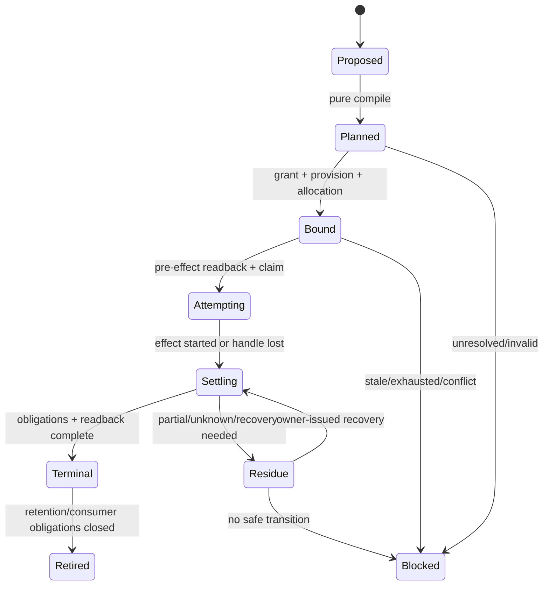
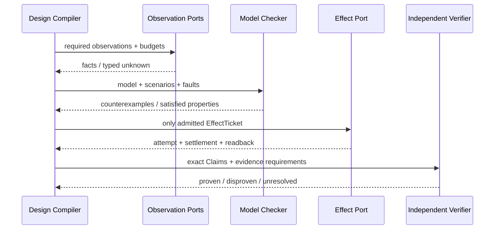

# 设计编译与模拟

本片段拥有 Design Compiler、Operation/Effect 参考模型、未来义务、模型演算、故障族与场景规格。

本片段与 [owner root](../design-calculus.md) 共享同一 domain，但只拥有 registry 分配给本片段的 ownership keys；跨片段语义使用引用，不复制定义。

## 5. 设计编译器

### 5.1 输入与输出

```text
DesignInput = {
  exactSystemDesignUniverseRef,
  rootSubjectRefs,
  targetAndProfileRefs,
  acceptedOutcomes,
  nonGoals,
  classifiedStatements,
  exactObservations,
  engineeringPrinciples,
  projectDecisions,
  domainDefinitions,
  capabilityFacts,
  resourceFacts,
  existingGraph,
  futureObligations,
  candidateGenerators,
  costAndDominanceCriteria,
  unknownFrontier
}

DesignVerdict = {
  status: admitted | blocked | proposal | retired,
  coverageTensor,
  minimalCausalGraph,
  candidateModels,
  systemicInterventionSets,
  selectedSystemChangeSet,
  objectDispositions,
  ownerDag,
  requirementDag,
  purePlan,
  effectObligations,
  proofObligations,
  evolutionPlan,
  attackResults,
  unknownFrontier,
  lifecycleCost,
  dominanceProof,
  reversalConditions,
  designClosureManifest,
  adversarialFixedPointReceipt
}

ObjectDisposition =
  required | derivable | duplicate-owner | dominated | orphan | future-obligation | unknown
```

### 5.2 编译流水线


每一阶段是纯编译；外部观察和 Effect 由明确 port 执行后作为新输入进入下一 revision。编译器不得在分析中隐式执行命令、写缓存、建目录、安装依赖或改变外部状态。

### 5.3 核心伪函数

```text
classify(statement, provenance) -> Statement | Unknown
compileOutcome(decisions, constraints) -> OutcomeGraph | Conflict
observe(port, requirement, budget) -> Observation | TypedFailure
compileUniverse(normativeRoots, observedRoots, typedRelations) -> ExactUniverse + Frontier
reconcileUniverse(normative, observed) -> Materialization/Surplus/Obligation/Unknown dispositions
buildCausalGraph(outcome, observations, definitions) -> Graph + Unknown
expandRequirementSpace(capabilities, dimensions, reachability) -> CoverageTensor
synthesizeCompetingModels(requirements, existingGraph, providerFacts) -> CandidateModels
synthesizeSystemInterventionSets(counterexample, exactUniverse, acceptedOutcomes) -> CandidateChangeSets
counterfactualDelete(node, graph) -> OutcomeDelta + CostDelta + ObligationsDelta
counterfactualReplace(model, alternative) -> TraceDelta + CostDelta + RiskDelta
selectNondominatedSystemDelta(candidateChangeSets, constraints, lifecycleCost) -> SystemChangeSet | Frontier
classifyNode(node) -> ObjectDisposition
assignUniqueOwners(graph) -> OwnerDAG | DuplicateOwner
compileRequirements(graph) -> RequirementDAG
resolveEligibleProvisions(requirement, facts) -> ProvisionSet | Unavailable
bind(requirement, provision, grant, epoch) -> Binding | TypedFailure
reserve(parentLedger, binding, demand) -> Allocation | Exhausted
compileTransition(preState, intent, invariants) -> PurePlan | Conflict
admitEffect(plan, grant, binding, allocation, currentReadback) -> EffectTicket | Blocked
settle(attempt, obligations, readback) -> Terminal | Residue | Unknown
verify(claim, independentEvidence) -> Proven | Disproven | Unresolved
compileEvolution(oldGraph, targetGraph, obligations) -> CutoverPlan | Blocked
compileRecursiveDesignClosure(rootRefs, exactUniverse, packages) -> DesignClosureManifest
```

没有默认成功分支。`exactSystemDesignUniverseRef`必须由目标工程profile的canonical universe compiler从accepted roots与exact world双向生成；调用者不能提交一个更窄的“declared universe”来减少义务。所有闭集必须显式枚举；开放世界输入必须保存 `Unknown`。

### 5.4 全局架构合成与固定点对抗验证

Design Compiler 不能只验证提交给它的单一方案；它必须从相同需求空间生成结构不同的竞争模型。至少覆盖下列 realization 轴，随后由 constraint、trace equivalence、全生命周期成本和 reversal 做 Pareto reduction：

| 设计轴 | 必须比较的候选族 |
| --- | --- |
| existence | delete/derive/project、active implementation、bounded FutureObligation |
| ownership | single domain owner、shared lower-level primitive、独立 platform owner、external owner |
| composition | direct pure call、typed port、compiled workflow、policy-free microkernel、external workflow Provider |
| state | stateless、ephemeral attempt、durable journal、external authoritative state |
| execution | in-process、retained child process、durable local worker、remote Provider |
| topology | centralized mechanism/decentralized policy、partitioned cells、distributed service |
| reuse | no sharing、contract/algorithm/fact/port/provider/workflow-pattern reuse |
| production | governed-authored、deterministic-generated、mature external capability |
| evolution | atomic replacement、bounded migration、retirement、typed unavailable |

不存在“默认选最抽象、最集中、最少文件或最新工具”。候选只有在全部 hard constraints 成立、业务 trace 不弱化、unknown 未越界，并且在 owner/scan/state/test/context/resource/recovery/maintenance 成本上非支配时才可接受。开放世界不能证明绝对全局最优；可声称的最强结论是：

```text
DesignOptimalWithinCoverage =
  exact compiled universe
  ∧ generated requirement/alternative coverage
  ∧ no known hard-constraint violation
  ∧ Pareto non-dominated among generated candidates
  ∧ explicit bounded unknown and reversal frontier
```

架构系统自身也是被设计的 Subject，但不能用自己的规则自证正确。验证必须反复生成反例、竞争模型与反转条件，直到本轮 coverage 内达到固定点；独立 verifier 仍需从输入事实重算：

```text
ArchitectureMetaValidationClosure(A) =
  BusinessCapabilityClosure(A)
  ∧ counterfactualDelete(A components)
  ∧ competingMetaModelSynthesis(A)
  ∧ implementationRefinementTotal(A)
  ∧ all runtime controls trace to A inputs
  ∧ independent verification of A claims
  ∧ bounded meta-model evolution
```

任何反例证明active calculus、coverage dimensions、fault families、compiler stages、entity/relation grammar或实现机制缺项时，依赖该假设的design packages、plans、conformance models与Evidence全部stale。`first missing boundary`只定位因果解释的起点，不决定修复位置。Design Compiler必须从整个受影响系统生成竞争变更集，至少比较删除需求或实现、重述Definition、重划Domain/owner、改变relation/algorithm/topology、复用外部机制、替换实现、迁移state以及收窄或扩展product capability；最终选择在accepted outcomes与hard constraints下非支配的原子系统变更。唯一owner、最小公开面和局部变更性是该选择的输出不变量，不是预先把修复锁进某一文件或owner的输入。禁止只在发生反例的domain追加字段、检查或Skill。

```text
SystemicRepair(counterexample, exactGeneration):
  witness := minimize(counterexample)
  causalCut := allNecessaryCausalBoundaries(witness, exactUniverse)
  candidates := synthesizeSystemInterventionSets(
    delete | redefine | repartition | recombine | replace | externalize |
    migrate | retire | defer-as-bounded-obligation,
    causalCut,
    acceptedOutcomes,
    exactObservedWorld)
  for each candidate:
    compile full normative/observed reconciliation
    check trace preservation, constraints, migration, recovery and lifecycle cost
  selected := ParetoReduce(candidates)
  require selected is unique by accepted decision or preserve exact decision frontier
  derive owners, boundaries, packages and cutover from selected
  invalidate and recompile every reverse-reachable conclusion
```

局部修改只有在上述合成证明“其余系统保持不变”是非支配候选时才合法。若最佳解跨多个owner，迁移operation拥有一次性原子change set与cutover，而不是把任何一个owner提升为全系统真相。

外部成熟设计不是灵感清单，也不因知名度取得authority。每个适用候选都形成`ExternalMechanismEvidence`：`officialSource + observedRevision + exactMechanism + applicability + absorbedProperty + rejectedProperty + integrationCost + reversal`，再与自建、删除和组合方案同场比较。当前基线比较只冻结可迁移的机制，不冻结工具选型：

| 成熟机制 | 吸收的可证明性质 | SEC拒绝直接继承的部分 |
| --- | --- | --- |
| [DITA maps/key scopes](https://docs.oasis-open.org/dita/dita/v1.3/os/part1-base/archSpec/base/keyScopes.html)、[Sphinx semantic references/inventory](https://www.sphinx-doc.org/en/master/usage/extensions/intersphinx.html)、[DocFX UID/xref map](https://dotnet.github.io/docfx/docs/links-and-cross-references.html) | reference identity与physical address分离；scope内解析；外部reference inventory | best-effort/ambiguous fallback、path/title当identity、外部inventory无digest即信任 |
| [Antora component descriptors/catalog](https://docs.antora.org/antora/latest/component-version-descriptor/) | source placement与logical content catalog分离；可组合compiler pipeline | `latest`或component version自动成为authority；强迫SEC采用其固定目录taxonomy |
| [Bazel Skyframe](https://bazel.build/versions/7.2.0/reference/skyframe) | immutable key/value dependency graph；所有读取必须成为显式dependency；change pruning仍以clean equivalence为准 | pure evaluator隐式FS/network side-read；把daemon cache或build success当业务Evidence |
| [Salsa](https://github.com/salsa-rs/salsa) | `K -> V` pure query、memoization与输入变化后的精确重算 | 进程内memoized value成为durable authority或绕过Effect/settlement |
| [SHACL](https://www.w3.org/TR/shacl/)、[CUE unification](https://cuelang.org/docs/reference/spec/#unification) | facts与constraint shapes分离；结构化validation result；constraint composition满足可验证的交换/结合/幂等性质 | 强制把SEC事实迁到RDF/CUE；依赖SPARQL或evaluation order定义核心语义 |
| [TLA+/TLC](https://lamport.azurewebsites.net/tla/high-level-view.html) | 并发、故障与恢复先建state-transition model，再由model checker生成反例 | 把bounded model PASS当实现Evidence，或把所有domain强制翻译成同一formal language |

该表不是允许列表。外部机制、版本或新研究出现时由candidate generator按Requirement query扩展；若只吸收性质而不引入工具，必须证明本地合同确实实现了该性质；若引入工具，必须同时证明其provider、版本、供应链、资源、failure、replacement和retirement闭包。这里的`ExternalMechanismEvidence`只拥有候选调查与取舍证据；被选机制由实现架构的`MechanismBinding`引用该证据并重新绑定实际snapshot、integrity、coverage、operation envelope和settlement，二者不得复制对方payload或互相签发authority。

```text
ExternalMechanismSurvey = {
  exactRequirementAndConstraintSlice,
  observationTimeAndProvider,
  sourceStrata: standards + official implementations + primary research
                + relevant language/package ecosystems,
  exactQueriesAndResultInventory,
  mechanismCandidates,
  license/platform/security/maintenance facts,
  dominatedAndRejectedCandidates,
  unresolvedSearchFrontier,
  surveyDigest
}

MechanismSurveySaturated =
  every applicable source stratum was queried through a declared provider
  and repeated independent query formulations add no non-dominated mechanism
  and every candidate has an adopt | absorb-property | combine | reject disposition
  and unresolved search frontier is disjoint from the selected irreversible decision
```

搜索结果、排行榜、下载量和AI记忆只产生candidate，不产生正确性或采用authority。调查无法穷尽开放世界；它只能在exact query/source/time coverage上达到饱和，并以reversal predicate使后来出现的更强机制重新打开设计。

架构合成也不能用“列出很多候选”掩盖组合爆炸。compiler先从hard constraints生成可满足空间，再以语义等价、对称、支配下界和因果独立性剪枝；资源耗尽时报告best-known与未探索最优性前沿，禁止把启发式结果称为最优：

```text
ArchitectureSearchEnvelope = {
  decisionVariables,
  hardConstraints,
  semanticEquivalenceClasses,
  symmetryBreakers,
  objectiveVectorAndDominance,
  admissibleLowerBounds,
  maximumStates + maximumTime + cancellation,
  exploredAndPrunedRegionDigest
}

synthesizeAndReduce(envelope):
  normalize hard constraints with the canonical constraint algebra
  if constraints conflict, return conflicted(minimalConstraintCore, provenance)
  reject candidate violations with exact violated constraint refs and evidence
  canonicalize equivalent models before evaluation
  prune candidate only with a checked dominance or infeasibility proof
  decompose causally independent variables and compose their frontiers
  return exact Pareto frontier when exhausted
       | bestKnown + boundedUnexploredFrontier when budget expires
```

## 6. Operation 与 Effect 参考模型



```text
EffectAdmitted =
  OutcomeBound
  ∩ DesignAdmitted
  ∩ LiveAuthorityGrant
  ∩ ExactCapabilityBinding
  ∩ ReservedResources
  ∩ FreshPreimage

Terminal =
  all(settlementObligations fulfilled)
  ∧ exact domain readback
  ∧ resources released or residue recorded
```

启动、PID、回调返回、进程退出、HTTP 2xx、commit、push 或测试 PASS 都只是 Observation，不能单独成为 Terminal。

## 7. 未来义务与无当前 consumer 的设计

“没有当前 consumer”不自动等于垃圾；“未来可能有用”也不构成存在证明。

```text
FutureObligation = {
  identity,
  acceptedOutcomeRef,
  missingConsumerOrCapability,
  activationCondition,
  targetOwner,
  maximumCarryingCost,
  proofAtActivation,
  retirementCondition,
  reversalCondition
}
```

| 状态 | 处置 |
| --- | --- |
| 当前 consumer 必需 | `required`；进入 active graph |
| 完全可由 owner 事实生成 | `derivable`；删除存储镜像 |
| 已接受未来义务且维护成本有界 | `future-obligation`；保留为 proposal/spec，不进入 runtime active graph |
| 同义 owner 已存在 | `duplicate-owner`；迁移后删除 |
| 有更小完整方案 | `dominated`；删除 |
| 无 outcome、consumer、future obligation | `orphan`；删除 |
| 外部 consumer/价值无法判定 | `unknown`；限制 Effect，不伪删也不伪保留 |

未来抽象不得以 active facade、空 index、兼容 alias、公共 DTO 或第二 dispatcher 占用生产图；激活时从义务重新编译当前最小设计。

## 8. 模型演算

### 8.1 性质

| Property | 必须满足 |
| --- | --- |
| Non-vacuity | 每个accepted success trace在合法条件下可达；全拒绝不能满足业务设计 |
| Safety | 不允许的 Effect、真值、身份、权限和数据状态不可达 |
| Liveness | 在授权、资源和合法下一步存在时能到达 Terminal；无无界等待 |
| Determinism | 相同 semantic inputs/algorithm/unknown 产生 byte-equivalent pure output |
| Recoverability | 每个 admitted Effect 到达 Terminal、typed Residue 或 Blocked |
| Compositionality | 子图合同成立且边界满足时，组合不新增未声明权威 |
| Canonical fact uniqueness | 每项authored fact/relation只有一个owner payload；所有组合与视图只引用它 |
| Projection fidelity | renderer或查询变化不改变identity、meaning、blocker、unknown、revision或Claim |
| Disclosure minimality | view包含purpose所需最小完整闭包；无关private flow不可达，授权审计仍可覆盖全部适用事实 |
| Monotonicity | 新 Evidence 只收窄 unknown 或推翻 Claim，不凭投影扩大 authority |
| Quantitative validity | unit、population、measurement error、confidence与tolerance匹配Claim；统计Evidence不冒充exact proof |
| Robustness | 在声明的environment/variation/perturbation集合内保持目标性质，超出范围形成frontier而非静默退化 |
| Relational fidelity | 多轨迹Claim对声明的输入差异、principal可见Observation与允许泄露关系成立；单轨迹性质不能冒充noninterference或观察等价 |
| Evolution | cutover 后旧 active writer/parser/route consumer 数为零 |
| Economy | 正确变更的 scan/state/test/context/recovery/maintenance 总成本不增或有接受理由 |

### 8.2 故障注入接口

```text
simulate(model, trace, faults) -> {
  reachedStates,
  emittedEffects,
  settlements,
  evidence,
  residues,
  violations
}

faults = {
  staleSnapshot, concurrentReplacement, missingProvider,
  budgetExhaustion, cancellation, timeout, partialWrite,
  processCrash, lostHandle, duplicateDelivery, reorderedEvent,
  malformedPersistentState, unknownSchema, credentialRedirect,
  pathAlias, dependencyCycle, externalMutation, contextLoss
}
```

模型发布前必须生成最短反例；没有反例不代表正确，只有覆盖声明内未发现反例。

### 8.3 可执行状态模型

并发、迁移、lease、retry、lost-handle、recovery或多writer协议不能只画state diagram。Conformance Compiler从同一LogicalDesignPackage生成可执行transition system；手写第二份模型没有证明力：

```text
ExecutableTransitionModel = {
  exactLogicalPackageRef,
  stateVariables + types,
  initialPredicate,
  transitionRelations + guards + effects,
  invariants,
  terminalAndResiduePredicates,
  fairnessAndLivenessAssumptions,
  environmentActions,
  relationalTraceProperties,
  selfCompositionOrProductConstruction,
  abstractionAndSymmetryMap,
  modelDigest
}

ModelExplorationEnvelope = {
  actor/resource/state cardinalities,
  eventOrderings,
  crashAndFaultSchedules,
  timeAndStateBudget,
  symmetryAndReductionProof,
  boundedUnknownFrontier
}

checkModel(model, envelope):
  validate lowering trace from logical operations to every transition
  exhaustively explore every state within finite envelope
  explore every admitted trace tuple required by relational properties through
    a semantics-preserving self-composition, product construction or relational oracle
  generate shortest counterexample for each violated property
  run boundary/property generators outside enumerated cardinalities
  return proven-within-envelope | violated(trace) | unresolved(frontier)
```

bounded exploration只证明给定envelope；unbounded cardinality、real-time、external behavior或implementation refinement仍需inductive property、property-based scenario或独立runtime Evidence。缩小模型、symmetry reduction和state projection必须证明保留目标性质；不能为了跑完而删除失败状态、environment action或resource dimension。relational property的降维还必须证明保留trace correspondence与principal observation partition；逐轨迹分别抽象后比较结果不构成该证明。

## 9. 通用对抗族

对抗空间不是一张维护者记忆的案例清单。compiler从模型关系生成适用cells；下表只是稳定fault identities的人类投影：

```text
AdversarialCell =
  SemanticSurface
  x LifecyclePhase
  x Stimulus
  x Multiplicity
  x OrderingAndTimeDomain
  x TrustAndTenantBoundary
  x ResourceScale
  x ObservationLossMode

SemanticSurface = identity | definition | authority | capability | binding | resource |
                  state | effect | settlement | evidence | evolution | interface
LifecyclePhase  = plan | admit | start | active | settle | recover | cutover | retire
Stimulus        = replace | duplicate | omit | corrupt | delay | reorder | revoke |
                  partition | crash | overload | spoof | drift | replay
Multiplicity    = one | concurrent-many | repeated | recursive | distributed
OrderingAndTimeDomain = before | during | after | concurrent | reordered
                        x local-monotonic | issuer-time | wall | remote | unknown
TrustAndTenantBoundary = same-principal | delegated | revoked | cross-tenant |
                         cross-repository | public-private | unknown
ResourceScale   = nominal | exact-boundary | exhausted | adversarial-volume | skewed-share
ObservationLossMode = complete | partial | stale | missing | contradictory |
                      observer-failed | disclosure-filtered

compileAdversarialCells(model):
  derive dimensions from actual typed relations and state machines
  quotient cells only with a semantics-preservation proof
  require expected legal terminal or typed frontier for every applicable cell
  preserve non-applicable derivation; never silently omit a Cartesian region
```

没有credential的pure function不生成revocation cell；没有tenant boundary的local tool不生成cross-tenant cell；存在external delivery、clock、floating point、human interface或durable erasure requirement时，对应dimensions自动加入。任何真实反例若落在既有cell，只增强该family的generator/oracle；只有不能被现有axes表达时才演进meta-model并重编全域。

| Semantic fault identity | 攻击 | 必须观察 | 合法结果 | 禁止结果 |
| --- | --- | --- | --- | --- |
| `identity-spoof` | 同名/同路径冒充身份 | issuer、revision、physical/logical binding | typed mismatch | 按字符串接受 |
| `stale-snapshot` | stale snapshot | exact revision、invalidation | stale/block/reobserve | 沿旧 plan Effect |
| `unknown-crossing` | unknown 穿越边界 | dependency frontier | bounded block | unknown→false/cache miss/success |
| `authority-amplification` | 权限放大 | principal、grant、requested Effect | intersection | caller DTO 自授权 |
| `provider-substitution` | Provider 替换 | requirement、provision、binding | rebind or unavailable | ambient fallback |
| `resource-reset` | 资源重置 | parent ledger、all child allocations | exhausted/bounded | 每层新 timeout/counter |
| `non-reentrant-concurrency` | 并发非重入 | session contract、ordering | sequence/join/typed conflict | 放宽 capability |
| `lost-handle` | handle 丢失 | durable intent、domain readback | terminal/recovery/unknown | blind retry |
| `cleanup-failure` | cleanup 失败 | primary error、cleanup obligations | preserve both/residue | cleanup 覆盖主错误 |
| `crash-intermediate-state` | crash 中间态 | journal、pre/post identity | recover/quarantine | 当 absent 重新 Effect |
| `schema-drift` | schema 漂移 | schema identity、exact parser、migration | migrate/block | 同 identity 放宽 parser |
| `owner-facade-cycle` | owner/facade 成环 | declaration/reference DAG | move contract/invert dependency | 双向 import/callback 绕环 |
| `projection-mirror` | projection 镜像 | derivation inputs、consumer | generate/delete mirror | 手写路径/计数/版本清单 |
| `self-proof` | 自证 Evidence | producer/evidence issuer | independent/unresolved | producer PASS=完成 |
| `duplicate-effect-delivery` | duplicate Effect delivery | OperationKey、claim、readback | join/dedupe/recover | 第二次执行 |
| `future-abstraction-shell` | future abstraction | accepted obligation、activation | proposal/activate/retire | active empty shell/自动误删 |
| `context-loss` | context loss | durable facts、authorization | re-admit/continue/block | summary 生成事实/权限 |
| `external-consumer-unknown` | external consumer unknown | protocol evidence、support window | bounded unknown | repo `rg` 零即删公共协议 |
| `cache-poisoning` | cache poisoning | ActionKey、producer、environment、readback | miss/reject | path/mtime-only hit |
| `migration-coexistence` | migration coexistence | old/new readers/writers、cutover | one active generation | 永久双写/兼容壳 |
| `hidden-source-graph` | hidden source graph | executable bytes、parser ownership | typed source/opaque | 字符串藏代码逃逸分析 |
| `unbounded-input` | large/unbounded input | entries、bytes、depth、time、signal | bounded residue | 只限制一维 |
| `presentation-as-protocol` | presentation as protocol | machine interface/schema | strict parser | 解析人类文本 |
| `architecture-change-without-migration` | architecture change | old/new consumer graph | transactional cutover | 移文件后手修路径 |
| `representation-view-confusion` | 把一种展示结构误作事实本体 | canonical fact refs、typed relation、query purpose、coverage/frontier、view digest | 关系事实唯一；按用途选择lossless renderer | 目录树冒充owner、手写全图、独立view漂移、摘要隐藏blocker |
| `relational-observation-leakage` | 单轨迹均合法但跨轨迹差异泄露secret/tenant/policy事实 | trace tuple、allowed input delta、principal observation partition、declassification | relational Claim satisfied或最短差异反例 | 用各自PASS、平均值或日志样例宣称noninterference |
| `split-content-snapshot` | 同一逻辑操作的consumer分别观察disk/index/worktree/editor overlay或重复扫描 | exact WorkspaceContentView、generation、overlay precedence、consumer refs | 一个generation或typed stale/rebind | 各自扫描后仍称同一ActionKey |
| `bootstrap-dependency-cycle` | Provider bootstrap直接或间接依赖自身workload/capability | bootstrap dependency graph、host primitive roots、journal/store dependency | acyclic rooted bootstrap或typed cycle | 裸启动、顺序碰运气、fallback |
| `implicit-scheduling-policy` | scheduler以queue/枚举/时钟默认值偷偷决定priority/fairness | SchedulingRequirement、ready set、policy revision、chosen order | governed order/commutative class或typed unbound | scheduler implementation拥有业务政策 |
| `provider-generation-bleed` | old/new Provider generation、attempt、endpoint或PID被混用 | provider generation、attempt journal、drain/cutover/readback | bounded drain→activate→retire或typed residue | path/PID相同即把旧attempt认作新generation |
| `revocation-race` | Grant/credential/lease在plan后或Effect中途被撤销 | issuer epoch、use point、settlement obligations | pre-start block；in-flight按owner语义settle/recover | 已缓存PASS继续扩权或把撤销当成功 |
| `delivery-disorder` | message/event/result重复、延迟、丢失、乱序或分区后重放 | operation/result identity、commit/outbox、consumer state | dedupe/reorder-independent/typed wait-recovery | transport顺序成为Domain truth |
| `overload-collapse` | 请求/队列/日志/重试/子进程超过容量 | admission、backpressure、parent ledger、fairness | reject/defer/bounded degradation | 无界排队、retry storm、silent drop |
| `time-domain-corruption` | clock skew、suspend、DST、leap、跨host monotonic比较 | clock domain、uncertainty、issuer epoch | expire/re-admit/unresolved | 延长Grant、复活lease、wall time伪因果 |
| `nondeterministic-replay` | 相同exact inputs因seed/order/thread/provider产生不同语义结果 | random/clock/schedule/provider revisions、output digest | declared distribution或deterministic equivalence | 挑一次PASS、cache两个结果任取 |
| `numeric-boundary` | overflow、underflow、NaN、precision、unit/tolerance错配 | numeric domain、unit、rounding、error envelope | exact/bounded/statistical typed result | shape-valid数字冒充有效measurement |
| `tenant-boundary-crossing` | digest/cache/credential/state相同导致跨tenant/repository复用 | tenant/principal/security epoch、disclosure partition | isolated binding或typed unavailable | content hash授权跨边界读取 |
| `confidential-observation-leak` | diagnostics/logs/timing/size/projection泄露secret或policy | principal observation partition、declassification、retention | redacted/relational Claim verified | 单轨迹功能PASS即宣称安全 |
| `retention-erasure-conflict` | recovery/Evidence/cache/backup与删除义务冲突 | legal retention、consumer/claim window、erasure receipt | owner裁决后delete/retain/crypto-erase | “可恢复”无限保留或删后伪readback |
| `supply-chain-substitution` | package/tool/model/schema/frontend来源被替换或撤回 | provenance、signature/digest、license、support/retirement | verified bind/migrate/block | 名称/版本范围/安装成功即信任 |
| `observation-blindness` | metrics/logs/health只覆盖成功路径或观测本身失效 | telemetry coverage、sampling、failure channel、observer effects | typed degraded/unobservable | 无告警=健康、observer写业务状态 |
| `regional-loss` | durable store/worker/host/site整体丢失或不可达 | replication/backup scope、RPO/RTO Claim、restore rehearsal | bounded unavailable/verified restore | 本机journal冒充灾备 |
| `human-interface-misoperation` | 歧义、不可访问界面、默认确认、复制粘贴或locale差异触发错误Effect | user intent、accessibility/locale、confirmation scope、undo/preview | clear choice/reject/recover | presentation字符串或沉默默认授权 |

## 10. 场景规格模板

每个项目场景只填写此模板，不复制演算规则：

```text
Scenario = {
  identity,
  acceptedOutcome,
  exactInitialFacts,
  relationGraph,
  applicablePrinciples,
  competingModels,
  deletionCounterfactual,
  requiredObservations,
  allowedTransitions,
  forbiddenTransitions,
  faultSet,
  expectedSettlement,
  proofObligations,
  unknownFrontier,
  reversalCondition
}
```


