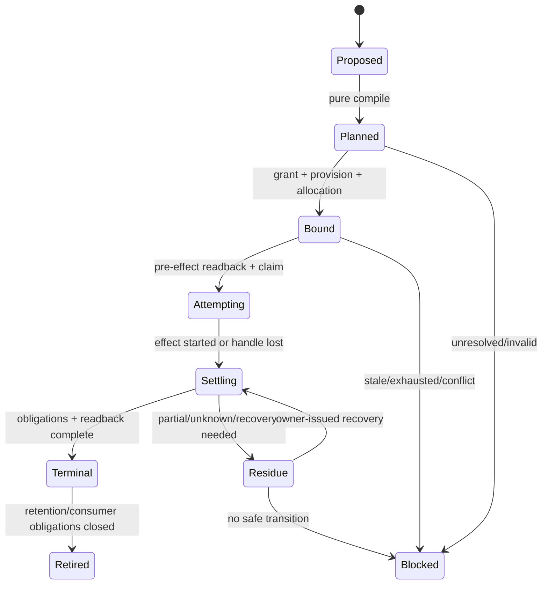
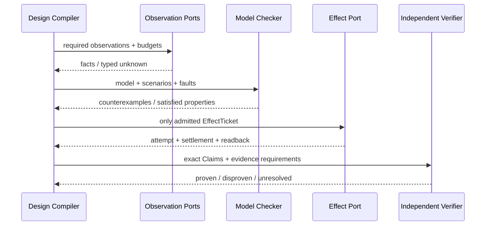

# 设计编译与模拟

本片段拥有 Design Compiler、Operation/Effect 参考模型、未来义务、模型演算、故障族与场景规格。

本片段与 [owner root](../design-calculus.md) 共享同一 domain，但只拥有 registry 分配给本片段的 ownership keys；跨片段语义使用引用，不复制定义。

## 5. 设计编译器

### 5.1 输入与输出

```text
DesignInput = {
  acceptedOutcomes,
  nonGoals,
  classifiedStatements,
  exactObservations,
  declaredUniverseAndCoverage,
  engineeringPrinciples,
  projectDecisions,
  domainDefinitions,
  capabilityFacts,
  resourceFacts,
  existingGraph,
  futureObligations,
  candidateGenerators,
  costAndDominanceCriteria,
  unknownFrontier
}

DesignVerdict = {
  status: admitted | blocked | proposal | retired,
  coverageTensor,
  minimalCausalGraph,
  candidateModels,
  objectDispositions,
  ownerDag,
  requirementDag,
  purePlan,
  effectObligations,
  proofObligations,
  evolutionPlan,
  attackResults,
  unknownFrontier,
  lifecycleCost,
  dominanceProof,
  reversalConditions
}

ObjectDisposition =
  required | derivable | duplicate-owner | dominated | orphan | future-obligation | unknown
```

### 5.2 编译流水线

```mermaid
flowchart LR
  I[Classified input] --> O[Outcome closure]
  O --> W[Exact world and coverage model]
  W --> Q[Requirement-space expansion]
  Q --> Y[Competing architecture synthesis]
  Y --> G[Minimal causal models]
  G --> D[Deletion and replacement counterfactuals]
  D --> U[Owner/consumer assignment]
  U --> R[Requirement DAG]
  R --> P[Provision eligibility]
  P --> B[Binding/resource plan]
  B --> T[Transition/recovery model]
  T --> V[Proof/evolution obligations]
  V --> A[Adversarial model checks]
  A --> C[Cost/dominance reduction]
  C --> X[Verdict + exact frontier]
```



每一阶段是纯编译；外部观察和 Effect 由明确 port 执行后作为新输入进入下一 revision。编译器不得在分析中隐式执行命令、写缓存、建目录、安装依赖或改变外部状态。

### 5.3 核心伪函数

```text
classify(statement, provenance) -> Statement | Unknown
compileOutcome(decisions, constraints) -> OutcomeGraph | Conflict
observe(port, requirement, budget) -> Observation | TypedFailure
buildCausalGraph(outcome, observations, definitions) -> Graph + Unknown
expandRequirementSpace(capabilities, dimensions, reachability) -> CoverageTensor
synthesizeCompetingModels(requirements, existingGraph, providerFacts) -> CandidateModels
counterfactualDelete(node, graph) -> OutcomeDelta + CostDelta + ObligationsDelta
counterfactualReplace(model, alternative) -> TraceDelta + CostDelta + RiskDelta
classifyNode(node) -> ObjectDisposition
assignUniqueOwners(graph) -> OwnerDAG | DuplicateOwner
compileRequirements(graph) -> RequirementDAG
resolveEligibleProvisions(requirement, facts) -> ProvisionSet | Unavailable
bind(requirement, provision, grant, epoch) -> Binding | TypedFailure
reserve(parentLedger, binding, demand) -> Allocation | Exhausted
compileTransition(preState, intent, invariants) -> PurePlan | Conflict
admitEffect(plan, grant, binding, allocation, currentReadback) -> EffectTicket | Blocked
settle(attempt, obligations, readback) -> Terminal | Residue | Unknown
verify(claim, independentEvidence) -> Proven | Disproven | Unresolved
compileEvolution(oldGraph, targetGraph, obligations) -> CutoverPlan | Blocked
```

没有默认成功分支。所有闭集必须显式枚举；开放世界输入必须保存 `Unknown`。

### 5.4 全局架构合成与固定点对抗验证

Design Compiler 不能只验证提交给它的单一方案；它必须从相同需求空间生成结构不同的竞争模型。至少覆盖下列 realization 轴，随后由 constraint、trace equivalence、全生命周期成本和 reversal 做 Pareto reduction：

| 设计轴 | 必须比较的候选族 |
| --- | --- |
| existence | delete/derive/project、active implementation、bounded FutureObligation |
| ownership | single domain owner、shared lower-level primitive、独立 platform owner、external owner |
| composition | direct pure call、typed port、compiled workflow、policy-free microkernel、external workflow Provider |
| state | stateless、ephemeral attempt、durable journal、external authoritative state |
| execution | in-process、retained child process、durable local worker、remote Provider |
| topology | centralized mechanism/decentralized policy、partitioned cells、distributed service |
| reuse | no sharing、contract/algorithm/fact/port/provider/workflow-pattern reuse |
| production | governed-authored、deterministic-generated、mature external capability |
| evolution | atomic replacement、bounded migration、retirement、typed unavailable |

不存在“默认选最抽象、最集中、最少文件或最新工具”。候选只有在全部 hard constraints 成立、业务 trace 不弱化、unknown 未越界，并且在 owner/scan/state/test/context/resource/recovery/maintenance 成本上非支配时才可接受。开放世界不能证明绝对全局最优；可声称的最强结论是：

```text
DesignOptimalWithinCoverage =
  exact declared universe
  ∧ generated requirement/alternative coverage
  ∧ no known hard-constraint violation
  ∧ Pareto non-dominated among generated candidates
  ∧ explicit bounded unknown and reversal frontier
```

架构系统自身也是被设计的 Subject，但不能用自己的规则自证正确。验证必须反复生成反例、竞争模型与反转条件，直到本轮 coverage 内达到固定点；独立 verifier 仍需从输入事实重算：

```text
ArchitectureMetaValidationClosure(A) =
  BusinessCapabilityClosure(A)
  ∧ counterfactualDelete(A components)
  ∧ competingMetaModelSynthesis(A)
  ∧ implementationRefinementTotal(A)
  ∧ all runtime controls trace to A inputs
  ∧ independent verification of A claims
  ∧ bounded meta-model evolution
```

任何反例证明active calculus、coverage dimensions、fault families、compiler stages、entity/relation grammar或实现机制缺项时，依赖该假设的design packages、plans、conformance models与Evidence全部stale。修复顺序是扩展唯一meta-model、验证既有可表达子集等价、重编所有受影响projection，再迁移/退役被替代generation；禁止只在发生反例的domain追加字段、检查或Skill。

## 6. Operation 与 Effect 参考模型



```text
EffectAdmitted =
  OutcomeBound
  ∩ DesignAdmitted
  ∩ LiveAuthorityGrant
  ∩ ExactCapabilityBinding
  ∩ ReservedResources
  ∩ FreshPreimage

Terminal =
  all(settlementObligations fulfilled)
  ∧ exact domain readback
  ∧ resources released or residue recorded
```

启动、PID、回调返回、进程退出、HTTP 2xx、commit、push 或测试 PASS 都只是 Observation，不能单独成为 Terminal。

## 7. 未来义务与无当前 consumer 的设计

“没有当前 consumer”不自动等于垃圾；“未来可能有用”也不构成存在证明。

```text
FutureObligation = {
  identity,
  acceptedOutcomeRef,
  missingConsumerOrCapability,
  activationCondition,
  targetOwner,
  maximumCarryingCost,
  proofAtActivation,
  retirementCondition,
  reversalCondition
}
```

| 状态 | 处置 |
| --- | --- |
| 当前 consumer 必需 | `required`；进入 active graph |
| 完全可由 owner 事实生成 | `derivable`；删除存储镜像 |
| 已接受未来义务且维护成本有界 | `future-obligation`；保留为 proposal/spec，不进入 runtime active graph |
| 同义 owner 已存在 | `duplicate-owner`；迁移后删除 |
| 有更小完整方案 | `dominated`；删除 |
| 无 outcome、consumer、future obligation | `orphan`；删除 |
| 外部 consumer/价值无法判定 | `unknown`；限制 Effect，不伪删也不伪保留 |

未来抽象不得以 active facade、空 index、兼容 alias、公共 DTO 或第二 dispatcher 占用生产图；激活时从义务重新编译当前最小设计。

## 8. 模型演算

### 8.1 性质

| Property | 必须满足 |
| --- | --- |
| Safety | 不允许的 Effect、真值、身份、权限和数据状态不可达 |
| Liveness | 在授权、资源和合法下一步存在时能到达 Terminal；无无界等待 |
| Determinism | 相同 semantic inputs/algorithm/unknown 产生 byte-equivalent pure output |
| Recoverability | 每个 admitted Effect 到达 Terminal、typed Residue 或 Blocked |
| Compositionality | 子图合同成立且边界满足时，组合不新增未声明权威 |
| Canonical fact uniqueness | 每项authored fact/relation只有一个owner payload；所有组合与视图只引用它 |
| Projection fidelity | renderer或查询变化不改变identity、meaning、blocker、unknown、revision或Claim |
| Disclosure minimality | view包含purpose所需最小完整闭包；无关private flow不可达，授权审计仍可覆盖全部适用事实 |
| Monotonicity | 新 Evidence 只收窄 unknown 或推翻 Claim，不凭投影扩大 authority |
| Evolution | cutover 后旧 active writer/parser/route consumer 数为零 |
| Economy | 正确变更的 scan/state/test/context/recovery/maintenance 总成本不增或有接受理由 |

### 8.2 故障注入接口

```text
simulate(model, trace, faults) -> {
  reachedStates,
  emittedEffects,
  settlements,
  evidence,
  residues,
  violations
}

faults = {
  staleSnapshot, concurrentReplacement, missingProvider,
  budgetExhaustion, cancellation, timeout, partialWrite,
  processCrash, lostHandle, duplicateDelivery, reorderedEvent,
  malformedPersistentState, unknownSchema, credentialRedirect,
  pathAlias, dependencyCycle, externalMutation, contextLoss
}
```

模型发布前必须生成最短反例；没有反例不代表正确，只有覆盖声明内未发现反例。

## 9. 通用对抗族

| ID | 攻击 | 必须观察 | 合法结果 | 禁止结果 |
| --- | --- | --- | --- | --- |
| F01 | 同名/同路径冒充身份 | issuer、revision、physical/logical binding | typed mismatch | 按字符串接受 |
| F02 | stale snapshot | exact revision、invalidation | stale/block/reobserve | 沿旧 plan Effect |
| F03 | unknown 穿越边界 | dependency frontier | bounded block | unknown→false/cache miss/success |
| F04 | 权限放大 | principal、grant、requested Effect | intersection | caller DTO 自授权 |
| F05 | Provider 替换 | requirement、provision、binding | rebind or unavailable | ambient fallback |
| F06 | 资源重置 | parent ledger、all child allocations | exhausted/bounded | 每层新 timeout/counter |
| F07 | 并发非重入 | session contract、ordering | sequence/join/typed conflict | 放宽 capability |
| F08 | handle 丢失 | durable intent、domain readback | terminal/recovery/unknown | blind retry |
| F09 | cleanup 失败 | primary error、cleanup obligations | preserve both/residue | cleanup 覆盖主错误 |
| F10 | crash 中间态 | journal、pre/post identity | recover/quarantine | 当 absent 重新 Effect |
| F11 | schema 漂移 | schema identity、exact parser、migration | migrate/block | 同 identity 放宽 parser |
| F12 | owner/facade 成环 | declaration/reference DAG | move contract/invert dependency | 双向 import/callback 绕环 |
| F13 | projection 镜像 | derivation inputs、consumer | generate/delete mirror | 手写路径/计数/版本清单 |
| F14 | 自证 Evidence | producer/evidence issuer | independent/unresolved | producer PASS=完成 |
| F15 | duplicate Effect delivery | OperationKey、claim、readback | join/dedupe/recover | 第二次执行 |
| F16 | future abstraction | accepted obligation、activation | proposal/activate/retire | active empty shell/自动误删 |
| F17 | context loss | durable facts、authorization | re-admit/continue/block | summary 生成事实/权限 |
| F18 | external consumer unknown | protocol evidence、support window | bounded unknown | repo `rg` 零即删公共协议 |
| F19 | cache poisoning | ActionKey、producer、environment、readback | miss/reject | path/mtime-only hit |
| F20 | migration coexistence | old/new readers/writers、cutover | one active generation | 永久双写/兼容壳 |
| F21 | hidden source graph | executable bytes、parser ownership | typed source/opaque | 字符串藏代码逃逸分析 |
| F22 | large/unbounded input | entries、bytes、depth、time、signal | bounded residue | 只限制一维 |
| F23 | presentation as protocol | machine interface/schema | strict parser | 解析人类文本 |
| F24 | architecture change | old/new consumer graph | transactional cutover | 移文件后手修路径 |
| F25 | 把一种展示结构误作事实本体 | canonical fact refs、typed relation、query purpose、coverage/frontier、view digest | 关系事实唯一；按用途选择lossless renderer | 目录树冒充owner、手写全图、独立view漂移、摘要隐藏blocker |

## 10. 场景规格模板

每个项目场景只填写此模板，不复制演算规则：

```text
Scenario = {
  identity,
  acceptedOutcome,
  exactInitialFacts,
  relationGraph,
  applicablePrinciples,
  competingModels,
  deletionCounterfactual,
  requiredObservations,
  allowedTransitions,
  forbiddenTransitions,
  faultSet,
  expectedSettlement,
  proofObligations,
  unknownFrontier,
  reversalCondition
}
```


