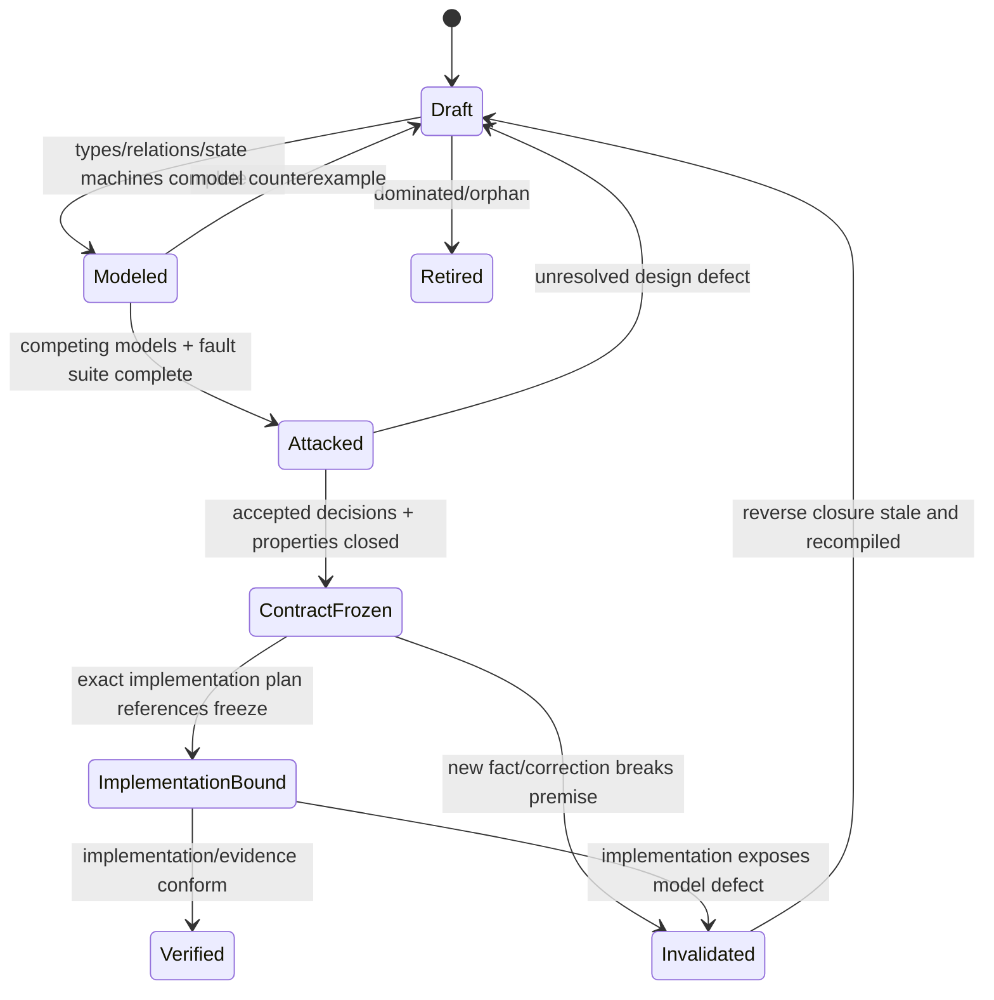
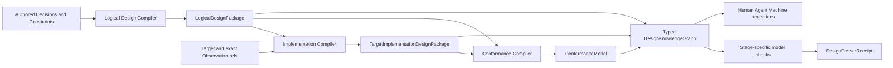
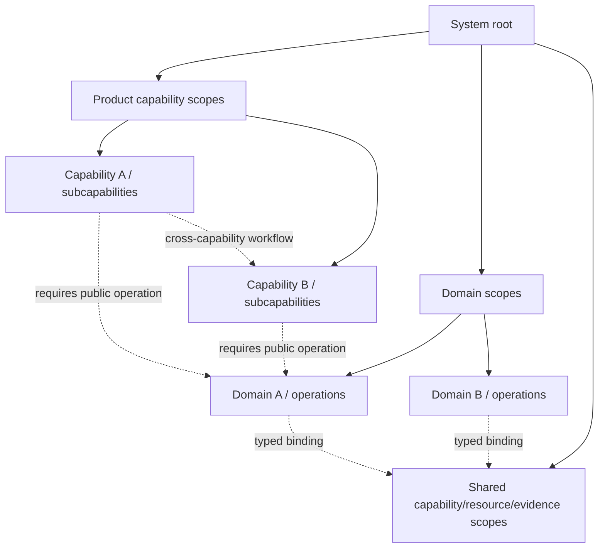

# 设计冻结与演进

本片段拥有 Design Package、知识产物、伪实现完整性、逻辑验证、反例传播与设计完成。

本片段与 [owner root](../design-calculus.md) 共享同一 domain，但只拥有 registry 分配给本片段的 ownership keys；跨片段语义使用引用，不复制定义。

## 11. Design Freeze 与知识产物



除bounded experiment外，生产实现只消费`ContractFrozen`的`LogicalDesignPackage`与`TargetImplementationDesignPackage` refs；experiment只能消解指定unknown，不能进入active product graph或签发完成。

```text
DesignKnowledgeGraph = {
  authoredDecisionRefs,
  principleAndConstraintRefs,
  exactPremiseAndObservationRefs,
  rationaleIndexRefs,
  logicalDesignPackageRef,
  targetImplementationDesignPackageRef?,
  conformanceModelRef?,
  alternativesAndDominanceRef,
  unknownFrontierRef,
  invalidationGraphRef
}

DesignPackageEnvelope = {
  stage: logical | implementation | conformance,
  exactInputRefs,
  exactOutputRef,
  unresolvedFrontierRef,
  modelRevision,
  contentDigest
}
```

`DesignKnowledgeGraph`只连接不同 owner 的 typed refs，不复制它们的 payload；`DesignPackageEnvelope`只封装某一设计阶段的可重算产物。逻辑、实现与符合性信息绝不压进一个自由对象，也不共用 revision 或 writer：

| Knowledge product | 唯一内容 | 不得包含 | Authority |
| --- | --- | --- | --- |
| `DesignDecision` | 不可推导取舍、前提、备选、选择理由、反转条件 | 可重算 graph、实现清单、运行结果 | 仅对应 Product/Domain/Policy 决策 |
| `LogicalDesignPackage` | Domain、Operation、Workflow、State/Failure、Authority/Resource/Proof/Evolution 语义 | file/package/provider/store/process/deployment | 无新增 Authority；引用 accepted decisions |
| `TargetImplementationDesignPackage` | components、ports、data topology、placement、runtime、toolchain、performance realization | 新产品语义、当前仓盘点、迁移批次 | 无新增 Authority；证明对逻辑设计的 refinement |
| `ConformanceModel` | 跨逻辑与实现的性质、生成场景、fault traces、expected observations、Claim obligations | producer 自报 PASS、当前执行结果 | 定义验证问题，不签发 verdict |
| `ArchitectureMigration` | 某个 exact observed graph 到已冻结 target 的一次性演进 | target design 修改、永久兼容、通用原则 | 仅在独立 change operation 授权内 |
| `DesignFreezeReceipt` | exact package/model checks 已结算的事实 | 被验证设计的内容副本、实现或发布权限 | 只证明相应 freeze Claim |

不可推导的设计取舍用同一 owner 内的结构化决策记录保存，不另建平行日志：

```text
DesignDecision = {
  identity,
  questionRef,
  purposeAndNonGoalRefs,
  sourceStatementRefs,
  exactPremiseRefs,
  requirementAndConstraintRefs,
  candidateCoverageRef,
  selectedAlternativeRef,
  acceptedConsequenceRefs,
  implementationAndConformanceObligationRefs,
  unknownFrontierRef,
  acceptedBy + authority,
  reversalPredicateRef,
  supersededDecisionRefs
}
```

冻结不是作者标签，而是由 architecture/change state owner 签发的可失效事实：

```text
DesignFreezeReceipt = exact owner-issued {
  receiptRef,
  packageKind,
  packageRef,
  packageDigest,
  exactInputBindingRef,
  modelRevisionRefs,
  checkResultDigest,
  unresolvedFrontierRef,
  outcome: frozen | blocked | stale,
  issuerOwnerRef,
  issuerAuthorityRef,
  validityAndInvalidationRefs
}
```

只有`outcome=frozen`且`unresolvedFrontierRef`为空或已证明与该 package 的目标
outcome/Effect/Claim 不相交时，receipt 才能满足 `DesignFreeze`；`blocked`、`stale`、
caller 自报状态、测试退出码、提交或文档存在都不能替代它。receipt 只证明指定
`packageRef/packageDigest`通过指定 model/check revision，不包含 package 内容、实现
权限或运行成功；任一 input binding、model/compiler revision、frontier、reversal 或
issuer authority 变化都会沿反向依赖使 receipt stale。重复签发同一 package 的并列
receipt 必须合并为同一 owner 的 latest valid receipt，不能形成第二冻结事实源。

`hardConstraintResults`、`dominanceAndCostResults`、`rejectedReasons`、`avoidedFaultTraces`和`invalidationImpact`不由人重复填写；它们由上述refs编译成typed `DesignExplanationTrace`并挂入`DesignRationaleIndex`。后来者在inputs、premises、candidate coverage和reversal未变化时直接复用裁决；出现新事实时沿reverse closure进入演进，而不是重新做无边界讨论或在旧结论上叠补丁。

### 11.1 权威输入、编译产物与持久载体

Design Calculus 是纯演算规则，不是记录库、全局 registry 或工作流 owner。设计信息按权威和生命周期分层：

| 信息 | 唯一 owner / carrier | 可持久化位置类别 | Authority |
| --- | --- | --- | --- |
| Product/Domain Decision | 对应 Product/Domain canonical owner | versioned authored source，由 documentation/semantic registry 定位 | 定义 accepted outcome/取舍 |
| Principle/Constraint | Design Calculus 或 Engineering/Agent Constitution | versioned canonical authority source | 定义演算/拒绝语义 |
| exact premise/Observation | observation/provider owner | immutable receipt 或 runtime state | 只证明观察范围内事实 |
| DesignDecision | 提出问题的同一 canonical owner | owner source 内的 structured decision；不建第二 decision log | 保存不可推导取舍 |
| DesignKnowledgeGraph | Design Compiler | typed refs + content-addressed generated index，可随 inputs 重建 | 无独立 Authority；不复制 payload |
| LogicalDesignPackage | Logical Design Compiler | content-addressed generated artifact，可随 decisions/definitions 重建 | 无独立 Authority；引用 Product/Domain inputs |
| TargetImplementationDesignPackage | Implementation Compiler | content-addressed generated artifact，可随 logical/target/catalog facts 重建 | 无独立 Authority；只签发 realization decision |
| ConformanceModel | Conformance Compiler | content-addressed properties/scenarios/obligations | 不签发运行 Verdict |
| DesignFreezeReceipt | architecture/change operation state owner | durable runtime state | 只证明某 package/revision 已通过指定 model checks |
| human/Agent/machine view | projection compiler | generated documentation/context/artifact | 无增权投影 |

```text
DesignKnowledgeComplete =
  every accepted outcome/invariant/choice has one authored owner ref
  ∧ every source is typed by statement-kind/role/issuer/authority/coverage/freshness
  ∧ every design subject has a generated DesignRationaleIndex
  ∧ every derived conclusion has exact inputs + compiler/model ref
  ∧ every realization has a LogicalDesignPackage refinement ref
  ∧ every proof obligation has a ConformanceModel ref
  ∧ every unresolved question has an owned frontier + closure condition
  ∧ every projection contains no unique information
```

删除任何载体前先证明其中每项信息在上述关系中仍可达；“别处提过”“Git能找回”“AI记得”或“可以重新分析”都不构成知识保存。反之，同一meaning在两个authored载体中出现不是保险，而是必须删除的competing owner。



物理path由对应Placement/lifecycle owner选择，不进入任何设计产物的semantic identity。领域尚未采用machine-native Decision IR时，canonical authority document可作为authored carrier；结构化owner启用后，文档只保留由该IR生成的阅读投影，不能双写。

只有 `DesignDecision` 中的 accepted choice 是不可重算的 authority input。constraint evaluation、cost vector、dominance、fault traces、impact 与 projections 都从 exact refs 编译；同 digest 直接复用，premise/reversal/model revision 变化只使反向依赖的 package、conformance model 与 freeze receipt stale。设计理由因此由原决策 owner 保留，计算过程由派生产物保留，任何阅读文档都不需要复制整套知识。

### 11.2 伪实现完整性

| 维度 | 伪实现必须给出 | 不能拖到编码期 |
| --- | --- | --- |
| semantic | ADT、identity、invariants、unknown | 用可选字段临时拼对象 |
| ownership | owner DAG、public surface、consumer edges | 写完再移动文件/解环 |
| operation | pure decision functions、Requirement DAG | 在 Effect callback 内做策略 |
| capability | ports、eligible provisions、typed unavailable | 直接绑首个工具/环境 |
| authority | grant input、intersection、expiry、delegation | caller boolean/self-digest |
| resource | parent ledger、dimensions、allocation/return | 每层补 timeout |
| effect | preimage、linearization point、idempotency | 用 exit code定义成功 |
| lifecycle | states、legal transitions、terminal/residue | catch 中随意 cleanup/retry |
| durable | exact schema/parser/writer/readback/migration | `JSON.parse as Type` |
| proof | Claims、independence、freshness、reuse | 绿色测试=完成 |
| performance | cold/warm/delta cost model、ActionKey | 出现 14 秒后才加 cache |
| evolution | cutover、consumer-zero、retirement | 保留永久兼容/alias |
| placement | cell/layer/visibility/lifecycle derived path | 边写边改目录 |
| test | property/effect/failure/protocol scenarios | 镜像实现细节 |

### 11.3 设计逻辑验证

```text
validateDesignPackage(package):
  assert exactSchema(package)
  assert everyDesignSubjectHasTypedSourcePurposeAndRationaleIndex(package)
  assert noRationaleDependsOnItsOwnImplementationOrVerdict(package)
  assert everyChosenAlternativeRecordsConsequencesAndObligations(package)
  assert everyAcceptedCapabilityHasGeneratedConcernAndFaultClosure(package)
  assert candidateModelsCoverEveryApplicableRealizationAxis(package)
  assert everySelectedModelHasDominanceProofAndReversal(package)
  assert acyclic(package.ownerDag, package.referenceGraph)
  assert uniqueOwners(package.identities, writers, parsers, resolvers, terminals)
  assert everyRuntimeControlTracesToAcceptedDefinitionOrExactObservation(package)
  assert everyOperationHasRequirementsAndPureDecision(package)
  assert everyEffectHasGrantBindingAllocationSettlementRecovery(package)
  assert everyDurableStateHasStrictReadbackAndEvolution(package)
  assert everyClaimHasIndependentEvidenceSemantics(package)
  assert everyFutureObjectHasConsumerOrFutureObligation(package)
  assert everyAuthoredOrPublicNodeHasComplexityExistenceProof(package)
  assert counterfactualDeletionAndReuseAlternativesAreEvaluated(package)
  assert allApplicableFaultFamiliesHaveExpectedTerminalTrace(package)
  assert ArchitectureMetaValidationClosure(package.metaModelAndCompiler)
  assert modelCheck(safety, liveness, determinism, recovery, evolution, economy)
  assert projectionsPreserveMeaning(package)
```

| Adversarial attack | 检测 | 必须拒绝 |
| --- | --- | --- |
| source laundering | 沿issuer/authority/coverage回溯每项premise | suggestion、summary、path或self-digest冒充Fact/Decision |
| post-hoc rationale | 检查decision input revision先于implementation/verdict，并禁止反向依赖 | “因为已经写了/测过/迁移贵所以正确” |
| reason mirror | 比较authored payload与generated trace meaning | 文档、测试、代码各写一份理由 |
| candidate theater | 对适用realization axes重算coverage | 只列一个方案后宣称最优 |
| fault-list theater | 从graph concern families生成fault closure | 手工挑选容易通过的反例 |
| consequence hiding | 检查selected candidate的cost承担者、失去能力和future obligations | 只写收益、不写代价或非目标 |
| conformance loop | 检查实现包不引用ConformanceModel/Verdict/Evidence producer | 实现按自己的验证器定义正确 |
| future-abstraction purge | 检查accepted FutureObligation与closure condition | 仅因当前consumer为零删除已接受未来能力 |
| speculative shell retention | 检查obligation reachability与existence proof | 用“以后可能有用”保留空owner/alias |
| knowledge loss | 删除前重算typed reachability和projection uniqueness | 依赖Git历史、AI记忆或重新分析恢复理由 |
| unbounded optimality | 核对declared axes与unknown frontier | 把有限候选比较称为全局绝对最优 |

### 11.4 反例传播

```text
invalidate(premise, observation):
  affected := reverseClosure(premise,
    designDecisions + implementationPlans + codeDeltas + tests + evidence)
  markStale(affected)
  preserveUnrelatedState()
  return newDraft(exact observation, unresolved frontier)
```

不得在被推翻的 Design Package 上继续加字段、测试、兼容 alias 或 Skill 说明。

### 11.5 反例吸收与全域回扫

本节只约束Design Calculus的authoring/evolution与设计者/Agent行为；它不是产品capability、DomainOperation、runtime workflow、Effect admission或业务完成条件，也不得被lower进目标系统。目标系统的完整性仍由已冻结的semantic origin、contract lowering、conformance与admission保证，不能依赖未来设计者发现反例。

反例传播只使旧结论失效；反例吸收必须回答“为什么设计方法先前没有生成该义务”，但因果诊断不能预先决定修复位置。每个新反例先最小化为一个可重放的property trace，并标出全部必要因果边界；gap class只决定必须扩展的观察或推理空间，不授予某个owner局部打补丁的优先权：

| Gap class | 失败事实 | 必须进入候选变更集的边界 | 全域回扫输入 |
| --- | --- | --- | --- |
| `expression-gap` | meta-model无法表达关键区别、关系或终态 | meta-model、被压平的domain distinctions、所有依赖projection | 全部owner fragments与既有Design Packages |
| `universe-gap` | 应观察对象未进入exact census/coverage/frontier | observation frontend、source kinds、root/closure law | exact content/provider/runtime universe |
| `applicability-gap` | 对象已知，但Coverage Compiler未生成适用cell/故障 | relation laws、constraint/fault generators、profile | 全部可达entities×relations×boundaries×lifecycle |
| `refinement-gap` | 逻辑义务存在，但实现没有origin/lowering/conformance trace | logical package、implementation topology、lowering与placement | 全部public/durable/state/effect/proof declarations |
| `enforcement-gap` | 违规已可表达且可观察，但类型/parser/admission未拒绝 | contract、operation boundary、capability、effect route | 全部同类入口、writer、reader与Effect sink |
| `proof-gap` | 实现违规，但Claim/test/Evidence未观察到 | property、observer、issuer independence、verification topology | 受影响claims、fault traces与independence rules |
| `evolution-gap` | 新设计已闭合，但旧writer/reader/route/state仍active | preservation map、migration state、cutover/retirement topology | generations、consumers、durable residue与rollback paths |

```text
assimilateDesignCounterexample(counterexample):
  witness := minimizeToPropertyTrace(counterexample)
  gaps := classifyAllNecessaryCausalBoundaries(witness)
  candidates := synthesizeWholeSystemChangeSets(gaps, exactUniverse, acceptedOutcomes)
  selected := selectNondominatedChangeSet(candidates, hardConstraints, lifecycleCost)
  if selected is not uniquely decidable: preserve exact decision frontier
  apply selected to definitions, boundaries, owners, algorithms and evolution model
  provePreviouslyExpressibleSubsetPreserved()
  affected := reverseClosure(changedMetaFactsOrAlgorithms)
  results := recompileAndScan(affected exact universe)
  require every result in satisfied | violated(code) | bounded-unknown(frontier)
  retire local checks, mirrors and superseded generations
  publish DesignCounterexampleAssimilationRecord(witness, gap, affected, results)
```



```mermaid
flowchart LR
  C[Counterexample] --> W[Minimal property trace]
  W --> G[All necessary causal boundaries]
  G --> M[Competing whole-system change sets]
  M --> O[Non-dominated atomic selection]
  O --> E[Old-subset and outcome equivalence]
  E --> A[Reverse affected closure]
  A --> S[Whole declared-universe scan]
  S --> R[Results + exact frontier]
  R --> T[Retire local patches and old generation]
```

禁止把每个反例追加成提示词、Skill条款、手写测试清单或单点`if`；它们只能是吸收前的witness。若反例可由现有模型表达却未被设计编译过程看到，候选集必须包含修`universe/applicability`而不扩充ontology的方案；若新区别确实独立改变admission、authority、lifecycle、invalidation、consumer visibility或用户结果，候选集才允许`expression-gap`演进meta-model。开放世界仍保留exact unknown frontier；设计方法可证明的是exact compiled universe内生成与回扫完备，不得把有限coverage夸成已穷尽现实的一切。

### 11.6 独立对抗固定点

重复同一审查器、输入、顺序或提示不增加置信度。审查策略本身是受审Subject；其覆盖由目标graph生成，而不是维护固定问题清单：

```text
ReviewStrategyUniverse = leastFixedPoint(
  exact DesignClosureManifest
  × applicable concern/fault/realization/evolution cells
  × epistemic methods {
      normative-top-down, observed-bottom-up, relation-and-refinement,
      state-and-interleaving, relational-hyperproperty,
      authority-threat-and-privacy,
      resource-scale-and-economy, quantitative-stochastic-and-feedback,
      migration-and-retirement,
      external-mechanism-comparison, human-operations-and-maintenance,
      meta-review-and-mutation
    }
  × every generated cross-family interaction that shares a subject, relation,
    state, resource, authority, consumer, effect or claim
)
```

上列methods是彼此不同的观察方式，不是封闭故障枚举；任何能产生新可区分结果的方法都扩展该universe并使旧review closure stale。外部机制比较必须从相同Requirement/constraint/cost vector评估直接复用、薄port、吸收算法、保持现状和删除能力，不能按知名度或新旧选择工具。

```text
AdversarialReviewRun = {
  exactDesignGenerationDigest,
  exactUniverseAndStrategyDigest,
  methodAndImplementationRef,
  independenceBasis,
  perturbation: order + seed + scale + faultSchedule,
  examinedCellsAndInteractionsDigest,
  injectedNonEquivalentMutants,
  findings,
  unknownFrontier,
  result: clean | finding | blocked
}

ReviewWaveDelta = generated {
  exactDesignGenerationDigest,
  completedRunRefs,
  allNewValidatedFindings,
  repeatedOrDominatedWitnessRefs,
  sharedCausalCuts,
  competingSystemChangeSetRefs,
  invalidatedConclusionRefs,
  remainingUnverifiedStrategies,
  fixedPointResetReason | none,
  waveDigest
}

Independent(a, b) =
  distinct failure hypothesis
  and distinct observation or derivation path
  and no shared unverified verdict/projection/cache
```

一个review wave完成任意一批独立runs后必须发布一次完整delta；不能只挑“最先发现”或“最严重”的finding叙述，也不能把尚未验证的候选写成缺陷。`ReviewWaveDelta`是由run records生成的无增权投影，完整finding records仍由review artifact owner持有；下一wave只报告新增、失效与剩余frontier，不重复倾倒旧清单。

一个`finding`触发whole-system change-set synthesis；任何DesignInput、universe、strategy、model、implementation或migration变化都会使此前clean runs stale并把稳定计数归零。clean只在审查器能拒绝其适用的非等价mutation、保留等价mutation且没有隐藏unknown时成立。

```text
AdversarialFixedPointClosed =
  DesignClosed(exact target slice)
  and every applicable ReviewStrategyUniverse cell has a fresh clean run
  and every reachable cross-family interaction has a fresh clean run
  and all injected non-equivalent mutants are rejected at the expected boundary
  and meta-review yields no missing method, dimension, root or interaction
  and target-intersecting unknownFrontier is empty
  and every cell in RequiredStabilityBasis has a causally independent
      post-change epoch converging on the same universe, closure and frontier digests

RequiredStabilityBasis = minimal generated hitting set for common-mode failures in
  semantic model/coverage,
  implementation/verifier,
  order/seed/scale/fault schedule,
  observation/provider/source stratum
```

`RequiredStabilityBasis`不是固定次数：它从本轮review graph的共享依赖与可能common-mode failure生成；每个basis cell至少需要一个不共享该失败源的epoch。同一次PASS重跑、同一实现换提示词或同一projection换展示均不独立。发现任何有效新反例后重新生成strategy universe与basis并从零开始。达到此固定点只允许停止该exact target slice的主动设计审查；后来出现的新事实、方法、外部机制或reversal predicate仍按reverse closure使相关结论stale。

## 12. 设计完成

设计完成不是一个项目级boolean，也不能由文档数量、评审通过、测试绿色或“暂时想不到问题”产生。它是针对`exact universe + root subjects + target/profile + compiler revisions`的递归闭包；任何一项变化只使reverse-reachable闭包stale。

### 12.1 Recursive Design Closure

`DesignClosureNode`不是新的Domain、owner或目录identity；它是Design Compiler以现有ProductCapability、Domain、Operation、Workflow、Infrastructure Cell、Interface或Evolution root为键生成的递归视图。parent/child只能来自这些对象自身已经成立的semantic containment；`requires/uses/binds/projects/proves/migrates`永远是cross-boundary relation，不能为了得到一棵树伪装成containment。

```text
ClosureDimensionStatus =
  closed(exactPackageRef)
  | not-applicable(derivationRef)
  | blocked(frontierRef)

DesignClosureNode = {
  rootSubjectRef,
  parentRootRef | root,
  childRootRefs,
  crossBoundaryRelationRefs,
  exactUniverseSliceDigest,
  dimensions: {
    definition,
    logical,
    implementation,
    conformance,
    evolution
  },
  reverseConsumerRefs,
  unresolvedFrontierRef,
  closureDigest
}
```

containment只表达语义分解；共享Provider、资源、Evidence、外部合同和跨Domain workflow通过typed cross-boundary relations引用，不能为了让closure成为树而复制到多个child。每个child可以独立冻结，但parent只有在自身合同、全部适用children和全部cross-boundary obligations都闭合后才闭合。



### 12.2 Completion vector

| Dimension | 完成必须证明 | 不能冒充 |
| --- | --- | --- |
| definition | accepted outcome/non-goal、Subjects、Definitions、invariants、不可推导取舍与unknown owner | 当前实现、测试、用户一句模糊偏好 |
| logical | operation/workflow、state/failure、authority/resource/proof/evolution obligations与coverage cells闭合 | file/package/provider选择 |
| implementation | 每个logical obligation有唯一realization/refinement、placement、API/data/runtime topology、algorithm/complexity/failure计划 | 代码已存在、路径清单、空facade |
| conformance | 双向trace、property/scenario/fault/evidence模型可独立判定，unknown不穿越目标Claim | producer自测、样例PASS |
| evolution | current→target preservation、migration/recovery/cutover/consumer-zero/retirement完整 | 默认兼容、手工搬迁、Git可找回 |

纯原则或无物理实现的scope可以由compiler证明某个dimension为`not-applicable`；不得用null、缺字段或作者声明跳过。ProductCapability、Effect、durable state、public protocol和active migration相关scope通常不能把implementation、conformance或evolution默认为不适用。

`DesignClosed`与交付状态严格分离：

```text
DesignStatus      = draft | modeled | attacked | closed | stale | blocked
RealizationStatus = unimplemented | implementing | implemented-unverified
                  | verified | activated | terminal | retired
```

设计可以closed而尚未实现；实现、测试或发布完成也不能反推设计closed。每个状态引用不同owner的exact receipt，禁止一个`status: complete`压平。

### 12.3 Whole-system closure manifest

```text
DesignClosureManifest = generated {
  exactUniverseDigest,
  rootSubjectRefs,
  targetAndProfileRefs,
  designCompilerAndModelRefs,
  recursivelySortedClosureNodes,
  crossBoundaryObligationRefs,
  observedSurplusDispositions,
  unresolvedFrontierRef,
  closureDigest
}
```

manifest只聚合refs/status/digests，不复制package内容或签发authority。roots不能由当前任务手工挑选：它们来自accepted ProductCapability roots，以及System Architecture对exact Source Program、configuration/workflow、durable state、Effect/provider、public/external surface的双向universe reconciliation。observed-only对象必须映射到logical owner、明确retirement或受影响unknown；normative-only对象必须映射到implementation、accepted FutureObligation或`required-unmaterialized`。

```text
compileSystemDesignClosure(acceptedRoots, exactWorld):
  universe := compileBidirectionalSystemDesignUniverse(acceptedRoots, exactWorld)
  scopes := recursivelyDecomposeBySemanticContainment(universe)
  for each scope:
    compile applicable concern/fault/realization coverage
    compile definition/logical/implementation/conformance/evolution dimensions
    close child scopes and cross-boundary relations
  reconcile every observed node and every normative obligation
  emit manifest with exact frontier; never omit an unclosed node
```

局部任务消费同一manifest的最小recursive slice；全系统审计完全展开同一manifest。二者不能拥有不同roots、frontier或completion semantics。任何collapsed subtree必须保留identity、closure status、blocker/unknown digest和expansion handle。

### 12.4 Own-scope 与 recursive completion

```text
OwnScopeDesignClosed(scope) =
  scope belongs to exact compiled SystemDesignUniverse
  ∧ accepted outcomes and non-goals are explicit
  ∧ every required success trace reaches a valid terminal in at least one admissible realization
  ∧ required failure traces remain distinguishable; universal block is not a realization
  ∧ all statements are typed
  ∧ every design subject resolves all applicable rationale queries or preserves exact unknown
  ∧ minimal causal graph is complete within declared coverage
  ∧ every identity/parser/writer/resolver/terminal has one owner
  ∧ every accepted capability has generated concern/fault closure
  ∧ every applicable realization axis has competing candidates
  ∧ every selected model has dominance proof and reversal
  ∧ every runtime control traces to accepted Definition or exact Observation
  ∧ every Effect has grant, binding, allocation, settlement and recovery
  ∧ every Claim has proof semantics and independence requirements
  ∧ every unknown has an exact affected frontier
  ∧ every future abstraction has accepted obligation or is removed
  ∧ every authored/public node has an existence proof and deletion counterfactual
  ∧ all fault families applicable to the graph have expected outcomes
  ∧ every accepted design counterexample has a classified assimilation record and affected-universe rescan
  ∧ active meta-model/compiler satisfies ArchitectureMetaValidationClosure
  ∧ safety/liveness/determinism/recovery/evolution/economy are checked
  ∧ project projections reference rather than copy this calculus

DesignClosed(root, exactUniverse, targetProfile) =
  OwnScopeDesignClosed(root)
  ∧ every applicable closure dimension is closed or proven not-applicable
  ∧ all recursively contained child roots are DesignClosed
  ∧ every cross-boundary relation has compatible contracts at both endpoints
  ∧ every generated multi-party interaction hyperedge satisfies CompositionClosed
  ∧ every normative-only item is materialized, an accepted FutureObligation, or blocking
  ∧ every observed-only item is explained, retired by a closed evolution plan, or blocking
  ∧ every unresolved frontier is provably disjoint from the target outcomes/Effects/Claims
  ∧ one generated DesignClosureManifest preserves the complete recursive status
```

“declared coverage”必须是System Architecture从accepted roots与exact world双向编译的universe slice，不能由scope owner自行缩小。未满足时输出exact frontier、owner、受影响scope/cells和下一项纯设计动作；不得以“文档已写”“以后测试”“实现时再看”结束设计。

### 12.5 迁移设计完成与执行准入

```text
MigrationDesignReady(current, targetSlice) =
  DesignClosed(targetSlice root, exact relevant universe slice, target profile)
  ∧ AdversarialFixedPointClosed(targetSlice)
  ∧ exact current implementation/state/consumer universe intersecting targetSlice observed
  ∧ target implementation/conformance/evolution packages frozen
  ∧ total current→target subject/state/capability/data/consumer preservation map
  ∧ every removed behavior has accepted retirement or stronger replacement
  ∧ every writer/reader/resolver/Effect route assigned one cutover state
  ∧ migration state machine covers concurrency, crash, retry, rollback and typed residue
  ∧ resource/time/authority/disclosure budgets compiled
  ∧ pre/post/CAS/readback/consumer-zero obligations compiled
  ∧ executable Work Package DAG references only frozen package revisions

MigrationExecutionAdmitted =
  MigrationDesignReady
  ∩ live AuthorityGrant
  ∩ exact current preimage
  ∩ bound capabilities/resources
```

`MigrationDesignReady`只证明可以开始实现/迁移，不证明任何文件已移动、代码已写、状态已转换或业务能力已闭合。正式执行后仍分别需要implementation readback、Conformance verdict、activation、new-generation observation和old-generation retirement。

```text
ReadyMigrationConservation =
  MigrationDesignReady(targetSlice)
  ∧ live authority/capability/resource availability
  ∧ every global open frontier is causally disjoint from targetSlice
  => schedule targetSlice migration now
```

无关的全系统设计、其他domain frontier或未来能力不得阻塞已经闭合的最小迁移slice；相交frontier必须由typed relation证明，不能用“全工程尚未完成”笼统阻塞。执行中的迁移也不冻结全系统设计：新反例若与该slice相交则使准入stale并进入其recovery/rollback规则，不相交则继续并行演进。

不存在“整个开放世界永久设计完成”。可证明的最强结论是某个exact generation/profile/universe上的root closure；新产品意图、外部合同、Target、Source Program节点、Effect、fault dimension或reversal observation出现时，compiler扩展universe并只使reverse-reachableclosure stale。这既不允许以未知世界阻止所有工作，也不允许把未观察范围藏在“已经完成”里。

### 12.6 Design frontier 与下一义务编译

```text
DesignFrontierItem = {
  frontierRef,
  gapKind: universe | definition | logical | implementation | conformance | evolution,
  affectedRootRefs,
  missingInputOrDecisionRefs,
  predecessorFrontierRefs,
  canonicalOwnerRef,
  affectedCoverageCells,
  closurePredicate,
  invalidationDigest
}

compileNextDesignWave(manifest):
  open := all frontier items intersecting requested target roots
  reject items whose owner or closure predicate is unbound
  ready := open where every predecessor is closed
  order causally: universe -> definition -> logical -> implementation -> conformance -> evolution
  coalesce ready items only when same input revision/atomic system change boundary
  emit every MigrationDesignReady slice as immediately schedulable work
  return minimal ready antichain + ready migrations + exact blocked remainder
```

文件位置、最近失败、Issue编号、Agent兴趣、测试数量或聊天顺序不能决定设计顺序。一个frontier影响多个scope时必须生成whole-system change sets再选择非支配解并重编reverse closure；互不相交的ready items可以作为独立design packages并行，但同一schema、state machine或migration generation保持单一写者。完成一个item必须满足其closure predicate并使manifest重编，而不是把文字标成done。已经`MigrationDesignReady`且资源/authority可用的slice必须立即迁移，不能为了继续扩大不相交设计而无限等待。
