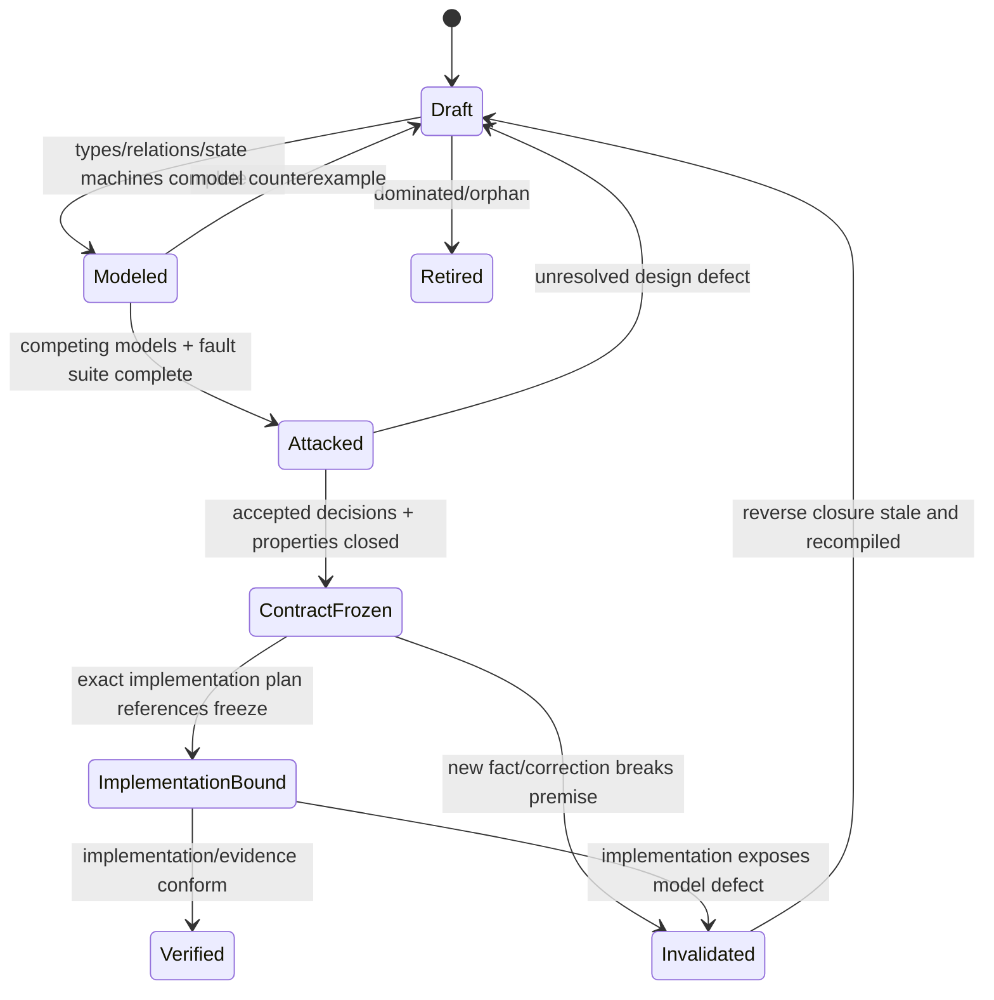
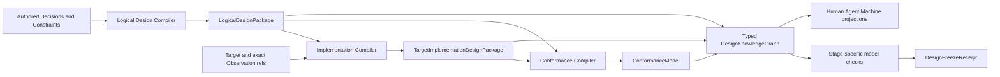
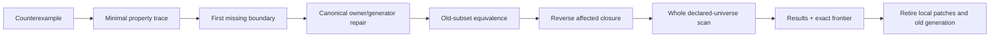

# 设计冻结与演进

本片段拥有 Design Package、知识产物、伪实现完整性、逻辑验证、反例传播与设计完成。

本片段与 [owner root](../design-calculus.md) 共享同一 domain，但只拥有 registry 分配给本片段的 ownership keys；跨片段语义使用引用，不复制定义。

## 11. Design Freeze 与知识产物



除bounded experiment外，生产实现只消费`ContractFrozen`的`LogicalDesignPackage`与`TargetImplementationDesignPackage` refs；experiment只能消解指定unknown，不能进入active product graph或签发完成。

```text
DesignKnowledgeGraph = {
  authoredDecisionRefs,
  principleAndConstraintRefs,
  exactPremiseAndObservationRefs,
  rationaleIndexRefs,
  logicalDesignPackageRef,
  targetImplementationDesignPackageRef?,
  conformanceModelRef?,
  alternativesAndDominanceRef,
  unknownFrontierRef,
  invalidationGraphRef
}

DesignPackageEnvelope = {
  stage: logical | implementation | conformance,
  exactInputRefs,
  exactOutputRef,
  unresolvedFrontierRef,
  modelRevision,
  contentDigest
}
```

`DesignKnowledgeGraph`只连接不同 owner 的 typed refs，不复制它们的 payload；`DesignPackageEnvelope`只封装某一设计阶段的可重算产物。逻辑、实现与符合性信息绝不压进一个自由对象，也不共用 revision 或 writer：

| Knowledge product | 唯一内容 | 不得包含 | Authority |
| --- | --- | --- | --- |
| `DesignDecision` | 不可推导取舍、前提、备选、选择理由、反转条件 | 可重算 graph、实现清单、运行结果 | 仅对应 Product/Domain/Policy 决策 |
| `LogicalDesignPackage` | Domain、Operation、Workflow、State/Failure、Authority/Resource/Proof/Evolution 语义 | file/package/provider/store/process/deployment | 无新增 Authority；引用 accepted decisions |
| `TargetImplementationDesignPackage` | components、ports、data topology、placement、runtime、toolchain、performance realization | 新产品语义、当前仓盘点、迁移批次 | 无新增 Authority；证明对逻辑设计的 refinement |
| `ConformanceModel` | 跨逻辑与实现的性质、生成场景、fault traces、expected observations、Claim obligations | producer 自报 PASS、当前执行结果 | 定义验证问题，不签发 verdict |
| `ArchitectureMigration` | 某个 exact observed graph 到已冻结 target 的一次性演进 | target design 修改、永久兼容、通用原则 | 仅在独立 change operation 授权内 |
| `DesignFreezeReceipt` | exact package/model checks 已结算的事实 | 被验证设计的内容副本、实现或发布权限 | 只证明相应 freeze Claim |

不可推导的设计取舍用同一 owner 内的结构化决策记录保存，不另建平行日志：

```text
DesignDecision = {
  identity,
  questionRef,
  purposeAndNonGoalRefs,
  sourceStatementRefs,
  exactPremiseRefs,
  requirementAndConstraintRefs,
  candidateCoverageRef,
  selectedAlternativeRef,
  acceptedConsequenceRefs,
  implementationAndConformanceObligationRefs,
  unknownFrontierRef,
  acceptedBy + authority,
  reversalPredicateRef,
  supersededDecisionRefs
}
```

`hardConstraintResults`、`dominanceAndCostResults`、`rejectedReasons`、`avoidedFaultTraces`和`invalidationImpact`不由人重复填写；它们由上述refs编译成typed `DesignExplanationTrace`并挂入`DesignRationaleIndex`。后来者在inputs、premises、candidate coverage和reversal未变化时直接复用裁决；出现新事实时沿reverse closure进入演进，而不是重新做无边界讨论或在旧结论上叠补丁。

### 11.1 权威输入、编译产物与持久载体

Design Calculus 是纯演算规则，不是记录库、全局 registry 或工作流 owner。设计信息按权威和生命周期分层：

| 信息 | 唯一 owner / carrier | 可持久化位置类别 | Authority |
| --- | --- | --- | --- |
| Product/Domain Decision | 对应 Product/Domain canonical owner | versioned authored source，由 documentation/semantic registry 定位 | 定义 accepted outcome/取舍 |
| Principle/Constraint | Design Calculus 或 Engineering/Agent Constitution | versioned canonical authority source | 定义演算/拒绝语义 |
| exact premise/Observation | observation/provider owner | immutable receipt 或 runtime state | 只证明观察范围内事实 |
| DesignDecision | 提出问题的同一 canonical owner | owner source 内的 structured decision；不建第二 decision log | 保存不可推导取舍 |
| DesignKnowledgeGraph | Design Compiler | typed refs + content-addressed generated index，可随 inputs 重建 | 无独立 Authority；不复制 payload |
| LogicalDesignPackage | Logical Design Compiler | content-addressed generated artifact，可随 decisions/definitions 重建 | 无独立 Authority；引用 Product/Domain inputs |
| TargetImplementationDesignPackage | Implementation Compiler | content-addressed generated artifact，可随 logical/target/catalog facts 重建 | 无独立 Authority；只签发 realization decision |
| ConformanceModel | Conformance Compiler | content-addressed properties/scenarios/obligations | 不签发运行 Verdict |
| DesignFreezeReceipt | architecture/change operation state owner | durable runtime state | 只证明某 package/revision 已通过指定 model checks |
| human/Agent/machine view | projection compiler | generated documentation/context/artifact | 无增权投影 |

```text
DesignKnowledgeComplete =
  every accepted outcome/invariant/choice has one authored owner ref
  ∧ every source is typed by statement-kind/role/issuer/authority/coverage/freshness
  ∧ every design subject has a generated DesignRationaleIndex
  ∧ every derived conclusion has exact inputs + compiler/model ref
  ∧ every realization has a LogicalDesignPackage refinement ref
  ∧ every proof obligation has a ConformanceModel ref
  ∧ every unresolved question has an owned frontier + closure condition
  ∧ every projection contains no unique information
```

删除任何载体前先证明其中每项信息在上述关系中仍可达；“别处提过”“Git能找回”“AI记得”或“可以重新分析”都不构成知识保存。反之，同一meaning在两个authored载体中出现不是保险，而是必须删除的competing owner。



物理path由对应Placement/lifecycle owner选择，不进入任何设计产物的semantic identity。领域尚未采用machine-native Decision IR时，canonical authority document可作为authored carrier；结构化owner启用后，文档只保留由该IR生成的阅读投影，不能双写。

只有 `DesignDecision` 中的 accepted choice 是不可重算的 authority input。constraint evaluation、cost vector、dominance、fault traces、impact 与 projections 都从 exact refs 编译；同 digest 直接复用，premise/reversal/model revision 变化只使反向依赖的 package、conformance model 与 freeze receipt stale。设计理由因此由原决策 owner 保留，计算过程由派生产物保留，任何阅读文档都不需要复制整套知识。

### 11.2 伪实现完整性

| 维度 | 伪实现必须给出 | 不能拖到编码期 |
| --- | --- | --- |
| semantic | ADT、identity、invariants、unknown | 用可选字段临时拼对象 |
| ownership | owner DAG、public surface、consumer edges | 写完再移动文件/解环 |
| operation | pure decision functions、Requirement DAG | 在 Effect callback 内做策略 |
| capability | ports、eligible provisions、typed unavailable | 直接绑首个工具/环境 |
| authority | grant input、intersection、expiry、delegation | caller boolean/self-digest |
| resource | parent ledger、dimensions、allocation/return | 每层补 timeout |
| effect | preimage、linearization point、idempotency | 用 exit code定义成功 |
| lifecycle | states、legal transitions、terminal/residue | catch 中随意 cleanup/retry |
| durable | exact schema/parser/writer/readback/migration | `JSON.parse as Type` |
| proof | Claims、independence、freshness、reuse | 绿色测试=完成 |
| performance | cold/warm/delta cost model、ActionKey | 出现 14 秒后才加 cache |
| evolution | cutover、consumer-zero、retirement | 保留永久兼容/alias |
| placement | cell/layer/visibility/lifecycle derived path | 边写边改目录 |
| test | property/effect/failure/protocol scenarios | 镜像实现细节 |

### 11.3 设计逻辑验证

```text
validateDesignPackage(package):
  assert exactSchema(package)
  assert everyDesignSubjectHasTypedSourcePurposeAndRationaleIndex(package)
  assert noRationaleDependsOnItsOwnImplementationOrVerdict(package)
  assert everyChosenAlternativeRecordsConsequencesAndObligations(package)
  assert everyAcceptedCapabilityHasGeneratedConcernAndFaultClosure(package)
  assert candidateModelsCoverEveryApplicableRealizationAxis(package)
  assert everySelectedModelHasDominanceProofAndReversal(package)
  assert acyclic(package.ownerDag, package.referenceGraph)
  assert uniqueOwners(package.identities, writers, parsers, resolvers, terminals)
  assert everyRuntimeControlTracesToAcceptedDefinitionOrExactObservation(package)
  assert everyOperationHasRequirementsAndPureDecision(package)
  assert everyEffectHasGrantBindingAllocationSettlementRecovery(package)
  assert everyDurableStateHasStrictReadbackAndEvolution(package)
  assert everyClaimHasIndependentEvidenceSemantics(package)
  assert everyFutureObjectHasConsumerOrFutureObligation(package)
  assert everyAuthoredOrPublicNodeHasComplexityExistenceProof(package)
  assert counterfactualDeletionAndReuseAlternativesAreEvaluated(package)
  assert allApplicableFaultFamiliesHaveExpectedTerminalTrace(package)
  assert ArchitectureMetaValidationClosure(package.metaModelAndCompiler)
  assert modelCheck(safety, liveness, determinism, recovery, evolution, economy)
  assert projectionsPreserveMeaning(package)
```

| Adversarial attack | 检测 | 必须拒绝 |
| --- | --- | --- |
| source laundering | 沿issuer/authority/coverage回溯每项premise | suggestion、summary、path或self-digest冒充Fact/Decision |
| post-hoc rationale | 检查decision input revision先于implementation/verdict，并禁止反向依赖 | “因为已经写了/测过/迁移贵所以正确” |
| reason mirror | 比较authored payload与generated trace meaning | 文档、测试、代码各写一份理由 |
| candidate theater | 对适用realization axes重算coverage | 只列一个方案后宣称最优 |
| fault-list theater | 从graph concern families生成fault closure | 手工挑选容易通过的反例 |
| consequence hiding | 检查selected candidate的cost承担者、失去能力和future obligations | 只写收益、不写代价或非目标 |
| conformance loop | 检查实现包不引用ConformanceModel/Verdict/Evidence producer | 实现按自己的验证器定义正确 |
| future-abstraction purge | 检查accepted FutureObligation与closure condition | 仅因当前consumer为零删除已接受未来能力 |
| speculative shell retention | 检查obligation reachability与existence proof | 用“以后可能有用”保留空owner/alias |
| knowledge loss | 删除前重算typed reachability和projection uniqueness | 依赖Git历史、AI记忆或重新分析恢复理由 |
| unbounded optimality | 核对declared axes与unknown frontier | 把有限候选比较称为全局绝对最优 |

### 11.4 反例传播

```text
invalidate(premise, observation):
  affected := reverseClosure(premise,
    designDecisions + implementationPlans + codeDeltas + tests + evidence)
  markStale(affected)
  preserveUnrelatedState()
  return newDraft(exact observation, unresolved frontier)
```

不得在被推翻的 Design Package 上继续加字段、测试、兼容 alias 或 Skill 说明。

### 11.5 反例吸收与全域回扫

反例传播只使旧结论失效；反例吸收必须修正“为什么系统先前没有生成该义务”。每个新反例先最小化为一个可重放的property trace，再且仅归入下列首个真实缺口：

| Gap class | 失败事实 | 必须修正的唯一owner | 全域回扫输入 |
| --- | --- | --- | --- |
| `expression-gap` | meta-model无法表达关键区别、关系或终态 | Design Calculus meta-model | 全部owner fragments与既有Design Packages |
| `universe-gap` | 应观察对象未进入exact census/coverage/frontier | 对应observation/frontend/Source Program owner | exact content/provider/runtime universe |
| `applicability-gap` | 对象已知，但Coverage Compiler未生成适用cell/故障 | constraint/fault/applicability compiler | 全部可达entities×relations×boundaries×lifecycle |
| `refinement-gap` | 逻辑义务存在，但实现没有origin/lowering/conformance trace | Implementation Compiler | 全部public/durable/state/effect/proof declarations |
| `enforcement-gap` | 违规已可表达且可观察，但类型/parser/admission未拒绝 | 对应contract/admission owner | 全部同类入口、writer、reader与Effect sink |
| `proof-gap` | 实现违规，但Claim/test/Evidence未观察到 | Verification owner | 受影响claims、fault traces与independence rules |
| `evolution-gap` | 新设计已闭合，但旧writer/reader/route/state仍active | Change Management + state owner | generations、consumers、durable residue与rollback paths |

```text
assimilate(counterexample):
  witness := minimizeToPropertyTrace(counterexample)
  gap := classifyFirstMissingBoundary(witness)
  repairCanonicalGenerator(gap.owner, witness)
  provePreviouslyExpressibleSubsetPreserved()
  affected := reverseClosure(changedMetaFactsOrAlgorithms)
  results := recompileAndScan(affected exact universe)
  require every result in satisfied | violated(code) | bounded-unknown(frontier)
  retire local checks, mirrors and superseded generations
  publish CounterexampleAssimilationReceipt(witness, gap, affected, results)
```



禁止把每个反例追加成提示词、Skill条款、手写测试清单或单点`if`；它们只能是吸收前的witness。若反例可由现有模型表达却未被当前operation看到，必须修`universe/applicability`而不是扩充ontology。若新区别确实独立改变admission、authority、lifecycle、invalidation、consumer visibility或用户结果，才允许`expression-gap`演进meta-model。开放世界仍保留exact unknown frontier；系统可证明的是声明宇宙内生成与回扫完备，不得把有限coverage夸成已穷尽现实的一切。

## 12. 设计完成

```text
DesignClosed =
  accepted outcomes and non-goals are explicit
  ∧ all statements are typed
  ∧ every design subject resolves all applicable rationale queries or preserves exact unknown
  ∧ minimal causal graph is complete within declared coverage
  ∧ every identity/parser/writer/resolver/terminal has one owner
  ∧ every accepted capability has generated concern/fault closure
  ∧ every applicable realization axis has competing candidates
  ∧ every selected model has dominance proof and reversal
  ∧ every runtime control traces to accepted Definition or exact Observation
  ∧ every Effect has grant, binding, allocation, settlement and recovery
  ∧ every Claim has proof semantics and independence requirements
  ∧ every unknown has an exact affected frontier
  ∧ every future abstraction has accepted obligation or is removed
  ∧ every authored/public node has an existence proof and deletion counterfactual
  ∧ all fault families applicable to the graph have expected outcomes
  ∧ every accepted counterexample has a classified assimilation receipt and affected-universe rescan
  ∧ active meta-model/compiler satisfies ArchitectureMetaValidationClosure
  ∧ safety/liveness/determinism/recovery/evolution/economy are checked
  ∧ project projections reference rather than copy this calculus
```

未满足时输出 exact frontier、owner、反例与下一项纯设计动作；不得以“文档已写”“以后测试”“实现时再看”结束设计。
