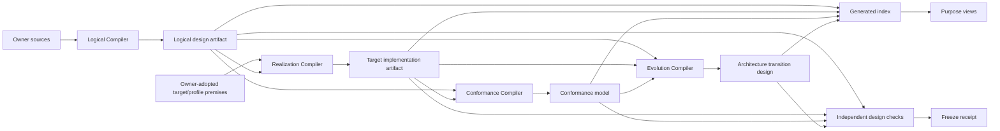

# 设计冻结、递归完成与演进

本文拥有Design knowledge artifacts、dependency DAG、freeze receipt、recursive completion、adversarial fixed point、frontier scheduling与meta-model evolution。它不实现迁移，也不把设计完成投影为代码、测试、发布或runtime完成。

## 1. Knowledge artifact DAG

不可推导的meaning只存在于owner source；其余均为content-addressed projection：

| artifact | producer | authority ceiling |
| --- | --- | --- |
| Product/Domain Decision or Definition | authorized semantic owner | accepted meaning/tradeoff only |
| Principle/Constraint | Calculus/Constitution owner | generic rule only |
| exact Premise/Observation | observation/provider owner | observed scope only |
| LogicalDesignArtifact | Logical Design Compiler | closed logical obligations; no implementation choice |
| TargetImplementationArtifact | Realization Compiler | one target realization; no Claim/Verdict |
| ConformanceModel | Conformance Compiler | properties/scenarios; no runtime Evidence |
| ArchitectureTransitionDesign | Evolution compiler | exact current→target preservation/migration/cutover/retirement design; no Effect |
| DesignKnowledgeIndex | Design Compiler | refs/digests/coverage locator only |
| DesignFreezeReceipt | design-check operation owner | exact design-artifact/model checks only |
| human/AI/machine view | projection compiler | no unique meaning or writeback |



Index只帮助定位：checker必须重读referenced owner/design-artifact bytes并重算digest。Index缺失可重建；index与source不一致时拒绝，不能修改source迁就index。

### 1.1 Allowed dependency direction

```text
OwnerDecision/Definition -> NormativeSlice -> LogicalDesignArtifact
LogicalDesignArtifact + adopted target premises -> TargetRealization -> TargetImplementationArtifact
LogicalDesignArtifact + TargetImplementationArtifact + FaultCalculus -> ConformanceModel
LogicalDesignArtifact + TargetImplementationArtifact + ConformanceModel -> ArchitectureTransitionDesign
StageArtifactRefs -> DesignKnowledgeIndex -> GeneratedViews
StageArtifacts + independent ModelChecks -> DesignFreezeReceipt
```

Forbidden reverse edges：

```text
LogicalDesignArtifact -/-> current SourceProgram | observed implementation | target implementation artifact
TargetImplementationArtifact -/-> ConformanceModel | Evidence | Verdict | Index | View
ConformanceModel -/-> TestResult | Evidence | Verdict | Index | View
CanonicalOwner -/-> Facade | Barrel | RegistryProjection | GeneratedView
Any source/design-artifact -/-> its own FreezeReceipt or positive Verdict
```

Facade、barrel和index若为解环而被上游import，说明最小contract放错owner；应把contract移到双方共同依赖的Responsibility scope，而不是增加type-only/dynamic/callback/string edge。

```text
ArtifactDagClosed =
  acyclic(all source, design-artifact, index, projection dependencies)
  and every compiler reads upstream contracts only
  and every index/view is rebuildable and authority-free
  and every facade has independent public demand and zero reverse dependency
  and no Evidence/Verdict defines its own Claim or implementation
```

## 2. Stage artifact status

```text
DesignStageArtifactStatus =
  | ArtifactPresent { artifactRef, artifactDigest }
  | StageNotApplicable { derivationRef }
  | StageBlocked { frontierRefs }
```

缺字段或`null`不能表示not-applicable。Product capability、Effect、durable/public protocol或active evolution相关scope通常不能跳过implementation、conformance或evolution；必须由reachability证明。

```text
DesignKnowledgeIndex = exact {
  generation/purpose/universe refs,
  root closure refs,
  stageStatusRefs,
  rationale/coverage/frontier refs,
  indexDigest
}
```

Index不复制stage payload、Decision、default或summary truth。

## 3. Design Freeze

```text
DesignFreezeReceipt =
  | FrozenDesign {
      exact input generation and design-artifact refs,
      model/compiler/check refs,
      checked property/coverage refs,
      independent readback refs,
      receiptDigest
    }
  | FreezeBlocked {
      exact input refs,
      frontier/violation refs
    }
  | FreezeStale {
      prior receipt ref,
      changed input/invalidation refs
    }
```

Freeze只证明某组exact design artifacts在指定model/check coverage下成立。它不签发implementation、Effect、test、migration、merge、publication或support authority。

```text
FreezeAdmissible =
  design artifact exact-schema and canonical bytes
  and all referenced owner sources/artifact inputs read back
  and ArtifactDagClosed
  and compilation/conformance results valid for same generation
  and no intersecting unknown/frontier
  and verifier is independent from artifact producer for claimed checks
```

## 4. Pseudo-implementation completeness

Implementation Design在编码前必须足够具体，但仍无runtime Effect：

| dimension | required design | forbidden deferral |
| --- | --- | --- |
| semantic | ADT、identity、invariant、unknown | optional-field万能对象 |
| owner/boundary | recursive scope、owner DAG、public surface、consumer edges | 写完再搬/解环 |
| operation | pre/post、Requirement DAG、linearization、idempotency | callback内临时决策 |
| capability/authority | ports、eligible provisions、grant intersection、typed unavailable | ambient first-found/caller boolean |
| resource | dimensions、parent allocation、consume/return/leak/fairness | 每层独立timeout/counter |
| effect/recovery | preimage、attempt、settlement、readback、residue/retry | exit code成功、catch cleanup |
| durable | schema/parser/writer/CAS/readback/migration | `JSON.parse as Type` |
| proof | Claims、property、independence、freshness、invalidation | “以后补测试” |
| performance | cold/warm/delta model、ActionKey、complexity bound | 出现慢后局部cache |
| evolution | preservation/cutover/consumer-zero/retirement | 永久alias/dual route |
| placement | responsibility scope/realization/visibility/lifecycle-derived decision | path先行 |

`required-unmaterialized`表示这些设计已闭合但现实实现不存在；不是未设计，也不是已实现。

## 5. Adversarial fixed point

重复同一reviewer、提示、输入顺序或工具不增加coverage。Review strategy本身是被审Subject：

```text
ReviewStrategyUniverse = leastFixedPoint(
  exact DesignClosureManifest
  × applicable concern/fault/realization/evolution coordinates
  × methods {
      normative-top-down,
      observed-bottom-up,
      relation-and-refinement,
      state/interleaving/model-checking,
      relational-hyperproperty,
      authority/threat/privacy,
      resource/scale/economy,
      stochastic/feedback,
      migration/retirement,
      external-mechanism-comparison,
      human-operation/maintenance,
      meta-review/mutation
    }
  × generated cross-family interactions
)
```

```text
ReviewStrategyResult =
  | StrategyClean { strategyRef, coverageDigest }
  | StrategyFinding { strategyRef, counterexampleRefs }
  | StrategyBlocked { strategyRef, frontierRefs }
```

一轮finding必须先经counterexample assimilation改变model/design artifact或证明已有predicate覆盖，再重新生成strategy universe。允许停止exact target slice主动设计审查的条件：

```text
AdversarialFixedPointClosed =
  every generated strategy has a terminal result
  and no independent strategy yields a new counterexample
  and all findings are assimilated and reverse closure recompiled
  and blocked strategies are disjoint from target claims/effects
  and a meta-review mutation adds no new non-dominated strategy
```

后来出现新事实、方法、provider或reversal仍会使相关closure stale；fixed point不是宇宙永久完成。

## 6. Recursive design closure

Closure投影 [system scope topology](../system-architecture/scope-and-domain-topology.md)，不新建ProductCapability/Domain树：

```text
ClosureParent =
  | ClosureRoot
  | NestedClosure { parentClosureRef }

ClosureDimensionStatus =
  | ClosedDimension { exactArtifactRef }
  | NotApplicableDimension { derivationRef }
  | BlockedDimension { frontierRefs }

DesignClosureNode = {
  rootSemanticScopeRef,
  purposeRef,
  parent: ClosureParent,
  childClosureRefs,
  crossBoundaryRelationRefs,
  exactUniverseSliceDigest,
  dimensions: definition/logical/implementation/conformance/evolution,
  reverseConsumerRefs,
  completion: ClosedNode | OpenNode { frontierRefs },
  closureDigest
}
```

Shared Provider、resource、Evidence、workflow与evolution保持cross-boundary refs，不复制进多个child。Child可独立freeze；parent只有自身、全部适用children与cross-boundary obligations闭合才closed。

### 6.1 Purpose manifests

```text
DesignClosureManifest = exact common {
  purposeRef,
  exactUniverseDigest,
  rootClosureRefs,
  compiler/model refs,
  recursivelySortedClosureNodeRefs,
  crossBoundaryObligationRefs,
  completion,
  manifestDigest
} & (
  | TargetDesignManifest {
      target/profile refs,
      stage artifact refs,
      required-unmaterialized/future-obligation refs
    }
  | ObservedInventoryAuditManifest {
      observation generation/coverage refs,
      intrinsic finding/classification refs
    }
  | TargetRelativeAuditManifest {
      closed target manifest ref,
      observation refs,
      preserve/drift/surplus/unknown refs
    }
  | TransitionDesignManifest {
      closed target-relative audit ref,
      preservation/migration/recovery/cutover/retirement refs
    }
)
```

Purpose payload不可合并成nullable字段。Roots来自accepted Product/Domain roots与purpose contract，不由当前任务手选。局部task与whole-system review读取同一manifest的不同recursive slice。

## 7. Completion predicates

```text
OwnScopeDesignClosed(scope) =
  scope belongs to exact purpose universe
  and outcomes/non-goals/meaning/owner/reversal explicit
  and at least one required success trace is non-vacuously realizable
  and required failure traces remain distinguishable
  and every relation has active authority assignment and finite authority closure
  and every owner/parser/writer/resolver/terminal is unique
  and every operation closes state/failure/authority/capability/resource/effect/settlement
  and every positive Claim has independent proof semantics
  and every applicable concern/fault/realization coordinate classified
  and every selected candidate has hard-validity, dominance and reversal
  and every runtime control traces to accepted Definition or exact Observation
  and every future abstraction has accepted obligation or is removed
  and every unknown has exact affected frontier
  and all accepted counterexamples are assimilated
```

```text
TargetDesignClosed =
  recursively OwnScopeDesignClosed
  and every dimension closed or proven not-applicable
  and all child/cross-boundary obligations closed
  and every normative-only object has closed required-unmaterialized realization
      or accepted FutureObligation
  and intersecting frontier is empty

ObservedInventoryAuditClosed =
  every observed object/edge classified, covered or bounded-unknown
  and every claimed absence/duplicate/consumer-zero has exact census evidence
  and no target adoption/surplus conclusion is emitted

TargetRelativeCurrentAuditClosed =
  ObservedInventoryAuditClosed
  and exact closed target manifest bound
  and every target-only/observed-only/shared item has one typed reconciliation result

TransitionDesignClosed =
  TargetDesignClosed
  and TargetRelativeCurrentAuditClosed
  and total preservation/retirement/unknown map
  and transition crash/recovery/cutover/consumer-zero design closed
```

Design status与realization status绝不共用：

```text
DesignStatus = Draft | Modeled | Attacked | Closed | Stale | Blocked
RealizationStatus = Unimplemented | Implementing | ImplementedUnverified
                  | Verified | Activated | Terminal | Retired
```

## 8. Future obligations

```text
FutureObligation = {
  obligationRef,
  acceptedOutcomeRef,
  missing consumer/capability class,
  activation predicate,
  owning scope,
  maximum carrying cost,
  required proof at activation,
  review/expiry,
  retirement/reversal predicates
}
```

Future obligation保存在proposal/spec partition，不以空facade、public DTO、alias、dispatcher或production shell占据active graph。当前consumer零不删除已接受义务；没有accepted outcome/owner/trigger/acceptance/review的“未来可能”也不保留抽象。

## 9. Design frontier 与下一波

```text
DesignFrontierItem = {
  frontierRef,
  gapKind: universe | definition | logical | implementation | conformance | evolution,
  affectedScopeRefs,
  missingInputOrDecisionRefs,
  predecessorRefs,
  canonicalOwnerRef,
  affectedCoverageCoordinates,
  closurePredicate,
  invalidationDigest
}
```

```text
compileNextDesignWave(manifest):
  select open frontier intersecting requested roots
  reject unbound owner/closure predicates
  choose items whose predecessors are closed
  order only by causal dependency
  coalesce only same exact input and atomic system-change boundary
  return minimal ready antichain + exact blocked remainder
```

Issue号、最近报错、文件位置、Agent兴趣和测试数量不能决定顺序。该函数只投影设计义务，不创建任务、不授权Effect。

## 10. Migration design readiness

```text
MigrationDesignReady =
  TransitionDesignClosed
  and AdversarialFixedPointClosed
  and intersecting current implementation/state/consumer universe exact
  and target implementation/conformance/evolution artifacts frozen
  and total subject/state/data/capability/consumer preservation relation
  and every writer/reader/resolver/Effect route assigned one cutover state
  and concurrency/crash/retry/rollback/residue modeled
  and authority/resource/disclosure/pre-post/CAS/readback obligations compiled
```

```text
MigrationExecutionAdmitted =
  MigrationDesignReady
  ∩ live AuthorityGrant
  ∩ exact current preimage
  ∩ capability/resource bindings
```

Design Compiler只能产生前者。后者属于operation owner；二者不能合并。

## 11. Open-world evolution

```text
ConstraintCompleteWithinUniverse =
  every applicable coverage coordinate has exactly one terminal classification
  and every accepted success/failure trace has modeled terminal or frontier
  and no affected unknown reaches positive Claim, Binding, Effect or completion

OpenWorldExtensionSafe(old, newFactOrNeed) =
  existing model expresses new item
    ? recompile reverse-reachable closures
    : require meta-model evolution and mark possibly affected design artifacts stale
```

```text
ConservativeMetaModelEvolution(old, next) =
  every old valid model preserves meaning unless explicitly retired
  and every old rejected model remains rejected unless rule revision names change
  and old unknown never becomes positive by default
  and representation alone cannot alter identity/owner/authority/effect
  and affected design artifacts/views/receipts invalidate by exact reverse closure
```

新的entity、relation、behavior、resource、fault、Target、Provider或external contract要么由closed variant表达，要么先升级meta-model；不能藏进`misc`、自由字符串、optional字段或默认branch。

## 12. Freeze closure

```text
DesignFreezeClosed =
  ArtifactDagClosed
  and all purpose closure nodes recursively closed
  and required stage artifacts present or proven not-applicable
  and AdversarialFixedPointClosed
  and all rationale/future obligations/frontiers uniquely reachable
  and exact independent DesignFreezeReceipt issued
```

该结论只对`exact universe + roots + purpose + target/profile + compiler/model revisions`有效；任一输入改变只使reverse-reachable receipts stale。

<!-- sec-clause {"blocker":null,"kind":"stable-decision"} -->
## 规范片段

Design knowledge只有owner Decisions/Definitions不可重算；design artifacts、models、indices、views和receipts均是单向content-addressed carriers。设计完成按purpose和recursive semantic scope计算，必须通过独立对抗固定点并保留open-world frontier，且永不冒充实现、Effect、Verification或迁移完成。
