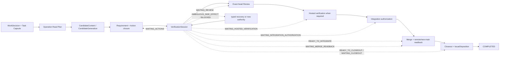
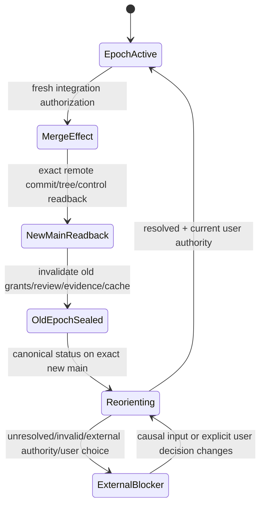

# 自主开发治理

本文拥有 SEC 仓库开发的事实源、计划分层、Role/Operation/Skill 边界、Issue/Work Package/PR/Evidence 生命周期、A0/Worker/Reviewer 权责、成熟轮子采用、可验证续跑和工程自主治理目标。具体启发式闭包只存在于 `.agents/skills/**`；机器可判断的规则必须下沉到代码合同。Skill适用性只由goal、role、operation kind、scope与治理代际裁决，不以Git、GitHub、compiler、container或其他provider是否当前可用来决定；provider不可用是领域operation的typed执行结果，不能使所需判断Skill消失或让Skill反向选择工具。

## 自主治理责任

SEC 的产品、架构、实现、测试、文档、CI、Review、分支和主干状态必须持续一致。维护者或 A0 不能只机械执行用户最后一句命令，也不能等待用户发现工程全局冲突。

每次任务都必须判断是否出现：

- 产品目标与实现方向不一致；
- roadmap 依赖颠倒或横切设施抢占产品主线；
- canonical owner重复、缺失或被 Proposal/Evidence/Projection竞争；
- 同类缺陷重复，说明共享抽象、状态 owner、fixture、selector或门禁缺失；
- 已有成熟轮子、标准或平台原语，却在Core重复实现通用机械能力；
- 外部库私有类型、AST、ID、默认行为或品牌模型泄漏进Semantic Core；
- 当前 `main` 已包含结果而旧 PR/branch/plan仍声称未完成；
- 活动 Work Package、rolling plan、Issue 或文档已被新事实取代；
- Skill/Agent/context机制复制机器规则或污染上下文；
- 已正确 candidate 只剩 merge/closeout，而不是继续制造修改。

发现这些情况时，工程动作可以是设计重算、最小修复、Provider/Adapter隔离、成熟轮子采用、合并、关闭、归档、删除重复实现或确认无修改；不能为了保持“持续开发”而制造无证据变化。

## Capability activation

Stable治理只定义activation和retirement条件，不维护“当前已实现/候选/后继”矩阵。一个development capability只有在machine contract、唯一producer/consumer、authority/effect boundary、failure/recovery、focused Verification与new-main readback闭合后才是active；类型、文档、Issue、Skill、candidate或模拟对象都不能提前提升。

exact current capability、maturity、provider availability和blocker由generated projection从latest main、machine contracts、Source Program与Evidence生成。projection缺失或冲突时保持unresolved；不得回读stable prose、rolling plan或AI memory补齐。
## 事实与授权顺序

```text
live repository / external facts
→ documentation registry + canonical domain owners
→ Product / Architecture / Roadmap decision
→ selected frozen Work Package + scope authorization
→ typed Operation Envelope
→ candidate implementation + owner-issued Actions
→ independent Review + required Evidence
→ single-use Integration authorization
→ provider Effect + exact readback
→ new-main trust reload + replan
```

`main` 是唯一正式产品事实。Branch、Issue、PR body、聊天、计划、Project 看板、审计报告、代码图、Completion Report 和模型记忆只提供导航、候选、决策或 Evidence，不能证明结果已进入主干。

Resolver 无法确定 default ref、target repository/workspace、active pointer、manifest bytes/digest、PR base/head、review/CI 或 authority owner时 fail closed。

## 计划与记录分层

- **`docs/product.md`**：产品问题、边界、用户结果和长期成功判据。
- **`docs/system-architecture.md`**：总体对象、两条主链、authority flow、单写者和跨域依赖。
- **`docs/roadmap.md`**：唯一稳定 capability DAG、阶段进入/退出和反转条件。
- **Documentation layers**：Stable spec、machine contract/registry、generated current projection与Runtime State/Evidence的唯一分层由System Architecture拥有；本领域只决定operation何时读取或更新哪个owner，不复制其定义。
- **GitHub Issue**：真实问题、依赖、竞争方案、决策、验收和反证；不是运行日志或第二 roadmap。
- **Rolling plan**：当前包与接下来二至五个条件化候选；不是永久 backlog或稳定架构。
- **Work Package Manifest**：被激活交付闭包的 frozen scope、authority、ownership、Gate 和退出合同。
- **Operation / Task Envelope**：一个执行者在 manifest 内的单角色、单 operation、单 seam授权。
- **Pull Request**：一个 exact candidate diff及其 Review 表面。
- **Checks/Artifacts/Evidence**：绑定 exact input/environment 的物理证明。
- **VerificationSession（T2 target owner）**：run、event、transition、resume和下一合法动作的唯一目标运行状态机；它只引用而不重定义Result、Evidence、Review、MainHealth、Work Package或Integration authority。普通resume只query、join或dispatch hosted transition，不持有physical merge/closeout capability。进入new main且ordinary canary通过前，真实下一动作仍从live Git/PR/manifest/Evidence重算。
- **GitHub Project**：Issue/PR的可视化投影。
- **`main`**：完成后的唯一产品结果。

Dynamic SHA、run、failure tail、current implementation清单、物理路径、命令参数、schema/version字面和临时候选不复制进stable docs。
它们分别由machine contract、generated current projection或Runtime State/Evidence拥有。Evidence可以保存架构裁决、实验和历史计划，
但不得自称当前状态源或长期路线owner；generated projection也不得被手工编辑成第二stable spec。

### 跨任务原则闭包与 Work Package 边界

Task Principle描述一类任务长期成立的用户结果、权限、owner、failure/recovery与完成不变量；Action Principle描述一次read、edit、test、provider/effect、delegation、commit、cleanup或stop的precondition、budget、readback和失败处置。两者都从Product终局与System Architecture最小因果图派生，Development Governance只拥有何时调用这些owner和如何消费typed decision，不复制对象分类、领域算法或全系统检查表。

任务中发现的规则先与现有canonical owner、machine contract和work identity做exact reconciliation。只服务本包且不改变全局不变量的内容留在frozen Work Package；可跨任务复用的事实进入唯一domain owner并由类型/parser/validator/module rule/test/CI提供可观察拒绝。聊天、summary、Issue comment、旧Work Package、AI memory或Skill prose只作线索，不能成为原则的唯一副本。

每个行动在执行前消费同一reduction/evolution owner对相关对象的`required | derivable | duplicate-owner | dominated | orphan | unknown`裁决及authority/resource intersection；该分类的语义由System Architecture唯一拥有。unknown阻断破坏性动作，derivable不允许手写持久副本，duplicate/dominated/orphan必须进入同一migration/retirement DAG。用户纠正或新反例推翻前提时，依赖它的计划、实现、测试与Evidence立即stale并从终局重算，不能在旧表示上继续补丁。

固化完成必须同时满足：canonical owner已更新、机器拒绝点可观察、受影响consumer/Impact/Verification已重算、旧owner/路径/测试/文档已达到consumer-zero，以及未来同类任务无需再次依赖用户提醒。AGENTS只保留启动路由，Work Package只保留本次scope；任何试图把原则复制到第二总览、Skill、matrix或提示词的方案都属于重复owner。
### 维护者纠错与治理自纠

Skill、Work Package、AGENTS、计划、projection、测试矩阵和控制面合同都是可被事实证伪的治理实现，不是不可
质疑的上游真理。当前仓库事实或maintainer纠错一旦证明某个治理对象制造、放大或掩盖了错误，或用自己的
scope、forbidden path、完成定义阻止同一根因修复，立即进入 `governance-self-correction-required`。这是一项
长期有效的仓库内行为权限，不需要maintainer为每次运行重复授权；有缺陷的治理对象不能否决对自身唯一owner、
必要投影、manifest ownership与验证的最小修正。该权限不外溢到无关产品代码、其他仓库、全局状态、外部对象、
安装、发布、删除、清理或merge，外部Effect仍服从各自operation authority。

进入该状态时，先使依赖错误前提的计划步骤、实现、测试结论、cache、artifact、Evidence和已委派工作失效；禁止
在旧路线旁边追加一个局部补丁后继续。A0必须持久化一个bounded maintainer-correction reconciliation，至少包含：

1. 可复现的失败观察与被证伪前提；
2. 从实例抽取的通用不变量及 `deterministic | heuristic | mixed` 分类；
3. canonical owner、受影响consumer/DAG与需要被替代或删除的旧路径；
4. 类型、Schema、validator、状态机、Effect fence、test、Hook或CI中的确定性拒绝点；
5. 唯一Skill owner中的触发、停止和恢复裁决，以及与产品事实的分界；
6. 正向、负向、边界forward-test和tracked/import/consumer回扫；
7. 恢复实现的exact条件与仍保留的typed blocker。

聊天中的“同意”“明白”“已记录”、只新增一段prose、只修当前样例或只更新Work Package均不能关闭该状态。
只有错误前提的完整下游闭包已被重算、确定性规则已进入machine owner、不可完全机器判定的行为已进入唯一Skill、
旧路径已删除或typed阻断，且验证能在维护者不再提醒的情况下拦住同类偏航，才允许恢复实现。该行为选择由
`sec-heuristic-governance`唯一拥有；具体领域的不变量仍由各自canonical owner拥有，Skill不得复制产品事实。

### 局部证明膨胀与 authority-expansion stop rule

“需要更强证明”不等于“需要拥有更多对象”。任何实现一旦从当前 operation 的最小因果闭包扩张到新的
provisioning、distribution、installation、credential、cache、catalog、semantic 或 Effect owner，当前方案立即
进入 `authority-expansion-review-required`，停止继续编码、调参、换 artifact、增加 timeout 或优化 cache。典型
触发信号包括：为执行一个成熟工具而下载/安装/复制整个发行版；为证明一个 executable 而递归扫描无关安装树；
为消费一个 provider 而新建同构 wrapper；验证成本随与当前 Effect 无关的目录、Issue、Provider 或历史状态增长；
以及首次实测已经显示固定操作具有非固定规模或远超其语义工作量。

恢复实现前必须完成一个 bounded authority review：重新声明本次 Effect、唯一 semantic owner、外部机制 owner、
最小可修改根因、最小 causal proof closure、真实 consumer、resource complexity 和删除旧路径的条件；分别回答
“谁安装/升级”“谁只采用现有能力”“谁签发物理 capability”“谁签发 semantic/effect session”。证明闭包只保留
Effect 成立所必需且在 Effect 窗口内可能漂移的对象。无法证明某对象属于该闭包时删除它；无法证明新 owner 已获
授权时保持 typed blocker。不得用“更严格”“更安全”“以后可能需要”把 owner 扩张合理化，也不得用较小 artifact、
更快扫描或持久 cache 掩盖错误的 ownership premise。

可机器判定的部分必须下沉到对应 domain owner：类型/API 使 runtime adoption 无法调用 provisioning，import/consumer
contract 阻止第二 provider，entry/byte/deadline complexity bound 阻止证明面积无界增长，negative test 证明 unavailable
时 zero network/zero install/zero unauthorized Effect，tracked-path census 证明没有旁路。选择最小因果闭包、识别何时
局部优化正在掩盖 authority 膨胀、以及决定复用/薄 Adapter/拒绝仍是启发式判断，只由
`sec-external-capability-governance` 承载；新增实例按 `sec-heuristic-governance` 做 identity/owner/current-spec census，
不能只留在 Work Package、聊天或领域测试名里。

只有 authority DAG 回到单向的 `provisioning → physical adoption → semantic session → operation`、扩张项全部删除或
由独立授权 work identity 接管、复杂度重新被最小闭包约束，并且 exact negative/consumer census 能阻止旧旁路时，
才允许从 `authority-expansion-review-required` 恢复实现。

## 发现收敛、current spec 与 WorkDecision

一次观察只有在进入既有canonical owner或一个具有唯一owner、真实consumer与独立acceptance的focused work identity后才成为durable work。聊天、模型记忆、Issue comment、Review叙事、branch名、rolling文字和时间顺序只提供线索；已接受的产品决定必须进入Product/domain machine owner，待实现问题进入其唯一work identity，current实现与maturity由exact-tree generated projection给出。命中既有identity时更新或引用它，禁止因会话、分支、解决方案或失败次数复制Issue、计划或状态源。

WorkDecision是pure read-only compiler，只消费trusted lifecycle、Product/Roadmap owner授权的候选、每个候选的current-spec reference、dependency/conflict/readiness facts、exact MainHealth routing projection与可闭合scope。它不解析Issue prose、评论、AI评分、命名优先级或wall clock，也不从测试绿色、文件存在或candidate self-digest创造eligibility。相同normalized facts必须产生byte-stable decision、preconditions与rejection witnesses；任一owner input缺失、冲突、stale或unknown时返回unresolved。

稳定路由代数只有以下语义，不冻结实现枚举或Issue身份：

```text
active work exists       → continue the same work
terminal obligation      → close out before selecting
control/main conflict    → reconcile
eligible successor       → select one
no required work         → none
missing authority/choice → unresolved or human decision
```

MainHealth先从同一exact-main observation互斥投影ordinary、repair或locked。ordinary才进入WorkDecision；repair只消费MainHealth owner的repair decision；locked停止。这样恢复不会先触发全Issue/catalog census，也不会让selector建立第二MainHealth、provider或repair authority。

候选排序只比较Product/Roadmap owner已经授权的价值与依赖关系，并使用同一eligibility evaluator计算直接被解锁的后继；不得用Issue标签、图可达数量、候选总数、路径、测试数或第二套简化readiness算法。Execution ordering、resource conflict与parallel safety由独立operation graph owner在selection之后编译，不能反向改变WorkDecision。

Roadmap catalog、rolling window、active pointer与manifest都是current-control projections，不是stable architecture或永久backlog。它们只保存不能从上游图重算的最小引用；successor counts、health、scope、digests、consumer closure与maturity均由唯一compiler生成。terminal compaction与successor freeze必须各自产生完整可解析的candidate tree，并由document-control single writer发布和readback；partial projection、手工删除、伪造manifest或Issue关闭都不能解锁下一步。

Freeze只物化已经验证的decision，不签发scope或Effect authority。它必须在effect前重读exact repository/default/main/candidate identity、current control bindings和selected work reference；任何漂移都停止。测试只验证synthetic graph上的选择不变量和fail-closed边界，不把当前Issue、package、候选数量、branch前缀或文件集合写成永久期望。

这些对象的具体schema、reason codes、provider queries、catalog serialization、路径、命令、Issue编号、当前阶段和maturity只由machine contracts与generated current projection拥有；stable文档不再复制。
## 成熟轮子与通用基础设施治理

采用、替换、安装或包装外部工具前，operation先消费External Provider owner的capability census：真实需求、现有成熟能力、已注册route、semantic gap、Effect/credential/security/performance边界、替代方案、成本和retirement。Development Governance只要求执行这项裁决，不复制工具清单、版本、命令或A/B结果。

普通离散操作直接使用最窄稳定machine interface；wrapper/Adapter只有在新增protocol、credential、Effect、security、compatibility、cross-operation state或可证明的performance boundary时成立，并必须删除被替代入口。Presentation、shell、PATH、下载量、类型声明、测试绿色或“方便统一”都不能证明需要第二owner。

语言语义优先由仓库锁定Compiler/TypeChecker/Language Service拥有；结构搜索、LSP、Semgrep、Tree-sitter等只提供其各自可证明的candidate facts，不得形成第二Program或名字解析图。typecheck、test、Git/GitHub、container和package manager均通过各自canonical owner执行，并按exact ActionKey复用；工具缺失返回typed unavailable，安装/升级需要独立显式授权。

新能力接入必须有positive/negative/boundary conformance、origin/authority隔离、budget/settlement、unknown行为和consumer-zero retirement。自定义实现只有在成熟机制无法满足已证明的SEC invariant时启动；外部能力后来满足该缺口时，退出自定义实现而不是保留双轨。具体工具route和current availability只来自capability ledger/generated projection。
## Agent Operation System

最终开发运行时固定为：

```text
Universal Policy
→ explicit Agent Role
→ typed Operation Envelope
→ zero or one applicable trusted Skill
→ deterministic services / contracts / tools
→ typed outcome and legal next transition
→ external Run State / Evidence
```

### Role

Role 是执行者身份、职责和可申请权限上限，不是 workflow：

- **Integrator / A0**：事实重算、work selection、control plane、Gate custody、integration、merge和closeout；
- **Worker**：在 frozen envelope 的 branch-write边界内实现；
- **Reviewer**：对 exact candidate 独立只读审查；
- **Auditor**：对 exact revision 做事实、architecture、repository或Evidence census；
- **Maintainer**：在文档、toolchain、provider、agent-system等明确治理 envelope内工作。

Role不能通过加载 Skill扩大权限。子 Agent 不继承父 Agent 的 Role、Skill、path或capability，必须显式签发 Envelope。

### Operation Envelope

一次 operation 至少绑定：

- repository、exact main/base/target/candidate identity；
- Role、operation kind、Skill applicability decision；
- authority reads/writes；
- path reads/writes与forbidden surface；
- required capabilities、trust class和resource bounds；
- inputs、expected outputs和completion claims；
- Verification obligations；
- stop、reload、reconcile和expiry conditions。

最终可执行权限是交集：

```text
Role maximum
∩ Operation Envelope grant
∩ repository/domain policy
∩ tool/provider capability
∩ current state transition
```

Skill不声明、申请或持有capability、resource、Gate或write-scope；这些只来自Operation Envelope、领域operation与capability owner。Skill只改变不可机器判定的推理视角，能力不可用必须成为对应领域operation的typed结果，而不是Skill applicability结果。

### Task Capsule

Task Capsule是从typed planning context、canonical owner bindings、root cause、scope proposal、Impact与Verification obligations纯编译的不可变**unbound planning content**。相同输入产生相同bytes和digest；它不是current state、Work Package副本、聊天摘要、issuer receipt、Effect grant或VerificationSession子状态。Operation/Session只保存并验证其reference，不能复制字段形成第二owner。

Capsule必须在类型上缺少Effect authority与Scope grant。candidate manifest、pointer、journal、Git ref、文件、self-digest、caller JSON、测试issuer或同用户ACL都不能把它升级为authorization。owner、scope或obligation变化会产生新Capsule并使下游read/skill decision stale；Capsule自身不能反向修改这些上游事实。

production activation只接受authenticated hosted issuer对exact repository/base/candidate、maintainer permission、WorkDecision、manifest与whole-delta scope的重新派生，并以immutable provider artifact发布完整payload；comment、URL或其他provider对象只作locator。consumer必须重读issuer identity、provider metadata、artifact bytes、PR/head/tree、scope和owner closure。wake-up、workflow execution与publication是不同边界；重复请求只能join同一operation，不能生成第二credential或第二artifact truth。

在authenticated issuer与consumer尚未对某个operation闭合时，public result只能是bounded typed unavailable/stale/conflict，不能由本地fallback、兼容alias或stable文档补成authorized。具体schema、phase、provider步骤、role vocabulary、命令、路径和current maturity由Activation/Task Capsule machine owner及generated projection拥有，不进入stable正文。
### Operation Read Plan

Operation Read Plan是从authenticated Task Capsule、authority registry、exact changed scope、decision questions和required Evidence纯编译的最小读取闭包；caller不能提交owner、revision、receipt、frontier或forbidden-source claims。它不是prompt、聊天摘要、model cache、状态机或Effect authority。

每个required/conditional ref必须绑定canonical owner、exact content digest、缺少它会改变的decision witness和invalidation inputs。只有一个显式unresolved frontier可能改变裁决时才扩展conditional refs；问题已由Evidence、counterexample或typed unknown闭合时立即停止。全仓census和Source Program可作为compiler input，但不能等价为把全文塞进Agent上下文。

目标输出只交付极短router、registry、selected stable clauses、machine symbols/delta和最多一个适用Skill；相同bytes已有fresh receipt时只传reference与relevant spans。当前文件级receipt在clause/symbol projection未接线前只是bounded seam，不授权全文预读fallback或手写summary。

Read receipt只证明读过exact bytes，不证明内容正确。owner、goal、scope、trust、Verification obligation或candidate revision变化使相应plan stale；Skill选择不得反向改写Read Plan。具体schema、path、limit和provider activation由machine contract/current projection拥有。
### Skill Applicability

Skill只拥有无法由machine facts确定的bounded guidance，不拥有产品事实、scope、Effect、owner、WorkDecision或完成状态。Selector消费authenticated Read Plan和已注册Skill metadata，结果只能是zero-or-one applicable guidance；none时不加载正文，ambiguous/stale/unresolved时停止reconcile。Skill metadata只含role与operation-kind触发，不含capability、resource、Gate、write-scope、replacement或测试override；这些权限和迁移事实必须留在各自唯一machine owner。

确定性行为进入代码合同、type/parser/validator/module rule或CI，随后从Skill删除；重复machine rule、路径catch-all、全仓预读和“以后可能有用”不构成Skill。只有真实production decision owner能同时覆盖positive与negative选择且完成consumer-zero时，旧Skill才退役，不保留alias或兼容route。

Skill corpus、数量、ID、路径、当前适用性和加载状态由registry/current projection拥有，stable文档不维护清单。用户纠正或live事实证伪Skill前提时，依赖它的计划/Evidence立即stale，并由governance self-correction更新唯一owner后重算。

Skill与deterministic operation不是二选一。一个repository behavior可以加载零或一个判断Skill，并组合零到多个已注册machine operation；Skill说明何时、为何和怎样组合，operation提供可执行语义，capability binding提供可替换物理实现。Skill正文、operation route和Provider输出都不能互相冒充authority。
### Deterministic services

以下能力必须由唯一代码 owner 提供：

- repository snapshot resolver；
- work selector；
- Task Capsule compiler；
- Work Package / Integration conflict resolver；
- Change Closure compiler；
- impact/test/Gate selector；
- permission evaluator；
- candidate epoch/failure classifier；
- Verification aggregator；
- Action/Evidence state 与 VerificationSession；
- NextTransition composition resolver；
- publication、merge、readback和cleanup owner。

产品Implementation Resolver、Block Resolver、Dependency materializer和Provider catalog分别由其canonical产品领域拥有；Development Skill或Agent不得在仓库开发流程中复制这些算法或用搜索结果/模型判断代替机器结果。

Skill可以消费和解释 service结果，但不能重新实现算法或输出竞争状态。

NextTransition composition resolver 只消费 owner 已形成的 WorkDecision、FailureDecision、
ImpactDecision、ActionState、SessionState、ReviewFreshness、ProviderAvailability 和
IntegrationState。它不能自行选择 work、分类 failure、扩缩 Impact、裁决 Review 或签发 merge
authorization；输入缺失或互相冲突时只能 `blocked`，不能猜测一个下一 phase。

### Control-plane surface lifecycle

Development control plane只保留不能由其他canonical事实纯计算的持久状态。每个surface都必须证明唯一writer、真实consumer、
crash/concurrency语义、Effect边界以及明确activation和retirement条件；导航、组合、选择和展示优先保持pure compiler、resolver或
generated projection，不得因为代码量或历史存在而升格为state machine。

新增或保留surface必须通过同一反事实：删除它以后，是否会丢失不可从现有owner重建的业务状态、授权、恢复信息或外部合同。
答案为否时，能力应合并到现有owner或派生；答案未知时保持typed unknown，禁止先实现兼容壳。被替代surface只有在production
consumer、writer、Effect、recovery与external contract全部完成cutover并readback后才能退役，迁移期间也不得并行签发authority。

当前surface清单、数量、Issue、Work Package、candidate、provider、测试分区、成熟度和迁移顺序都是exact-tree事实，只存在于
machine contract、work identity、generated current projection和Runtime State，不进入stable文档。工程控制面的实现工作也必须
由真实产品/开发阻断证明优先级；治理对象不能凭自身存在持续占用产品主脊。

## A0、Worker、Reviewer 与 Auditor

### A0 / Integrator 独占

- 最新事实、产品目标、canonical architecture和rolling DAG重算；
- active Work Package选择、candidate invalidation和proof reset；
- authority/resource/write-set冲突裁决；
- Gate custody、independent Review、integration和merge order；
- new-main readback、Issue/PR收口、branch/worktree/workflow hygiene；
- 发现全工程设计冲突时建立聚焦 architecture convergence，而不是等待用户拆解；
- 发现成熟轮子、自研重复、Provider泄漏或版本迁移缺口时，主动路由到唯一owner并建立最小可执行迁移，不只留聊天建议。

A0不替Worker修改同一owner seam，也不把所有发现塞进一个巨型implementation package。

### Worker

Worker只在 frozen Envelope 和 owned seam内实现，不自授权跨 owner、扩大路径、降低 Verification、触发 trusted-provider Gate或合并。发现 root assumption、owner、scope或architecture不成立时停止并返回 Reconciliation Delta，不在局部代码继续堆例外。

引入或自研通用能力时，Worker必须引用已冻结的capability census/Provider decision；不得临时安装工具改变candidate环境，不得把库私有模型泄漏进Core，也不得在没有migration的情况下新增长期双实现。

### Reviewer

Reviewer只读 exact base/head/tree、authority、Evidence和真实diff。ReviewReport的确定性完整性归Verification owner，主动追根因、画受影响状态图、审查冗余和文档闭包的方法只归唯一review guidance owner；这里不复制第二份检查表。Head变化立即使Review stale；Reviewer不替Worker改码。缺少prior-constraint、unique-root-cause、state-graph、redundancy、documentation/diagram或unknown closure时不得PASS。

涉及外部库或自研基础设施时，Reviewer还必须检查：真实consumer、替代候选、版本/许可证/安全、Adapter边界、direct import graph、duplicate removal、fallback真实性、升级/退役和package/lock唯一writer。

### Auditor

Repository orientation只建立当前任务最小充分事实。用户要求全仓、重大架构变化、重复系统缺陷或authority/code/test/CI无法解释时，Auditor对全部tracked paths、owner、entry、state、dependency、verification和unknown做exact-revision census。Audit只产生Evidence和聚焦findings，不取得产品authority。

审计发现稳定缺口时，A0必须将其融合到canonical owner、roadmap或focused Issue/Work Package；不能让重大设计长期只存在于聊天或叙事报告。若当前active scope冲突，应建立ordered successor并保留失效/激活条件，而不是越权修改当前frozen candidate。

## Canonical development lifecycle projection

SEC不建立第二个“全工程状态机”。下面是唯一操作生命周期图：节点只引用各 domain owner
的状态；`VerificationSession` 组合这些 typed decisions，但不重新拥有 Work、Candidate、Action、
Review、Integration、Issue 或 Cleanup 的事实。能力当前成熟度只由 `docs/work/**` 与 live resolver
投影，本图不把 proposed 写成 implemented。



这些runtime outcome名称由Verification Session Runtime contract唯一拥有，物理声明位置由Source Program/module descriptor派生。图只给出
人类可读的 stage composition；它不是另一个 parser、journal、transition table 或授权来源。
`ExecutionWave` 只在 WorkDecision 后编译顺序/冲突引用，也不包裹或替代本图。

## Work Package

Work Package是一次已选择交付的frozen activation slice：它绑定用户可观察结果、canonical owner refs、root cause、owned/forbidden scope、acceptance、required capabilities/resources、Verification obligations、dependency/order和terminal conditions。它不拥有全局原则、长期架构、Product truth、Provider catalog、Issue状态、MainHealth、Review、merge或runtime lifecycle；这些只以owner-issued references进入。

默认只有一个formal active package和一个mutable candidate。只读research可以并行；写入按disjoint/ordered proof分配且始终只有一个integration writer。发现的新问题先做root-cause/owner/current-spec reconciliation：属于同一根因且在既有授权交集内的finding更新当前package；独立业务目标、扩大权限或改变terminal result的finding进入自己的work identity和后续WorkDecision，不能借“顺手修复”扩包。

Manifest只是严格、不可变的scope projection，不是Effect credential。执行者的Operation Envelope只能收窄manifest交集；Task Capsule仍是unbound planning content。任何写入、provider call、test、cleanup、commit、merge或publication都必须另外满足其实际Effect owner的live admission。manifest、branch、PR、pointer、candidate tree或本地digest不能自我激活。

Package acceptance必须观察真实公共行为、持久状态readback、typed failure/recovery、Effect settlement或必要algorithm property；不能用文件路径、类型名、测试数量、版本字面、命令成功或生成物存在替代。Verification集合由Impact与owner declarations机器派生，fresh result按ActionKey复用；package不维护第二测试矩阵。

同一package内的设计变更必须先更新canonical owner，再使manifest引用的新revision与受影响Evidence重新冻结。scope、owner、acceptance或resource变化使旧envelope/Review/promotion stale；纯实现head变化只失效真实受影响闭包。完成只由new-main上的用户结果、owner migration/retirement、Verification、Review、merge与readback共同证明；manifest进入main或Issue/PR被关闭都不等于完成。

Manifest schema、字段、路径、当前package identity、数量窗口、TCB closure、generated-state规则、dependency generation、hook、Git/provider transport和closeout procedure只属于对应machine owner或generated current projection，stable文档不复制。
## Authoring 与 Promotion 分离

开发可继续与结果可提升是两个不同的machine state。`authoringAllowed`只消费当前workspace identity、用户授权、
owned/forbidden path交集和本地delta；它允许dirty candidate继续实现，并按
`RequiredClosure ∩ MissingOrStale`运行廉价受影响检查。GitHub provider不可用、MainHealth
`degraded|locked`、rolling projection过期、WorkDecision尚未重算、Review或IntegrationAuthorization缺失，
只能使`promotionEligible=false`，不得反向令`authoringAllowed=false`，也不得要求开发者先伪造健康事实、清空改动
或机械重跑与delta无关的验证。

`promotionEligible`只在freeze、Review、formal Verification、merge和发布Effect前消费exact base/head/tree、
current Work Package/repair authority、MainHealth、Evidence、独立Review与provider readback。Authoring结果、branch、
pointer、局部测试PASS或candidate生成的projection都不签发promotion authority。latest main变化时重新计算
authority与MissingOrStale closure，但源码/工具链/环境和输入闭包未变的ActionKey继续复用；禁止仅因commit SHA
变化机械失效所有开发期证据。唯一状态机必须使promotion failure可修复而不会冻结authoring，同时保证authoring
永远不能把自己提升为healthy、reviewed、authorized或merged。

## 并行工作

一个logical operation默认只有一个formal active Work Package和一个integration writer。只读research、census和Evidence发现可以并行，但不能同时写同一canonical owner、control projection、package/lock、workflow、Skill registry或state/artifact。

边界清晰、可独立完成且并行能实质改善速度、质量或上下文隔离时应委派；主线程始终保留最新用户授权、canonical
owner与架构决策、单一集成写者、跨流冲突裁决、最终验证和closeout，子任务只能保持或收窄权限。typed delegated/no-delegation receipt只有在authenticated host adapter、
parent operation/epoch、scope digest、owned/forbidden paths、resource/dependency closure与one-active-child readback闭合后
才能激活；child名称、summary、caller JSON或Skill prose都不能提前替代。没有该machine receipt时delegation只能是无authority的人工协调记录。

目标并行 resolver只有机器证明以下全部成立后才允许同一 Integration Epoch 内多个正式包：

- authority write-set、canonical types和writer不重叠；
- owned/forbidden paths兼容；
- producer/consumer和migration顺序明确；
- state/artifact/global resource不冲突；
- package/lock、control plane、docs/work、AGENTS/Skill registry和workflow有唯一writer；
- 每包可独立验证、提交、回滚和失效；
- integration order和virtual-merge Evidence可确定重算。

关系只能是 `parallel-safe | ordered | write-conflict | resource-conflict | unresolved`；unknown/unresolved不解释为安全。

Branch是演进路线，不是等待机械合并的功能包。并行正式结果通过ordered successor或A0从latest main重建收敛，不能机械合并所有分支。

## Branch 与 PR 生命周期

Branch名称、前缀和分类只用于presentation、导航与人工检索，不构成branch kind、scope、Work Package、验证等级、merge eligibility、recovery或cleanup authority。机器生命周期只消费live Git/provider facts与对应typed owner；不得把命名惯例复制成registry、allowlist或固定前缀测试。

Branch承载可变实现演进，Pull Request承载一个exact candidate diff与Review表面；两者都不是产品完成、Issue disposition、Verification、merge或发布authority。PR title/body/comment和provider lexical closing references必须作为不可信输入观察，不能通过自然语言触发Issue关闭或扩大scope。Issue completion只消费post-new-main的canonical disposition与acceptance Evidence；在该owner未闭合时只能发布progress。

PR Ready只表示可以调度Review，不表示formal Verification、provider Gate、merge authorization或required Evidence已经通过。base/head/tree、manifest/scope、owner contract、trust、Review policy或blocking feedback变化时，旧Review/promotion binding stale；Action/Evidence只在其真实subject closure、contract、environment或trust input变化时失效，不能因branch名、amend或squash机械重跑。

Merge前必须重新观察exact candidate、base/main、Review、Verification、MainHealth、Issue disposition、provider permission与merge preconditions；effect后必须以remote main、PR state、merge object和durable receipts做readback。provider response丢失或状态不可读时进入ambiguous/recovery-required，禁止盲目重试或用本地JSON补完成。

合并后的local ref、worktree、recovery material与generated state分别由其physical owner处置。删除只在exact repository/common-dir、ref preimage、worktree absence、remote state、retained physical identity、recovery artifact与owner authorization同时成立时做CAS，并在effect后读回；foreign、live、shared、replaced、partial或unknown对象全部保留并typed block。dependency/cache/browser或其他命名不授予删除权限，必须先由各自generation/retirement owner分类。

Git/GitHub transport、credential environment、branch parser、bundle/archive、worktree inventory、provider pagination、CAS primitive、路径与命令由External Provider、Runtime State和branch-lifecycle machine owners唯一实现。Development Governance只规定上述生命周期与authority边界，不复制argv、环境变量、文件布局、provider route或recovery procedure。

源码修改是对exact bytes的durable publication，不是presentation round-trip。局部编辑只消费live file preimage并由结构化patch或compiler/codemod owner发布；bulk transform必须由同一owner直接持有原始bytes、目标bytes、physical preimage和readback。stdout、`git show`展示、截断的tool result、日志、聊天或其他presentation输出不得成为源码写入输入。任何同时更新Git index与worktree的transform都必须先证明两者byte-exact同preimage，在同一transaction/index lock下发布并逐侧readback；任一漂移或中途失败返回typed preserve/recovery，不允许调用者从展示文本重建另一份文件。文件大小只影响transport/budget，不能改变这条写入authority。
## Impact 与验证选择

修改公共contract、canonical authority、state owner、pipeline、runtime boundary、Provider/Adapter、Implementation Resolution或未知影响前，先消费统一Impact和test/Gate selector；当前能力不足时降级到 exact imports、public API、runtime entry、owner、consumer、dependency closure和test-impact census。不得临时安装工具改变candidate环境。

开发中先运行当前 failing/focused sentinel；candidate稳定后运行由变化类型和Impact选择的local closure；Frozen后由A0触发required trusted-provider Gate。不是每个Work Package固定全跑同一套重门禁，GitHub Actions也不拥有“trusted provider”的唯一实现。

Bun test preload只拥有进程级temp/state隔离，不得准备package或网络能力。每个测试入口先由
唯一Operation Demand Graph从selected operation编译完整需求，再由`ensureOperationDependencies`重算图并只物化
其中的能力。不在active Product requirement中的browser或其他optional runtime必须not-applicable并保持零物理启动；已退役能力的
依赖、缓存、锁、下载、进程和测试owner必须保持consumer-zero。dependency preparation、check、imports、typecheck与test也不得在DevRunner分派前经过通用
dependency bootstrap；它们各自编译同一图，只有`dependency-setup`可需求managed Git hooks。复合check首次
物化的process-local capability由同一进程以不可伪造receipt向其nested typecheck/test消费，所需capability不是
父图子集时拒绝复用；禁止同一logical operation再次观察、安装或链接同一dependency generation。

Git hook、CLI、IDE与CI都只是typed operation intent的transport入口，不拥有流程编排权。唯一Operation Compiler从intent编译Requirement DAG、ActionKey、预算、复用条件和settlement；入口不得串联`deps:ensure`、imports、typecheck或test等顶层命令来表达依赖。managed hook部署只能把canonical trigger绑定到该worktree已认证的exact runtime executable并发布/readback exact generation，不得插入、删除或重排semantic operation。被触发的operation必须从同一Operation Demand Graph自行派生完整capability closure；fresh terminal直接消费、authenticated in-flight只join、missing/stale才物化Effect。checkout、merge与rewrite同样只提交workspace-transition intent，是否重建hooks或dependency generation由该图根据exact input identity裁决，不能无条件安装。

dependency bootstrap不是领域operation之前的便利步骤。任何install、link、materialization、cache publication或generation replacement的首个Effect都必须在物化前绑定domain-issued OperationKey、live authority与durable single-flight claim；同key并发caller只能join，已有terminal只能consume/readback，start后丢失handle只能按当前physical epoch执行owner readback与reconcile。只有authenticated absence或domain owner签发的conclusive not-applied/retry admission才能开始新attempt。进程内Promise、普通install lock、随机staging目录或首个Effect之后才写入的transition journal都不能代替该pre-materialization admission；完整generation必须在terminal publication与exact readback后才可交给consumer。

shared dependency换代是一个物理generation transition，不是“路径现在可用”。publisher必须在effect前同时绑定
旧generated directory、旧workspace locator、package manifests与预期新generation；只允许把仍匹配preimage的旧
generation移入内容寻址recovery位置，再以no-replace publication发布新generation和locator并逐项readback。未知目录、
外部替换或任一CAS漂移都保留现场并typed fail，不能清空`node_modules`重装。若本进程产生了
`generation-published | locator-published` transition，DevRunner必须在加载任何依赖consumer前以exact entrypoint、
argv、cwd和transition digest完成至多一次fresh-process handoff；子进程用同一digest拒绝递归。旧进程的module cache
不能被解释为已经消费新generation，未发生transition时则保持零handoff。

完成publish与readback后，只有dependency publisher可以签发可复用的opaque execution-generation capability；它绑定exact dependency
root的retained physical identity、内容/manifest generation、publisher lifecycle与retirement条件，而不是只携带路径或caller可重算的digest。
consumer只能验证并消费该capability，不得为每个进程再次递归扫描、重新哈希、安装、链接、改变ACL/mode或重新签发generation；物理权限的
建立、证明、恢复与退役始终属于publisher/Runtime Physical owner。跨进程重开只能由该owner从持久proof与当前physical identity重新签发，
replacement则必须在同一generation transition内使旧capability失效并完成旧物理proof的identity-bound处置。

managed Git hook是按physical worktree绑定的authoring generation。generation identity至少包含tracked hook bytes、
部署的exact Bun runtime bytes与该worktree Git dir物理身份；common `core.hooksPath`只保存primary checkout的bootstrap
generation，新建linked worktree第一次checkout后必须把自己的exact generation写入worktree-local config并readback，
不得污染common bootstrap。`post-checkout | post-merge | post-rewrite`先用guarded installer完成该绑定，再进入依赖ensure；
legacy managed generation只可作为迁移输入，自定义hook authority保持不动并返回冲突。hook仍不签发TCB、Verification、
scope或merge authority。

相同未失效 Gate identity复用；输入和failure fingerprint未变时不重复确定性失败。无法证明不受影响不是“无需测试”。

候选冻结 DAG 必须把所有 source normalizer（包括 canonical import transform）排在任何 content-addressed generated lock、blob/digest inventory 和 Evidence 之前；生成物之后只允许 read-only check。若 normalizer 仍报告 delta，生成阶段不得启动。这样一次源码归一化只触发一次下游重算，不允许用“先生成、再格式化、再生成”的命令顺序制造自我失效。

相对于当前受支持的 dependency/Impact model，系统必须执行最小充分 closure：known
not-applicable 全部跳过，fresh terminal PASS/FAIL 全部复用，authenticated in-flight 只 join，
unknown physical outcome block，只有 missing/stale Action 才允许 physical start。同一个
ActionKey 的 physical start 不得超过一次；Impact unresolved 时扩大 closure 或停止，不能假装
无影响。source path的owner、fast/slow Evidence与cross-lane risk policy只在TestImpact declaration登记一次；
CI risk只消费该owner closure，禁止再维护`BOUNDED_BASELINE`、mandatory-sentinel或测试fixture专用的第二套
路径正则。新增owner后，旧的“unmapped”fixture若已变为机器不可达状态必须删除；typed trust-boundary本身只由
纯合同测试证明，不得用伪造仓库路径重复制造集成覆盖。
不适用。性能预算限制重复物理工作而不是合法 generation：

```text
MutableWorktreeAmplification = mutable worktrees / active logical runs = 1.0
ActiveRefAmplification = active candidate refs / active logical runs = 1.0
FindingSuccessorWorktreeCount = 0
physicalStartsPerActionKey <= 1
```

### Provider-neutral canonical closeout

Authoring只消费Verification owner发布的`RequiredClosure ∩ MissingOrStale`，并在当前Effect grant内运行受影响的廉价哨兵；它不拥有Claim、Action、Evidence、MainHealth、hosted status或physical provider生命周期。Closeout只调用canonical provider-neutral Verification operation，消费其typed Action/Evidence/settlement/readback receipts；Development Governance只决定何时、由谁以及在哪个Integration Epoch发起，不复制容器、临时目录、网络、credential、cache、image、process或cleanup合同。

Verification Governance唯一拥有Claim、ActionKey、受影响选择、Evidence复用、formal result、Review/MainHealth reconciliation与完成判据；Runtime and Distribution唯一拥有本地或远程physical environment、toolchain/dependency generation、container/process isolation、资源预算和cleanup。GitHub workflow execution、direct local trusted execution与hosted status/App publication是三个不同的provider/effect boundary：任一可用性变化只替换对应binding，不得让Development Governance建立第二runner、第二deadline、第二credential或第二completion truth。

direct local trusted runtime即使完成本地Verification computation，也不能自行发布hosted status或final MainHealth。hosted principal、status publication、local/hosted reconciliation、ambiguous settlement与provider conflict必须由Verification/External Provider owner闭合；任一provider额度或能力耗尽只使该binding unavailable，不授权裸容器、手工脚本、本地JSON或self-digest旁路。

Plan与status查询必须在dependency preparation、container/process start、cache publication、network、Git/GitHub请求和任何filesystem Effect之前完成pure admission。已知terminal按ActionKey复用，authenticated in-flight只join，unknown physical outcome保持blocked；同一ActionKey至多一个physical start。closeout的分支、commit、PR、路径、命令名或presentation字符串都只是locator，不能签发scope、provider、Verification、merge或cleanup authority。

Runtime provider必须以opaque operation session交付exact repository/workspace、toolchain/environment、endpoint/principal、absolute deadline、aggregate budget、start/settlement与physical readback；具体Docker/OCI/process/tmpfs/cache/volume/network参数只存在于Runtime owner的machine contract和capability ledger，本文不镜像。能力不可用、identity漂移、unknown residue、partial settlement或readback缺失均返回typed blocker；不得为“本地closeout”创建兼容wrapper、轮询owner或第二套生命周期。

resume可以零轮询地重用已认证terminal。非terminal流程每次只做一次observation，未完成即发布`WAITING`与稳定operation identity，
由外部event/wakeup重新进入并join同一operation；进程内sleep/poll直到状态变化不满足event-driven activation。任何仍需polling的实现保持unresolved，不能由本文宣称已根治。

Branch命名和前缀只用于presentation、导航与人工筛选；它们不参与scope、Work Package、merge、cleanup、recovery或合法性裁决。

### Local development commit operation

本节定义目标合同与激活条件，不声明current maturity。只有当上游Operation Envelope/Effect-grant issuer、真实caller、readback/recovery consumer与所有interface/self-issued/legacy grant producer的consumer-zero cutover全部由machine readback证明后，production commit positive path才能激活；否则必须typed denied。该cutover只由Change Management以`required-unmaterialized`义务追踪；不得为了保留旧正向测试而让interface、WeakSet、self-digest、caller JSON或test issuer代替上游grant。

本地开发提交不是一个把`git commit`或任意argv暴露给caller的transport wrapper，而是Development domain拥有的最小repository
状态转换：把已经授权、已经物化并经过最终source fence的exact candidate变成一个可独立readback的local commit。它遵循统一
Operation Blueprint：

```text
CommitIntent(repository, candidate/request identity)
→ interface effect-grant projection
→ domain preflight(ref authority, current preimage, candidate tree, scope/fence)
→ immutable commit plan + OperationKey
→ retained Git provider binding + one resource ledger
→ commit object/ref CAS Effect
→ independent commit/ref/tree readback
→ applied | not-applied | ambiguous/recovery-required terminal
```

interface只提交用户意图并消费上游Effect grant；它不能选择或携带ref、ref preimage、Git tree、provider identity、commit bytes、retry
结论或完成状态。canonical ref、当前preimage、candidate tree、scope intersection与CAS expectation只能由domain owner在同一retained
repository/Git session下观察和冻结。caller projection、branch字符串、工作树路径、journal path或“刚才命令成功”均不能替代preflight。

Git physical session只提供bounded semantic reads、object publication/ref CAS与close settlement；domain owner拥有commit内容与成功语义。
同一session是single-flight时，preflight、Effect与readback按operation plan顺序消费，不为并行优化打开第二session或放宽reentrancy。
operation的command/process/output预算从声明的semantic demand编译并由一个不可逆ledger消费，readback、cleanup和recovery必须预留资源；
上层不得用更小的静态默认值把已证明的领域需求隐式截断，也不得让child各自获得完整预算。

readback issuer与Effect issuer必须是可机器区分的operation role：Effect完成后独立核对exact ref、commit object与tree；相同函数、同一
structural receipt或domain owner自报不能同时证明写入和完成。normal terminal只有readback与plan一致时为`applied`；明确保持原preimage
且目标object/ref未应用时才可为`not-applied`；provider handle丢失、ref漂移、object/readback不可用或settlement不完整只能是
`ambiguous/recovery-required`，不能按process exit code重试。

恢复入口消费owner-issued、single-use、operation-bound recovery capability，绑定repository identity、OperationKey、request/candidate、
provider epoch和已观察readback；持久journal、路径、commit hash或caller object不能冒充。retry只在domain owner以当前physical epoch重新
readback并签发conclusive not-applied authorization后进入，同一OperationKey继续CAS原preimage；若Effect可能已应用则只能join/consume
terminal或人工处理typed residue，禁止制造第二commit。capability消费后失效，跨operation、跨attempt、跨provider或结构clone一律拒绝。

该operation只产生local repository state，不产生Review、Verification、MainHealth、IntegrationAuthorization、remote push、merge或完成
authority。后续publication/merge必须消费新的external-provider grant并重新绑定exact local commit与remote preimage；local commit PASS不能
被投影成hosted completion。替换旧commit wrapper时必须同时迁移所有真实caller、readback/recovery与failure tests并使旧transport入口
consumer-zero；保留alias、双入口或“以后可能用”的generic Git mutation API均违反Replacement Dominance。

### 文件 Effect 的统一提交协议

文件型 state、generated output 与 release publication 统一遵循 `observe -> plan -> final fence -> identity-bound publish -> readback -> cleanup`，不能把“路径仍存在”当成 owner 或 CAS。具体约束如下：

- 短期 mutation lease 持久化 schema、host、pid、process nonce、token 与 expiry；竞争者只能在两次相同 physical identity/bytes 观察且 owner 已被证明死亡时回收，live、remote 或 liveness unknown 一律保持 contended。release 时必须再次匹配自己的 exact token。
- directory publication 在同一 destination-scoped physical mutation lease 内保留 source、previous 与 published directory 的 no-follow physical identity，并以确定性 backup namespace 加 destination/manifest readback表达可重启恢复状态；隔离失败 candidate、恢复 previous 或处理并发 publisher 时都通过 no-replace identity-bound relocation，旧 publisher不得按字符串路径搬走新 publisher 已成功读回的 artifact。
- generated module 先在唯一 sibling staging root 完整 materialize 并比较 streaming content inventory，再 no-replace 发布。已存在且与 source snapshot byte-equivalent 的 target 是幂等成功；不同 target 在没有 generated-state ownership proof 时禁止覆盖。一次失败留下的 private stage 可清理，不能留下半复制 live target。
- 一个逻辑变换集合必须在第一次 live write 前完成全部 parse/AST/grammar 规划；任何 unsupported input 都使写集合保持为空。每个最终 write fence重新验证它实际引用的 source snapshot，包括 source root 从 absent 到 present、root replacement、增删文件、inode/size/content digest变化；“第一次检查过”不能授权后续 write或report。

这些约束由 reusable physical/CAS primitives 与行为/fault tests证明；测试不得逐句镜像实现，也不得用 sleep、固定行号或路径字符串假装并发语义。

## Failure、重试与 Proof Reset

Failure首先分类：root cause、owner、violated invariant、minimal reproduction、exact inputs、invalidated Evidence、cleanup state和unique next action。

环境瞬态只有在因果输入明确变化时受限重试。重复运行同一失败、扩大timeout、清缓存碰运气、删除断言或创建successor branch而不改变root input都不构成修复。

同一 Work Package重复出现同类 frozen invalidation时必须 proof reset：回到 reproduction、authority、state ownership、test architecture或scope重算。再犯同类根因时进入 redesign-required，而不是无限局部修补。

当重复问题跨Work Package出现时，必须检查共享对象、协议、Fixture、Runner、Skill、Provider boundary和CI是否缺少唯一owner或合同，并在roadmap对应上游阶段治理。

## 可验证续跑

上下文压缩、进程退出、会话/Agent/worktree切换后的目标是：从已外化的 canonical facts 重算同一合法 next transition，而不是恢复模型隐藏思维，也不是为“续跑”建立第二 DevelopmentSession。

第一次跨会话接力只接受由真实 Git/GitHub observation 冻结的 immutable、digest-bound
Managed Continuation Checkpoint contract。`bun run dev:continue -- --handoff <external.json> --json`
把 JSON 当一次性 transport，并在任何持久化前验证 exact branch、base tree、head/tree、单父 parent、
clean state、manifest digest 与 rename/copy-aware Work Package scope。candidate 自产、手工重填或没有
upstream freshness 的 checkpoint 不能建立远端事实。Admission 成功后，checkpoint 作为内容寻址对象写入
仓库外 canonical SEC Runtime State，并绑定 physical-workspace locator 与 active pointer；同一 workspace
后续只运行 `bun run dev:continue -- --json`。

Continuation 采用 invalidation-driven 选择，而不是每次恢复全仓/全 GitHub census：

```text
exact snapshot + no boundary       -> reuse-zero-remote
local candidate delta in scope     -> reuse-local-only
dirty or committed delta out scope -> typed local-control blocker
Review/MainHealth/authorization/
merge/closeout boundary            -> refresh only that live owner
known external change              -> persist snapshot invalidation, clear pointer, repository orientation
control drift                      -> repository orientation
terminal session/work              -> retire pointer, reachability/retention GC
```

本地 delta 的 scope 校验同时覆盖 committed records 与当前 dirty/untracked records；不能因为 HEAD 仍由旧
manifest 控制就接受越界工作树。无 scope 的 `--external-changed` 明确回退 repository orientation，且必须
先持久清除旧 active pointer，使下一进程不可能重新复用 stale snapshot。corrupt/partial active pointer 不构成
删除 authority：GC fail safe retain 全部不确定对象。

`VerificationSession` 继续拥有唯一 run/session identity、event、transition、owner-decision references 与
resume verification；Epoch/Failure、Verification Result、Action/Evidence、Review、MainHealth、Work Package
和 Integration 各由自己的 domain owner 拥有。Managed Continuation 永远只有
`context-compression-only` authority，不产生 Scope、Verification PASS、Review、MainHealth、
IntegrationAuthorization、status 或 merge authority；future event/webhook adapter 也只能提供 typed
invalidation fact。未外化的“已经做过”仍视为 unknown，identity、instruction、authority 或 trust fence
不一致时停止而不猜测继续。

### Compaction / Resume Consistency Protocol

上下文摘要、聊天、旧status输出、child名称、PID、cwd字符串、branch/tag/cache路径、presentation log与“应该已经执行”的叙述都只是hint。它们只能选择最小live probe，不能授权`spawn | exec | download | build | external-write | cleanup | merge`。checkpoint保存最后已知引用和digest；live provider证明当前世界；pure resume compiler只从两者的reconciliation产生`join-existing | consume-terminal | execute-new | wait | reconcile | seal-epoch | blocked`，不能输出无前置证明的泛化`continue`。

同一逻辑任务跨压缩保持稳定`runId`；WorkDecision、scope、authority、trust、EnvironmentSpec、provider capability或用户授权变化形成新的`resumeEpoch`；一次恢复竞争只使用`resumeAttemptNonce`；物理重试使用独立attempt nonce。OperationKey的完整定义只由System Architecture与domain semantic intent拥有；Development Governance仅规定`runId`、resume epoch、attempt nonce、deadline、budget、provider route/binding、PID和path不得改变它或把同一业务Effect伪装成新工作。OperationKey级claim跨所有run线性化；已有claim/start marker但无owner terminal或retry-admission receipt时必须readback或阻断，不能blind replay。Provider `not-started` observation本身也不授权重试；只有domain owner在当前physical epoch确证not-applied并按canonical recovery policy签发retry admission，才可开启下一attempt。

恢复admission必须重新读取当前事实，而不是把checkpoint observation当live proof：

| Domain | Required live readback |
|---|---|
| subagent | parent/child lineage、logical role、provider child id、live status、result cursor/prefix digest、terminal result |
| exec | session/process tree identity、PID start/object identity、start marker、settlement、stdout/stderr cursor、terminal receipt |
| workspace | repository/workspace physical identity、cwd、worktree registry、ref/HEAD/tree/parents、tracked/untracked/index与ownership classification |
| control | active manifest/pointer、WorkDecision/current spec、authority closure、Task Capsule/Read Plan、trust/main/base epoch |
| authorization | current user/scope/effect grant、revocation epoch、tool/provider capability与permission revision |
| materialization | EnvironmentSpec、lock/toolchain/platform/provider digest、exact cache/image/output generation与in-flight build/download |
| external effect | stable operation marker、target/preimage、provider live object、terminal receipt与post-effect readback |
| artifact | creator operation、content与physical identity、owner/retention、external mutation、active references与cleanup claim |

任一required live owner为`unknown | unavailable | stale | conflicting`时，resume结果为typed reconciliation blocker，而不是`absent`。同一`runId + logicalRoleKey + epoch`最多一个active child：running只能join，terminal未消费只能按单调cursor consume，failed在输入/fingerprint未变化时复用failure，claim存在但provider不可查询时保留unknown；只有live provider明确absent且one-active-child CAS成功后才能spawn。exec、download、build和外部写采用同一代数。崩溃发生在download/build之后而receipt之前时，先按provider/output digest认领完整generation；不能证明完整时保留candidate并reconcile，不重复下载或构建。

任务创建的每个artifact在effect前登记intent，成功后记录creator operation、exact bytes/digest、physical identity、owner、retention和引用。清理必须同时证明当前run创建、物理identity和preimage未变、无live child/exec/provider引用、当前epoch仍有cleanup authority、删除后absence readback；未登记、owner不明、用户修改、共享cache/image/volume或unknown对象一律保留。用户撤权立即阻断新effect；已有进程只由其合法provider cancellation owner处理，重新授权必须进入新epoch，不能复活旧grant。

Durable resume checkpoint位于仓库外canonical SEC Runtime State，以内容寻址object、append-only journal、workspace locator与CAS active pointer发布。最小记录包含`runId/sessionRevision/checkpointGeneration/previousDigest/resumeEpoch/attemptNonce`、control引用、workspace identity、child/exec/effect/artifact records及单调stream cursor。pointer只作locator，不是authority；损坏、部分发布、provider不可用或并发resume均fail safe retain。Compaction hook可用时必须先冻结新effect、发布并readback checkpoint再生成summary；hook不可用时，恢复方必须把checkpoint之后的一切未登记变化视为unknown。

仓库代码不能凭自身读取外部Agent宿主的live child tree或证明宿主退出发生在child creation之前。只有宿主提供authenticated live-subagent adapter与terminal exec receipt后，这些事实才能进入machine gate；否则只能通过宿主live observation保持typed unknown，checkpoint、summary或仓库自报不能补齐。

不得用无消费者的pure resume状态机代替这套协议。正式接线必须同时补齐run/session/epoch/role/target/provider identity、operation-key重算、authenticated claim/start/terminal receipt、cursor consume CAS、domain-specific cleanup/merge authority以及真实effect-path integration tests；任何只消费caller projection、checkpoint或summary的候选都只能是`DESIGNED / RUNTIME_UNVERIFIED`，不能签发absent、running、terminal、not-started、完成或Effect authority。

## Merge 与收口

变化只有同时满足以下条件才进入 `main`：

1. 仍是有效产品能力、修复或必要维护；
2. `main`尚未包含其有效结果，且未被更新实现取代；
3. canonical authority、public contract、migration和architecture一致；
4. exact base/head/tree/manifest/profile清楚；
5. independent exact-head Review-Stable Barrier在expensive Gate前通过，required CI/Evidence完成后又得到fresh readback；
6. 无unresolved blocking thread、有效REQUEST_CHANGES、probe、临时日志入口或artifact drift；
7. exact MainHealth、ruleset/trust revision、merge order、conflict和consumer切换已理解；
8. 唯一ordinary physical executor是在repository/default-branch全局临界区内完成fresh authorization、expected-head merge、tree parity与closeout readback的trusted hosted operation；不存在本地JSON消费、`--admin`或raw merge旁路。唯一例外是`docs/verification-governance.md`定义的Tier 0 manual break-glass：它不能冒充ordinary receipt，只能修复受信路径本身并满足其exact-object、candidate-lock、independent Review与remote readback约束。

Candidate选择、semantic superset冻结或ref/worktree清理前，必须从Git refs与worktree registry枚举default以外的全部local branch、remote projection、recovery namespace、detached worktree和未终结closeout receipt。每个head按真实base→tip delta、当前tree consumer closure与产品终局意图落入且只落入：

- `merge`：含当前唯一owner尚未拥有的业务不变量、修复或退休决策，抽取到最小语义并集；
- `superseded-close`：同一能力已由main或候选中更新实现完整取代；
- `evidence-close`：只保留事故、review或迁移证据，不进入产品tree；
- `experiment-discard`：无真实consumer、重复owner、私有镜像或失败实验。

不得把当前branch、PR列表或A/M/D路径集当作候选全集，也不得按commit ancestry、相同SHA、文件名或“能干净merge”裁决业务价值。删除路径必须确认目标tree确实退役该产品面；新增/修改路径必须沿public entry、import、state/effect owner、test-impact与发布闭包证明继任关系。竞争实现只组合不可派生的不变量，禁止机械并存两个writer、provider、schema、transport、compatibility层或测试真值。所有相关refs在最小语义并集完成类型/consumer/readback前保持可达；完成后按上述分类与exact identity关闭，不以无限期recovery ref代替收口。

满足时及时合并，不为表现“仍在开发”继续修改正确candidate。大型实验历史优先squash经过验证的最终状态。

Merge后先证明merged tree等于verified candidate tree；信任根变化时从new main重载TCB并使旧Session/Review/Evidence/authorization失效。随后以stable operation id幂等关闭 absorbed、superseded、mirror、probe和diagnostic PR/Issue，归档manifest，删除已完成使命且工具权限允许安全删除的branch/worktree/workflow；复核开放PR/Issue/CI，并从产品、架构和roadmap重新计算rolling plan。

### Automatic Trust-Epoch Rollover

信任代际终止的是旧授权，不是仍获用户授权的长期任务。`VerificationSession`拥有epoch/session transition，
Document Control Plane拥有new-main reorientation输入；Agent Skill只负责把非机器化的停止判断路由到这两个
owner，不建立第三状态机。历史性的`TASK_RESTART_REQUIRED`不是当前runtime outcome，也不得被Agent当作
routine terminal state。



必须满足以下不变量：

1. `NewMainReadback`成功后，旧epoch的effect grant、Review、Evidence、scope与缓存facts一律不能授权下一动作；
2. reorientation只从exact new main、live resolver、`AGENTS.md`、selected manifest及`docs/authority.json`派生的owner closure重建输入，不继承聊天、旧PR正文或旧session结论；
3. 当前用户授权仍覆盖目标且resolver为resolved时，A0自动进入新epoch并继续`RequiredClosure ∩ MissingOrStale`，不等待用户再次输入“继续”；
4. 只有`unresolved/invalid` control state、缺少外部authority、独立Review不可用、必须用户裁决或其他typed external blocker才结束本次自动推进；
5. same-input PASS/FAIL/in-flight按其owner复用或join；epoch rollover不授权全量重跑，也不把旧failure改写成PASS；
6. 自动继续不得扩展原用户目标、写入范围或外部权限；新main选择了不同Work Package时，只能在原授权覆盖时继续，否则返回typed scope decision。

工具不能物理删除或执行某项操作时必须准确说明边界，不能把“已审查、已关闭、内容已包含”表述成“分支已删除、操作已完成”。
