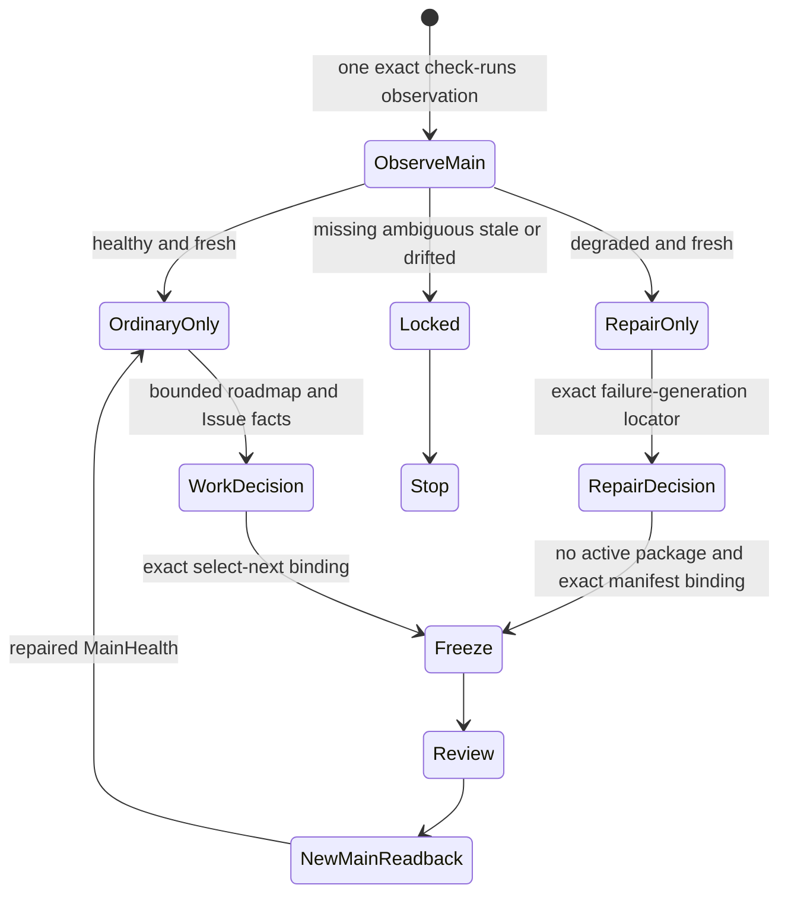
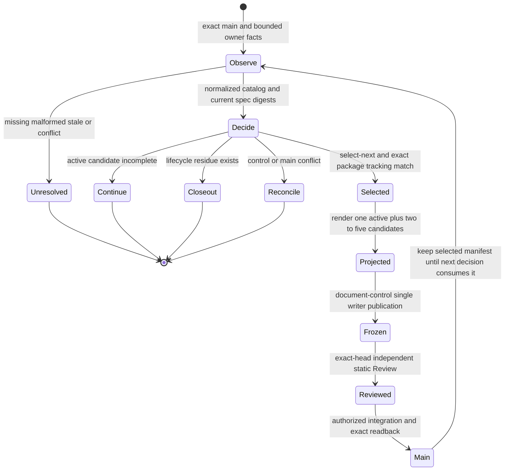
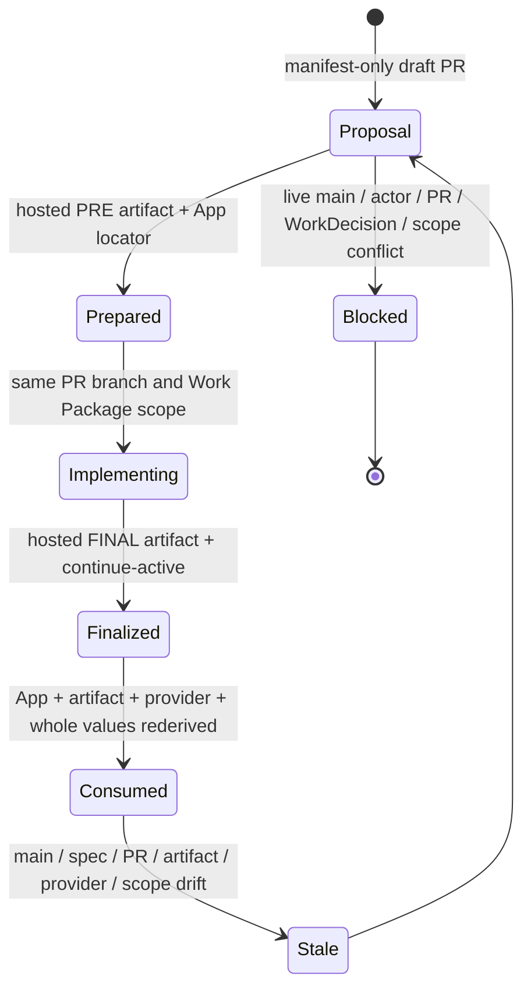
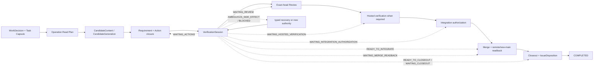
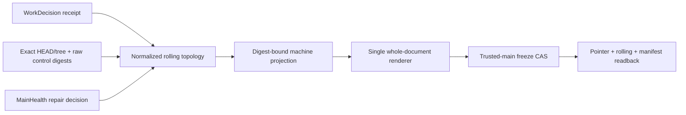
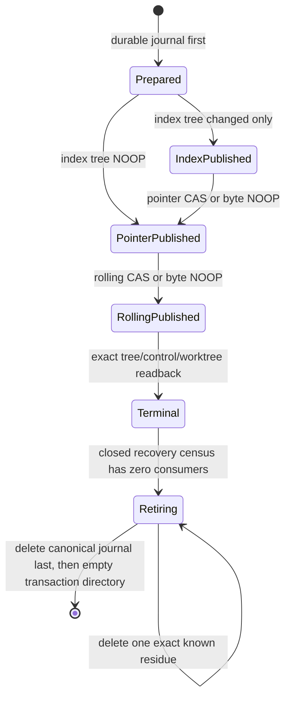
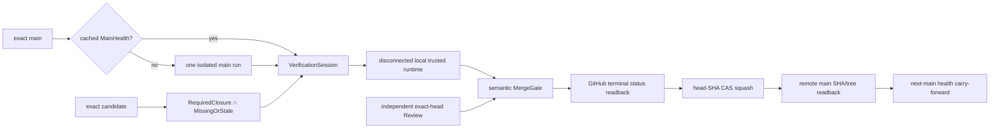
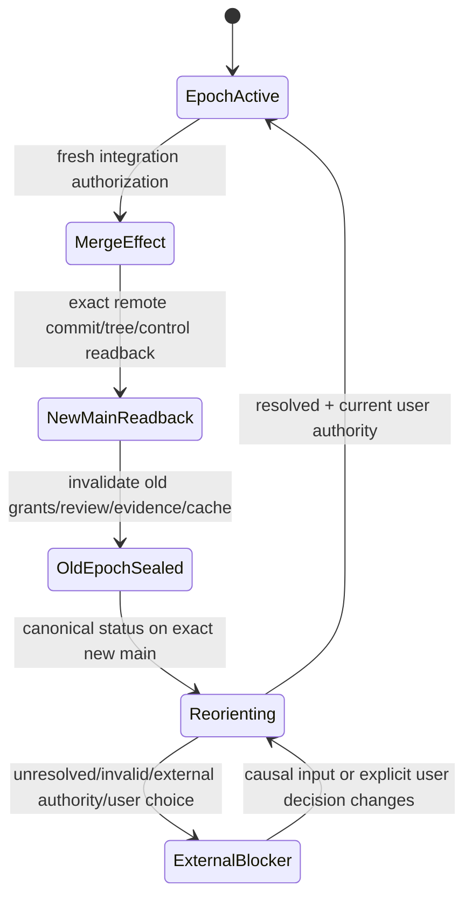

# 自主开发治理

本文拥有 SEC 仓库开发的事实源、计划分层、Role/Operation/Skill 边界、Issue/Work Package/PR/Evidence 生命周期、A0/Worker/Reviewer 权责、成熟轮子采用、可验证续跑和工程自主治理目标。具体启发式闭包只存在于 `.agents/skills/**`；机器可判断的规则必须下沉到代码合同。

## 自主治理责任

SEC 的产品、架构、实现、测试、文档、CI、Review、分支和主干状态必须持续一致。维护者或 A0 不能只机械执行用户最后一句命令，也不能等待用户发现工程全局冲突。

每次任务都必须判断是否出现：

- 产品目标与实现方向不一致；
- roadmap 依赖颠倒或横切设施抢占产品主线；
- canonical owner重复、缺失或被 Proposal/Evidence/Projection竞争；
- 同类缺陷重复，说明共享抽象、状态 owner、fixture、selector或门禁缺失；
- 已有成熟轮子、标准或平台原语，却在Core重复实现通用机械能力；
- 外部库私有类型、AST、ID、默认行为或品牌模型泄漏进Semantic Core；
- 当前 `main` 已包含结果而旧 PR/branch/plan仍声称未完成；
- 活动 Work Package、rolling plan、Issue 或文档已被新事实取代；
- Skill/Agent/context机制复制机器规则或污染上下文；
- 已正确 candidate 只剩 merge/closeout，而不是继续制造修改。

发现这些情况时，工程动作可以是设计重算、最小修复、Provider/Adapter隔离、成熟轮子采用、合并、关闭、归档、删除重复实现或确认无修改；不能为了保持“持续开发”而制造无证据变化。

## 当前规则与目标机制

- **当前可强制规则**：`main` authority、一个 formal active Work Package、single writer、frozen manifest、exact candidate Evidence、独立 Review、merge readback 和 branch hygiene。
- **已实现但尚未成为默认并行运行时**：并行 Work Package resolver（V3 schema、pairwise conflict resolver、global exclusive resource registry）。
- **已实现的 managed continuation**：`sec-local-continuation-checkpoint-v1` 只压缩一个 immutable upstream snapshot 的上下文；`VerificationSession` 仍是唯一 run/stage/journal 状态机，continuation 不产生新的执行或授权状态机。
- **当前T2候选冻结的目标合同**：VerificationSession、producer-owned Action、Review-Stable Barrier、MainHealth与单次IntegrationAuthorization；只有进入new main并由首个ordinary candidate canary通过后才是active capability。
- **更后继的目标架构**：Agent Operation Compiler、Integration Queue、统一Hermetic Runtime/resource scheduler、完整Evidence DAG/CAS和自动feedback service。

目标设计不能被文档、Issue、Skill prose 或模拟对象升格为当前能力。T2 new-main canary完成前，默认继续使用一个formal active Work Package和可验证的manual-shadow续跑；候选Session只能作为待验证SUT，不能授权自身。后继Integration Queue、统一runtime与自动feedback也分别以其真实consumer和new-main Evidence激活。

## 事实与授权顺序

```text
latest main + live Git/GitHub facts
→ docs/authority.json and canonical domain owners
→ product / system architecture / roadmap
→ AGENTS.md universal router
→ trusted repository orientation or full audit
→ selected frozen Work Package + trusted scope authorization
→ typed Operation / Task Envelope
→ candidate implementation + producer-owned Action plan
→ canonical parent dispatch-plan artifact + exact-ActionKey hosted producer
→ exact-head Review-Stable Barrier
→ hosted Evidence + fresh Review readback
→ single-use IntegrationAuthorization
→ trusted hosted integration critical section
→ expected-head merge → candidate-tree parity → idempotent remote closeout readback
→ new-main trust reload → replan
```

`main` 是唯一正式产品事实。Branch、Issue、PR body、聊天、计划、Project 看板、审计报告、代码图、Completion Report 和模型记忆只提供导航、候选、决策或 Evidence，不能证明结果已进入主干。

Resolver 无法确定 default ref、target repository/workspace、active pointer、manifest bytes/digest、PR base/head、review/CI 或 authority owner时 fail closed。

## 计划与记录分层

- **`docs/product.md`**：产品问题、边界、用户结果和长期成功判据。
- **`docs/system-architecture.md`**：总体对象、两条主链、authority flow、单写者和跨域依赖。
- **`docs/roadmap.md`**：唯一稳定 capability DAG、阶段进入/退出和反转条件。
- **Canonical domain docs/code**：领域对象、长期不变量、公共合同和机器规则。
- **GitHub Issue**：真实问题、依赖、竞争方案、决策、验收和反证；不是运行日志或第二 roadmap。
- **Rolling plan**：当前包与接下来二至五个条件化候选；不是永久 backlog或稳定架构。
- **Work Package Manifest**：被激活交付闭包的 frozen scope、authority、ownership、Gate 和退出合同。
- **Operation / Task Envelope**：一个执行者在 manifest 内的单角色、单 operation、单 seam授权。
- **Pull Request**：一个 exact candidate diff及其 Review 表面。
- **Checks/Artifacts/Evidence**：绑定 exact input/environment 的物理证明。
- **VerificationSession（T2 target owner）**：run、event、transition、resume和下一合法动作的唯一目标运行状态机；它只引用而不重定义Result、Evidence、Review、MainHealth、Work Package或Integration authority。普通resume只query、join或dispatch hosted transition，不持有physical merge/closeout capability。进入new main且ordinary canary通过前，真实下一动作仍从live Git/PR/manifest/Evidence重算。
- **GitHub Project**：Issue/PR的可视化投影。
- **`main`**：完成后的唯一产品结果。

Dynamic SHA、run、failure tail 和临时候选不复制进 stable docs。Evidence 可以保存架构裁决、实验和历史计划，但不得自称当前状态源或长期路线 owner。

## 发现收敛、current spec 与 WorkDecision

一次执行中发现的问题只有在进入既有canonical owner或一个聚焦work identity后才是durable work；
聊天、模型记忆、审计叙事和rolling文字都不能成为唯一副本。统一收敛链是：

```text
observation / accepted decision
→ existing work identity + owner + current-spec census
→ normalize into the existing Issue or stronger machine owner
→ trusted bounded candidate facts
→ WorkDecision
→ rolling projection
→ frozen Work Package
```

命中已有focused/Program Issue、roadmap capability或canonical domain owner时，更新或引用该identity，
不得因执行会话、分支或解决方案变化复制一个新Issue/计划。只有没有现存identity、唯一owner与独立
acceptance闭包同时成立时，才建立新的focused work。Issue comment、Review和聊天是讨论/Evidence；
其中被接受的执行裁决必须由maintainer action折叠进Issue body或更强machine contract并标出superseded
source，executor不按comment recency、最后时间或AI摘要重建current spec。

#221 `WorkDecision`只消费trusted current lifecycle、canonical roadmap revision、maintainer/project
adopted normalized candidate records以及dependency/conflict/readiness facts，不读取Issue title/body/comment、
模型评分或wall-clock。每个候选必须同时绑定canonical `currentSpecRef`与exact immutable
`currentSpecRevision`；二者进入candidate-set、input与decision identity，并显式投影到selection、rejection
witness和precondition。future live adapter只能从maintainer-adopted owner派生这组绑定，current spec任一变化
都会使旧decision失效，不能按comment时间、caller claim或模型摘要合成revision。裁决优先级固定为：

```text
active incomplete → continue-active
closeout obligation → closeout
control conflict → reconcile
eligible candidates → select-next
no necessary work → none
missing or conflicting facts → unresolved
irreversible product/legal/security/cost choice → human-escalation
```

Eligibility要求目标仍有效、唯一owner与exit criteria存在、prerequisite/order facts满足、#207冲突
已决、required Evidence真实且scope可闭合。排序只使用`integrity-critical → active-critical-path →
product-critical-path → near-term-acceleration → maintenance-required → defer`，同类再按blocked ready
successors、当前roadmap直接性、Evidence freshness、scope closure与stable work identity裁决。P0/P1标签、
“未来可能有用”和自然语言紧急程度都不能自授权。相同normalized input必须产生byte-stable input digest、
reason codes、preconditions与rejection witnesses。

`blocked ready successor`不是transitive descendant数量。它只计数引用当前候选为一个未满足直接依赖、
并且在仅把该依赖假设为`satisfied`后由Phase A完整eligibility evaluator判为`eligible`的后继。因此deferred、
already-in-main/superseded、仍有第二个未满足依赖、scope/Evidence/owner不闭合或其他原因不可选的后继均不
计数；compiler不得用图可达数量、候选总数或另一套简化readiness规则替代这个定义。

实现分层保持有限：Phase A是`platform/shared/work-selection-contract.ts`的pure read-only compiler；
Phase B adapter只从repository orientation、Work Package registry、closeout与conflict owner收集结构化
facts并签发receipt；Phase C writer只把validated decision物化为一个当前包加二至五候选。人工projection
在Phase C切换前必须明确是A0 reconciliation；与machine decision冲突时返回`reconcile`，不静默覆盖。
Phase C的live adapter先把trusted terminal current-spec observation编译为roadmap terminal compaction，
再以`raw roadmap revision + compaction digest + terminal observation`形成唯一selection revision；关闭的work不再
进入候选集，也不会因manifest已先退役而锁死selection。catalog、已消费依赖边和manifest retirement构成一个
不可拆分的candidate graph delta；document-control freeze只接受与compiler输出逐字相等的terminal subgraph。
新增selected manifest与delayed predecessor仍由既有package census拥有，terminal owner只拒绝自身退休对象残留或
既有非退休manifest丢失，不得用whole-inventory equality覆盖另一个合法生命周期。聊天、手工删除或Issue关闭
本身都不能绕过这些consumer。
#349 `ExecutionWave`随后只编译selected work refs的order/conflict/resource/cost，不能复制selector、
Issue prose、权限、Task Capsule或Verification。bounded automated action只有在下游authorization、Journal、
rollback和真实consumer成立后才能激活；pure decision本身永远没有branch/PR/merge/write authority。

Phase B/C的project-owned normalized records只存在于`docs/roadmap.md`的strict
`sec-roadmap-work-catalog-v1` block；这是roadmap自身的bounded current-stage machine projection，不能
扩展成第二文件、第二backlog或全Issue镜像。block只保存package/work/tracking/current-spec/owner、静态
priority class、dependency和exit-criteria refs。GitHub Provider只批量观察catalog中已列出的Issue
resource identity、open/closed和body bytes；body bytes只形成raw current-spec digest，title/body/comment
内容不被解析、复制或当作instruction。GitHub Projects不是必需authority；将来接入也只能替换事实
adapter，不能拥有selection或绕过canonical roadmap。

Catalog JSON边界使用duplicate-aware、bounded、depth-limited parser；任何object层级的重复decoded key都
必须拒绝，不能先经过`JSON.parse`的last-key-wins语义再做schema校验。Phase B不自造`healthy`、`none`或
`consistent`：MainHealth必须由exact-main check observation经canonical MainHealth ledger和fresh lane
resolver产生；candidate/PR/ref/worktree与closeout必须由#313 branch-lifecycle owner的bounded projection
产生；该projection只排除canonical default branch，任何其他命名空间的ref或非默认worktree都属于
必须解释的transport/residue。branch name只是locator，不是credential：合法性逐项绑定default base、PR head、
remote ref、可选local ref与worktree identity，不能因前缀授予authority，也不能因不使用某个前缀而漏检。
pointer、rolling与active manifest必须
由document-control binding owner逐项核对。任一owner输入
缺失、过期、locked、身份不符或无法解析时只能`unresolved`。
OPEN PR只有在`baseRefName`等于canonical default branch、`baseRefOid`等于exact live main，且head
branch/SHA与live remote ref及可选worktree一致时才是legal active transport；仅SHA偶然相同不能让指向
其他base branch的PR取得active或closeout authority。
跨owner consumer edge由被消费的canonical producer owner登记到test-impact：MainHealth contract或
default-branch health producer变化时，除自身focused tests外必须直接选择Work Selection consumer test。
consumer不得复制MainHealth语义来获得自己的测试闭包，direct-import自动发现也不能代替这条传递边。

Live receipt同时绑定exact live-default commit/tree、roadmap raw digest、catalog digest、#311 registry
stable projection、current lifecycle digest、每个current-spec observation、Phase A input和decision。它是
可重放Evidence而非signature：caller提供的receipt文件永远不能单独授权pointer/rolling写入。新package
freeze必须在trusted `document-control-plane`进程内对exact base重新运行live adapter，并要求manifest
`id + tracking`与`select-next`逐项相同；任一Provider/registry/lifecycle/schema/current-spec缺失、malformed、
stale或冲突均返回typed `unresolved`。同manifest finding replan不改变selection，继续走零Provider的
pure fast path，但fast path身份是exact `(package id, tracking)` tuple：同id改变tracking必须在任何
repository object/index/journal/control effect前拒绝，不能把tracking替换伪装成同包replan。

Effectful `freeze`的控制代码必须来自clean protected `main`，其HEAD等于canonical local-default投影；
候选只能作为显式`--workspace`目标，且必须是物理不同、attached到非default branch的worktree；branch
namespace不参与授权。live adapter从唯一remote
HEAD symbolic projection定位default ref，再读取exact-main current-state；不得先读取候选HEAD来决定
repository/remote/default branch。required projection规则由pure freeze contract再次强制，CLI wiring不是
唯一门禁。roadmap catalog不保存可从依赖图推导的successor count或`roadmapDirect` bit：两者由compiler
计算，避免人工derived-state漂移。
Phase B只在current lifecycle证明没有active candidate、closeout residue、control conflict或unhealthy main时，
把候选的#207 pairwise conflict投影为`clear`：此时不存在第二个并行subject。只要存在并行subject或其
身份不完整，selector先返回`continue-active | closeout | reconcile | unresolved`，不得硬编码clear；真正
多work的order/path/resource编译仍归#207/#349，不复制进selector。

MainHealth recovery不是Work Selection的候选特例，也不允许形成`repair → 全Issue census → reconcile`
的循环依赖。一个fresh exact-main ledger必须先由MainHealth owner投影成互斥的
`ordinary-only | repair-only | locked`：只有`ordinary-only`调用WorkDecision；`repair-only`只调用pure
`MainHealthRepairDecision`；`locked`不调用任何选择器。这样普通catalog与稀有恢复路径共享同一上游真值，
但彼此不串联、不重复远端观察。repair decision完整绑定repository/default/main/tree/trust、ledger、owner、
failure fingerprints与manifest identity，只提供routing eligibility，不提供scope、implementation、provider、
Review或merge authority。

依赖exact repository状态的合同测试只校验编译后选择的通用不变量，不把当前Issue或package identity写成
永久期望；需要验证特定Issue依赖关系时，必须使用完整、冻结的synthetic catalog与completion registry。这样一个Work
Package进入main只改变输入事实，不会要求手工改写下一项选择。pointer、rolling projection、manifest digest、
TCB与其他内容身份均由其唯一compiler生成，文档只维护语义源，zero-write check负责拒绝派生值漂移。

每个future degraded generation的repair manifest locator由
`(repository, default branch, exact main, exact tree, owner, sorted failure fingerprints)`内容寻址派生，并把
完整digest保留在path；已进入default的path永不复活，finding只在同一manifest/worktree/ref内产生新head。
健康或locked ledger不暴露repair locator。Repair effect admission必须同时读取current pointer manifest的
candidate bytes和exact default bytes：只有两者raw-byte相等且digest等于pointer时，旧active才被证明已经
published并从临时repair rolling topology退休；其余未完成candidates保持原bytes与原顺序。default缺失、bytes
不等、stale、unresolved或仍超出五候选上限都fail closed，禁止截断、发明或重排身份。

已具备production repair consumer但尚不能从容量中退休published active的trusted-main generation，只允许一个由
exact repair manifest绑定、用户显式授权并经独立Review/new-main readback约束的最后manual-bootstrap bridge。
该package不跟踪Issue、不伪造ordinary WorkDecision或activation receipt，并必须删除这项capacity defect；规则
进入new main后不得再保留caller JSON、手工pointer staging或第二repair package入口。#177继续只拥有failure
classification；MainHealth routing与document-control effect owner不迁入#177。

同一exact main可以由policy列出的不同GitHub event各产生一次MainHealth check。event name本身不证明
`repository_dispatch`的action身份；provider adapter必须同时观察workflow run ID与display title，MainHealth
policy再按exact main和request-operation identity验证event-specific run title。activation、verification-action及
其他dispatch中同名但skipped的job属于nonmatching provider noise，不能参与ledger或污染source digest。
MainHealth owner先按
MainHealth policy拥有封闭的recognized conclusion集合，并按`(terminal status, conclusion)`归一语义outcome：
每个allowed event至多一个producer且全部recognized terminal outcome
相同时才收敛；一致成功进入healthy，一致非成功进入degraded。same-event重复、nonterminal或不同conclusion
以及unknown status/conclusion一律locked。failure fingerprint只绑定policy/context/head与归一outcome，不绑定provider check id或event，
因此等价的第二producer到达不会制造新的repair identity。provider adapter先完成bounded pagination与shape
admission；MainHealth producer source digest只绑定policy与排序后的matching normalized subset，不匹配的其他
check不是decision input且不得仅凭噪声改变ledger provenance。raw response审计属于独立provider observation
receipt owner，不能由MainHealth decision自行发明或用不完整bytes冒充。





Catalog采用一项延迟删除handoff：本轮选中的manifest进入main后仍存在，下一次adapter把该项投影为
`already-in-main`并用它满足直接后继；下一纵切片才删除该旧manifest和已消费catalog item，同时把近端
窗口补足到能继续生成二至五候选。这样不保留tombstone/history文件，也不会因manifest先删除而把已完成
前置重新解释为未完成。catalog最多保存七条近端记录，live adapter只做一次bounded Issue GraphQL和
既有owner投影，不扫描Issue历史、comment或全backlog。

Work Package manifest只代表一次已经消费的activation slice，不等同于Program Issue整体完成。若一次
slice进入main后current spec仍明确保留未完成验收或新的依赖边界，下一次handoff删除已消费manifest，
但保留同一Issue的catalog/current-spec identity；WorkDecision随后从live Issue与当前registry重新判断其
`open/not-ready/ready`，不得把历史manifest长期当作Program completion tombstone，也不得因删除一次性
manifest而自动关闭Issue。

非catalog recovery package临时插入时也不能破坏该完成事实。hosted PRE issuer、`docs:doctor`与
`repository-audit`消费同一个pure package-census contract；各自从同一个immutable candidate tree读取pointer、manifest、roadmap与
package census，不能复制第二套“仅一个manifest”算法。exact tree blob与directory membership必须复用
同一个已reviewed、只读、参数受限的Git object observer；目录枚举不得为了便利另开process dispatcher或
由candidate扩写TCB allowlist。只有selected manifest的tracking为`none`时，才可
额外保留至多一个被canonical roadmap引用、在exact default ref存在且candidate/default bytes完全相同的
published predecessor。第二个匹配项、非catalog文件、byte drift或普通tracked package下的额外manifest
全部fail closed。下一ordinary slice必须同时删除recovery manifest、已消费predecessor及对应catalog item；
Git历史承担审计，不把旧manifest复制到`docs/evidence/**`或另建tombstone。
PRE proposal的changed-record scope必须精确包含pointer、rolling、selected manifest和census判定应删除的
全部base manifests；漏删任一旧manifest、修改被允许延迟保留的predecessor或加入额外package时，issuer在
artifact/comment effect前返回`activation-scope-conflict`，不能靠候选本地测试或后续MainHealth补救。

面向Agent或maintainer的控制面CLI默认只输出完成下一步裁决所需的bounded projection：exact revision、
状态、decision、blocker、finding分类与绑定完整结果的digest。内部canonical result不因此删字段，程序化
consumer继续直接消费其类型；完整JSON只能由显式`--full`输出，已有`--output`的命令也只在显式路径写入
完整artifact。不得把全Issue、全catalog、逐路径coverage、重复finding实例或内部中间对象默认倾倒到
stdout，也不得为“以后也许会看”自动保存bundle。compact projection必须有pure projector和focused test，
保证其大小不随非决策inventory线性增长，同时不能改变退出码、fail-closed状态或完整结果digest。
Git Hook已经通过`SEC_GIT_HOOK_ACTIVE`拥有明确automation context；其成功且零变化的依赖复用、imports
identity seal保持stdout为空，失败仍输出恢复动作。maintainer显式执行同一命令时保留一次紧凑成功确认，
不为静默automation复制第二套package script或业务实现。

TCB只保存人工裁决的entrypoint、static boundary、Effect dispatcher与外部能力策略；causal module、edge、
Git blob、content digest与closure digest全部由受信base compiler从immutable exact candidate Git tree派生。
Git tree是源码bytes的唯一完整性owner，不提交第二份generated lock、时间戳、archive或恢复journal，也不注册
merge driver或让Hook改写TCB源码。普通Git合并只处理authoring source；派生投影没有文本冲突、误删保护或
手工恢复问题可发生。

TCB编译只在Impact证明候选可能改变trust closure且对应effect确实需要该Evidence时运行。结果绑定
`trusted compiler/policy revision + exact candidate tree + environment`进入既有ActionKey；相同subject直接
复用，非TCB delta零执行。Hook只保留廉价authoring sentinel并不承担authority，`--no-verify`不能绕过
Verification/Integration consumer；old-main compiler始终把candidate tree当数据，candidate compiler不能
自证自己的trust transition。

远端API-only admission只认证repository、actor、PR、base/head/tree、manifest和trusted-base registry bytes；
它不能用entrypoint、路径前缀或tracked generated projection近似transitive TCB closure。是否实际改变trust root
只能由trusted-base compiler在immutable base/candidate tree上编译完整closure后裁决；零trust-root delta拒绝
bootstrap，closure或policy delta进入typed manual bootstrap，绝不因前置近似而漏掉真实transitive change。

首次Phase C迁移是唯一bootstrap例外：旧rolling只含两个候选，而旧promotion要求提升后仍至少两个，
因此不存在可执行的旧transition。本迁移在一个exact candidate中同时安装catalog、adapter、consumer与
新projection并接受trust/control Review；进入main后不存在手工topology兼容入口。以后耗尽、补充、增删、
排序或selected identity变化必须由live WorkDecision产生，否则freeze在任何repository object/index/
journal/control effect前拒绝。

## 成熟轮子与通用基础设施治理

SEC只应自行拥有自己的工程语义、authority、identity、Contract、Effect、Permission、Transaction、Verification和Migration。解析器、类型检查器、图算法、缓存、schema validator、进程/路径工具、浏览器、数据库驱动、密码学、云SDK等通用机械能力优先使用成熟、可靠、可验证的轮子或标准平台原语。

“轮子优先”不是“发现开源仓库就必须采用”。正式裁决必须以真实consumer和同条件Evidence为基础。

### Capability Census

新增或扩大自定义通用基础设施前，Work Package必须提供最小充分的 capability census：

```text
problem / real consumer
→ required capability and contract
→ terminal business intent and known consumer/lifecycle horizon
→ current internal implementation and cost
→ mature external candidates / standards / platform primitives
→ exact versions, license, security and maintenance
→ real trial / A-B / corpus evidence
→ coverage, failure, unknown and integration cost
→ whether a thin Adapter is sufficient
→ minimum justified self-built surface
→ duplicate code / dependency / path to remove
→ rollback, revalidation and retirement conditions
```

`known consumer/lifecycle horizon`只包含有canonical目标、roadmap、current spec、重新激活条件或现存
consumer支持的未来，不做开放世界猜测；它覆盖authoring、runtime、Verification、升级、替换、运维和退役，
因此当前调用次数不能单独决定依赖或自研策略。

该census必须充分，但禁止无目的扩读。先冻结本次`decision questions`、会改变裁决的unknown与required
Evidence kinds，再由authority、dependency、causal、consumer和Impact图派生
`SufficientInformationClosure`。任何新增读取都必须关闭一个明确frontier并可能改变一项具体裁决；不能回答
未决问题的Issue、历史、源码或工具输出不得进入上下文。确定性全仓census可以维护图与coverage，但执行者只
消费带provenance的相关投影。所有决定性问题闭合、最强已知反例不再改变裁决，或剩余缺口形成typed unknown
后立即停止；禁止把“充分探究”误写成“尽量多读”。

根因闭包不是给单个symptom贴标签。它至少证明可复现观察、被破坏不变量、最上游可修改因果机制、同类
failure空间、已知consumer、唯一owner、反事实验收和旧路径退役；只能解释当前一个样例时仍是diagnostic
finding，不能宣称根治。

任何 P0/P1、重复 finding 或用户指出的同类漂移在进入实现前必须形成同一 owner 的
`ClassRootClosure`：`rootMechanism + canonicalOwner + classInvariant + affectedEntryClosure +
strongestCounterexample + retirement/stopCondition`。缺任一项只能保持 `diagnostic`，不能标记
`remediation-ready`，也不能按 finding/file 顺序逐个打补丁。实现后验证的是类级不变量与最强反例，
不是把同一句源码或文件清单复制成测试；若 affected entry 仍存在 optional/manual bypass，闭包未完成。

没有上述Evidence时，不得以“更可控”“以后可能需要”“AI写起来容易”或“自己实现更统一”为由扩大自研面积。

### 采用决策

候选决策只能是明确状态：

- adopt mature substrate/provider；
- wrap with thin Adapter；
- absorb proven design into SEC unique owner；
- retain current focused implementation with evidence；
- defer with trigger；
- reject with rationale；
- retire/remove duplicate。

真实试用发现工具噪声高、覆盖不足、输出不可定位、维护/安装/安全成本过高，可以成为拒绝或限定使用的Evidence。品牌知名、功能列表更长、下载量高或多个工具输出一致都不能替代SEC自己的验证。

### Provider Boundary

具体库、编译器API或外部工具必须通过唯一Provider/Adapter边界接入：

- consumer依赖SEC-owned contract，不依赖Provider私有DTO、AST Node、Symbol/Type对象、随机ID或品牌状态机；
- package/version/Target/coverage/freshness/failure和resource boundary显式；
- external output先视为不受信input并canonicalize/validate；
- Provider只拥有其能力和Evidence，不拥有Engineering Semantic authority、Implementation Resolution、Impact、Verification Result或publish decision；
- Provider升级、替换和退役有consumer census、parity和旧路径删除。

禁止在Semantic Core、Application/Behavior IR、Operation/Mutation、Impact或Verification truth中散布：

```text
if library === ...
if providerVersion >= ...
import provider-private AST/type/model
reconstruct semantic meaning from package name
trust provider default behavior as Contract
```

库特定代码只能位于Provider、Adapter、Backend recipe、Migration、conformance fixture或明确Target package边界。

### 语言与 Compiler API

同一语言工具链的能力必须拆分管理：

- CLI checker；
- syntax parser；
- Program/TypeChecker与module resolution；
- Language Service；
- source transform/printer；
- formatter；
- build/runtime executable。

不能让一个`typescript`、`ts-morph`或其他品牌包名隐式拥有全部能力和版本authority。Core不能直接依赖Compiler API私有对象；直接import必须收敛在声明的Language/Backend Provider边界。迁移到新版本或新实现时逐能力做parity和retirement，禁止全仓散落版本分支。

### Reference Provider

SEC可以为基础能力提供少量Reference Provider，用于：

- 验证Semantic Contract和IR是否足够完整；
- 提供最小、可解释、可离线的conformance oracle或fallback candidate；
- 在生态不存在可靠实现时闭合真实consumer。

Reference Provider不能以“原生”之名免除安全、性能、维护和negative tests，也不能无限扩张为自己的HTTP、ORM、数据库、浏览器、密码学或云生态。存在成熟高质量实现时，Reference只保留其基准职责或退役。

### 自定义实现退出门

自定义通用实现只有在以下之一成立时可长期保留：

- 它表达SEC独有authority/semantic/transaction/verification contract；
- 外部候选经真实Evidence证明无法满足关键合同；
- 薄Adapter不足以补齐；
- 自研面积被限制在最小边界；
- 具有owner、测试、版本、迁移、替代和退役条件。

一旦成熟轮子、标准原语或上游API达到parity，必须执行consumer迁移和duplicate removal，不能以“备用”名义长期保留双实现，除非存在真实failover contract和定期physical proof。

## Agent Operation System

最终开发运行时固定为：

```text
Universal Policy
→ explicit Agent Role
→ typed Operation Envelope
→ zero or one applicable trusted Skill
→ deterministic services / contracts / tools
→ typed outcome and legal next transition
→ external Run State / Evidence
```

### Role

Role 是执行者身份、职责和可申请权限上限，不是 workflow：

- **Integrator / A0**：事实重算、work selection、control plane、Gate custody、integration、merge和closeout；
- **Worker**：在 frozen envelope 的 branch-write边界内实现；
- **Reviewer**：对 exact candidate 独立只读审查；
- **Auditor**：对 exact revision 做事实、architecture、repository或Evidence census；
- **Maintainer**：在文档、toolchain、provider、agent-system等明确治理 envelope内工作。

Role不能通过加载 Skill扩大权限。子 Agent 不继承父 Agent 的 Role、Skill、path或capability，必须显式签发 Envelope。

### Operation Envelope

一次 operation 至少绑定：

- repository、exact main/base/target/candidate identity；
- Role、operation kind、Skill applicability decision；
- authority reads/writes；
- path reads/writes与forbidden surface；
- required capabilities、trust class和resource bounds；
- inputs、expected outputs和completion claims；
- Verification obligations；
- stop、reload、reconcile和expiry conditions。

最终可执行权限是交集：

```text
Role maximum
∩ Operation Envelope grant
∩ repository/domain policy
∩ tool/provider capability
∩ current state transition
```

Skill只能声明 required capabilities，不能扩大交集。

### Task Capsule

Task Capsule 由独立 `TaskCapsuleCompiler` 从 typed planning context、owner bindings、root
cause、scope proposal、Impact 与 Verification obligations 纯编译；相同输入必须得到 byte-identical
Capsule。Phase A Capsule 是 Operation 的不可变 **unbound planning content**，不是 current state、
Work Package 副本、聊天摘要、issuer receipt、effect grant 或 VerificationSession 子对象。

Task Capsule 唯一拥有其内容 schema、编译规则和 revision。Operation Envelope 与
VerificationSession 只能保存 `taskCapsuleRef`、`taskCapsuleDigest`、`taskCapsuleRevision`，并在
使用前验证引用；不得复制 Capsule 字段后形成第二 owner，也不得由 Session event 或 Skill prose
改写 Capsule。work selection、owner、scope 或 obligations 变化时重新编译 Capsule 并使引用旧
revision 的下游 decision stale。

当前 machine owner 是 `platform/shared/agent-task-capsule-contract.ts`；它纯编译
`sec-task-capsule-v1` 并拥有 operation role/kind vocabulary、严格 parser、canonical ordering、revision
与完整 digest。该 schema 强制 `authorityStatus=unbound-planning-content`、`effectAuthority=none`、
`scopeGrantId=null`；Work Package 只能以 `proposalRef/proposalDigest/projectionId` 进入 planning context，
禁止把 manifest、pointer、candidate tree、freeze/recovery journal 或普通 self-digest命名为 authorization、
activation receipt 或 ScopeGrant。Skill registry 只校验 Capsule 中的候选 guidance ID，不反向拥有
operation identity。

这一authority level也约束diagnostic与negative contract test：issuer-bound receipt尚未成立时只能使用
`proposal / proposed / unbound`词汇，不得在错误断言、fixture或测试名称中把相同scope/resource提升为
`trusted / authorized / granted`。只有真实typed authority transition才允许两侧在同一tree原子迁移术语。

`scripts/codex/agent-operation-activation.ts` 是document-control/A0 hosted issuer adapter；
`platform/shared/agent-operation-activation-contract.ts`唯一拥有严格request/provider/PRE/FINAL/publication schema。
本地实现会话只能发送at-least-once wake-up，不能签发credential。协议保持两阶段：

```text
manifest-only draft PR + maintainer repository_dispatch wake-up
→ trusted default-branch workflow rederives live main / PR / manifest / WorkDecision / scope
→ immutable PRE artifact + GitHub Actions App comment locator
→ implementation commits on the same PR / branch / worktree
→ live continue-active WorkDecision
→ immutable FINAL artifact + GitHub Actions App comment locator
→ Task Capsule / Read Plan / Skill rederive provider and whole values
```

PRE必须来自default branch上的固定workflow SHA，只接受同一仓库具备admin/maintain权限且actor、triggering actor、
event sender一致的请求；它绑定exact repository/base/tree、一个draft PR及linear proposal head、manifest raw digest、
三个control raw-byte digest、proposal whole delta、manifest全部owned/forbidden scope、current spec、WorkDecision与
worker/implement/git-only vocabulary。trusted checkout独占只读remote credential以完成WorkDecision的remote-ref与
check-runs闭包，candidate checkout永不持有credential；依赖从frozen lock与Bun cache安装并禁用lifecycle scripts，
避免issuer observation触发hook或其他安装副作用。FINAL引用同一PRE comment ID，要求同一PR/base/branch/manifest、PRE head为
final head祖先、final whole delta仍在PRE scope内，并绑定新的live `continue-active` WorkDecision。PRE的active/candidate
rolling topology必须由Work Selection唯一的topology compiler重派生；它在PR创建前后的`select-next`与
`continue-active`对同一active work保持相同有序拓扑。FINAL receipt再次携带三个control digest并与PRE逐值相等，
因此已授权control路径也不能在PRE后改变选择或projection bytes。

canonical PRE/FINAL payload只保存在该trusted run的immutable Actions artifact；GitHub Actions App comment只保存
request、artifact ID/name/file/archive digest与provider locator。consumer必须同时read back App identity、repository、
workflow path/SHA、run/attempt、event、job、upload/publication steps、triggering maintainer permission、artifact metadata/
bytes以及PR/WorkDecision/manifest/scope。repository_dispatch本身只是wake-up；candidate workflow、本地Git ref、
本地blob/file、journal、普通digest、同用户ACL或caller JSON均可由实现者重算，永远不是credential。provider、
artifact、bytes、identity、current-spec或scope任一漂移都以bounded reasonCode与raw detail digest fail closed。
凡通过Issues timeline endpoint向Pull Request发布GitHub Actions App locator或Review控制marker的trusted job，必须
同时显式声明`issues: write`与`pull-requests: write`；仓库默认只读权限、其中任一单独权限或ambient runner配置都
不能代替这对effect capability。workflow contract必须结构化锁定所有真实publication consumers，防止artifact已
持久化但locator以`Resource not accessible by integration`失败的半发布状态再次进入main。
同一canonical request digest拥有唯一hosted concurrency group；重复wake-up在重验既有App locator、artifact与
provider后返回`existing`，不产生第二artifact/comment。只有GitHub Actions App发布的canonical marker进入协议，
普通用户或其他actor的同名marker作为非authority噪声忽略；App marker malformed或同一request出现多个App locator
才是provider conflict。App comment成功写入就是publication effect的authenticated terminal observation，consumer要求
upload step已成功且publication step存在，但不把该step随后是否以success结束当作第二份credential；因此comment写入后
进程崩溃或runner失联不会永久毒化已完整发布的artifact。并发或历史duplicate identity一律冲突停止，不能
last-writer-wins。

Provider格式只在workflow adapter边界归一化一次：`upload-artifact`输出的裸SHA-256 hex转成REST metadata使用的
`sha256:<hex>`，内部schema、comment locator、archive byte readback只接受后一种canonical表示；禁止在consumer里
同时容忍两种格式。artifact metadata还必须把workflow run的repository与head repository ID都绑定到同一repository ID。



这是一个有限activation协议，不是新的run coordinator；candidate generation、VerificationSession、Review、
merge、Issue disposition与retirement仍分别由既有owner拥有。

本地public command surface只有两个意图：`request --phase prepare|finalize --candidate-root <path>`从live
WorkDecision、PR registry、candidate control和App publication inventory自动派生所有identity；FINAL从同一PR/base/
manifest且head为当前head祖先的validated PRE世代中选择唯一maximal祖先自动取得comment ID：线性finding修复自然淘汰
较旧PRE，零个为absent，并行或不可比较的多个maximal PRE才是conflict；
`observe --candidate-root <path> --request-id <digest>`只join/read back hosted publication。caller不手填base、head、
manifest、scope、provider或receipt字段，也没有publish/ref-write命令；`produce-hosted`与`publish-hosted`只供固定
default-branch workflow调用。
public `request`/`observe`必须从clean exact-default checkout中的adapter启动，candidate只能作为
`--candidate-root`显式传入；从candidate自身加载同名adapter会把untrusted checkout误作runtime root，必须以
`head-drift` fail closed，不能靠当前目录约定、alias或caller补填runtime identity继续。

activation producer和最终`skill-applicability` consumer必须同时是
`platform/shared/ci-trust-root-registry.json`的runtime entrypoint；TCB contract强制producer、Task Capsule、
Read Plan、Skill与Work Selection整条closure存在，TCB identity只从该registry与exact-tree imports派生。不得
只把新issuer文件加入manifest或Review范围，却让可执行authority chain落在TCB之外。

registry→derived-identity迁移和production trust-root加载顺序只由`docs/verification-governance.md`拥有；
activation切片不得另造bootstrap规则或绕开其strict next-closure admission。

workflow必须先用GitHub live readback完成actor、default branch、exact draft PR、linear ancestry与manifest bytes
admission，再由trusted-main producer读取candidate SUT；payload upload在comment publication之前，comment不能内嵌
或替代payload。实现前consumer从manifest-only exact head和唯一open PR枚举PRE locator并重派生完整PRE，随后才编译
planning Capsule、Read Plan与Skill decision；实现后同一consumer优先枚举FINAL locator，反向验证PRE locator/artifact，
并在exact final head重新观察WorkDecision、PR registry、head/tree/ancestry/manifest/control/owner closure/scope与provider。
producer没有injectable authority evaluator seam，本地路径已无ref/file credential兼容入口。当前exact head既无有效PRE
也无有效FINAL时，public consumer保留`activation-receipt-absent | activation-stale | activation-scope-conflict |
activation-issuer-unavailable | activation-provider-unavailable | activation-provider-readback-conflict`之一及detail digest。

WorkDecision的MainHealth binding必须使用MainHealth owner的稳定`healthRevision`，不能使用包含
`observedAt/expiresAt/provider receipt`的`ledgerDigest`；后者会让相同健康事实的live replay自行失效。状态、
failure fingerprint、owner、lane或main identity变化仍会改变`healthRevision`并使完整WorkDecision及FINAL
receipt失效，纯观察时间变化则不会。consumer因此仍可整值比较完整receipt/decision digest，无需另造弱语义投影。

该receipt只是activation provenance，不是effect grant。Task Capsule继续强制
`authorityStatus=unbound-planning-content`、`effectAuthority=none`、`scopeGrantId=null`；现行A0/Work Package
operation authorization仍是唯一effect grant。V1刻意只开放`worker/implement`且capability只投影实际使用的
local `git`；其他role、Root-Cause Preflight、外部resource/gate或多任务orchestration在各自provenance owner
接入前保持fail closed，不以硬编码“available”扩大能力。

issuer所在实现PR只能发布 progress：producer尚未进入trusted main时不能给自身candidate签发有效receipt。
#275完成了第一个真实PRE→FINAL candidate canary；该canary证明issuer-bound读取与授权链，不把
delegation的收益/隔离判断伪装为pure decision。#346保持开放，直到至少三个不同真实operation证明
read/tool-call下降且不遗漏owner/contract facts，并包含一次真实maintainer/user mutation observation。不得
伪造mutation、把同一实现候选重复计为新canary或因production cutover合并就提前关闭Issue。

### Operation Read Plan（Issue #346）

独立 pure `OperationReadPlanCompiler` 消费 #205 的 exact content-addressed Task Capsule
并产出 `sec-operation-read-plan-v1`。Capsule 的同一个 digest 必须完整覆盖 role、operation
kind、goal、owner facts、scope、capability/resource/gate、Verification obligations、Skill candidates、
exact trusted base/head 与 Work Package proposal/projection；Read Plan 不接受这些字段的平行 caller claims，
也不重新定义 #205 的完整 Capsule schema或取得 Root-Cause Preflight owner。它不是模型缓存、prompt、
聊天摘要或新的状态机，而是一次 Operation 的最小读取闭包，至少拥有：

```text
requiredRefs
conditionalRefs
forbiddenSources
maxSkillBodies = 0 | 1
unresolvedFrontier
readReceipts
invalidationInputs
```

`requiredRefs` 的每项绑定 `ref + canonical owner + revision + reasonCode`。Agent 先消费这些引用，
不得为了“熟悉工程”默认读取 assistant memory、聊天历史、旧 PR/Issue comments、全部开放 Issue、
全仓文档或全部 Skill 正文。只有一个显式 `unresolvedFrontier` 尚未闭合时，才允许读取该 frontier
列出的 `conditionalRefs`；conditional ref 必须反向绑定同一 frontier，禁止 unrestricted search。

“最小”不是最少文件，“完整”也不是读完整仓库。编译前必须明确当前decision questions与required
Evidence kinds；每个required/conditional ref都要有`decisionWitness`，说明缺少它会让哪项owner、root cause、
scope、mechanism、Verification或retirement裁决不完整。frontier只在新引用可能改变该裁决时扩展；所有
决定性问题已由Evidence或反证闭合、最强已知反例不会改变结果，或缺口已成为typed unknown时立即停止。
确定性索引、代码图和全仓census可以作为closure compiler输入，但不得等价成模型正文读取。

同一 source ref 在一个有效 operation context 中只能出现一次。`readReceipts` 绑定 planned ref ID、
canonical owner、exact revision、content digest 与 reason。它们只证明
读取了哪些 exact bytes，不证明内容正确，也不把外部 memory 提升为 authority。owner revision、
goal、scope、Skill candidate set、Verification obligations、Work Package 或 trusted main 任一变化，
对应 `invalidationInputs` 变化并使旧 Capsule/Read Plan/Skill decision stale。相同 path/blob 已有 fresh
receipt 时，执行器传递 ref、relevant symbols 和 delta 即可，不重复把全文塞入上下文。

机器入口是 `platform/shared/agent-operation-read-plan-contract.ts` 与
`scripts/codex/operation-read-plan.ts`。pure compile/verify 只证明 canonical bytes 与 digest 完整性，不把
caller 输入升级为 authority；production `compile` 只接受仅含 schema 的 authority-free closure request；
manifest-only proposal head必须消费有效PRE，exact implementation head必须消费有效FINAL，二者都由同一adapter
整值重派生，否则返回上述typed blocked结果。caller不能提供Capsule、ref、owner、
revision、receipt、frontier、forbidden-source policy 或 invalidation，也不能通过直接调用Skill selector
绕过blocked seam。

trusted adapter在PRE-bound planning Capsule与FINAL-bound reconciliation Capsule上都解析trusted-base
`docs/authority.json`。frozen Work Package的
`authorityRefs`把非文档source scope显式映射到canonical domain owner；每个changed registered document再加入
自身owning record，navigation/agent/control projection则加入registry声明的projection target。未知、非owning、
inactive、重复、未排序或缺少`development-governance`均fail closed。由此得到AGENTS、registry、manifest和最小
domain owner closure，不扫描全部文档，也不把candidate prose变成owner identity。changed owner blob以exact
candidate revision作为SUT，未变owner来自trusted base；scope authorization仍只来自此前hosted PRE。
每个repository ref必须落入Capsule read scope，external ref必须由exact authorized resource覆盖。Skill selector必须重新执行同一trusted observation
并要求整个Capsule与scope-bearing Read Plan closure byte-exact相等，才重算quarantine blob revisions。
raw envelope、caller-selected comparison pair、candidate-only manifest或candidate-self-issued authority入口
始终不存在。不得在读取Skill body后反推或改写Read Plan。缓存实现可以替换或完全不存在，正确性只依赖
issuer receipt、Capsule、plan、read receipt与invalidation contract。

production closure读取上述registry-derived owner refs与candidate-head exact manifest；每个ref形成OID revision与
raw content digest，Task Capsule owner facts和Read Plan receipt共同绑定同一closure。activation receipt digest和current-spec revision进入
额外invalidation keys。rolling plan的测试只比较parser得到的active/candidate topology与roadmap catalog的
有序package projection；不得硬编码历史Issue marker或手工把旧`#221/#352` prose补回机器渲染结果。

candidate-head manifest只允许由activation adapter物理读取一次：同一次`readGitBlob`必须同时产出blob OID与
raw-byte digest，并把二者经trusted Task Capsule observation传给Read Plan。下游不得再对同一
`targetCandidate:manifestPath`执行`rev-parse`、`cat-file -t`或`cat-file blob`；receipt直接复用已认证的
OID/digest。candidate head、pointer、manifest bytes或issuer binding任一漂移仍使整个observation失效，
read-once不允许用path cache或caller字段降低fail-closed边界。

Read Plan 同时绑定 `current-physical-state-authoritative-v1`：非 Agent-owned scope 中的明确
maintainer/user 改动是新的外部事件，旧 observation 立即 stale，当前物理状态成为 authoritative。
无冲突时接受当前状态；冲突时返回 typed `external-maintainer-mutation`。本层 pure resolver 只分类
`accept-current | conflict | recovery-authority-required | operation-owned-cas-eligible`，永远不签发 effect
authority。恢复旧状态只有三类独立 executor 可以在重新验证 principal、request/receipt provenance、
resource identity、preimage/current revision、expiry 与 CAS 后执行：用户明确请求恢复；回滚本 Agent
自身已证明的越权 mutation；operation-owned resource 的匹配 CAS。protected interactive root 始终在
candidate write authority 之外，裸枚举或 claim 不能授权恢复，也不能用 `git fsck`、dangling-object
forensic、checkout 或“上下文恢复”默认复活旧 index/tree。

### Skill Applicability（zero-or-one trusted guidance）

运行时 Skill 选择必须是 zero-or-one、trusted、operation-scoped（Issue #275）。
跨阶段工作通过 typed transition顺序推进：

```text
orient
→ audit | diagnose | design | implement | review | integrate | govern | no-change
```

每个 operation 由 `sec-skill-applicability-decision-v1`
（唯一代码 owner：`platform/shared/agent-skill-contract.ts`）裁决，状态：

```text
applicable | none-required | ambiguous | stale | conflict | not-applicable | unresolved
```

- `applicable`：加载唯一 trusted Skill；
- `none-required`：只在 Universal Policy + WorkPackage/Operation + issuer-bound Task Capsule 下执行，
  简单读取、格式修复或已明确 Operation 不得被迫加载 catch-all Skill；
- `ambiguous`：多个候选且无唯一 operation 证据，不得按文件顺序/ID/最新修改选取；
- `conflict`：Skill 要求超出授权 write/read path、resource、tool、Gate 或 authority，
  Skill 不得扩大交集；
- `stale`：goal、role、operation kind、WorkPackage proposal/receipt、Task Capsule、candidate 集合
  或 trusted revision 变化使旧 decision 失效；
- `not-applicable` / `unresolved`：operation 不进入 Skill 空间或输入不完整，停止写入。

Decision V1 至少绑定：trusted main/control revision、target candidate/workspace
reference、Role、operation kind、intent/goal digest、WorkPackage/Operation
proposal/receipt ref、Task Capsule ref、trusted registry 的 candidate Skill IDs、
selected Skill ID or null、trusted/candidate Skill blob revision、trigger evidence、
exclusion results、capability availability、authority/scope/resource conflicts、
reason codes 与 invalidation conditions。

path coverage（`resolveSecMarkdownSkillCoverage` / `resolveSecRepositoryHeuristicSkills`）
只作候选提示，不是 runtime selector。candidate 修改 `AGENTS.md`、`.agents/**`、
Skill registry、router 或 applicability 代码时，decision 与 Review 绑定 trusted
base/main 版本；candidate 内容只作为 SUT 差异，不得自授权。

Impact、Gate selection、Work Package parser、permission intersection、Failure/Epoch、
Evidence reuse和merge legality等机器规则不重复写入 Skill prose；Skill 正文文本永远
不能扩大 machine authorization。Skill 只保留需要 Agent 判断的：触发/不触发、输入、
分析方法、工具选择、解释、停止和 typed outcome。详细 schema、枚举、命令和平台矩阵
引用 canonical code或按需 reference，避免长流程连续加载重复正文污染 context。

当前可执行 Skill 集合为八个：七个终态 durable judgement owner，加上一个仍拥有不可纯计算
delegation收益/隔离判断的 bounded owner：

```text
sec-repository-audit
sec-architecture-evolution
sec-worker-development
sec-exact-head-review
sec-failure-recovery
sec-external-capability-governance
sec-heuristic-governance
sec-task-delegation
```

其余 repository behavior 不得为“有 owner”而制造 Skill：orientation 与 Work Package lifecycle
由 document control plane 拥有，resume/A0 orchestration 由 VerificationSession 拥有，impact/Gate
selection 由 test-impact/Requirement selector 拥有，documentation 由 authority registry/docs-doctor
拥有，toolchain 由 runtime dependency
spec/manifest-lock 拥有，trust transition 由 TCB closure 拥有，CI/merge 由 Integration Transaction
拥有。#205 Task Capsule compiler、独立issuer、consumer cutover与#275 canary已经提供可信结构事实，
但这些事实只能拒绝越权或重叠，不能决定并行收益是否大于协调成本。delegation 因此仍由
`sec-task-delegation`拥有；只有真实production decision owner能从可信事实同时产出delegate与
no-delegation，才迁移该route并删除第八个Skill。精确 route 与 canonical ref 只由
`SEC_REPOSITORY_BEHAVIOR_ROUTES` 维护；本段只定义边界。

retired Skill ID/file 不保留 alias、stub 或 prose compatibility。新增行为先判断 deterministic 或
heuristic：前者进入现有 machine owner，后者才允许在当前八个 owner 中扩展；只有触发、权限、停止和
判断闭包都无法归入现有 Skill 时才可提议新 ID，并同时声明 consumer、成本与退役条件。

### Deterministic services

以下能力必须由唯一代码 owner 提供：

- repository snapshot resolver；
- work selector；
- Task Capsule compiler；
- Work Package / Integration conflict resolver；
- Change Closure compiler；
- impact/test/Gate selector；
- permission evaluator；
- candidate epoch/failure classifier；
- Verification aggregator；
- Action/Evidence state 与 VerificationSession；
- NextTransition composition resolver；
- publication、merge、readback和cleanup owner。

产品Implementation Resolver、Block Resolver、Dependency materializer和Provider catalog分别由其canonical产品领域拥有；Development Skill或Agent不得在仓库开发流程中复制这些算法或用搜索结果/模型判断代替机器结果。

Skill可以消费和解释 service结果，但不能重新实现算法或输出竞争状态。

NextTransition composition resolver 只消费 owner 已形成的 WorkDecision、FailureDecision、
ImpactDecision、ActionState、SessionState、ReviewFreshness、ProviderAvailability 和
IntegrationState。它不能自行选择 work、分类 failure、扩缩 Impact、裁决 Review 或签发 merge
authorization；输入缺失或互相冲突时只能 `blocked`，不能猜测一个下一 phase。

### Development control-plane 七项终态裁决

成熟工程团队需要下表中的**能力**，不需要七套重叠的 bespoke workflow。SEC 的准入标准不是
“流程越多越专业”，而是每个持久 surface 都必须有不可由已有事实纯计算的真实状态、唯一 writer、
生产 consumer、crash/concurrency 语义、迁移与删除条件。只做导航、组合或投影的能力必须是 pure
compiler/resolver 或 derived view，不能升格为 state machine。

| Surface                                              | 实际作用                                                       | 终态                                                                                                        | 自动化边界                                                                                                                                                                | 完成/退役条件                                                                                                                                                    |
| ---------------------------------------------------- | -------------------------------------------------------------- | ----------------------------------------------------------------------------------------------------------- | ------------------------------------------------------------------------------------------------------------------------------------------------------------------------- | ---------------------------------------------------------------------------------------------------------------------------------------------------------------- |
| General Run Kernel proposal                          | 汇总 run/capsule/transition 的早期设计输入                     | **retire**；不实现第 2 个 coordinator                                                                       | useful contracts 分别进入 TaskCapsuleCompiler、VerificationSession、Action/Evidence、Integration owner；`NextTransitionCompiler` 只纯组合 typed decisions                 | 所有目标 consumer cut over，proposal/Skill/agent projection 的 Run Kernel authority 引用为零后归档                                                               |
| `current-state.yaml` + active pointer + rolling plan | resolver 稳定配置、exact candidate selection、A0/人的近期投影  | **retain/adapt**；三个文件不是三个状态机                                                                    | parser/freeze owner 机器维护；candidate 为 `ProspectiveControlProjection`，live main 为 `ActiveMainControlState`，rolling plan 从选择结果派生                             | candidate 投影失败不再污染 main；无 writer 会手工维护竞争 active truth；consumer contract 全部切换                                                               |
| `VerificationSession` 大实现/大测试                  | 唯一 run/event/transition/resume coordinator                   | **retain/split**；不重写、不另建 Session                                                                    | public contract 不变，内部按 pure decision、provider observation、Git/closeout、crash/recovery、hosted partitions 拆分；fast selector永不选择 slow/hosted partition       | 每个 partition 有独立 Action/consumer/test-impact，普通 focused edit 不再触发整文件分钟级测试                                                                    |
| `check:affected` / selector                          | 把 delta 映射到最小充分验证                                    | **evolve** 为 Requirement/subject closure                                                                   | `Impact → tri-state Requirement → ActionKey → reuse/failure-reuse/join/execute/block`；unknown 保守扩大或 block                                                           | file-name fallback 只处理 unsupported closure；已知 unrelated/fresh Action 不再物理启动                                                                          |
| `check:full`                                         | release/nightly、selector calibration、unknown-impact backstop | **retain as backstop**，从日常路径退役                                                                      | 不接 pre-commit/pre-push、普通 edit、finding loop；只由明确 profile/trigger 调度                                                                                          | default local/PR fast path 无 consumer，仍有 release/nightly/calibration owner 和预算                                                                            |
| repository Skill corpus                              | 对需要 Agent 判断的触发、分析、工具选择和停止提供 guidance     | **当前 8、可证明终态才为 7**：delegation 的收益/隔离判断仍由 bounded Skill 拥有；deterministic behavior 为 zero-Skill | `SEC_REPOSITORY_BEHAVIOR_ROUTES` 显式区分 `skill` 与 `deterministic`；禁止 path catch-all 制造 guidance                                                                   | 九个已退役 ID/file/consumer/alias 为零；未来真实decision owner同时证明delegate/no-delegation且完成consumer-zero后才退役delegation；其余每个Skill有唯一非机器化判断 |
| v2/v3/v4… candidate worktrees/refs                   | 曾用于 finding 后重建 exact one-parent candidate               | **retire** 为 transport residue                                                                             | 一个 logical run 只保留一个 mutable worktree + 一个 active ref；finding 原地修复、materialize 新 generation、expected-old CAS；旧 generation 留 immutable object/artifact | `FindingSuccessorWorktreeCount = 0`，completed run 的临时 worktree/ref 经 exact inventory/readback 自动清理                                                      |

实施不是“先补完七项，再开始真实开发”，也不是忽略七项继续堆功能。依赖顺序固定为：

```text
#205 Task Capsule compiler
→ #346 Operation Read Plan
→ #275 guidance convergence + PRE/FINAL canary（完成；delegation bounded owner保留）
→ candidate/control materializer and projection cutover
→ VerificationSession/test partitions + affected Requirement closure
→ eligible machine-owned surface retirement and residue cleanup
```

每一阶段必须直接减少当前物理放大，并由真实 consumer 接管后再删除旧 surface；禁止建立独立的
“最终架构包”挡在实现前。为防工程控制面吞噬产品开发，每完成一个非 P0/P1 的基础设施纵切片，
后续至少完成两个直接推进产品主脊的 Work Package，除非有新的机器证据证明该基础设施仍是 blocker。

## A0、Worker、Reviewer 与 Auditor

### A0 / Integrator 独占

- 最新事实、产品目标、canonical architecture和rolling DAG重算；
- active Work Package选择、candidate invalidation和proof reset；
- authority/resource/write-set冲突裁决；
- Gate custody、independent Review、integration和merge order；
- new-main readback、Issue/PR收口、branch/worktree/workflow hygiene；
- 发现全工程设计冲突时建立聚焦 architecture convergence，而不是等待用户拆解；
- 发现成熟轮子、自研重复、Provider泄漏或版本迁移缺口时，主动路由到唯一owner并建立最小可执行迁移，不只留聊天建议。

A0不替Worker修改同一owner seam，也不把所有发现塞进一个巨型implementation package。

### Worker

Worker只在 frozen Envelope 和 owned seam内实现，不自授权跨 owner、扩大路径、降低 Verification、触发 trusted-provider Gate或合并。发现 root assumption、owner、scope或architecture不成立时停止并返回 Reconciliation Delta，不在局部代码继续堆例外。

引入或自研通用能力时，Worker必须引用已冻结的capability census/Provider decision；不得临时安装工具改变candidate环境，不得把库私有模型泄漏进Core，也不得在没有migration的情况下新增长期双实现。

### Reviewer

Reviewer只读 exact base/head/tree、authority、Evidence和真实diff。它寻找范围越界、第二owner、遗漏consumer、弱化assertion、临时probe、自证、生成物漂移和无法恢复路径。Head变化立即使Review stale；Reviewer不替Worker改码。

涉及外部库或自研基础设施时，Reviewer还必须检查：真实consumer、替代候选、版本/许可证/安全、Adapter边界、direct import graph、duplicate removal、fallback真实性、升级/退役和package/lock唯一writer。

### Auditor

Repository orientation只建立当前任务最小充分事实。用户要求全仓、重大架构变化、重复系统缺陷或authority/code/test/CI无法解释时，Auditor对全部tracked paths、owner、entry、state、dependency、verification和unknown做exact-revision census。Audit只产生Evidence和聚焦findings，不取得产品authority。

审计发现稳定缺口时，A0必须将其融合到canonical owner、roadmap或focused Issue/Work Package；不能让重大设计长期只存在于聊天或叙事报告。若当前active scope冲突，应建立ordered successor并保留失效/激活条件，而不是越权修改当前frozen candidate。

## Canonical development lifecycle projection

SEC不建立第二个“全工程状态机”。下面是唯一操作生命周期图：节点只引用各 domain owner
的状态；`VerificationSession` 组合这些 typed decisions，但不重新拥有 Work、Candidate、Action、
Review、Integration、Issue 或 Cleanup 的事实。能力当前成熟度只由 `docs/work/**` 与 live resolver
投影，本图不把 proposed 写成 implemented。



这些 runtime outcome 名称由 `scripts/codex/verification-session-runtime.ts` 唯一拥有。图只给出
人类可读的 stage composition；它不是另一个 parser、journal、transition table 或授权来源。
`ExecutionWave` 只在 WorkDecision 后编译顺序/冲突引用，也不包裹或替代本图。

## Work Package

Manifest 冻结：

- base/default-ref constraints；
- authority reads/writes 与 owner；
- owned/permitted/forbidden paths；
- global exclusive resources和physical capabilities；
- dependencies、conflicts、ordered relations；
- acceptance、tests、profile和Evidence；
- completion、migration、readback和cleanup。

Manifest 中随 Verification 合同演进的约束必须绑定 `ciRevision`，不得回写同一 schema 的历史语义。
`ci-verification-v19` 起，`tests[]` 只保存 canonical `tests/**/*.test.ts` 模块，不再保存命令、参数、
环境变量或组合批次；执行 argv 由 Verification/Test Provider 从这些模块和当前责任、影响、资源合同派生。
旧 revision 的命令式 `tests[]` 只允许作为不可变历史 Evidence 被 parser 读取，不能通过 current-revision
activation。以后新增约束必须在新 revision 分支落地，并同时保留历史 parse 哨兵；禁止无版本地收紧旧
revision、批量改写历史 Work Package，或让测试 fixture 比它声明的 revision 更早采用未来规则。

Work Package planning 与 Verification freeze 是两个状态边界。首次 candidate publication、外部
Evidence 或 Review 之前，A0 必须能以 expected-old CAS 执行 `replan` 或 `abort`：撤销 prospective
pointer/rolling projection、使旧 ScopeGrant proposal失效并在同一 worktree/ref 重算 manifest；不得
为了补一个 owned path 建 v2/v3 successor worktree。只有已有外部 Evidence/Review/side effect 的
freeze 才是 terminal generation；此后语义或 scope 变化创建新 generation 并显式失效下游证明。
当前 control plane 未提供该 transition 时，失败属于其唯一 owner 的缺口，不能靠手改 digest、保留
平行 manifest 或无限 successor package 规避。

第一次candidate commit之后的replacement仍使用同一worktree/ref和同一manifest path。Freeze只接受
`HEAD`以then-live default为sole parent，且该immutable HEAD中的current-state bytes、pointer、rolling plan、
manifest path/package/tracking/base仍精确绑定同一个active且未进入default的package；pointer或rolling中由
compiler派生的manifest digest允许作为本次replan要修复的stale projection，但它们的完整原始bytes仍由source
revision绑定且不能改变selection identity；新projection保持
`ACTIVATED_INDEX_PENDING_COMMIT`并由amend物化新exact generation。stacked/divergent head、不同package、
authority bytes漂移或已进入default的manifest一律拒绝。旧head上的Review/Evidence自动失效，不迁移。
“未进入default”按manifest path判断：live default上该path存在任意blob即表示该package lifecycle已发布；
修改digest不能复活同一package。复用只能进入另一个被独立授权的package/generation lifecycle。

Replan publish 必须把 `target bytes == NEXT bytes` 作为成功 NOOP；不得为了制造一次 rename而拒绝
已经正确安装的pointer/rolling/manifest。Git index的semantic identity是canonical entries/tree，raw
index bytes包含可由Git刷新且不改变tree的stat cache，只能用于同一未受扰动tuple的传输恢复，不能
让相同entries/tree变成永久不可恢复。journal recovery必须识别并retire已terminal/superseded operation
的exact residue；人工删除 recovery 文件不是正常协议。

Rolling plan的事实/prose refresh也只能由freeze transaction的typed projection进入index，禁止
先手工stage。其machine model是一个closed typed union：ordinary WorkDecision、committed-candidate replan、
MainHealth repair。三种来源都先规范化为同一个`active + ordered candidates`拓扑，再由同一个全文renderer
同时生成frontmatter、JSON、标题与说明；projection digest只证明规范化内容完整性，不能代替来源authority。
任何writer都不得对整文件做字符串切片后保留旧machine block，也不得分别修改标题、prose、字段或digest。
Committed replan只消费sole-parent exact HEAD/tree及该generation的manifest、pointer、rolling原始bytes digest；
旧projection内部digest不再复制为第二份authority。Compiler从这些immutable bytes读取既有有序拓扑，结合新
manifest生成整份NEXT，并要求任何requested bytes与唯一renderer逐字相等。只有来源authority允许的transition
可改变拓扑。pointer始终由compiler从manifest digest渲染。由此动态事实可更新，但不能借rolling prose绕过
WorkDecision/selection owner。
同一document-control compiler也唯一拥有committed-candidate projection的过期判定：machine projection必须
精确绑定live main/tree以及active package、tracking、manifest path；其active manifest digest与当前manifest
不同时本身就是refresh输入，不能作为拒绝唯一generator的循环前置条件；再以authority `sourceTree`到当前
candidate tree的NUL-safe Git delta证明变化只包含manifest、active pointer和rolling plan三个projection target。
任一业务/架构路径变化、缺失/非committed projection或无法读取source tree都强制生成新projection；只剩这三个
compiler输出的delta才是收敛NOOP。Resolver与freeze不得各自再定义另一套manifest/head/tree新鲜度规则。
该delta只决定projection是否过期，不授予candidate scope：非projection path必须产生新的source tree绑定，
但其owned/forbidden legality仍由Work Package Gate独立裁决；禁止把projection freshness误当成scope bypass或
在freeze中复制第二套scope owner。
projection对exact main/tree的绑定只约束manifest尚未进入default的prospective active阶段。只要resolver从
fresh default读取到与pointer digest完全相同的manifest blob，该projection就成为不可变transition history；
此时不得再要求它绑定包含自身的post-merge commit，否则每次成功发布都会在new main上自锁status并阻断
reorientation。published状态必须返回typed `none/matching-default-blob`；digest不一致、default不可用或观察竞争
均不得被解释为完成。若同一published control后来被main上的独立提交单边改写，唯一freeze owner只允许一个
`published projection drift repair`：pointer必须与rolling active digest、live-default manifest digest中的
恰好一侧相等；三者全等表示已完成，pointer两侧都不匹配则没有authority anchor，两种情况都拒绝replan。
旧machine projection必须是
`committed-candidate-replan`，其exact main/tree必须能从Git对象逐项读回且exact main是当前live default的祖先，
source head必须以旧exact main为sole parent，source tree、manifest、pointer与rolling原始bytes必须全部匹配
projection中记录的authority；此外，旧exact main之后沿live-default first-parent ancestry的第一个commit必须以
旧exact main为sole parent，且该published commit中的manifest、pointer和rolling完整原始bytes必须逐项绑定
同一个active identity/digest并与candidate携带的旧rolling逐字相等。candidate自造的alternate child/source或
alternate rolling即使内部digest自洽，也不能成为publication authority。live-default manifest与新candidate
manifest还必须保持同一package、tracking和path，
而新candidate仍以当前live default为sole parent并把manifest base更新到该exact revision。满足这些证明后才由
同一个全文renderer、transaction、expected-old CAS与readback重投影；matching pointer、非祖先、tree/bytes
不匹配或identity变化继续fail closed。禁止手改pointer/rolling、把任意published path重新激活，或建立第二个
repair命令。
仍分别保持`invalid`/`unresolved`，不能借历史化放宽。
document-control的全部Git子进程（包括blob、index、tree、ref与remote observation）统一消费
`platform/shared/git-read-environment.ts`的isolated read environment；cwd/argv与resolver显式生成的
scratch index/object/alternate overrides是唯一可进入的repository selection输入。宿主进程继承的
object directory、alternate、replace ref、Git config、prompt/askpass与SSH变量必须被清除，且caller
不能覆盖no-replace、no-lazy-fetch、no-prompt与null global/system config约束。Resolver不得再维护
局部环境变量清单或直接展开`process.env`，从而避免同一exact object出现第二种Git观察面。
GitHub remote的live default ref由同一GitHub observation owner通过`gh api graphql`读取并在effect前后
双读；不得为了让隔离后的`git ls-remote`重新获得权限而恢复global credential helper、askpass/SSH
override或把token拼进argv/environment。只有明确不是GitHub URL的本地/fixture remote才使用隔离后的
`git ls-remote`，两条transport最终都只返回同一个严格Git object id语义。
这里的immutable PRE只能来自exact HEAD/trusted generation；mutable index中的pointer/rolling必须等于该
原像，或是pointer仍由compiler为同一indexed manifest精确渲染、rolling的active与有序candidate topology
仍由immutable PRE唯一推导、且整份rolling bytes通过当前canonical parser/renderer回读的prior projection。
旧prose、旧machine block和mutable index bytes都不能跨replan自我授权或被原样保留。

测试影响同样按owner seam分区：rolling projection、GitHub observation、manifest与普通active document变化
只选择pure fast projection contracts；只有document-control transaction/effect实现变化才选择完整Git/index/
crash-recovery slow matrix。不能因为一个文件历史上同时包含pure compiler与transaction tests，就把所有
roadmap或WorkDecision编辑机械升级为分钟级恢复验证。



Document Control recovery 的身份与物理安全固定分层：恢复namespace只绑定
`operationId + logicalTargetKey`，其中key是closed set
`freeze-journal | git-index | active-pointer | rolling-plan`；repository/worktree/Git directory的绝对路径、
cwd和临时目录都不得进入semantic identity。每个真实effect仍必须在所选边上重新验证boundary、
no-follow/reparse ancestor、retained parent/target object identity、PRE/NEXT bytes和durability readback。
位置无关不是路径安全的替代物，也不允许用bytes相等绕过physical tuple。

Freeze journal只拥有一次未完成publication的恢复权。V4 `operationId`绑定manifest/control bytes、
base/pre-index/candidate tree与reviewed revision；raw index PRE/NEXT bytes只是journal内的transport
recovery material，不进入semantic operation identity。index transport PRE与每个worktree target的物理PRE
是不同事实：requested rolling bytes已经存在于worktree时，journal必须记录该exact worktree PRE，不能把
旧index blob伪装成一次未发生的worktree CAS并发明recovery residue。stage-zero index tree相同、或普通
target的真实PRE已等于exact NEXT且没有恢复tuple时，结果为zero-publication NOOP；不得刷新index stat
cache、rename相同bytes或为NOOP制造journal之外的副作用。新operation在第一次repository object/index/journal/control publication
之前读取且只读取一次live remote default；通过后最终pre-journal fence只复核local default、HEAD、index
与worktree。重复远端读取不增加线性化保证，禁止把每次freeze的网络成本翻倍；未通过live admission时
真实object database也必须byte/census不变。此owner的所有Git子进程默认强制`GIT_OPTIONAL_LOCKS=0`，但该
开关只是defense in depth，不是物理zero-write证明。任何解析index blob、stage、mode、tree或diff的Git命令
都必须只看到repository外的exact scratch index/object directory；真实index只允许retained handle/fd
raw-byte observation、显式CAS publication与紧邻readback；scratch解释无论成功或失败，都必须在传播结果或
错误之前完成真实index的byte+identity readback。任何真实index/object publication必须是代码中
可枚举的显式effect，observer不得借Git的stat-cache refresh污染自己的PRE observation。

所有 provider-neutral GitHub publication 在 effect 前后都从 repository observation解析default branch，
要求PR base ref、base SHA与该分支同一subject，并把首次default-branch identity带到effect后的readback；
`main`只是当前仓库事实，不能硬编码为Provider合同。所有可能物化到Windows、Linux或macOS的逻辑写入计划
则先消费`platform/shared/logical-path-identity.ts`的唯一portable collision key，对大小写与Unicode case
别名作保守去重，再进入任何并行writer。该lexical key只负责跨平台计划唯一性；retained no-follow
filesystem authority仍负责实际containment、symlink/reparse、existing-entry与FileId/inode identity，二者不得
互相替代或各自复制一份路径规则。



`Retiring`从terminal journal编译一个跨Git-index recovery、transaction recovery、canonical journal和
empty-directory suffix的closed ordered plan，只接受恰好一个prefix cut；unknown name/bytes/identity、
中间hole、跨namespace倒序、active NEXT、非terminal phase或额外对象全部preserve并
blocked。journal永远最后删除，因此crash重入能从同一terminal authority继续，且journal消失时不可能
留下它授权的恢复对象。唯一的journal-last crash suffix是专用transaction directory仍存在且严格为空；
下一次writer可对该exact empty directory执行anchored retirement。journal缺失但目录含任意名字时没有
删除authority，必须完整preserve并blocked。旧schema只允许在同一Expand→Migrate→Contract切片中一次性证明terminal
census并退役；迁移完成后parser、writer、alias和fallback必须consumer-zero，不进入新main。

Windows terminal retirement在journal-last之前必须先完成每个recovery namespace的absence census和
parent-directory durability barrier；journal删除也必须absence-readback并持久化其父目录，之后才允许
删除空transaction directory。仅有`SetFileInformationByHandle`成功或逻辑删除顺序不构成crash ordering。

Cleanup 的平台能力边界必须如实建模。Windows 使用已打开对象 handle 的 disposition effect；Linux VFS
不提供“仅当目录项仍指向某 inode 才 unlink”的原子 CAS，因此唯一受支持的 writer 先持有 workspace
write lease，再持有 parent/target fd，在effect前最后一次 `openat(O_NOFOLLOW)` 复核identity与bytes，执行
一次 `unlinkat`，并用retained fd证明已打开对象未被替换、用selected parent/name absence与parent
`fsync`完成本次effect readback。其他名字持有的同inode hardlink不在本次删除authority内，link-count只作
诊断、不能要求归零；lease外的同用户恶意namespace mutation不被伪装成可线性化CAS，一旦selected name
发生可观察替换或出现未知identity即preserve/block。不得用path-only `rm`/`rmdir`或重试循环弱化这条边界。

Pointer只保存manifest path、raw blob digest和选择模式。Pointer、branch、PR或candidate存在都不是执行/合并授权。Manifest也是scope proposal；只有trusted base/A0签发的ScopeGrant与trusted resolver为当前exact base/head/tree产生的CandidateScopeAttestation共同成立时，才允许冻结Session。候选修改manifest或write set不能给自己扩权。

若故障恰好位于WorkDecision/ScopeGrant issuer本身，使then-current trusted main无法为修复签发普通grant，
不得由candidate新增例外、自造receipt或把Issue/聊天解释成健康的机器授权。唯一bootstrap trust transition必须
由仓库外maintainer principal在受信Provider发布一个不可变、一次性的exact grant，至少绑定repository、
trusted base/head及tree、完整changed-path set、目标control-plane root cause、expiry和provider resource digest；
候选作者、实现进程与Review principal不能充当该grant的独立验证者。集成前必须重验maintainer permission、
grant bytes/digest、exact candidate、独立Review和live main preimage，集成后立即在new main readback并退役grant。
旧main尚未实现该consumer时，第一次采用只能明确标记为maintainer-governed genesis transition，不能伪装成
旧ScopeGrant PASS；进入new main后，后续同类修复必须走机器consumer，genesis路径永久consumer-zero。

授权与 candidate transport 分两层：`ScopeGrantId` 绑定 trust epoch、manifest semantic revision、
owned/forbidden paths、capability/resource bounds 与 base authority；trusted resolver 再为每个 exact
head/tree 签发 `CandidateScopeAttestation`，证明 changed paths 与 effects 仍是 ScopeGrant 的子集。
内容、scope 或 authority 未变而只是等价 Git commit 重新 materialize 时，ScopeGrant 保持稳定；
exact attestation、Review 与 Promotion 必须重绑新 head。

一个 logical run 默认只有一个 mutable implementation worktree和一个 active candidate PR ref。
Review finding 在同一 worktree 修复并 materialize 新 generation，以provider支持的expected-old CAS
更新同一 ref（remote non-fast-forward只有ruleset明确允许时才使用force-with-lease）；旧 generation 用
immutable object/ref/artifact 保存，不得建立 `v2/v3/...` successor
worktree。generation 数量只作诊断，不设 `<= 1` 假门禁；`FindingSuccessorWorktreeCount` 必须为零。
base/trust/scope 真正变化时进入 rebase/reconcile，而不是把 transport churn伪装成新 Work Package。
provider不支持同ref replacement时只能先以receipt supersede旧PR/ref，再创建一个新的唯一active ref；
不得同时保留多个active candidate refs，也不得用新worktree代替provider capability分类。

这条规则的 production enforcement 属于 candidate/control transaction，而不是分支命名约定。
终态 `CandidateControlMaterializer` 必须先对 `logicalRunId` 取得 expected-old lease，读取 Git common-dir
worktree registry、local refs、**live provider heads/PRs** 和未终结 closeout receipt；若存在另一个未被
receipt supersede 的 mutable worktree或active ref，创建/发布第二个 candidate 必须 typed reject。
本地 `origin/*` 只是可 prune 的投影，不能单独证明远端存在或消失。完成时必须按 exact ref/SHA
删除并同时读回 provider head absence、PR terminal、tracking ref prune、worktree registry absence 与
physical target absence。该 materializer 进入 main 前，本段是明确 target contract，不得宣称已经
机器强制。

完整程序路线不写入一个Work Package。一个包只实现当前阶段中可独立验证、迁移和readback的纵向闭包，但不能降低canonical终态。

完成必须区分：design contract-frozen、implementation entered main、physical verification、package/deployment和product-supported。

Stacked successor可以基于当前exact candidate形成可审查tree，但在前序进入新main并readback前不得激活、复用Review/Evidence或宣称merge-ready。激活时必须从then-latest main重新冻结base、manifest、scope和Evidence。

## Authoring 与 Promotion 分离

开发可继续与结果可提升是两个不同的machine state。`authoringAllowed`只消费当前workspace identity、用户授权、
owned/forbidden path交集和本地delta；它允许dirty candidate继续实现，并按
`RequiredClosure ∩ MissingOrStale`运行廉价受影响检查。GitHub provider不可用、MainHealth
`degraded|locked`、rolling projection过期、WorkDecision尚未重算、Review或IntegrationAuthorization缺失，
只能使`promotionEligible=false`，不得反向令`authoringAllowed=false`，也不得要求开发者先伪造健康事实、清空改动
或机械重跑与delta无关的验证。

`promotionEligible`只在freeze、Review、formal Verification、merge和发布Effect前消费exact base/head/tree、
current Work Package/repair authority、MainHealth、Evidence、独立Review与provider readback。Authoring结果、branch、
pointer、局部测试PASS或candidate生成的projection都不签发promotion authority。latest main变化时重新计算
authority与MissingOrStale closure，但源码/工具链/环境和输入闭包未变的ActionKey继续复用；禁止仅因commit SHA
变化机械失效所有开发期证据。唯一状态机必须使promotion failure可修复而不会冻结authoring，同时保证authoring
永远不能把自己提升为healthy、reviewed、authorized或merged。

## 并行工作

当前默认：一个 formal active Work Package。只读 research、census和Evidence发现可以并行，但不能同时写 canonical owner、`docs/work/**`、package/lock、workflow、Skill registry或同一 state/artifact。

目标并行 resolver只有机器证明以下全部成立后才允许同一 Integration Epoch 内多个正式包：

- authority write-set、canonical types和writer不重叠；
- owned/forbidden paths兼容；
- producer/consumer和migration顺序明确；
- state/artifact/global resource不冲突；
- package/lock、control plane、docs/work、AGENTS/Skill registry和workflow有唯一writer；
- 每包可独立验证、提交、回滚和失效；
- integration order和virtual-merge Evidence可确定重算。

关系只能是 `parallel-safe | ordered | write-conflict | resource-conflict | unresolved`；unknown/unresolved不解释为安全。

Branch是演进路线，不是等待机械合并的功能包。并行正式结果通过ordered successor或A0从latest main重建收敛，不能机械合并所有分支。

## Branch 与 PR 生命周期

- `feat/*`：正式产品能力；
- `fix/*`：正式缺陷修复；
- `refactor/*`：不改变外部语义的结构重构；
- `docs/*` / `chore/*`：文档和工程维护；
- `spike/*`：大型未知探索，默认不合并；
- `validation/*` / `diagnostic/*`：验证、故障隔离和Evidence，默认不合并；
- `integration/*`：仅在两条真实、大型、并行产品线需要临时总装时使用。

Squash merge后按最终tree、contracts和行为结果判断内容是否进入 `main`，不能仅用commit ancestry或ahead/behind判断遗漏。

Git branch承载代码演进；trusted provider的ActionKey operation与durable artifact承载测试参数和Evidence，GitHub Actions只是其中一个可替换transport。禁止长期创建一次性远端测试分支。

Issue completion intent 只能来自 machine-owned `IssueDisposition` 或 validated closeout receipt。
任意 PR title/body/comment 中的自然语言都不是 lifecycle state；PR renderer 必须拒绝 GitHub lexical
closing-keyword pattern，受控 PR 和生成的 merge message 即使准备完成 Issue 也不得渲染 closing
clause。PR 只携带一个 `progress-only | close-tracking-after-readback` 非 effect 计划；pre-merge 必须
同时读回 title/body 和完整 bounded `closingIssuesReferences`，两者均为零 closing authority 才能 merge。
provider 的 auto-close setting 只能作为 defense-in-depth，不能进入可证明的 authority chain。

`IssueDisposition` 是唯一 lifecycle decision owner；close writer 只有在 provider 能执行真实原子前置条件
时才可激活。完成评估至少绑定：Issue number、current-spec revision、stable acceptance IDs、exact
new-main commit/tree、逐 acceptance Evidence provenance，以及同 revision 的 remaining-work/child/consumer
census。`VerificationSession` 只能消费该独立 typed assessment，禁止自行填充 `satisfied` 或零 census。
当前仓库尚无该 trusted post-main assessment owner，因此只能产生 `progressed` receipt。
hosted closeout 必须把完整 canonical typed receipt 保存在 run artifact 中；只保留摘要、裸 digest 或
无法由 consumer 重新 parse 的 `Record<string, unknown>` 不构成可复用 Evidence。
IssueDisposition的post-new-main health evidence也只是consumer：它必须把完整check observation交给唯一
MainHealth compiler，以exact new-main commit/tree作为main与trust identity，消费fresh healthy
ordinary-only ledger及其ledger digest。它不得再按name/appSlug/`length === 1`私自过滤或重定义成功；
双event等价成功合法收敛，错误app完整identity、workflow ref/event、duplicate、unknown或conflict统一fail closed。
PR/commit/comment 中的 closing lexical pattern 默认一律拒绝渲染，并覆盖 `#N`、`owner/repo#N` 与
完整 `https://github.com/owner/repo/issues/N` 引用。
公开 CLI 只允许渲染安全 PR body 和观察非 effect plan；不得暴露 compile/apply/reconcile 或通用
Issue mutation 命令。provider close/reopen adapter 的唯一 production consumer 是现有
`VerificationSession` hosted integration/closeout，consumer census 必须由 focused contract 锁定。

GitHub 文档明确说明 unsafe method 的 conditional request 默认不受支持，`Update an issue` endpoint
也没有声明例外。因此普通 Issue `PATCH` 不是 CAS；当前 production adapter 不暴露 close/reopen
mutation、effect-start 或 terminal receipt，也不以 read→PATCH→readback 冒充原子操作。其现行事务为：

```text
safe PR plan + zero provider closing references
→ exact merge commit/tree readback
→ successful exact post-merge MainHealth
→ bind exact Issue/current-spec and acceptance IDs
→ completion-assessment-unavailable + provider-conditional-write-unsupported
→ progressed (zero Issue mutation)
```

未来只有 provider capability receipt 证明同一资源支持可审计的条件写，且 trusted post-main completion
assessment 已存在时，才允许升级为 `close-authorized → conditional effect → exact readback`；该迁移必须
作为新的 trust/capability cutover，不能在协调器内添加 caller flags。

Program Issue 与 focused slice 分别计算 acceptance；子切片完成不能继承父 Issue 的关闭权。
若 provider 仍在 merge 时关闭未授权 Issue，read-only reconciler 只有在 provider
`ClosedEvent.closer` 同时绑定 exact PR number 与 merge commit 时，才返回 typed
`manual-action-required`；由于 provider 不支持条件写，它不得自动 reopen，也不得通过标题、最近时间、
文本搜索或批量 API 猜测目标。workflow 在该结果上停止 closeout，由 maintainer 重新观察后处置。
`closingIssuesReferences` 的 GraphQL envelope 必须拒绝任意非空 `errors`，跨页锁定 `totalCount` 并证明
terminal accumulated count相等。迁移前缺少完整 IssueDisposition markers 的历史 merged closeout
只能 `legacy-no-effect`，部分或重复 markers 必须 fail closed。

worktree closeout 是 branch/ref closeout 的前置 physical Action，不以 `git worktree remove` exit code
为成功。terminal completion 同时要求 Git common-dir registry absence 与 exact physical target
absence；unregister 后目录残留进入 durable `residue`，只能从 target 外的 authorization receipt
重入。dirty/unknown/reparse/identity mismatch fail closed，后代 reparse 只 unlink entry 不遍历 target；
completed worktree receipt 之后 branch owner 才能继续 local/remote ref CAS。`git worktree list
--porcelain -z` 必须逐字段 strict UTF-8/NUL 解析，unknown、duplicate、unsupported、截断和互斥字段
全部拒绝；authorization 在 unregister 前以 canonical bytes 持久化到 target 外的 Git common-dir，绑定
repository/common-dir/target 的物理身份、branch/head/tree、recovery authority、working state、registry
和 physical inventory。terminal 由 registry + physical readback 机械推导，caller 不能声明 completed。
每次结果先发布为内容寻址的 immutable receipt generation，再由 durable atomic latest pointer 指向该
generation；`residue`或`blocked`不能覆盖旧证据，条件解除后同一operation可追加`completed`generation。
destructive cleanup必须持有parent/leaf handle：Linux用`openat(O_NOFOLLOW)`、`unlinkat`、retained
selected-parent/name absence readback和parent `fsync`，同inode的其他hardlink不在本次删除authority内、
不得导致已授权名字被误报为残留；Windows用`OPEN_REPARSE_POINT`、FileId/final-path fence和handle
disposition；禁止path-only `unlink`、`rmdir`或`chmod` retry effect。

物理树读取分成两个不可混用的表面：authorization、receipt、lease等canonical control文件仍受固定
byte上限约束，超过上限即fail closed；worktree inventory对普通文件使用retained no-follow handle/fd、
固定小chunk与稳定的content digest流式读取，不把任意大leaf整体载入内存。流式digest必须与历史
`{ bytes: lowerHex }` canonical域byte-identical，并在读取前后重验FileId或dev/inode、size与mutation
metadata。Windows readonly删除只能在已经授权且仍由同一retained leaf handle证明的对象上使用
`FileDispositionInfoEx(DELETE|IGNORE_READONLY_ATTRIBUTE)`；不得清除共享inode属性，也不得把path-based
`chmod`或属性修改重新引入retry路径。provider不具备该handle disposition能力时必须typed fail closed。

大文件能力不扩大删除authority。`node_modules`、browser cache、`.shared-deps`、`.tmp`或任何ignored
名称都不能由worktree owner自行解释为可删；它们必须先由generated-state/dependency owner产生exact
classification、retirement与readback receipt，#186只消费settled后的同一physical subject。machine
roadmap必须把该owner dependency编译进DAG，不能只在Issue prose中要求Agent每次手工清缓存。

在开发控制面内，派生对象与执行复用不是两个问题，而是总体Engineering Semantic Graph在开发/验证领域的
同一个**内容寻址派生节点**生命周期：

```text
Demand / Impact
-> DerivationKey(operation revision + normalized semantic inputs + provider/environment)
-> observe(absent | in-flight | terminal)
-> reuse terminal | join in-flight | execute once | typed block
-> result(identity-only | immutable evidence | rebuildable materialization | effect receipt)
-> reachability / owner-authorized retirement / physical readback
```

`RequiredClosure ∩ MissingOrStale`只是该生命周期的需求投影；ActionKey是可复用derivation的key；执行是产生
result的一次受控transition；cache、generation、snapshot与Evidence都是typed result。TCB closure可以只产生
identity，TypeCheck build info产生external rebuildable materialization，dependency产生shared generation，
import transform产生non-reusable operation child，测试产生immutable terminal Evidence。是否落盘、是否可跨
调用复用、是否包含真实Effect由result kind与领域policy决定，不由路径、transport或调用者决定。

统一的是这套状态机、identity与复用/退役不变量，不是一个吞并领域语义或effect authority的God API。调度器
不能因看见物理对象而宣称Evidence fresh，也不能签发删除权限；物理owner不能因对象仍存在而强迫Action重跑。
每个领域只拥有自己的语义输入、result kind、provider和retirement authority；公共物理事务由唯一
generated-state owner实现，Workflow、CLI、Hook、文档和测试只消费或证明这张图，不构成新的迁移面。
该段只约束开发控制面投影；全局semantic kernel、domain extension、application/port/adapter分层与跨域
typed edges仍由system architecture owner拥有，本领域不得把physical generated-state合同提升成第二总架构。

`required-at-birth`只用于拥有独立物理身份、可独立retire/dispose的generation或operation child；共享parent
不是cleanup subject。import candidate snapshot因此以`direct-child-prefix`逐child登记并在同一producer
finally中dispose，并发child互不夺取parent authority。会原位刷新的TestImpact cache是domain-owned mutable
cache：generic lifecycle只分类和保护，逻辑identity是owner加canonical path，producer可用atomic replace刷新内容；
plan/read-only selector不得为登记而产生runtime-state Effect。把mutable file的每次内容变化或inode替换误建模成
新birth，或在pure plan后补登记，均属于边界错误。

registry中的每个`required-at-birth`规则必须同时存在一个可到达的真实producer；退役producer时同一变更必须删除
规则、缓存/Workflow投影和历史fixture，不能留下“以后也许会用”的幽灵owner。canonical repository root上的producer
在第一次内容写入前自动取得lifecycle capability，并且不得接受caller替换；测试注入只允许非canonical临时root。
CLI、DevRunner和Codex脚本不得复制生命周期业务或从产品层反向依赖Codex控制面。维护者清理也只能调用相同owner的
`born/adopt -> owner-generated retirement -> quarantine/delete/readback`，不能另写raw remove路径。

branch owner 只消费同一 common-dir、同一 prepare 观察到的 exact target receipts；fresh host rehydrate
不得继承另一主机的绝对 worktree path，也不得把“当前 runner 没有该路径”解释成外部主机已完成清理。
同一主机上只要 prepared binding 仍存在、receipt 缺失/非 completed/identity 不符，或 receipt 后 fresh
inventory 又出现 binding，remote 与 local ref CAS 都在 effect-start marker 前 fail closed；实际 CAS 前
再读一次 inventory，避免 marker 与 effect 之间的重新注册竞态。

Hosted remote-ref观察与effect不得继承actions/checkout写入的canonical host-level或generic ambient HTTP授权。
branch lifecycle command owner提供唯一pure argv prefix：先以空值重置generic `http.extraHeader`与canonical
`http.https://github.com/.extraheader`，再清空ambient credential helpers并只启用`gh auth git-credential`；
inventory、single-ref readback、ref-only fetch与remote CAS必须全部复用。branch suffix只由canonical
`assertGitBranchName`解析，不能在consumer另造ASCII子集而拒绝合法Unicode ref。
branch lifecycle owner及其WorkSelection consumer的Git child必须先经过同一case-insensitive环境
normalizer：删除worktree/object/config steering、indexed config、askpass以及`GIT_SSH`/
`GIT_SSH_COMMAND`等SSH executable override，再显式写入non-interactive、no-replace与
no-optional-lock值。该consumer不得在本地另造较弱env spread；远端WorkSelection的default-ref与branch
inventory观察同时消费该normalizer和上述唯一credential argv prefix。本规则不宣称替代其它TCB runtime
entrypoint各自的dispatcher/environment authority，也不能被用来绕过其独立closure。
跨主机observation只保留host/observation digest，不携带或重放foreign absolute path，也不能由artifact
成功、当前job状态、raw JSON、locator或self-digest消除。正常收敛要求原host先完成physical closeout，
再从新物理状态生成不含foreign observation的preparation；已merge的旧recovery仍携带foreign
observation时返回`external-maintainer-disposition-required`，在存在独立disposition authority前零ref effect。

`residue`、recovery ref 与 quarantine 都是事务中间态，不是长期归档。只有语义归属、target identity
或物理删除仍未确定时才允许保留；一旦 exact disposition 已确定，同一 closeout 必须清除 worktree、
branch/ref、recovery root、dependency link 和 residue，并读回 zero residue。宿主锁或权限使清除仍不
可能时，唯一合法终态是 typed blocked receipt，绑定 owner、exact target、reason、retained state 与
可重试条件。无 receipt 的目录、无限期 recovery ref 或 `v2/v3/...` quarantine 永远不算完成。

PR Ready只表示允许进入Review调度，不表示可以启动expensive trusted-provider Gate或required Evidence已通过。Head/base/tree/manifest/authorized scope/profile/trust变化总会使绑定旧 exact subject 的Review、Session revision与merge authorization失效；Action/Evidence仅在其canonical subject closure、contract、environment或trust input变化时失效，trusted resolver必须为新 generation 重算reuse。即使head不变，Review policy、REQUEST_CHANGES或blocking thread变化也会使Review与merge authorization失效。

## Impact 与验证选择

修改公共contract、canonical authority、state owner、pipeline、runtime boundary、Provider/Adapter、Implementation Resolution或未知影响前，先消费统一Impact和test/Gate selector；当前能力不足时降级到 exact imports、public API、runtime entry、owner、consumer、dependency closure和test-impact census。不得临时安装工具改变candidate环境。

开发中先运行当前 failing/focused sentinel；candidate稳定后运行由变化类型和Impact选择的local closure；Frozen后由A0触发required trusted-provider Gate。不是每个Work Package固定全跑同一套重门禁，GitHub Actions也不拥有“trusted provider”的唯一实现。

Bun test preload只拥有进程级temp/state隔离，不得准备package、Browser cache或网络能力；fast/affected/
contract-freeze只请求compiler closure并显式屏蔽Browser。只有slow/full或明确browser-applicable Action可调用
`ensureBrowserTestDependencies`，且未选择Browser时必须保持零Playwright准备、零下载和零browser进程。

相同未失效 Gate identity复用；输入和failure fingerprint未变时不重复确定性失败。无法证明不受影响不是“无需测试”。

候选冻结 DAG 必须把所有 source normalizer（包括 canonical import transform）排在任何 content-addressed generated lock、blob/digest inventory 和 Evidence 之前；生成物之后只允许 read-only check。若 normalizer 仍报告 delta，生成阶段不得启动。这样一次源码归一化只触发一次下游重算，不允许用“先生成、再格式化、再生成”的命令顺序制造自我失效。

相对于当前受支持的 dependency/Impact model，系统必须执行最小充分 closure：known
not-applicable 全部跳过，fresh terminal PASS/FAIL 全部复用，authenticated in-flight 只 join，
unknown physical outcome block，只有 missing/stale Action 才允许 physical start。同一个
ActionKey 的 physical start 不得超过一次；Impact unresolved 时扩大 closure 或停止，不能假装
不适用。性能预算限制重复物理工作而不是合法 generation：

```text
MutableWorktreeAmplification = mutable worktrees / active logical runs = 1.0
ActiveRefAmplification = active candidate refs / active logical runs = 1.0
FindingSuccessorWorktreeCount = 0
physicalStartsPerActionKey <= 1
```

### 无 Actions 额度时的 canonical closeout

trusted-runtime container owner 必须显式创建并在启动前从 Docker identity 读回唯一 tmpfs policy：测试临时根 `/tmp` 固定为 `rw,exec,nosuid,nodev`，使测试拥有的私有 provider executable 能被真实 PATH/spawn 边界观察；`/sec-runtime` 固定为 `rw,noexec,nosuid,nodev`，只承载 trusted tree、workspace、state 与 cache 数据。二者的容量和 ownership 选项同样属于 canonical identity；Docker 隐式默认、缺失或额外 tmpfs、`/tmp=noexec`、`/sec-runtime=exec` 均 fail closed。container 同时必须启用并读回 Docker 原生 `--init`，由 daemon 提供的 init process 回收测试或 provider 遗留的孤儿进程；禁止在测试中复制 PID 1、轮询或自造第二套 teardown owner。`/tmp=exec` 与 init process 均不签发 provider、network、scope 或 completion authority；cap-drop、no-new-privileges、只读 rootfs/bundle、断网与 exact executable observation 仍分别拥有这些边界。

需要可变合成仓库的测试 fixture 必须创建在 owner 提供的 OS temp，不得写入只读 compiler tree。fixture 从受信 source 只复制 exact bytes，并以自己拥有的普通可写文件承载后续 mutation；不得继承 source 的只读 mode、ACL、link、device/inode 或其他 authority metadata。若合成仓库只需读取外层已验证的依赖 generation，子 Bun 进程必须同时使用 `--no-install` 与指向该 exact physical `node_modules` generation 的显式 `NODE_PATH`；必须先解析并固定真实目录，禁止把 workspace symlink、caller 字符串或惯例路径冒充 generation identity。该引用不创建 link、不复制依赖、不触发下载，也不把依赖目录纳入 fixture 的清理 authority。显式 dependency canary 必须从 `/tmp` 真实执行这一解析边界，并把解析出的 Provider 版本与 canonical package/CLI identity 对齐；ordinary lifecycle canary 仍不准备依赖。

任何进入 concurrent fast-test queue 的测试不得修改进程级 `process.env`、cwd、全局 hook 或共享 singleton 来模拟边界；临时值必须通过独占子进程的显式 environment 注入。需要真实进程全局 mutation 且无法注入的测试必须由 test-process policy 分入对应串行 resource class，不能靠单独运行时偶然通过。

只读 rootfs 中的每个 trusted-runtime command 必须从唯一 container owner 自动取得 `/sec-runtime/output/state` 与 `/sec-runtime/output/cache` 这对物理分离的可写 sibling roots；不得依赖 Linux HOME 缺省 state，也不得让 test preload 回填 authority。

普通测试 workspace 从 canonical `SEC_CACHE_HOME` 自动派生，并按物理 worktree identity 分区；但进程 `TMP`/`TEMP` 不是 cache/state authority domain。preload 必须先以 no-follow physical identity 证明 owner 提供的 OS temp/tmpfs 与 repository、Runtime State、Runtime Cache 不相交，再通过平台原生 `mkdtemp` 为每个测试进程创建独占随机根；缺省 state/cache 仍由 canonical runtime-state owner解析，禁止把它们回填到 process temp。退出时只对父目录及子 generation 均仍匹配原始 physical identity、ordinary-directory、parent 与 prefix 的同一对象做 best-effort cleanup。把 `TMP` 放进 `SEC_CACHE_HOME` 会使测试创建的临时 repository 物理嵌套于 cache，破坏 repository/state/cache disjoint invariant；把它放进 repository 又会破坏只读 exact tree，因此两者都禁止。只保留 Work Package Gate 已由 supervisor lease、snapshot identity 与一次性 challenge 绑定的 snapshot-local child：path shape、namespace 或可序列化 assignment 都不是 effect credential；challenge 成功只在当前 runner process 铸造一次性 opaque cleanup capability，传给测试子进程的 bound locator 只允许在 live supervisor、exact lease 及 namespace/child device+inode 全部仍匹配时定位同一个 child，不能签发清理。run-owned cleanup 继续持有 retained no-follow target/parent identity，只删除自己创建且物理 identity 未变化的 child；replacement、sibling、unknown 或 caller-owned namespace 一律保留并失败，不因 cache 分类扩大删除权限。

`check:affected` 的 plan 不是第二套 Gate owner：MainHealth 只把 plan 中已经选择的 Gate 编译为独立 ActionKey。每个 Gate 的 terminal 完成后立即写入仓库外 VerificationAction journal；中途失败、进程重启或 MainHealth 总 receipt 尚未形成时，后续调用只消费同一 ActionKey 的 terminal 并执行 MissingOrStale，已知 failure 也停止该无效路径而不盲目重跑。容器内重型 Gate 的互斥 lease 只能从同一 canonical `SEC_CACHE_HOME` 自动派生，并按物理 worktree identity 隔离；它不得把可变锁写进只读 repository tree，也不要求调用者传路径。

`bun run sec:closeout -- --pr <number>` 直接消费同一 VerificationSession、ActionKey、Review、MainHealth、MergeGate 与 terminal status contracts，不经过 GitHub Actions dispatch、artifact upload 或 self-hosted runner registration。`bun run sec:main-health` 是同一 semantic owner 的显式 exact-main operator surface：它只能在 clean、fresh、live `main` 上执行；receipt 已存在时只做物理身份与 canonical readback 并复用，时间推进不能触发底层工作。缺少 receipt 时，owner 自动把 exact main 的唯一父提交同时绑定为 `SEC_CHANGED_BASE` 与 `SEC_AFFECTED_TESTS_BASE`，只调用 canonical `check:affected` 联合选择器；imports、typecheck、docs doctor 与具体测试是否执行完全由这一既有 selector 按真实 delta 决定，禁止 MainHealth 再维护固定四项清单或在没有业务影响时运行业务测试。若 tree-preserving merge 前的 frozen Evidence 已覆盖该 closure，carry-forward还必须从 exact merged commit读回唯一父 SHA/tree并与 candidate base SHA/tree完全相等，把该 observation digest写入 receipt；任一不等时禁止复用并对实际 new main执行物理 affected closure，多父则 fail closed。`bun run sec:runtime-canary` 对任意 clean attached candidate 复用同一固定 image、endpoint、label/lease、bundle、UID-owned tmpfs、断网和 cleanup owner，只验证 workspace materialization 与 exact Git identity，不安装依赖、不运行产品或控制面测试；显式 `bun run sec:runtime-canary -- --dependencies` 才额外验证 canonical dependency generation 在断网后可复用，仍不运行产品或控制面测试。两种 canary 都不发布 MainHealth/Verification/merge authority。三个 package scripts 都路由到 `trusted-runtime-closeout.ts`，不拥有第二套 Docker、镜像、endpoint、receipt 或生命周期实现。full setup只调用 canonical `deps:ensure`，并把它自己的 `.shared-deps/.bun-cache` 接到由 repository、exact `bun.lock` blob、固定 image/Bun identity内容寻址的 Docker volume；同一 key只读回并复用既有缓存，只有 volume 不存在才创建，ordinary stop/cleanup永不删除该 `authority:none`、`rebuildable-derived-cache`。依赖准备结束后物理断开全部 container network，再以 candidate 作为 data 执行 base-owned verifier。Docker capability必须先由唯一 endpoint owner解析为本机 `npipe://` 或 `unix://` transport，并把 context、endpoint、daemon、OS与architecture写入Action/receipt/cache identity；`tcp://` remote endpoint、context漂移或daemon漂移一律不能伪装成local trusted runtime。同一ActionKey的physical start先持有repository-scoped operation mutation lease；每次container attempt再使用collision-free retained identity并绑定operation/repository/base/head/endpoint/image/host/pid/nonce labels。只有两次Docker identity读回一致且同宿主owner进程已死亡时才能回收；live、foreign、unknown或malformed资源全部保留并阻断同一ActionKey，不能被唯一名称绕过形成第二次physical start。closeout的所有host侧Git命令与bundle producer共用canonical isolated Git child environment，不继承global/system config、template、prompt、askpass/SSH、replace-object或optional-lock authority。所有可复用Session/Action/Gate/status receipt位于repository-scoped仓库外 SEC Runtime State；repository tree、GitHub state与disposable cache仍是不同 authority domain。

Merge effect之前必须重新观察完整candidate identity、platform projection以及由PR title/body和provider closing references共同编译的同一`IssueDisposition` plan；任一digest漂移都停止effect。Merge请求无论返回成功、错误或响应丢失，随后都以PR exact head/tree、merge markers、durable Session/Gate/status bytes和remote main tree作物理判定：已精确merge则继续，仍OPEN且provider明确失败才返回失败，readback不可得则进入可重入的ambiguous状态。重试从merge commit中的content-addressed locators读取repository-scoped canonical artifacts，不重新执行业务验证；在任何next-main health或closeout effect前复用唯一post-merge Issue reconciliation，发现unexpected close只返回maintainer action boundary。

当 GitHub 的 delete-branch-on-merge 已删除远端 head、但原宿主仍保留已合并的本地 ref 时，`branch-lifecycle settle-local-merged` 是同一 #313 owner 的 bounded terminal operation。它只消费显式 repository 位置参数绑定的 provider repository/default-branch observation、显式 `--repo` 绑定的有上限 merged-PR observation、一次 remote-head observation 与本地 ref/worktree inventory；本地 `origin/HEAD` 只是可漂移缓存，不参与默认分支 authority。只有 repository、PR URL、local SHA、PR-recorded head、default base、merge commit→exact remote main 可达性、remote absence 和 worktree absence全部相等的 ref 才进入集合。操作通过既有 `branch-recovery` 物理 no-follow owner 为每个 head发布仓库外 recovery bundle，再把 repository/common-dir/recovery-root 的 device/inode/objectId、完整 ancestor-chain digest及bundle/checksum leaf identity纳入稳定 operation identity与自动时间戳 authorization，最后用一个 `git update-ref --stdin` transaction做 exact-SHA CAS 删除并发布 readback receipt。authorization、删除或readback之后中断时，下一次调用必须复用同一不可变 authorization：全部 ref仍存在才恢复同一事务，全部已不存在才补齐同一 receipt，mixed、跨进程同路径同字节物理替换或任何 provider 漂移均 fail closed。lease内在ref effect前还要重新读取worktree inventory，对每个当前root执行no-follow物理不相交证明；动态detached worktree、junction/alias或parent替换都不能靠不同词法路径绕过。worktree-owned、remote-surviving、无唯一 merged PR或任一漂移对象保持不动；branch prefix、ahead/behind、Issue prose和全历史 comment census均不参与授权。

MainHealth receipt绑定 exact main SHA/tree、唯一父 baseline SHA/tree、固定 image、Docker endpoint 与 affected-closure plan digest。同一 receipt 永不重跑；main 变化只让 selector重新投影 delta，不等于所有 Gate失效。selector输出的每个 Gate只因其输入 closure变化而执行，空 closure不启动测试，已有 frozen candidate Evidence则整体 carry-forward；不得用 main SHA变化、时间刷新或没有 Actions check runs作为全量重跑理由。



当前 private/free GitHub plan若稳定返回 ruleset/branch-protection feature unavailable，canonical integration-platform policy允许 maintainer-rooted exact-head CAS profile继续，但必须把该 observation digest写入authorization并永久声明`claimsNoBypassEnforcement=false`；transport unknown、事实漂移或错误声称no-bypass仍然阻断。未来取得ruleset/App能力时只增强这一policy owner，不复制第二套Gate。

TCB 内的网络 Effect 与进程 Effect 同样采用“handwritten reviewed identity + exact-tree causal census + derived identity projection”。生产 GitHub REST 只能经过 `dispatchGitHubApiRequestV1`：它在 Effect 前把目标限制为无 URL 凭据、无 fragment、无 redirect 的 `https://api.github.com`。TCB 使用 TypeScript symbol binding 区分局部同名变量与真正的全局 `fetch`，只接受该唯一 owner 内直接`globalThis.fetch(...)`；裸调用、别名、computed/optional member、owner/ordinal 漂移和已死亡 allowlist 条目全部在identity compilation前拒绝。调用者测试注入capability，不复制网络实现或源码句子。

### 文件 Effect 的统一提交协议

文件型 state、generated output 与 release publication 统一遵循 `observe -> plan -> final fence -> identity-bound publish -> readback -> cleanup`，不能把“路径仍存在”当成 owner 或 CAS。具体约束如下：

- 短期 mutation lease 持久化 schema、host、pid、process nonce、token 与 expiry；竞争者只能在两次相同 physical identity/bytes 观察且 owner 已被证明死亡时回收，live、remote 或 liveness unknown 一律保持 contended。release 时必须再次匹配自己的 exact token。
- directory publication 在同一 destination-scoped physical mutation lease 内保留 source、previous 与 published directory 的 no-follow physical identity，并以确定性 backup namespace 加 destination/manifest readback表达可重启恢复状态；隔离失败 candidate、恢复 previous 或处理并发 publisher 时都通过 no-replace identity-bound relocation，旧 publisher不得按字符串路径搬走新 publisher 已成功读回的 artifact。
- generated module 先在唯一 sibling staging root 完整 materialize 并比较 streaming content inventory，再 no-replace 发布。已存在且与 source snapshot byte-equivalent 的 target 是幂等成功；不同 target 在没有 generated-state ownership proof 时禁止覆盖。一次失败留下的 private stage 可清理，不能留下半复制 live target。
- 一个逻辑变换集合必须在第一次 live write 前完成全部 parse/AST/grammar 规划；任何 unsupported input 都使写集合保持为空。每个最终 write fence重新验证它实际引用的 source snapshot，包括 source root 从 absent 到 present、root replacement、增删文件、inode/size/content digest变化；“第一次检查过”不能授权后续 write或report。

这些约束由 reusable physical/CAS primitives 与行为/fault tests证明；测试不得逐句镜像实现，也不得用 sleep、固定行号或路径字符串假装并发语义。

## Failure、重试与 Proof Reset

Failure首先分类：root cause、owner、violated invariant、minimal reproduction、exact inputs、invalidated Evidence、cleanup state和unique next action。

环境瞬态只有在因果输入明确变化时受限重试。重复运行同一失败、扩大timeout、清缓存碰运气、删除断言或创建successor branch而不改变root input都不构成修复。

同一 Work Package重复出现同类 frozen invalidation时必须 proof reset：回到 reproduction、authority、state ownership、test architecture或scope重算。再犯同类根因时进入 redesign-required，而不是无限局部修补。

当重复问题跨Work Package出现时，必须检查共享对象、协议、Fixture、Runner、Skill、Provider boundary和CI是否缺少唯一owner或合同，并在roadmap对应上游阶段治理。

## 可验证续跑

上下文压缩、进程退出、会话/Agent/worktree切换后的目标是：从已外化的 canonical facts 重算同一合法 next transition，而不是恢复模型隐藏思维，也不是为“续跑”建立第二 DevelopmentSession。

第一次跨会话接力只接受由真实 Git/GitHub observation 冻结的 immutable、digest-bound
`sec-local-continuation-checkpoint-v1`。`bun run dev:continue -- --handoff <external.json> --json`
把 JSON 当一次性 transport，并在任何持久化前验证 exact branch、base tree、head/tree、单父 parent、
clean state、manifest digest 与 rename/copy-aware Work Package scope。candidate 自产、手工重填或没有
upstream freshness 的 checkpoint 不能建立远端事实。Admission 成功后，checkpoint 作为内容寻址对象写入
仓库外 canonical SEC Runtime State，并绑定 physical-workspace locator 与 active pointer；同一 workspace
后续只运行 `bun run dev:continue -- --json`。

Continuation 采用 invalidation-driven 选择，而不是每次恢复全仓/全 GitHub census：

```text
exact snapshot + no boundary       -> reuse-zero-remote
local candidate delta in scope     -> reuse-local-only
dirty or committed delta out scope -> typed local-control blocker
Review/MainHealth/authorization/
merge/closeout boundary            -> refresh only that live owner
known external change              -> persist snapshot invalidation, clear pointer, repository orientation
control drift                      -> repository orientation
terminal session/work              -> retire pointer, reachability/retention GC
```

本地 delta 的 scope 校验同时覆盖 committed records 与当前 dirty/untracked records；不能因为 HEAD 仍由旧
manifest 控制就接受越界工作树。无 scope 的 `--external-changed` 明确回退 repository orientation，且必须
先持久清除旧 active pointer，使下一进程不可能重新复用 stale snapshot。corrupt/partial active pointer 不构成
删除 authority：GC fail safe retain 全部不确定对象。

`VerificationSession` 继续拥有唯一 run/session identity、event、transition、owner-decision references 与
resume verification；Epoch/Failure、Verification Result、Action/Evidence、Review、MainHealth、Work Package
和 Integration 各由自己的 domain owner 拥有。Managed Continuation 永远只有
`context-compression-only` authority，不产生 Scope、Verification PASS、Review、MainHealth、
IntegrationAuthorization、status 或 merge authority；future event/webhook adapter 也只能提供 typed
invalidation fact。未外化的“已经做过”仍视为 unknown，identity、instruction、authority 或 trust fence
不一致时停止而不猜测继续。

## Merge 与收口

变化只有同时满足以下条件才进入 `main`：

1. 仍是有效产品能力、修复或必要维护；
2. `main`尚未包含其有效结果，且未被更新实现取代；
3. canonical authority、public contract、migration和architecture一致；
4. exact base/head/tree/manifest/profile清楚；
5. independent exact-head Review-Stable Barrier在expensive Gate前通过，required CI/Evidence完成后又得到fresh readback；
6. 无unresolved blocking thread、有效REQUEST_CHANGES、probe、临时日志入口或artifact drift；
7. exact MainHealth、ruleset/trust revision、merge order、conflict和consumer切换已理解；
8. 唯一ordinary physical executor是在repository/default-branch全局临界区内完成fresh authorization、expected-head merge、tree parity与closeout readback的trusted hosted operation；不存在本地JSON消费、`--admin`或raw merge旁路。唯一例外是`docs/verification-governance.md`定义的Tier 0 manual break-glass：它不能冒充ordinary receipt，只能修复受信路径本身并满足其exact-object、candidate-lock、independent Review与remote readback约束。

满足时及时合并，不为表现“仍在开发”继续修改正确candidate。大型实验历史优先squash经过验证的最终状态。

Merge后先证明merged tree等于verified candidate tree；信任根变化时从new main重载TCB并使旧Session/Review/Evidence/authorization失效。随后以stable operation id幂等关闭 absorbed、superseded、mirror、probe和diagnostic PR/Issue，归档manifest，删除已完成使命且工具权限允许安全删除的branch/worktree/workflow；复核开放PR/Issue/CI，并从产品、架构和roadmap重新计算rolling plan。

### Automatic Trust-Epoch Rollover

信任代际终止的是旧授权，不是仍获用户授权的长期任务。`VerificationSession`拥有epoch/session transition，
Document Control Plane拥有new-main reorientation输入；Agent Skill只负责把非机器化的停止判断路由到这两个
owner，不建立第三状态机。历史性的`TASK_RESTART_REQUIRED`不是当前runtime outcome，也不得被Agent当作
routine terminal state。



必须满足以下不变量：

1. `NewMainReadback`成功后，旧epoch的effect grant、Review、Evidence、scope与缓存facts一律不能授权下一动作；
2. reorientation只从exact new main、live resolver、`AGENTS.md`、selected manifest及`docs/authority.json`派生的owner closure重建输入，不继承聊天、旧PR正文或旧session结论；
3. 当前用户授权仍覆盖目标且resolver为resolved时，A0自动进入新epoch并继续`RequiredClosure ∩ MissingOrStale`，不等待用户再次输入“继续”；
4. 只有`unresolved/invalid` control state、缺少外部authority、独立Review不可用、必须用户裁决或其他typed external blocker才结束本次自动推进；
5. same-input PASS/FAIL/in-flight按其owner复用或join；epoch rollover不授权全量重跑，也不把旧failure改写成PASS；
6. 自动继续不得扩展原用户目标、写入范围或外部权限；新main选择了不同Work Package时，只能在原授权覆盖时继续，否则返回typed scope decision。

工具不能物理删除或执行某项操作时必须准确说明边界，不能把“已审查、已关闭、内容已包含”表述成“分支已删除、操作已完成”。
