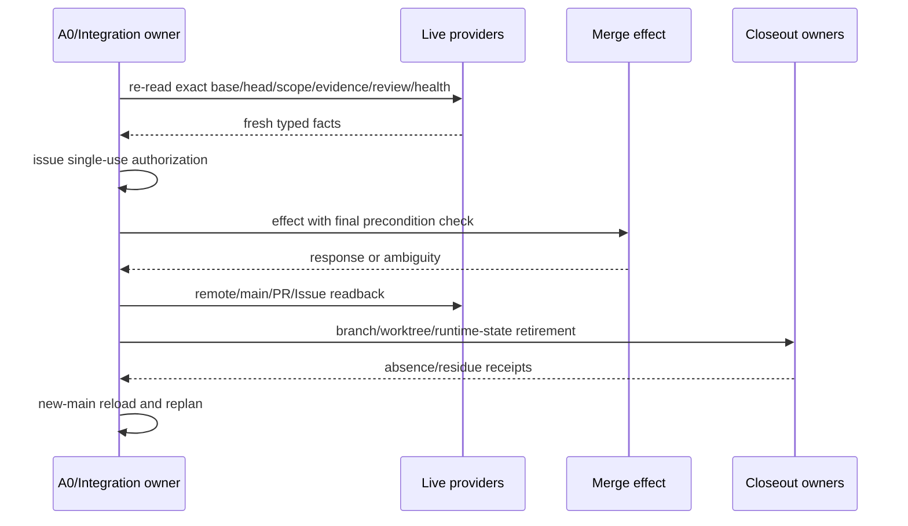

# 失败恢复、集成与 Closeout

本片段拥有 failure/retry/resume、integration/merge/closeout、authority-expansion stop、逻辑验证与完成。

## 13. Failure、retry、resume

### 13.1 Failure transition

| Observation | Next |
| --- | --- |
| invalid plan/input | reject and redesign |
| deterministic same-input failure | reuse failure; no rerun |
| transient cause changed | bounded retry |
| process/provider handle lost | owner readback/reconcile |
| partial repository/external Effect | recovery-required |
| control-plane/model counterexample | invalidate dependent plan/Evidence; self-correction |
| current MainHealth repair/locked | repair-only / stop |

### 13.2 Continuation

```text
resume facts =
  canonical constitution
  + accepted task authorization
  + exact candidate/base identity
  + durable operation references
  + live provider refresh required by boundary
```

checkpoint/summary/memory只定位 refs。resume compiler可输出 `continue | refresh-boundary | reconcile | blocked | terminal`，不签发 Scope/PASS/Review/MainHealth/merge。

trust/new-main变化退役旧 Effect grant/Review/authorization，但长期仍获授权的目标从新main自动re-orient；除真正外部选择/blocker外不要求用户重复说“继续”。

## 14. Integration、merge 与 closeout



provider response lost时只readback。closeout 的 branch/ref/worktree/temp/runtime state 各由 creator/preimage/physical identity/absence/retirement authority 控制；foreign/unknown residue保留并阻断 completion。

Issue disposition、PR、remote main、local main、Evidence、Review、Runtime State 是不同对象；一个成功不替代其余。

## 15. Authority-expansion stop

出现以下任一即停止当前实现并重算设计：

| Signal | Why |
| --- | --- |
| 为调用成熟工具下载/复制完整发行版 | runtime adoption变provisioning |
| 为证明一个exe递归拥有整个安装树 | proof scope大于Effect closure |
| 新增同构wrapper/graph/cache/registry | duplicate owner |
| verification成本随无关目录/Issue/history增长 | wrong dependency identity |
| provider/credential/state owner数量增加且旧owner未zero | incomplete migration |
| fixed operation成本与semantic work不成比例 | hidden repeated work/authority |

## 16. 无代码逻辑验证

| Scenario | Required action | Forbidden |
| --- | --- | --- |
| user给出技术方案但更优方案存在 | keep as hypothesis; compare | literal implementation |
| user纠正暴露模型缺维度 | stale downstream; fix owner/model | append one prompt/test |
| context compacted mid-operation | rebind constitution/live refs; continue | trust summary authority |
| child claims done without readback | verify delta/receipt; not complete | parent accepts prose |
| 6 independent read audits | delegate if cost beneficial | six writers on same graph |
| code slice changes public parser | reconcile all readers/writers/migration/tests | commit then discover |
| canonical provider unavailable | typed blocker or eligible alternative binding | naked fallback/install |
| same typecheck input already PASS | reuse | full rerun |
| same deterministic failure unchanged | stop/reuse | timeout increase/retry loop |
| merge response missing | readback only | second merge |
| new main lands during long task | retire old epoch; auto-reorient | demand user reauthorize same objective |
| obsolete worktree uncertain owner | preserve/typed residue | recursive cleanup |
| valid future abstraction lacks current consumer | require accepted obligation/activation or proposal-only | auto-delete or active empty shell |

## 17. Completion

```text
DevelopmentTaskComplete =
  user outcome observable
  ∧ exact candidate closed
  ∧ required Claims independently verified
  ∧ Review/Integration live authorization consumed once
  ∧ remote/new-main result read back
  ∧ old owners/routes/migration artifacts retired as required
  ∧ branch/worktree/runtime/external residues settled or explicitly blocked
  ∧ current facts and next roadmap projection recompiled
```

绿色测试、commit、push、PR、merge response、Issue close或本地clean中的任一个都不等于完成。
