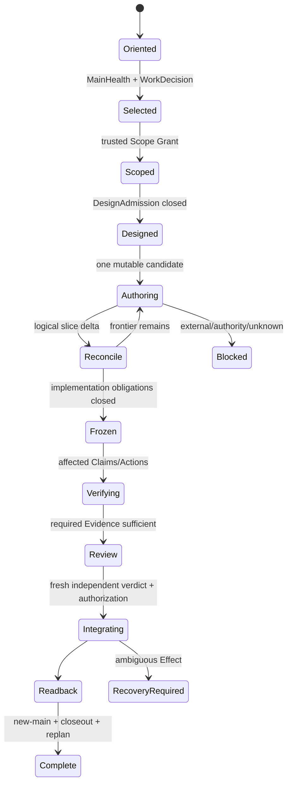

# 工作选择、Operation 与 Authoring

本片段拥有 goal/work selection、Agent Operation、Work Package、authoring/freeze/promotion、impact/typecheck 与外部工具路由。

## 7. Goal、work selection 与计划

### 7.1 Selection order

```text
terminal user outcome
→ current exact repository/external facts
→ MainHealth: ordinary | repair | locked
→ existing work identity/spec reconciliation
→ WorkDecision
→ smallest coherent root-cause DAG
```

ordinary 才做 WorkDecision；repair 只消费 owner-issued repair decision；locked 停止。Issue catalog、roadmap、PR prose 和 chat 不在 MainHealth 前抢占 routing。

### 7.2 Records

| Record | Owns | Does not own |
| --- | --- | --- |
| Product spec | outcome/boundary/success | current plan |
| Architecture spec | relation/constraint/owner/DAG | domain fields |
| Roadmap | stable capability dependency and entry/exit | current status |
| Issue | one real problem/decision/acceptance/counterexample | execution log |
| Rolling projection | active + next bounded candidates | backlog authority |
| Work Package | frozen delivery scope/owners/capabilities/Evidence | global principles |
| Operation Envelope | one actor/role/operation/seam/budget | integration |
| PR | exact candidate diff/review surface | completion |
| Evidence | exact Claim facts | roadmap/authority |

## 8. Agent Operation System

### 8.1 Objects

| Object | Required content | Authority |
| --- | --- | --- |
| Task Capsule | pure unbound planning content、goal/scope candidate、non-goal | none |
| Scope Grant | exact base、allowed/forbidden Effect、resources、trust epoch | trusted issuer |
| Operation Read Plan | minimal owner clauses/symbols/unknown + read budget | read only |
| Skill Applicability | zero-or-one bounded heuristic recipe | no product/Effect authority |
| Operation Envelope | actor、role、operation kind、subjects、bounds、obligations | upper bound only |
| Action Plan | normalized pure executable requirements | no Effect |
| Effect Grant | principal+subject+operation+budget+validity | operation-specific |
| Settlement/Readback | actual provider/domain result | issuer-specific |

Task Capsule、manifest、pointer、journal、digest、本地 ref/file 或 self-generated JSON 不是 issuer credential。

### 8.2 Lifecycle



Current capability只有 machine contract + producer/consumer + failure/recovery + focused Evidence + new-main readback闭合后 active；stable docs 不维护 current matrix。

生命周期中的`Designed`只在设计演算 owner 的
`ImplementationWorkAdmitted(targetSlice)`成立时成立：它同时要求递归
`DesignClosed`、`AdversarialFixedPointClosed`、同一输入世代的实现/符合性冻结回执
以及局部性、owner、资源、演进与未知边界闭合。没有该谓词只能做纯设计、观察或
bounded experiment，不能开始实现写入；这条引用不复制准入逻辑，也不把本文件变成
设计事实 owner。

## 9. Work Package 与 ownership

Work Package freezes:

```text
problem/outcome + non-goals
+ exact base and scope
+ responsibility/owner DAG
+ worker envelopes and forbidden overlap
+ capabilities/resources
+ acceptance/Claims/Evidence
+ migration/retirement/closeout
```

### 9.1 Delegation decision

| Condition | Decision |
| --- | --- |
| independent bounded read/implementation seams + material speed/quality/context gain | delegate |
| same canonical writer/file/state/branch/external Effect | single writer |
| unclear ownership or shared mutable artifact | do not delegate; refine DAG |
| tiny task or coordination cost ≥ work | local |
| reviewer must be independent | separate read-only reviewer |

Child receives only required context and narrower Envelope. A0 retains current authorization, architecture, integration and final verification.

### 9.2 One logical run

```text
active mutable worktrees per logical run = 1
active candidate refs per logical run = 1
finding successor worktrees = 0
```

Parallel pure reads/independent workers are allowed；concurrent writes to same owner/file/state/lock/generated artifact/branch/external object are not.

## 10. Authoring、freeze 与 promotion

| Phase | Allowed | Forbidden |
| --- | --- | --- |
| Authoring | mutate authorized candidate、focused/incremental proof | hosted status、merge claim |
| Reconciliation | compile before/after consumer/effect/test/state closure | commit-as-closure |
| Freeze | exact tree/environment/Bindings、stop mutation | evidence on moving target |
| Verification | ActionKey reuse/execute missing Claims | broad rerun by habit |
| Review | independent exact subject counterexample | producer self-approval |
| Promotion | single-use live authorization + CAS/readback | blind merge retry |
| New-main | reload truths/owners/capabilities、retire old epoch | continue old grant |

Commit 是 local repository Effect，seal 一个已闭合 slice；它不能创造闭包。每个文件Effect遵循：

```text
plan(preimage,target)
→ acquire workspace lease
→ final pre-effect fence
→ write/rename/delete
→ durability/readback
→ settlement/residue
```

staging/format/import rewrite 必须限制于 task-owned exact paths；不能吸收 unrelated dirty。

## 11. Impact、typecheck 与验证成本

```text
RequiredClosure = semantic/source/effect reverse closure of delta
ExecutionSet = RequiredClosure ∩ MissingOrStale
```

| Fact | Behavior |
| --- | --- |
| fresh PASS | reuse |
| fresh deterministic failure | reuse failure; stop |
| authenticated in-flight | join |
| missing/stale | execute once |
| unknown start/outcome | reconcile/block |

Source snapshot、Source Program facts、dependency closure、typecheck/test-impact/audit inputs共享，不各自扫描。编辑期使用 Language Service/affected canonical typecheck；full frozen proof只在 Claim 需要时一次。同一 TypeScript revision、config、dependency generation、tree 的 PASS 以 Action identity复用。

Performance optimization order：

```text
delete duplicate owner/scan
→ share exact snapshot/facts
→ narrow dependency/Claim closure
→ reuse terminal/in-flight
→ improve provider implementation
→ parallelize independent pure work
```

不得以放宽 coverage/identity/unknown/readback 换速度。

## 12. External capabilities 与工具

采用成熟工具由 `docs/external-provider-policy.md` 决定。普通离散操作直接消费最窄稳定 machine interface；只有 protocol/credential/Effect/resource/settlement/security/compatibility 边界需要薄 Adapter。

shell 是 process transport，不签发 semantic/completion truth。Presentation output 不解析成 authority；Git 使用 porcelain/NUL-safe/object interfaces，JSON/YAML使用 strict parser。工具缺失不触发临时安装，除非 task 明确授权 provisioning。
