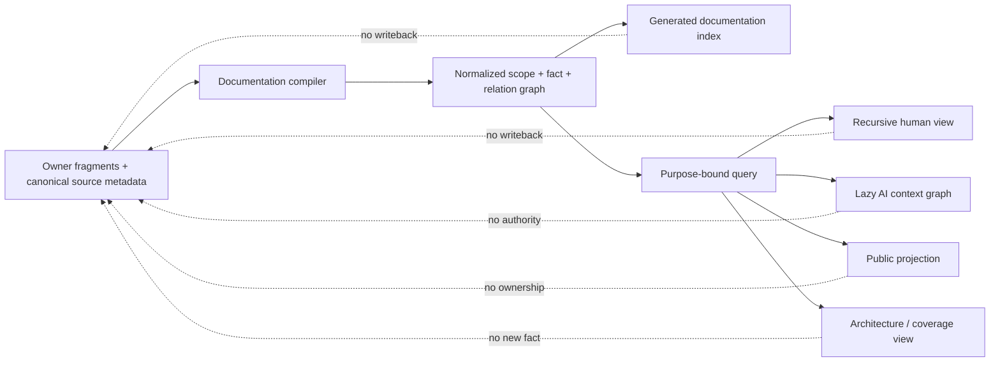
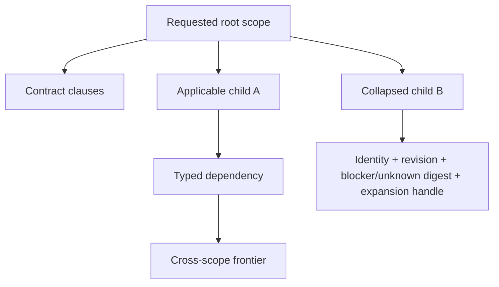
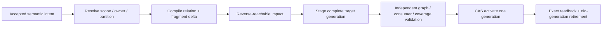
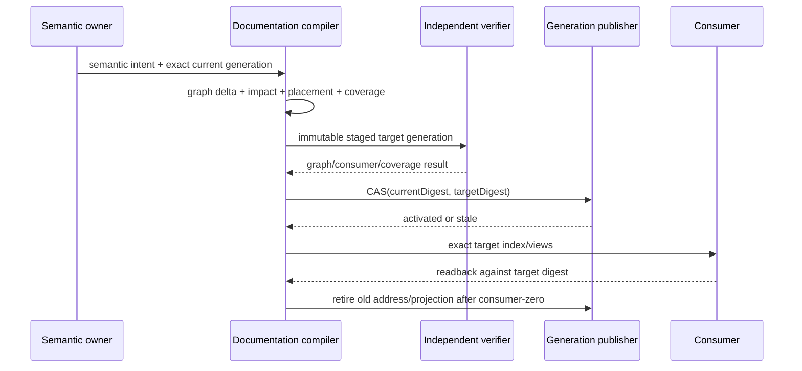
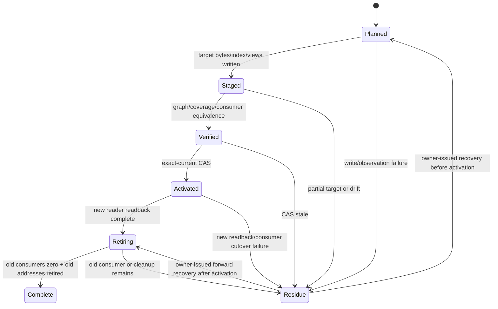

# 文档知识系统

本文拥有 SEC 文档的结构、规范片段、编译投影、读取闭包、质量与迁移规则。文档 identity、lifecycle 与 ownership registry 由 `docs/authority.json` 拥有；产品、架构、领域和运行事实仍由其各自 owner 拥有。本文不能借整理、摘要或生成改变这些事实。

本文冻结下一代文档知识结构，不宣称它已物理迁移。现行generation在cutover前仍由`docs/authority.json`及其当前parser拥有；目标generation完成shadow compile、语义等价、全部consumer切换与旧地址consumer-zero后才取得authority，禁止正文先把target写成current。

## 1. 目标与不变量

```text
DocumentationSystem =
  CanonicalOwnerFragmentsWithSourceMetadata
  + RecursiveSemanticScopeGraph
  + TypedRelationGraph
  + CorpusKindPartitions
  + CompiledDocumentationIndex
  + PurposeBoundCompiler
  + GeneratedViews
  + MigrationAndRetirement
```

| 不变量 | 可判定表达 | 失败结果 |
| --- | --- | --- |
| 单一事实 | 每个 ownership key 只有一个 active owner fragment | duplicate-owner |
| 身份独立 | document ID 与 owner key 不由 path、标题或目录推断 | identity-unbound |
| 片段完备 | 每个片段声明 owner、边界、输入、输出与不拥有内容 | fragment-unbounded |
| 递归可缩放 | 每个semantic scope有唯一containment parent或root；任意节点可独立折叠/展开 | scope-orphan/cycle |
| 关系不降维 | containment、dependency、projection、generation、evolution分别typed | relation-overloaded |
| 约束可组合 | 同一事实与约束集合以任意分组/顺序编译得到相同normal form与verdict | order-dependent-semantics |
| 分区隔离 | stable knowledge、current control、machine state、proposal、immutable record不共用writer/lifecycle | corpus-kind-conflated |
| 引用不复制 | 跨文档语义只使用 stable ID/owner key/typed ref | mirrored-truth |
| 视图只读 | 导航、摘要、AI context、public docs均不能反写 owner | projection-authority |
| 未知保留 | query、迁移和摘要必须保留 coverage/frontier/blocker | hidden-frontier |
| 局部变更 | 一个owner fragment变化只重编reverse-reachable scopes/views/consumers | corpus-global-rebuild |
| 读取显式 | parser/compiler的每个content、filesystem或external read都注册为query dependency | hidden-side-read |
| 可发现性 | 每个可披露active fragment由至少一个purpose/root可达；刻意不可导航者有typed lifecycle/disclosure理由 | navigation-orphan |
| 单代切换 | 文档移动或拆分只有一个 active canonical path | dual-canonical-path |
| 可恢复迁移 | registry、文件、引用、生成投影原子读回后才完成 | documentation-migration-residue |

## 2. 信息模型：事实与表达分离



canonical form是owner fragments中的事实、约束、状态/转换、决策、source metadata与typed relations。它是normalized graph，不是目录树；其中`contains`关系形成可递归展开的scope forest，其他关系保持DAG/hypergraph/state-machine语义。物理目录与README只是在指定partition和address budget下生成的placement/navigation views，不能反向决定scope或owner。renderer按关系选择最合适的表达：

| 语义 | 首选表达 |
| --- | --- |
| owner、layer、lifecycle、kind 对照 | matrix/table |
| dependency、causality、provenance | DAG 或 typed hypergraph |
| state、failure、recovery | state machine |
| operation order、concurrency | sequence/partial order/swimlane |
| resource subdivision/conservation | ledger/allocation tree |
| hierarchy/zoom/navigation | tree 或 nested compound view |
| constraint、eligibility、unknown refinement | decision table/lattice |
| rationale、候选与反转 | decision record |

嵌套只适合 hierarchy/zoom renderer；它不能替代多归属关系、并发偏序、资源守恒或证据支持，更不能成为系统本体。

## 3. 文档种类与唯一职责

`source-header`是每个source fragment的strict envelope，不是与正文并列的文档种类。目标generation只有三类artifact，不能用可选字段把它们压成一个DTO：

```text
DocumentationArtifactClass =
  | SourceFragment(DocumentSourceRole)
  | ExternalBoundInput(ExternalCorpusBinding)
  | GeneratedProjection(ProjectionRole)

DocumentSourceRole =
  | AuthorityContract { ownershipKeys: nonEmptySet }
  | AuthorityTopic { ownershipKeys: nonEmptyDisjointSet }
  | CorpusContract { corpusContractRef, ownershipKeys: nonEmptySet }
  | ControlDeclaration { controlKey, controlContractRef, controlRevision }
  | Proposal { proposalRef, decisionFrontierRef }
  | ImmutableRecord { recordRef, issuerAndProvenanceRef,
                      authorityCeiling, retentionRef }

DocumentSourceHeader = exact {
  documentRef,
  sourceStratumRef,
  scopeRef,
  lifecycle,
  sourceRole: exact DocumentSourceRole variant,
  disclosureClass,
  clauseAdoptionPolicy: ClauseAdoptionPolicy
}

ClauseAdoptionPolicy = exact {
  policyRef: IndependentOwnerIssuedDecisionRef,
  defaultKind: stable-decision | temporary-safety-denial | non-normative-explanation,
  defaultBlocker: null | nonEmptyToken,
  appliesTo: clause-and-explanation-nodes-of-this-fragment-only
}

IndependentOwnerIssuedDecisionRef = exact {
  decisionRef,
  issuerOwnerKey,
  issuerAuthorityRef,
  decisionRevision,
  applicabilityScopeRef,
  policyDigest
}

`policyRef`是现有Decision owner签发的引用封套，不是fragment自行生成的新事实。
编译器必须解析它并证明：`issuerOwnerKey`与当前fragment owner不同且在
`issuerAuthorityRef`中有效，`decisionRef/decisionRevision`属于当前active decision，
`applicabilityScopeRef`覆盖该fragment而不越过其scope边界，`policyDigest`等于
决策中实际采用策略的canonical bytes。`decisionRef`、issuer、scope或策略正文的
任一变化都会使header与generation stale。fragment body、generated view、迁移输出、
caller字段和“独立”布尔值都不能伪造该引用；解析失败、issuer失效、scope不覆盖或
digest不匹配统一产生`owner-decision-unbound`。

DocumentBodyNode =
  | ClauseSource { clauseId, statementKind, typedSubjectRefs,
                   quantifierAndUniverseRef, modality, predicateAstRef,
                   preconditionRef, observableOrRejectionRef,
                   sourceAndReversalRefs }
  | DecisionSource { designDecisionRef }
  | RelationSource { exact AuthoredDocumentationRelation variant }
  | ViewDeclaration { exact clause/relation/state/algorithm refs,
                      selected renderer + presentation parameters }
  | NonNormativeExplanation { text, optionalReferencedRefs }

ProjectionRole = documentation-index | navigation | agent-view | public-view
```

| Artifact class | 能拥有 | 不能拥有 |
| --- | --- | --- |
| AuthorityContract / AuthorityTopic | 其非空且不重叠的normative ownership keys | runtime observation、其他contract facts |
| CorpusContract | 注册的documentation corpus rule | domain fact、运行Authority |
| ControlDeclaration | 一个exact repository-authored desired/selection input及其revision | observed progress、session/pointer、runtime ledger、stable principle |
| Proposal | 无canonical facts；只保存候选、frontier与target refs | active authority、兼容壳、owner key |
| ImmutableRecord | 一次过去事实的record identity/provenance/claim ceiling | current Definition、mutable state、owner key |
| ExternalBoundInput | 无；只引用外部owner允许披露的immutable projection | 把machine state/Evidence/artifact复制进`docs/**` |
| GeneratedProjection | 无；只聚合或投影exact source/binding refs | 事实、裁决、Authority、writeback |

partition由role严格派生：三个authority roles进入`knowledge`，ControlDeclaration进入`control`，Proposal进入`proposal`，ImmutableRecord进入`immutable-record`；作者不得另填partition制造冲突。Evidence、测试输出、临时审计报告和聊天不是稳定source role；它们进入各自artifact/runtime owner，或在结算后退役。现行`registry`仍按本文开头的current/target边界由`authority.json`拥有，cutover后才由distributed source headers与generated `DocumentationIndex`取代。

Task Capsule、Work Package、operation manifest/plan/journal、Scope/Grant、session与Evidence payload是control/runtime/verification Subjects，不是文档source role；它们必须由各自strict owner存入Runtime State或Artifact Store，并只以`ExternalCorpusBinding`进入授权view。若终态需要长期解释，domain owner可另签发有claim ceiling与retention的`ImmutableRecord`，但不得把原operation payload复制进Markdown或因位于`docs/**`就升格为知识。

`lifecycle`同样受role约束，而不是任意标签：

| source role | legal lifecycle | transition rule |
| --- | --- | --- |
| AuthorityContract / AuthorityTopic / CorpusContract | `active → superseded → retired` | 新active revision只有在generation cutover时替代旧revision |
| ControlDeclaration | `active → superseded → retired` | 新active revision只由control declaration owner按exact cutover替代 |
| Proposal | `draft → rejected \| superseded` | 采用结果产生新的authority revision；proposal自身不变成authority |
| ImmutableRecord | `retained → expired → retired` | payload不变；只由retention owner改变可见/保留状态 |

ExternalBoundInput沿外部owner的fresh/stale/terminal语义，GeneratedProjection随source/binding stale并可直接重建；二者不复用source lifecycle。任何role/lifecycle非法组合都在body materialization前拒绝。

## 4. Canonical model：partition、scope、fragment、relation

文档知识不以文件列表为模型。canonical source由分区内的owner fragments组成；compiler把分布式metadata规范化为递归scope graph与独立typed relations，再生成machine index和各种view。

```text
CorpusPartition =
  knowledge        // stable/active normative authored source
  | control        // repository-authored current control only
  | proposal       // non-authoritative candidate
  | immutable-record

ExternalCorpusBinding = {
  sourceKind: machine-state | evidence | runtime-artifact | external-inventory,
  exactProviderSubjectAndGenerationRefs,
  principalTenantAndSecurityEpochRefs,
  parserCoverageFreshnessAndDisclosureRefs,
  projectedPayloadRef + payloadDigest,
  authorityCeiling,
  observationRevision,
  descriptorDigest
}

ScopeNode =
  | OwningScope {
      scopeRef, sourceStratum, parentScopeRef | root,
      contractFragmentRef, childScopeRefs
    }
  | DerivedNamespace {
      scopeRef, parentScopeRef | root, derivationRef, childScopeRefs
    }

DocumentFragment = {
  documentRef,
  sourceRole: exact DocumentSourceRole variant,
  partition: derivePartition(sourceRole),
  scopeRef,
  lifecycle,
  compiledRelationRefs,
  contentDigest,
  sourceMetadataDigest
}

AuthoredDocumentationRelation =
  | AuthorityTopicOf(topicDocumentRef, contractDocumentRef)
  | DependsOn(sourceDocumentRef, targetDocumentRef, purpose)
  | Supersedes(newRef, oldRef, cutoverRef)
  | ProposalTargets(proposalRef, targetRefs)
  | Records(recordRef, subjectRefs)

DerivedDocumentationRelation =
  | ContainsScope(parentScopeRef, childScopeRef)       // from ScopeNode parent refs
  | ProjectsFrom(projectionRef, sourceRefs)            // from projection descriptor
  | GeneratedFrom(generatedRef, sourceRefs, compilerRef) // from generator descriptor

DocumentationRelation =
  | AuthoredDocumentationRelation
  | DerivedDocumentationRelation
```

role只决定本fragment能提出哪类claim，authored跨实体端点只由`RelationSource`拥有：每个`AuthorityTopic`必须有且只有一个`AuthorityTopicOf`；每个`Proposal`必须有且只有一个非空`ProposalTargets`；每个`ImmutableRecord`必须有且只有一个非空`Records`。relation中的source identity必须与header role identity一致。containment和projection/generation provenance不允许手写，分别由`ScopeNode`、projection descriptor和generator descriptor推导。这样role metadata不会复制contract、target或subject关系，派生边也不能通过正文伪造；descriptor/index中的每条边只有一个authoring或derivation origin。

relation variants不可互相代用：`AuthorityTopicOf`授予topic对contract ownership slice的唯一归属，普通`DependsOn`只表达消费依赖；`ProjectsFrom`证明projection的语义来源，`GeneratedFrom`证明materialized bytes的compiler/input provenance。compiler必须拒绝以较弱边满足较强边、同一origin产生竞争边或任一派生边缺少其descriptor source。

`ScopeNode`是递归语义边界，不是目录。`OwningScope`必须有真实contract fragment；`DerivedNamespace`只能由source-stratum/partition/accepted containment relation确定生成，不能拥有事实或由作者创建空分类页。每个scope只有一个containment parent；多归属、依赖、因果、投影和演进通过其他typed relations表达，不伪装成多父目录。

semantic refs使用与path无关的canonical segment grammar；identity保持稳定，meaning变化由content revision表达：

```text
SemanticSegment := [a-z][a-z0-9]*(?:-[a-z0-9]+)*
DocumentRef     := SemanticSegment(?:'.'SemanticSegment)*
ScopeRef        := SemanticSegment(?:'.'SemanticSegment)*
ClauseRef       := DocumentRef'#'SemanticSegment(?:'.'SemanticSegment)*
DocRef          := 'doc:'DocumentRef(?:'#'SemanticSegment(?:'.'SemanticSegment)*)?
ContentRevision := sha256(canonical semantic IR)
```

大小写、Unicode lookalike、空segment、`.`/`..`、path separator、URL escaping和Windows reserved name不能进入semantic refs。schema、compiler、relation laws和address policy各有独立semantic ref与content digest；不以`V1/V2`类型名、文件名或所有对象碰巧写同一个数字区分generation。

### 4.1 Recursive scope view

```text
compileScopeView(rootScopeRef, purpose, depthBudget, disclosureBudget):
  load exact root contract and purpose-required relations
  recursively expand applicable child scopes within budgets
  for each collapsed child emit:
    child scope identity + revision + public contract refs
    blocker/unknown/boundary digest + expansion handle
  preserve all cross-scope frontier edges
  reject hidden applicable obligation, cycle or stale child digest
```

同一graph可生成最小operation context、owner package、递归human导航、AI lazy context、public projection和全量授权审计。折叠只减少detail bytes，不删除blocker、unknown、boundary或cross-edge；最大视图是同一递归查询完全展开，不是第二份平铺清单。

### 4.2 Fragment 与 subscope 判定

```text
FragmentRequired(x) =
  hasDistinctOwnershipKeyOrPublicContract(x)
  and independentlyReadable(x)
  and independentlyChangeableOrInvalidatable(x)
  and cohesiveWithinBoundary(x)
  and lifecycleCost(fragmented) < lifecycleCost(coLocated)

SubscopeRequired(x, parent) =
  semanticUniverse(x) isProperSubsetOf semanticUniverse(parent)
  and invariantOrLifecycleBoundary(x) is independently queryable
  and uniqueContainmentParent(x) = parent
  and crossScopeRelationsRemainTypedRefs
```

一个scope的`contract` fragment拥有purpose、边界、公共词汇/不变量、child scopes与completion predicate；它不能只是目录索引。topic只在`FragmentRequired`成立时存在；subscope只在`SubscopeRequired`成立时递归创建。按行数、作者、读者习惯或目录美观拆分均被拒绝。

### 4.3 竞争结构裁决

| 候选 | 优点 | 决定性缺陷 | 裁决/反转条件 |
| --- | --- | --- | --- |
| 单文件/平铺owner清单 | 初始简单 | root规模、局部读取、并发编辑和递归导航随domain增长恶化 | rejected |
| 固定`foundation/domain/runtime/...`分类树 | 人眼整齐 | 一个事实常跨多个观察维度；目录会伪造owner/layer并随新维度重排 | rejected；只有作为generated view可用 |
| 全部拆成最小fact/opaque graph store | 查询精细 | authoring、diff、review、cohesion和human reasoning成本过高 | rejected；高频compiled index可用 |
| recursive semantic scopes + typed cross-relations + compiled views | containment可缩放；其他关系不降维；局部变更与最小读取兼得 | 需要严格compiler、metadata migration和path consumer cutover | selected |

若真实corpus证明scope containment长期没有独立读取/变化收益，或compiler/query成本支配平铺结构的全生命周期成本，则按Design Calculus重新比较；不得直接在目录中回退。

## 5. Source metadata、aggregate index 与物理布局

每个canonical fragment在自己的strict `DocumentSourceHeader`中一次写入document identity、source stratum、scope、lifecycle、exact role和disclosure；partition与ownership keys严格从role派生，不由作者重复填写。每条relation只在正文的`RelationSource`中authored一次，compiler再把它投影成fragment descriptor、graph edge与index ref；header、frontmatter和registry不得重复保存relation。正文不重复其他header事实。路径、domain label、导航顺序和aggregate records由compiler派生。

Markdown只是`DocumentBodyNode`的容器，不是自然语言语义推断器。只有显式
`ClauseSource/DecisionSource/RelationSource`能提供canonical meaning；
`ViewDeclaration`只能选择同一refs的图、表、公式、算法或人类句式renderer；自由
prose一律是`NonNormativeExplanation`。现有brownfield prose、手写Mermaid、表格
和代码块在迁移时只产生candidate/unknown，不能凭AI、embedding、标题或格式自动
升级为normative clause。owner必须通过fragment header的一次采用策略或节点级
覆盖明确承担这个语义，否则保留为frontier或删除。

`ClauseAdoptionPolicy`是降低重复标注的唯一机制，不是默认把整篇文档升格为规范：
它必须位于同一fragment的strict header、引用owner-issued decision，并且只作用于
该fragment自己的body nodes；child scope、外部引用和generated view永不继承它。
节点级directive可以覆盖header default，但覆盖必须声明自己的kind/blocker，且
normalized graph记录`header-default | local-directive`来源与对应ref，digest也
包含该来源。没有policy或覆盖的节点仍生成`untyped-observation`并阻断；不能从
`status: stable`、registry kind、标题、目录或读者习惯推断采用。

指令与header default共享以下闭集，且`blocker`必须与kind一致：

| directive kind | 语义 | 可进入 normative/agent projection | blocker |
| --- | --- | --- | --- |
| `stable-decision` | owner 已接受的规范 clause | 是（仍受 admission/selection） | 必须为 `null` |
| `temporary-safety-denial` | 暂时拒绝或未闭合的安全边界 | 否；保留为 frontier | 必须为非空 token |
| `non-normative-explanation` | 仅解释、例示或导航语句 | 可作为注明非规范的上下文 | 必须为 `null` |
| 未标注标题 | 尚未被 owner 采纳的观察 | 否 | 编译器生成 typed frontier |

这四类不是四套事实源：每个节点仍只生成一个 clause；`non-normative-explanation`
也不能借 blocker 伪装成安全裁决，`temporary-safety-denial` 不能被 renderer
降级成普通说明。未知 directive、重复键、额外字段、缺失policyRef和不匹配的
blocker直接拒绝编译，而不是按最接近的kind猜测。迁移阶段缺失header policy是
精确的`source-adoption-required` frontier，不是允许编译器批量补标签的理由。

```text
compileClauseAdoption(fragment, bodyNodes):
  policy := requireExact(fragment.header.clauseAdoptionPolicy)
  require policy.policyRef is not derived from fragment body, generated view or migration output
  for node in clauseOrExplanationNodes(bodyNodes) ownedBy fragment:
    adoption := node.localDirective ?? policy
    require adoption.kind in closedKindSet
    require blockerShape(adoption.kind, adoption.blocker)
    emit ClauseSource(..., adoption, origin =
      node.localDirective ? local-directive : header-default)
  exclude DecisionSource, RelationSource, descendantScopeNodes and generated/projection nodes
  include policyRef + origin + effective adoption in graph/digest
```

因此，补充一个 fragment header policy 可以一次采用其自身的同类正文；例外节点
只增加局部directive，不复制整篇规则。policy缺失、继承越过scope、directive覆盖
未声明或policyRef不属于当前owner时，结果分别是`source-adoption-required`、
`scope-inheritance-forbidden`、`adoption-override-invalid`或`owner-decision-unbound`，
全部保留为blocking frontier。

`docs/authority.json`在目标generation中退役authoring职责；目标machine projection为generated、content-addressed `DocumentationIndex`。它聚合全部source headers、scope/relations、physical addresses和digests，但不拥有任何事实，并发布到Runtime State/Artifact Store而不是提交进authored `docs/**`。当前`authority.json`在迁移完成前仍是唯一现行registry，两个generation不得同时被production consumer接受。

```text
docs/
  README.md                         # generated recursive root view
  knowledge/
    <compiled source-stratum>/<recursive semantic scope>/
      contract.md                   # owning scope contract
      <cohesive-fragment>.md
      <child-scope>/contract.md
  control/<scope>/...               # current control only
  proposals/<scope>/...             # candidate only
  records/<scope>/...               # immutable retained records only

Runtime State / Artifact Store
  documentation/<generation>/documentation-index.json
  documentation/<generation>/views/...   # disposable/generated projections
```

`knowledge/control/proposals/records`由`CorpusPartition`确定，不是任意业务分类。Runtime State、Evidence、cache与artifact不进入`docs/**`；Documentation Compiler只通过`ExternalCorpusBinding`读取其owner签发的immutable descriptor，并把允许披露的内容投影进view。其下目录由`sourceStratum + scope containment + PlacementDecision + PhysicalPathCapability`编译；address compiler可压缩纯namespace节点并选择短、可读、无case-fold/reserved-name冲突的segments，但不能改变scope identity或relation。禁止同名`<owner>.md`与`<owner>/`、空README/index、`misc/shared/common`、重复owner词段和手工长路径。

canonical cross-document reference使用`DocRef(documentRef, optionalClauseRef)`；authoring syntax由Markdown AST frontend映射为typed node，不能以相对path字符串作为identity。human/public renderer把`DocRef`解析为当前relative link；move/reparent只更新generated addresses/views，不改semantic source refs。外部URL是ExternalReference observation，若参与normative claim必须声明freshness/retention/unknown policy。

### 5.1 Source discovery 与单一metadata owner

Documentation Compiler从exact content snapshot读取所有允许partition下的source。snapshot包含baseline tree、candidate additions/deletions/renames和显式untracked frontier；不能只看tracked baseline或工作树中仍存在的文件。未解析、未分类、opaque或被删除但仍有consumer的内容必须进入typed frontier，不能因未登记或不存在而跳过。

metadata不是强迫所有格式共用一个frontmatter DTO。各source kind由唯一owner frontend归一化成同一`DocumentSourceDescriptor`：

```text
DocumentationSource =
  | AuthoredMarkdown(sourceHeader, markdownAst)
  | RepositoryMachineDocument(domainParserRef, canonicalDeclarationOrRecordPayload, emittedDescriptor)

TrackedProjectionObservation = {
  projectionRole,
  generatorRef,
  declaredSourceRefs,
  observedBytesDigest
}

DocumentationViewInput = {
  sourceGenerationRef,
  readRequestRef,
  externalCorpusBindings: sorted ExternalCorpusBinding[],
  rendererAndDisclosureRefs
}

DocumentSourceDescriptor = {
  documentRef, sourceKind, exactSourceRole, derivedPartition,
  scopeRef, sourceStratumRef, lifecycle,
  derivedOwnershipKeys, compiledRelationRefs,
  disclosureClass, payloadDigest, metadataDigest
}
```

authored Markdown header是该fragment metadata的唯一authoring point，按role使用closed exact variants；repository control/immutable-record payload继续由其domain strict parser拥有；外部machine state、Evidence与artifact只通过owner签发的`ExternalCorpusBinding`进入purpose-bound view compilation，不变成`DocumentFragment`或canonical source generation。generated projection不是`DocumentationSource`：tracked README等只作为bytes observation与source-derived期望比较，绝不能反向参与graph编译。任何输入都不能由中央手写registry补字段。source grammar/schema revision绑定整个`DocumentationGeneration`，不在每篇文件重复`formatVersion: 1`。

`DocumentationIndex`、README、presentation frontmatter、AI/public views全部生成。README只有在Git读者必须零运行时导航时才作为source-bound projection提交；其余index/views进入Runtime State/Artifact Store并可重建。这样消除中央大清单写热点与header/registry镜像，同时仍由aggregate compiler全局验证duplicate owner、ID/path collision、cycle、unresolved ref和lifecycle。

```text
compileDocumentationGeneration(snapshot):
  census every baseline and candidate source/projection byte/status
  classify canonical sources separately from tracked projection observations
  strict-parse each canonical source through its uniquely registered frontend
  normalize emitted DocumentSourceDescriptors
  build normalized partition/scope/document/relation graph
  validate ownership, containment, dependency, lifecycle and disclosure
  compile physical placement under path capability
  compile aggregate index + source-bound recursive views + consumer impact
  compare tracked projection bytes with compiled expectations; never ingest them as facts
  read back exact bytes, graph digest and no-unclassified-source frontier
```

Consumer evidence has two independent outputs and they must not be collapsed:

```text
ObservedConsumerRefs       = references found by the selected bounded observer
LocalConsumerCoverage      = complete | unknown
ExternalConsumerStatus     = none-observed | present | unknown
```

`ObservedConsumerRefs=[]` only means that this observer found no literal hit. It
does not prove consumer-zero. A migration design may clear the local-consumer
frontier only when the domain owner supplies a complete, exact-generation-bound
consumer census; the migration CLI's literal `git grep` result is therefore
always `LocalConsumerCoverage=unknown`. Dynamic/generated references, package
entrypoints, workflow/config readers and external consumers remain explicit
frontiers until their owners provide the corresponding evidence. This prevents
an incomplete observer from authorizing deletion merely because it returned an
empty list.

`ExternalConsumerStatus=none-observed` is likewise an owner-issued protocol or
support census, not a caller boolean and not an inference from repository search.
It must bind the exact source generation, consumer class, support/retention
window and revalidation trigger. Without that evidence the migration remains
blocked even when every local observer reports an empty set.

迁移编译器的输入也必须体现这条边界，而不是让 `CorpusEntry` 中的状态字段
直接充当权限：

```text
DocumentationConsumerCensus = opaque owner-issued {
  providerRef,
  generationRef,
  corpusDigest,
  entries: exact observed refs + local coverage + external status,
  censusDigest
}

compileMigration(..., consumerCensus):
  require issuer brand and canonical provider route
  require generationRef/corpusDigest == currentGenerationBinding
  require censusDigest == digest(providerRef, generationRef, corpusDigest, entries)
  use entries only after these checks
```

`DocumentationMigrationCorpusEntry` 是 observation payload，不是 authority。
caller 不能用 object spread、手写 `none-observed` 或空数组替换
`DocumentationConsumerCensus`；未知或未签发的 census 保持
`external-consumer-unknown`/`local-consumer-coverage-unknown` frontier。未来若有
完整外部协议 census，必须由其 provider owner 增加独立 issuer、覆盖范围、保留
窗口和重验证触发器，不能放宽当前类型或添加兼容别名。

graph facts与graph constraints分别编译；constraint不是藏在validator分支里的第二事实源：

```text
DocumentationConstraintShape = {
  shapeRef,
  targetPredicate,
  requiredRelations,
  forbiddenRelations,
  cardinalityAndOrdering,
  lifecycleAndDisclosurePredicate,
  sourceConstraintRefs,
  shapeDigest
}

DocumentationValidationResult = {
  generationDigest,
  shapeDigest,
  focusNodeRef,
  relationPath,
  outcome: conforms | violates(code) | unresolved(frontierRef),
  observationRefs,
  resultDigest
}
```

constraint composition必须满足交换、结合、幂等；同一constraint重复出现不能改变结果，输入枚举或并行顺序不能改变normal form。互相冲突的constraints返回typed conflict及最小冲突核，不能靠“后写覆盖前写”。每个compiler query只能通过声明的input/query dependency读取bytes、configuration、filesystem或external inventory；未登记side-read使该query与全部依赖shard不可复用并阻断freeze。

### 5.2 DocumentationGeneration 与 generated index

```text
DocumentationGeneration = immutable {
  generationRef,
  exactContentSnapshotDigest,
  sourceGrammarDigest,
  relationLawDigest,
  addressPolicyDigest,
  documentationCompilerDigest,
  normalizedGraphDigest,
  sourceDescriptorDigest,
  frontierDigest
}

DocumentationViewGeneration = immutable, non-authoritative {
  viewGenerationRef,
  sourceGenerationRef + sourceGenerationDigest,
  readRequestAndSelectionDigest,
  externalCorpusBindingSetDigest,
  rendererAndDisclosureDigest,
  renderedPayloadDigest,
  frontierAndCoverageDigest
}

DocumentationIndex = generated {
  indexSchemaRef + indexSchemaDigest,
  generationRef + generationDigest,
  sorted scope/document/relation descriptors,
  physical addresses + payload/metadata digests,
  source-bound view template/descriptors; never per-read external payloads,
  explicit frontier,
  indexDigest
}
```

index exact parser拒绝unknown/duplicate/missing keys、非canonical顺序、foreign generation、digest mismatch和不支持的schema digest。source grammar演进只能生成新DocumentationGeneration并走一次迁移；normal reader只接受active generation，旧grammar parser仅在受控migration input中存在。

`DocumentationGeneration`与`DocumentationViewGeneration`不能共用identity、active pointer或lifecycle。前者是canonical文档source/index的单一代际；后者是某次read的可丢弃projection，external observation变化只使引用它的view stale，不触发source migration。view不得被consumer反向用作owner fact、current control或Evidence本体；需要fresh external状态时重新取得owner descriptor并编译新view。

### 5.3 Address compiler

```text
compileAddress(descriptor, containment, policy, physicalCapability):
  partitionRoot := exact mapping from descriptor.partition
  scopeSegments := canonical local keys from containment chain
  remove only proven DerivedNamespace segments
  if physical byte/depth limit exceeded:
    replace deterministic derived namespace run with digest-bound short segment
  append contract.md for scope contract, otherwise the document-local semantic key
  reject case-fold/Unicode/reserved/collision/escape/reparse ambiguity
  return logical address + retained parent/leaf publication requirements
```

同一`descriptor + containment + policy digest + platform capability`必须产生byte-equivalent address。同一scope内的document-local semantic key必须唯一；冲突直接拒绝，不能通过给既有文件重命名或依赖枚举顺序消解。新增无关sibling不能改变既有地址；move/reparent只改变address revision，不改变DocumentRef。compiler必须在Windows与repository canonical path语义上证明collision-free和bounded；presentation renderer限制不能反向修改semantic identity。

### 5.4 Reference federation 与可发现性

内部引用先在当前exact generation与scope中解析；跨corpus/project引用必须显式限定namespace并绑定目标inventory，禁止无限定`latest`、任意fallback或多候选择一：

```text
ReferenceNamespaceBinding = {
  namespaceRef,
  targetCorpusRef,
  targetGenerationOrContractRevision,
  referenceInventoryDigest,
  schemaAndResolverDigest,
  freshnessAndRetention,
  disclosureCapabilityRef,
  bindingDigest
}

resolveDocRef(sourceScope, ref, generation):
  local ref       -> exactly one target in sourceScope resolution law
  qualified ref   -> exactly one target in bound namespace inventory
  absent          -> unresolved-reference
  multiple/stale  -> ambiguous-or-stale-reference
  unqualified external fallback -> forbidden
```

reference inventory只发布identity、kind、allowed display metadata、address projection和target revision；它不能复制目标正文或把外部内容升级为SEC Definition。每个active authored fragment必须满足`reachableFrom(documentation roots, at least one admitted purpose)`，或以`non-navigation(disclosure|ledger|record|retired)`给出可验证理由；文件存在、能被parser读取或被另一个fragment相对链接均不等于可发现性。

## 6. Read compiler

```text
DocumentationReadRequest = {
  purpose,
  rootScopeRefs | subjectRefs | ownershipKeys,
  exactGenerationDigest,
  relationKinds,
  externalObservationRequirementRefs,
  consumerClass,
  disclosureCapability,
  budget: { maximumDepth, maximumNodes, maximumBytes }
}

compileRead(request, sourceGeneration, boundExternalDescriptors):
  resolve roots against one exact compiled generation
  traverse containment recursively and other relations by purpose policy
  select exact clauses/fragments rather than unrelated sibling files
  require exact owner-issued external bindings only for selected requirement refs
  validate binding generation/principal/security epoch/freshness/coverage/disclosure
  enforce disclosure before content materialization
  stop expansion at depth/node/byte limits
  preserve every collapsed frontier identity, revision, blocker and cross-edge
  reject unknown source, invalid relation, duplicate owner or stale generation
  emit non-authoritative DocumentationViewGeneration with selected graph,
       rendered payload, frontier, coverage and deterministic selection digest
```

最小operation context、owner review、public docs与全仓审计共享同一compiler和graph semantics。全量模式只扩大roots、relation policy和budgets，不切换到第二crawler、第二regex graph或第二事实源。budget exhausted不等于完整：输出必须保留可继续展开的frontier；不能把截断投影签成coverage complete。



### 6.1 角色与权限

| Role | 可提供 | 不可提供 |
| --- | --- | --- |
| semantic owner | fragment事实、ownership key、relation、completion predicate | aggregate index、其他owner事实、runtime状态 |
| documentation compiler | parse、normalize、validate、impact、placement、generated views | 新业务事实、owner授权、隐藏unknown |
| address compiler | 在physical capability内分配地址 | 用path生成identity/owner |
| renderer | human/AI/public/machine投影 | 回写source或扩大disclosure |
| change executor | 按已编译plan发布一个generation | 临场改owner、跳过CAS/readback |
| consumer | 按purpose读取已授权slice | 把projection/cache当source authority |
| verifier | 独立重编graph/digest/coverage | 用作者自报PASS替代readback |

权限绑定到operation、exact generation、subject/relation set、disclosure和budget；文件可写权限本身不构成semantic owner或publication authority。

### 6.2 Read result 与 disclosure

```text
DocumentationReadResult =
  | ready {
      generationDigest, purpose, selectedNodeRefs,
      viewGenerationDigest, renderedBytes, selectionDigest, coverage,
      collapsedFrontier
    }
  | unresolved { generationDigest, frontier, affectedPurpose }
  | rejected { code, exactInputDigest }
```

`ready`只表示请求purpose在授权disclosure和budget内完整；它不能证明未请求的全corpus完整。若某个collapsed/opaque/private节点可能改变请求结论，结果必须是`unresolved`而不是删除节点或输出部分摘要。public/AI/human renderer只消费相同selected semantic graph；renderer bytes不同，但selection、meaning、blocker/unknown与source refs必须一致。

## 7. Write compiler



```text
DocumentationChangeIntent = {
  semanticSubjects,
  intendedObservableChange,
  preservedInvariants,
  explicitRetirements,
  acceptedFutureObligations,
  authorityAndDisclosureBounds
}

DocumentationChangePlan = compileChange(currentGeneration, intent)
  -> source fragment edits
  -> relation changes
  -> recursive scope changes
  -> placement changes
  -> reverse-reachable consumers/views
  -> validation/retirement/readback obligations
```

intent不携带目标path、README行、手写registry row或重复owner metadata。compiler先决定是否为正文局部编辑、fragment split/merge、scope create/reparent、partition transition或retirement，再派生物理与consumer delta。任何规范修改必须：

1. 先定位 owner key；无 key 时证明新 identity，不把新章节塞进最近的大文档。
2. 删除被新事实支配的旧句、旧图和旧路径；禁止只追加“另一个说明”。
3. 从relation graph重算reverse-reachable consumers、projections、examples、tests与public views；不得逐路径猜影响。
4. 生成完整target generation并以old-generation digest作CAS preimage；并发变化使plan stale，不得覆盖或局部续写。
5. 以exact source/index/view/consumer readback证明没有双owner、悬空引用、隐藏blocker、未分类文件或旧地址consumer。

### 7.1 变更原语与必须保持的语义

| Operation | Semantic delta | 必须派生/拒绝 |
| --- | --- | --- |
| edit | clause/fact/relation revision | reverse consumers、views、examples、coverage |
| create fragment | new identity + owner key or independent contract | orphan、duplicate owner、无独立边界 |
| split/merge | fact-preservation bijection + ownership redistribution | 丢事实、双owner、只按长度拆分 |
| move | address delta only | identity/content revision漂移、手写link残留 |
| reparent scope | containment delta | containment cycle、语义全集不包含、跨边被吞入目录 |
| change owner | explicit ownership transfer | 双active owner、无consumer cutover |
| change partition | lifecycle/authority transition | proposal/state变stable knowledge、历史记录被改写 |
| retire/delete | consumer-zero or accepted replacement/obligation disposition | 无consumer即自动删、隐藏future obligation、projection残留 |
| generate/publish | projection delta | projection反写source、stale source digest、披露扩大 |

`consumer-zero`不是自动删除结论。一个当前无consumer的设计只能被分类为`derivable | duplicate-owner | dominated | orphan | accepted-future-obligation | unknown`；只有前三/孤儿在其保留价值被更强source覆盖后可删。`accepted-future-obligation`必须拥有trigger、预期consumer class、不可丢invariants、依赖前提、维护成本和reconsideration event，并留在proposal/control partition；它不能冒充active runtime contract，也不能因“以后可能用”无限保留。

### 7.2 决策知识而非历史散文

会迫使后来者重新权衡的关键选择，以同一clause引用的`DecisionProof`保存；聊天过程、失败尝试流水和被支配的散文不进入active knowledge。

```text
DecisionProof = {
  decisionRef,
  subjectAndUniverse,
  hardConstraints,
  comparedCandidates,
  objectiveAndDominanceRelation,
  selectedCandidate,
  preservedInvariants,
  rejectedFailureModes,
  reversalPredicate,
  evidenceRefs
}
```

compiler验证`selectedCandidate`在声明的候选集/约束下成立并把reversal predicate加入未来impact query；它不把设计者判断伪装成产品运行时事实。

### 7.3 Incremental compilation 与 ActionKey

```text
DocumentationActionKey = sha256(
  exactContentSnapshotDigest
  + sourceGrammarDigest
  + relationLawDigest
  + addressPolicyDigest
  + compilerDigest
  + frontend/parser digests
  + target physical capability digest
  + disclosure policy digest
  + operation/purpose input digest
)

IncrementalRecompile(delta):
  reparse changed source descriptors
  invalidate containing scopes + typed reverse-reachable relations/consumers/views
  reuse only exact-key immutable shards
  rebuild affected graph/index/view shards
  compare final root digest with clean full compile
```

缓存按document descriptor、scope closure、relation reverse index和rendered view分shard；cache hit必须重验schema/producer/key/content，不能靠path、mtime或进程内对象。相同ActionKey的full/incremental结果必须byte-equivalent；不等价使incremental provider不可用，不能静默退化成长期全量重扫。authoring循环只编译受影响slice，正式freeze/cutover对exact target generation做一次clean equivalence与readback。

每个query定义为immutable `Key -> Value | TypedFrontier`；value只能依赖显式请求的keys。任何直接读取ambient environment、current filesystem、network、clock或process state的query都是未声明dependency，即使结果碰巧正确也必须拒绝。Effectful observation先由对应provider签发immutable input value，再进入pure graph；compiler本身不得把观察与推导混在同一callback。

## 8. Development coverage compiler

文档系统不能靠维护者记住“还可能出什么问题”。coverage由规范化graph、operation和consumer生成；穷举空间先按typed applicability约束裁剪，再形成必须有disposition的cells，而不是维护另一份手写检查表。

```text
DocumentationCoverageSpace =
  CorpusPartition
  x ScopeRoleAndDepth
  x FragmentRole
  x RelationKind
  x ChangeOperation
  x ConsumerClass
  x LifecycleTransition
  x AuthorityAndDisclosureClass
  x ConcurrencyAndRecoveryPhase
  x PlatformAndPhysicalCapability
  x ScaleClass
  x FaultFamily

CoverageCell = proven(rejectionOrObservationRef)
  | not-applicable(derivationRef)
  | unresolved(blockerRef)

compileCoverage(graph, changePlan):
  derive applicable cells from changed subjects and reverse relations
  reuse fresh proof keyed by exact source/compiler/environment digest
  reject every applicable cell lacking a disposition
  never convert unresolved or budget exhaustion to not-applicable/pass
```

### 8.1 Fault families

| Family | 代表性实际问题 | System response |
| --- | --- | --- |
| identity/provenance | duplicate ID/key、伪造source metadata、path当identity、case-only alias | exact identity binding；duplicate/alias拒绝 |
| ownership | 双owner、空facade、跨scope事实复制、projection反向拥有 | one owner；facade必须有独立consumer/boundary，否则消解 |
| relation | containment/dependency/projection/supersession混用、cycle、orphan、隐藏cross-edge | relation-specific laws；typed frontier |
| physical placement | Windows reserved/case-fold/path-length、Unicode normalization、同名file+dir、symlink/reparse、跨盘move | PhysicalPathCapability + retained pre/post identity；不能字符串拼path |
| parsing/content | invalid UTF-8、duplicate YAML/JSON keys、unknown fields、broken anchors、opaque/binary asset | role-specific strict frontend；unknown保留 |
| lifecycle/evolution | proposal变authority、state写入stable docs、删source留projection、旧generation双读 | partition transition machine；single-generation cutover |
| concurrency/atomicity | 两作者同改、compile期间tree漂移、move后crash、index先发布、CAS丢失 | immutable staged generation + CAS + resumable settlement |
| consumer/projection | README/index/cache stale、public/localization漂移、代码/测试仍引用旧path、AI摘要漏blocker | source digest binding + reverse-consumer closure + no hidden frontier |
| authority/disclosure | 私有事实进入public view、renderer提权、外部文本注入normative claim | disclosure before materialization；external content never grants authority |
| external reference | URL内容漂移/消失、版本文档变化、引用license/retention未知 | typed external observation with freshness, digest or unresolved status |
| example/executable text | 示例代码过时、字符串藏第二源码图、复制常量/命令 | generated/tested example ref or explicitly non-normative snippet |
| performance/scale | 深树、巨大scope、高fan-out、全库重编、AI context爆炸、cache雪崩 | incremental reverse reachability + depth/node/byte budgets + frontier |
| tooling/platform | Markdown parser差异、GitHub renderer限制、line ending、tool version drift | locked frontend/compiler capability + byte-canonical readback |
| recovery/settlement | partial migration、lost process handle、orphan staging、cleanup失败、旧root残留 | durable operation state + typed residue + owner-scoped recovery |
| collaboration/release | merge conflict静默覆盖、未跟踪文档、分支投影冒充main、发布视图与source不一致 | exact tree census + generation digest + independent readback |
| future obligation | 无当前consumer的真实future design被误删，或空壳无限保留 | explicit obligation proof and trigger; otherwise typed unknown/dominated |

此表是coverage dimensions的human projection；唯一机器source是fault-family schema、relation laws与operation compiler。新增真实故障必须先判断是否已由某个family/predicate覆盖；已覆盖则增强该predicate/生成器，不追加一次性路径规则。出现新维度才扩展coverage algebra，并重算全corpus适用cells。

### 8.2 全生命周期泳道



## 9. 信息密度与表达选择

规范语句必须可还原为以下合同；缺少任一必要项时只能作为非规范解释，不能产生Requirement、Authority、Claim或拒绝结论：

```text
NormativeClause = {
  clauseId,
  subjectRef,
  quantifierAndUniverse,
  precondition,
  modality: require | forbid | permit | derive,
  predicate,
  observableOrRejection,
  sourceRefs,
  reversalCondition
}
```

| 表述 | 精确化要求 | 不满足时 |
| --- | --- | --- |
| 每个/所有/任意 | 指定有限集合、registry query或开放世界frontier | quantifier-unbound |
| 完整/完备 | 指定coverage universe、已覆盖集合与unknown frontier | coverage-unbound |
| 最小/最优/更好 | 指定候选集、hard constraints、目标函数、Pareto或全序规则 | objective-unbound |
| 可能/可选/按需 | 指定使分支成立的typed predicate与决策owner | branch-unbound |
| 未来会用 | 建立FutureObligation的trigger、consumer class、invariant与retirement | speculative-claim |
| 该/它/这些 | 在同一clause内可唯一解析到subjectRef | reference-ambiguous |
| 相关/适当/合理/等等/视情况 | 必须改写成闭集、谓词或typed unknown | prose-uncomputable |

例：`读取必要文档`不构成规范；`DocumentationReadRequest.authorityRefs经registry解析出的OwnerClosure，必须在byteBudget与exact revisions内全部读取；未闭合返回owner-closure-incomplete`才构成规范。

每项原则可以有多种精确表达，但不是重复散文：

```text
PrincipleViewSet = {
  normative sentence,
  formal predicate,
  role/boundary matrix,
  state/flow visualization when relationally useful,
  machine rejection,
  counterexample and reversal condition
}
```

这些表达引用同一个 principle ID。任何新增段落必须至少增加一个新的可判定关系、边界、状态、失败、算法、反转条件或读者决策；只改写语气、重复历史、记录对话过程或解释显然错误的旧做法时删除。

图只在关系、时序、状态、层级或多方交互比文本更清楚时使用；字段合同用表/ADT，算法用伪代码，取舍用决策矩阵，边界用 owner matrix。图、表、伪代码和 prose不能分别拥有不同事实。

不同措辞不等于不同知识。Markdown frontend只解析显式typed body nodes；它不从任意自然语言猜`NormativeClause`。compiler对typed clause/relation refs的normal form做重复、冲突和projection-fidelity检查，再由renderer产生句子、表、图、公式和伪代码：

```text
ClauseNormalForm = alphaNormalize(
  quantifier + universe + modality + subjectRefs + predicate +
  precondition + observable/rejection + sourceRefs + reversal
)

RichRepresentation =
  | RelationView { renderer: graph | tree | matrix, exactRelationRefs }
  | TransitionView { stateMachineRef, selectedStatesAndEdges }
  | AlgorithmView { algorithmRef, inputOutputAndInvariantRefs }
  | ExampleView { claimOrClauseRefs, executableArtifactRef | nonNormative }
  | TranslationView { sourceClauseRefs, locale, semanticEquivalenceRef }
```

| 检查 | 合法结果 | 拒绝 |
| --- | --- | --- |
| 两个authored clause normal form等价 | 合并为一个owner clause；其他位置只引用/生成投影 | 换措辞保留第二份事实 |
| predicates相交但结论冲突 | 最小冲突核+各自owner/provenance | 依文件顺序或“更具体”暗覆盖 |
| 图/表声明额外node/edge/state | 先修改canonical relation/state source再重生成 | 图成为第二architecture |
| 可执行示例/命令 | 绑定真实artifact/compiler/test revision并验证，或明确`nonNormative` | 文本代码冒充可运行合同 |
| 翻译/公共摘要 | 对source clause refs做meaning-preservation与disclosure检查 | 独立改写规范、漏unknown/blocker |
| 大段解释 | 产生新的DecisionProof、counterexample、algorithm或boundary ref | 只重复“为什么明显错误”的历史散文 |

semantic equivalence不可仅靠文本embedding或AI相似度裁决；它们只生成candidate pairs。最终由typed refs、predicate normal form、owner adoption或明确`unknown-equivalence`决定。这样既能删除同义散文，又不会把词面相似但量词、权限、生命周期或反转条件不同的规则误合并。

## 10. 当前平铺generation到目标generation的迁移

当前registry kind不能原样成为目标ontology；迁移frontend按下表一次lift，并把无法唯一决定的scope/contract关系保留为frontier，而不是从path猜：

| current kind | target representation | preservation / retirement obligation |
| --- | --- | --- |
| `authority` | 一个OwningScope的`AuthorityContract`，或引用该contract的`AuthorityTopic` | ownership keys不变且仍唯一；contract选择必须由现有domain/owner semantics证明 |
| `registry` | distributed `DocumentSourceHeader` + generated `DocumentationIndex` | 每个identity/lifecycle/ownership fact恰好迁移一次；旧central registry consumer-zero后退役 |
| `control` | repository-authored desired/selection input→`ControlDeclaration`；observed progress/session/pointer→Runtime State + `ExternalCorpusBinding` | 保持control key、producer、consumer与revision；不能证明类别时进入frontier，不按旧kind默认保留 |
| `machine-ledger` | payload进入其Runtime State owner；文档侧只保留`ExternalCorpusBinding`或生成view | exact bytes/state/issuer/consumer/recovery迁移并readback；旧docs path不作normal state store |
| `proposal` | `Proposal` | target/frontier/provenance保留；owner keys与active Authority保持为空 |
| `navigation` / `agent-projection` | source-bound `GeneratedProjection` | 从target refs重生成并证明meaning/disclosure；原手写/旧生成地址consumer-zero |

```text
liftCurrentDocumentation(currentRegistry, exactCorpus):
  join every registered entry with exact bytes and all source/external consumers
  recompute registry/contract digests from supplied inputs; reject caller assertions that do not match
  classify by current kind without changing its current authority ceiling
  derive candidate sourceRole, scope and relations from owned semantics
  require owner adoption where AuthorityContract vs AuthorityTopic is not unique
  map every current identity/key/relation/consumer to exactly one target or retirement
  reject unregistered bytes, duplicated targets, path-derived identity and hidden state movement
  emit preservation map + target source candidates + typed frontier
```

正式搬迁不等待“全工程所有未来设计完成”；它等待documentation scope在Design Calculus定义的exact universe上递归`DesignClosed`，并满足本领域更强的迁移设计准入：

```text
DocumentationMigrationDesignReady =
  MigrationDesignReady(current documentation generation, target generation)
  and exact source-header/body-node frontend grammar + duplicate/unknown rejection frozen
  and header clause-adoption policy, independent issuer, local override, inheritance boundary and provenance digest frozen
  and current source semantic-graph/disposition digests plus typed clause frontier are migration inputs
  and ScopeNode/DocumentFragment/DocumentationRelation laws and schemas frozen
  and stable DocRef/clause identity grammar + renderer semantics frozen
  and tracked-corpus discovery + opaque/binary/untracked frontier semantics frozen
  and address compiler inputs, normalization and PhysicalPathCapability frozen
  and generated index/view schemas + no-writeback/disclosure contracts frozen
  and read/write/impact compiler public contracts + deterministic ActionKey frozen
  and incremental/reverse-reachability complexity and cache invalidation model frozen
  and migration journal/state/CAS/crash/recovery/rollback/residue model frozen
  and current-to-target fact/relation/lifecycle/consumer preservation map total
  and conformance properties/fault scenarios/expected readbacks frozen
  and no applicable design frontier intersects cutover
```

其中`frozen`指exact logical、implementation、conformance或evolution package已经取得对应Design Freeze receipt；不是“文档写到了这个名词”。任一项为open/unknown时只继续纯设计或bounded observation，禁止先移动一批文件再补schema/compiler。

当上述predicate对documentation migration的最小完整slice成立、live authority/capability/resource可用，且其余global frontier与该slice可证明不相交时，migration scheduler必须立即发布该slice；不得等待全工程、全部domain或开放世界完成设计。若frontier相交则返回具体relation/cell，不能用“设计还没全部结束”作为阻塞理由。

这里的slice是设计、编译、验证与staging的调度单位，不是独立normal generation。所有ready slices都写入同一个target generation并绑定同一current preimage；跨slice refs在target federation中解析，尚未ready的required slice使generation不可激活。只有target generation的preservation、consumer rewrite、graph/coverage/disclosure与readback obligations整体闭合后，state owner才执行一次generation-level CAS；activation前normal readers只接受current，activation后只接受target。若某个corpus确需独立激活，它必须先被证明为拥有独立reader/writer/identity/lifecycle的separate generation，而不能借“slice”制造混合generation。

```text
DocumentationMigration = {
  exactCurrentGenerationDigest,
  currentGenerationBinding,
  currentRegistryAndFrontmatterCensus,
  sourceSemanticGraphDigest,
  sourceClauseDispositionDigest,
  targetSourceHeaderBodyAndRelationSchemas,
  currentToTargetScopeAndFactBijection,
  typedRelationDecomposition,
  targetPlacementPlan,
  sourceAndExternalConsumerRewritePlan,
  generatedIndexAndViewPlan,
  coverageAndDisclosurePlan,
  activationCAS,
  retirementAndReadback,
  typedResidue
}
```

`currentGenerationBinding` 是迁移设计的不可省略身份，而不只是 CLI 输出的
附带字段。它至少绑定 source provider、exact revision/tree（或等价的
content-snapshot identity）、registry/corpus/semantic-graph digests 与
observation epoch；所有 preservation、consumer census、target preimage 和
migration journal 都引用同一 binding。只有 registry/corpus bytes 相同不能
证明是同一次可迁移 generation；binding 缺失、过期或与任一输入 digest 不
一致时，设计必须返回 stale/unknown frontier，禁止复用或执行旧计划。

```text
CurrentGenerationBinding = exact {
  generationRef, providerRef, revisionOrSnapshotRef, treeOrContentDigest,
  registryDigest, corpusDigest, semanticGraphDigest,
  clauseDispositionDigest, sourceFrontierDigest, observationEpoch
}

迁移设计输出中的`sourceSemanticGraphDigest`与
`sourceClauseDispositionDigest`是上述binding字段的带语义前缀投影：

| Migration design field | CurrentGenerationBinding field | 约束 |
| --- | --- | --- |
| `sourceSemanticGraphDigest` | `semanticGraphDigest` | 必须逐字相等并绑定同一`generationRef` |
| `sourceClauseDispositionDigest` | `clauseDispositionDigest` | 必须逐字相等并绑定同一`generationRef` |
| `sourceFrontierDigest` | `sourceFrontierDigest` | 必须逐字相等并覆盖完整frontier（含零项） |

这只是命名投影，不是第二份digest或第二个generation identity；迁移compiler只能
验证投影相等，不能从设计输出反向生成/覆盖current binding。

SourceSemanticFrontier = exact {
  documentRef, clauseRef, code, sourceDigest, graphDigest,
  resolution: unresolved
}
```

`revisionOrSnapshotRef` 与 `treeOrContentDigest` 必须同时存在：前者绑定
provider 的观察世代，后者绑定实际内容；只保留其中一个不能防止同内容异世代
重放或同世代内容替换。`sourceFrontierDigest` 覆盖完整 frontier（包括零项），
因此“没有发现 blocker”与“没有执行语义 census”不可混同。

`providerRef` 不是 caller 可自由填写的标签：每个迁移入口只能使用当前
source-generation provider 的 canonical issuer；本地 Git 入口的 provider、
revision/snapshot 与 observation epoch 必须绑定同一 generation reference。未来
引入另一种 snapshot provider 必须先新增独立 provider contract、issuer 与
revalidation/migration path，再扩展该闭集；不能把任意字符串或自报 epoch 当作
来源证明。

`sourceSemanticGraphDigest` 与 `sourceClauseDispositionDigest` 是迁移准入的
必需输入，而不是迁移编译器可自行重算的旁路。它们引用同一 exact current
generation 的语义编译结果：每个 heading/body node 必须已经被标为 typed
source、non-normative observation、temporary denial 或 unresolved。任何
`untyped-observation`、未知 directive、解析错误或未闭合 source frontier 都
必须按其 document/clause ref 进入 migration frontier；不能因为 registry、
consumer 或 path census 已闭合就把它当作可迁移 source。迁移 compiler 只验证
该图的 generation/digest 与 frontier 绑定，不再第二次解析 Markdown、按标题
猜语义或复制 clause payload。

迁移必须按一个architecture operation完成，不能以逐文件移动制造长期半成品：

1. 冻结role-specific source header/body nodes、scope/relation、generated index和DocRef schema。
2. 对当前`authority.json`、frontmatter、README、全部tracked docs与path consumers做exact census；registry、corpus与target contract digest必须由实际输入重算并比对，任何未分类内容进入frontier。目录名（包括`docs/work-packages/`）不是生命周期或owner事实。
3. 复用同一 current-generation semantic graph，核对 `sourceSemanticGraphDigest`、clause disposition 与 source bytes；把未类型化、未知或解析失败的 clause 保留为精确 frontier，不允许迁移编译器降级为普通正文。
4. shadow compile当前generation；把重载的`projects`等边拆成明确`DependsOn/ProjectsFrom/GeneratedFrom/ProposalTargets`，证明所有current owner keys、facts、lifecycle和consumer semantics有唯一target。
5. 由address compiler在真实Windows/Git/renderer capability下生成target paths；验证case-fold、reserved、length、Unicode、same-name file/directory和relative-link rendering。
6. stage全部target fragments、typed refs、machine index和recursive views；current generation仍是唯一authority。
7. 对target运行graph/coverage/disclosure/consumer等价验证；在exact preimage上一次CAS切换所有production readers。
8. 对新generation做独立readback；旧`authority.json`、flat paths和旧generated views只有在consumer-zero后一次退役。
9. 任一步失败时保留current authority，target保持non-authoritative staged/residue；恢复只消费durable migration record，不猜目录状态。



```text
DocumentationPreservationMap = total mapping of
  current document/owner/fact/clause/lifecycle
  + current typed or overloaded relation
  + every source/code/test/workflow/config/external consumer
  + every generated/public/AI projection
  -> target ref/address/relation, accepted retirement, or blocking frontier
```

迁移journal由Change Management/state owner持久化，绑定current/target generation、source/target physical identities、preservation digest、phase、CAS preimage和settlement；它不能由目录存在、Git commit或迁移脚本退出码重建。activation前失败可丢弃隔离target但不动current；activation后只允许forward recovery或显式授权rollback，绝不同时开放两个normal reader。

Conformance Model从relation/operation/fault coverage生成性质而不是手写路径用例：source census totality、strict frontend、identity/path independence、scope/relation laws、projection/disclosure fidelity、incremental/full byte equivalence、unrelated-change stability、address portability、current→target preservation、all crash points recoverable、single active generation、old consumer zero和bounded cold/warm/delta cost。Verifier从target bytes独立重编，不消费迁移执行者的PASS。

禁止：默认兼容双读、永久redirect、dual canonical paths、空root、复制段落、按标题/行数机械切割、靠Git历史作为唯一迁移图、只修Markdown links不验证代码/测试/工作流/external consumers。本文只冻结target contract；完成上述cutover前，现有flat layout仍是current reality而不是target已实现的证明。

## 11. 设计对抗与反转条件

| Attack | 决定性检查 | 必须被拒绝/重新编译 |
| --- | --- | --- |
| recursive tree成为新的固定taxonomy | scope是否由proper semantic subset和independent boundary证明 | 删除/压缩namespace或改成generated view |
| distributed headers造成第二registry | aggregate是否纯生成、header是否唯一metadata source | 任一手写aggregate或重复字段即拒绝 |
| graph过细导致authoring碎片化 | FragmentRequired/SubscopeRequired与lifecycle cost | 合并cohesive fragments，不牺牲typed refs |
| graph过大导致每次全量加载 | delta是否只触达reverse-reachable slice | 无增量/预算/frontier即不可cutover |
| 文件夹又决定owner/layer | identity/owner能否脱离path保持不变 | address-derived semantics拒绝 |
| AI最小上下文漏边界 | collapsed frontier是否保留blocker/unknown/cross-edge digest | fidelity失败 |
| 无consumer就删未来设计 | 是否存在accepted FutureObligation | 未disposition不得删 |
| “未来有用”保留所有空壳 | obligation是否有trigger/invariant/dependency/reconsideration | speculative claim拒绝 |
| 为外部读者复制一份事实 | 能否由source clauses生成所需projection | duplicate owner拒绝 |
| renderer/Markdown限制反推canonical model | limitation是否只属于address/presentation capability | 生成适配视图，不改semantic identity |
| schema升级保留旧reader | 是否存在真实并行旧consumer/rolling state | 无真实consumer则one-shot migration而非compat shell |
| 文档compiler变成产品authority | 输出是否只拥有documentation conformance | 跨越产品owner即拒绝 |
| 设计理由退化成历史日志 | DecisionProof是否能减少未来决策且有reversal predicate | 无可判定增量则删除 |

整个方案的反转不是“有人喜欢另一种目录”，而是可测事实证明：recursive scopes不能降低purpose-bound读取/冲突/变更成本，typed graph无法保持human authoring，或compiler自身成本在目标规模上支配收益。反转也必须以同一Design Calculus重新编译scope、relations、consumers与migration，禁止局部回退。

## 12. Generation 完成条件

```text
DocumentationGenerationClosed =
  every tracked documentation source classified in exactly one partition
  and source headers strict, role-discriminated and duplicate-free
  and every normative body node is explicitly adopted typed source (header policy or local directive with provenance)
  and every adoption policy is independently owner-issued and scope-bounded
  while arbitrary prose is non-authoritative
  and containment is a rooted forest with relation-specific graph laws
  and every canonical fact has exactly one owner key
  and every fragment/subscope passes its existence predicate
  and generated index/views are source-digest-bound and non-authoritative
  and every projection identifies its source and cannot own facts
  and all DocRefs and external references resolve with declared freshness
  and every active fragment is purpose-reachable or has a typed non-navigation reason
  and every compiler observation is an explicit query dependency with no ambient side-read
  and constraint composition is order-independent with typed conflict cores
  and purpose-bound reads preserve coverage/blocker/unknown/frontier
  and applicable coverage cells are proven or explicitly unresolved
  and change publication is exact-generation CAS with recoverable settlement
  and no superseded address, duplicated prose or old consumer remains active
  and migration/readback conformance passes on the exact target generation
```

目标设计是否完成由Design Calculus的recursive `DesignClosed`与本文`DocumentationMigrationDesignReady`判定；物理generation是否完成才由`DocumentationGenerationClosed`判定。后者只证明文档系统及本generation一致，不证明文档描述的产品能力已经实现。每个规范能力仍由其domain consumer、Effect、state、Evidence和completion predicate独立证明。
