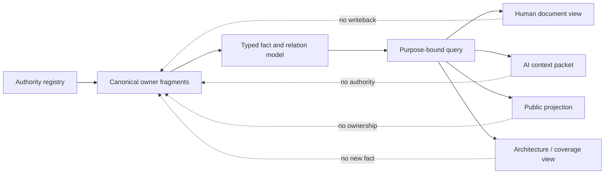
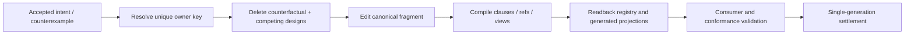

# 文档知识系统

本文拥有 SEC 文档的结构、规范片段、编译投影、读取闭包、质量与迁移规则。文档 identity、lifecycle 与 ownership registry 由 `docs/authority.json` 拥有；产品、架构、领域和运行事实仍由其各自 owner 拥有。本文不能借整理、摘要或生成改变这些事实。

## 1. 目标与不变量

```text
DocumentationSystem =
  CanonicalOwnerFragments
  + StrictAuthorityRegistry
  + TypedReferences
  + PurposeBoundCompiler
  + GeneratedViews
  + MigrationAndRetirement
```

| 不变量 | 可判定表达 | 失败结果 |
| --- | --- | --- |
| 单一事实 | 每个 ownership key 只有一个 active owner fragment | duplicate-owner |
| 身份独立 | document ID 与 owner key 不由 path、标题或目录推断 | identity-unbound |
| 片段完备 | 每个片段声明 owner、边界、输入、输出与不拥有内容 | fragment-unbounded |
| 引用不复制 | 跨文档语义只使用 stable ID/owner key/typed ref | mirrored-truth |
| 视图只读 | 导航、摘要、AI context、public docs均不能反写 owner | projection-authority |
| 未知保留 | query、迁移和摘要必须保留 coverage/frontier/blocker | hidden-frontier |
| 单代切换 | 文档移动或拆分只有一个 active canonical path | dual-canonical-path |
| 可恢复迁移 | registry、文件、引用、生成投影原子读回后才完成 | documentation-migration-residue |

## 2. 信息模型：事实与表达分离



canonical form 是 owner 分片中的事实、约束、状态/转换、决策与 typed relations，不是一棵目录树或一份总图。renderer按关系选择最合适的表达：

| 语义 | 首选表达 |
| --- | --- |
| owner、layer、lifecycle、kind 对照 | matrix/table |
| dependency、causality、provenance | DAG 或 typed hypergraph |
| state、failure、recovery | state machine |
| operation order、concurrency | sequence/partial order/swimlane |
| resource subdivision/conservation | ledger/allocation tree |
| hierarchy/zoom/navigation | tree 或 nested compound view |
| constraint、eligibility、unknown refinement | decision table/lattice |
| rationale、候选与反转 | decision record |

嵌套只适合 hierarchy/zoom renderer；它不能替代多归属关系、并发偏序、资源守恒或证据支持，更不能成为系统本体。

## 3. 文档种类与唯一职责

| Kind | Authored / generated | 能拥有 | 不能拥有 |
| --- | --- | --- | --- |
| registry | authored strict data | document identity/lifecycle/ownership | domain semantics、current result |
| authority | authored normative fragment | 一个或多个不重叠 owner keys | runtime observation、第二 owner |
| corpus-contract | authored normative corpus rule | 其注册的 corpus contract | domain fact之外的扩权 |
| control | machine/owner updated active state | exact current control key | stable principle、历史解释 |
| machine-ledger | append/CAS machine state | provider/runtime state key | stable architecture |
| proposal | authored hypothesis/decision candidate | 无 canonical facts | active authority、兼容壳 |
| navigation | generated | 无 | 事实、裁决、状态 |
| agent-projection | generated/bounded | 无 | scope、Effect、Truth |
| public projection | generated | 无 | canonical owner、私有状态 |

Evidence、测试输出、临时审计报告和聊天不是稳定文档种类；它们进入各自 artifact/runtime owner，或在结算后退役。

## 4. Owner package 与规范片段

一个 domain 可以有多个 authority fragment，但每个 ownership key 只有一个 fragment。package 是 registry query，不是额外 manifest、barrel 或空 index：

```text
OwnerPackage(domain) =
  sortByDocumentId(
    registry.documents where kind=authority and domain=domain
  )

OwnerClosure(keys) =
  exact fragments owning keys
  + referenced upstream fragments required by typed clauses
```

### 4.1 Root fragment

`docs/<owner>.md` 是该 owner 的稳定公共合同面，必须实际拥有并完整定义：

- purpose、边界与不拥有内容；
- 最小公共词汇/不变量；
- 片段关系和读取入口；
- domain completion predicate。

root fragment 不是目录清单、兼容跳转或 re-export。若删掉 root 内容仍不影响任何语义，则 root 不应存在。

### 4.2 Topic fragment

只有同时满足以下条件才创建 `docs/<owner>/<topic>.md`：

```text
FragmentRequired(topic) =
  distinctOwnershipKey(topic)
  and independentlyReadable(topic)
  and independentlyChangeableOrInvalidatable(topic)
  and cohesiveWithinItsBoundary(topic)
  and lowerLifecycleCostThanRootCoLocation(topic)
```

片段必须拥有独立 key；不得仅因行数、标题数、作者或目录美观拆分。若两个片段总是同 owner、同读者、同变更、同 lifecycle 且没有独立 consumer，则合并。

## 5. 物理布局

```text
docs/
  authority.json                 # 唯一 registry
  README.md                      # 生成导航
  <owner>.md                     # 有语义的 root fragment
  <owner>/<topic>.md             # 仅在 FragmentRequired 成立时
  governance/<machine-ledger>    # active durable machine state
  work/<control>                 # current control state/projection
  work-packages/<frozen-package> # exact historical/active package
  proposals/<candidate>          # 非 canonical proposal
  archive/<retired-record>       # 明确 retention 的退役记录
```

目录不编码 layer、priority、truth、maturity 或 dependency；这些维度由 registry/typed relations表达。禁止新增 `foundations/`、`domains/`、`misc/`、`shared/` 等需要猜测归属的分类层，也禁止每个目录创建空 `README`/`index`。

path 只承担 address 与 human discoverability。源码、测试和控制面引用 stable document ID/owner key；Markdown link renderer再从 registry解析path。当前仍直接引用path的consumer属于迁移债务，不能阻止 owner fragment 的语义设计，也不能成为第二 path registry。

### 5.1 Metadata single writer

文档 identity/path/kind/domain/lifecycle/ownership/dependency 只由`docs/authority.json`写入；Markdown frontmatter中的status/domain和`docs/README.md`是生成投影，不是第二authoring surface。最终authoring入口必须是一个transactional documentation operation：

```text
planDocumentChange(documentId, contentDelta, optionalAddressDelta)
  -> validate owner/fragment decision
  -> update registry once
  -> generate/verify frontmatter and navigation
  -> rewrite typed links from registry relation graph
  -> compile clauses/consumer impact
  -> atomic publish + exact readback
```

在该operation完全接管前，doctor必须拒绝registry/frontmatter/index/link漂移；不得再增加手工同步脚本、路径常量列表或第二registry。长registry是machine data，不靠拆成多份手写manifest解决；若实测单写热点成本高于原子一致性收益，候选是content-addressed owner fragments + deterministic aggregate compiler，反转前提必须包括完整tracked-corpus discovery与等价duplicate-owner/cycle/readback证明。

## 6. Read compiler

```text
DocumentationReadRequest = {
  purpose,
  subjectRefs,
  authorityRefsOrOwnerKeys,
  exactRegistryRevision,
  exactDocumentRevisions,
  disclosureAndByteBudget
}

compileRead(request):
  resolve owner keys through the registry
  close only typed upstream references required by purpose
  reject unknown, cycle, duplicate owner, stale revision, unregistered path
  select exact clauses rather than whole files when possible
  preserve blockers, unknown frontier and omitted-applicable proof
  render the selected model for human, AI or machine consumer
  emit source refs, selection digest and coverage
```

最小读取与全量审计共享同一事实和query semantics。全量模式只是扩大授权subject/purpose/coverage，不切换到第二 crawler、第二 regex graph 或第二事实源。

## 7. Write compiler



任何规范修改必须：

1. 先定位 owner key；无 key 时证明新 identity，不把新章节塞进最近的大文档。
2. 删除被新事实支配的旧句、旧图和旧路径；禁止只追加“另一个说明”。
3. 更新所有 typed references 与受影响 generated views。
4. 对 changed owner 重新编译 clause/consumer/impact closure。
5. 以 exact diff/readback 证明没有双 owner、悬空引用、隐藏 blocker 或未登记文档。

## 8. 信息密度与表达选择

规范语句必须可还原为以下合同；缺少任一必要项时只能作为非规范解释，不能产生Requirement、Authority、Claim或拒绝结论：

```text
NormativeClause = {
  clauseId,
  subjectRef,
  quantifierAndUniverse,
  precondition,
  modality: require | forbid | permit | derive,
  predicate,
  observableOrRejection,
  sourceRefs,
  reversalCondition
}
```

| 表述 | 精确化要求 | 不满足时 |
| --- | --- | --- |
| 每个/所有/任意 | 指定有限集合、registry query或开放世界frontier | quantifier-unbound |
| 完整/完备 | 指定coverage universe、已覆盖集合与unknown frontier | coverage-unbound |
| 最小/最优/更好 | 指定候选集、hard constraints、目标函数、Pareto或全序规则 | objective-unbound |
| 可能/可选/按需 | 指定使分支成立的typed predicate与决策owner | branch-unbound |
| 未来会用 | 建立FutureObligation的trigger、consumer class、invariant与retirement | speculative-claim |
| 该/它/这些 | 在同一clause内可唯一解析到subjectRef | reference-ambiguous |
| 相关/适当/合理/等等/视情况 | 必须改写成闭集、谓词或typed unknown | prose-uncomputable |

例：`读取必要文档`不构成规范；`DocumentationReadRequest.authorityRefs经registry解析出的OwnerClosure，必须在byteBudget与exact revisions内全部读取；未闭合返回owner-closure-incomplete`才构成规范。

每项原则可以有多种精确表达，但不是重复散文：

```text
PrincipleViewSet = {
  normative sentence,
  formal predicate,
  role/boundary matrix,
  state/flow visualization when relationally useful,
  machine rejection,
  counterexample and reversal condition
}
```

这些表达引用同一个 principle ID。任何新增段落必须至少增加一个新的可判定关系、边界、状态、失败、算法、反转条件或读者决策；只改写语气、重复历史、记录对话过程或解释显然错误的旧做法时删除。

图只在关系、时序、状态、层级或多方交互比文本更清楚时使用；字段合同用表/ADT，算法用伪代码，取舍用决策矩阵，边界用 owner matrix。图、表、伪代码和 prose不能分别拥有不同事实。

## 9. 拆分、合并与迁移事务

```text
DocumentationMigration = {
  exactSourceIdsAndRevisions,
  targetFragmentsAndOwnershipKeys,
  factPreservationMap,
  linkAndConsumerRewritePlan,
  generatedViewPlan,
  removalSet,
  conformanceAndReadback,
  rollbackOrTypedResidue
}
```

迁移顺序：验证source → 写target fragments → 更新registry → 重写typed refs/links → 编译generated views → 验证owner/consumer/links/clauses → 删除source中已迁事实 → exact readback。任一步失败都不能留下两个active canonical facts；无法原子完成时保留旧generation并把新generation隔离为proposal/residue。

禁止：空root、永久redirect、dual canonical paths、复制段落、按标题机械切割、靠Git历史作为唯一迁移图、只修链接不验证consumer。

## 10. 对抗矩阵

| Attack | 必须被拒绝 |
| --- | --- |
| 用户提出一种新结构后立即全局采用 | representation decision缺少竞争候选/适用边界/反转条件 |
| 大文档按固定行数拆分 | 片段无独立 owner key/reader/change/lifecycle |
| 一个事实为多个读者复制 | duplicate owner 或 mirrored-truth |
| root只列子文件 | root无独立语义与consumer |
| 文档移动后保留旧alias | dual canonical path/consumer未清零 |
| AI摘要隐藏unknown/blocker | view fidelity失败 |
| 全仓任务预读全部文档 | purpose-bound least closure失败 |
| 只靠路径决定owner | identity-unbound |
| 生成文档反向修改source | projection-authority |
| 稳定文档写当前PASS/PR/SHA | lifecycle/kind mismatch |
| proposal以未来价值进入active contract | activation evidence不足 |
| 删除无当前consumer但有已接受future obligation | obligation disposition缺失 |

## 11. 完成条件

```text
DocumentationClosed =
  registry strict and acyclic
  and every canonical fact has exactly one owner key
  and every stable fragment is registered and independently bounded
  and every projection identifies its source and cannot own facts
  and all references resolve by stable identity
  and generated navigation is byte-current
  and no superseded path or duplicated prose remains active
  and read queries preserve coverage/blocker/unknown
  and migration/readback tests pass on the exact document generation
```
