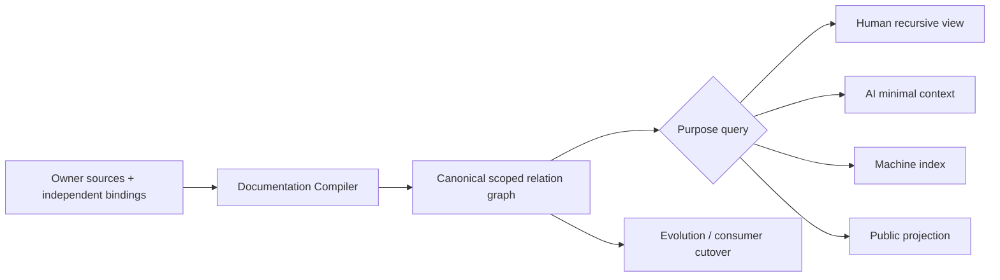

# 文档知识系统

本文是 SEC 文档设计入口，只拥有 documentation structure 的根合同。现行 identity/lifecycle/ownership registry仍由 `docs/authority.json` 拥有；被记录的 Product、Domain、runtime 与 Evidence事实仍由各自 owner拥有。本文不能借整理、摘要、索引或生成改变它们。

目标 knowledge system 的独立变更轴分为四个 owner：

- [Source, Scope and Authority](documentation-system/source-and-authority.md)：source role、独立bindings、clause adoption、recursive scope 与 authored relations；
- [Reference and Identity](documentation-system/reference-and-identity.md)：Document/Clause/Scope semantic identity、Address/heading/fragment 分离、canonical/public reference 与 projection locality；
- [Compilation and Views](documentation-system/compilation-and-views.md)：exact corpus、semantic compiler、purpose closure、read/write、incremental与projection；
- [Evolution and Conformance](documentation-system/evolution-and-conformance.md)：preservation、consumer、frontier、migration、recovery与completion。

通用 relation、Domain、Operation、Resource、Derivation、Evidence 与 Compatibility只引用 Design Calculus/System Architecture/Change Management 的 owner，不在 documentation 领域复制。

## 1. 目标

文档知识系统把 owner-authored meaning 与 structured domain sources编译为 immutable semantic shards / scoped relation graph，再按 purpose生成 human、AI、CLI、public 与 machine 的无增权视图。



Canonical meaning不等于 Markdown、目录或 registry；Source 是 authoring carrier，graph/shards 是 normalized compile result，path/heading/index/README/图/摘要是 Address/Projection。

## 2. 核心不变量

| invariant | exact meaning | failure |
| --- | --- | --- |
| one meaning owner | 每个 ownership key / normative relation恰一个 active owner source | duplicate-owner |
| no self-authorization | source/header/path/status/compiler不能签发自身role/scope/lifecycle/disclosure/authority | source-self-authorized |
| recursive coherence | semantic containment single-parent acyclic；其他关系不伪装目录 | scope-cycle/multi-parent |
| exact corpus | baseline/candidate/add/delete/rename/untracked/opaque/external均有census/frontier | corpus-incomplete |
| strict source role | 每个source只属于封闭role variant并由对应frontend解析 | source-role-ambiguous |
| identity/address split | Document/Clause/Scope ref不由path/heading/fragment产生 | path-derived-identity |
| reference integrity | canonical ref解析identity；rendered Markdown还验证exact fragment address | fragment-reference-drift |
| purpose completeness | reader获得最小但完整relation closure；budget不改变selection | purpose-closure-incomplete |
| projection fidelity | view保留meaning/blocker/unknown/disclosure；不写回source | projection-diverged |
| local invalidation | 新信息只失效 actual reverse-reachable semantic/projection closure | global-generation-contamination |
| one active generation | target在publication/readback前无authority；old在consumer-zero前不删 | dual-active-generation |
| total evolution | current facts/relations/bindings/consumers/future obligations各映射一次 | preservation-gap |
| bounded open world | 无法观察或外部未知保持frontier，不降absent/zero | unknown-collapsed |

## 3. Artifact partition

```text
DocumentationArtifact =
  | KnowledgeSource
  | StructuredDomainSource
  | ControlDeclaration
  | ProposalSource
  | ImmutableExternalRecordLocator
  | GeneratedView
```

| partition | authority ceiling |
| --- | --- |
| knowledge/structured source | 只能提出其 semantic owner 已采用的 meaning |
| control declaration | repository-authored desired control input；不能保存可实时推导 observation |
| proposal | alternatives/frontier/adoption request；零 active authority |
| immutable external locator | 只定位 external owner record；不重新解释 payload |
| generated view | read-only、无增权、可重建 |

Runtime State、Evidence artifacts、cache、migration journals保存在其运行/owner store；文档只持 typed binding/locator/projection。把 live observation 塞进 control Markdown 会天然 stale。

## 4. Recursive knowledge topology

文档 scope投影 System Architecture 的 recursive semantic topology：

```text
CorpusRoot
→ Universal-law / Product universe
→ Domain
→ Responsibility / Operation / Contract scope
→ Owner fragment
```

只有 semantic containment 产生 parent/child；depends/proves/projects/supersedes/migrates/external refs都是 cross-edge。一个 scope root必须声明 boundary、public vocabulary/invariants、children、completion与unknown frontier；空 navigation scope禁止存在。

Target navigation来自同一 canonical graph，不按现行 registry owner-group平铺。Universal laws 与 SEC Product 是正交 strata；Product Domain partition由 Product owner决定，System Architecture生成 DomainBoundaryProof；Documentation只投影。

## 5. Address 只是 realization

Target source corpus不按 authority group、品牌、proof/provider/consumer/version 等关系轴建立目录。Address compiler只投影定位所需的最短 single-parent semantic ancestry；复杂关系保留在 index。

SEC self-hosting target profile仍可选择：

```text
docs/
├── laws/...
├── sec/...
└── proposals/...
```

但这些路径是 placement profile，不是 DocumentRef/ClauseRef。move/reparent/title/localization不改变 meaning；具体规则由 Reference and Identity owner管理。

## 6. 信息密度与 purpose reading

```text
KnowledgeClosure = compile(rootRefs, purpose, exact semantic shards)
View = render(KnowledgeClosure, audience, disclosure, presentation contract)
```

根文档只保留 boundary、核心 invariants、child refs、completion 与高频总图；独立变化的 algorithm/state/migration进入 child owner。折叠 subgraph必须保留 identity、boundary、status、blocker/unknown digest与 expansion handle。

Presentation budget只决定 optional detail能否展开，不能改变 required closure。全局 DocumentationGeneration默认只属于 publication lineage；局部 view key只绑定实际 purpose closure/address/renderer inputs。

## 7. Current → Target migration

现行 generation仍由 `docs/authority.json`、现有 frontmatter/parser/path拥有。Target migration顺序：

1. current `domain/projects` 只作为 owner-group/navigation observation，不解释成 semantic Domain；
2. source definition、scope、lifecycle、disclosure、authority 拆为 owner-issued bindings；
3. normative/external referenced clauses获得 stable ClauseRef，heading/path降为 Address；
4. 编译 recursive scope / typed relation shards / purpose closures；
5. public/repository views消费 canonical refs而非手抄 owner/path truth；
6. 以 total preservation relation迁 current meaning/consumers；
7. target publication/readback后切唯一 active generation；
8. old parser/path/registry role consumer-zero后退役，不保留双 route。

Target文本不提前声称 physical migration完成；未闭合项保持 typed frontier。

## 8. 完成判据

```text
DocumentationSystemClosed =
  source admission closed
  and reference/identity/address closure valid
  and recursive scope/relation graph valid
  and every admitted purpose closure complete
  and projections preserve meaning/disclosure/blockers/unknowns
  and unrelated changes preserve unaffected identities/ActionKeys
  and clean/incremental compilation equivalent for same exact closure
  and target preservation/consumer transition total
  and one active generation with independent readback
  and every unknown/residue has owner + closure predicate
```

任一 child closure 未闭合时，根文档、registry 或 green docs check不能替它签发“Documentation完成”。

<!-- sec-clause {"id":"documentation-system-root","blocker":null,"kind":"stable-decision"} -->
## 规范片段

SEC Documentation由Source/Scope/Authority、Reference/Identity、Compilation/Views、Evolution/Conformance四个独立owner组成。Semantic identity与path/heading分离，public/Markdown references必须解析identity+fragment，局部projection只绑定实际purpose closure；新增信息只反向失效真正消费者，runtime/Evidence/control observation不得在文档层形成第二truth。
