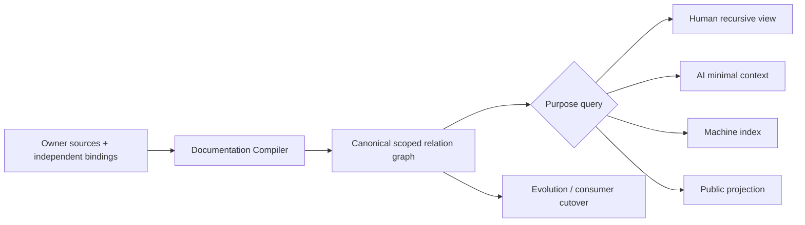
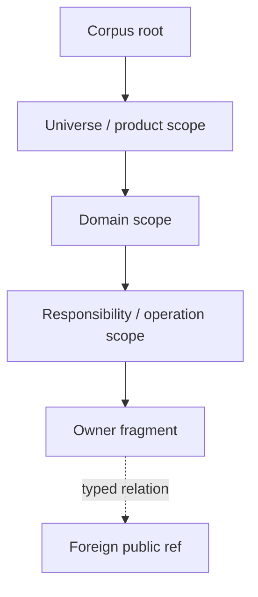
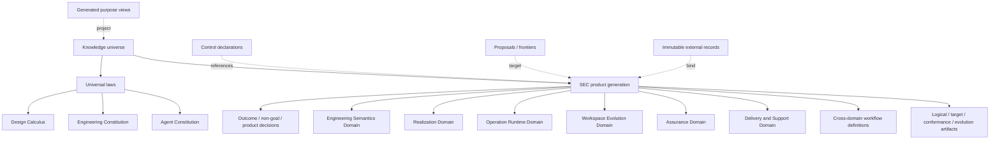
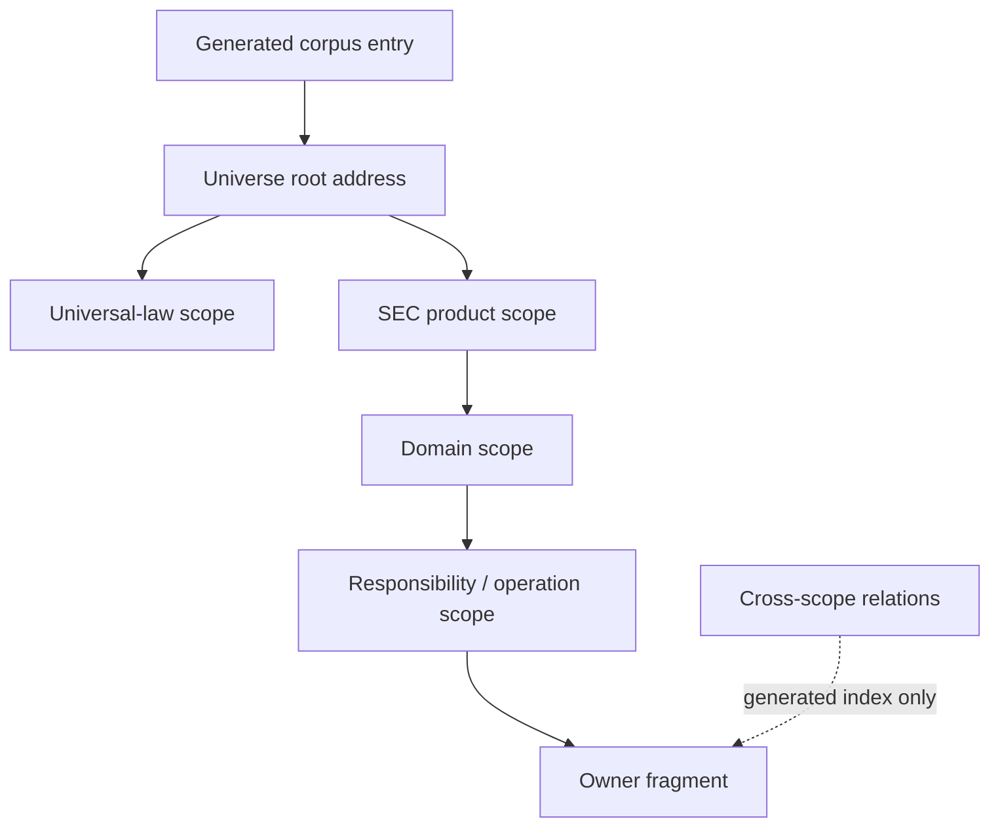

# 文档知识系统

本文是 SEC 文档设计入口，只拥有 documentation structure 的根合同。现行identity/lifecycle/ownership registry仍由 `docs/authority.json` 拥有；被记录的Product、Domain、runtime与Evidence事实仍由各自owner拥有。本文不能借整理、摘要、索引或生成改变它们。

目标generation的细节分为三个独立片段：

- [Source, Scope and Authority](documentation-system/source-and-authority.md)：source role、独立bindings、clause adoption、recursive scope与authored relations；
- [Compilation and Views](documentation-system/compilation-and-views.md)：exact corpus、compiler、purpose closure、address、read/write、incremental与projection；
- [Evolution and Conformance](documentation-system/evolution-and-conformance.md)：preservation、consumer、frontier、migration、recovery与completion。

通用关系、Domain、Operation、资源、Evidence与Compatibility只引用 [Design Calculus](design-calculus.md)、[System Architecture](system-architecture.md) 和 [Change Management](change-management.md)，不在documentation领域复制。

## 1. 目标

文档知识系统把owner-authored meaning和structured domain sources编译为一个可递归查询的immutable knowledge generation，再生成面向human、AI、CLI、public与machine consumer的无增权视图。



Canonical meaning不等于Markdown、目录或registry。Source是可审阅authoring carrier；graph是normalized compile result；path/index/README/图/摘要是address或projection。

## 2. 核心不变量

| invariant | exact meaning | failure |
| --- | --- | --- |
| one meaning owner | 每个ownership key与normative relation只有一个active owner source | duplicate-owner |
| no self-authorization | source/header/path/status/compiler不能签发自身role/scope/lifecycle/disclosure/authority | source-self-authorized |
| recursive coherence | semantic containment为single-parent acyclic scope；其他关系不伪装成目录 | scope-cycle/multi-parent |
| exact corpus | baseline/candidate/add/delete/rename/untracked/opaque/external均有census或frontier | corpus-incomplete |
| strict source role | 每个source只属于封闭role variant并由对应frontend解析 | source-role-ambiguous |
| purpose completeness | reader获得最小但完整的relation closure；budget不改变selection | purpose-closure-incomplete |
| projection fidelity | view保留meaning、blocker、unknown与disclosure，不写回source | projection-diverged |
| semantic identity | Document/Clause/Scope identity不含path；move不改meaning | path-derived-identity |
| local change | 只重编reverse-reachablesources/closures/views/consumers | corpus-global-rebuild |
| one active generation | target在publication/readback前无authority；old在consumer-zero前不删 | dual-active-generation |
| total evolution | current facts/relations/bindings/consumers/future obligations各映射一次 | preservation-gap |
| bounded open world | 无法观察或外部未知保持frontier，不降为absent/zero | unknown-collapsed |

## 3. Artifact partition

目标系统只允许以下artifact families；family是lifecycle/authority角色，不是业务Domain：

| partition | canonical members | authority ceiling |
| --- | --- | --- |
| `knowledge-source` | KnowledgeSource、StructuredDomainSource | 只能提出其owner已采用的meaning |
| `control` | repository-authored desired ControlDeclaration | 不能保存observed runtime/session state |
| `proposal` | alternatives、frontier、adoption request | 无active authority |
| `immutable-record` | external owner的record locator/manifest | 不重新解释payload |
| `generated-view` | index、navigation、public/AI/machine projection | read-only、无增权、可重建 |

Runtime State、Evidence artifacts、cache和migration journals保存在各自runtime/owner store；文档只保留typed binding或generated projection。把它们塞进Markdown或stable design会形成第二状态源。

## 4. Recursive knowledge topology

文档scope必须投影系统的 [recursive semantic topology](system-architecture/scope-and-domain-topology.md)：



只有semantic containment产生parent/child；depends、proves、projects、supersedes、migrates与external reference保持cross-edge。一个scope的root contract必须声明purpose、boundary、public vocabulary/invariants、children与completion；只有index标题的空scope禁止存在。

SEC target semantic navigation由同一图投影，不按现行registry group平铺：



图中的六个Domain来自Product owner的accepted partition input，并由System Architecture生成boundary proofs；不是文档系统手写的第二DomainMap。law、compiler/artifact、workflow、control、proposal、external record和view各有不同source role，不得因显示为sibling就取得相同semantic status。

物理路径由address compiler生成，不要求与每种关系一一镜像。常用scope可有短稳定address；复杂关系留在index，不把所有维度编码进长目录名。

### 4.1 物理层次只是递归scope的最小地址投影

目标source corpus不按authority group、技术主题或关系种类平铺。Address compiler只投影定位所需的最短single-parent scope chain：

```text
AuthoredFragmentAddress = place(
  sourceCorpusRef,
  minimal semantic scope ancestry needed for collision-free navigation,
  stable fragment address token,
  repository/platform placement profile
)
```



只有真实semantic parent在物理路径中形成递归层次；proof、dependency、workflow、provider、consumer、evolution和projection保持graph edge，不各建一套文件夹。跨Domain fragment放在其meaning owner下，其他scope通过ref消费；不得复制到每个consumer。corpus entry、navigation/index和常用purpose view由compiler生成，不成为authored owner。当前根目录的历史平铺只属于current-generation Address，不是target结构或保留理由。

```text
RootAddressAdmitted(fragment) =
  fragment.semanticParent == corpusRoot
  and fragment is an independently consumed universe/product/law root
```

其余fragment若留在根目录会产生`address-topology-drift`；但修复必须通过total preservation与consumer transition一次迁移，不能逐文件手搬或保留旧路径alias。

### 4.2 SEC self-hosting target address profile

通用Documentation model不规定目录名；SEC self-hosting profile在一个placement decision中集中绑定role root。任何consumer只引用DocumentRef或生成的address index，不复制下表字符串：

| source/output role | canonical physical root | 约束 |
| --- | --- | --- |
| active knowledge source | `docs/` | 仅accepted laws、SEC product/domain/workflow/design knowledge；按recursive semantic scope寻址 |
| proposal source | `docs/proposals/` | 按target scope与proposal identity寻址；零active authority |
| repository control declaration | `config/control/` | 只保存desired structured control；不伪装stable knowledge或runtime observation |
| immutable runtime/evidence record | repository-external Runtime State owner | repository只保留有业务必要的declaration或typed locator；不把mutable ledger塞进`docs/` |
| generated repository view | `README.md`、`AGENTS.md`、`docs/README.md` | named consumer ports；从exact generation重建，零meaning ownership |
| generated public view | `public-docs/` | disclosure-bound publication output；禁止反写source |

Active knowledge root只有两种第一层semantic ancestry；其余层级递归展开，不预建空目录：

```text
docs/
├── laws/
│   ├── design/...
│   ├── engineering/...
│   └── agent/...
├── sec/
│   ├── product/...
│   ├── domains/<compiled-domain-address>/...
│   ├── workflows/...
│   └── design/<refined-scope-address>/...
└── proposals/<target-scope-address>/...
```

`laws`与`sec`来自source strata中的universal-law/product分界；`domains`只接受DomainBoundaryProof输出；`design`保存逻辑/realization/conformance/evolution artifacts并按其refined scope递归，不成为第七个Product Domain。`source`、`authority`、`provider`、`proof`、`consumer`、`version`和技术品牌都不是目录轴。若一个fragment跨多个scope，它只放在meaning owner的single parent下，其他关系进入generated index。

该profile可在未来由新的PlacementDecision替代，但反转必须证明consumer/address migration、public support window、collision和全生命周期成本；不能由个人偏好或“目录太长”局部改名。

## 5. 信息密度与递归读取

同一canonical graph产生最小和最大视图：

```text
KnowledgeClosure = compile(rootRefs, purpose, exact generation)
View = render(KnowledgeClosure, audience, disclosure, presentation contract)
```

根文档只保留：boundary、核心invariants、child refs、completion和高频总图。独立变化的算法/状态/迁移进入child fragment；重复通用机制改为typed ref；无独立owner/consumer的细节留在同一fragment。

折叠subgraph必须显示identity、boundary、status、blocker/unknown digest与expansion handle。用户或AI不需要读取无关private state、Provider internals、migration history或全量fault table；需要时递归展开同一graph，而不是查第二份手工总结。

表达选择：

| content | form |
| --- | --- |
| typed variants/fields | ADT或table |
| hierarchy/ownership | recursive tree |
| dependency/proof | graph |
| state/recovery | state/sequence diagram |
| algorithm | pseudocode + invariant + complexity |
| tradeoff | decision matrix/Pareto frontier |
| principle | clause + predicate + rejection + reversal；必要时多种精确投影 |

散文只有在增加新关系、理由、边界、反例或反转条件时保留。历史争论、同义重述、地址清单、版本数字和显然错误做法的长篇说明删除。

## 6. 当前与目标

现行generation仍由`docs/authority.json`、现有frontmatter/parser与paths拥有。Target设计：

1. 把当前`domain`解释为documentation owner-group observation，而非semantic Domain；
2. 把当前`projects`解释为未分型的navigation/child relation observation；迁移为`ScopeMembership`或明确的`DocumentationRelation`，绝不解释为Product Project；
3. 把source definition、scope、lifecycle、disclosure与authority拆为各自owner-issued bindings；
4. 编译recursive scope/typed relation graph与purpose views；
5. 以total preservation relation迁移current meaning和consumer；
6. target publication/readback后切换唯一active generation；
7. old consumer-zero后退役registry/path/projection，不保留双route。

本文冻结目标逻辑，不宣称物理迁移已经完成。迁移准入与状态见 [Evolution and Conformance](documentation-system/evolution-and-conformance.md)。

## 7. 完成判据

```text
DocumentationSystemClosed =
  source admission closed
  and recursive scope/relation graph valid
  and every admitted purpose closure complete
  and projections fidelity/disclosure valid
  and incremental/clean compilation equivalent
  and target preservation/consumer transition total
  and one active generation with independent readback
  and every unknown/residue has owner and bounded effect
```

这不是“文档写完”的自证。Source、Compiler、Evolution三个child closure必须分别成立；任何一个未闭合时只返回其typed frontier，不能让根文档、registry或green docs check替它签发完成。

<!-- sec-clause {"blocker":null,"kind":"stable-decision"} -->
## 规范片段

SEC文档是一个由独立owner bindings准入、按recursive semantic scope组织、以typed relations连接、由purpose compiler裁剪并以single-generation migration演进的knowledge system。Domain facts、runtime state、Evidence、path与projection均不得在文档层取得第二ownership。
