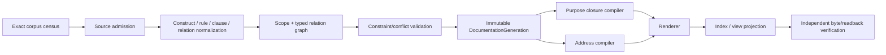

# 文档编译、查询与视图

本文拥有 documentation corpus discovery、semantic compilation、purpose-bound closure、addressing、read/write projection、incremental identity与表达选择。Source/Authority定义由 [Source, Scope and Authority](source-and-authority.md) 拥有；通用资源、Effect和恢复由系统架构拥有；迁移只在 [Evolution and Conformance](evolution-and-conformance.md)。

## 1. Semantic generation 与 projection input 分离

```text
DocumentationSemanticCompilationInput = exact {
  corpusSnapshotRef,
  activeSourceContractGenerationRef,
  sourceDefinitionBindingSetRef,
  scopeMembershipBindingSetRef,
  lifecycleBindingSetRef,
  disclosureBindingSetRef,
  authorityBindingSetRef,
  frontend/parser/normalizer/compiler contract revision refs,
  accepted external corpus binding refs,
  exact applicable constraint refs
}

DocumentationProjectionCompilationInput = exact {
  documentationGenerationRef,
  purpose/query contract ref,
  consumer/principal/disclosure binding refs,
  target placement/address profile ref,
  renderer contract revision ref,
  presentation contract ref
}
```

`corpusSnapshot`必须覆盖baseline、candidate additions/deletions/renames、untracked frontier、opaque/binary与external locators；不能只看已存在文件、Git diff文本或registry行。每种source kind必须有唯一frontend；解析失败、未知source、未登记bytes和超预算均保留typed frontier。

Semantic input不包含purpose、renderer、path placement或runtime allocation；projection input不能重新解析source、改变admission或写回semantic graph。真正执行compiler/renderer时，通用`AdmittedExecution`再把上述pure inputs绑定到Capability与OperationResourceLedger；资源不足只改变execution result，不改变待编译truth或closure selection。

```text
CorpusCoverage =
  exact census
  + interpreted source set
  + typed opaque set
  + missing/deleted set
  + external validity set
  + bounded unknown frontier
```

## 2. Compiler pipeline



每个阶段只接受前一阶段的immutable result；任何 side read 必须作为显式 input relation加入 ActionKey，否则当前result不可复用和freeze。每个named formal declaration必须归一为一个`ConstructDefinitionNode`或`RuleDefinitionNode`，并通过named-construct admission或rule contract；同名唯一并不足以证明角色正确。

```text
DocumentationGeneration = exact {
  corpusSnapshotDigest,
  sourceContractGenerationDigest,
  sourceDefinitionBindingsDigest,
  scopeMembershipBindingsDigest,
  lifecycleBindingsDigest,
  disclosureBindingsDigest,
  authorityBindingsDigest,
  sourceAdmissionsDigest,
  formalDefinitionAndRuleGraphDigest,
  normalizedBodyGraphDigest,
  scopeAndRelationGraphDigest,
  frontierDigest,
  compilerAndFrontendRevisionRefs,
  generationDigest
}
```

Generation不包含purpose query、renderer、address、cache path、process/session、resource allocation、presentation budget或当前working directory。相同semantic input与compiler contract必须产生byte-equivalent canonical graph；projection有自己的input与identity，不能反向改变Generation。

## 3. Constraint 与 conflict

Normative clause被normalization为可判定形式：

```text
ClauseNormalForm = alphaNormalize(
  quantifier + universe + modality + subject refs + precondition
  + predicate + observable/rejection + source refs + reversal
)
```

约束组合必须交换、结合、幂等；输入顺序或并行顺序不得改变结果。等价clause合并为一个owner node；相交冲突返回最小冲突核和provenance；不得按“后写覆盖前写”、文件顺序或措辞相似度裁决。

Embedding、LLM与文本搜索只生成candidate pair；semantic equivalence只由typed refs、normal form、owner adoption或`unknown-equivalence`决定。

## 4. Purpose-bound closure

```text
DocumentationKnowledgeClosure = leastFixedPoint(
  query.rootRefs,
  query.purposeAllowedRelations,
  exact generation,
  accepted disclosure ceiling
)
```

Closure selection独立于token、byte、time和renderer预算。预算只决定能否物化完整结果：

```text
DocumentationReadResult =
  | Ready {
      closureRef,
      projectionRef,
      exact source/generation refs,
      resourceSettlementRef
    }
  | RejectedBeforeAllocation { reason }
  | RejectedAfterAllocation { reason, resourceSettlementRef }
  | Unresolved { closureFrontierRefs, resourceSettlementRef }
```

预算不足时只能复用同一exact closure、返回可继续的unresolved，或拒绝；不得产生较小selection后仍称complete。

### 4.1 递归视图

```text
render(scope, purpose, detailBudget):
  closure := compilePurposeClosure(scope, purpose)
  expand recursively while optional detail fits
  collapse remaining subscopes to
    identity + boundary + completion + blocker/unknown digest + expansion handle
  reject if required meaning cannot fit
```

最小operation context、owner review、human navigation、AI lazy context、public view和authorized whole-corpus audit共享同一closure semantics。折叠不删除必需meaning、cross-edge、unknown或blocker。

## 5. Address 与 reference federation

Semantic identity不含path。Address由目标generation与平台约束编译：

```text
DocumentAddress = place(
  DocumentRef,
  source role/partition,
  semantic scope containment,
  placement profile,
  repository/platform path capability
)
```

Placement必须证明：case-fold/Unicode/reserved-name/same-file-dir/path-length collision-free；新增无关sibling不改变既有address；reparent/move只改变address revision，不改变DocumentRef。

```text
DocumentationLinkIndexEntry = {
  sourceRef,
  relationKind,
  targetRef,
  allowed display metadata,
  address projection for exact generation
}
```

Index只发布identity、relation与address projection，不复制target正文。每个可披露active fragment必须从至少一个admitted purpose/root可达，或有typed `non-navigation` 原因。

## 6. Read 与 Write compiler

Reader先提交纯语义query，不提交路径、presentation budget或allocation：

```text
DocumentationKnowledgeQuery = exact {
  consumer/principal ref,
  purpose ref,
  root Subject/Clause/Scope refs,
  exact or minimum generation constraint,
  disclosure requirement
}

DocumentationPresentationRequest = exact {
  resolved closure ref,
  address generation ref,
  renderer/presentation contract refs,
  optional detail budget
}
```

Query compiler先确定唯一完整closure；随后execution admission才分配资源并物化presentation。`detail budget`只能折叠optional representation，不能删除required meaning、blocker、unknown或cross-edge。

Writer提交intent，不提交目标path、README行、registry row或重复owner metadata：

```text
DocumentationWriteIntent =
  | EditOwnedMeaning
  | CreateMeaning
  | SplitOrMergeFragment
  | CreateOrReparentScope
  | ChangeRelation
  | ChangeDisclosureOrLifecycle
  | RetireMeaning
```

Write compiler先产生 semantic delta、owner/consumer impact、projection/address delta与migration obligations；只有admitted operation才可materialize。每种intent必须保持：

| intent | required proof | reject |
| --- | --- | --- |
| edit | same owner + exact preimage + affected closure | foreign fact、hidden side read |
| create | new identity + nonempty responsibility/consumer or accepted obligation | orphan、duplicate owner |
| split/merge | fact-preservation bijection + owner redistribution + context/cost dominance | 按长度拆、丢fact、双owner |
| reparent | semantic containment proof + relation/read impact | path-derived parent、多父 |
| retire | replacement/consumer/effect/future-obligation closure | unused/name/zero-local-import shortcut |

## 7. Incremental compilation 与性能

```text
DocumentationGraphActionKey = digest(
  exact changed source bytes and relevant baseline refs,
  reverse-reachable source/binding/relation closure,
  source/frontend/parser/normalizer/compiler revisions,
  relevant external observation generations
)

DocumentationProjectionActionKey = digest(
  exact DocumentationGeneration ref,
  purpose/query/disclosure refs,
  address/placement profile ref,
  renderer/presentation contract revisions
)
```

Compiler维护content-addressed source, clause, scope与relation shards；projection compiler维护closure、address与view shards。Semantic Delta只失效reverse-reachable semantic shards及引用它们的projection keys；purpose、renderer或placement变化不能使semantic generation stale。同一对应ActionKey的incremental和clean结果必须byte-equivalent。Cache/schema/producer/key/content无法重验时返回stale/unresolved，不静默长期full-scan。

性能目标是最小化正确变更全生命周期成本：

```text
DocumentationLifecycleCost =
  authoring + discovery + compilation + review + context retrieval
  + consumer rewrite + verification + migration + support + retirement
```

Fragment partition按Pareto比较：

```text
FragmentCost =
  localContextBytes + reverseImpact + concurrentEditContention
  + crossRefResolution + navigation + review + migration cost
```

不存在固定行数阈值。巨型fragment在多owner/高局部读取或高并发成本下必须拆；无独立边界的小fragment在cross-ref成本更高时必须合并。常用slice可物化，但不得成为第二事实源。

## 8. 表达选择

| information | preferred representation |
| --- | --- |
| exact fields / variants | ADT、schema、table |
| hierarchy / ownership | recursive tree |
| dependency / proof / influence | typed graph |
| lifecycle / recovery | state machine / sequence diagram |
| algorithm | pseudocode + invariants + complexity |
| competing design | decision matrix / Pareto vectors |
| normative rule | concise clause + predicate + rejection + reversal |
| explanation/example | typed refs；executable artifact或明确non-normative |

一项原则可以有 sentence、formal predicate、role matrix、diagram、machine rejection、counterexample/reversal 等多种精确投影，但它们必须引用同一 principle/clause ID。只重复语气、历史争论或显然错误旧做法的段落删除。

## 9. Projection fidelity

```text
GeneratedProjection = exact {
  sourceClosureRef,
  purpose/audience/disclosure refs,
  renderer contract ref,
  selected representation refs,
  omitted-detail proof,
  blocker/unknown preservation,
  canonical bytes digest
}
```

CLI、README、图、public docs、AI context和search index只读projection；不能新增、删减或重排会改变meaning的事实。任何图/表出现source graph中不存在的node/edge/state，必须先修改canonical source而不是让renderer拥有新事实。

### 9.1 HTML 与图形阅读投影

HTML、SVG和阅读导航是可删除、可重建的projection，不得成为Markdown、结构化contract、源码或图源之外的第二事实源。完整HTML必须绑定一个exact `DocumentationGeneration`、一个purpose closure、included source/artifact refs、renderer identity/options、presentation contract和disclosure policy；缺少其中任一项都不能用“当前页面能打开”代替完整性。

普通正文变化不应强制安装完整浏览器自动化栈。图形物化分三层：

| mode | input | contract |
| --- | --- | --- |
| cached | 当前source + 与图源精确匹配的validated diagram cache | 日常完整图文构建；旧缓存不得配新图源 |
| browser-assisted | 上述输入 + 用户明确取得的可信离线renderer | 本地刷新图缓存；不得联网下载renderer或执行目标工程 |
| automated | 上述输入 + 明确隔离的browser/renderer capability | CI/无人值守刷新、父级硬超时与完整settlement；重型renderer不是SEC产品运行依赖 |

```text
DiagramProjectionKey = digest(
  exact diagram source bytes,
  diagram language/revision,
  renderer identity + exact version,
  canonical renderer options,
  deterministic seed/id policy,
  security/sanitization contract revision
)
```

文件名、标题或视觉相似不能命中缓存。图源、renderer identity/options或影响布局/语义的输入变化时缓存失效；当前模式不能刷新时，完整构建返回typed failure。只有调用者明确选择source-only视图时，才允许展示图源并显式标记未渲染，不能静默降级后仍称完整新版。

同一冻结输入与同一renderer contract应产生byte-equivalent HTML；使用随机布局的renderer必须固定非零种子和稳定元素identity。文件、导航、锚点、源附件和图顺序使用canonical order，不依赖目录遍历、locale、wall clock或collection insertion order。换浏览器、字体或renderer版本可能形成新的projection identity，不能冒充旧环境的可复现输出。

默认阅读构建与阅读页面离线：不下载外部脚本、字体、图片或图引擎；外部资料只保留链接。Markdown原始HTML、事件属性、脚本和危险URI不得直接取得执行权；SVG嵌入前拒绝活动脚本、外部资源和危险事件；页面用严格CSP限制脚本和网络。渲染器不得执行目标工程、安装依赖或读取未进入closure的本地文件。隔离只证明renderer Effect边界，不证明图语义或正文正确。

输出只在正文、引用、图、source attachments、导航和完整性检查全部成功后原子替换；失败保留上一份已知完整输出。自动模式中的可能挂死renderer必须有外部父级硬期限，页内timer不能替代对同步死循环的进程级终止。

完整阅读版至少检查：included source可达、同generation本地引用可解析、图缓存key与图源一致、SVG/XML结构有效且安全、关键文本/图内容未被裁掉、桌面与窄屏不产生整页横向溢出、超宽表格/代码/图局部滚动、无未声明网络请求或页面错误、重复构建满足声明的确定性合同。视觉检查只证明projection质量，不替代source meaning验证。

当图能够从一个结构化表或typed relation graph确定生成时，只维护结构化源并派生图；只有图源自身承载其他源无法确定的设计决定时，它才是对应meaning owner。MD、HTML、SVG不得分别维护同一事实。

## 10. Compiler completion

```text
DocumentationCompilationClosed =
  corpus coverage exact or every gap typed opaque/unknown
  and every source has one admitted role and binding set
  and every normative construct/rule/schema/diagram resolves to exactly one typed body node
  and scope forest acyclic/single-parent
  and authored/derived relations are disjoint and valid
  and constraint conflicts are empty or explicit frontier
  and semantic incremental output equals clean output for the same DocumentationGraphActionKey
  and every required purpose has a complete closure contract
  and all required addresses are collision-free under target profile
  and all required projections preserve meaning/disclosure/blockers/unknowns
  and HTML/diagram projections use exact source-bound caches or explicit renderer admission, never silent stale/degraded output
  and projection incremental output equals clean output for the same DocumentationProjectionActionKey
```

此结果只证明一个immutable documentation target generation；不签发migration、publication或consumer cutover authority。

<!-- sec-clause {"blocker":null,"kind":"stable-decision"} -->
## 规范片段

Documentation Compiler从exact corpus与独立source bindings生成一个递归typed knowledge generation；所有reader按purpose取得同一graph的最小完整closure，所有writer提交semantic intent，path/index/view仅由compiler生成。预算、cache、presentation和工具不得改变selection或truth。
