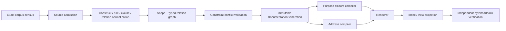

# 文档编译、查询与视图

本文拥有 documentation corpus discovery、semantic compilation、purpose-bound closure、read/write projection、incremental compilation与表达选择。Source/Authority定义由 [Source, Scope and Authority](source-and-authority.md) 拥有；Document/Clause identity、Address/reference federation与fragment validity由 [Reference and Identity](reference-and-identity.md) 拥有；通用 derivation locality由 [System Derivation Locality](../system-architecture/derivation-locality.md) 拥有；成本向量与Pareto由 [Constraint and Decision](../design-calculus/constraints-and-decision.md) 拥有；迁移只在 [Evolution and Conformance](evolution-and-conformance.md)。

## 1. Semantic generation 与 projection input 分离

```text
DocumentationSemanticCompilationInput = exact {
  corpusSnapshotRef,
  activeSourceContractGenerationRef,
  sourceDefinitionBindingSetRef,
  scopeMembershipBindingSetRef,
  lifecycleBindingSetRef,
  disclosureBindingSetRef,
  authorityBindingSetRef,
  frontend/parser/normalizer/compiler contract revision refs,
  accepted external corpus binding refs,
  exact applicable constraint refs
}

DocumentationProjectionCompilationInput = exact {
  purposeClosureRef,
  exact source/clause/scope refs reachable by that closure,
  consumer/principal/disclosure binding refs,
  exact address refs actually rendered,
  renderer contract revision ref,
  presentation contract ref,
  sourceDocumentationGenerationRefs as lineage only
}
```

`corpusSnapshot`必须覆盖baseline、candidate additions/deletions/renames、untracked frontier、opaque/binary与external locators；不能只看已存在文件、Git diff文本或registry行。每种source kind必须有唯一frontend；解析失败、未知source、未登记bytes和超预算均保留typed frontier。

Semantic input不包含purpose、renderer、path placement或runtime allocation；projection input不能重新解析source、改变admission或写回semantic graph。真正执行compiler/renderer时，通用`AdmittedExecution`再把上述pure inputs绑定到Capability与OperationResourceLedger；资源不足只改变execution result，不改变待编译truth或closure selection。

```text
CorpusCoverage =
  exact census
  + interpreted source set
  + typed opaque set
  + missing/deleted set
  + external validity set
  + bounded unknown frontier
```

## 2. Compiler pipeline



每个阶段只接受前一阶段的immutable result；任何 side read 必须作为显式 input relation加入该阶段的 actual input closure，否则当前result不可复用和freeze。每个named formal declaration必须归一为一个`ConstructDefinitionNode`或`RuleDefinitionNode`，并通过named-construct admission或rule contract；同名唯一并不足以证明角色正确。

```text
DocumentationGeneration = exact {
  corpusSnapshotDigest,
  sourceContractGenerationDigest,
  sourceDefinitionBindingsDigest,
  scopeMembershipBindingsDigest,
  lifecycleBindingsDigest,
  disclosureBindingsDigest,
  authorityBindingsDigest,
  sourceAdmissionsDigest,
  formalDefinitionAndRuleGraphDigest,
  normalizedBodyGraphDigest,
  scopeAndRelationGraphDigest,
  frontierDigest,
  compilerAndFrontendRevisionRefs,
  generationDigest
}
```

Generation不包含purpose query、renderer、address、cache path、process/session、resource allocation、presentation budget或当前working directory。相同semantic input与compiler contract必须产生byte-equivalent canonical graph；projection有自己的局部input closure与identity，不能反向改变Generation。

## 3. Constraint 与 conflict

Normative clause先normalization为typed proposition/rule form；只有可 lower 到 [Design Constraint](../design-calculus/constraints-and-decision.md) 的 bounded predicate才直接机器判定。Temporal/statistical/robustness/relational性质必须生成对应 proof obligation/frontier，不能把“规范句”自动升级为 decidable。

```text
ClauseNormalForm = alphaNormalize(
  quantifier + universe + modality + subject refs + precondition
  + predicate/proof-obligation kind + observable/rejection + source refs + reversal
)
```

可判定约束组合必须交换、结合、幂等；输入顺序或并行顺序不得改变结果。等价clause合并为一个owner node；相交冲突返回最小冲突核和provenance；不得按“后写覆盖前写”、文件顺序或措辞相似度裁决。

Embedding、LLM与文本搜索只生成candidate pair；semantic equivalence只由typed refs、normal form、owner adoption或`unknown-equivalence`决定。

## 4. Purpose-bound closure

```text
DocumentationKnowledgeClosure = leastFixedPoint(
  query.rootRefs,
  query.purposeAllowedRelations,
  exact semantic shards/relations reachable from those roots,
  accepted disclosure ceiling
)
```

Closure selection独立于token、byte、time和renderer预算。预算只决定能否物化完整结果：

```text
DocumentationReadResult =
  | Ready {
      closureRef,
      projectionRef,
      exact source/generation lineage refs,
      resourceSettlementRef
    }
  | RejectedBeforeAllocation { reason }
  | RejectedAfterAllocation { reason, resourceSettlementRef }
  | Unresolved { closureFrontierRefs, resourceSettlementRef }
```

预算不足时只能复用同一exact closure、返回可继续的unresolved，或拒绝；不得产生较小selection后仍称complete。

### 4.1 递归视图

```text
render(scope, purpose, detailBudget):
  closure := compilePurposeClosure(scope, purpose)
  expand recursively while optional detail fits
  collapse remaining subscopes to
    identity + boundary + completion + blocker/unknown digest + expansion handle
  reject if required meaning cannot fit
```

最小operation context、owner review、human navigation、AI lazy context、public view和authorized whole-corpus audit共享同一closure semantics。折叠不删除必需meaning、cross-edge、unknown或blocker。

## 5. Address 与 reference federation

Semantic identity、Address、heading/fragment与reference rules由 [Reference and Identity](reference-and-identity.md) 唯一拥有。本层只消费其结果：

```text
DocumentationLinkIndexEntry = {
  sourceRef,
  relationKind,
  targetRef,
  allowed display metadata,
  address projection for exact generation
}
```

Index只发布identity、relation与address projection，不复制target正文。每个可披露active fragment必须从至少一个admitted purpose/root可达，或有typed `non-navigation` 原因。Markdown path/fragment不能反向成为DocumentRef/ClauseRef。

## 6. Read 与 Write compiler

Reader先提交纯语义query，不提交路径、presentation budget或allocation：

```text
DocumentationKnowledgeQuery = exact {
  consumer/principal ref,
  purpose ref,
  root Subject/Clause/Scope refs,
  exact or minimum semantic generation constraint,
  disclosure requirement
}

DocumentationPresentationRequest = exact {
  resolved closure ref,
  address generation ref,
  renderer/presentation contract refs,
  optional detail budget
}
```

Query compiler先确定唯一完整closure；随后execution admission才分配资源并物化presentation。`detail budget`只能折叠optional representation，不能删除required meaning、blocker、unknown或cross-edge。

Writer提交intent，不提交目标path、README行、registry row或重复owner metadata：

```text
DocumentationWriteIntent =
  | EditOwnedMeaning
  | CreateMeaning
  | SplitOrMergeFragment
  | CreateOrReparentScope
  | ChangeRelation
  | ChangeDisclosureOrLifecycle
  | RetireMeaning
```

Write compiler先产生 semantic delta、owner/consumer impact、projection/address delta与migration obligations；只有admitted operation才可materialize。每种intent必须保持：

| intent | required proof | reject |
| --- | --- | --- |
| edit | same owner + exact preimage + affected closure | foreign fact、hidden side read |
| create | new identity + nonempty responsibility/consumer or accepted obligation | orphan、duplicate owner |
| split/merge | fact-preservation/evolution mapping + owner redistribution + context/cost non-dominance | 按长度拆、丢fact、双owner |
| reparent | semantic containment proof + relation/read impact | path-derived parent、多父 |
| retire | replacement/consumer/effect/future-obligation closure | unused/name/zero-local-import shortcut |

## 7. Incremental compilation 与性能

```text
DocumentationGraphActionKey = digest(
  exact changed source bytes and relevant baseline refs,
  reverse-reachable source/binding/relation closure,
  source/frontend/parser/normalizer/compiler revisions,
  relevant external observation generations
)

DocumentationProjectionActionKey = digest(
  exact DocumentationKnowledgeClosure ref,
  exact disclosure refs,
  exact address/fragment refs actually rendered,
  renderer/presentation contract revisions
)
```

`DocumentationGenerationRef`默认只保存在projection receipt的 lineage/provenance中；只有 whole-corpus index/audit 确实观察完整 generation 时才进入其 ActionKey。无关文档新增、修改或删除若不改变当前 purpose closure/address/disclosure，则必须保持 projection ActionKey 与 bytes 不变。

Compiler维护content-addressed source, clause, scope与relation shards；projection compiler维护closure、address与view shards。Semantic Delta只失效reverse-reachable semantic shards及引用它们的projection keys；purpose、renderer或placement变化不能使semantic generation stale。同一对应ActionKey的incremental和clean结果必须byte-equivalent。Cache/schema/producer/key/content无法重验时返回stale/unresolved，不静默长期full-scan。

性能目标是最小化正确变更全生命周期成本。Fragment partition 不再把 bytes、contention、review、migration 等异量纲值直接加成一个假标量，而是声明适用的 `LifecycleCostVector` dimensions：

```text
FragmentationObjective = {
  localContextBytes,
  reverseImpact,
  concurrentEditContention,
  crossReferenceCost,
  navigationCost,
  reviewSurface,
  migrationCost
}
```

先满足 owner/semantic/lifecycle/consumer 硬约束，再按共享 Pareto 语义比较。只有有权 policy 明确提供单位归一化/权重时才 scalarize。不存在固定行数阈值；巨型fragment在多owner/高局部读取或高并发成本下必须拆，无独立边界的小fragment在cross-ref成本支配时合并。

## 8. 表达选择

| information | preferred representation |
| --- | --- |
| exact fields / variants | ADT、schema、table |
| hierarchy / ownership | recursive tree |
| dependency / proof / influence | typed graph |
| lifecycle / recovery | state machine / sequence diagram |
| algorithm | pseudocode + invariants + complexity |
| competing design | decision matrix / Pareto vectors |
| normative rule | concise clause + typed predicate/proof obligation + rejection + reversal |
| explanation/example | typed refs；executable artifact或明确non-normative |

一项原则可以有 sentence、formal predicate、role matrix、diagram、machine rejection、counterexample/reversal 等多种精确投影，但它们必须引用同一 stable principle/clause ID。只重复语气、历史争论或显然错误旧做法的段落删除。

## 9. Projection fidelity

```text
GeneratedProjection = exact {
  sourceClosureRef,
  purpose/audience/disclosure refs,
  renderer contract ref,
  selected representation refs,
  omitted-detail proof,
  blocker/unknown preservation,
  canonical bytes digest
}
```

CLI、README、图、public docs、AI context和search index只读projection；不能新增、删减或重排会改变meaning的事实。任何图/表出现source graph中不存在的node/edge/state，必须先修改canonical source而不是让renderer拥有新事实。

## 10. Compiler completion

```text
DocumentationCompilationClosed =
  corpus coverage exact or every gap typed opaque/unknown
  and every source has one admitted role and binding set
  and every normative construct/rule/schema/diagram resolves to exactly one typed body node
  and scope forest acyclic/single-parent
  and authored/derived relations are disjoint and valid
  and constraint conflicts are empty or explicit frontier
  and semantic incremental output equals clean output for the same DocumentationGraphActionKey
  and every required purpose has a complete closure contract
  and all required addresses/references are valid under the target profile
  and all required projections preserve meaning/disclosure/blockers/unknowns
  and unrelated semantic changes preserve unaffected projection ActionKeys
  and projection incremental output equals clean output for the same DocumentationProjectionActionKey
```

此结果只证明一个immutable documentation target generation；不签发migration、publication或consumer cutover authority。

<!-- sec-clause {"id":"documentation-compilation-locality","blocker":null,"kind":"stable-decision"} -->
## 规范片段

Documentation Compiler从exact corpus与独立source bindings生成typed semantic shards；reader按purpose取得最小完整closure，writer提交semantic intent。Projection ActionKey只绑定实际purpose closure/disclosure/address/renderer inputs，global generation只作lineage；Fragment成本使用共享CostVector/Pareto，path/index/view均不得形成第二truth。
