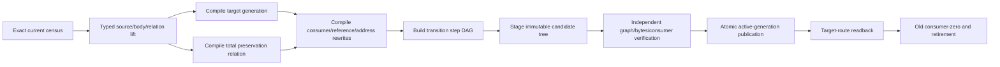
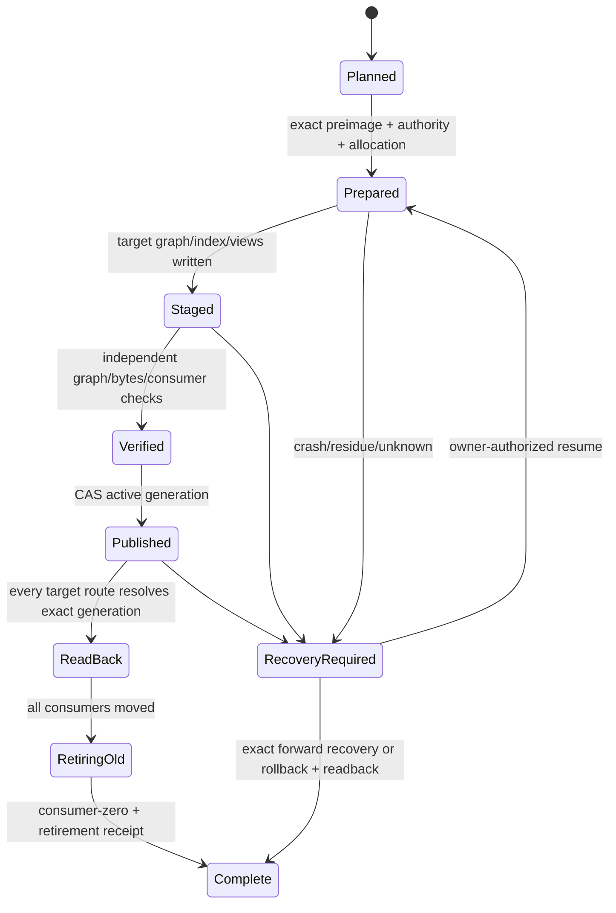

# 文档演进、迁移与 Conformance

本文拥有 documentation generation 的preservation、consumer cutover、frontier、migration specialization与conformance。通用Compatibility/Retirement语义由 [Change Management](../change-management.md) 拥有；Operation/Resource/Recovery由 [System Architecture](../system-architecture.md) 拥有。本文只增加文档图、source binding、address与projection的领域约束。

## 1. Current、target 与 active generation

```text
DocumentationGenerationState =
  | CurrentActive { generationRef }
  | TargetCompiled { currentRef, targetRef, preservationRelationRef }
  | MigrationPrepared { operationRef, exact preimage/target refs }
  | CutoverActive { targetRef, readbackRef, oldConsumerFrontierRef }
  | RecoveryRequired { operationRef, observedResidueRefs }
  | Retired { generationRef, retirementReceiptRef }
```

任一时刻只有一个generation拥有normal read/write authority。Shadow target、staging、migration journal、branch、proposal和generated view都不能成为第二active route。

当前 `docs/authority.json`、现行paths与parsers在target切换前继续拥有current generation。目标设计完成不等于迁移发生。

## 2. Preservation map

Current→target不是文件move表，而是对exact current element universe的total relation。Relation endpoint是非空集合；element可以是meaning、typed relation、source/binding、consumer dependency或future obligation：

```text
DocumentationPreservationEntry =
  | Preserve {
      currentElementRefs,
      targetElementRefs,
      semanticEquivalenceAndCoverageRef
    }
  | Transform {
      currentElementRefs,
      targetElementRefs,
      transformationRef,
      coverageOverlapAndInformationLossRefs,
      readbackObligationRefs
    }
  | Retire {
      currentElementRefs,
      retirementReasonRef,
      consumerZeroEvidenceRef,
      futureObligationDispositionRef
    }
  | Blocked {
      currentElementRefs,
      frontierRefs
    }
```

```text
PreservationTotal =
  union(all currentElementRefs) == exactCurrentElementUniverse
  and pairwiseDisjoint(all currentElementRefs)
  and every targetElementRef has target-generation coverage
  and every split/merge has explicit decomposition/composition proof
  and no overlap or information loss is implicit
```

一个entry可以表达one-to-one、split、merge或many-to-many correspondence；current端仍必须形成严格partition，因此不会因分组而漏项或重复处置。Preservation relation只证明meaning/obligation如何保持或演进，不创建target adoption、AuthorityBinding或active generation。

### 2.1 Preservation compiler

Target generation必须先独立编译；preservation compiler不能为了容易匹配而修改target。唯一允许建立positive correspondence的输入是已有stable semantic identity、owner-adopted lineage/refinement/transformation relation或可独立验证的normal-form equivalence：

```text
compilePreservation(currentGeneration, targetGeneration, adoptedLineage, decisions):
  C := exactCurrentElements(currentGeneration)
  T := exactTargetElements(targetGeneration)
  H := typed candidate hyperedges from identity/lineage/equivalence only
  reject every candidate derived only from path, title, wording, order, similarity or shared owner label
  components := connectedComponents(H)
  for each component in canonical order:
    emit Preserve or Transform only when coverage/overlap/information-loss laws are uniquely satisfied
    emit Retire only when consumer-zero + future-obligation disposition are independently complete
    otherwise emit Blocked with the minimal unresolved relation/decision frontier
  verify PreservationTotal and canonicalize by current element refs
```

无歧义identity/lineage组件线性处理；需要owner取舍的bounded component可以枚举非支配候选，但不得由confidence、embedding score或首个最大匹配暗选。预算耗尽只返回该component的frontier，不使其他disjoint components失效。增量重编只失效changed elements及其lineage/consumer reverse closure；同一exact inputs的clean与incremental relation必须byte-equivalent。

```text
DocumentationConsumerTransition =
  | UnchangedConsumer {
      consumerRef,
      currentDependencyRefs,
      targetDependencyRefs,
      semanticEquivalenceRef,
      targetReadbackRef
    }
  | RewrittenConsumer {
      consumerRef,
      currentDependencyRefs,
      targetDependencyRefs,
      rewriteAndReadbackRefs
    }
  | RetiredConsumer { consumerRef, retirementReceiptRef }
  | UnknownConsumer { consumerOrDiscoveryFrontierRefs }
```

```text
FutureObligationDisposition =
  | PreserveObligation { obligationRef, targetBindingRef }
  | ReviseObligation { oldRef, newRef, ownerDecisionRef }
  | RetireObligation { obligationRef, reason/review evidence }
  | BlockedObligation { obligationRef, frontierRefs }
```

每个current fact、ownership key、scope/lifecycle/disclosure/authority relation、clause、link、control/record binding、consumer dependency与future obligation必须恰好出现一次。没有映射不能被“新结构更好”吞掉。

## 3. Current source lift

现行source kind只决定迁移frontend，不决定target ontology：

| current kind | target candidate | 必须保持 |
| --- | --- | --- |
| `authority` | `KnowledgeSourceEnvelope` + typed `KnowledgeBodyNode` + independently issued `AuthorityBinding` | exact owner keys、accepted meaning、role adoption；不能由kind自证 |
| `registry` | independently issued source/scope/lifecycle/disclosure/authority binding generations + generated index | 每类relation由其owner迁一次；不复制中央registry或让header自报 |
| `control` | ControlDeclaration或Runtime State binding | desired与observed分离；producer/current revision不丢 |
| `machine-ledger` | payload回到Runtime State owner；docs只保留binding/view | bytes/schema/issuer/recovery/consumer readback |
| `proposal` | ProposalSource | candidate/frontier/provenance；零active authority |
| `navigation` / `agent-projection` | GeneratedProjection | exact source closure、meaning/disclosure fidelity |

Current header的`domain`只是owner-group/addressing observation，不能直接生成target Domain或scope。Target role由current ownership、body grammar、typed relations、actual consumers与owner adoption共同决定；不唯一时保留frontier。

## 4. Consumer evidence

Consumer universe来自一个exact multi-frontend observation generation，而不是Markdown link扫描：

| consumer surface | observation |
| --- | --- |
| TypeScript/other source | compiler/LSP declaration、import、dynamic import、literal/path API与call graph |
| config/workflow/package | strict parser后的schema字段与command/resource references |
| documentation | admitted typed relations与generated address index；不以正文grep签发positive closure |
| runtime/public interface | CLI command/schema、public URL/address、loader/parser、artifact reader |
| human/Agent navigation | named generated-view port与purpose query contract |
| external/open world | published protocol/support-window decision或bounded unknown frontier |

```text
LocalConsumerCoverageResult =
  | CompleteLocalCoverage {
      exact source/consumer universe refs,
      scanner/compiler revision,
      coverageDigest
    }
  | UnknownLocalCoverage { frontierRefs }

ConsumerExposureEvidence =
  | RepositoryPrivate { completeLocalCoverageRef }
  | PublishedProtocol {
      protocol/schema/support-window refs,
      consumer classes and compatibility obligations
    }
  | ExternalUnknown { discovery/support frontier refs }
```

Repository import零、全文搜索零或当前测试零都不能单独证明consumer-zero。Published CLI/API/schema/public docs必须由Product/Interface/Change owner决定support window；未知external consumer阻断破坏性retirement，但不自动永久保留旧owner。

```text
DocumentationConsumerZero =
  complete local coverage
  and every known consumer transitioned or retired with readback
  and external exposure is repository-private or support window terminal
  and no accepted future obligation requires the old identity
```

## 5. Frontier 是关系，不是任务清单

```text
DocumentationFrontier = exact {
  code,
  subjectRef,
  closureOwnerRef,
  exactCause | unclassifiedCause,
  sharedClosureProof | subjectIsolated,
  evidenceRefs,
  affectedPurposeRefs
}
```

只有有权owner证明多个subject共享同一closure predicate时才能聚类；否则按subject隔离。Renderer可以压缩展示，不能合并不同cause/owner或改变blocking semantics。

核心codes：

| code | closure owner | 关闭条件 |
| --- | --- | --- |
| `source-semantic-frontier` | semantic/adoption owner | exact-generation adoption或bounded denial |
| `authority-role-adoption-required` | documentation + domain owner | exact target role/owner binding |
| `control-state-separation-required` | control/runtime owner | desired declaration与observed state分离 |
| `unclassified-current-source` | source/payload owner | strict parser或retirement proof |
| `missing-current-source` | source/change owner | authoritative restore或retirement decision |
| `local-consumer-coverage-unknown` | migration owner | complete exact local census |
| `external-consumer-unknown` | product/interface/change owner | exposure/support-window decision |
| `consumer-rewrite-required` | consumer owner | target readback + old ref zero |
| `current-generation-cutover-required` | documentation migration owner | target publication/readback + all intersecting frontiers closed |

Frontier偏序由typed dependencies生成，不维护人工路径/行号列表。关闭一个cluster只关闭同cause、scope和generation的关系。

## 6. Migration admission

```text
DocumentationMigrationDesignReady =
  target DocumentationCompilationClosed
  and exact current element and consumer universes frozen
  and source/header/body/frontend grammars frozen
  and every normative construct/rule/schema/diagram has one typed body node and owner binding
  and scope/relation/address/projection contracts frozen
  and source-definition/scope/lifecycle/disclosure/authority issuer closure frozen
  and preservation relation is a total non-overlapping current partition with target coverage
  and local consumer coverage complete
  and external exposure decisions sufficient for affected paths
  and all changed consumers have target transition designs
  and one ArchitectureTransitionDesign binds every source/address/reference/consumer/publication/retirement step
  and operation resource/effect/recovery design frozen
  and every applicable frontier closed
```

`frozen`只表示同一design generation有有效Design Freeze receipt；不表示代码、测试或migration已存在。迁移设计不等待无关future universe，只要求本次exact affected closure closed。

Documentation不建立第二种MigrationPlan。它专用化 [ArchitectureTransitionDesign](../implementation-architecture/migration-and-conformance.md#3-architecturetransitiondesign)：同一immutable candidate generation同时包含target sources、bindings、generated indexes/views、全部consumer rewrites与允许删除的old addresses。其`transitionStepDagRef`至少闭合以下关系：



逐文件move、先发布source再慢慢修consumer、长期双路径、手写redirect和旧新parser并存都不是合法transition。若external support window要求旧address继续可达，它必须是target generation内由同一meaning生成的bounded projection，并有consumer/expiry/retirement合同；不能保留第二owner。

## 7. Effect 与 recovery specialization

Migration执行必须消费通用 owner-issued Operation、Grant、Binding、Allocation与Settlement合同；本文不复制lock、deadline、process、journal或CAS算法，只增加这些文档领域数据：

```text
DocumentationMigrationOperation = {
  current/target generation refs,
  preservation relation ref,
  exact source and consumer census refs,
  staged graph/index/view manifest refs,
  address and disclosure profile refs,
  publication and old-generation retirement obligations
}
```



每个Effect前后都必须使用同一operation deadline/cancellation/resource ledger与exact physical preimage；cleanup失败保留primary result + typed residue。Lost handle、partial stage、stale CAS、unknown child process和readback失败均进入RecoveryRequired，不能删目录或重跑冒充恢复。

## 8. Conformance model

Conformance从relations、operations与fault families生成properties，不用路径fixture自证：

| family | required property |
| --- | --- |
| census/frontend | every exact source classified or typed opaque; malformed/duplicate/unknown rejected |
| formal meaning | every normative construct/rule/schema/diagram has one typed node; projections introduce none |
| authority | no header/path/projection/self-digest can authorize meaning or mutation |
| scope/relation | single-parent acyclic containment; relation-kind laws; no hidden cross-edge |
| identity/address | move/reparent preserves DocumentRef; collision/Unicode/case/platform bounded |
| projection/disclosure | same meaning/blocker/unknown; no disclosure widening/writeback |
| incrementality | same ActionKey clean/incremental byte equivalence; unrelated change stability |
| preservation | every current fact/relation/consumer/future obligation mapped exactly once |
| migration/recovery | every crash point recoverable; one active generation; old consumer zero before retire |
| scale/resource | bounded nodes/edges/bytes/time/processes; exhaustion returns frontier/residue |
| external/open world | stale/opaque/unseen consumers remain unknown, never absent |

Verifier从exact target/current bytes独立重编，不消费migration executor自报PASS。Synthetic tests可验证algebra；真实cutover claim还需要真实 corpus、consumer、physical Effect与readback Evidence。

## 9. Completion

```text
DocumentationEvolutionClosed =
  target generation compiled and independently verified
  and preservation relation total
  and every affected consumer transition terminal or explicitly blocked
  and publication/recovery protocol closed for every crash point
  and exactly one active normal route
  and old generation consumer-zero before retirement
  and all retained residue has owner, reason, recovery/retirement trigger
  and final source/index/view bytes match the active generation
```

这只定义完成含义，不宣称当前仓库已经迁移。任何未满足项保持typed frontier，不通过兼容alias、双路径、手写redirect、默认parser或删除旧Evidence缩短流程。

<!-- sec-clause {"blocker":null,"kind":"stable-decision"} -->
## 规范片段

Documentation generation 的迁移必须由total preservation relation、exact consumer transition、单active route、通用operation/recovery合同与独立readback共同闭合；当前label/path不决定target role，未知consumer或source不得降为zero，旧generation只在consumer-zero后退役。
