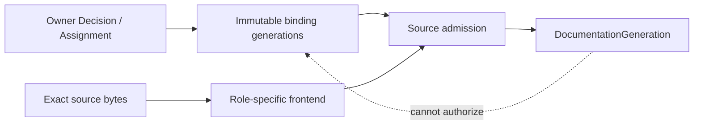

# 文档 Source、Scope 与 Authority

本文拥有 documentation source role、source admission、递归知识 scope、fragment 与 authored relation。它不拥有被记录的 Product/Domain事实，也不拥有 runtime control state、物理 placement、migration effect 或生成视图。

## 1. Source role 是封闭代数

```text
DocumentationSource =
  | KnowledgeSource
  | StructuredDomainSource
  | ControlDeclaration
  | ProposalSource
  | ImmutableRecordSource
```

| role | 可提出 | 必须引用 | 不可提出 |
| --- | --- | --- | --- |
| `KnowledgeSource` | 已采用的规范 clause、decision、relation、非规范解释 | semantic owner、scope/lifecycle/disclosure/authority bindings | runtime observation、当前进度、Effect terminal |
| `StructuredDomainSource` | 由领域 strict parser定义的 canonical payload | parser owner、Subject/revision bindings | Markdown正文推断、clause adoption override |
| `ControlDeclaration` | repository-authored desired state、selection input | control owner/schema | observed session/progress、稳定定义 |
| `ProposalSource` | candidate、alternatives、frontier、adoption request | target refs、provenance、review trigger | active authority、已采用事实 |
| `ImmutableRecordSource` | 由外部 owner产生的不可变记录 locator/manifest | producer、schema、payload/digest/readback | 重新解释 payload 或提升 producer ceiling |

Evidence、测试输出、日志、聊天和临时审计报告不是额外 source role；它们属于各自 Evidence/Runtime State owner，必要时只以 typed external binding进入 documentation projection。

## 2. Source 不能自授权

Knowledge 与 structured source 的 header 只携带外部 binding refs：

```text
DocumentSourceHeader =
  | KnowledgeSourceEnvelope {
      envelopeKind: knowledge-source,
      sourceDefinitionRef,
      scopeMembershipRef,
      lifecycleBindingRef,
      disclosureBindingRef,
      authorityBindingRef,
      clauseAdoptionPolicyRef
    }
  | StructuredDomainSourceEnvelope {
      envelopeKind: structured-domain-source,
      sourceDefinitionRef,
      scopeMembershipRef,
      lifecycleBindingRef,
      disclosureBindingRef,
      authorityBindingRef,
      parserOwnerRef
    }
```

Header不得自报identity、Domain、parent、owner、lifecycle、public/private、source/graph digest或generation。effective source 由分别授权的关系在同一 `documentRef` 上 join：

```text
DocumentationSourceAdmission = admit(
  SourceDefinition,
  ScopeMembership,
  LifecycleBinding,
  DisclosureBinding,
  AuthorityBinding,
  exact source bytes and generation
)
```

| binding | issuer | 关键不变量 |
| --- | --- | --- |
| SourceDefinition | documentation source-definition owner | 稳定DocumentRef、source role、body grammar |
| ScopeMembership | owning semantic topology owner | 单一parent/root；Subject与scope一致 |
| LifecycleBinding | change/lifecycle owner | 合法transition、current generation、retirement |
| DisclosureBinding | information/security owner | purpose/principal/classification交集不放大 |
| AuthorityBinding | responsibility/authority owner | exact ownership keys、issuer、validity、revocation |

所有 authority closure 必须有限、无环并终止于 active ResponsibilityAssignment 与有权 Product/Domain decision。文件作者、Git writer、path、status header、compiler、projection或self-digest不能成为终点。

当前 `docs/authority.json` 仍是现行 generation 的 registry；目标分布式 binding 只有在完整迁移、consumer cutover与readback后才取代它。目标设计文本不构成提前切换。

### 2.1 Binding publication 与 self-hosting

目标不是把中央registry复制进每个header，也不是让文档互相签名。五类binding分别由其semantic owner产生为独立immutable relation generation，并在source bytes之外join：



Binding payload必须绑定issuer、exact subject/source generation、validity/revocation与relation digest；source作者、frontend、Documentation Compiler和生成后的graph均不能签发或扩大它。不同binding owners可以并行发布独立relation generations，但admission只消费一个exact closed set，禁止“取各自latest”拼出未观察过的组合。

Self-hosting首次切换只允许一个migration-scoped adoption seed：它由current active authority与受影响semantic owners共同签发，绑定exact current generation、target design、preservation relation和transition operation，并在target publication/readback后终止。它只能签发target所需的首个binding generations，不能成为normal reader、永久root、fallback或后续修改入口。之后所有更新必须从active target assignments与owner Decisions正常演进；seed缺失、过期、输入漂移或部分签发均进入migration frontier，不允许source自举补齐。

## 3. Body node 与采用

```text
KnowledgeBodyNode =
  | ConstructDefinitionNode {
      definitionRef,
      constructRef,
      primaryRoleRef,
      exact grammar/profile/law refs,
      consumer/evolution/admission refs
    }
  | RuleDefinitionNode {
      ruleRef,
      ruleKind: derivation | predicate | transition-system,
      exact input/output/state refs,
      determinism/complexity/termination/coverage refs
    }
  | NormativeClause {
      clauseKey,
      subjectRefs,
      quantifierAndUniverse,
      modality: require | forbid | permit | derive,
      precondition,
      predicate,
      observableOrRejection,
      sourceRefs,
      reversalCondition
    }
  | DecisionNode {
      decisionRef,
      alternatives,
      selectedOutcome,
      objectiveAndConstraintRefs,
      rationaleRefs,
      reversalCondition
    }
  | RelationNode { exact typed relation payload }
  | ExplanationNode { referencedRefs }
```

`ConstructDefinitionNode`只登记Design Calculus已准入的primitive/profile/carrier/artifact/runtime/view role；`RuleDefinitionNode`登记求值规则，不把算法、predicate或state-machine提升成业务Subject。自然语言、表、图、公式和伪代码只是同一 node 的表达；不得分别拥有不同事实。Markdown frontend只承认显式 typed node，不从普通段落、标题、措辞或代码块猜规范。没有`bodyNodeRef`的代码块/图表只能是`ExplanationNode`，不能被compiler、Agent或测试当合同。

```text
ClauseAdoptionDefault =
  | StableDecisionAdoption { decisionRef }
  | TemporarySafetyDenialAdoption { blockerRef }
  | ExplanationOnly
```

`ClauseAdoptionPolicy` 必须由 semantic owner 在 candidate fragment bytes之外签发，并绑定 exact fragment scope与generation。节点级 override只能收窄或由同 owner显式替代；child scope、external source、generated view和migration output不继承采用策略。

首代没有 inline directive 时，只能通过独立 `AdoptionSeed/Decision` 形成一次 adoption wave；path、`status: stable`、现行registry、作者身份和“已有多年”都不是采用证据。正常代际只接受当前 active policy，不保留永久bootstrap旁路。

## 4. Recursive knowledge scope

Documentation scope 投影 [系统递归拓扑](../system-architecture/scope-and-domain-topology.md)，不自造第二棵 Domain 树：

```text
DocumentationScope =
  | CorpusRootScope
  | NestedScope {
      scopeRef,
      semanticScopeRef,
      parentScopeRef,
      contractFragmentRef,
      completionPredicateRef
    }
```

每个 nested scope 恰有一个 semantic containment parent。dependency、多归属、projection、evolution、consumer 与 proof 使用独立 typed relations；不得伪装成多父目录。

```text
DocumentFragment = generated effective model {
  documentRef,
  sourceAdmissionRef,
  effectiveRole,
  effectiveScopeRef,
  effectiveLifecycle,
  effectiveDisclosure,
  bodyNodeRefs,
  authoredRelationRefs
}
```

Fragment存在条件与Domain存在条件不同：

```text
FragmentRequired =
  independentlyOwnedMeaning
  or independent consumer/revision/invalidation
  or purpose-bound context saving > crossReferenceAndReviewCost

FragmentMergeRequired =
  same owner + same invariant + same lifecycle/change set
  and no independent consumer or authorization boundary
  and fragmentation cost >= context saving
```

行数、章节数量、作者偏好和目录美观不能单独触发拆分。一个大文件可能因多owner而必须拆；多个小文件也可能因无独立边界而必须合并。

## 5. Authored relation

```text
DocumentationRelation =
  | DependsOn
  | ProposalTargets
  | Records
  | References
  | Supersedes
  | Translates
```

`contains/scopes`由 semantic scope投影生成；`ProjectsFrom/GeneratedFrom`由projection/generator descriptor生成，均不可在正文手写。

Authority不属于authored documentation relation。Source只能引用独立签发的`AuthorityBinding`；正文不能用“authority topic”、父文档、链接或共同目录建立ownership。

```text
DocumentationLink =
  | DocumentLevelLink { fromDocumentRef, relationKind, toDocumentRef }
  | ClauseLevelLink { fromClauseRef, relationKind, toClauseRef }
```

Relation endpoint必须与resolved admission identity一致。较弱关系不能满足较强关系：`DependsOn`不授予ownership，`References`不证明provenance，`Supersedes`不证明consumer-zero，`GeneratedFrom`不允许projection反写source。

## 6. Structured 与 external source admission

每个 structured source kind必须由领域owner提供：

```text
StructuredSourceContract = {
  parserOwnerRef,
  exact schema/revision policy,
  canonical byte grammar,
  duplicate/unknown/trailing rejection,
  Subject and provenance binding,
  lifecycle and migration policy,
  unknown/opaque behavior
}
```

External source只产生 observation，不直接成为 Definition：

```text
ExternalCorpusBinding = {
  sourceIdentity,
  provider/method/environment refs,
  observed revision or validity interval,
  coverage and unknown frontier,
  integrity/licence/disclosure/retention refs,
  maximum authority ceiling
}
```

URL、Issue、PR、tool output、AI response和remote docs必须先经该边界；freshness或coverage不足时保留unknown，不能抓取一次后永久内化。

## 7. Source admission result

```text
DocumentationSourceAdmissionResult =
  | Admitted { fragmentRef, exact relation refs, admissionDigest }
  | Rejected { reason, zero adopted meaning }
  | Unresolved { frontierRefs, zero adopted meaning }
```

拒绝与unresolved均不能触发source mutation、address migration或projection publication。Admission只证明source可进入Documentation Compiler；不证明内容正确、目标generation完整或任何实现已符合。

<!-- sec-clause {"blocker":null,"kind":"stable-decision"} -->
## 规范片段

Documentation source必须由独立的source-definition、scope、lifecycle、disclosure与authority bindings共同准入；header、path、registry标签和正文不能自授权。递归scope只表示semantic containment，其他关系保持typed refs；fragment只在独立owner/consumer/revision或经证明的context收益存在时拆分。
