# 通用工程设计宪法

本文拥有跨项目可复用的工程设计原则：身份、真值、所有权、依赖、能力、资源、Effect、状态、恢复、证明、演进、复用、性能和正确变更成本。本文不拥有 Agent 行为、产品目标、项目路径、具体工具、当前实现或运行结果；表达和演算由 `docs/design-calculus.md` 拥有。

## 1. 工程系统总图

```mermaid
flowchart LR
  P[Purpose] --> S[Semantic Definition]
  S --> K[Knowledge / Observation]
  K --> C[Constraints]
  C --> R[Responsibility / Owner DAG]
  R --> A[Authority]
  A --> Q[Requirement DAG]
  Q --> B[Capability Binding]
  B --> L[Resource Allocation]
  L --> X[Effect / Execution]
  X --> T[Settlement / Lifecycle]
  T --> V[Evidence / Proof]
  V --> E[Evolution / Retirement]
  E -. "new accepted revision" .-> S
```

```text
AdmittedEngineeringChange =
  PurposeValid
  ∧ SemanticDefinitionConsistent
  ∧ KnowledgeCoverageSufficient
  ∧ HardConstraintsSatisfied
  ∧ ResponsibilityUnique
  ∧ AuthorityNonAmplifying
  ∧ CapabilityExactlyBound
  ∧ ResourcesReserved
  ∧ EffectRecoverable
  ∧ ProofObligationsDeclared
  ∧ EvolutionAndRetirementClosed
  ∧ LifecycleCostNonDominated
```

工程完成不是“代码可运行”，而是从目的到退役的因果链闭合。

## 2. 工程原则

| ID | 规范句 | 形式谓词 | 编译 I/O | 拒绝 |
| --- | --- | --- | --- | --- |
| EP-IDENTITY | 语义身份独立于路径、标签、尝试和展示 | `SubjectId ⟂ Address,Label,Attempt` | definitions + observations → stable refs | `identity-alias` |
| EP-TRUTH | projection、transport 和实现不能创造 authoritative meaning | `Authority(out)⊆⋃Authority(inputs)` | facts + issuers → claims/unknown | `truth-amplification` |
| EP-OWNER | 每个 identity、writer、parser、resolver、terminal 只有一个 owner | `cardinality(owner,key)=1` | relation graph → owner DAG | `duplicate-owner` |
| EP-UNKNOWN | 不完整知识显式存在，不能穿越受影响 Effect 或 Claim | `unknown∩deps(target)=∅` | coverage + target → admit/block | `unknown-crosses-boundary` |
| EP-AUTHORITY | Effect 权限只收窄，不由结构、路径或 caller 自报伪造 | `effect⊆grant∩envelope` | principal + grants + plan → frontier | `authority-amplification` |
| EP-CAPABILITY | Requirement 与 Provision 分离并 exact binding | `satisfies(provision,requirement)` | eligible provisions → binding/unavailable | `capability-mismatch` |
| EP-RESOURCE | 所有子步骤消费同一不可逆 parent ledger | `Σallocations≤parentBudget` | demand + ledger → allocation/blocked | `resource-budget-escape` |
| EP-EFFECT | attempt/exit 不等于 terminal；Effect 必须 settlement + readback | `terminal⇐settled∧readback` | attempt + obligations → terminal/residue | `effect-unsettled` |
| EP-RECOVERY | partial/lost-handle 状态不 blind replay | `retry⇒notAppliedProven∧retryGrant` | intent + readback → join/recover/retry/block | `unsafe-replay` |
| EP-PROOF | producer 不能充分证明自己；Evidence 只支持 exact Claim | `proofIssuer independentOf claimProducer` | claim + evidence → verdict | `self-proof` |
| EP-DERIVATION | 可计算事实机器生成，不手写镜像 | `stored(x)⇒¬derivable(x)∨durableConsumer(x)` | canonical graph → projections | `derived-fact-duplicated` |
| EP-COMPOSITION | 组合只通过 typed contract，不新增隐含 authority/state | `Authority(compose)⊆union(parts)` | contracts + edges → composite | `composition-leak` |
| EP-EVOLUTION | 一个语义时刻只有一个 active generation | `activeWriters(key)=1` | old/new graph + migration → cutover | `dual-generation` |
| EP-EXTENSION | 新实例扩展 port/contract，不给 core 加品牌分支 | `coreDelta independentOf instanceBrand` | new facts/provider → existing pipeline | `instance-special-case` |
| EP-REVERSIBILITY | 不可逆边界前必须具备 preimage、授权和恢复策略 | `irreversible⇒preimage∧grant∧recovery` | plan + state → effect ticket/block | `irreversible-unprepared` |
| EP-LOCALITY | 改动影响由语义依赖决定，不由目录距离或名字猜测 | `impact=closure(changedRelations)` | exact delta + graph → affected set | `impact-by-name` |
| EP-DETERMINISM | 纯阶段对相同 exact inputs 产生相同语义 bytes | `sameInputs⇒sameOutput` | semantic inputs → projection | `nondeterministic-pure-output` |
| EP-ECONOMY | 设计最小化正确变更全生命周期成本 | `Cost(chosen)≤Cost(validAlternatives)` | competing complete graphs → verdict | `dominated-design` |

### 2.1 原则优先级

```text
identity/truth/authority/durable-integrity
  ≻ user-visible semantic correctness
  ≻ recovery/settlement/proof
  ≻ security/privacy/isolation
  ≻ bounded resource/concurrency
  ≻ compatibility/extensibility
  ≻ performance/convenience/presentation
```

低层优化不能补偿高层违反。平级冲突由产品取舍决定，不由实现方便或多数测试决定。

### 2.2 角色、反例、反转与机器投影

下表与 2 节矩阵共同构成每条原则的完整 record；不是第二份原则定义。

| ID | issuer / consumers | 最小反例 | 合法反转条件 | machine projection |
| --- | --- | --- | --- | --- |
| EP-IDENTITY | engineering constitution / all identity consumers | 同 path 的替换对象被当成同一 Subject | owner-issued identity migration + consumer readback | branded identity、revision parser、ABA/alias rejection |
| EP-TRUTH | engineering constitution / projection and evidence owners | formatter 或 process exit 生成成功 Claim | 新 authoritative observation/issuer 被显式绑定 | provenance lattice、non-amplification checker |
| EP-OWNER | engineering constitution / architecture compiler | 两个 writer/parser/resolver 都称 canonical | 证明是两个不同 identity，或完成单 owner cutover | owner graph cardinality/cycle lint |
| EP-UNKNOWN | engineering constitution / every effect/claim admission | unreadable 被转成 absent 后触发写入 | 新 observation 关闭 affected frontier | discriminated result、unknown-flow analysis |
| EP-AUTHORITY | authorized domain issuer / effect admission | caller object/test hook 自报权限 | issuer 发布新的 exact grant | opaque grant、scope intersection、expiry check |
| EP-CAPABILITY | requirement/provision owners / binder | ambient executable 代替 retained provider | 新 provision 通过 conformance 并 exact rebind | capability branding、eligibility compiler |
| EP-RESOURCE | resource owner / orchestrators/providers | lock 和 child 各自重置同一 timeout | parent owner 扩大 allocation 或 plan 缩小 | monotonic ledger、aggregate counters、abort propagation |
| EP-EFFECT | domain operation owner / runtime/integration | exit 0 被投影为业务 terminal | settlement obligations + domain readback 完成 | attempt/settlement state machine、terminal parser |
| EP-RECOVERY | state owner / workers/orchestrators | lost handle 后重复提交 | readback 证明 not-applied 且 issuer 发 retry grant | OperationKey claim、journal、recovery compiler |
| EP-PROOF | claim owner / verifier/integration | producer 的测试报告自证完成 | 独立 Evidence 或 Claim 明确降级 | issuer separation、claim-evidence validator |
| EP-DERIVATION | semantic owner / projection owners | 路径/计数/版本清单手写两份 | 出现真实 durable/external consumer且不可按需派生 | graph compiler、mirror lint、generated projection digest |
| EP-COMPOSITION | contract owners / orchestration | callback/adapter组合后获得新隐藏权限 | composite owner 定义并获授权的新 Requirement/Grant | typed ports、authority union check、hidden-edge census |
| EP-EVOLUTION | change/state owners / all consumers | old/new writer同时 active | atomic cutover readback、old consumer-zero | generation state machine、migration census |
| EP-EXTENSION | architecture/domain owners / core | 新品牌导致 core switch 分支 | 新语义不可由现有 algebra 表达并经 model evolution 接受 | instance-brand lint、provider/target conformance |
| EP-REVERSIBILITY | product/state/effect owners / admission | 不可逆 Effect 无 preimage/compensation | 有权主体接受明确不可逆结果并定义 terminal/compensation | pre-effect obligation compiler、destructive-action gate |
| EP-LOCALITY | semantic graph owner / impact/test selection | 同目录文件被全选或同名符号被关联 | 新真实 relation 被 Source Program/owner 接受 | exact dependency closure、name/path heuristic rejection |
| EP-DETERMINISM | pure-stage owner / cache/evidence | 相同 inputs 产生不同 bytes | nondeterminism 被提升为显式 input/observation | canonical serialization、repeat/equivalence check |
| EP-ECONOMY | architecture/product owners / design selection | 第二 scanner/daemon/test graph长期增加维护成本 | 其他高优先级性质需要且 lifecycle cost 被明确接受 | cost ledger、dominated-node reduction、benchmark evidence |

### 2.3 核心结构裁决

| Question | Selected | Rejected | 选择理由 | 反转条件 |
| --- | --- | --- | --- | --- |
| 如何划分系统 | Responsibility Cell + owner DAG | 按文件长度、技术品牌、历史目录分组 | 同时闭合定义、状态、Effect、恢复和变化协同 | 出现无法由 cell contract 表达的真实部署/权限边界 |
| 如何组织业务与外部行为 | pure Domain Operation + typed Capability Atoms + orchestrator | mega-script；每命令一 wrapper | intent/decision 与可替换执行机制正交，资源/settlement可统一 | 新 Effect 无法经 port 表达且引入新领域语义 |
| 如何共享事实 | one exact observation graph + content-addressed shards | typecheck/audit/test-impact各扫一遍 | 同 revision 一次观察，多 consumer复用，增量可验证 | consumer 所需 universe 已证明不同且不可安全投影 |
| 如何处理外部成熟能力 | direct stable machine interface；必要时薄 boundary adapter | 重写同类工具；SEC 镜像 API | 降低 owner/升级/安全/性能成本，不丢领域边界 | 外部接口缺失协议、权限、资源或settlement关键语义 |
| 如何组织源码 | graph-derived placement under one authored source root | 固定五类目录；长期多 source roots | 位置从责任、层级、可见性、lifecycle生成 | runtime packaging要求独立 authored root且有真实消费者 |
| 如何演进 | proposal并存、runtime单active generation、一次迁移 | 永久双读/双写；原 schema 静默放宽 | 保持真值唯一且可恢复 | 真实 rolling deployment support window要求短期并存且有退役时间 |
| 如何保留未来设计 | bounded FutureObligation outside active runtime graph | consumer-zero即删；active空壳 | 不丢已接受业务，又不让猜测污染当前图 | activation predicate成立或 obligation被撤销 |
| 如何验证 | property/effect/failure/protocol Claims + independent Evidence | 数字/路径/版本镜像；producer自证 | 证明用户可观察与失败边界，减少重构噪声 | Claim或风险模型改变 |
| 如何优化性能 | eliminate duplication → shared facts → incremental → ActionKey reuse | correctness weakening；第二daemon truth；机械全跑 | 优先净删工作，再缓存 exact truth | 实测显示另一完整方案成本更低且性质等价 |

## 3. 语义身份、地址与硬编码

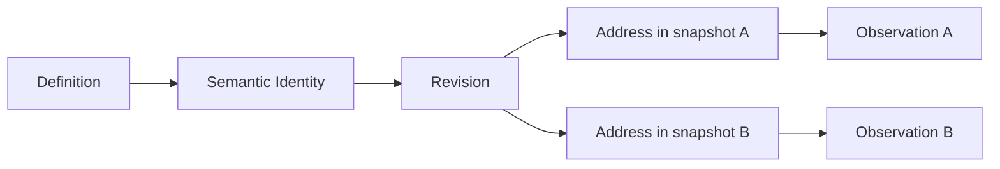

| 可作为 identity 的事实 | 只可作为 Address/Observation |
| --- | --- |
| owner 签发的稳定语义 key、内容/协议 identity、accepted domain relation | 文件路径、目录、端口、PID、函数名、版本标签、测试标题、显示字符串 |

硬字符串并非一律禁止；按语义分类：

| Literal kind | 合法性 |
| --- | --- |
| protocol/domain discriminator | 由唯一合同 owner 定义、strict reader 消费、未知值拒绝 |
| content-address domain separator | 由 identity owner 定义，参与确定性 hash |
| user-visible text | 由界面 owner 拥有，不得作机器 authority |
| fixture sample | 只服务算法/行为样例，不得自证生产合同 |
| path/owner/count/version mirror | 从 canonical graph 派生或删除 |
| endpoint/credential/tool path | 来自 provision/binding，不进入 domain identity |

`hardcode finding` 必须引用 literal 的语义角色，而不是按字符串存在与否裁决。

## 4. Responsibility、Owner DAG 与 Facade

### 4.1 Responsibility Cell

```text
ResponsibilityCell = {
  subjectKinds,
  definitions,
  operations,
  stateTransitions,
  writers,
  parsers,
  publicContracts,
  requiredPorts,
  settlements,
  evidenceClaims,
  evolutionObligations
}
```

一个 cell 拥有完整语义闭包，不等于一个文件、目录、package 或团队。物理布局从 cell 和 dependency DAG 生成。

### 4.2 依赖方向

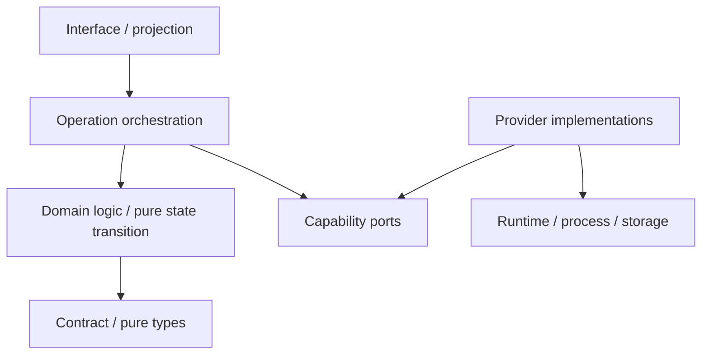

禁止：

```text
contract -> runtime implementation
domain -> interface projection
provider -> domain decision
foundation -> orchestration/control
lower owner -> higher owner through callback/type-only/self-import trick
```

类型引用、动态 import、barrel re-export、test helper、callback 和字符串代码都是依赖边，不能从 DAG 中豁免。

### 4.3 Facade 存在证明

```text
FacadeAllowed iff
  realExternalOrCrossCellConsumers > 0
  ∧ exportedSurface < internalSurface
  ∧ facadeOwnsNoSemanticState
  ∧ noReverseDependency
  ∧ noDuplicateResolverOrVersion
```

| 情况 | 处置 |
| --- | --- |
| 空 index / 只转发单个内部文件 | consumer 直接依赖真正 contract，删除 facade |
| 稳定 package public boundary | 保留薄 facade，机器生成/检查 export closure |
| facade 为解决 cycle 而引入 | 移动合同/反转依赖；不得隐藏 cycle |
| 多个 facade 暴露同一身份 | 选择唯一 public owner，迁移后删除其余 |

Facade 只投影，不定义第二份身份、状态、版本、默认值或错误语义。

## 5. 领域 Operation 与能力原子

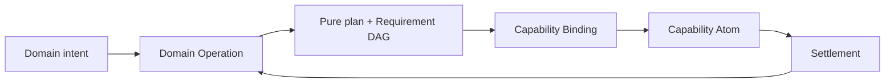

| 单元 | 拥有 | 不拥有 |
| --- | --- | --- |
| Domain Operation | intent、invariant、Requirement DAG、纯决策、业务终态 | executable、credential、process mechanics |
| Capability Port | requirement/provision contract、failure/settlement shape | provider implementation、业务选择 |
| Capability Atom | 一个可替换外部 Effect 机制及物理边界 | 跨领域流程、产品策略、成功宣称 |
| Operation Orchestrator | DAG ordering、Binding、Allocation、recovery、readback | 新领域真值、第二 provider owner |
| Interface | typed intent/result projection | domain resolver、Effect、state owner |

“所有逻辑集中在一个脚本”与“每个行为一个 wrapper”都不成立。正确切分是：纯领域决策集中于 operation；Effect mechanics 聚合为少量高复用 capability atoms；编排只消费 typed ports。

### 5.1 原子不是一条命令

```text
CapabilityAtom = {
  provisionIdentity,
  admittedInputs,
  physicalBinding,
  resourceDimensions,
  startBoundary,
  cancellation,
  outputProtocol,
  settlementObligations,
  recoveryReadback,
  terminalReceipt
}
```

原子边界由不可再分的 Effect/settlement contract 决定，不由 shell 命令、函数长度或文件数决定。

## 6. 资源、进程与截止时间

进程、线程、句柄、文件描述符、锁、连接、容器、内存、CPU、磁盘 I/O、网络、输入和输出都是 allocation；不只是“代码调用”。

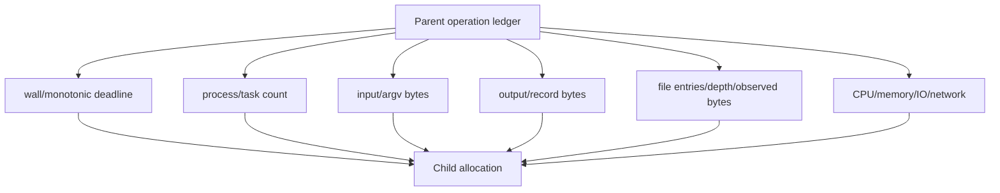

```text
ChildBudget = reserve(parentRemaining, childDemand)
remaining(t) = min(parentAbsoluteDeadline - monotonicNow, reservedLocalCeiling)
```

规则：

- absolute deadline 由顶层 operation 一次派生；锁、发现、扫描、命令、readback、cleanup 消费同一 ledger；
- `signal` 在每次等待、Effect admission、分段处理和 cleanup 检查；
- 静态 timeout 只是 ceiling，不能扩大 parent remaining；
- 预算维度由风险和 Requirement 选择，不机械要求所有操作全量预扫；
- entries/bytes 在实际流式观察中计量，禁止为了“先数一遍”额外全遍历；
- 内容 identity 可用增量 hash、文件元数据+readback、Merkle/fact shards，但 cache hit 必须绑定 exact producer/environment；
- cleanup 也受 settlement policy 约束；主错误和 cleanup residue 分开保存。

### 6.1 单飞、并发与背压

```text
ConcurrencyPolicy = serial | singleFlight(key) | parallel(disjointResources) | join(existing)
```

同一个不可重入 session 内的请求顺序执行；需要并行时由 owner 签发可并行 provision 或多个独立 binding，不能由 caller 放宽原子合同。并发度由依赖、资源和 settlement 风险决定，不由线程上限决定。

## 7. Durable Local Effect Worker

长生命周期或可能丢失 caller handle 的 Effect 需要 durable worker；普通短命令不自动升级为 worker。

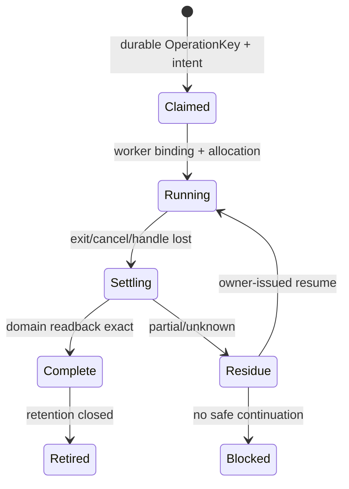

```text
DurableEffectRecord = {
  operationKey,
  intentDigest,
  grantRef,
  bindingRef,
  allocationRef,
  exactPreimage,
  attemptEpoch,
  progressFacts,
  settlementObligations,
  terminalOrResidue,
  readbackRefs
}
```

lost handle 后先读 domain state 和 durable record：exact applied→合成 terminal；conclusively not applied→owner 可发 retry；partial/unknown→residue。PID 不存在、锁文件缺失或 launcher 报错都不能证明“未执行”。

## 8. 持久状态、Schema 与 Parser

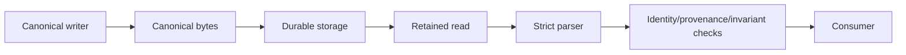

持久/跨进程/外部合同必须有：

```text
one schema identity + literal type
+ one strict parser
+ exact writer
+ unknown/duplicate/trailing rejection
+ provenance and producer binding
+ readback
+ migration/retirement policy
```

成熟 schema/validation library用于实现语法和类型约束；领域 owner 仍拥有字段、不变量和迁移。手写通用 JSON/YAML/parser 只有在成熟机制无法满足 exact bytes、duplicate keys、streaming、physical binding 或安全边界时才成立，并必须有存在证明。

版本只在真实 consumer 需要区分至少两个可观察状态时存在：

```text
VersionRequired iff
  durableOrExternalBoundary
  ∧ distinctStates≥2
  ∧ readerOrMigrationActuallyBranches
```

否则删除版本字段、`Vn` 后缀、dispatcher、alias 和数字镜像测试。需要版本时由 contract owner 定义，writer/reader 引用同一 identity；正常路径只接受当前代，旧 parser 只存在于一次迁移入口。

## 9. 状态、恢复与补偿

```text
StateTransition = {
  stateOwner,
  exactPreimage,
  intent,
  operationKey,
  allowedFrom,
  targetState,
  effectPlan,
  readback,
  recovery,
  retirement
}
```

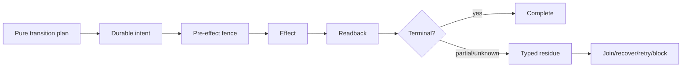

恢复是原状态机的一部分，不是异常脚本。未知或不安全读不能折叠成 absent/mismatch/cache miss；只有明确 absent/mismatch 才允许 materialize/recreate。

## 10. Evidence、测试与证明

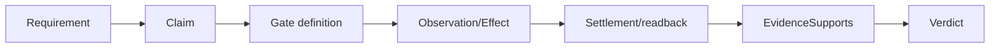

### 10.1 测试价值

保留测试必须至少观察一项：

| Class | 观察对象 |
| --- | --- |
| behavior | 公共输入/输出/业务状态 |
| durable | 写入→strict readback→identity/digest/invariant |
| effect | 真实 Effect、zero-effect sentinel、settlement |
| failure-boundary | typed failure、abort、CAS、unknown、residue |
| algorithm-property | 等价、单调、不变式、扰动、闭包 |
| protocol | 外部/跨进程 producer-consumer |

仅复制源码文本、路径列表、函数 arity、实现数组、文件数、版本数字或自写 schema 的测试不产生业务证明。精确数字只有在其本身是 effect/status/budget/protocol/durable cardinality 合同时才保留；否则从 canonical owner 派生关系或改测集合性质。

### 10.2 测试裁决

```text
KEEP    := unique required observation
REWRITE := value remains, current boundary mirrors implementation
MERGE   := another test proves same or stronger semantic/effect/failure closure
DELETE  := producer/consumer/external/future obligation zero
UNKNOWN := evidence insufficient; cannot claim deletion or value
```

测试数量下降或名称过时不证明可删；业务尚未实现也不证明测试无价值。先区分 accepted Definition、future obligation 和 obsolete graph。

## 11. 性能与增量计算

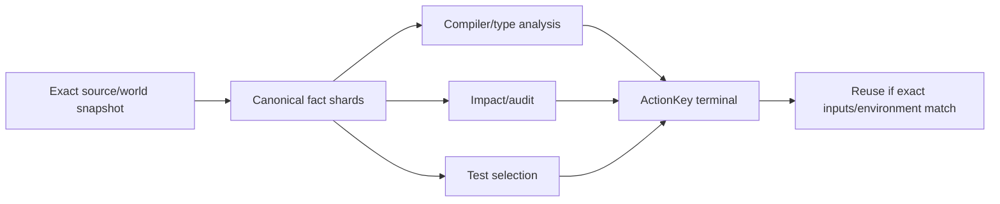

```text
ActionKey = digest(
  semanticInputs,
  sourceSnapshot,
  algorithm/provider identities,
  dependency generation,
  environment/toolchain,
  policy/claims
)
```

优化顺序：

1. 删除重复 owner、重复观察、重复解析和无消费者工作；
2. 多 consumer 复用同一 exact snapshot/fact shards；
3. 进程内增量服务编辑查询，跨进程使用可验证 content-addressed facts；
4. 复用 authenticated in-flight、fresh terminal 和 deterministic failure；
5. 只运行 `RequiredClosure ∩ MissingOrStale`；
6. 对 cold/warm/delta 做可重现实测并验证 byte-equivalence；
7. 只有存在长期查询与生命周期 owner 时才引入 daemon，不以 daemon 复制 truth。

cache 是派生加速层，不是 correctness owner。mtime、路径、进程内对象或“上次 PASS”不足以构成 hit。

## 12. 外部能力与成熟轮子

```text
AdoptExternalCapability iff
  requirementGapReal
  ∧ stableMachineInterfaceAvailable
  ∧ provenance/security/license acceptable
  ∧ operation/resource/settlement integrable
  ∧ lifecycleCost lower than owning equivalent
```

默认直接消费最窄稳定 machine interface；不为每个命令、SDK 或库建立一对一镜像 wrapper。薄 adapter 只在下列边界有新增价值时成立：

- protocol/format normalization；
- credential/principal/endpoint binding；
- retained physical capability；
- resource/cancellation/settlement；
- domain-specific error algebra；
- provider replacement/conformance；
- migration/retirement。

presentation、shell 文本、全局环境和 PATH 不能签发语义或 Effect authority。外部工具产生 observation，不产生产品成功或独立完成。

## 13. Source、仓库与物理布局

逻辑结构先于路径；路径是编译结果。

```text
place(unit) = f(
  responsibilityCell,
  dependencyLayer,
  visibility,
  lifecycle,
  runtimePackaging,
  changeCohesion,
  generatedOrAuthored
)
```

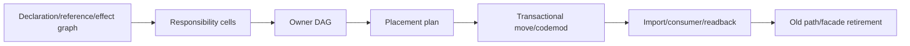

规则：

- authored executable source 进入一个 canonical source root；tests/docs/assets/generated/runtime state 各有独立 lifecycle root；
- 目录名表达 responsibility，不表达历史组织、工具名或临时迁移；
- 文件按 declaration cohesion、变化协同和 boundary 拆分，不按行数机械切割；
- 同一 cell 可有 contract/domain/operation/provider/runtime 子层，但不建立空目录和空 index；
- 自动重构消费 compiler/LSP/AST 的 symbol/reference graph；文本替换仅处理无语义载体；
- move plan 绑定 old/new graph、消费者、生成物、配置、测试和退役清单；
- 迁移完成要求 old path consumer-zero，不留 alias、barrel 或长期兼容层。

## 14. 演进与唯一代际

唯一代际是运行权威约束，不是“永远没有历史”。

| 层 | 可并存 | 不可并存 |
| --- | --- | --- |
| design proposal | 多个 competing models | 多个都称 canonical |
| migration input | old immutable evidence + new candidate | normal path 双读双写 |
| runtime | 一个 active writer/parser/resolver | 同 identity 多 active generations |
| verification | old/new equivalence Evidence | 新模型自证 cutover |
| archive | retired immutable records | archive 重新获得 Effect authority |

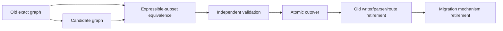

## 15. 工程设计伪编译

```text
compileEngineeringDesign(input):
  graph := buildCausalGraph(input.outcomes, input.definitions, input.observations)
  dispositions := graph.nodes.map(counterfactualClassify)
  ownerDag := assignUniqueOwners(graph)
  assertAcyclic(ownerDag)
  requirements := compileRequirementDag(graph)
  provisions := resolveEligibleProvisions(requirements)
  resources := compileParentLedger(requirements, provisions)
  transitions := compileStateMachines(graph, resources)
  proofs := compileClaimsAndEvidence(transitions)
  evolution := compileCutoverAndRetirement(graph, input.futureObligations)
  attacks := modelCheck(allPrinciples, graph, transitions, proofs, evolution)
  alternatives := reduceDominatedDesigns(graph)
  return verdictOrExactFrontier(...)
```

```text
executeEngineeringPlan(plan, ports):
  // 不属于纯设计编译器；只能消费 admitted plan
  for step in topological(plan.requirementDag):
    binding := ports.bind(step.requirement)
    allocation := ports.reserve(binding)
    ticket := admitEffect(step, binding, allocation, freshReadback())
    attempt := ports.execute(ticket)
    settlement := ports.settle(attempt)
    require terminal(settlement) or record typed residue
```

## 16. 工程对抗矩阵

| 场景 | 根设计 | 必须证明 | 禁止 |
| --- | --- | --- | --- |
| 同一领域出现两套 resolver | 唯一 owner + consumer migration | old consumer-zero | 互相 fallback |
| contract facade 反向 import | 合同下移或依赖反转 | DAG 无环、surface 仍满足 consumer | callback/type-only 隐藏环 |
| public test seam 可进生产 | production/test capability 分型 | origin gate + zero production import | 注释/函数名作门禁 |
| 读错误折叠为 cache miss | discriminated readiness | unknown→typed block、zero Effect | catch-all false/null |
| 每层重置 timeout | parent absolute ledger | all steps/cleanup consume remaining | timeout 相加 |
| 长 Effect caller 断开 | durable worker/readback | at-most-once + lost-handle recovery | 自动重复启动 |
| 版本字段只有数字测试 | consumer/version census | real branching or delete | 换一个数字/alias |
| future abstraction 无 consumer | FutureObligation | activation/cost/retirement | active empty shell/盲删 |
| 测试读取源码路径 | behavior/graph-derived assertion | public/effect/property boundary | 文件存在/路径清单自证 |
| 大目录扫描 | streaming shared ledger + incremental facts | entries/bytes/depth/time/abort | 预先全扫两遍 |
| 类型检查重复变慢 | one snapshot/facts/ActionKey | cold/warm/delta equivalence | 第二 checker/daemon truth |
| 容器启动锁错误 | capability/resource/lifecycle owner | root discovery、single claim、terminal readback | 随机重试/只抬等待 |
| workspace 并发改动 | exact preimage + ownership + CAS | unrelated state preserved | reset/format/all-stage |
| 外部工具已有成熟能力 | direct stable interface or justified thin adapter | gap/cost/retirement | 自写低质替代/镜像 API |
| 文件架构迁移 | graph-derived placement transaction | imports/config/tests/old paths closed | 手工来回改路径 |
| 业务未完成 | accepted Definition + future obligation | missing behavior explicit | 用“无 consumer”删掉目标能力 |

## 17. 工程设计完成

```text
EngineeringDesignClosed =
  every accepted outcome has a complete causal path
  ∧ every relation has one semantic owner
  ∧ owner/reference/effect graphs are acyclic or explicitly state-machine cycles
  ∧ every Requirement has exact provision/unavailable semantics
  ∧ every Effect has shared resources, settlement, readback and recovery
  ∧ durable contracts have strict owner/parser/migration
  ∧ proofs cannot be self-issued
  ∧ performance reuses exact facts without creating second truth
  ∧ future obligations are explicit and bounded
  ∧ physical layout is derived from responsibility and lifecycle
  ∧ every applicable adversarial scenario has a legal terminal outcome
  ∧ no duplicate owner, mirror, dominated mechanism or unretired generation remains
```
