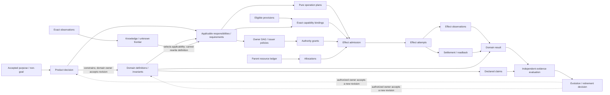
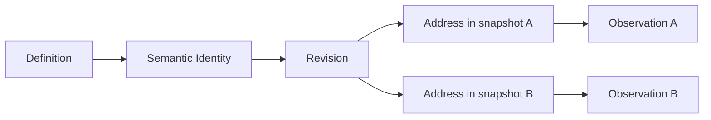
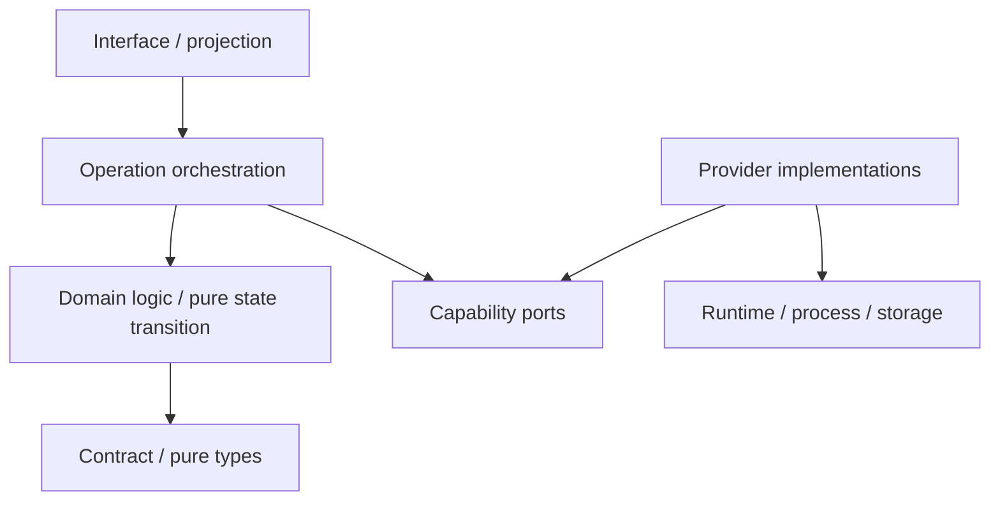

# 通用工程设计宪法

本文是 engineering-constitution 的公共 root，拥有跨项目可复用的工程真值、身份、结构、责任、所有权与 authority 原则。Operation/runtime 和 proof/evolution 原则由本文件列出的规范片段拥有。整个 domain 不拥有 Agent 行为、产品目标、项目路径、具体工具、当前实现或运行结果；表达和演算由 `docs/design-calculus.md` 拥有。

## 1. 工程系统总图



这是一张typed relation view，不是时间上必须串行的流水线：Purpose只约束Product Decision，Product Decision不能自行改写Domain Definition；Observation只决定事实覆盖和Definition的适用性，不能生成Definition。Owner不自动产生Grant，Provision不自动获得Authority，Effect不自动产生Evidence，Evolution也只有被相应authorized owner接受后才形成新revision。

```text
AdmittedEngineeringChange =
  PurposeValid
  ∧ SemanticDefinitionConsistent
  ∧ KnowledgeCoverageSufficient
  ∧ HardConstraintsSatisfied
  ∧ ResponsibilityUnique
  ∧ AuthorityNonAmplifying
  ∧ CapabilityExactlyBound
  ∧ ResourceControlsSatisfyRequirements
  ∧ EffectRecoverable
  ∧ ProofObligationsDeclared
  ∧ EvolutionAndRetirementClosed
  ∧ LifecycleCostNonDominated
```

工程完成不是“代码可运行”，而是从目的到退役的因果链闭合。

## 2. 工程原则

| ID | 规范句 | 形式谓词 | 编译 I/O | 拒绝 |
| --- | --- | --- | --- | --- |
| EP-IDENTITY | 语义身份独立于路径、标签、尝试和展示 | `SubjectId ⟂ Address,Label,Attempt` | definitions + observations → stable refs | `identity-alias` |
| EP-TRUTH | projection、transport 和实现不能创造 authoritative meaning | `Authority(out)⊆⋃Authority(inputs)` | facts + issuers → claims/unknown | `truth-amplification` |
| EP-OWNER | 每个 identity、writer、parser、resolver、terminal 只有一个 owner | `cardinality(owner,key)=1` | relation graph → owner DAG | `duplicate-owner` |
| EP-UNKNOWN | 不完整知识显式存在，不能穿越受影响 Effect 或 Claim | `unknown∩deps(target)=∅` | coverage + target → admit/block | `unknown-crosses-boundary` |
| EP-AUTHORITY | Effect 权限只收窄，不由结构、路径或 caller 自报伪造 | `effect⊆grant∩envelope` | principal + grants + plan → frontier | `authority-amplification` |
| EP-CAPABILITY | Requirement 与 Provision 分离并 exact binding | `satisfies(provision,requirement)` | eligible provisions → binding/unavailable | `capability-mismatch` |
| EP-RESOURCE | 每项资源需求声明可接受control mode；所有reservation、enforced consumption与measurement都归属同一parent ledger | `resourceClaims⊆parentLedger∧modeCompatible` | demand + dimension contracts + ledger → allocation/measurement/blocked | `resource-budget-escape` |
| EP-EFFECT | attempt/exit 不等于 terminal；Effect 必须 settlement + readback | `terminal⇐settled∧readback` | attempt + obligations → terminal/residue | `effect-unsettled` |
| EP-RECOVERY | partial/lost-handle 状态不 blind replay | `retry⇒notAppliedProven∧retryGrant` | intent + readback → join/recover/retry/block | `unsafe-replay` |
| EP-PROOF | producer 不能充分证明自己；Evidence 只支持 exact Claim | `proofIssuer independentOf claimProducer` | claim + evidence → verdict | `self-proof` |
| EP-DERIVATION | 可计算事实机器生成，不手写镜像 | `stored(x)⇒¬derivable(x)∨durableConsumer(x)` | canonical graph → projections | `derived-fact-duplicated` |
| EP-COMPOSITION | 组合只通过 typed contract，不新增隐含 authority/state | `Authority(compose)⊆union(parts)` | contracts + edges → composite | `composition-leak` |
| EP-EVOLUTION | 一个语义时刻只有一个 active generation | `activeWriters(key)=1` | old/new graph + migration → cutover | `dual-generation` |
| EP-EXTENSION | 新实例扩展 port/contract，不给 core 加品牌分支 | `coreDelta independentOf instanceBrand` | new facts/provider → existing pipeline | `instance-special-case` |
| EP-REVERSIBILITY | 不可逆边界前必须具备 preimage、授权和恢复策略 | `irreversible⇒preimage∧grant∧recovery` | plan + state → effect ticket/block | `irreversible-unprepared` |
| EP-LOCALITY | 改动影响由语义依赖决定，不由目录距离或名字猜测 | `impact=closure(changedRelations)` | exact delta + graph → affected set | `impact-by-name` |
| EP-DETERMINISM | 纯阶段对相同 exact inputs 产生相同语义 bytes | `sameInputs⇒sameOutput` | semantic inputs → projection | `nondeterministic-pure-output` |
| EP-ECONOMY | 在满足更高优先级约束的完整候选中选择生命周期成本非支配方案 | `¬∃a∈validAlternatives: dominates(a,chosen)` | competing complete graphs + cost vectors → selected/frontier | `dominated-design` |

### 2.1 原则优先级

```text
identity/truth/authority/durable-integrity
  ≻ user-visible semantic correctness
  ≻ recovery/settlement/proof
  ≻ security/privacy/isolation
  ≻ bounded resource/concurrency
  ≻ compatibility/extensibility
  ≻ performance/convenience/presentation
```

低层优化不能补偿高层违反。平级冲突由产品取舍决定，不由实现方便或多数测试决定。

### 2.2 角色、反例、反转与机器投影

下表与 2 节矩阵共同构成每条原则的完整 record；不是第二份原则定义。

| ID | issuer / consumers | 最小反例 | 合法反转条件 | machine projection |
| --- | --- | --- | --- | --- |
| EP-IDENTITY | engineering constitution / all identity consumers | 同 path 的替换对象被当成同一 Subject | owner-issued identity migration + consumer readback | branded identity、revision parser、ABA/alias rejection |
| EP-TRUTH | engineering constitution / projection and evidence owners | formatter 或 process exit 生成成功 Claim | 新 authoritative observation/issuer 被显式绑定 | provenance lattice、non-amplification checker |
| EP-OWNER | engineering constitution / architecture compiler | 两个 writer/parser/resolver 都称 canonical | 证明是两个不同 identity，或完成单 owner cutover | owner graph cardinality/cycle lint |
| EP-UNKNOWN | engineering constitution / every effect/claim admission | unreadable 被转成 absent 后触发写入 | 新 observation 关闭 affected frontier | discriminated result、unknown-flow analysis |
| EP-AUTHORITY | authorized domain issuer / effect admission | caller object/test hook 自报权限 | issuer 发布新的 exact grant | opaque grant、scope intersection、expiry check |
| EP-CAPABILITY | requirement/provision owners / binder | ambient executable 代替 retained provider | 新 provision 通过 conformance 并 exact rebind | capability branding、eligibility compiler |
| EP-RESOURCE | resource owner / orchestrators/providers | lock 和 child 各自重置同一 timeout，或把measured peak写成reserved capacity | parent owner改变ceiling/control mode，或plan缩小requirement | typed control mode、monotonic ledger、aggregate counters、abort propagation |
| EP-EFFECT | domain operation owner / runtime/integration | exit 0 被投影为业务 terminal | settlement obligations + domain readback 完成 | attempt/settlement state machine、terminal parser |
| EP-RECOVERY | state owner / workers/orchestrators | lost handle 后重复提交 | readback 证明 not-applied 且 issuer 发 retry grant | OperationKey claim、journal、recovery compiler |
| EP-PROOF | claim owner / verifier/integration | producer 的测试报告自证完成 | 独立 Evidence 或 Claim 明确降级 | issuer separation、claim-evidence validator |
| EP-DERIVATION | semantic owner / projection owners | 路径/计数/版本清单手写两份 | 出现真实 durable/external consumer且不可按需派生 | graph compiler、mirror lint、generated projection digest |
| EP-COMPOSITION | contract owners / orchestration | callback/adapter组合后获得新隐藏权限 | composite owner 定义并获授权的新 Requirement/Grant | typed ports、authority union check、hidden-edge census |
| EP-EVOLUTION | change/state owners / all consumers | old/new writer同时 active | atomic cutover readback、old consumer-zero | generation state machine、migration census |
| EP-EXTENSION | architecture/domain owners / core | 新品牌导致 core switch 分支 | 新语义不可由现有 algebra 表达并经 model evolution 接受 | instance-brand lint、provider/target conformance |
| EP-REVERSIBILITY | product/state/effect owners / admission | 不可逆 Effect 无 preimage/compensation | 有权主体接受明确不可逆结果并定义 terminal/compensation | pre-effect obligation compiler、destructive-action gate |
| EP-LOCALITY | semantic graph owner / impact/test selection | 同目录文件被全选或同名符号被关联 | 新真实 relation 被 Source Program/owner 接受 | exact dependency closure、name/path heuristic rejection |
| EP-DETERMINISM | pure-stage owner / cache/evidence | 相同 inputs 产生不同 bytes | nondeterminism 被提升为显式 input/observation | canonical serialization、repeat/equivalence check |
| EP-ECONOMY | architecture/product owners / design selection | 第二 scanner/daemon/test graph长期增加维护成本 | 其他高优先级性质需要且 lifecycle cost 被明确接受 | cost ledger、dominated-node reduction、benchmark evidence |

### 2.3 核心结构裁决

| Question | Selected | Rejected | 选择理由 | 反转条件 |
| --- | --- | --- | --- | --- |
| 如何划分系统 | Responsibility Cell + owner DAG | 按文件长度、技术品牌、历史目录分组 | 同时闭合定义、状态、Effect、恢复和变化协同 | 出现无法由 cell contract 表达的真实部署/权限边界 |
| 如何组织业务与外部行为 | pure Domain Operation + typed Capability Atoms + orchestrator | mega-script；每命令一 wrapper | intent/decision 与可替换执行机制正交，资源/settlement可统一 | 新 Effect 无法经 port 表达且引入新领域语义 |
| 如何共享事实 | one exact observation graph + content-addressed shards | typecheck/audit/test-impact各扫一遍 | 同 revision 一次观察，多 consumer复用，增量可验证 | consumer 所需 universe 已证明不同且不可安全投影 |
| 如何处理外部成熟能力 | direct stable machine interface；必要时薄 boundary adapter | 重写同类工具；SEC 镜像 API | 降低 owner/升级/安全/性能成本，不丢领域边界 | 外部接口缺失协议、权限、资源或settlement关键语义 |
| 如何组织源码 | graph-derived placement under one authored source root | 固定五类目录；长期多 source roots | 位置从责任、层级、可见性、lifecycle生成 | runtime packaging要求独立 authored root且有真实消费者 |
| 如何演进 | proposal并存、runtime单active generation、一次迁移 | 永久双读/双写；原 schema 静默放宽 | 保持真值唯一且可恢复 | 真实 rolling deployment support window要求短期并存且有退役时间 |
| 如何保留未来设计 | bounded FutureObligation outside active runtime graph | consumer-zero即删；active空壳 | 不丢已接受业务，又不让猜测污染当前图 | activation predicate成立或 obligation被撤销 |
| 如何验证 | property/effect/failure/protocol Claims + independent Evidence | 数字/路径/版本镜像；producer自证 | 证明用户可观察与失败边界，减少重构噪声 | Claim或风险模型改变 |
| 如何优化性能 | eliminate duplication → shared facts → incremental → ActionKey reuse | correctness weakening；第二daemon truth；机械全跑 | 优先净删工作，再缓存 exact truth | 实测显示另一完整方案成本更低且性质等价 |
| 如何选择系统表示 | 从relation/operation/scale/failure生成relational fact model、DAG/hypergraph、nested hierarchy、state machine、lattice、ledger、partial order、Merkle等不同候选再比较 | 沿当前代码形状补字段；用户刚提出一种结构就升级为系统本体；一种结构套全系统 | 表示直接保持语义并给出可证操作/复杂度/恢复，避免编码期返工 | 新relation、scale、Target或成本Evidence改变Pareto frontier |

## 3. 语义身份、地址与硬编码



| 可作为 identity 的事实 | 只可作为 Address/Observation |
| --- | --- |
| owner 签发的稳定语义 key、内容/协议 identity、accepted domain relation | 文件路径、目录、端口、PID、函数名、版本标签、测试标题、显示字符串 |

硬字符串并非一律禁止；按语义分类：

| Literal kind | 合法性 |
| --- | --- |
| protocol/domain discriminator | 由唯一合同 owner 定义、strict reader 消费、未知值拒绝 |
| content-address domain separator | 由 identity owner 定义，参与确定性 hash |
| user-visible text | 由界面 owner 拥有，不得作机器 authority |
| fixture sample | 只服务算法/行为样例，不得自证生产合同 |
| path/owner/count/version mirror | 从 canonical graph 派生或删除 |
| endpoint/credential/tool path | 来自 provision/binding，不进入 domain identity |

`hardcode finding` 必须引用 literal 的语义角色，而不是按字符串存在与否裁决。

## 4. Responsibility、Owner DAG 与 Facade

### 4.1 Responsibility Cell

```text
ResponsibilityCell = {
  subjectKinds,
  definitions,
  operations,
  stateTransitions,
  writers,
  parsers,
  publicContracts,
  requiredPorts,
  settlements,
  evidenceClaims,
  evolutionObligations
}
```

一个 cell 拥有完整语义闭包，不等于一个文件、目录、package 或团队。物理布局从 cell 和 dependency DAG 生成。

### 4.2 依赖方向



禁止：

```text
contract -> runtime implementation
domain -> interface projection
provider -> domain decision
foundation -> orchestration/control
lower owner -> higher owner through callback/type-only/self-import trick
```

类型引用、动态 import、barrel re-export、test helper、callback 和字符串代码都是依赖边，不能从 DAG 中豁免。

### 4.3 Facade 存在证明

```text
FacadeAllowed iff
  realExternalOrCrossCellConsumers > 0
  ∧ exportedSurface < internalSurface
  ∧ facadeOwnsNoSemanticState
  ∧ noReverseDependency
  ∧ noDuplicateResolverOrVersion
```

| 情况 | 处置 |
| --- | --- |
| 空 index / 只转发单个内部文件 | consumer 直接依赖真正 contract，删除 facade |
| 稳定 package public boundary | 保留薄 facade，机器生成/检查 export closure |
| facade 为解决 cycle 而引入 | 移动合同/反转依赖；不得隐藏 cycle |
| 多个 facade 暴露同一身份 | 选择唯一 public owner，迁移后删除其余 |

Facade 只投影，不定义第二份身份、状态、版本、默认值或错误语义。


## 规范片段

本文件保留工程真值、身份、结构、责任与所有权原则；运行、证明和演进原则由下列独立规范片段拥有。

| 片段 | 独立职责 |
| --- | --- |
| [工程 Operation、资源与恢复原则](engineering-constitution/operation-runtime.md) | 本片段拥有领域 Operation、能力原子、资源守恒、Effect worker、持久状态与恢复原则。 |
| [工程证明、性能与演进原则](engineering-constitution/proof-and-evolution.md) | 本片段拥有 Evidence、测试、性能、外部能力、源码布局、演进、工程编译与对抗完成原则。 |
