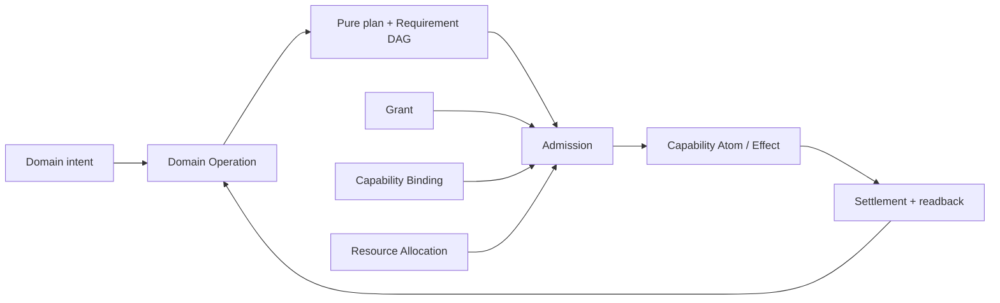
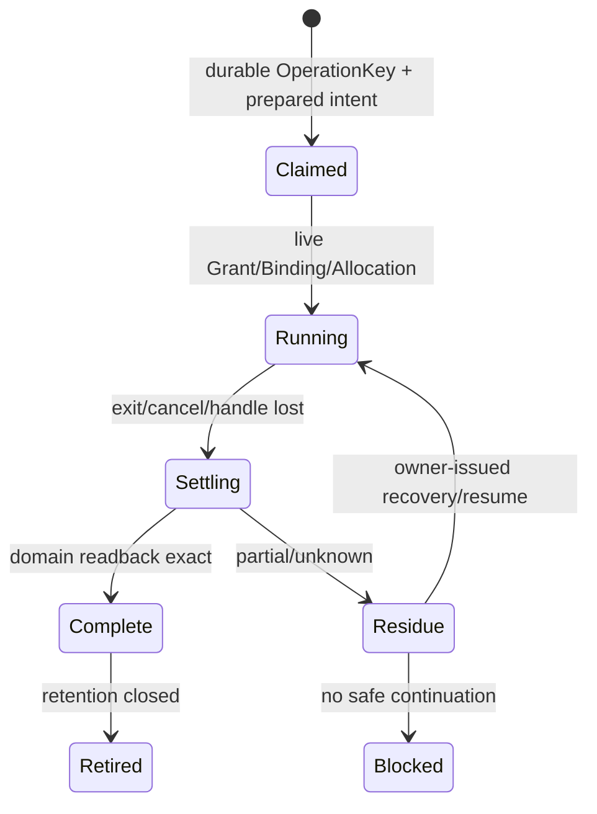
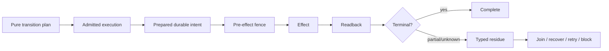

# 工程 Operation、资源与恢复原则

本片段拥有跨项目通用的 Domain Operation / Capability Atom / Effect worker / durable state / recovery 原则。资源的具体 algebra 不在宪法重复：`ResourceDimensionContract` 与 `Consumable | Lease | Gauge | ReplenishingRate | ExternalQuota` 由 `docs/system-architecture/resource-accounting.md` 唯一拥有；本文件只规定工程设计必须声明并遵守它们。

## 5. Domain Operation 与 Capability Atom



| unit | owns | does not own |
| --- | --- | --- |
| Domain Operation | intent、invariant、Requirement DAG、pure decisions、business terminal mapping | executable discovery、credential、process mechanics |
| Pure Plan | immutable definition/input/observation closure、ordering/readback/recovery/resource requirements | live Grant、Provider handle、Allocation、preimage |
| Capability Port | requirement/provision contract、failure/settlement shape | provider implementation、business selection |
| Capability Atom | 一个可替换 external/physical Effect mechanism | cross-domain policy、product success |
| Operation Orchestrator | admitted DAG ordering、binding/allocation consumption、recovery/readback | new domain truth、second provider owner |
| Interface | typed intent/result projection | resolver、Effect、state owner |

“所有逻辑集中一个脚本”和“每条命令一个wrapper”都不是目标。边界由 semantic operation 与不可再分 Effect/settlement contract决定。

### 5.1 Atom 不是 command

```text
CapabilityAtom = {
  provisionIdentity,
  admittedInputs,
  physicalBinding,
  resourceDimensionRefs,
  startBoundary,
  cancellation,
  outputProtocol,
  settlementObligations,
  recoveryReadback,
  terminalReceipt
}
```

shell command、SDK method、HTTP request都只是某 Atom 的 Provider realization；只有新增 identity/authority/resource/settlement/failure semantics 才需要新 Atom contract。

## 6. Resource principles

进程、线程、句柄、文件描述符、锁、连接、容器、内存、CPU、I/O、network、input/output 都是需要 allocation/measurement/settlement 的资源，但**不是同一种 accounting law**。

```text
EngineeringResourceRequirement = {
  dimensionRef,
  acceptableAccountingMode,
  requiredCeilingOrReservation,
  safety/service constraints,
  settlement/readback requirements
}
```

工程不变量：

1. 每个 demand 必须匹配 parent ledger 中同 unit / mode-compatible 的 DimensionContract；
2. absolute monotonic deadline 由顶层 operation 一次派生，child 只能收窄；
3. CPU time/累计bytes/requests 等 Consumable 单调计量；
4. process slot/lock/connection/handle 等 Lease 必须在 terminal 释放或保留 typed residue；
5. memory/temp occupancy 等 Gauge 允许 current 上下变化，同时约束 ceiling/peak/terminal baseline；
6. rate-limit按明确 refill clock/window演进；retry 不重置；
7. external quota 要绑定 exact principal/provider/epoch readback，unknown 不等于 unlimited；
8. cleanup/recovery继续消费同一 operation ledger；
9. 新品牌/资源实例只新增 DimensionContract/Binding，不给 core 加 `if resourceName/provider`。

### 6.1 Concurrency / backpressure

```text
ConcurrencyPolicy =
  serial
  | singleFlight(key)
  | parallel(disjointSemanticAndResourceSets)
  | join(existing)
```

同一个 non-reentrant session顺序执行；并行需要 owner证明 semantic state、authority、writer、lease/resource decision可组合。并发上限只是 capacity，不是需要占满的配额。

## 7. Durable Local Effect Worker

可能跨调用者生命周期、主机重启、超时或丢句柄的 Effect 需要 durable worker；普通短命令不自动升级。



```text
DurableEffectRecord = {
  operationKey,
  purePlanRef,
  liveAdmissionRef,
  exactPreimage,
  attemptEpoch,
  progressObservationRefs,
  settlementObligations,
  terminalOrResidue,
  readbackRefs
}
```

lost handle 后先读取 domain state/journal/provider。exact applied → terminalize；conclusively not applied → new retry admission；partial/unknown → residue/recovery。PID不存在、lock缺失或launcher报错都不能证明 not-applied。

## 8. Durable State / Schema / Parser

```text
one schema identity
+ exact canonical byte grammar
+ one writer
+ one strict parser
+ provenance/subject/producer binding
+ unknown/duplicate/trailing rejection
+ durable publication/readback
+ migration/retirement owner
```

mature schema/validation libraries可以实现语法机制，但不能取得领域字段/meaning/evolution ownership。

Version只有真实 durable/external consumer需要区分多个可观察 grammar/protocol state时成立；否则 version field、Vn suffix、dispatcher、alias都应删除。`revision / generation / epoch / version` 不能用一个数字混写。

## 9. Recovery / compensation



Recovery 是原 state machine 的一部分，不是异常脚本。未知/不安全 read不能折叠成 absent/mismatch/cache miss；rollback只覆盖本 operation仍拥有且 preimage匹配的 state；跨revision补偿由 Change Management裁决。

## 10. Local evolution principle

新 Provider、runtime、resource dimension、failure kind、storage backend进入系统时：

```text
existing semantic Operation/Requirement
+ new Provision/Dimension/Binding/Settlement implementation
→ local consumer cutover
→ old realization retirement
```

只有新需求无法由现有 Operation/Capability/Resource/Recovery algebra无损表达时才演进宪法/系统 root；新增实例本身不能成为理由。

## 11. 完成

```text
OperationRuntimePrinciplesClosed =
  pure plan and live admission are disjoint
  and every Effect uses one typed capability boundary
  and every resource demand has a mode-compatible parent contract
  and deadline/cancellation propagate monotonically
  and every attempt settles/readbacks or retains typed residue
  and durable state has one schema/writer/parser/evolution owner
  and lost-handle recovery never blind-replays
  and new instances extend bindings/contracts locally rather than core switches
```

<!-- sec-clause {"id":"engineering-operation-runtime","blocker":null,"kind":"stable-decision"} -->
## 规范片段

工程 Operation 必须分离Pure Plan与live Admission；Capability Atom由不可再分Effect/settlement边界决定。资源先匹配ResourceDimension accounting mode而不是统一Consume/Return；lost handle、partial publication与cleanup均通过原state machine/readback收敛。新Provider/资源/运行时只增加Provision/Dimension/Binding realization，不能让core增加品牌分支。
