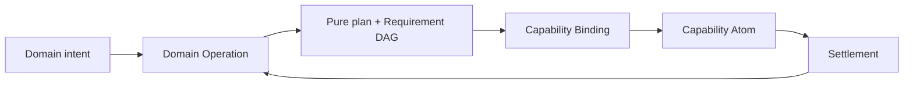
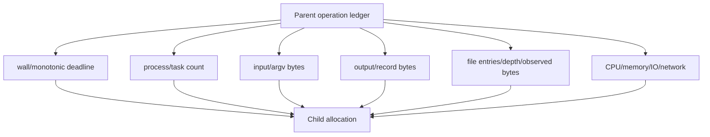
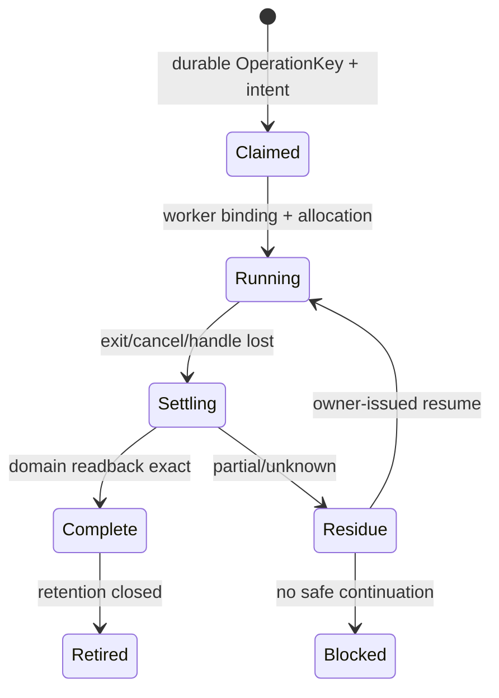
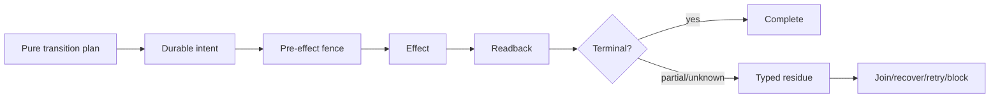

# 工程 Operation、资源与恢复原则

本片段拥有领域 Operation、能力原子、资源守恒、Effect worker、持久状态与恢复原则。

本片段与 [owner root](../engineering-constitution.md) 共享同一 domain，但只拥有 registry 分配给本片段的 ownership keys；跨片段语义使用引用，不复制定义。

## 5. 领域 Operation 与能力原子



| 单元 | 拥有 | 不拥有 |
| --- | --- | --- |
| Domain Operation | intent、invariant、Requirement DAG、纯决策、业务终态 | executable、credential、process mechanics |
| Capability Port | requirement/provision contract、failure/settlement shape | provider implementation、业务选择 |
| Capability Atom | 一个可替换外部 Effect 机制及物理边界 | 跨领域流程、产品策略、成功宣称 |
| Operation Orchestrator | DAG ordering、Binding、Allocation、recovery、readback | 新领域真值、第二 provider owner |
| Interface | typed intent/result projection | domain resolver、Effect、state owner |

“所有逻辑集中在一个脚本”与“每个行为一个 wrapper”都不成立。正确切分是：纯领域决策集中于 operation；Effect mechanics 聚合为少量高复用 capability atoms；编排只消费 typed ports。

### 5.1 原子不是一条命令

```text
CapabilityAtom = {
  provisionIdentity,
  admittedInputs,
  physicalBinding,
  resourceDimensions,
  startBoundary,
  cancellation,
  outputProtocol,
  settlementObligations,
  recoveryReadback,
  terminalReceipt
}
```

原子边界由不可再分的 Effect/settlement contract 决定，不由 shell 命令、函数长度或文件数决定。

## 6. 资源、进程与截止时间

进程、线程、句柄、文件描述符、锁、连接、容器、内存、CPU、磁盘 I/O、网络、输入和输出都是 allocation；不只是“代码调用”。



```text
ChildBudget = reserve(parentRemaining, childDemand)
remaining(t) = min(parentAbsoluteDeadline - monotonicNow, reservedLocalCeiling)
```

规则：

- absolute deadline 由顶层 operation 一次派生；锁、发现、扫描、命令、readback、cleanup 消费同一 ledger；
- `signal` 在每次等待、Effect admission、分段处理和 cleanup 检查；
- 静态 timeout 只是 ceiling，不能扩大 parent remaining；
- 预算维度由风险和 Requirement 选择，不机械要求所有操作全量预扫；
- entries/bytes 在实际流式观察中计量，禁止为了“先数一遍”额外全遍历；
- 内容 identity 可用增量 hash、文件元数据+readback、Merkle/fact shards，但 cache hit 必须绑定 exact producer/environment；
- cleanup 也受 settlement policy 约束；主错误和 cleanup residue 分开保存。

### 6.1 单飞、并发与背压

```text
ConcurrencyPolicy = serial | singleFlight(key) | parallel(disjointResources) | join(existing)
```

同一个不可重入 session 内的请求顺序执行；需要并行时由 owner 签发可并行 provision 或多个独立 binding，不能由 caller 放宽原子合同。并发度由依赖、资源和 settlement 风险决定，不由线程上限决定。

## 7. Durable Local Effect Worker

长生命周期或可能丢失 caller handle 的 Effect 需要 durable worker；普通短命令不自动升级为 worker。



```text
DurableEffectRecord = {
  operationKey,
  intentDigest,
  grantRef,
  bindingRef,
  allocationRef,
  exactPreimage,
  attemptEpoch,
  progressFacts,
  settlementObligations,
  terminalOrResidue,
  readbackRefs
}
```

lost handle 后先读 domain state 和 durable record：exact applied→合成 terminal；conclusively not applied→owner 可发 retry；partial/unknown→residue。PID 不存在、锁文件缺失或 launcher 报错都不能证明“未执行”。

## 8. 持久状态、Schema 与 Parser


持久/跨进程/外部合同必须有：

```text
one schema identity + literal type
+ one strict parser
+ exact writer
+ unknown/duplicate/trailing rejection
+ provenance and producer binding
+ readback
+ migration/retirement policy
```

成熟 schema/validation library用于实现语法和类型约束；领域 owner 仍拥有字段、不变量和迁移。手写通用 JSON/YAML/parser 只有在成熟机制无法满足 exact bytes、duplicate keys、streaming、physical binding 或安全边界时才成立，并必须有存在证明。

版本只在真实 consumer 需要区分至少两个可观察状态时存在：

```text
VersionRequired iff
  durableOrExternalBoundary
  ∧ distinctStates≥2
  ∧ readerOrMigrationActuallyBranches
```

否则删除版本字段、`Vn` 后缀、dispatcher、alias 和数字镜像测试。需要版本时由 contract owner 定义，writer/reader 引用同一 identity；正常路径只接受当前代，旧 parser 只存在于一次迁移入口。

## 9. 状态、恢复与补偿

`StateTransition`的exact合同由System Architecture的lifecycle owner定义。这里仅要求`transitionAdmitted(t)`同时具备唯一state owner、exact preimage、合法from/to edge、operation identity、effect/settlement/readback、recovery与retirement；缺一项就不能提交状态变化。



恢复是原状态机的一部分，不是异常脚本。未知或不安全读不能折叠成 absent/mismatch/cache miss；只有明确 absent/mismatch 才允许 materialize/recreate。
