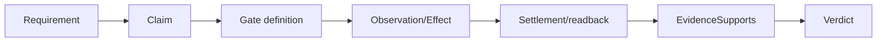
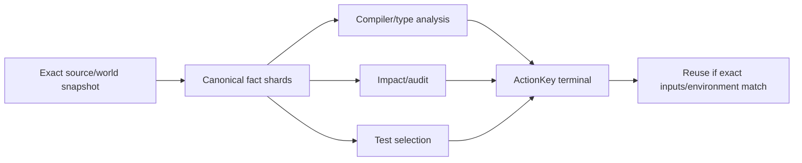
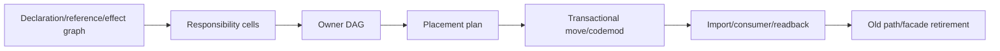
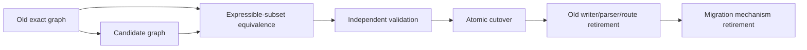

# 工程证明、性能与演进原则

本片段拥有 Evidence、测试、性能、外部能力、源码布局、演进、工程编译与对抗完成原则。

本片段与 [owner root](../engineering-constitution.md) 共享同一 domain，但只拥有 registry 分配给本片段的 ownership keys；跨片段语义使用引用，不复制定义。

## 10. Evidence、测试与证明



### 10.1 测试价值

保留测试必须至少观察一项：

| Class | 观察对象 |
| --- | --- |
| behavior | 公共输入/输出/业务状态 |
| durable | 写入→strict readback→identity/digest/invariant |
| effect | 真实 Effect、zero-effect sentinel、settlement |
| failure-boundary | typed failure、abort、CAS、unknown、residue |
| algorithm-property | 等价、单调、不变式、扰动、闭包 |
| protocol | 外部/跨进程 producer-consumer |

仅复制源码文本、路径列表、函数 arity、实现数组、文件数、版本数字或自写 schema 的测试不产生业务证明。精确数字只有在其本身是 effect/status/budget/protocol/durable cardinality 合同时才保留；否则从 canonical owner 派生关系或改测集合性质。

### 10.2 测试裁决

```text
KEEP    := unique required observation
REWRITE := value remains, current boundary mirrors implementation
MERGE   := another test proves same or stronger semantic/effect/failure closure
DELETE  := producer/consumer/external/future obligation zero
UNKNOWN := evidence insufficient; cannot claim deletion or value
```

测试数量下降或名称过时不证明可删；业务尚未实现也不证明测试无价值。先区分 accepted Definition、future obligation 和 obsolete graph。

## 11. 性能与增量计算



```text
ActionKey = digest(
  semanticInputs,
  sourceSnapshot,
  algorithm/provider identities,
  dependency generation,
  environment/toolchain,
  policy/claims
)
```

优化顺序：

1. 删除重复 owner、重复观察、重复解析和无消费者工作；
2. 多 consumer 复用同一 exact snapshot/fact shards；
3. 进程内增量服务编辑查询，跨进程使用可验证 content-addressed facts；
4. 复用 authenticated in-flight、fresh terminal 和 deterministic failure；
5. 只运行 `RequiredClosure ∩ MissingOrStale`；
6. 对 cold/warm/delta 做可重现实测并验证 byte-equivalence；
7. 只有存在长期查询与生命周期 owner 时才引入 daemon，不以 daemon 复制 truth。

cache 是派生加速层，不是 correctness owner。mtime、路径、进程内对象或“上次 PASS”不足以构成 hit。

## 12. 外部能力与成熟轮子

```text
AdoptExternalCapability iff
  requirementGapReal
  ∧ stableMachineInterfaceAvailable
  ∧ provenance/security/license acceptable
  ∧ operation/resource/settlement integrable
  ∧ lifecycleCost lower than owning equivalent
```

默认直接消费最窄稳定 machine interface；不为每个命令、SDK 或库建立一对一镜像 wrapper。薄 adapter 只在下列边界有新增价值时成立：

- protocol/format normalization；
- credential/principal/endpoint binding；
- retained physical capability；
- resource/cancellation/settlement；
- domain-specific error algebra；
- provider replacement/conformance；
- migration/retirement。

presentation、shell 文本、全局环境和 PATH 不能签发语义或 Effect authority。外部工具产生 observation，不产生产品成功或独立完成。

## 13. Source、仓库与物理布局

逻辑结构先于路径；路径是编译结果。

```text
place(unit) = f(
  responsibilityCell,
  dependencyLayer,
  visibility,
  lifecycle,
  runtimePackaging,
  changeCohesion,
  generatedOrAuthored
)
```



规则：

- authored executable source 进入一个 canonical source root；tests/docs/assets/generated/runtime state 各有独立 lifecycle root；
- 目录名表达 responsibility，不表达历史组织、工具名或临时迁移；
- 文件按 declaration cohesion、变化协同和 boundary 拆分，不按行数机械切割；
- 同一 cell 可有 contract/domain/operation/provider/runtime 子层，但不建立空目录和空 index；
- 自动重构消费 compiler/LSP/AST 的 symbol/reference graph；文本替换仅处理无语义载体；
- move plan 绑定 old/new graph、消费者、生成物、配置、测试和退役清单；
- 迁移完成要求 old path consumer-zero，不留 alias、barrel 或长期兼容层。

## 14. 演进与唯一代际

唯一代际是运行权威约束，不是“永远没有历史”。

| 层 | 可并存 | 不可并存 |
| --- | --- | --- |
| design proposal | 多个 competing models | 多个都称 canonical |
| migration input | old immutable evidence + new candidate | normal path 双读双写 |
| runtime | 一个 active writer/parser/resolver | 同 identity 多 active generations |
| verification | old/new equivalence Evidence | 新模型自证 cutover |
| archive | retired immutable records | archive 重新获得 Effect authority |



## 15. 工程设计伪编译

```text
compileEngineeringDesign(input):
  graph := buildCausalGraph(input.outcomes, input.definitions, input.observations)
  dispositions := graph.nodes.map(counterfactualClassify)
  ownerDag := assignUniqueOwners(graph)
  assertAcyclic(ownerDag)
  requirements := compileRequirementDag(graph)
  provisions := resolveEligibleProvisions(requirements)
  resources := compileParentLedger(requirements, provisions)
  transitions := compileStateMachines(graph, resources)
  proofs := compileClaimsAndEvidence(transitions)
  evolution := compileCutoverAndRetirement(graph, input.futureObligations)
  attacks := modelCheck(allPrinciples, graph, transitions, proofs, evolution)
  alternatives := reduceDominatedDesigns(graph)
  return verdictOrExactFrontier(...)
```

```text
executeEngineeringPlan(plan, ports):
  // 不属于纯设计编译器；只能消费 admitted plan
  for step in topological(plan.requirementDag):
    binding := ports.bind(step.requirement)
    allocation := ports.reserve(binding)
    ticket := admitEffect(step, binding, allocation, freshReadback())
    attempt := ports.execute(ticket)
    settlement := ports.settle(attempt)
    require terminal(settlement) or record typed residue
```

## 16. 工程对抗矩阵

| 场景 | 根设计 | 必须证明 | 禁止 |
| --- | --- | --- | --- |
| 同一领域出现两套 resolver | 唯一 owner + consumer migration | old consumer-zero | 互相 fallback |
| contract facade 反向 import | 合同下移或依赖反转 | DAG 无环、surface 仍满足 consumer | callback/type-only 隐藏环 |
| public test seam 可进生产 | production/test capability 分型 | origin gate + zero production import | 注释/函数名作门禁 |
| 读错误折叠为 cache miss | discriminated readiness | unknown→typed block、zero Effect | catch-all false/null |
| 每层重置 timeout | parent absolute ledger | all steps/cleanup consume remaining | timeout 相加 |
| 长 Effect caller 断开 | durable worker/readback | at-most-once + lost-handle recovery | 自动重复启动 |
| 版本字段只有数字测试 | consumer/version census | real branching or delete | 换一个数字/alias |
| future abstraction 无 consumer | FutureObligation | activation/cost/retirement | active empty shell/盲删 |
| 测试读取源码路径 | behavior/graph-derived assertion | public/effect/property boundary | 文件存在/路径清单自证 |
| 大目录扫描 | streaming shared ledger + incremental facts | entries/bytes/depth/time/abort | 预先全扫两遍 |
| 类型检查重复变慢 | one snapshot/facts/ActionKey | cold/warm/delta equivalence | 第二 checker/daemon truth |
| 容器启动锁错误 | capability/resource/lifecycle owner | root discovery、single claim、terminal readback | 随机重试/只抬等待 |
| workspace 并发改动 | exact preimage + ownership + CAS | unrelated state preserved | reset/format/all-stage |
| 外部工具已有成熟能力 | direct stable interface or justified thin adapter | gap/cost/retirement | 自写低质替代/镜像 API |
| 文件架构迁移 | graph-derived placement transaction | imports/config/tests/old paths closed | 手工来回改路径 |
| 业务未完成 | accepted Definition + future obligation | missing behavior explicit | 用“无 consumer”删掉目标能力 |

## 17. 工程设计完成

```text
EngineeringDesignClosed =
  every accepted outcome has a complete causal path
  ∧ every relation has one semantic owner
  ∧ owner/reference/effect graphs are acyclic or explicitly state-machine cycles
  ∧ every Requirement has exact provision/unavailable semantics
  ∧ every Effect has shared resources, settlement, readback and recovery
  ∧ durable contracts have strict owner/parser/migration
  ∧ proofs cannot be self-issued
  ∧ performance reuses exact facts without creating second truth
  ∧ future obligations are explicit and bounded
  ∧ physical layout is derived from responsibility and lifecycle
  ∧ every applicable adversarial scenario has a legal terminal outcome
  ∧ no duplicate owner, mirror, dominated mechanism or unretired generation remains
```
