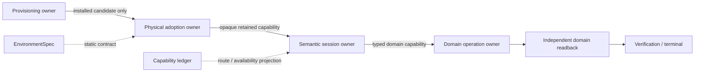
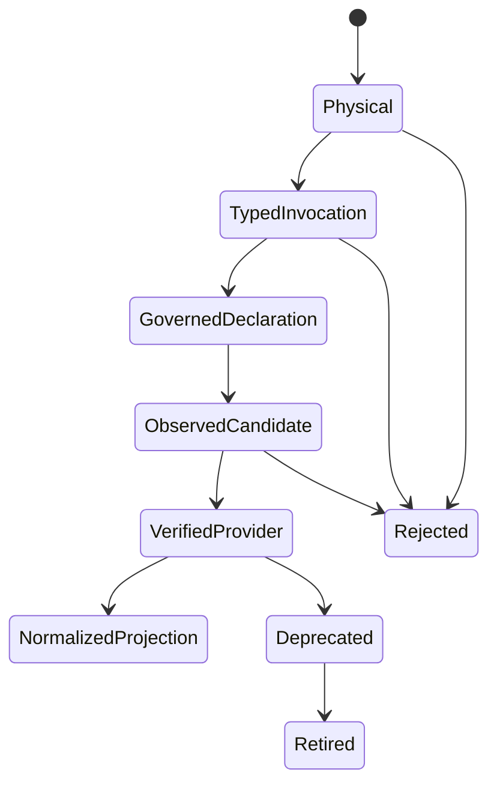
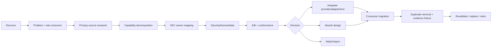
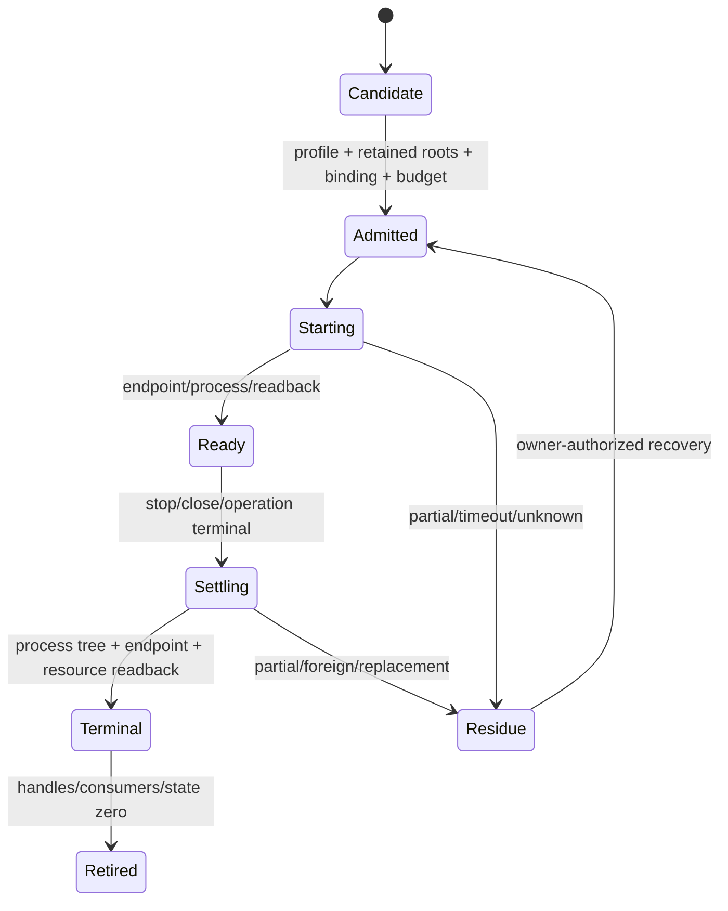

# 外部 Provider 政策

本文拥有外部工具、compiler/LSP、分析器、类库/SDK、runtime、container、MCP、构建/测试/发布服务的采用、隔离、conformance、替换与退役规则。具体品牌、版本、路径、endpoint、credential、availability 和 current route 只存在于 external capability ledger、machine EnvironmentSpec 与 live receipts；本文不复制。

## 1. 核心目标

```text
Adopt mature capability
→ preserve SEC semantic/authority/resource/proof boundaries
→ migrate consumers
→ delete dominated custom implementation
```

“成熟轮子优先”不等于“裸调用”：外部能力可以供应 Provision 或 Evidence，不能拥有 SEC 的业务 Definition、Responsibility、Resolution Decision、authority、Compatibility、Verification、publication 或 completion。

## 2. Authority DAG



| Layer | Owns | Must not own |
| --- | --- | --- |
| Provisioning | install/upgrade/uninstall/distribution cache | repository/credential/domain Effect authority |
| Physical adoption | candidate discovery、retained executable/cwd/loader closure、physical identity | semantic operation、business result |
| Semantic session | repository/endpoint/principal/credential/deadline/budget-bound Git/GitHub/compiler/etc. capability | product decision、install |
| Domain operation | Requirement、OperationKey、business Effect/readback/recovery | executable discovery、ambient credential |

production runtime 只采用已存在 capability。discovery/session open/health/cache/recovery 不得下载、安装、解压或复制发行版；缺失或无法证明时返回 typed `unsupported | unavailable | unknown`，由独立获权 provisioning operation 处理。

## 3. Capability 分解

外部项目按可独立替换的能力而非品牌整体决策：

| Capability family | Examples of supplied facts/effects |
| --- | --- |
| Language frontend | parse、type、symbol、reference、module resolution |
| Code index/graph | caller/callee、dependency、path、reverse/diff impact |
| Deep analysis | CFG/PDG、taint、data flow、security paths |
| Source transformation | AST/LST/codemod、format/comment preservation |
| Runtime observation | trace、coverage、profile、process/network/browser |
| Build/package/test | install、bundle、cache、sandbox、container |
| Policy/schema/solver | validation、compatibility、constraint solving |
| Provenance/supply chain | SBOM、signature、attestation、vulnerability |
| Workflow runtime | scheduling、retry、durability、compensation |
| IDE/visualization/MDE | navigation、projection、structured editing |
| Application capability | HTTP、storage、queue、telemetry、cloud SDK、ORM |
| Agent/MCP | bounded query or operation surface |

使用某项目的 parser 不自动采用其 graph/cloud/MCP/mutation 权限。每个 capability 单独拥有 Requirement、security boundary、decision 和 retirement。

## 4. 外部能力角色

| Role | Purpose | Forbidden authority |
| --- | --- | --- |
| Core substrate | mature library/compiler API under SEC contract | SEC semantic truth |
| Replaceable Provider | syntax/symbol/runtime/build/security/application capability | final selection/Support |
| Adapter | SEC contract ↔ external protocol | business Responsibility、Resolution |
| Reference Provider | minimal conformance baseline | universal default |
| Custom Provider/Governed Extension | user implementation with governed boundary | self-verification |
| Verification/conformance tool | produce Evidence for declared Claim | canonical state |
| Development utility | repository development only | product runtime/public Support |
| Project-specific utility | one corpus/policy/fixture | general product capability |
| Projection | read-only machine/human/Agent view | mutation/authority |
| Watch/rejected/superseded/retired | decision with trigger/rationale | standing fallback |

## 5. Adoption maturity



| `provider-maturity` | Positive claim | Still unknown |
| --- | --- | --- |
| `physical` | package/source/version/integrity/license/install closure known | call shape、behavior、Effect |
| `typed-invocation` | exports/signature/generic/overload/module resolution type-safe | runtime behavior、error、resource、security |
| `governed-declaration` | user/organization declares contract/effect/permission/target | declaration truth until verified |
| `observed-candidate` | analysis/trace suggests provider/adapter mapping with coverage/conflict | adoption/eligibility |
| `verified-provider` | security/license/data + Target conformance + behavior/failure/retirement closed | selection、deployment、Support |
| `normalized-projection` | complete round-trip/validation/migration; old writer removed | only bounded owned subset |

`verified ≠ selected ≠ deployed ≠ product-supported`。复杂 remote/native/dynamic capability 通常长期保持 Provider/Governed Extension，而不是强制反编译为 SEC-owned。

## 6. 采用决策

### 6.1 强制评估流水线



### 6.2 Decision matrix

| Capability gap | Direct stable machine interface sufficient? | SEC-specific boundary added? | Existing custom owner dominated? | Decision |
| --- | --- | --- | --- | --- |
| yes | yes | no | any | direct use; no wrapper |
| yes | no | protocol/credential/effect/resource/settlement | no | thin Adapter/Provider |
| yes | no | canonical algorithm/state boundary | yes | absorb design + migrate + delete old |
| no real consumer | any | no | n/a | reject/watch with trigger |
| conformance/security/license fails | any | any | n/a | reject |
| evidence incomplete | unknown | unknown | unknown | bounded unknown; no install/integration |

长期状态仅允许：

```text
absorb-design | integrate-provider | integrate-adapter
| register-verified-candidate
| use-as-development-tool | use-as-conformance-tool
| retain-project-specific
| watch-with-trigger | superseded | reject-with-rationale | retired
```

`maybe/later/temporarily keep everything` 无效。decision 绑定 problem、consumer、owner、version/license、security/data、Evidence、duplicate deletion、revalidation trigger 和 exit。

## 7. Physical adoption

最小 physical proof 只覆盖本次 invocation 的因果闭包：

| Required | Excluded unless executed |
| --- | --- |
| launcher/effective executable | docs/locales/examples/templates |
| app-local loader dependencies | unrelated helpers/payload |
| resolved system modules | whole installation tree |
| retained cwd | copied executable cache |
| endpoint/generation candidates | presentation status |
| pre/post identity + settlement | path string as authority |

若 executable 会派生 helper/transport child，首次 Effect 前必须绑定 descendant image manifest、loader closure、dispatch grammar、credential principal/permission epoch 与 issuer。只 fence parent 或事后看 child path 不足。

复杂度必须与最小执行闭包成正比，并有 entry/byte/time ceiling。PATH、registry、standard location、caller path 只是 candidate hints；same-path ABA、symlink/junction/reparse、dependency drift、cwd replacement 或 unknown loader 都 fail closed。

## 8. Semantic session

每个 session 绑定：

```text
provider/capability identity
+ exact repository/Target/endpoint
+ principal + credential permission epoch
+ retained executable/cwd/loader/environment
+ OperationKey/Attempt
+ monotonic absolute deadline
+ aggregate process/request/record/input/output budget
+ concurrency mode
+ terminal settlement obligations
```

所有 discovery、credential acquisition、child/request、stream、readback、close 和 cleanup 消费同一 ledger。禁止按 command 重开 timeout、按 cwd 复用 credential、用 mutable tag/name 自签 identity，或 timeout 后只等 parent process 退出。

session 方法在 failure/close 后保持 terminal；close 必须协调 in-flight 或返回可重试 typed settlement，不能先标 closed 再泄漏 retained capability。

## 9. Provider output 与 Adapter

### 9.1 Provider output minimum

| Field group | Required facts |
| --- | --- |
| identity | provider/capability/contract revision |
| scope | source/target revision、subject、coverage、unsupported |
| validity | freshness/invalidation/environment |
| authority | authority class、Effect/permission/network/execution boundary |
| result | typed diagnostics/failure/conflict/unknown |
| evidence | raw artifact digest + normalized refs |
| support | conformance/maturity/retirement refs |

Provider output是不受信输入：adapter canonicalize、strict validate、bound output、strip secrets/host details，并保留受控 raw artifact reference。parse/manifest/typecheck/AI test 成功不自动产生 semantic truth 或 eligibility。

### 9.2 Adapter contract

Adapter 只拥有：

- input/output/type/serialization mapping；
- error/cancellation/timeout/retry/resource mapping；
- Effect/Permission/observability；
- Target-specific lowering；
- conformance + known limitations。

Adapter 不拥有 business Responsibility、package/version selection、Binding Delta、Compatibility、Acceptance 或 publication。不能降低 Contract 适配默认值、吞错、隐藏 Effect/telemetry 或把 provider success 当产品 success。

## 10. Security、License 与 Data

| Attack surface | Required review |
| --- | --- |
| legal | license/patent/copyleft/commercial/redistribution/generated-output rights |
| supply chain | provenance/maintainer/release/signature/dependencies/install scripts/revocation |
| execution | native/FFI/WASM/MCP/browser/container/process/filesystem/network/sandbox |
| credential | source、scope、principal、expiry、argv/log/durable leakage |
| data | uploads、retention、training、region、telemetry |
| output | parser/code/prompt injection、raw diagnostic retention |
| operations | update、incident、offline、fail-closed、uninstall/retirement |

高权限 Provider 不能因“本地”“固定版本”“开源”自动降险。不受信代码执行需要独立 sandbox authority。

## 11. A/B 与 conformance

至少使用 SEC corpus 与差异显著的复杂 brownfield/conformance corpus；同机器、exact版本、相同输入/config、cold/warm 协议比较：

| Quality | Cost/operations |
| --- | --- |
| task success、precision/recall、old-only/new-only/unknown | wall/CPU/memory/disk/network |
| false relation/confidence、coverage/stale behavior | index/build/incremental/recovery |
| behavior/error/effect/resource/Target conformance | calls/tokens/setup/upgrade/maintenance |
| source witness可复核性 | migration/deletion/operational cost |

作者 benchmark 只作候选证据。Conformance 只证明被测试 contract/environment，不证明所有用途。

退役 discovery/compiler/analyzer 时必须做 exact-version shadow difference：

```text
old-only | both | new-only | unknown
```

每个 old-only 被 replacement 吸收为同等/更强 typed behavior，或由 canonical owner判为 dominated。旧工具不可运行、输入未绑定或 unknown 未归属时禁止先删。

## 12. Workflow/container capability

dispatch、repository/check transport 与 compute 是独立 capabilities。Adapter 只有新增 credential isolation、immutable execution identity、sandbox、remote/local CAS、destructive-resource ownership、settlement/readback 时才成立。

需要启动或采用Provider时，consumer只能请求实现架构定义的`ProviderBootstrapOperation`并消费其opaque live capability；不得在workload adapter内顺手启动daemon、修lock、改context、下载runtime或切换endpoint。provider bootstrap与workload使用不同OperationKey、journal、allocation和terminal；二者只通过exact `ProviderRootBinding`连接。local与remote是重新binding的候选，不是silent fallback，也不共享Evidence身份。

Lifecycle：



provider runtime generation 由 physical owner签发；普通 caller 不按 prefix/glob/name 清理。历史 generation 只在 live handle、consumer、recovery、external contract 和 unknown 全零后由 authenticated GC 删除。

breakaway child capability 绑定 exact operation/attempt/provider，不可移植。parent/job settled 不等于 child/provider terminal。

## 13. Failure、offline 与 fallback

| Failure | Result |
| --- | --- |
| provider unavailable/partial/stale | explicit unsupported/not-run/unknown；不返回空或旧 positive |
| current-epoch explicit unavailable | circuit breaker prevents identical retry |
| unknown availability | no positive claim；已有合法 operation 可实际调用并用 response/readback产生 Evidence |
| alternative provider exists | new candidate重新 eligibility/Resolution；不静默 fallback |
| Gate requires provider | unavailable/failed；绝不 fake PASS |
| cleanup/close failure | preserve primary failure + each settlement/residue |
| physical identity drift | typed unavailable/unknown before Effect or recovery-required after Effect |

availability 只影响 binding；不能签发 Effect authority、Review、merge 或 completion。remote outage 不改变 domain Requirement，合法 local Provider 可替换但必须满足同一 proof。

## 14. Agent/MCP 工具面

| Need | Maximum standing surface |
| --- | --- |
| known file/symbol/error | native file/search/Git/compiler capability |
| unknown cross-file context | one context Provider |
| architecture/IR/large diff | one architecture Provider on demand |
| taint/data-flow/security | specialized security Provider |
| full Brownfield census | orchestrated providers, not all exposed to Agent |

功能重叠 MCP 不同时常驻。MCP默认只暴露 bounded query/explicit operation；任意 shell/write/setup/credential/unbounded query 仍需对应 SEC operation authority。

## 15. 集成、替换与退役

| Decision | Integration rule |
| --- | --- |
| integrate-provider | consumers depend on SEC contract；brand/format isolated |
| integrate-adapter | protocol conversion only；no semantic/decision authority |
| absorb-design | extract verified generic algorithm/state into unique owner；delete duplicates |
| dev/conformance tool | excluded from product runtime/API/support/data; remove config/cache on exit |

```mermaid
flowchart LR
  F[Freeze new use] --> C[Consumer/binding/evidence census]
  C --> R[Replacement or unsupported Decision]
  R --> D[Binding Delta + Impact]
  D --> M[Compatibility + Migration]
  M --> V[Parity/conformance/readback]
  V --> X[Remove dependency/config/cache/permissions/routes]
  X --> I[Invalidate eligibility/Evidence/Support]
  I --> H[Preserve historical decision only]
```



“保留备用”只有真实 failover contract、independent health/freshness、re-resolution 和定期 physical proof 时成立；否则是 duplicate authority。

## 16. 无代码逻辑验证

| Scenario | Required result | Forbidden shortcut |
| --- | --- | --- |
| tool已安装但exe来源不可证明 | unavailable/unknown；zero spawn | PATH direct execution |
| session deadline已过 | zero discovery/credential/child | 先扫描再报timeout |
| parent executable可派生helper但无manifest | typed unavailable；zero child/network | 只fence parent |
| Git provider可用、GitHub credential未绑定 | Git read可用；GitHub semantic operation blocked | 共享ambient env |
| provider output parse成功但coverage partial | candidate/unknown | eligible/complete |
| cloud provider outage，本地Provider同contract | new Resolution then execute | proof downgrade |
| close during in-flight | coordinate/typed retry + eventual settlement | mark closed then leak |
| new external analyzer misses old-only finding | retirement blocked | delete old config first |
| external library only supplies typed signature | `provider-maturity.typed-invocation` + opaque behavior | product-supported |
| adopted tool增加wrapper/graph/cache且旧owner仍live | dominated integration | “standard tool”豁免 |
| test issuer session reaches production consumer | origin rejection + zero Effect | structural shape acceptance |
| cleanup of one root fails | settle all held resources + residue set | abort remaining cleanup |

## 17. 完成判据

```text
ProviderIntegrated =
  real capability gap + consumer
  ∧ unique SEC owner
  ∧ security/license/data accepted
  ∧ physical + semantic binding closed
  ∧ A/B/conformance thresholds met
  ∧ failure/coverage/freshness visible
  ∧ operation deadline/resource/settlement/readback closed
  ∧ consumers migrated
  ∧ dominated implementations/routes/caches/tests removed
  ∧ upgrade/revalidation/replacement/retirement defined
```

`installable | typed | governed | observed | verified | selected | deployed | product-supported` 必须分别显示，任何状态不能冒充后继。
