# SEC 实现架构与意图编译

本文拥有 SEC 逻辑架构到未来工程实现的唯一映射：组件、数据与部署拓扑，实体实现、声明归属、依赖可见性、源码与包的放置、运行机制、性能模型、变更局部性、意图到代码、手写与生成边界、任意工程反编译、迁移和退役。

本文不拥有产品目标、领域语义、通用原则、运行时状态、具体 Target lowering 或当前源码清单。上游分别是 `docs/product.md`、`docs/design-calculus.md`、`docs/engineering-constitution.md` 和 `docs/system-architecture.md`；面向用户工程的 Target Program/Backend lowering 由 `docs/compiler-target-ir.md` 拥有；实际声明、引用、Effect 与 unknown 由 exact Source Program 观察。

## 1. 统一模型与所有权边界

统一不是把所有逻辑放入一个模块，而是让所有投影引用同一组 semantic identity、relation 和 revision。

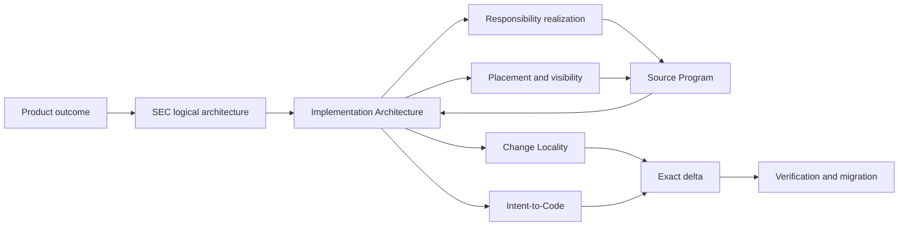

| Owner | 拥有 | 不拥有 |
| --- | --- | --- |
| Design Calculus | relation、constraint、transition、proof 的通用演算 | SEC 实体、路径、实现 |
| Engineering Constitution | 通用工程不变量与拒绝语义 | SEC 领域事实、源码结构 |
| SEC System Architecture | logical responsibility、authority、operation、resource、lifecycle、proof | declaration/file/package 的物理实现 |
| Implementation Architecture | logical→implementation 映射、局部变更、生成和迁移 | 产品决策、领域字段、当前事实 |
| Domain owner | Definition、state machine、domain operation、failure algebra | 文件位置、Provider 实现、工作流 |
| Source Program | exact declarations/references/effects/unknown observations | semantic owner、permission、业务价值 |
| Compiler Target IR | 用户工程的 Target Program、Resolution、Binding、lowering | SEC 自身仓库组织与变更 admission |

实现架构只产生 `ImplementationPlan`、`PlacementDecision`、`ChangePlan` 与 typed frontier；它不能签发产品 Definition、AuthorityGrant、EffectTicket、Evidence verdict 或完成状态。

### 1.1 全系统分层与构件类别

SEC 的层级按“谁能定义什么”划分，不按目录、工具或运行进程划分。依赖只沿已声明 contract 向下实现；运行结果只能以新 observation/result/revision 返回上层，不能用反向 import 或 mutable callback 改写上游事实。

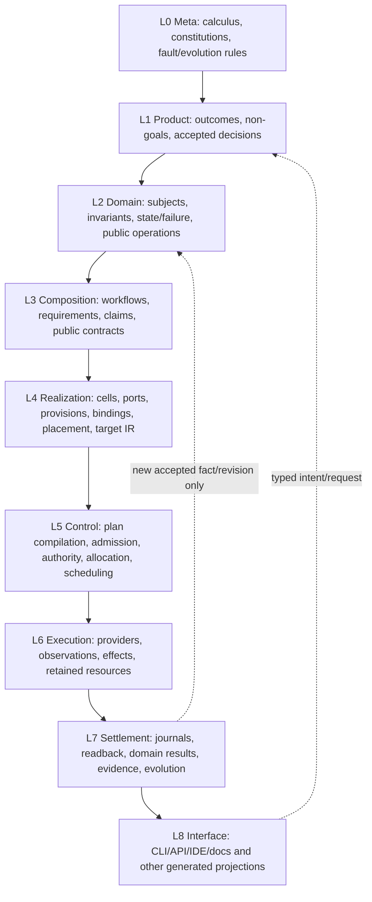

| Layer | Authored truth / authority | Derived implementation | 禁止反向拥有 |
| --- | --- | --- | --- |
| L0 Meta | relation、principle、fault/evolution semantics | validators/model checks | 产品偏好、领域字段 |
| L1 Product | outcome、non-goal、accepted tradeoff | capability closure/request | path、Provider、代码结构 |
| L2 Domain | Definition、Invariant、StateMachine、FailureAlgebra、DomainOperation；Authority/Resource等support Domain在此定义policy与state语义 | domain contract/result types | workflow、物理实现、Evidence verdict |
| L3 Composition | WorkflowDefinition、Requirement、Claim、public relation | PureWorkflow/OperationPlan | child private state、Provider、Grant |
| L4 Realization | accepted ImplementationDecision/Target/Profile | Responsibility Cell、Provision、Binding、Placement、source/config/test/doc IR | 新业务语义、运行 Authority |
| L5 Control | 无新Definition；只消费issuer-signed Grant、capacity facts、compiled admission contract与resource ceilings | ExecutionPlan、AdmittedExecution、tickets、ready set | Authority/Resource policy、Effect结果、domain success |
| L6 Execution | 无新的 authored truth | retained Provider attempt、Effect/Observation、resource consumption | policy、Definition、self-proof |
| L7 Settlement | state/evidence/evolution owner各自的合法 transition | journal、settlement、readback、DomainResult、Verdict、migration receipt | 改写原 plan、补签 Authority |
| L8 Interface | public interface contract | projection、serialization、human/Agent view | 重算业务、绕过 admission |

层与构件类别是两个正交维度；并非表里每个名词都要成为 class、文件或运行实体：

| 构件类别 | 例子 | identity/lifecycle | 实现形态 |
| --- | --- | --- | --- |
| semantic entity | Subject、Domain、DomainOperation、Provider、Attempt | 有稳定 identity；按自身状态机演进 | contract/type + owner implementation |
| typed relation | Requirement、Provision、Binding、EvidenceSupports | 连接 entity；不能冒充节点 | exact refs/edge record |
| invariant/policy/constraint | state guard、eligibility、resource ceiling | 随 owner revision 演进 | pure predicate/decision table/schema |
| algebra constructor | `invoke`、`sequence`、`parallel`、`await` | 不是业务实体；是 closed meta-model syntax | discriminated AST node |
| compiled artifact | PurePlan、ExecutionPlan、PlacementDecision、ChangePlan | content-addressed、immutable、可 stale | canonical value/record |
| live capability | ExecutionCapability、retained session、ticket、Allocation | opaque、scoped、expiring、必须 settlement | internal object/OS handle |
| durable observation | journal record、settlement、readback、Evidence | append/CAS、strict parse、retention | durable canonical record |
| projection | CLI JSON、docs、indexes、human view | 派生且可重建 | generated bytes；不返写 truth |

因此“流程构件”属于 L3 的代数语法；某次编译出的 workflow plan 是 L3/L5 间的 immutable compiled artifact；执行中的 workflow session 才是 L5/L6 的 live entity。把三者压成同一个可变 `Workflow` 对象会同时制造第二 Definition、运行时热改和不可恢复状态。

### 1.2 逻辑—实现对应关系

逻辑架构与实现架构不是按节点或文件一一同构，而是一个可验证的 refinement relation：

```text
Realizes : ImplementationEntity → exactly one ResponsibilityCell or InfrastructureCell
Materializes : LogicalRequirement → one or more ImplementationEntities | required-unmaterialized
Preserves : ImplementationTransition → LogicalInvariant / StateTransition / FailureSemantics
Projects : LogicalFact → zero or more derivable public/generated views
```

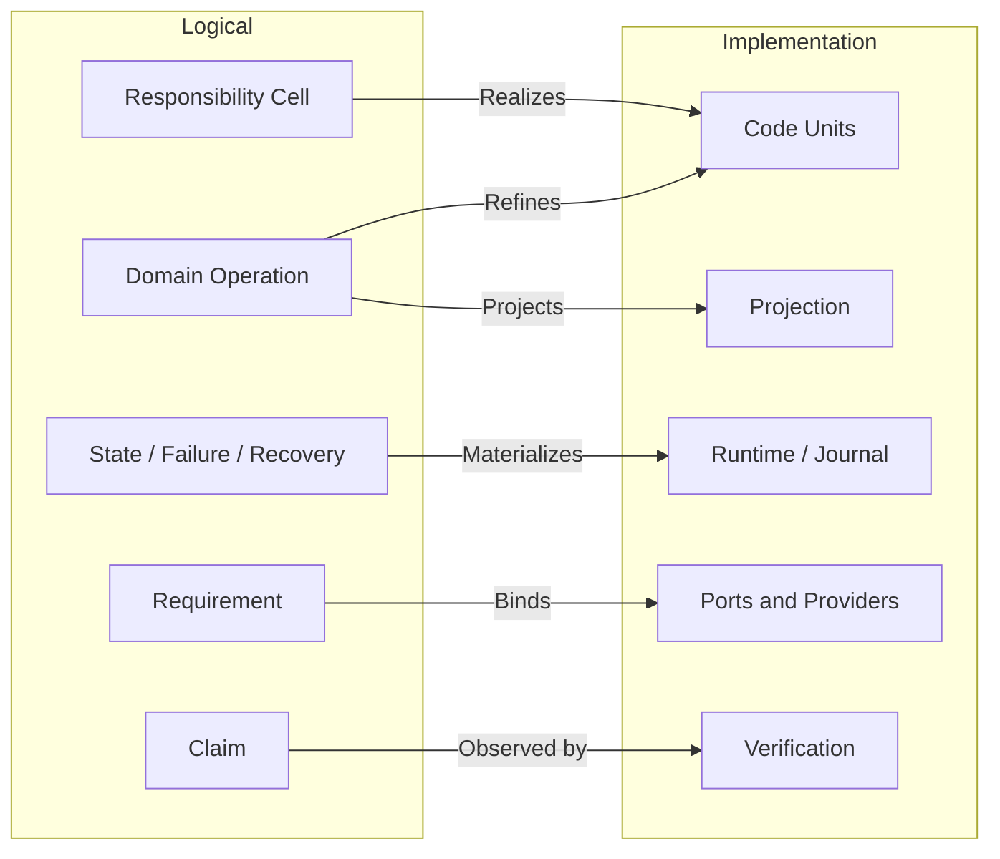

允许的非一一关系：

- 一个 Cell 由多个高内聚 CodeUnit 实现；
- 多个 Operation 复用同一个满足合同的 capability Provider；
- 一个 logical fact 产生多个 deterministic projections；
- 同一实现算法可在不同 Target/Profile 下形成不同 Binding。

禁止的非一一关系：

- 一个 authored declaration 同时拥有两个不相干的 Responsibility；
- 同一 writer/parser/resolver/terminal/Effect identity 有多个 active owner；
- 实现新增 logical model 未声明的 Authority、Effect、state 或 failure；
- logical Requirement 在实现中被路径、环境、fallback 或 presentation 偷换；
- 多个手写 projection 反向成为并列事实。

### 1.3 完美对应的判据

“完美对应”指 semantic completeness 与 observational refinement，不指目录形状相同：

```text
PerfectCorrespondence =
  totalLogicalMaterialization
  ∧ uniqueImplementationOwnership
  ∧ publicBehaviorRefinement
  ∧ effectAndAuthorityNonAmplification
  ∧ stateFailureRecoveryPreservation
  ∧ exactTraceabilityBothDirections
  ∧ noUnexplainedImplementationSurplus
  ∧ boundedExplicitUnknowns
```

| 失配 | 含义 | 结果 |
| --- | --- | --- |
| logical node 无实现 | 尚未完成或明确未来义务 | `required-unmaterialized` |
| implementation node 无 logical owner | orphan、重复轮子或隐藏权力 | reject/retire |
| logical edge 未在实现保持 | requirement/state/failure 被丢失 | reject |
| implementation 多出 Authority/Effect | 权力放大 | reject |
| 多个实现竞争同 identity | duplicate owner/generation | migrate/cut over |
| 地址变化但 relation 不变 | 纯 placement delta | semantic no-op |
| Provider 变化而 contract 不变 | Binding delta | impact/conformance only |
| 无法解释的 dynamic/opaque edge | observation frontier | bounded unknown |

双向 trace 必须可机器查询：从任一逻辑 Requirement 找到实现 declaration、Binding、Effect、settlement、readback 和 tests；从任一 production declaration/Effect/state record 反查唯一 Cell、Operation、Claim 与 evolution state。

### 1.4 对变化与验证的影响

```text
logical delta       → responsibility/operation/claim impact → implementation delta
implementation delta→ recompiled realization graph          → semantic equivalence or drift
address-only delta  → placement/import/config migration      → no semantic claim reset
binding-only delta  → provider conformance/runtime impact    → no Definition rewrite
schema/state delta  → parser/writer/migration/recovery impact → evolution required
```

验证选择由差异类型决定，不由 changed-file 数量决定。只有 logical correspondence 变化才扩展 semantic claims；纯生成投影或地址变化只验证生成/readback/consumer-zero；Provider/physical变化验证 Binding、Effect、settlement 与环境，不重跑无关业务语义。

### 1.5 归属与最优性判定

```text
Logical(x) iff
  x can be stated without declaration/package/file/provider/runtime Address
  and x must remain true across every valid implementation

Implementation(x) iff
  x selects or constrains a realization of accepted logical facts
  using Source Program, Target/Profile, provider, physical or lifecycle facts
```

| 问题 | 裁决 owner | 输出 |
| --- | --- | --- |
| 用户最终要什么、可接受何种取舍 | Product/Domain | accepted outcome/decision |
| 什么实体、责任、状态、操作、权限和失败必须存在 | logical System Architecture | validated logical graph |
| 哪个逻辑候选满足原则且支配其他候选 | Design Calculus + Project Constitution | accepted/non-dominated model 或 frontier |
| 哪种代码/包/Provider/生成/迁移实现逻辑模型 | Implementation Architecture | accepted/non-dominated realization 或 frontier |
| 实际是否按设计存在并运行 | Source Program + runtime readback + Verification | observation/evidence/verdict |

“逻辑可直接推出一个实现”仍分两步：逻辑 owner 只签发约束；Implementation Compiler 证明在当前 Target/physical/cost inputs 下候选实现唯一或支配其他候选，再签发 realization decision。否则逻辑层会偷带路径、工具和平台，implementation observation 也会反向改写业务真相。

最优不是永久全序：先淘汰违反 hard constraints 的方案，再按全生命周期成本做 Pareto dominance；仍有多个非支配候选且差异依赖未给出的产品偏好时，输出 decision frontier。新事实或偏好改变时重编，而不是把旧最优固化为无条件规则。

## 2. 实现实体代数

每个对象必须属于一个主实体，并通过关系连接其他实体；目录、文件名、类名和字符串不能隐式创造实体。

| 平面 | 实体 | 唯一 owner | identity 来源 | 生命周期 |
| --- | --- | --- | --- | --- |
| Purpose | ProductCapability、Outcome、NonGoal、FutureObligation | Product/Domain | accepted definition digest | proposed→accepted→retired |
| Semantics | Subject、Definition、Invariant、FailureKind、ClaimDefinition | Domain contract | semantic owner + canonical content | draft→active→superseded |
| Responsibility | ResponsibilityCell、PublicDemand、OwnerEdge | Architecture + Domain adoption | owned Subject set + obligation refs | candidate→accepted→retired |
| Operation | DomainOperation、WorkflowDefinition、RequirementDAG、StateMachine、AdmissionDecision | Domain/workflow/control owners | operation/workflow definition digest + current admission inputs | planned→admitted→terminal/residue |
| Capability | CapabilityPort、Provision、ProviderBinding | Capability/provider owner | contract + provider epoch | discovered→eligible→bound→settled |
| Resource | ResourceLedger、Allocation、RetainedCapability | Resource owner | parent ledger + allocation key | reserved→consumed/released→terminal |
| Knowledge | ContentSnapshot、SourceProgram、Declaration、Reference、Unknown | Observation/interpreter owner | exact content + interpreter closure | observed→validated→stale |
| Constraint | Constraint、AdmissionPredicate、ReversalCondition | contract/architecture owner | owner definition + applicable subjects | proposed→active→superseded |
| Change | Intent、DesiredDelta、SemanticDelta、BindingDelta、ImpactClosure | Product/Domain + Change Management | accepted intent + endpoint revisions | proposed→admitted→applied/rejected |
| Authority | Principal、AuthorityGrant、Delegation、EffectScope | authority issuer | principal + exact subject/scope/epoch | proposed→active→expired/revoked |
| Implementation | CodeUnit、DataContract、AdapterBoundary、GeneratedProjection | Implementation Architecture + cell owner | owner Subject + realization kind | planned→materialized→retired |
| Physical | SourceArtifact、Package、Config、RuntimeState、Cache、Artifact | physical/lifecycle owner | content digest + Address/physical binding | created→active→terminal/residue |
| Execution | EffectTicket、Attempt、Observation、Settlement、Residue | operation/resource/provider/state owners | OperationKey + binding + allocation | admitted→running→terminal/residue |
| Proof | Gate、Evidence、Verdict、ActionKey | Verification owner | claim set + exact inputs/environment | required→observed→valid/stale |
| Evolution | Generation、Migration、Cutover、Retirement | Change Management + state owner | old/new graph + transition identity | prepared→shadow→active→retired |
| Interface | IntentProjection、QueryProjection、Command/API Contract | interface owner | referenced domain operation/result | draft→published→retired |

当前 schema 的表面计数是 16 个 entity families；这只是可生成的 meta-model projection，不是“SEC 永远只能有 16 个实体”。通用 Design Calculus 当前有 7 个基本构件、8 个 Statement variants 和 12 个 typed relation kinds；SEC logical profile 当前有 9 个 planes、16 个 hard-constraint families 和 S0–S9 十个 stages。领域实体实例数量由 Product/Domain definitions 与 exact graph 决定，不手写固定总数。

### 2.1 不可混淆关系

```text
Subject ≠ Address
Definition ≠ Observation
Requirement ≠ Provision
Provision ≠ AuthorityGrant
Binding ≠ Allocation
Attempt ≠ Settlement
Settlement ≠ DomainResult
Evidence ≠ Verdict
FutureObligation ≠ ActiveImplementation
GeneratedProjection ≠ SemanticOwner
```

实现必须用不同类型或不可伪造 capability 表达上述边界；共享 `string`、可 JSON 克隆的结构对象或命名约定不足以形成边界。

### 2.2 Canonical Implementation Graph

所有实现判定从同一个不可变 `ImplementationGraph` 编译；它是 exact inputs 的 content-addressed 结果，不是全局手写 registry、数据库真相或 daemon-owned mutable model。

```text
ImplementationGraph {
  inputRevisions: logical architecture + domain definitions + content snapshot
  nodes: accepted entities + observed declarations/artifacts + typed unknowns
  edges:
    owns | realizes | declares | imports | calls | reads | writes
    requires | provides | binds | allocates | effects | settles
    produces | consumes | generates | projects | tests | proves
    migrates | supersedes | retires | preserves | invalidates
  coverage: exact universe + interpreter/provider frontier
  digest: canonical graph bytes
}
```

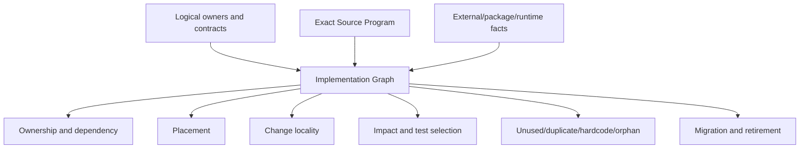

同一 graph 的投影可以独立缓存，但不能重扫后改变语义。新增 analyzer 只能消费 graph 或贡献一个有 coverage 的 interpreter/provider；不得另建 tests-only regex、imports graph、package graph、process inventory 或 path registry。

```text
ImplementationCoverage =
  exactContentUniverse
  ∧ everyExecutableContentClassified
  ∧ everyDeclarationOwnedOrUnknown
  ∧ everyPublicSurfaceHasConsumerOrObligation
  ∧ everyEffectHasOperationAndSettlement
  ∧ everyDurableStateHasWriterParserRecovery
  ∧ everyGeneratedProjectionHasUpstreamOwner
```

覆盖不足只形成精确 frontier；不能把未观察对象计为 absent、unused、safe-to-delete 或 admissible。

### 2.3 目标组件拓扑

未来SEC不是一个巨型orchestrator，也不是若干工具wrapper的集合。组件是工程责任，不等于进程、package或目录：

```mermaid
flowchart LR
  PD[Product / Domain Definition Authorities] --> DC[Design Compiler]
  DC --> LD[Logical DesignPackage]
  RS[Repository Snapshot Boundary] --> OH[Observation Host]
  FE[Language / Config / Artifact Frontends] --> OH
  OH --> SP[Source Program Snapshot]
  LD --> IC[Implementation Compiler]
  SP --> IC
  TP[Target / Policy / Catalog Facts] --> IC
  IC --> IP[TargetImplementationDesignPackage + Target Program + Change Plan]
  LD --> CC[Conformance Compiler]
  IP --> CC
  CC --> CM[ConformanceModel]
  IP --> TB[Target Backend]
  TB --> MA[Canonical source/config/test/doc artifact plan]
  UI[Public request / workflow intent] --> PW[Domain and Workflow Plan Compilers]
  LD --> PW
  SP --> PW
  IP --> PW
  PW --> PP[Pure Workflow / Operation Plans]
  MA --> PP
  PP --> AR[Admission Runtime]
  LF[Live grants / provider / resource / state facts] --> AR
  AR --> AE[AdmittedExecution + opaque capabilities]
  AE --> OK[Policy-free Operation Runtime Kernel]
  CP[Capability Provider Host] --> OK
  PS[Persistence Fabric] --> OK
  OK --> SO[Attempt / settlement / readback observations]
  SO --> DR[Per-domain State and Result Runtime]
  PP --> DR
  DR --> VE[Independent Verification]
  CM --> VE
  VE --> ER[Evolution / Publication Runtime]
  DR --> PG[Interface Projection Gateways]
  VE --> PG
  ER --> PG
```

| Component | Required input | Authoritative output | 不得拥有 |
| --- | --- | --- | --- |
| Design Compiler | accepted product/domain definitions + meta-model | validated `LogicalDesignPackage` / exact frontier | source placement、Provider、Effect |
| Observation Host | retained content universe + frontend bindings + budgets | `ContentSnapshot`、`SourceProgramSnapshot`、coverage/unknown | Domain adoption、write authority |
| Implementation Compiler | logical package + source facts + Target/Profile/catalog/policy | `TargetImplementationDesignPackage`、ImplementationGraph、Resolution/Binding/Placement/Change plans、observable/Claim refs | live discovery、Effect、business success |
| Conformance Compiler | logical package + target implementation package + fault/property calculus | `ConformanceModel`、coverage/frontier | tests、Evidence、Verdict、mutation |
| Target Backend | validated Target/source/config/test/doc IR | canonical bytes and materialization obligations | filesystem publication、Provider selection |
| Domain/Workflow Plan Compilers | public request + exact semantic/observation/binding refs | immutable `PureOperationPlan` / `PureWorkflowPlan` | live grant、Effect、hidden callback |
| Admission Runtime | PurePlan + current grant/Provision/resource/state facts | exact `AdmittedExecution` + non-forgeable capabilities | Definition、Policy重算、business success |
| Operation Runtime Kernel | admitted immutable plans + opaque capabilities | attempt/settlement/resource/readback observation sets | Domain rules、Provider selection、Verdict |
| Capability Provider Host | exact Provision bindings and tickets | bounded physical observation/Effect settlement | business plan、Authority issuance、DomainResult |
| Persistence Fabric | owner schema + exact CAS/append/content operations | retained bytes/identities/transaction result | schema meaning、state transition legality |
| Per-domain State/Result Runtime | PurePlan + settlements + independent readback | legal state transition、DomainResult/recovery | Capability选择、Authority、Verdict |
| Independent Verification | ConformanceModel + exact result/environment/Evidence | Verdict/freshness/invalidation | mutation、publication、producer self-proof |
| Evolution/Publication Runtime | accepted compatibility/cutover/retirement plan | active-generation/publication/retirement result | Compatibility重新决策、永久双写 |
| Interface Projection Gateways | public operation/query/result refs | CLI/API/IDE/Agent/human projections | second resolver、direct state/Provider access |

核心之间只传immutable、strictly parsed、content-addressed artifacts或opaque live capabilities。任何组件若需要读取另一个组件的private database、callback、process globals或目录约定才能工作，说明缺少public contract或责任边界错误。Domain/Workflow Plan Compiler和State/Result Runtime是由各Responsibility Cell实现的家族，不是两个全局service；共享kernel只承载可证明相同的mechanism。

### 2.4 目标数据与持久化拓扑

语义owner与物理store正交：一个store可以承载多个隔离namespace，一个Domain也可随Target/Profile选择不同store，但每份数据仍只有一个schema/transition owner。

| Data class | Canonical owner | Persistence semantics | 可丢失/重建 | 合法引用 |
| --- | --- | --- | --- | --- |
| accepted definitions/decisions | Product/Domain/Policy owner | immutable revision + issuer/acceptance chain | no | semantic refs only |
| exact content snapshots/blobs | Observation/content owner | immutable content address + coverage | source可重读时可重建 | content refs, never path identity |
| Source Program/fact shards | Observation/interpreter owner | immutable derivation artifacts | yes | snapshot + interpreter closure |
| LogicalDesignPackage/ImplementationGraph/plans | corresponding compiler owner | immutable compiled artifacts | yes from exact inputs | upstream refs + compiler identity |
| Domain state | each Domain state owner | strict transition, CAS/append, readback, recovery | no | domain state refs |
| workflow/operation attempts | operation runtime state owner | intent-before-Effect, append/CAS, settlement/residue | no while active/retained | OperationKey + plan/grant/binding refs |
| authority grants/delegations | issuer owner | revocable/expiring, use/settlement audit | no while valid/retained | opaque grant refs |
| allocations/resource accounts | resource owner | monotonic consumption/return/leak settlement | no while operation active | parent/child allocation refs |
| Evidence/Verdict | verification owner | immutable Evidence + validity/invalidation state | no for supported Claim window | claim/environment/action refs |
| generation/cutover/retirement | evolution owner | one active generation + durable transition | no until old consumer-zero | old/new graph refs |
| credentials/secrets | credential provider owner | non-exportable/lease-scoped, never content-addressed payload | provider-defined | opaque credential capability only |
| caches/indexes/projections | derivation/projection owner | disposable, bounded, validated | yes | exact producer/input key |

物理存储只需四种最小能力，不建立“万能仓库数据库”：

```text
ImmutableContentStore  = put-if-absent(bytes,digest) + verified read + retain/release
DomainStateStore       = strict read + compare-and-transition + append observation + snapshot
CoordinationStore      = claim/join/lease/expiry with owner-bound fencing token
SecretCapabilityStore  = resolve opaque credential/secret lease without exporting authority
```

它们是ports，不是固定产品。local profile可由retained filesystem/OS primitives实现，team/hosted profile可由database/object store/queue/secret service实现；store替换只改变Provision/Binding，不能改变Domain transition或OperationKey。

跨Domain不要求全局ACID：每个Domain在自己的linearization point提交state；Workflow保存public result refs并使用Saga/compensation/forward recovery。不可逆Effect没有伪rollback。Event是已提交结果的immutable通知，不是新truth；transport允许at-least-once，业务幂等由OperationKey与consumer transition保证。Domain commit与event publication必须共享原子outbox或可从committed state确定性重建的cursor，丢消息靠owner state/readback重建，不能让broker offset成为Domain状态。

时间也不是全局truth：

| Time concern | 唯一语义 | 实现约束 |
| --- | --- | --- |
| single-host operation deadline | 从parent operation一次派生的remaining duration | 单调时钟；所有child/retry/readback/cleanup只消费剩余量 |
| distributed lease/expiry | 协调store签发的epoch、fencing token与其自身时间域 | 不比较不同主机的monotonic clock，不信任caller wall time |
| external timestamp | 带producer/clock-domain/uncertainty的Observation | 只用于声明过的ordering/freshness Claim |
| human calendar policy | Domain Definition中的时区、calendar、inclusive/exclusive规则 | 编译为显式policy input，不散落`Date.now()` |

clock skew、suspend/resume、DST、leap adjustment和host migration只能导致expired/unresolved/re-admission，不能扩长Grant、复活lease或把未知Effect判为未发生。

### 2.5 部署与运行形态

同一LogicalDesignPackage、ImplementationGraph、OperationKey和Claim语义必须跨运行形态保持不变；只有Provision/Binding、Allocation和physical settlement不同：

| Profile | 组件部署 | 允许的优化 | 不得改变 |
| --- | --- | --- | --- |
| embedded IDE/local | pure compilers与query同进程；Effect交给local kernel/provider host | Language Service、memory-mapped facts、local content store | semantic/result/failure/authority |
| local durable worker | kernel/provider/state host为长期本机服务 | join in-flight、native OS observations、warm fact shards | 不能成为第二truth或后台无限Effect |
| CI/release | frozen artifact与executor隔离 | remote cache、sharding、parallel independent Claims | executor不能自签Gate/publication |
| team/remote | state/content/evidence可远程共享 | distributed stores、work queues、tenant quotas | cross-domain ownership、idempotency、unknown |
| offline | 只选择满足Requirement的local Provisions | local cache/content/provider reuse | 不得降低Claim或用ambient fallback |
| constrained/sandboxed | capability host隔离、资源维度更窄 | process/container sandbox、read-only snapshot | 拒绝语义必须一致 |

系统不要求一个永远运行的daemon。长期进程只有在measurement证明能降低生命周期成本时作为可替换Provision存在；cold path始终能从canonical inputs重建，warm与cold结果等价。

### 2.6 Trust zones 与数据流

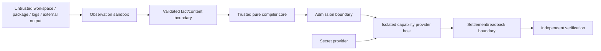

- untrusted content永远作为data进入parser/frontend，不能成为instruction、配置authority或可执行callback；
- pure compiler core无credential、network、filesystem write、process spawn或ambient discovery能力；
- admission签发的opaque capability只能用于exact plan/subject/epoch/allocation；序列化或object spread不能复制；
- provider host只接收最小环境与secret lease，输出bounded settlement；raw diagnostics经过redaction/projection才离开zone；
- tenant/repository/workspace/operation identities参与每个state、allocation与credential binding，禁止跨边界复用；
- Verification与publication使用不同authority，producer、executor和publisher不能组成自证闭环。

### 2.7 Extension points：扩展能力而不扩散核心

| Extension kind | 贡献 | 必须通过 | 不得注入 |
| --- | --- | --- | --- |
| language/config/artifact frontend | covered typed observations + unknown | snapshot determinism、coverage、clean/incremental equivalence | Domain truth、write Effect |
| target/backend | Target IR lowering + canonical bytes | type/behavior/source-map/determinism conformance | Provider选择、业务规则 |
| capability provider | Provision + settlement/readback behavior | identity/security/resource/failure/conformance | DomainResult、Authority |
| domain package | Definitions、operations、state/failure、claims | meta-model validation、owner uniqueness、workflow/public boundary | private cross-domain access |
| workflow package | public Operation refs/result mappings/compensation | closed algebra、acyclicity/bounded fixpoint、resource/authority projection | callbacks、Provider instances |
| policy package | eligible-set ranking/constraints | deterministic inputs、scope、reversal | Effect、hidden observation |
| interface projection | input/output mapping | public contract、schema/support window、round-trip | second writer/resolver |

扩展以declarative contracts、typed IR和conformance facts进入compile-time catalog；只有无法静态表达的opaque implementation由治理过的CodeUnit实现。运行时不加载任意callbacks，不按品牌switch核心逻辑，不允许extension自行注册Authority、state store或global singleton。若现有meta-model无法表达新需求，先进行meta-model evolution，而不是在extension里藏第二语言。

扩展局部性必须可计算：

| 新增需求 | 允许改变 | 正常不得改变 |
| --- | --- | --- |
| new Domain | new domain definitions/cells/public operations/workflows that consume them | existing domain private state、shared kernel semantics |
| new Workflow | workflow definition/result mapping/compensation and its claim set | child operations/providers/state machines |
| new language/config format | one frontend + fact/coverage conformance | domain contracts、SourceProgram identity、other frontends |
| new Target/backend | target profile/backend/catalog bindings | Engineering IR、Domain semantics、SourceProgram |
| new Provider | provision/conformance/security/settlement implementation | Requirement、DomainResult、Authority issuer |
| new interface | projection/parser/support contract | domain decision/state/provider |
| new deployment profile | composition/bindings/stores/allocations | logical state/failure/effect semantics |

若一个实例扩展要求修改core switch、多个既有Domain或公共kernel contract，结果是`meta-model-insufficient | boundary-wrong | cross-domain-feature`，不能把高扇出当作正常插件成本。

## 3. Responsibility Cell 的工程实现

Responsibility Cell 是最小稳定语义所有权单元，不是固定目录模板。

```text
ResponsibilityCell =
  owned Subjects
  + public domain operations / queries
  + state writer / parser / resolver ownership
  + Effect / settlement / readback / recovery closure
  + failure algebra
  + proof obligations
  + evolution conditions
```

一个 cell 可以物化为多个 CodeUnit；一个 CodeUnit 不能同时实现多个互不相干的 cell。是否拆分由 declaration/reference/effect/co-change graph 决定，不由文件行数决定。

| 物化角色 | 允许内容 | 依赖方向 | 拒绝条件 |
| --- | --- | --- | --- |
| contract | identity、value、schema、strict parser、failure/result algebra | foundation only | import operation/provider/runtime |
| domain | invariant、pure transition、decision/compiler | contract | Effect、ambient observation |
| operation | Requirement DAG、Effect plan、readback/recovery/terminal | contract + domain + ports | 自选 Provider、重算 Authority |
| port | capability requirement 和 typed settlement | contract/domain | 具体库、PATH、credential |
| provider | 外部/物理 capability 的实现与 conformance | port + foundation/runtime primitive | 解释业务成功 |
| runtime | lease、journal、worker、allocation、terminal readback | operation + port/provider | 新定义领域规则 |
| projection | CLI/API/Agent/read model | public operation/query/result | 重算 decision、写 canonical state |
| verification | public/effect/failure/property/compatibility claim | public surface + test capability | 私有源码文本作 oracle |

角色只在真实内容存在时物化；禁止空目录、空 `index`、逐文件 facade、统一 export barrel 或为了视觉对称建立层。

### 3.1 Cell 切分判定

```text
split(A, B) iff
  independent semantic responsibility
  ∨ independent state writer/parser/resolver
  ∨ independent authority/security boundary
  ∨ independent lifecycle/recovery
  ∨ reusable capability with multiple real consumers
  ∨ different deployment/versioning boundary
```

```text
merge(A, B) iff
  same Subject/invariant/change cadence
  ∧ no independent public consumer
  ∧ no independent state/authority/lifecycle
  ∧ separation only adds translation/re-export/mirror
```

`unknown` 不触发机械拆分或合并；它生成 bounded Design frontier。

### 3.2 Infrastructure Cell 与未来能力

`InfrastructureCell` 仍是 Responsibility Cell；其 outcome 是被真实 domain/compiler/operation consumer 需要的共享语义或 capability，不是“通用”“core”“以后会用”。它必须满足相同的唯一 owner、public demand、Effect/lifecycle/recovery 和验证条件。

未来能力分离为 Definition 与 active implementation：

```text
FutureObligation {
  desiredCapability
  preservedConstraints
  evidenceOrReferenceImplementation
  activationPredicate
  intendedConsumers
  reversalPredicate
  supersessionRule
}
```

| 状态 | 保存什么 | production authority |
| --- | --- | --- |
| active demand | owner contract + implementation + consumer graph | 按 operation contract |
| accepted future obligation | 意图、不变量、激活条件、必要算法 Evidence | none |
| bounded experiment | isolated reference implementation + expiry + hypothesis | none |
| superseded | 替代映射与理由 | none |
| orphan | 无 demand/obligation/experiment/evidence | delete |

如果现有实现包含尚不能完整形式化的独特算法知识，先将其作为 content-addressed reference evidence 绑定到 FutureObligation，再从 production graph 退役；不能靠 Git 偶然可恢复，也不能让无 consumer 的 active API、facade、版本或 test shell 永久存在。

## 4. 依赖、可见性与 Facade

### 4.1 Static dependency DAG 与 runtime composition graph

两种图不能混用。下图箭头`A → B`表示`B`可以静态import/依赖`A`：

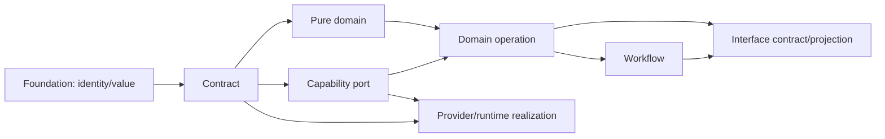

Provider实现CapabilityPort，因此可以依赖port/contract；DomainOperation和Workflow不得依赖Provider。Interface只依赖public operation/workflow contracts与result projections，不依赖runtime实现。

runtime wiring由独立composition graph表示，边含义是“被组合根装配”，不是低层反向import高层：

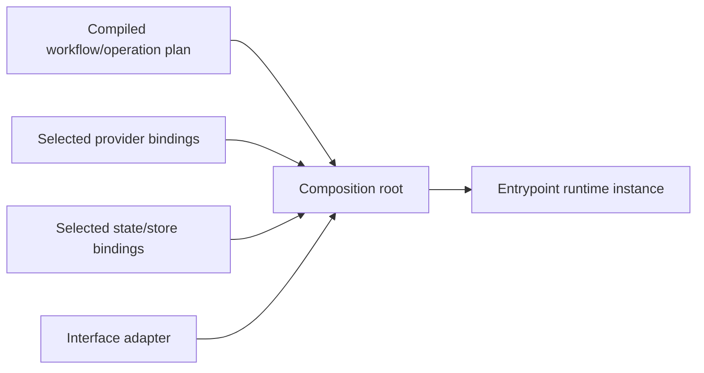

Composition root是Target/Profile专属的叶节点，只组装已选择实现，不拥有合同、Provider policy、Domain state或业务流程。反馈通过data/result/next-request进入新的上层operation，不通过反向import、callback type、global registry或root barrel成环。SCC只允许同一cell内不可进一步分离的declaration cohesion；跨cell SCC必须经依赖反转或operation重构消除。

### 4.2 Public surface

对外公开的对象只有：

- immutable value/contract；
- strict parser/validator；
- query；
- DomainOperation；
- CapabilityPort；
- terminal result/readback；
- 明确的 external protocol projection。

实现类、runtime helper、raw provider、test issuer、路径、内部state record和重导出聚合器默认private。public contract的canonical declaration由其owner文件拥有；生成的package export map或最小entry module只能引用这些declaration，不能复制type、schema、constant、parser或状态，也不能被下层owner反向import。

### 4.3 Facade existence proof

```text
FacadeAllowed =
  authorityIntersection
  ∨ externalProtocolNormalization
  ∨ independentLifecycleOrCompatibility
  ∨ semanticOperationOverMultipleCapabilities
```

每个facade必须登记它新增的不可由下层表达的invariant、真实consumer和retirement condition，并保持`stateOwners=0 ∧ schemaOwners=0 ∧ domainDecisions=0`。只有缩短import、隐藏移动、保留名字、汇总exports或“未来可能有用”的facade是`duplicate-owner`。纯export entry若生态协议强制存在，只能由public-surface graph生成；空`index`、手写barrel和contract copy没有存在条件。

## 5. Placement Compiler：从语义图推导源码组织

### 5.1 唯一 authored source root

| Root | 语义 |
| --- | --- |
| `src/**` | SEC全部authored machine input：production code、owner-local verification、cross-domain scenarios、CLI/dev operations、contracts与随owner演进的resources；唯一authored source root |
| `docs/**` | stable definitions/decisions 和 generated navigation；无 runtime truth |
| ecosystem-mandated root files | 外部工具无法迁入`src`的最小bootstrap/config；优先从owner contract生成且不得复制业务语义 |
| Runtime State | durable operation/recovery state；不进入 Git authored source |
| Cache | 可删除、可重算、有限额的 acceleration facts |
| Artifacts | exact published result/Evidence；不作为 mutable truth |

所有SEC authored machine input只有一个`src/`根；工具入口、开发流程、测试场景和owner-governed resources也按真实Responsibility放置。其他顶层位置只能承载文档、生态强制bootstrap或非源码运行产物，不能形成第二源码图。路径不能编码semantic identity。

### 5.2 Cell-first layout

示意路径不是固定模板：

```text
src/<domain>/<responsibility-cell>/
  <semantic-subject or operation named code units>
  <owner-local *.test.* beside the observed public boundary>
  <owner-governed non-code inputs only when inseparable from the cell>
```

目录层级由cohesion与可读性成本触发，不按`contract/domain/application/infrastructure`机械复制。小cell直接平铺subject-named units；只有独立public surface、state/effect lifecycle或显著co-change子图存在时才增加一层。禁止空目录、root barrel、逐目录`index.ts`、`common/shared/utils`以及以工具品牌建owner。

跨cell引用使用由PlacementDecision生成的short semantic import address；Language Service和symbol-aware move compiler维护definition/reference/export/config/test关系。开发者不手写相对路径链、path alias清单或exports镜像。public surface由真实consumer demand生成最小named entry；没有external/package boundary时直接引用该public declaration，不为“统一入口”制造facade。

package只在独立发布、部署、runtime、security、toolchain或真实external version boundary成立时创建；默认是一个产品package内的多个Responsibility Cells。system/e2e/property/fault场景归`src/verification/system-scenarios/`这一真实verification responsibility，而不是按被测源码目录镜像。

### 5.3 Placement function

```text
place(codeUnit) = f(
  responsibilityCell,
  dependencyLayer,
  visibility,
  stateAndEffectClosure,
  lifecycleAndRecovery,
  runtimePackaging,
  coChangeGraph,
  authoredGeneratedOpaque
)
```

Placement 输出：

```text
PlacementDecision {
  codeUnitId
  ownerCellId
  role
  visibility
  packageBoundary?
  logicalAddress
  allowedDependencyCells
  generationKind
  colocatedVerificationClaims
  migrationObligations
  evidenceDigest
}
```

源码路径由 PlacementDecision 生成；import alias、package export、test selection、ownership、architecture boundary 与文档导航均从同一 decision graph 投影，禁止手写路径镜像。

## 6. Change Locality Compiler

目标不是最少修改文件，而是最少修改**不可推导的 authored facts**。

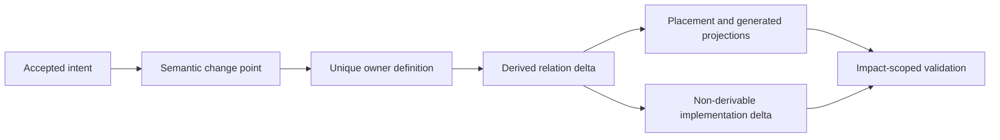

```text
AuthoredDelta = MinimalOwnerDefinitionDelta + NonDerivableImplementationDelta
DerivedDelta  = regenerate(accepted owner graph, exact Source Program)
TouchedOwners = irreducibleOwners(AuthoredDelta)
```

常规单责任语义变化的 `TouchedOwners = 1`。多 owner 只在同一 accepted intent 跨越不可合并的真实责任时成立，并必须由一个 ChangeTransaction 绑定各 owner 的 precondition、apply order、rollback/forward recovery 和 readback；“每处改一行”不是 transaction。

### 6.1 局部性成本

不使用固定评分阈值；比较候选方案的 Pareto 关系：

```text
LifecycleCost =
  authoredOwnerCount
  + authoredFactDuplication
  + nonDerivedFileFanout
  + contextReadBytes
  + invalidatedFactShards
  + verificationClosure
  + migrationAndRetirementCost
  + residualUnknownRisk
```

如果方案 B 在所有维度不差且至少一项更优，方案 A 被支配并删除。低文件数但引入第二 owner、隐藏字符串源码或失去 readback 的方案不构成优化。

### 6.2 扇出根治规则

| 观察 | 根因分类 | 目标表达 |
| --- | --- | --- |
| 多文件重复版本/Schema 字面 | canonical contract 未被引用 | owner literal type + strict parser；projection generated |
| 多测试复制路径/列表/计数 | Source Program/owner graph 被手写镜像 | relation/property assertion + derived fixture |
| 多 CLI 复制字段 | projection 没有 command-specific contract | named projection compiler |
| import move 修改全仓 | placement/import graph 非生成 | symbol-aware move plan + generated aliases/config |
| 多 Provider 重复 deadline/env | operation/resource contract 未下沉 | shared opaque operation session |
| 多文档重复原则 | owner/projection 混淆 | canonical clause refs + generated navigation/context |
| 多处 `if platform/version` | Target/Profile/Binding 泄漏 | Resolution/Binding compiler + provider conformance |

### 6.3 Locality admission

```text
compileChangeLocality(intent, graph):
  semanticDelta := resolveAcceptedChangePoint(intent)
  owners := irreducibleSemanticOwners(semanticDelta)
  authored := computeNonDerivableDelta(owners, semanticDelta)
  derived := compileAllProjections(graph + authored)
  impact := computeFactAndBindingImpact(graph, authored, derived)
  reject duplicate facts, handwritten projections, unexplained fanout
  return ChangePlan(authored, derived, impact, migration, proof)
```

任何未解释的 authored 多点修改、同一 literal 多 owner 变化、跨 cell private import 或新增 facade 都产生 typed `change-locality-unresolved`，不允许用测试绿色消除。

## 7. 双向 Semantic Compiler：Intent-to-Product 与 Repository-to-Model

自动生成产品的权威链不是自然语言→补丁，而是 accepted intent→可验证语义→implementation binding→target lowering；任意既有仓库的反编译链则是 exact bytes→语言事实→统一 Source Program→candidate semantics/unknown→owner adoption。两条链共享一个 Engineering/Implementation graph，在 round trip 处互相校验，不能形成两套模型。

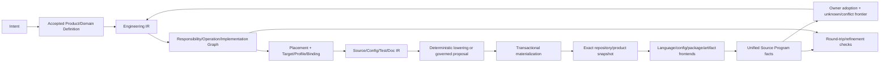

`SourceProgram`是exact snapshot的语言无关语义观察；SEC authored machine input物理根统一为`src/`，任意Target workspace则按其retained snapshot与language frontend读取。目录名永远只属于Address/Placement。

### 7.1 Intent contract

```text
Intent {
  desiredOutcomes
  explicitNonGoals
  preservedCapabilities
  acceptedTradeoffs
  targetSubjects
  constraints
  uncertainty
}
```

Intent 不含 path、provider、implementation、test count、version label 或 Effect permission。自然语言解析只产生 proposal 与 ambiguity frontier；只有 Product/Domain owner 的 accepted Definition 才进入编译。

机器负责所有由已知 inputs、relations、constraints 和 policies 可决定的结论；只有在多个非支配终局之间仍缺少授权偏好时，才请求 Product/Domain decider 提供新的 choice input。人工不能替代可计算的 owner、impact、placement、provider eligibility、resource、test selection 或 retirement 判断。

### 7.2 三种实现类别

| Kind | 来源 | 修改方式 | Authority |
| --- | --- | --- | --- |
| deterministic-generated | 完整 IR + Target/Profile/Binding 可确定 bytes | 只改上游 owner并重编；禁止手改 | compiler receipt |
| governed-authored | 当前算法不能从规范唯一确定，但可验证责任/合同 | ChangePlan 约束下由人/Agent/工具提出 patch | accepted plan + exact readback |
| opaque-external | 外部库、binary、远端服务、未知/不可读内容 | provider adoption、upgrade、replace 或 typed opaque | external capability contract |

`governed-authored` 不是永久例外：每次手写中可稳定推导的事实进入 IR/compiler，不能推导的部分保持最小并记录 FutureObligation。`opaque-external` 不能被代码生成器静默编辑或把 presentation 当 protocol。

### 7.3 Compilation products

编译输入不是一个所有字段可选的“超级模型”，而是同一 exact universe 中多个 owner snapshot 的引用闭包：

```text
SemanticCompilationInput {
  acceptedProductDefinitionRefs
  validatedEngineeringSnapshotRef
  domainContractAndWorkflowRefs
  targetProfileRef
  implementationCatalogAndPolicyRefs
  exactRepositoryOrEmptyWorkspaceSnapshotRef
  provider/resource/environmentFactRefs
  evolutionAndSupportObligationRefs
}
```

每层只新增它拥有的语义，并保存到上游 source refs 的双向 provenance：

| IR / artifact | 新增内容 | 不得补写 |
| --- | --- | --- |
| Engineering IR | accepted entities/facts/responsibilities/invariants | source syntax、candidate implementation |
| Application/Behavior IR | target-neutral components、state、data/control/effect semantics | framework、package、path |
| Requirement/Candidate/Decision/Binding graph | hard requirements、完整候选闭包、选择理由、exact realization | 产品语义、Compatibility结论 |
| Target Program IR | package/module/declaration/statement/resource/config ownership | live filesystem、Provider discovery |
| Source/Config/Test/Doc IR | canonical target-language AST、package/config/artifact/test/projection plans | Effect执行、手工字节 |
| ProductMaterialization plan | exact bytes/digests、writer/readback/migration/verification obligations | completion或Support Claim |

```text
IntentCompilation {
  acceptedDefinitionRefs
  semanticDelta
  preservedCapabilityClaims
  futureObligations
  responsibilityDelta
  operationDelta
  implementationBindings
  placementDecisions
  generatedArtifacts
  governedAuthoredTasks
  opaqueBoundaries
  impactAndMigration
  verificationClaims
  exactUnknownFrontier
}
```

当输入是既有工程时，编译器必须证明target realization覆盖该工程仍被Product owner接受的能力与future obligations，并逐项产生`preserved | superseded-by-better | rejected-with-product-decision | unknown`。代码、测试或文档存在本身不证明capability conservation。

### 7.4 AI 与工具角色

AI、Compiler API、LSP、ast-grep、semgrep、codemod、Nx/Bazel 等只可成为阶段 Provider：

- compiler/type checker 拥有语言语义；
- LSP 拥有编辑期增量导航；
- AST/codemod 执行已批准的 symbol-aware transformation；
- build orchestrator 执行 Requirement DAG 和 cache，不拥有业务 DAG；
- AI 提议不可唯一 lower 的 governed-authored delta；
- domain owner + operation admission + readback 决定是否接受。

不得为每个工具建立镜像 wrapper 或第二 graph；工具变化只改变 Provider Binding，不改变上游 Definition。

### 7.5 成品编译与收敛条件

“从语义编译成源代码成品”不是只吐出若干 `.ts` 文件，而是编译一个可安装、可运行、可验证、可演进的 ProductMaterialization：

```text
ProductMaterialization =
  repository source/config/package graph
  + generated public interfaces and projections
  + build/runtime/deployment bindings
  + migrations and durable schemas
  + behavior/effect/failure/recovery tests
  + supply-chain/provider/resource obligations
  + exact readback and retirement receipts
```

Target backend 只负责将 typed Source/Target IR lower 为具体语言、框架、配置和包布局；它不能决定产品语义。SEC 自身源码和用户 workspace 共用上游 Engineering IR/Requirement/Claim/Effect 模型，但通过不同 `TargetProfile` 与 backend 输出：SEC self-hosted implementation 由本文件约束，用户工程 Target Program/Backend 的具体语义由 `docs/compiler-target-ir.md` 拥有。新增语言或框架只新增 frontend/backend Provision 和 conformance facts，不复制 Domain、Workflow、ActionKey 或 verification graph。

```text
SemanticCompilationFixedPoint(snapshot, acceptedModel) iff
  decompile(snapshot).adoptedGraph == acceptedModel.implementationGraph
  ∧ type/build/publicBehavior(snapshot) refines accepted contracts
  ∧ effects/state/failure/recovery traces satisfy obligations
  ∧ generated bytes equal canonical lowering where deterministic
  ∧ governed-authored regions contain no unexplained semantic surplus
  ∧ unknown frontier is empty or explicitly bounded away from requested Claim/Effect
```

达到 fixed point 前只能称 proposal、partial materialization 或 typed frontier，不能称“业务已写完”。未来编译器逐步缩小 governed-authored 区域；不确定算法实现仍可由 Agent/人提出，但必须经同一 reverse compile、semantic diff、transaction 和 readback，不形成旁路。

### 7.6 Self-hosting 与 compiler trust

SEC 最终用同一双向 Semantic Compiler治理自身，但 self-hosting 不能变成 candidate compiler 自证：

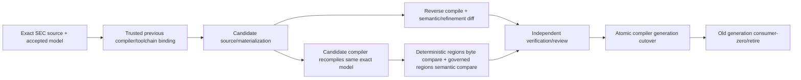

- bootstrap seed只拥有启动所需的最小 compiler/toolchain capability identity，不拥有当前产品 Definition；seed、source、config、dependency、Target/Profile、frontend/backend和environment共同进入 ActionKey；
- candidate compiler只能产出 proposal/materialization和自举观察，不能签发自己的admission、Evidence verdict或cutover；
- deterministic-generated区域要求同输入byte-equivalent；governed-authored与opaque区域要求Source Program、public behavior、Effect/failure/state/refinement等价，不能强求偶然字节相同；
- compiler/frontend/backend变化产生新generation；正常路径只消费一个active generation，旧generation只在bounded migration/rollback窗口可读并在consumer-zero后退役；
- 若trusted previous compiler缺失或无法解析新meta-model，进入explicit bootstrap/migration authority流程，不能由candidate放宽parser或保留永久双编译。

这条链同时适用于SEC自身仓库与用户workspace；区别仅是Product/Domain definitions、TargetProfile、authority和publication owner，不复制compiler core。

### 7.7 Pass graph：从定义到完整工程成品

每个pass只有一个输入grammar、一个输出grammar和一个validation boundary；不能传递可选字段大包，也不能在后续pass补造上游语义：

| Pass | Input | Output | 可并行/增量单位 | 禁止 |
| --- | --- | --- | --- | --- |
| Definition compile | accepted Product/Domain/Workflow/Policy refs | validated LogicalDesignPackage | independent Definitions | 读取源码迁就实现 |
| Universe capture | retained Target/SEC repository boundary | ContentSnapshot + classification frontier | content unit | 执行目标代码 |
| Frontend compile | content units + exact frontend/config bindings | typed fact shards | content/interpreter key | 正则替代语言语义 |
| Source Program link | fact shards + resolution closure | cross-file/language/package graph | affected SCC/subject | 第二imports/test graph |
| Semantic adoption | observations + owner Definitions | adopted semantic snapshot/frontier | independent claims | confidence自动升格 |
| Responsibility compile | semantics + consumer/effect/state relations | Cells、Owner DAG、public demand | affected owner closure | 路径决定owner |
| Resolution compile | Requirements + candidates + policy/Target facts | Decisions、Bindings | independent Requirement | first-found/ambient fallback |
| Change/Impact compile | exact before/after semantic+binding refs | Delta、Impact、Claim obligations | affected relation closure | changed files=impact |
| Target compile | Application/Behavior + exact Bindings | Target Program IR | package/module graph shard | backend重选实现 |
| Source/Test/Config/Doc lower | Target Program + backend/profile | typed AST/IR and canonical bytes | independent artifact | executable string template、手写projection |
| Operation compile | DesiredDelta + exact preimage + public contracts | Pure plans + readback/recovery obligations | independent DomainOperation | Effect、grant、live discovery |
| Materialize/verify/evolve | admitted plan + capabilities | exact state/artifact result + Verdict/evolution refs | Requirement DAG | producer自证、永久双写 |

Executable source只能由typed target-language AST/LST、verified codemod或governed-authored declaration产生；任意字符串内的可执行程序都必须被embedded-program frontend识别并进入同一Source Program。Formatter只处理presentation，不能成为semantic pass。Tests从Claim/Failure/Effect/Compatibility obligations生成选择与骨架；不可推导的业务scenario仍由Domain owner authored，但测试永远不是Definition owner。

### 7.8 增量、共享事实与性能


目标复杂度是`O(changed content + affected relation closure + required Effects)`，不是每个consumer各做`O(repository)`。为此：

- 一个exact snapshot只产生一个ContentSnapshot与SourceProgram generation；typecheck、architecture、audit、unused、duplicate、hardcode、test-impact、docs和Agent ReadPlan消费同一fact identities；
- TypeScript frontend由仓库锁定Compiler API/TypeChecker/Language Service拥有parse、symbol、alias、re-export与incremental Program语义；native checker可作为final typecheck execution Provider，但不能建立第二Program、第二project graph或fallback；
- editor/Agent循环复用long-lived language service和content-addressed fact shards；服务丢失时从canonical inputs clean rebuild，daemon memory不是真相；
- authoring diagnostics只失效受影响closure；正式type Evidence只在frozen exact source/config/dependency/compiler/environment ActionKey上执行一次，fresh PASS、fresh deterministic failure与authenticated in-flight分别reuse、reuse-failure与join；
- host级昂贵事实（例如ACL、toolchain physical identity）由native retained observation绑定host/subject/security epoch并跨进程验证；mutation、expiry或coverage变化精确失效，不能缓存path-only PASS；
- streaming observation在一次遍历中同时计算content digest、entry/byte/depth/resource accounting与fact inputs；不得为了预算或计数先全扫再读第二遍；
- cache-disabled clean、cold、warm、incremental和distributed execution对同一exact inputs产生byte/semantic-equivalent结果；性能Provider异常只退回同一clean algorithm。

性能决定使用`PerformanceScenario + Environment + Distribution + ResourceBudget + CorrectnessClaims + CriticalPath`，比较cold/warm/delta、P50/P95/尾延迟、CPU/IO/memory/process/network与全生命周期维护成本。单次计时、静态timeout、代码行数或“用了daemon/Nx/native”不构成优化证明。

### 7.9 目标工具与运行时 Binding 原则

具体工具是可替换Provision；下表冻结的是目标Responsibility与优先Binding，不是工具获得的语义所有权：

| Requirement | Preferred mature mechanism | SEC-owned value above it | 排除 |
| --- | --- | --- | --- |
| TypeScript source semantics | locked TypeScript Compiler API/TypeChecker/Language Service | exact SourceProgram facts、coverage、cross-consumer reuse | regex/name resolver、第二AST图 |
| final TypeScript checking | verified native checker compatible with Target profile | ActionKey、typed diagnostics、Evidence normalization | per-edit full check、silent fallback |
| schema/structural validation | Zod in TypeScript profile + strict raw decoder/canonical serializer | domain invariants、duplicate/unknown/version/provenance policy | `JSON.parse as T`、type/schema双写 |
| semantic rename/import move | Compiler API/Language Service rename + AST codemod | ArchitectureMigration/readback/consumer-zero | string replacement、manual path lists |
| structural candidate queries | ast-grep | bounded candidates linked back to SourceProgram | candidate=authority |
| cross-language security/data-flow candidates | Semgrep / language-native analyzers | normalized findings+coverage/unknown | scanner verdict=self-proof |
| unsupported-language structure | tree-sitter frontend | typed partial facts and frontier | pretending full type semantics |
| navigation only | LSP/ctags/fd/rg | human/Agent discovery hints | changing semantic decisions |
| runtime/tool execution | Bun-only SEC host runtime + retained process capability | operation/resource/settlement semantics | Node as SEC runtime、raw shell/PATH |
| repository semantics | Git machine protocols behind one repository-semantic Provider | exact snapshot/ref/tree/membership result | multiple spawn wrappers、presentation parsing |
| hosted source control | provider API session with fixed endpoint/principal/credential binding | repository-scoped semantic operations | ambient CLI profile/token routing |
| local container/build | Docker/BuildKit capability Provider when Requirement requires it | OperationKey、resource/lost-handle/readback semantics | daemon exit=business success |
| task DAG/cache executor | SEC Runtime Kernel; external Nx/Bazel/Dagger only as measured execution Provider | Domain/Workflow DAG、ActionKey、Claim semantics | external scheduler becoming owner |

采用成熟机制前由Requirement、security、license、platform、protocol、performance与retirement比较候选；已选择的Provider必须pin exact package/binary/integrity/config/environment closure。若更好Provider出现，只做Binding/evolution，不复制上层graph或长期保留compatibility route。

## 8. 自动编译实现前的受控模式

当前没有覆盖全部工程语义的双向 Semantic Compiler 时，人、Agent 和外部工具共同作为 `ManualImplementationProvider`，但不能拥有定义、范围或成功。

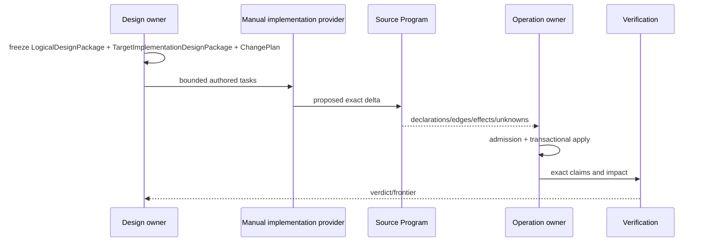

### 8.1 ManualImplementationProvider contract

必须绑定：

- accepted intent、LogicalDesignPackage、TargetImplementationDesignPackage 和 revision；
- exact source snapshot、owner cells 和 public contracts；
- authored/derived/opaque classification；
- allowed semantic delta，不以 path glob替代；
- preserved capability/failure/recovery claims；
- resource budget、Effect restrictions 和 terminal condition；
- exact unknown frontier；
- replacement/retirement obligations；
- compiler takeover condition。

它只能提交 proposal。未分类 declaration、未声明 Effect、生产可达 test seam、source root 外 executable、字符串隐藏代码、unknown 通过 terminal、手写 generated projection 或无 owner public surface 均 fail closed。

### 8.2 无自动生成时的最高控制强度

```text
ControlledManualChange =
  frozen semantic intent
  ∧ one owner change point
  ∧ exact Source Program before/after
  ∧ architecture + locality admission
  ∧ operation-scoped Effect application
  ∧ impact-derived verification
  ∧ capability conservation
  ∧ old path/owner retirement
  ∧ exact terminal readback
```

文件 diff 是该流程的物理产物，不是 scope、semantic delta 或完成证明。

## 9. Brownfield 反编译与 round trip

已有代码先成为事实，再由 owner Adopt 为语义；不得根据路径、名字、测试或相似性自动宣布业务意图。

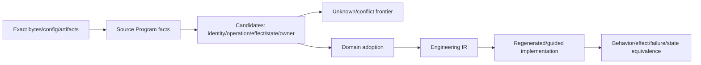

反编译输出至少包括 declaration/reference/type/alias/re-export/call/data/control/effect/resource/process/provider/schema/state/persistence/config/package/entrypoint/test/artifact/external/embedded-program/unknown facts。跨语言 frontend 可以替换，统一 semantic adoption 和 implementation compiler 不复制。

任意仓库接入使用一个可扩展、fail-closed 的 frontend 协议，而不是为每种语言另造审计系统：

```text
RepositoryObservationRequest {
  retainedSnapshot
  contentManifest
  explicitEntryHints
  language/config/package/artifact frontend requirements
  parent resource/deadline allocation
  external/opaque handling policy
}

RepositorySemanticObservation {
  exact input revision + content coverage
  declarations/types/symbols/references/control/data facts
  entrypoints/packages/build/runtime/deployment relations
  effects/capabilities/providers/resources/credentials
  schemas/state/persistence/migrations
  tests/claims/artifacts/interfaces/external contracts
  dynamic/embedded/binary/unreadable unknown frontier
}
```

| Frontend | 拥有 | 不拥有 |
| --- | --- | --- |
| language compiler/TypeChecker/LSP | 该语言 exact snapshot 的 parse/type/symbol/alias facts | Domain、业务价值、Authority |
| tree-sitter/ast-grep/semgrep/ctags | 缺正式 compiler frontend 时的结构候选与 unknown | 最终跨文件语义或成功 Claim |
| package/build/config frontend | dependency、script、target、entrypoint、configuration facts | 业务 workflow、Effect permission |
| artifact/schema/state frontend | strict format、writer/reader、durability/migration candidates | 自动接受 provenance/owner |
| binary/external frontend | manifest、signature、ABI/API、observed capability与opaque边界 | 把不可读内容声明为安全或完整 |

frontend 结果经统一 normalization 后形成同一个 Source Program fact graph；跨语言关系通过 canonical Subject/Requirement/Effect/Claim identities连接。无法静态解析的 dynamic import、reflection、code generation、native binary、remote behavior或缺失 bytes必须进入 coverage frontier，并由 runtime observation、外部合同或 owner decision收窄，不能用正则猜成“没有”。

反编译只能证明“仓库现在做了什么、依赖什么、还有什么未知”，不能从实现存在推导“产品应该要什么”。candidate Domain/owner/operation 只有经 Product/Domain owner adoption才进入 accepted model；orphan、duplicate、dominated 与 future obligation也因此不会被“当前无 consumer”机械删除或被空壳永久保留。

Round trip 的完成条件不是字节相同，而是：

```text
Preserved accepted semantics
∧ equivalent public behavior
∧ no broader Effect/authority
∧ equivalent or stronger failure/recovery
∧ no lost durable state or external contract
∧ no unexplained unknown
∧ dominated realization has an explicit retirement obligation
```

## 10. Process、Container 与其他资源的实现归属

进程、Docker daemon、Git/GitHub、compiler、filesystem、network、credential 都是 capability/resource Subjects，不是脚本字符串。

```text
Requirement
→ eligible Provision
→ retained ProviderBinding
→ child Allocation from one parent ledger
→ EffectTicket
→ Attempt
→ physical Settlement
→ domain readback
→ terminal/residue
```

统一 session 必须计量 wall/monotonic deadline、process count、input/output/record/byte totals、descendants、retry、cleanup 和 recovery；不能每个 helper 重开 timeout。lost handle 通过 durable operation journal + provider readback join，不通过重复 Effect。Docker 启动、Git 命令和 typecheck 只是不同 Provider，消费相同 operation/resource/lifecycle contract。

性能优化只能替换观察或执行 Provider：retained session、native OS API、Language Service、content-addressed fact shard、authenticated in-flight。它们不得建立第二 Source Program、第二 ActionKey、第二 scheduler 或 daemon truth。

### 10.1 Execution Runtime Microkernel

逻辑架构规定“哪些 DomainOperation、依赖、权限、资源、状态和结果必须成立”；实现层必须有一个政策无关的执行微内核统一兑现这些合同。否则每个 domain 会分别手写 Provider 调用、timeout、锁、重试、journal、cleanup 和成功判断，重新形成多套 workflow 与 resource owner。

```text
ExecutionRuntimeMicrokernel =
  typed workflow-plan and operation-plan interpreters
  + admission verifier
  + operation-scoped resource ledger
  + ready-set scheduler
  + bound-capability executor
  + attempt journal coordinator
  + settlement collector
  + cancellation/descendant tree
```

它只解释已经冻结的 `ExecutionPlan`，不拥有 Product/Domain Definition、Policy、WorkflowDefinition、Authority issuance、Provider eligibility、DomainResult 或 Verification verdict。它不是全局 service locator、任意 callback runner、命令总线或第二状态机。

该结构不是因“框架更整齐”而选择；它是以下竞争模型在 SEC 已接受 Requirement 下的裁决：

| 候选 | Hard-constraint / lifecycle 结果 | 裁决 | 反转条件 |
| --- | --- | --- | --- |
| 每个 domain 直接调用 process/filesystem/network 并自管 timeout/journal | 重复 Authority/Resource/Settlement owner；跨域组合无法守恒 | rejected | domain 永远 pure、无 Effect/资源/恢复时直接调用本就合法 |
| 一个 policyful 全局 orchestrator | 吞并 Domain Definition、Workflow、Authority 与 terminal owner | rejected | none；只能作为 generated read-only projection |
| 任意 callback/DI/service-locator framework | callback 可藏 Effect/Provider选择/ambient state；Source Program 与 impact不完整 | rejected | none；exact typed factory不属于此候选 |
| 外部 workflow/task engine 直接拥有业务 DAG | 外部状态/重试/成功语义取代 SEC owner；offline/replaceability受限 | rejected as semantic owner | 其作为满足明确 execution port 的 Provider，并通过等价/settlement验证 |
| 仅静态生成直连代码，无统一 runtime mechanism | pure 路径成本最低，但 Effect/资源/取消/lost-handle机制会重复 | accepted only for pure intra-cell path | requirement closure证明无受控 runtime boundary |
| typed policy-free execution microkernel | 集中不可重复的执行机制，同时让 policy/state/result留在各 owner；可替换 Provider | selected | 共享机制不再存在或其成本经 measurement 支配；需新 DesignDecision |

选择依据只引用已接受的跨域不变量：Authority 不放大、一个 parent resource ledger、at-most-once Effect、exact settlement、cancellation descendants、lost-handle recovery、Provider可替换和 DomainResult独立 readback。微内核不因本表自证完成；实现仍须由 Source Program 证明这些机制只有一个 active owner，并通过 fault/trace/refinement Evidence。

### 10.2 具体实现实体

| 类别 | 实体 | 由谁实现/签发 | 只拥有 | 绝不能拥有 |
| --- | --- | --- | --- | --- |
| logical input | `DomainOperationContract` | domain owner | intent/result/state/failure/effect semantics | Provider、path、handle |
| logical input | `WorkflowDefinition` | workflow owner | operation refs、result edges、guards、join/compensation | callback、resource allocation、child state |
| workflow relation | `PublicOperationRef` | workflow plan compiler | required DomainOperation identity、contract revision、input/result semantics、constraints | child Provider、ambient discovery |
| optional realization relation | `PublicOperationBinding` | implementation/composition compiler | 多 realization 时把一个 exact operation ref绑定到一个 accepted implementation entry | runtime service discovery、Provider选择、grant |
| per-workflow realization | `WorkflowPlanCompiler` | workflow implementation cell | workflow intent + operation contracts → `PureWorkflowPlan` | Provider、child state、Effect callback |
| per-domain realization | `OperationPlanCompiler` | domain implementation cell | intent + exact facts → `PureOperationPlan` | I/O、lease、grant、binding、attempt |
| per-domain realization | `DomainReadbackInterpreter` | domain implementation cell | exact post-observation → typed domain state | retry、Authority、Evidence verdict |
| per-domain realization | `DomainResultReducer` | domain implementation cell | plan + settlements + readback → DomainResult/residue | Provider exit→success shortcut |
| pure boundary | `PureWorkflowPlan` / `PureOperationPlan` | corresponding plan compiler | typed DAG、requirements、guards、obligations、unknown | Provider binding、grant、allocation、runtime handle |
| compiled boundary | `WorkflowExecutionPlan` | control/binding compiler | public operation DAG、exact contract/implementation refs、result mapping、guards/compensation、resource demands | capability Provider/effect node、child internal state |
| compiled boundary | `OperationExecutionPlan` | control/binding compiler | capability/readback DAG、exact bindings、resource demands、grant predicates、settlement obligations | live allocation/ticket、executable functions、ambient lookup |
| invocation | `WorkflowInvocation` / `OperationInvocation` | corresponding public facade | intentRef、subject/snapshot、stable key、parent context | grant、success、Provider choice |
| admitted boundary | `AdmittedExecution<Plan>` | admission owner | exact plan、live grant refs、resource-owner root Allocation ref、epoch | child Effect、business success |
| opaque admission | `ExecutionCapability<Plan>` | admission owner after intersection | exact admitted workflow/operation 可启动匹配 runtime session 的不可伪造权能 | broader grant、wrong plan kind、arbitrary operation |
| runtime session | `WorkflowRuntimeSession` | microkernel composition root | one workflow、public DomainOperation invoke/await/cancel/result collection | child Provider/state、cross-domain policy rewrite |
| runtime session | `OperationRuntimeSession` | microkernel composition root | one DomainOperation、capability/readback nodes、deadline、cancel tree、settlement | global mutable truth、cross-operation budget reset |
| resource | `ResourceLedgerSession` | resource owner | reserve/consume/release/readback parent allocations | business priority、hidden unlimited dimensions |
| scheduling | `ReadySetScheduler` | microkernel | 在 frozen ready-set 内选择合法次序 | 修改 DAG、生成步骤、跳过 blocker |
| capability | `BoundCapabilitySession` | admitted Provider binding | one exact port/provider/epoch/physical closure | service discovery、domain result、grant issuance |
| effect | `EffectTicket` | admission owner | one exact Effect node、preimage、binding、allocation、settlement obligations | reusable general permission |
| observation | `ObservationTicket` | admission owner | one exact readback/query node、observe scope、binding、allocation、coverage | mutation、Evidence verdict |
| attempt | `AttemptHandle` | BoundCapabilitySession/Provider | retained physical attempt control/observation handle | durable truth、DomainResult、Evidence |
| attempt | `ProviderSettlement` | Provider settlement compiler | physical attempt outcome、termination、provider obligations | domain success、journal mutation |
| state | `AttemptRecord` | OperationJournal/state owner | durable invocation/attempt/settlement refs与CAS sequence | Provider outcome重解释、DomainResult |
| state | `OperationJournal` | state owner | invocation/attempt/settlement/residue CAS records | workflow definition、blind replay |
| settlement | `SettlementSet` | operation settlement compiler | exact planned outcomes、resource returns、cleanup/residue refs | semantic success |
| readback | `ReadbackObservationSet` | domain readback observation owner | exact post-state observations、coverage、unknown、settlement | DomainResult、independent Evidence verdict |
| recovery | `PureRecoveryDecision` | domain recovery compiler | join/readback/compensate/retry/blocked语义候选 | grant、allocation、Effect |
| recovery | `AdmittedRecovery` | admission owner | exact recovery decision + grant/binding/allocation/preimage refs | implicit replay、delete unknown |
| proof | `VerificationRequest` | Claim/workflow owner | exact Claim、required Evidence/independence/freshness | Verdict、Effect |
| proof | `Verdict` | independent verification owner | exact request/Evidence judgment | mutation/publish/retry Authority |

这些不是都变成 class 或文件；Implementation Compiler 按 Responsibility Cell、lifecycle 和 co-change graph 选择 `type | value | pure function | internal object | durable record | retained session`。实体身份和边界是强制的，物理对象数量与放置仍由 Placement/Complexity compiler 决定。

### 10.3 调用与资源执行链

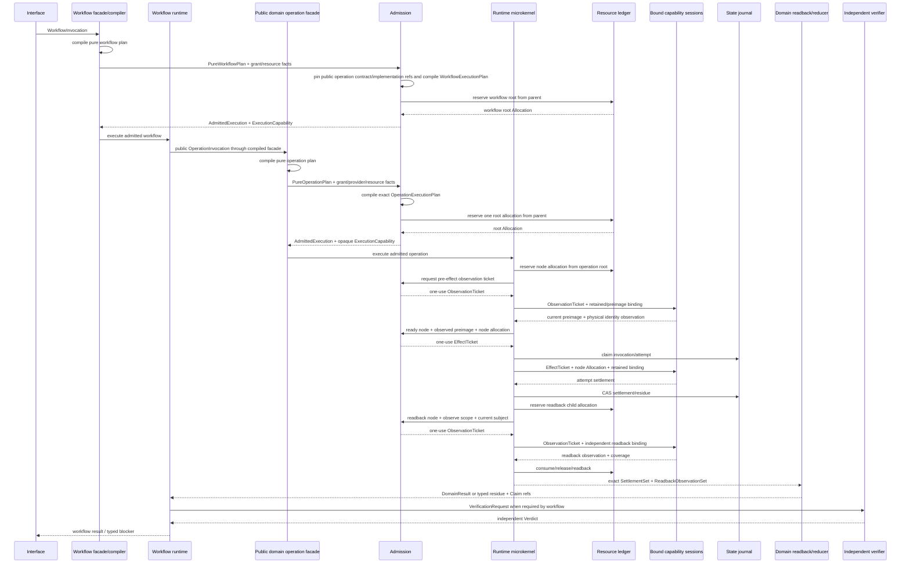

调用纪律：

| 调用种类 | 合法机制 |
| --- | --- |
| 同一 cell 内 pure value/algorithm | 普通直接调用；不经过 runtime kernel |
| 跨 cell pure query | 对方公开 typed query port；只读已提供的 immutable value/projection，不触达 filesystem/network/runtime或隐藏资源 |
| 需要新观察的 query | 作为 read-only DomainOperation进入plan/admission，使用`ObservationTicket`、Allocation、coverage与settlement |
| public Workflow | `WorkflowInvocation` → `WorkflowExecutionPlan`；child节点只按exact`PublicOperationRef`调用compiled public facade |
| public DomainOperation | `OperationInvocation` → `OperationExecutionPlan`/admission → operation runtime session |
| Workflow 调子业务 | 只引用 public DomainOperation contract/result；不调用 child Provider或读取child journal |
| filesystem/process/network/container/compiler/Git Effect | 只由 `BoundCapabilitySession` 消费 `EffectTicket` 执行 |
| state transition | state owner消费 exact transition ticket/CAS preimage |
| domain readback | 独立 `ObservationTicket` + readback binding按 obligation观察 exact subject；不复用 Effect Provider自报成功 |
| verification | independent verifier消费 Claim/Evidence；不能被 operation callback内联 |

并非“所有函数调用都框架化”。只有跨 owner、Effect、Authority、Resource、durable state、recovery 或 independent proof 边界进入微内核；纯函数和 cell 内局部协作保持直接、静态、可内联，避免动态 dispatch 与治理税。

资源不会由业务代码直接 `acquire` 一个全局对象。`WorkflowPlanCompiler`与`OperationPlanCompiler`只声明`ResourceDemand`；每层 admission从其 parent allocation保留一次 child root，scheduler只能继续向 ready node切分，不能重新读取 ceiling或创建新预算。Effect与readback Provider只能消费其 child Allocation，cleanup/readback/recovery继续消费同一 top-level remaining。新增 ResourceDimension通过resource contract扩展ledger，不修改每个DomainOperation。

admission 与 reservation 是一个可结算组合：root Allocation 成功但 grant/binding/preimage/admission随后失败时，admission owner必须在同一 settlement内返还 allocation并readback；`AdmittedExecution`未签发不得留下隐式 reservation。运行中任何 node allocation同理进入 attempt/residue，不能靠异常栈自动释放。

### 10.4 组合根、依赖方向与替换

唯一 composition root 只组装本次 AdmittedExecution 已引用的实现：

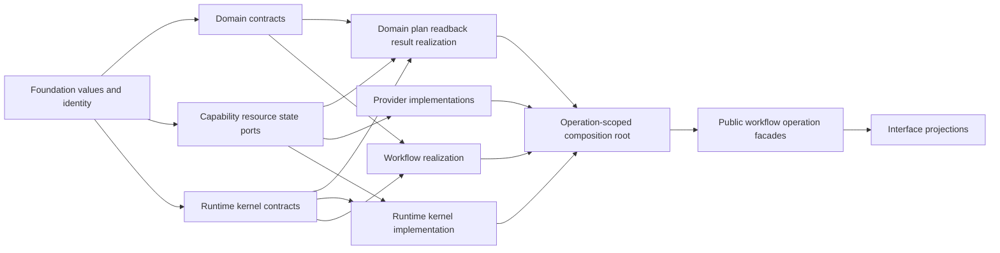

依赖要求：

- runtime kernel只依赖通用 plan/capability/resource/state contracts，不导入具体 domain；
- Provider只实现 CapabilityPort，不导入 Workflow 或 DomainResult；
- Domain realization引用 port identity与微内核 public operation API，不导入具体 Provider；
- Workflow只依赖各 DomainOperation public contract/result与`PublicOperationRef`；
- 单 realization 的public operation在编译期静态连接；只有Target/Profile存在多个accepted realization时才产生`PublicOperationBinding`，且仍由composition root静态装配，不运行runtime service locator；
- 每个operation的execution plan独立绑定底层`CapabilityProvision`；public operation realization与capability binding不能合并；
- composition root消费AdmittedExecution引用的exact Bindings，并由ImplementationPlan定位对应已接受实现；它不运行第二 resolver；
- interface只调用 operation facade，不持有 ledger、journal、Provider 或 EffectTicket；
- DomainOperation实现替换只改变ImplementationPlan中的`PublicOperationBinding`（单 realization 时是静态连接delta）；底层Provider替换只改变`CapabilityBinding`；两者均不改变逻辑Operation/Workflow identity；
- kernel机制变化若不改变 observable trace，只需 refinement/conformance验证；若改变 failure/resource/settlement语义，必须回到 CapabilityDesignSlice。

因此逻辑与实现不是靠“放在不同目录”分离，而是靠不同 owner、类型和不可达能力分离；实现可替换，但不能越过 relation重新解释逻辑。微内核的存在证明是跨 Domain 统一 Authority admission、资源守恒、attempt settlement、cancellation 与 lost-handle recovery；任何 domain-specific policy一旦进入内核即为边界违规。

## 11. Schema、Version、硬编码与测试

### 11.1 Schema/Version

`version`不是一种统一概念；实现必须使用不同类型表达不同变化轴：

| Identity | 何时存在 | 进入哪些计算 | 命名规则 |
| --- | --- | --- | --- |
| semantic identity | 同一业务含义跨实现保持稳定 | Definition/Operation/Claim refs | 不带`Vn` |
| schema revision | durable/external/cross-process reader必须区分grammar | parser/writer/migration/support | contract-owned kind+revision；normal path单generation |
| algorithm identity | 输出语义可能因算法改变 | derivation/cache/ActionKey | implementation digest/ref，不复制到API名 |
| provider/package version | 外部Provision的被观察属性 | eligibility/Binding/conformance | exact package/binary identity |
| product release/support version | 用户可见兼容与支持边界 | distribution/support/evolution | product owner scheme |
| generation identity | cutover期间区分old/new active realization | activation/readers/retirement | immutable generation ref，不等于schema版本 |

普通API、内部函数、目录、测试名字、policy或单generation算法不带`V1/V2/V3`。只有真实并存reader需要区分时，external/durable contract名才含revision；迁移完成后旧reader、alias、dispatcher和版本测试一起退役。`sec`前缀只用于必须避免外部协议、持久namespace、artifact或环境变量碰撞的边界；内部symbols、types、functions和paths不机械加品牌前缀。

TypeScript target profile对结构化边界使用Zod作为选定Schema Provider：schema是结构与基础constraint的唯一可执行owner，TypeScript type从schema推导；raw JSON在进入Zod前由bounded decoder拒绝duplicate keys、invalid UTF、trailing data与资源越界，owner validator再检查跨字段、provenance和state invariants，canonical serializer负责bytes。不得并列维护interface、手写validator、JSON cast和测试期望四份schema。非JSON/binary/protocol可绑定更适合的mature parser，但必须满足同一strict reader/writer/migration contract。

### 11.2 Hardcode

硬字面按语义分类：

| 类别 | 处置 |
| --- | --- |
| domain invariant / protocol constant | owner contract 中一次定义 |
| environment/provider fact | runtime observation/Target/Profile/Binding，不进业务源码常量 |
| derived list/path/count/version/import/export | 从SourceProgram/owner contract/Placement/Claim graph生成 |
| executable command/query/source text | typed AST/argument records/stable machine protocol；禁止shell/SQL/source拼接 |
| endpoint/credential/config/root | exact Provider/Layout/Secret capability；禁止ambient fallback |
| resource limit/timeout/retry | ResourcePolicy/Profile输入并受parent envelope收窄 |
| test fixture input | 显式 synthetic data，不冒充产品事实 |
| policy choice | policy owner + reversal/activation condition |
| presentation text | projection owner；不得被parser、test或control当machine protocol |
| unknown literal | typed finding，不能靠 allowlist 永久压制 |

内部代码优先传typed identity/ref/value，不传可互换的裸`string`。跨序列化边界才编码字符串，并由owner parser恢复类型。不得建立全局constants/version/path registry；每个常量留在真实semantic/protocol owner，其他消费者引用或消费生成projection。

### 11.3 Test realization

测试只拥有scenario和observation，不拥有生产Definition。保留类别：public behavior、durable readback、Effect sentinel、typed failure/recovery、algorithm/property、external protocol/compatibility。私有contract只有在它是独立parser/state/effect/failure边界且被真实上层消费时才有测试价值；否则直接验证public result或性质，不为private helper制造镜像测试。

测试选择、owner、fixture、producer/consumer、replacement和Evidence从SourceProgram+Claim graph编译。owner-local tests与被观察public boundary同cell放置；cross-domain/system/fault scenarios归verification responsibility，不按source tree镜像。fake Provider必须由不可伪造test issuer创建且production composition root不可接收；production Effect boundary仍需最小真实或conformance Evidence。

只有版本数字、源码文本、函数arity、路径布局、实现数组、调用次数偶然值或自写schema镜像的测试没有独立证明价值。精确数字只有在它表达业务cardinality、resource ceiling、zero Effect、protocol或durable state时保留，并从canonical owner导入/生成而非复制。测试删除要求behavior/effect/state/failure/external/future obligation归零或被更强Claim覆盖，不按文件名、数量、coverage百分比或“当前通过”裁决。

## 12. Package、库、命令与构建编排

| 对象 | 是否成为 owner 的条件 | 默认角色 |
| --- | --- | --- |
| package | 独立发布/部署/runtime/version/security boundary | physical carrier |
| external library | 真实 capability gap + stable machine API + lower lifecycle cost | Provider |
| CLI command | domain operation/interface projection | Invocation Address |
| script | bounded workflow entry；不得复制 domain logic | projection/transport |
| Nx/Bazel/task runner | 可验证 Requirement DAG execution/cache | execution Provider |
| Compiler/LSP | exact language semantics/incremental facts | interpreter Provider |
| AST/search tool | candidate discovery/codemod evidence | observation/transformation Provider |

成熟轮子优先，但先比较能力、正确性、协议、许可证、安全、资源、可替换性和退役成本。采用轮子不等于让它拥有 SEC Definition；自研 wrapper 不得只复制参数、输出或生命周期。

### 12.1 Package 与 entrypoint compiler

```text
PackagePlan = compile(
  ResponsibilityCells,
  public/external consumers,
  runtime/deployment/security/toolchain boundaries,
  dependency and release obligations
)

EntrypointPlan = compile(
  public DomainOperations + Queries + Workflow refs,
  Interface contracts,
  TargetProfile
)
```

- 默认一个Bun-native产品package；只有PackagePlan证明独立发布、部署、runtime、security、toolchain或external support boundary时才拆package。domain数量、目录层级和团队数量不产生package；
- package name/version/exports/dependencies/scripts从PackagePlan、Placement与public demand生成；root config只保留生态必须的canonical入口，不能复制owner事实；
- CLI/API/IDE/Agent entrypoints是同一public operation/query的projection。命令树、参数schema、exit/result映射和machine JSON contract从EntrypointPlan生成；command handler只做parse→invoke→project，不含Domain decision、Provider选择或Effect；
- 不创建一命令一脚本、一工具一wrapper或一目录一barrel。需要给生态工具的thin launcher必须是generated projection，consumer-zero时自动退役；
- dependency declaration表达Requirement，Resolution绑定exact package/integrity/config；package manager只物化lock与依赖，不选择业务实现。SEC host依赖、Target workspace依赖和toolchain Provider依赖分开；
- 多package时使用Bun workspace作为physical carrier，但构建/测试/发布DAG仍由SEC的Requirement/Claim graph产生；workspace tool不得成为semantic scheduler。

命令、package或脚本没有独立业务identity；其稳定identity来自所投影的Operation/Query/Provider Requirement。用户改名或重新放置entrypoint不应改变业务、ActionKey或state identity，除非external protocol本身把地址纳入合同。

### 12.2 Reuse Compiler

最大化的是**合法复用后的全生命周期净收益**，不是共享函数数量。Reuse Compiler 从 ImplementationGraph 聚类 Requirement/contract/behavior/effect/failure/resource/lifecycle 等价候选：

| 可复用层 | 复用单位 | 不得共享 |
| --- | --- | --- |
| value/contract | immutable value、identity、strict parser、failure algebra | 不同 semantic identity 的可变 DTO |
| pure algorithm | 相同输入语义、deterministic result、unknown policy | 偷读 ambient state 的 helper |
| fact/derivation | exact content-addressed shard + interpreter closure | path/mtime/process-local truth |
| DomainOperation | public operation contract/result | 私有 state writer、caller-composed Effect |
| CapabilityPort | Requirement contract | 具体 Provider/credential/path |
| Provider | 同 Requirement、platform/security/resource/settlement conformance | domain success、跨 owner mutable state |
| Workflow pattern | 相同 dependency/compensation algebra 的 parameterized compiler | 用 generic callback 隐藏不同业务状态机 |
| Artifact/cache | 相同 ActionKey、producer、environment、validator | Evidence/Authority/canonical state |

```text
ReuseAllowed(A, B) iff
  semanticRequirementEquivalent
  ∧ failureAndUnknownEquivalent
  ∧ authorityDoesNotExpand
  ∧ resourceAndSettlementComposable
  ∧ lifecycleAndVersionCompatible
  ∧ oneCanonicalOwner
  ∧ lifecycleCost(shared) < lifecycleCost(separate)
```

不满足完整等价时只复用更低层纯算法或 CapabilityPort，不能用 `shared/common/utils/core` 目录名强迫合并。每个复用决定产生 consumer refs、差异 frontier、owner、Binding 和反转条件；Provider/版本/需求变化自动使相关复用 Binding stale。

### 12.3 Complexity Existence Proof

每个 authored entity、public surface、state、adapter、cache、daemon、package、schema、test、workflow 和 abstraction 都必须有可生成的存在证明：

```text
ExistenceProof(node) =
  independent responsibility or invariant
  ∨ real consumer requirement
  ∨ authority/security/protocol boundary
  ∨ state/lifecycle/recovery boundary
  ∨ measured resource/performance dominance
  ∨ accepted FutureObligation with bounded carrying cost
```

证明从owner graph、consumer/effect/state facts、benchmark、external contract和FutureObligation refs派生，不逐文件手写理由。候选方案、删除反事实、成本向量、支配关系和反转条件属于Design Compiler的派生产物；`ImplementationGraph`只保存accepted node与其proof refs，`TargetImplementationDesignPackage`只引用相应决策和推导结果。

若`counterfactualDelete(node)`不降低accepted outcome、约束、恢复、Evidence、未来义务或全生命周期成本，该node为`derivable | duplicate-owner | dominated | orphan`，不能因已有代码、测试、名字或“架构感”继续存在。

## 13. Architecture Migration Transaction

任何重命名、移动、拆分、合并、owner 调整、包变化或生成切换都是一次架构迁移：

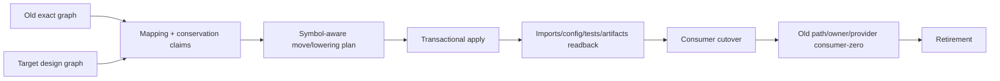

```text
ArchitectureMigration {
  oldGraphRevision
  targetDesignRevision
  subjectMappings
  capabilityConservationClaims
  authoredMoves
  generatedProjectionUpdates
  packageAndConfigUpdates
  durableStateMigrations
  testClaimMappings
  unknowns
  cutoverPredicate
  rollbackOrForwardRecovery
  retirementSet
}
```

迁移工具消费 symbol/reference graph，不依赖字符串替换。路径缩短不是成功；所有 imports、package exports、CLI entrypoints、runtime locators、generated registries、tests、docs 和 artifacts 必须重编/readback，旧地址 consumer-zero 后才退休，不留 alias/compat barrel。

## 14. Machine admission 与自动化入口

### 14.1 Declaration admission

每个 production declaration 必须可计算：

```text
DeclarationClass
OwnerCell
SemanticSubject
DependencyLayer
Visibility
StateRole
EffectRole
GenerationKind
ProviderOrPort
Lifecycle
ClaimCoverage
FutureObligationRefs
```

信息优先从类型、引用、调用、Effect、state、parser/writer、package 与 owner graph 推导；只有不可计算的产品取舍由 owner metadata 补充。无法分类的 declaration 保持 bounded unknown，并只阻断受影响 promotion/Effect。

### 14.2 Continuous pipeline


- editor loop复用 long-lived Language Service 与 content-addressed fact shards；
- typecheck/audit/test-impact/unused/duplicate/hardcode/placement共用同一 Source Program；
- cheap sentinel 只验证改变的 owner/claim；
- full evidence 对 frozen exact tree/environment 运行一次并按 ActionKey 复用；
- failure input 未变时复用 deterministic failure；
- rule/LogicalDesignPackage/TargetImplementationDesignPackage变化只失效反向依赖它的shards/claims；
- CI/GitHub Actions 是 executor Provider，不是唯一 merge truth；本地受信 executor 可产生同合同 Evidence。

## 15. 对抗模型

| 候选方案/事故 | 失败原因 | 必须回到 |
| --- | --- | --- |
| 一个巨型 `platform` 或 `modules` 目录 | 路径替代 responsibility | Cell + Placement Compiler |
| 每个 domain 固定五层目录 | 空壳、机械跳转、无真实 consumer | graph-demanded roles |
| root `index.ts` 统一出口 | 第二 API 图、环、unused 不可见 | narrow public operation/contract |
| 为未来保留无 consumer 空实现 | active shell 冒充 obligation | FutureObligation + activation predicate |
| 直接删除有未来价值的实现 | capability intent 丢失 | conservation classification + obligation |
| 任何无 consumer 都保留 | orphan 永久污染 | counterfactual + activation evidence |
| AI 按自然语言直接改代码 | scope/semantics/authority 混合 | accepted intent + compilation |
| 每次改动全仓扫描 | observation 没有共享/增量 | Content Manifest + fact shards |
| 每次跑 full `tsc` | final verifier当 editor service | Language Service + affected closure + ActionKey |
| 新 daemon 缓存所有事实 | 第二 truth、生命周期成本 | content-addressed facts；有需求才 daemon |
| Docker/Git/TS 各自做 session | 重复预算/settlement/authority | shared operation/resource kernel + typed ports |
| Provider unavailable 自动 fallback | 改变 identity/semantics | typed unavailable；上游重新 Binding |
| catch-all `false/null` 后写入 | unknown 被降为 absent | discriminated readiness |
| timeout 后 cleanup 无界继续 | parent ledger被绕过 | settlement allocation + typed residue |
| 测试 mock 是普通函数 | test authority可进 production | opaque test issuer / separate entry |
| 全局版本 registry | schema owner被集中复制 | per-contract owner + derived index |
| 多文件同步更新一行 | authored projection/mirror | Change Locality Compiler |
| package manager/workspace接管业务 DAG | 工具获得语义 owner | execution Provider only |
| 只靠 lint path allowlist | 新路径绕过，意图不可见 | declaration/relationship admission |
| 文档声明架构完成 | prose自证实现 | Source Program + readback + Evidence |
| compiler生成代码但手工可改 | dual writer | generated ownership + byte readback |
| migration长期双读双写 | 多 active generation | bounded migration reader + atomic cutover |

## 16. 伪实现合同

```text
compileImplementationArchitecture(input):
  logical := requireValidatedSystemArchitecture(input.logicalRevision)
  source := requireExactSourceProgram(input.sourceRevision)
  entities := classifyDeclarations(source, logical)
  cells := joinAcceptedResponsibilities(entities, logical.responsibilities)
  dag := compileOwnerAndLayerDag(cells, source.references)
  assertNoCrossCellCycleOrDuplicateOwner(dag)
  placements := compilePlacements(cells, dag, source.effects, source.coChange)
  locality := compileChangeLocality(input.intent, logical, source, placements)
  generation := compileIntentToCode(input.intent, locality, placements)
  migration := compileArchitectureMigration(source, generation.targetGraph)
  attacks := modelCheckImplementationDesign(
    entities, dag, placements, locality, generation, migration
  )
  return admissibleOrExactFrontier(...)
```

```text
applyGovernedImplementation(plan, operationCapability):
  require plan.admitted and exact input revisions
  stage generated bytes and governed-authored proposal
  recompile Source Program from staged exact bytes
  require semantic delta == plan.semanticDelta
  require effects/owners/dependencies/unknowns within plan
  publish through operation-scoped transaction
  read back graph, behavior, state, settlements and retirement
  emit terminal receipt; never self-issue verification verdict
```

## 17. Conformance Model：实现设计的可反驳规格

逻辑model checks由`docs/system-architecture.md`完成；本层验证目标实现是否完整、忠实且非支配地refine已冻结逻辑。`ConformanceModel`是独立设计产物，不是测试文件清单，也不包含任何执行PASS：

```text
ConformanceModel {
  logicalDesignPackageRef
  targetImplementationDesignPackageRef
  structuralProperties
  semanticRefinementProperties
  authorityEffectResourceProperties
  stateFailureRecoveryProperties
  evolutionAndExtensionProperties
  economyAndPerformanceProperties
  scenarioGenerators
  faultTransformations
  observableProjections
  independentOracles
  coverageAndNotApplicableProofs
  exactUnknownFrontier
}
```

property和oracle先于代码与测试存在；model checker、type/schema checker、property runner、scenario executor、benchmark和independent verifier只是它们的可替换realization。一个实现可以没有某种测试框架，但不能没有对应的observable与oracle；一个测试即使绿色，也不能扩充`ConformanceModel`中的Claim。

Target Implementation Freeze 前必须成立：

| Property | 必须成立 |
| --- | --- |
| Unity | 每个 semantic fact/identity/writer/parser/resolver/terminal owner 唯一 |
| Orthogonality | Definition/Authority/Capability/Resource/Execution/Proof 不互相冒充 |
| Locality | 每个 authored change point有 owner；derived fanout不需手写 |
| Acyclicity | cell/layer DAG 无跨 owner runtime SCC |
| Capability conservation | every accepted ProductCapability/FutureObligation has a mapped realization claim or explicit Product decision |
| No authority amplification | AI/tool/provider/test/projection不能扩大 Grant/Effect |
| Round-trip | brownfield→IR→implementation 保持声明的 behavior/effect/failure/state |
| Incremental equivalence | clean、warm、delta、cache-disabled结果等价 |
| Recovery | 每个 Effect crash/lost-handle/timeout有 terminal或typed residue |
| Evolution | normal path 单 generation；migration bounded 且可退休 |
| Economy | 无 orphan、mirror、dominated facade、second graph/cache/session |
| Future extensibility | 新 Target/language/provider/domain 通过 typed extension加入，不改 core identity |

每个target package维度必须由ConformanceModel覆盖；不存在“先写进设计、以后再想怎么证明”的字段：

| Target design dimension | Required conformance | Rejection |
| --- | --- | --- |
| component/trust-zone topology | owner uniqueness、static DAG、zone crossing、issuer/producer/verifier separation | topology-unowned / cycle / trust-collapse |
| data ownership/persistence/consistency | one schema+transition owner、strict read/write、linearization、retention、recovery | competing-writer / invalid-state / unreadable-residue |
| source placement/visibility | every declaration owned、public-demand minimality、address move equivalence | placement-unresolved / hidden-public-surface |
| package/entrypoint/interface | real release/runtime/security boundary、parse→invoke→project、no second resolver | package-unjustified / interface-authority |
| compiler/frontend/backend | deterministic exact inputs、coverage/unknown、round-trip、conservative extension | semantic-drift / incomplete-coverage |
| operation/capability/resource runtime | grant/binding/allocation intersection、at-most-once Effect、settlement/readback | authority-amplified / budget-escaped / effect-unsettled |
| deployment/profile | cold reconstructibility、profile semantic equivalence、tenant/isolation constraints | profile-drift / hidden-singleton |
| concurrency/time/recovery | serializable conflicts、authoritative expiry、lost-handle join/recovery | race / clock-authority / unsafe-replay |
| schema/evolution/provider | exact grammar、one active generation、provider conformance/cutover/retirement | schema-drift / dual-generation / substitution |
| performance/incremental reuse | clean/warm/delta/cache-disabled equivalence + measured lifecycle cost | stale-reuse / dominated-cost |
| generated/authored/opaque ownership | one writer、generation readback、opaque boundary、no unique projection information | dual-writer / hidden-source / mirror |
| implementation observables/Claims | every Claim has observable coverage、independent oracle与invalidation | self-proof / unverifiable-claim |
| exact frontier | every unknown has affected closure、owner、closure condition与promotion block | unknown-crosses-boundary |

必要的生成性质测试：输入顺序置换、地址移动、provider替换、same-path ABA、缓存损坏、unknown注入、partial Effect、lost handle、deadline exhaustion、concurrent mutation、old/new migration interruption、clean/incremental equivalence、manual/generated等价和删除反事实。

### 17.1 通用故障族的实现投影

下表只引用 `docs/design-calculus.md` 的 F01–F24，不重新定义故障；它确保每个通用攻击在实现层都有确定拒绝点。

| Fault | 实现层拒绝点 |
| --- | --- |
| F01 identity spoof | semantic identity/Address 分型 + retained physical Binding + same-path ABA check |
| F02 stale snapshot | ImplementationGraph/ChangePlan exact input revisions + pre-effect recompile |
| F03 unknown crossing | exact coverage frontier + discriminated readiness + affected promotion block |
| F04 authority amplification | ExecutionCapability/ObservationTicket/EffectTicket opaque capability；AI/test/provider只提交 observation/proposal |
| F05 provider substitution | Requirement→eligible Provision→Binding；ambient fallback不可达 |
| F06 resource reset | one parent operation ledger贯穿 child/retry/readback/cleanup/recovery |
| F07 non-reentrant concurrency | capability contract驱动 sequence/join/bounded parallel plan |
| F08 lost handle | durable OperationKey/journal + provider/domain readback + join/recovery |
| F09 cleanup failure | settlement保存 primary + cleanup error + typed residue |
| F10 crash intermediate state | intent-before-effect + immutable journal + state owner recovery |
| F11 schema drift | one owner parser/writer/schema + bounded migration reader + new generation cutover |
| F12 owner/facade cycle | owner/layer DAG + SCC witness + dependency inversion + facade existence proof |
| F13 projection mirror | generated projections from ImplementationGraph + Change Locality rejection |
| F14 self-proof | Claim/Evidence issuer separation + exact independent readback |
| F15 duplicate Effect | OperationKey claim + single-flight/join + settlement/readback before retry |
| F16 future abstraction | FutureObligation/reference evidence；active code只在 activation predicate 后生成 |
| F17 context loss | content-addressed design package refs/ChangePlan/operation journal；summary无Authority |
| F18 external consumer unknown | protocol/support evidence + bounded unknown；内部 consumer-zero不足以删除 |
| F19 cache poisoning | content/config/provider/environment ActionKey + strict cache readback |
| F20 migration coexistence | normal path single generation + migration-only old reader + consumer-zero retirement |
| F21 hidden source | exact content classification + embedded-program interpreter/typed opaque |
| F22 unbounded input | streaming shared entries/bytes/depth/time/signal allocation；不预扫两次 |
| F23 presentation protocol | structured machine interface + strict parser；shell/presentation只作显示/transport |
| F24 architecture change | ArchitectureMigration old/new graph、symbol-aware move、cutover/readback/retirement |

### 17.2 代表性系统 trace

| 输入变化 | 唯一 authored change point | 自动派生 | 必要验证/迁移 |
| --- | --- | --- | --- |
| pure query已有immutable input | query contract/consumer | 直接typed调用；不创建runtime session或allocation | result/unknown property；zero hidden observation/effect |
| query需要filesystem/network/runtime新观察 | DomainOperation requirement/readback owner | PureOperationPlan→ObservationTicket→coverage/settlement→typed result | observe authority、budget、provider/subject identity、unknown |
| 多Domain workflow | WorkflowDefinition | PureWorkflowPlan→workflow root allocation→public child OperationInvocations→result join | child state/provider不可达、parent resource conservation、cancel/compensation |
| 单Domain mutation | DomainOperation | PureOperationPlan→exact Binding→AdmittedExecution→preimage→EffectTicket→settlement/readback | authority、at-most-once、partial/lost-handle、independent result |
| 增加领域 invariant | domain contract/decision owner | operation guards、diagnostics、claims、docs projection | behavior + failure/property impact |
| durable schema 演进 | state contract owner | writer/parser schema refs、migration plan、readback claims | old exact grammar→new generation→consumer-zero |
| Git/Docker/TypeScript Provider 替换 | provider Binding/adoption owner | affected operations、ActionKeys、resource plan | conformance、identity、Effect、settlement；不改领域 Definition |
| 源码/目录移动 | PlacementDecision | imports、exports、config、test selection、docs navigation | graph equivalence + old address consumer-zero |
| 多命令组成新业务操作 | DomainOperation owner | Requirement DAG、bindings、allocations、journal/readback | partial failure、lost handle、duplicate delivery |
| typecheck/audit/test-impact重复扫描 | Source Program observation owner | shared fact shards与各 consumer projection | cold/warm/delta/cache-disabled equivalence + performance |
| 退役任意Product capability | Product/Change decision owner | consumer/artifact/test/package/provider retirement closure | capability conservation + external consumer unknown + zero residue |
| 删除或合并测试 | Claim/test-value owner | producer-consumer/effect/failure/replacement census | replacement claim不弱化；非零图不得删除 |
| 引入新语言/Target | frontend/Target/Profile extension owner | language facts→通用 IR；Target bindings→Backend | core semantic identity不变 + unknown/conformance |
| 采用成熟外部库 | Capability adoption owner | port Binding、provider epoch、Impact | license/security/API/resource/settlement/retirement |
| 进程句柄丢失或主机重启 | operation/state owner | journal claim、provider readback、join/recovery | zero duplicate Effect + terminal/residue |
| 新反例推翻设计前提 | Design owner | reverse dependency closure stale、new affected design packages | model/fault rerun + migration；旧Evidence不可复用 |

## 18. Target Implementation DesignPackage

目标实现架构冻结时只发布未来成品设计，不夹带任何被观察实现的inventory或迁移步骤：

```text
TargetImplementationDesignPackage {
  logicalDesignPackageRef
  acceptedImplementationDecisionRefs
  implementationGraphSchema
  componentAndTrustZoneTopology
  dataOwnershipPersistenceAndConsistencyTopology
  sourcePlacementAndVisibilityRules
  packageEntrypointAndInterfaceProjectionRules
  semanticCompilerFrontendBackendContracts
  operationCapabilityResourceRuntimeContracts
  deploymentProfilesAndExtensionContracts
  concurrencyTimeFailureRecoveryAndCrossDomainProtocols
  schemaEvolutionAndExternalProviderContracts
  performanceCostAndIncrementalReuseModel
  generatedAuthoredOpaqueOwnershipRules
  implementationObservableAndClaimRefs
  alternativesDominanceAndReversalRefs
  exactDesignFrontier
}
```

实现理由不写成本文中的第二份散文结论：不可推导选择引用其Responsibility owner内的`DesignDecision`；候选、成本、支配、fault traces与反转影响由Design Compiler生成；本package只保存exact refs。这样后来者既不重复判断，也不能让实现文档成为隐藏的产品或逻辑owner。

`ConformanceModel`不是本package的输入或字段：Conformance Compiler在实现包冻结后独立消费`LogicalDesignPackage + TargetImplementationDesignPackage`，并把结果并列挂入`DesignKnowledgeGraph`。实现包只发布observable/Claim refs，不能反向导入测试、verifier、Evidence或ConformanceModel；否则会形成“实现按自己的验证器定义正确”的依赖环。

`TargetImplementationDesignPackage`只描述未来成品，不包含任何被观察仓库的路径清单、迁移批次、兼容alias、临时adapter、task列表或完成声明。只有它通过§17并明确frontier后，独立迁移编译器才可把某个exact observed implementation graph与本target比较，生成一次`ArchitectureMigration`。迁移不能回写目标设计以迁就输入工程；真实反例若推翻目标前提，必须先重算对应owner decision与受影响DesignPackage。
