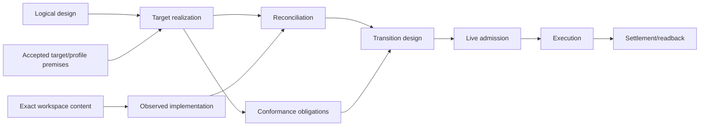

# SEC 实现架构

本文只拥有 `LogicalDesignArtifact → TargetImplementationArtifact` 的 refinement 合同。它不拥有 Product、Domain 边界、当前源码事实、运行 Authority、Evidence verdict 或迁移执行。frontmatter 的 `domain` 是现行文档 registry 的 authority-scope 标签，不是语义 Domain 证明。

## 1. 边界



五类事实必须分型：

| model | 唯一输入 | 输出 | 禁止 |
| --- | --- | --- | --- |
| `LogicalDesignArtifact` | accepted Product/Domain definitions | implementation-independent obligations | path、library、Provider、current code |
| `TargetImplementationArtifact` | logical artifact + accepted target/profile/cost premises | desired responsibility realizations、contract/port refs、ImplementationBindings、placement、observable obligations | current implementation、migration、live Provision availability/ExecutionBinding/Effect |
| `ObservedImplementationModel` | exact `WorkspaceContentView` + interpreter/tool closure | declarations、relations、effects、coverage、unknown | target adoption、业务价值、write authority |
| `ImplementationReconciliationModel` | exact target + exact observed model | matched/missing/surplus/drift/unknown relations | 修改任一输入、执行迁移 |
| `ArchitectureTransitionDesign` | reconciliation + preservation/retirement decisions | ordered change/cutover/recovery/retirement obligations | 重写 target 迁就 current、签发 live grant |

`ConformanceModel` 与 target artifact 并列生成：目标只声明 observable obligations，独立 compiler 生成 properties、faults、oracles 和 coverage。target 不导入 verifier，contract 不导入 compiler，index 不反向成为 owner。

## 2. 通用模型与项目实例

实现架构只定义与语言、工具和业务无关的derived carriers，并引用上游或运行时identity：

```text
owned: ResponsibilityRealization + ImplementationUnit + PlacementDecision
     + SourceObservationGeneration + Reconciliation
     + TransitionDesign + ConformanceObligation
referenced: PublicContract + Port + Binding + RuntimeEntity + PhysicalBinding
```

Git、Docker、TypeScript、Bun、数据库、浏览器或某框架只是 profile 中的 Provider/Target/Tool facts；它们不能进入通用类型的分支名。新技术通常只新增 Provision 与 Binding；只有现有 constructs 无法表达新语义时才演进 meta-model。

## 3. Refinement 的完备性

```text
Realizes(responsibilityRealizationRef, responsibilityScopeRef)
Carries(implementationUnitRef, responsibilityRealizationRef, semanticOriginRefs)
Materializes(logicalRequirementRef, implementationUnitRefs | required-unmaterialized)
Preserves(realizationTrace, invariant/state/failure/effect semantics)
Projects(semanticFact, derivableViews)
```

```text
ImplementationRefinementClosed =
  every logical obligation is materialized or explicitly unmaterialized
  and every ResponsibilityRealization traces to exactly one ResponsibilityScope
  and every ImplementationUnit traces to exactly one ResponsibilityRealization
  and no implementation adds Authority, Effect, state or failure semantics
  and every public trace preserves logical behavior and information-flow limits
  and every unknown has an affected closure and closure condition
  and no address, package, facade, index or generated view creates meaning
```

允许一个ResponsibilityRealization含多个ImplementationUnit，也允许多个operations共享同一Provider；不允许一个declaration同时实现无关ResponsibilityScopes、两个owners竞争同一writer/parser/resolver/terminal、或实现用fallback/ambient state偷换Requirement。

## 4. 实现决策

每个实现选择必须且只能得到一种处置：

```text
RealizationChoiceDisposition =
  | derived-by-closed-rule { derivationRef }
  | governed-design-choice { decisionRef, reversalRef }
  | implementation-local-freedom { freedomEnvelopeRef }
  | bounded-frontier { alternatives, affectedOutcomes, closurePredicateRef }
```

若选择会改变 public behavior、state、durable bytes、Authority、Effect、failure、security、compatibility、determinism、concurrency、resource ceiling 或 Claim 可验证性，它不是 local freedom。若多个候选均满足硬约束，则按全生命周期成本做 Pareto 比较；不能由当前文件布局、已安装工具或 Agent 偏好暗选。

## 5. 递归 artifact 与最小读取

`TargetImplementationArtifact` 与系统 scope 同构地递归，而不是一份全系统巨型 DTO：

```text
TargetImplementationScopeArtifact = exact {
  scopeRef,
  logicalObligationRefs,
  childScopeArtifactRefs,
  responsibilityRealizationRefs,
  crossBoundaryContractRefs,
  observableAndConformanceRefs,
  frontierRefs,
  artifactDigest
}
```

父节点只保存边界、child refs、完成谓词和 frontier；细节在最小 child。consumer 按 purpose 读取最小传递闭包，授权的全系统审计再递归展开同一图。切片大小改变表达量，不改变 identity、结果或 blocker。

## 6. 规范片段

| 片段 | 唯一职责 |
| --- | --- |
| [实现实体、边界与依赖](implementation-architecture/model-and-boundaries.md) | Canonical Implementation Graph、ResponsibilityRealization、可见性、public surface 与 facade/index 存在证明 |
| [Source、Placement 与 Generation](implementation-architecture/source-and-generation.md) | source ownership 总入口；下挂 placement、target/current round trip 与增量观察三片段 |
| [实现供给与装配](implementation-architecture/supply-and-assembly.md) | native/library/Wasm/process/device/remote 等供给形态、适配、替换、装配与最小边界 |
| [执行运行时与物化](implementation-architecture/execution-and-materialization.md) | provider-backed Effect、process/container/resource session、durable worker、generation/materialization |
| [迁移与一致性](implementation-architecture/migration-and-conformance.md) | target-current transition、cutover/retirement、machine admission、独立 conformance |

## 7. 完成

```text
ImplementationArchitectureClosed =
  RefinementClosed
  and ImplementationGraphClosed
  and SourceAndGenerationDesignClosed
  and SupplyAndAssemblyClosed
  and ExecutionMaterializationClosed
  and ArchitectureTransitionDesignClosed
  and ConformanceModelClosed
```

任一项缺失时只发布 typed frontier；不得以代码、测试、绿色命令、兼容壳或未来抽象声明设计完成。

<!-- sec-clause {"blocker":null,"kind":"stable-decision"} -->
## 规范片段

实现架构是逻辑义务到目标 realization 的可验证 refinement；target、current observation、reconciliation、transition 与 conformance 分型且单向依赖。通用模型不含业务或工具品牌，物理地址与生成视图不产生语义所有权。
