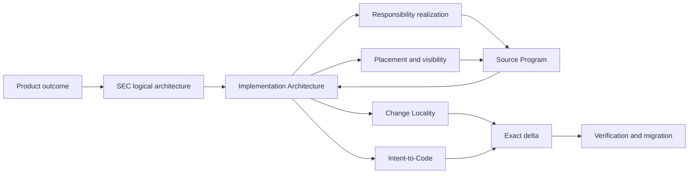
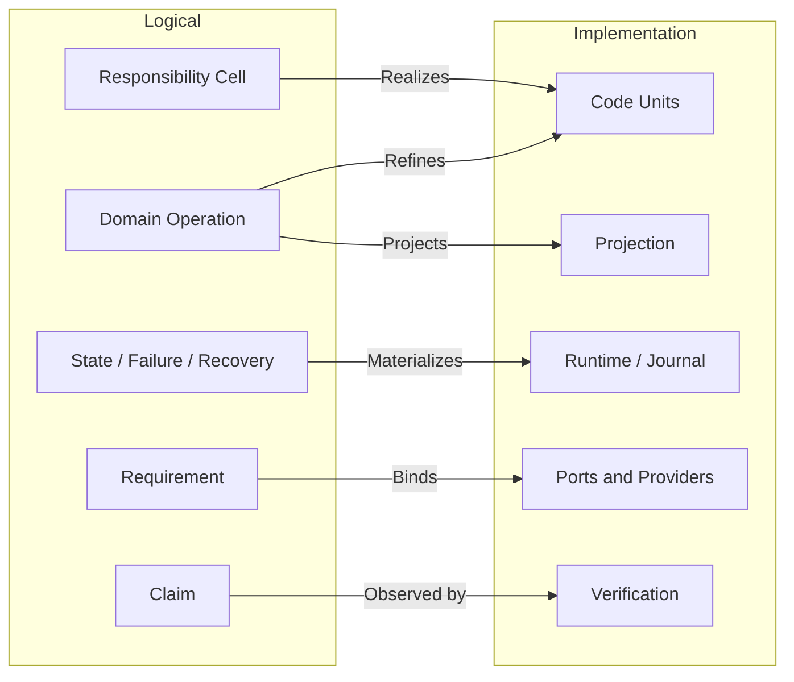
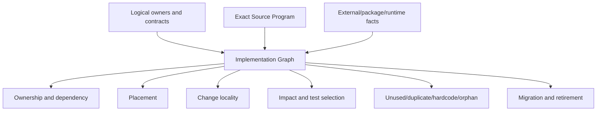
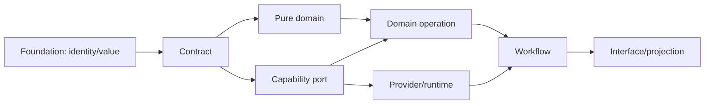
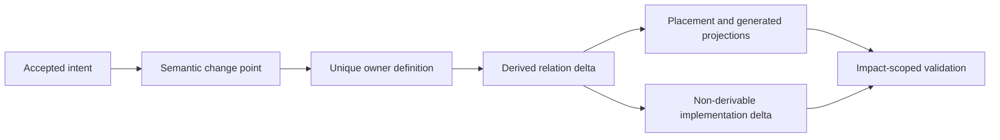
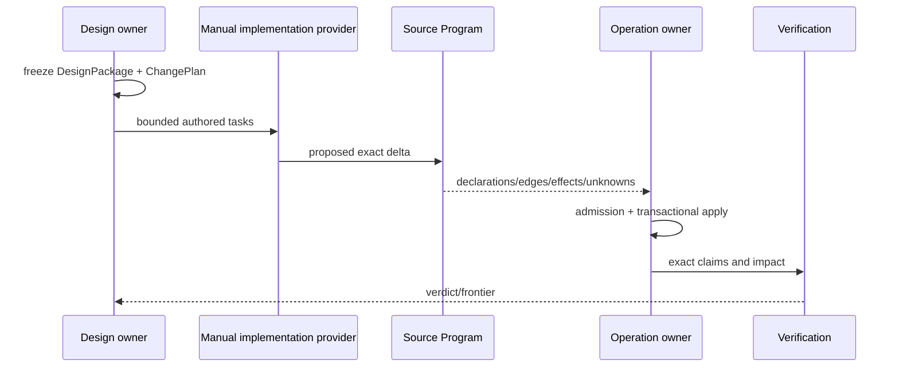
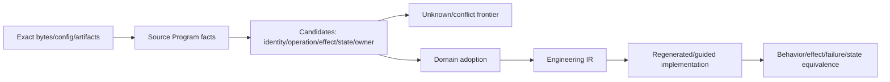
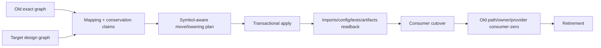

# SEC 实现架构与意图编译

本文拥有 SEC 逻辑架构到工程实现的唯一映射：实体实现、声明归属、依赖可见性、源码与包的放置、变更局部性、意图到代码、手写与生成边界、现有工程反编译、迁移和退役。

本文不拥有产品目标、领域语义、通用原则、运行时状态、具体 Target lowering 或当前源码清单。上游分别是 `docs/product.md`、`docs/design-calculus.md`、`docs/engineering-constitution.md` 和 `docs/system-architecture.md`；面向用户工程的 Target Program/Backend lowering 由 `docs/compiler-target-ir.md` 拥有；实际声明、引用、Effect 与 unknown 由 exact Source Program 观察。

## 1. 统一模型与所有权边界

统一不是把所有逻辑放入一个模块，而是让所有投影引用同一组 semantic identity、relation 和 revision。



| Owner | 拥有 | 不拥有 |
| --- | --- | --- |
| Design Calculus | relation、constraint、transition、proof 的通用演算 | SEC 实体、路径、实现 |
| Engineering Constitution | 通用工程不变量与拒绝语义 | SEC 领域事实、源码结构 |
| SEC System Architecture | logical responsibility、authority、operation、resource、lifecycle、proof | declaration/file/package 的物理实现 |
| Implementation Architecture | logical→implementation 映射、局部变更、生成和迁移 | 产品决策、领域字段、当前事实 |
| Domain owner | Definition、state machine、domain operation、failure algebra | 文件位置、Provider 实现、工作流 |
| Source Program | exact declarations/references/effects/unknown observations | semantic owner、permission、业务价值 |
| Compiler Target IR | 用户工程的 Target Program、Resolution、Binding、lowering | SEC 自身仓库组织与变更 admission |

实现架构只产生 `ImplementationPlan`、`PlacementDecision`、`ChangePlan` 与 typed frontier；它不能签发产品 Definition、AuthorityGrant、EffectTicket、Evidence verdict 或完成状态。

### 1.1 逻辑—实现对应关系

逻辑架构与实现架构不是按节点或文件一一同构，而是一个可验证的 refinement relation：

```text
Realizes : ImplementationEntity → exactly one ResponsibilityCell or InfrastructureCell
Materializes : LogicalRequirement → one or more ImplementationEntities | required-unmaterialized
Preserves : ImplementationTransition → LogicalInvariant / StateTransition / FailureSemantics
Projects : LogicalFact → zero or more derivable public/generated views
```



允许的非一一关系：

- 一个 Cell 由多个高内聚 CodeUnit 实现；
- 多个 Operation 复用同一个满足合同的 capability Provider；
- 一个 logical fact 产生多个 deterministic projections；
- 同一实现算法可在不同 Target/Profile 下形成不同 Binding。

禁止的非一一关系：

- 一个 authored declaration 同时拥有两个不相干的 Responsibility；
- 同一 writer/parser/resolver/terminal/Effect identity 有多个 active owner；
- 实现新增 logical model 未声明的 Authority、Effect、state 或 failure；
- logical Requirement 在实现中被路径、环境、fallback 或 presentation 偷换；
- 多个手写 projection 反向成为并列事实。

### 1.2 完美对应的判据

“完美对应”指 semantic completeness 与 observational refinement，不指目录形状相同：

```text
PerfectCorrespondence =
  totalLogicalMaterialization
  ∧ uniqueImplementationOwnership
  ∧ publicBehaviorRefinement
  ∧ effectAndAuthorityNonAmplification
  ∧ stateFailureRecoveryPreservation
  ∧ exactTraceabilityBothDirections
  ∧ noUnexplainedImplementationSurplus
  ∧ boundedExplicitUnknowns
```

| 失配 | 含义 | 结果 |
| --- | --- | --- |
| logical node 无实现 | 尚未完成或明确未来义务 | `required-unmaterialized` |
| implementation node 无 logical owner | orphan、重复轮子或隐藏权力 | reject/retire |
| logical edge 未在实现保持 | requirement/state/failure 被丢失 | reject |
| implementation 多出 Authority/Effect | 权力放大 | reject |
| 多个实现竞争同 identity | duplicate owner/generation | migrate/cut over |
| 地址变化但 relation 不变 | 纯 placement delta | semantic no-op |
| Provider 变化而 contract 不变 | Binding delta | impact/conformance only |
| 无法解释的 dynamic/opaque edge | observation frontier | bounded unknown |

双向 trace 必须可机器查询：从任一逻辑 Requirement 找到实现 declaration、Binding、Effect、settlement、readback 和 tests；从任一 production declaration/Effect/state record 反查唯一 Cell、Operation、Claim 与 evolution state。

### 1.3 对变化与验证的影响

```text
logical delta       → responsibility/operation/claim impact → implementation delta
implementation delta→ recompiled realization graph          → semantic equivalence or drift
address-only delta  → placement/import/config migration      → no semantic claim reset
binding-only delta  → provider conformance/runtime impact    → no Definition rewrite
schema/state delta  → parser/writer/migration/recovery impact → evolution required
```

验证选择由差异类型决定，不由 changed-file 数量决定。只有 logical correspondence 变化才扩展 semantic claims；纯生成投影或地址变化只验证生成/readback/consumer-zero；Provider/physical变化验证 Binding、Effect、settlement 与环境，不重跑无关业务语义。

### 1.4 归属与最优性判定

```text
Logical(x) iff
  x can be stated without declaration/package/file/provider/runtime Address
  and x must remain true across every valid implementation

Implementation(x) iff
  x selects or constrains a realization of accepted logical facts
  using Source Program, Target/Profile, provider, physical or lifecycle facts
```

| 问题 | 裁决 owner | 输出 |
| --- | --- | --- |
| 用户最终要什么、可接受何种取舍 | Product/Domain | accepted outcome/decision |
| 什么实体、责任、状态、操作、权限和失败必须存在 | logical System Architecture | validated logical graph |
| 哪个逻辑候选满足原则且支配其他候选 | Design Calculus + Project Constitution | accepted/non-dominated model 或 frontier |
| 哪种代码/包/Provider/生成/迁移实现逻辑模型 | Implementation Architecture | accepted/non-dominated realization 或 frontier |
| 实际是否按设计存在并运行 | Source Program + runtime readback + Verification | observation/evidence/verdict |

“逻辑可直接推出一个实现”仍分两步：逻辑 owner 只签发约束；Implementation Compiler 证明在当前 Target/physical/cost inputs 下候选实现唯一或支配其他候选，再签发 realization decision。否则逻辑层会偷带路径、工具和平台，implementation observation 也会反向改写业务真相。

最优不是永久全序：先淘汰违反 hard constraints 的方案，再按全生命周期成本做 Pareto dominance；仍有多个非支配候选且差异依赖未给出的产品偏好时，输出 decision frontier。新事实或偏好改变时重编，而不是把旧最优固化为无条件规则。

## 2. 实现实体代数

每个对象必须属于一个主实体，并通过关系连接其他实体；目录、文件名、类名和字符串不能隐式创造实体。

| 平面 | 实体 | 唯一 owner | identity 来源 | 生命周期 |
| --- | --- | --- | --- | --- |
| Purpose | ProductCapability、Outcome、NonGoal、FutureObligation | Product/Domain | accepted definition digest | proposed→accepted→retired |
| Semantics | Subject、Definition、Invariant、FailureKind、ClaimDefinition | Domain contract | semantic owner + canonical content | draft→active→superseded |
| Responsibility | ResponsibilityCell、PublicDemand、OwnerEdge | Architecture + Domain adoption | owned Subject set + obligation refs | candidate→accepted→retired |
| Operation | DomainOperation、RequirementDAG、StateMachine | Domain operation owner | operation definition digest | planned→admitted→terminal/residue |
| Capability | CapabilityPort、Provision、ProviderBinding | Capability/provider owner | contract + provider epoch | discovered→eligible→bound→settled |
| Resource | ResourceLedger、Allocation、RetainedCapability | Resource owner | parent ledger + allocation key | reserved→consumed/released→terminal |
| Knowledge | ContentSnapshot、SourceProgram、Declaration、Reference、Unknown | Observation/interpreter owner | exact content + interpreter closure | observed→validated→stale |
| Constraint | Constraint、AdmissionPredicate、ReversalCondition | contract/architecture owner | owner definition + applicable subjects | proposed→active→superseded |
| Change | Intent、DesiredDelta、SemanticDelta、BindingDelta、ImpactClosure | Product/Domain + Change Management | accepted intent + endpoint revisions | proposed→admitted→applied/rejected |
| Authority | Principal、AuthorityGrant、Delegation、EffectScope | authority issuer | principal + exact subject/scope/epoch | proposed→active→expired/revoked |
| Implementation | CodeUnit、DataContract、AdapterBoundary、GeneratedProjection | Implementation Architecture + cell owner | owner Subject + realization kind | planned→materialized→retired |
| Physical | SourceArtifact、Package、Config、RuntimeState、Cache、Artifact | physical/lifecycle owner | content digest + Address/physical binding | created→active→terminal/residue |
| Execution | EffectTicket、Attempt、Observation、Settlement、Residue | operation/resource/provider/state owners | OperationKey + binding + allocation | admitted→running→terminal/residue |
| Proof | Gate、Evidence、Verdict、ActionKey | Verification owner | claim set + exact inputs/environment | required→observed→valid/stale |
| Evolution | Generation、Migration、Cutover、Retirement | Change Management + state owner | old/new graph + transition identity | prepared→shadow→active→retired |
| Interface | IntentProjection、QueryProjection、Command/API Contract | interface owner | referenced domain operation/result | draft→published→retired |

当前 schema 的表面计数是 16 个 entity families；这只是可生成的 meta-model projection，不是“SEC 永远只能有 16 个实体”。通用 Design Calculus 当前有 7 个基本构件、8 个 Statement variants 和 12 个 typed relation kinds；SEC logical profile 当前有 9 个 planes、16 个 hard-constraint families 和 S0–S9 十个 stages。领域实体实例数量由 Product/Domain definitions 与 exact graph 决定，不手写固定总数。

### 2.1 不可混淆关系

```text
Subject ≠ Address
Definition ≠ Observation
Requirement ≠ Provision
Provision ≠ AuthorityGrant
Binding ≠ Allocation
Attempt ≠ Settlement
Settlement ≠ DomainResult
Evidence ≠ Verdict
FutureObligation ≠ ActiveImplementation
GeneratedProjection ≠ SemanticOwner
```

实现必须用不同类型或不可伪造 capability 表达上述边界；共享 `string`、可 JSON 克隆的结构对象或命名约定不足以形成边界。

### 2.2 Canonical Implementation Graph

所有实现判定从同一个不可变 `ImplementationGraph` 编译；它是 exact inputs 的 content-addressed 结果，不是全局手写 registry、数据库真相或 daemon-owned mutable model。

```text
ImplementationGraph {
  inputRevisions: logical architecture + domain definitions + content snapshot
  nodes: accepted entities + observed declarations/artifacts + typed unknowns
  edges:
    owns | realizes | declares | imports | calls | reads | writes
    requires | provides | binds | allocates | effects | settles
    produces | consumes | generates | projects | tests | proves
    migrates | supersedes | retires | preserves | invalidates
  coverage: exact universe + interpreter/provider frontier
  digest: canonical graph bytes
}
```



同一 graph 的投影可以独立缓存，但不能重扫后改变语义。新增 analyzer 只能消费 graph 或贡献一个有 coverage 的 interpreter/provider；不得另建 tests-only regex、imports graph、package graph、process inventory 或 path registry。

```text
ImplementationCoverage =
  exactContentUniverse
  ∧ everyExecutableContentClassified
  ∧ everyDeclarationOwnedOrUnknown
  ∧ everyPublicSurfaceHasConsumerOrObligation
  ∧ everyEffectHasOperationAndSettlement
  ∧ everyDurableStateHasWriterParserRecovery
  ∧ everyGeneratedProjectionHasUpstreamOwner
```

覆盖不足只形成精确 frontier；不能把未观察对象计为 absent、unused、safe-to-delete 或 admissible。

## 3. Responsibility Cell 的工程实现

Responsibility Cell 是最小稳定语义所有权单元，不是固定目录模板。

```text
ResponsibilityCell =
  owned Subjects
  + public domain operations / queries
  + state writer / parser / resolver ownership
  + Effect / settlement / readback / recovery closure
  + failure algebra
  + proof obligations
  + evolution conditions
```

一个 cell 可以物化为多个 CodeUnit；一个 CodeUnit 不能同时实现多个互不相干的 cell。是否拆分由 declaration/reference/effect/co-change graph 决定，不由文件行数决定。

| 物化角色 | 允许内容 | 依赖方向 | 拒绝条件 |
| --- | --- | --- | --- |
| contract | identity、value、schema、strict parser、failure/result algebra | foundation only | import operation/provider/runtime |
| domain | invariant、pure transition、decision/compiler | contract | Effect、ambient observation |
| operation | Requirement DAG、Effect plan、readback/recovery/terminal | contract + domain + ports | 自选 Provider、重算 Authority |
| port | capability requirement 和 typed settlement | contract/domain | 具体库、PATH、credential |
| provider | 外部/物理 capability 的实现与 conformance | port + foundation/runtime primitive | 解释业务成功 |
| runtime | lease、journal、worker、allocation、terminal readback | operation + port/provider | 新定义领域规则 |
| projection | CLI/API/Agent/read model | public operation/query/result | 重算 decision、写 canonical state |
| verification | public/effect/failure/property/compatibility claim | public surface + test capability | 私有源码文本作 oracle |

角色只在真实内容存在时物化；禁止空目录、空 `index`、逐文件 facade、统一 export barrel 或为了视觉对称建立层。

### 3.1 Cell 切分判定

```text
split(A, B) iff
  independent semantic responsibility
  ∨ independent state writer/parser/resolver
  ∨ independent authority/security boundary
  ∨ independent lifecycle/recovery
  ∨ reusable capability with multiple real consumers
  ∨ different deployment/versioning boundary
```

```text
merge(A, B) iff
  same Subject/invariant/change cadence
  ∧ no independent public consumer
  ∧ no independent state/authority/lifecycle
  ∧ separation only adds translation/re-export/mirror
```

`unknown` 不触发机械拆分或合并；它生成 bounded Design frontier。

### 3.2 Infrastructure Cell 与未来能力

`InfrastructureCell` 仍是 Responsibility Cell；其 outcome 是被真实 domain/compiler/operation consumer 需要的共享语义或 capability，不是“通用”“core”“以后会用”。它必须满足相同的唯一 owner、public demand、Effect/lifecycle/recovery 和验证条件。

未来能力分离为 Definition 与 active implementation：

```text
FutureObligation {
  desiredCapability
  preservedConstraints
  evidenceOrReferenceImplementation
  activationPredicate
  intendedConsumers
  reversalPredicate
  supersessionRule
}
```

| 状态 | 保存什么 | production authority |
| --- | --- | --- |
| active demand | owner contract + implementation + consumer graph | 按 operation contract |
| accepted future obligation | 意图、不变量、激活条件、必要算法 Evidence | none |
| bounded experiment | isolated reference implementation + expiry + hypothesis | none |
| superseded | 替代映射与理由 | none |
| orphan | 无 demand/obligation/experiment/evidence | delete |

如果现有实现包含尚不能完整形式化的独特算法知识，先将其作为 content-addressed reference evidence 绑定到 FutureObligation，再从 production graph 退役；不能靠 Git 偶然可恢复，也不能让无 consumer 的 active API、facade、版本或 test shell 永久存在。

## 4. 依赖、可见性与 Facade

### 4.1 逻辑依赖 DAG



反馈通过 data/result/next-request 进入更高层 orchestrator，不通过反向 import、callback type、global registry 或 root barrel 成环。SCC 只允许同一 cell 内不可进一步分离的 declaration cohesion；跨 cell SCC 必须经依赖反转或 operation 重构消除。

### 4.2 Public surface

对外公开的对象只有：

- immutable value/contract；
- strict parser/validator；
- query；
- DomainOperation；
- CapabilityPort；
- terminal result/readback；
- 明确的 external protocol projection。

实现类、runtime helper、raw provider、test issuer、路径、内部 state record 和重导出聚合器默认 private。

### 4.3 Facade existence proof

```text
FacadeAllowed =
  authorityIntersection
  ∨ externalProtocolNormalization
  ∨ independentLifecycleOrCompatibility
  ∨ semanticOperationOverMultipleCapabilities
```

每个 facade 必须登记它新增的不可由下层表达的 invariant、真实 consumer 和 retirement condition。只有缩短 import、隐藏移动、保留旧名字、汇总 exports 或“未来可能有用”的 facade 是 `duplicate-owner`。

## 5. Placement Compiler：从语义图推导源码组织

### 5.1 唯一 authored source root

| Root | 语义 |
| --- | --- |
| `src/**` | SEC authored production executable source；唯一 production source root |
| `tests/**` | 跨 cell/system/e2e/fault/property verification；不镜像 `src` |
| `docs/**` | stable definitions/decisions 和 generated navigation；无 runtime truth |
| ecosystem-native config roots | 外部工具唯一 canonical 配置；无业务语义副本 |
| Runtime State | durable operation/recovery state；不进入 Git authored source |
| Cache | 可删除、可重算、有限额的 acceleration facts |
| Artifacts | exact published result/Evidence；不作为 mutable truth |

`source/` 只可作为被 SEC 编译的目标工作区中的用户业务目录语义；SEC 自身 production code 不能与 `src/` 并存第二 root。路径是 Address，不能编码 owner identity。

### 5.2 Cell-first layout

示意路径不是固定模板：

```text
src/<domain>/<responsibility-cell>/
  <cohesive code units only>
```

只有 graph 证明需要时，cell 内才出现 `contract/`、`operation/`、`providers/`、`runtime/` 或 `projection/`。不强制 `modules/`、五层目录或每层 `index.ts`。package 只在独立发布、部署、工具链、权限、版本或运行时边界成立时创建；目录不是 package。

### 5.3 Placement function

```text
place(codeUnit) = f(
  responsibilityCell,
  dependencyLayer,
  visibility,
  stateAndEffectClosure,
  lifecycleAndRecovery,
  runtimePackaging,
  coChangeGraph,
  authoredGeneratedOpaque
)
```

Placement 输出：

```text
PlacementDecision {
  codeUnitId
  ownerCellId
  role
  visibility
  packageBoundary?
  logicalAddress
  allowedDependencyCells
  generationKind
  colocatedVerificationClaims
  migrationObligations
  evidenceDigest
}
```

源码路径由 PlacementDecision 生成；import alias、package export、test selection、ownership、architecture boundary 与文档导航均从同一 decision graph 投影，禁止手写路径镜像。

## 6. Change Locality Compiler

目标不是最少修改文件，而是最少修改**不可推导的 authored facts**。



```text
AuthoredDelta = MinimalOwnerDefinitionDelta + NonDerivableImplementationDelta
DerivedDelta  = regenerate(accepted owner graph, exact Source Program)
TouchedOwners = irreducibleOwners(AuthoredDelta)
```

常规单责任语义变化的 `TouchedOwners = 1`。多 owner 只在同一 accepted intent 跨越不可合并的真实责任时成立，并必须由一个 ChangeTransaction 绑定各 owner 的 precondition、apply order、rollback/forward recovery 和 readback；“每处改一行”不是 transaction。

### 6.1 局部性成本

不使用固定评分阈值；比较候选方案的 Pareto 关系：

```text
LifecycleCost =
  authoredOwnerCount
  + authoredFactDuplication
  + nonDerivedFileFanout
  + contextReadBytes
  + invalidatedFactShards
  + verificationClosure
  + migrationAndRetirementCost
  + residualUnknownRisk
```

如果方案 B 在所有维度不差且至少一项更优，方案 A 被支配并删除。低文件数但引入第二 owner、隐藏字符串源码或失去 readback 的方案不构成优化。

### 6.2 扇出根治规则

| 观察 | 根因分类 | 目标表达 |
| --- | --- | --- |
| 多文件重复版本/Schema 字面 | canonical contract 未被引用 | owner literal type + strict parser；projection generated |
| 多测试复制路径/列表/计数 | Source Program/owner graph 被手写镜像 | relation/property assertion + derived fixture |
| 多 CLI 复制字段 | projection 没有 command-specific contract | named projection compiler |
| import move 修改全仓 | placement/import graph 非生成 | symbol-aware move plan + generated aliases/config |
| 多 Provider 重复 deadline/env | operation/resource contract 未下沉 | shared opaque operation session |
| 多文档重复原则 | owner/projection 混淆 | canonical clause refs + generated navigation/context |
| 多处 `if platform/version` | Target/Profile/Binding 泄漏 | Resolution/Binding compiler + provider conformance |

### 6.3 Locality admission

```text
compileChangeLocality(intent, graph):
  semanticDelta := resolveAcceptedChangePoint(intent)
  owners := irreducibleSemanticOwners(semanticDelta)
  authored := computeNonDerivableDelta(owners, semanticDelta)
  derived := compileAllProjections(graph + authored)
  impact := computeFactAndBindingImpact(graph, authored, derived)
  reject duplicate facts, handwritten projections, unexplained fanout
  return ChangePlan(authored, derived, impact, migration, proof)
```

任何未解释的 authored 多点修改、同一 literal 多 owner 变化、跨 cell private import 或新增 facade 都产生 typed `change-locality-unresolved`，不允许用测试绿色消除。

## 7. Intent-to-Code Compiler

自动生成代码的权威链不是自然语言→补丁，而是 accepted intent→可验证语义→implementation binding→lowering。

```mermaid
flowchart LR
  U[User intent] --> N[Normalized intent + unknown]
  N --> A[Product/Domain acceptance]
  A --> SD[Semantic Delta]
  SD --> IR[Engineering IR]
  IR --> RC[Responsibility + operation model]
  RC --> PL[Placement + visibility]
  PL --> TP[Target/Profile/Binding]
  TP --> CP[Code Plan]
  CP --> L[Deterministic lowering / governed proposal]
  L --> T[Transactional apply]
  T --> RB[Parse/type/behavior/readback]
  RB --> E[Evolution + retirement]
```



### 7.1 Intent contract

```text
Intent {
  desiredOutcomes
  explicitNonGoals
  preservedCapabilities
  acceptedTradeoffs
  targetSubjects
  constraints
  uncertainty
}
```

Intent 不含 path、provider、implementation、test count、version label 或 Effect permission。自然语言解析只产生 proposal 与 ambiguity frontier；只有 Product/Domain owner 的 accepted Definition 才进入编译。

机器负责所有由已知 inputs、relations、constraints 和 policies 可决定的结论；只有在多个非支配终局之间仍缺少授权偏好时，才请求 Product/Domain decider 提供新的 choice input。人工不能替代可计算的 owner、impact、placement、provider eligibility、resource、test selection 或 retirement 判断。

### 7.2 三种实现类别

| Kind | 来源 | 修改方式 | Authority |
| --- | --- | --- | --- |
| deterministic-generated | 完整 IR + Target/Profile/Binding 可确定 bytes | 只改上游 owner并重编；禁止手改 | compiler receipt |
| governed-authored | 当前算法不能从规范唯一确定，但可验证责任/合同 | ChangePlan 约束下由人/Agent/工具提出 patch | accepted plan + exact readback |
| opaque-external | 外部库、binary、远端服务、未知/不可读内容 | provider adoption、upgrade、replace 或 typed opaque | external capability contract |

`governed-authored` 不是永久例外：每次手写中可稳定推导的事实进入 IR/compiler，不能推导的部分保持最小并记录 FutureObligation。`opaque-external` 不能被代码生成器静默编辑或把 presentation 当 protocol。

### 7.3 Compilation products

```text
IntentCompilation {
  acceptedDefinitionRefs
  semanticDelta
  preservedCapabilityClaims
  futureObligations
  responsibilityDelta
  operationDelta
  implementationBindings
  placementDecisions
  generatedArtifacts
  governedAuthoredTasks
  opaqueBoundaries
  impactAndMigration
  verificationClaims
  exactUnknownFrontier
}
```

编译器必须证明新实现覆盖旧系统的 accepted current value，并对仍成立的未来设计目的逐项 `preserved | superseded-by-better | rejected-with-product-decision | unknown`。代码、测试或文档存在本身不证明 capability conservation。

### 7.4 AI 与工具角色

AI、Compiler API、LSP、ast-grep、semgrep、codemod、Nx/Bazel 等只可成为阶段 Provider：

- compiler/type checker 拥有语言语义；
- LSP 拥有编辑期增量导航；
- AST/codemod 执行已批准的 symbol-aware transformation；
- build orchestrator 执行 Requirement DAG 和 cache，不拥有业务 DAG；
- AI 提议不可唯一 lower 的 governed-authored delta；
- domain owner + operation admission + readback 决定是否接受。

不得为每个工具建立镜像 wrapper 或第二 graph；工具变化只改变 Provider Binding，不改变上游 Definition。

## 8. 自动编译实现前的受控模式

当前没有覆盖全部工程语义的 Intent-to-Code Compiler 时，人、Agent 和外部工具共同作为 `ManualImplementationProvider`，但不能拥有定义、范围或成功。



### 8.1 ManualImplementationProvider contract

必须绑定：

- accepted intent、DesignPackage 和 revision；
- exact source snapshot、owner cells 和 public contracts；
- authored/derived/opaque classification；
- allowed semantic delta，不以 path glob替代；
- preserved capability/failure/recovery claims；
- resource budget、Effect restrictions 和 terminal condition；
- exact unknown frontier；
- replacement/retirement obligations；
- compiler takeover condition。

它只能提交 proposal。未分类 declaration、未声明 Effect、生产可达 test seam、source root 外 executable、字符串隐藏代码、unknown 通过 terminal、手写 generated projection 或无 owner public surface 均 fail closed。

### 8.2 无自动生成时的最高控制强度

```text
ControlledManualChange =
  frozen semantic intent
  ∧ one owner change point
  ∧ exact Source Program before/after
  ∧ architecture + locality admission
  ∧ operation-scoped Effect application
  ∧ impact-derived verification
  ∧ capability conservation
  ∧ old path/owner retirement
  ∧ exact terminal readback
```

文件 diff 是该流程的物理产物，不是 scope、semantic delta 或完成证明。

## 9. Brownfield 反编译与 round trip

已有代码先成为事实，再由 owner Adopt 为语义；不得根据路径、名字、测试或相似性自动宣布业务意图。



反编译输出至少包括 declaration/reference/type/alias/re-export/call/data/control/effect/resource/process/provider/schema/state/persistence/config/package/entrypoint/test/artifact/external/embedded-program/unknown facts。跨语言 frontend 可以替换，统一 semantic adoption 和 implementation compiler 不复制。

Round trip 的完成条件不是字节相同，而是：

```text
Preserved accepted semantics
∧ equivalent public behavior
∧ no broader Effect/authority
∧ equivalent or stronger failure/recovery
∧ no lost durable state or external contract
∧ no unexplained unknown
∧ dominated old implementation retired
```

## 10. Process、Container 与其他资源的实现归属

进程、Docker daemon、Git/GitHub、compiler、filesystem、network、credential 都是 capability/resource Subjects，不是脚本字符串。

```text
Requirement
→ eligible Provision
→ retained ProviderBinding
→ child Allocation from one parent ledger
→ EffectTicket
→ Attempt
→ physical Settlement
→ domain readback
→ terminal/residue
```

统一 session 必须计量 wall/monotonic deadline、process count、input/output/record/byte totals、descendants、retry、cleanup 和 recovery；不能每个 helper 重开 timeout。lost handle 通过 durable operation journal + provider readback join，不通过重复 Effect。Docker 启动、Git 命令和 typecheck 只是不同 Provider，消费相同 operation/resource/lifecycle contract。

性能优化只能替换观察或执行 Provider：retained session、native OS API、Language Service、content-addressed fact shard、authenticated in-flight。它们不得建立第二 Source Program、第二 ActionKey、第二 scheduler 或 daemon truth。

## 11. Schema、Version、硬编码与测试

### 11.1 Schema/Version

版本只属于真实 durable/external/cross-process/migration contract。每个保留格式只有一个 owner constant、literal type、strict parser、canonical serializer 和 migration/retirement policy。普通 API、内部函数、测试名字、路径和单 generation 算法不因 `V1/V2` 获得价值。

版本变化修改 owner contract 一处；writers/readers/tests/docs 从 owner 投影。未知版本 fail closed；真实旧态只进入 bounded migration reader，normal path 单 generation。

### 11.2 Hardcode

硬字面按语义分类：

| 类别 | 处置 |
| --- | --- |
| domain invariant / protocol constant | owner contract 中一次定义 |
| environment/provider fact | runtime observation/binding，不进源码常量 |
| derived list/path/count/version | 从 Source Program/registry/contract 生成 |
| test fixture input | 显式 synthetic data，不冒充产品事实 |
| policy choice | policy owner + reversal/activation condition |
| unknown literal | typed finding，不能靠 allowlist 永久压制 |

### 11.3 Test realization

测试只拥有 scenario 和 observation，不拥有生产 Definition。保留类别：public behavior、durable readback、Effect sentinel、typed failure/recovery、algorithm/property、external protocol/compatibility。只有版本数字、源码文本、函数 arity、路径布局、实现数组或自写 schema 镜像的测试没有独立证明价值。

测试选择、owner、fixture、producer/consumer、replacement 和 Evidence 从 Source Program + Claim graph 编译；测试删除要求真实 behavior/effect/state/failure/external contract 归零或由更强 claim 替代，不按文件名或数量裁决。

## 12. Package、库、命令与构建编排

| 对象 | 是否成为 owner 的条件 | 默认角色 |
| --- | --- | --- |
| package | 独立发布/部署/runtime/version/security boundary | physical carrier |
| external library | 真实 capability gap + stable machine API + lower lifecycle cost | Provider |
| CLI command | domain operation/interface projection | Invocation Address |
| script | bounded workflow entry；不得复制 domain logic | projection/transport |
| Nx/Bazel/task runner | 可验证 Requirement DAG execution/cache | execution Provider |
| Compiler/LSP | exact language semantics/incremental facts | interpreter Provider |
| AST/search tool | candidate discovery/codemod evidence | observation/transformation Provider |

成熟轮子优先，但先比较能力、正确性、协议、许可证、安全、资源、可替换性和退役成本。采用轮子不等于让它拥有 SEC Definition；自研 wrapper 不得只复制参数、输出或生命周期。

## 13. Architecture Migration Transaction

任何重命名、移动、拆分、合并、owner 调整、包变化或生成切换都是一次架构迁移：



```text
ArchitectureMigration {
  oldGraphRevision
  targetDesignRevision
  subjectMappings
  capabilityConservationClaims
  authoredMoves
  generatedProjectionUpdates
  packageAndConfigUpdates
  durableStateMigrations
  testClaimMappings
  unknowns
  cutoverPredicate
  rollbackOrForwardRecovery
  retirementSet
}
```

迁移工具消费 symbol/reference graph，不依赖字符串替换。路径缩短不是成功；所有 imports、package exports、CLI entrypoints、runtime locators、generated registries、tests、docs 和 artifacts 必须重编/readback，旧地址 consumer-zero 后才退休，不留 alias/compat barrel。

## 14. Machine admission 与自动化入口

### 14.1 Declaration admission

每个 production declaration 必须可计算：

```text
DeclarationClass
OwnerCell
SemanticSubject
DependencyLayer
Visibility
StateRole
EffectRole
GenerationKind
ProviderOrPort
Lifecycle
ClaimCoverage
FutureObligationRefs
```

信息优先从类型、引用、调用、Effect、state、parser/writer、package 与 owner graph 推导；只有不可计算的产品取舍由 owner metadata 补充。无法分类的 declaration 保持 bounded unknown，并只阻断受影响 promotion/Effect。

### 14.2 Continuous pipeline

```mermaid
flowchart LR
  E[Edit / intent] --> CM[Incremental Content Manifest]
  CM --> SP[Incremental Source Program]
  SP --> AD[Architecture + locality admission]
  AD --> IG[Generated projection / governed patch]
  IG --> DI[Delta + impact]
  DI --> TS[Cheap affected sentinels]
  TS --> F[Freeze exact ActionKey]
  F --> EV[Missing/stale formal evidence only]
  EV --> PR[Promotion readback]
```



- editor loop复用 long-lived Language Service 与 content-addressed fact shards；
- typecheck/audit/test-impact/unused/duplicate/hardcode/placement共用同一 Source Program；
- cheap sentinel 只验证改变的 owner/claim；
- full evidence 对 frozen exact tree/environment 运行一次并按 ActionKey 复用；
- failure input 未变时复用 deterministic failure；
- rule/DesignPackage 变化只失效依赖它的 shards/claims；
- CI/GitHub Actions 是 executor Provider，不是唯一 merge truth；本地受信 executor 可产生同合同 Evidence。

## 15. 对抗模型

| 候选方案/事故 | 失败原因 | 必须回到 |
| --- | --- | --- |
| 一个巨型 `platform` 或 `modules` 目录 | 路径替代 responsibility | Cell + Placement Compiler |
| 每个 domain 固定五层目录 | 空壳、机械跳转、无真实 consumer | graph-demanded roles |
| root `index.ts` 统一出口 | 第二 API 图、环、unused 不可见 | narrow public operation/contract |
| 为未来保留无 consumer 空实现 | active shell 冒充 obligation | FutureObligation + activation predicate |
| 直接删除有未来价值的实现 | capability intent 丢失 | conservation classification + obligation |
| 任何无 consumer 都保留 | orphan 永久污染 | counterfactual + activation evidence |
| AI 按自然语言直接改代码 | scope/semantics/authority 混合 | accepted intent + compilation |
| 每次改动全仓扫描 | observation 没有共享/增量 | Content Manifest + fact shards |
| 每次跑 full `tsc` | final verifier当 editor service | Language Service + affected closure + ActionKey |
| 新 daemon 缓存所有事实 | 第二 truth、生命周期成本 | content-addressed facts；有需求才 daemon |
| Docker/Git/TS 各自做 session | 重复预算/settlement/authority | shared operation/resource kernel + typed ports |
| Provider unavailable 自动 fallback | 改变 identity/semantics | typed unavailable；上游重新 Binding |
| catch-all `false/null` 后写入 | unknown 被降为 absent | discriminated readiness |
| timeout 后 cleanup 无界继续 | parent ledger被绕过 | settlement allocation + typed residue |
| 测试 mock 是普通函数 | test authority可进 production | opaque test issuer / separate entry |
| 全局版本 registry | schema owner被集中复制 | per-contract owner + derived index |
| 多文件同步更新一行 | authored projection/mirror | Change Locality Compiler |
| package manager/workspace接管业务 DAG | 工具获得语义 owner | execution Provider only |
| 只靠 lint path allowlist | 新路径绕过，意图不可见 | declaration/relationship admission |
| 文档声明架构完成 | prose自证实现 | Source Program + readback + Evidence |
| compiler生成代码但手工可改 | dual writer | generated ownership + byte readback |
| migration长期双读双写 | 多 active generation | bounded migration reader + atomic cutover |

## 16. 伪实现合同

```text
compileImplementationArchitecture(input):
  logical := requireValidatedSystemArchitecture(input.logicalRevision)
  source := requireExactSourceProgram(input.sourceRevision)
  entities := classifyDeclarations(source, logical)
  cells := joinAcceptedResponsibilities(entities, logical.responsibilities)
  dag := compileOwnerAndLayerDag(cells, source.references)
  assertNoCrossCellCycleOrDuplicateOwner(dag)
  placements := compilePlacements(cells, dag, source.effects, source.coChange)
  locality := compileChangeLocality(input.intent, logical, source, placements)
  generation := compileIntentToCode(input.intent, locality, placements)
  migration := compileArchitectureMigration(source, generation.targetGraph)
  attacks := modelCheckImplementationDesign(
    entities, dag, placements, locality, generation, migration
  )
  return admissibleOrExactFrontier(...)
```

```text
applyGovernedImplementation(plan, operationCapability):
  require plan.admitted and exact input revisions
  stage generated bytes and governed-authored proposal
  recompile Source Program from staged exact bytes
  require semantic delta == plan.semanticDelta
  require effects/owners/dependencies/unknowns within plan
  publish through operation-scoped transaction
  read back graph, behavior, state, settlements and retirement
  emit terminal receipt; never self-issue verification verdict
```

## 17. 设计完备性与性质验证

Design Freeze 前必须执行逻辑 model checks：

| Property | 必须成立 |
| --- | --- |
| Unity | 每个 semantic fact/identity/writer/parser/resolver/terminal owner 唯一 |
| Orthogonality | Definition/Authority/Capability/Resource/Execution/Proof 不互相冒充 |
| Locality | 每个 authored change point有 owner；derived fanout不需手写 |
| Acyclicity | cell/layer DAG 无跨 owner runtime SCC |
| Capability conservation | accepted current/future value 有 mapped claim 或明确产品裁决 |
| No authority amplification | AI/tool/provider/test/projection不能扩大 Grant/Effect |
| Round-trip | brownfield→IR→implementation 保持声明的 behavior/effect/failure/state |
| Incremental equivalence | clean、warm、delta、cache-disabled结果等价 |
| Recovery | 每个 Effect crash/lost-handle/timeout有 terminal或typed residue |
| Evolution | normal path 单 generation；migration bounded 且可退休 |
| Economy | 无 orphan、mirror、dominated facade、second graph/cache/session |
| Future extensibility | 新 Target/language/provider/domain 通过 typed extension加入，不改 core identity |

必要的生成性质测试：输入顺序置换、地址移动、provider替换、same-path ABA、缓存损坏、unknown注入、partial Effect、lost handle、deadline exhaustion、concurrent mutation、old/new migration interruption、clean/incremental equivalence、manual/generated等价和删除反事实。

### 17.1 通用故障族的实现投影

下表只引用 `docs/design-calculus.md` 的 F01–F24，不重新定义故障；它确保每个通用攻击在实现层都有确定拒绝点。

| Fault | 实现层拒绝点 |
| --- | --- |
| F01 identity spoof | semantic identity/Address 分型 + retained physical Binding + same-path ABA check |
| F02 stale snapshot | ImplementationGraph/ChangePlan exact input revisions + pre-effect recompile |
| F03 unknown crossing | exact coverage frontier + discriminated readiness + affected promotion block |
| F04 authority amplification | DomainOperation/EffectTicket opaque capability；AI/test/provider只提交 observation/proposal |
| F05 provider substitution | Requirement→eligible Provision→Binding；ambient fallback不可达 |
| F06 resource reset | one parent operation ledger贯穿 child/retry/readback/cleanup/recovery |
| F07 non-reentrant concurrency | capability contract驱动 sequence/join/bounded parallel plan |
| F08 lost handle | durable OperationKey/journal + provider/domain readback + join/recovery |
| F09 cleanup failure | settlement保存 primary + cleanup error + typed residue |
| F10 crash intermediate state | intent-before-effect + immutable journal + state owner recovery |
| F11 schema drift | one owner parser/writer/schema + bounded migration reader + new generation cutover |
| F12 owner/facade cycle | owner/layer DAG + SCC witness + dependency inversion + facade existence proof |
| F13 projection mirror | generated projections from ImplementationGraph + Change Locality rejection |
| F14 self-proof | Claim/Evidence issuer separation + exact independent readback |
| F15 duplicate Effect | OperationKey claim + single-flight/join + settlement/readback before retry |
| F16 future abstraction | FutureObligation/reference evidence；active code只在 activation predicate 后生成 |
| F17 context loss | content-addressed DesignPackage/ChangePlan/operation journal；summary无 Authority |
| F18 external consumer unknown | protocol/support evidence + bounded unknown；内部 consumer-zero不足以删除 |
| F19 cache poisoning | content/config/provider/environment ActionKey + strict cache readback |
| F20 migration coexistence | normal path single generation + migration-only old reader + consumer-zero retirement |
| F21 hidden source | exact content classification + embedded-program interpreter/typed opaque |
| F22 unbounded input | streaming shared entries/bytes/depth/time/signal allocation；不预扫两次 |
| F23 presentation protocol | structured machine interface + strict parser；shell/presentation只作显示/transport |
| F24 architecture change | ArchitectureMigration old/new graph、symbol-aware move、cutover/readback/retirement |

### 17.2 代表性系统 trace

| 输入变化 | 唯一 authored change point | 自动派生 | 必要验证/迁移 |
| --- | --- | --- | --- |
| 增加领域 invariant | domain contract/decision owner | operation guards、diagnostics、claims、docs projection | behavior + failure/property impact |
| durable schema 演进 | state contract owner | writer/parser schema refs、migration plan、readback claims | old exact grammar→new generation→consumer-zero |
| Git/Docker/TypeScript Provider 替换 | provider Binding/adoption owner | affected operations、ActionKeys、resource plan | conformance、identity、Effect、settlement；不改领域 Definition |
| 源码/目录移动 | PlacementDecision | imports、exports、config、test selection、docs navigation | graph equivalence + old address consumer-zero |
| 多命令组成新业务操作 | DomainOperation owner | Requirement DAG、bindings、allocations、journal/readback | partial failure、lost handle、duplicate delivery |
| typecheck/audit/test-impact重复扫描 | Source Program observation owner | shared fact shards与各 consumer projection | cold/warm/delta/cache-disabled equivalence + performance |
| 退役 browser/Workbench/旧 capability | Product/Change decision owner | consumer/artifact/test/package/provider retirement closure | capability conservation + external consumer unknown + zero residue |
| 删除或合并测试 | Claim/test-value owner | producer-consumer/effect/failure/replacement census | replacement claim不弱化；非零图不得删除 |
| 引入新语言/Target | frontend/Target/Profile extension owner | language facts→通用 IR；Target bindings→Backend | core semantic identity不变 + unknown/conformance |
| 采用成熟外部库 | Capability adoption owner | port Binding、provider epoch、Impact | license/security/API/resource/settlement/retirement |
| 进程句柄丢失或主机重启 | operation/state owner | journal claim、provider readback、join/recovery | zero duplicate Effect + terminal/residue |
| 新反例推翻设计前提 | Design owner | reverse dependency closure stale、new DesignPackage | model/fault rerun + migration；旧 Evidence不可复用 |

## 18. Current-to-target 状态

本文件定义 target design 与 implementation admission，不宣称当前仓库已满足。迁移前必须从 exact Source Program 生成：

1. declaration→entity→cell→owner→layer census；
2. current package/file/import/effect/state/provider graph；
3. duplicate owner、cycle、facade、mirror、hidden source、unclassified frontier；
4. legacy capability 与 future obligation conservation graph；
5. target PlacementDecision 和 Change Locality plan；
6. transactional move/codemod/config/test/artifact migration；
7. consumer-zero/old-address retirement与 exact readback。

在这些产物可计算且验证前，现有代码属于 brownfield observation；文档不能把目标路径、自动生成、局部变更或全系统闭环描述为已实现。
