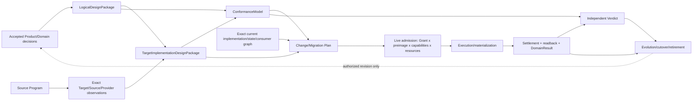
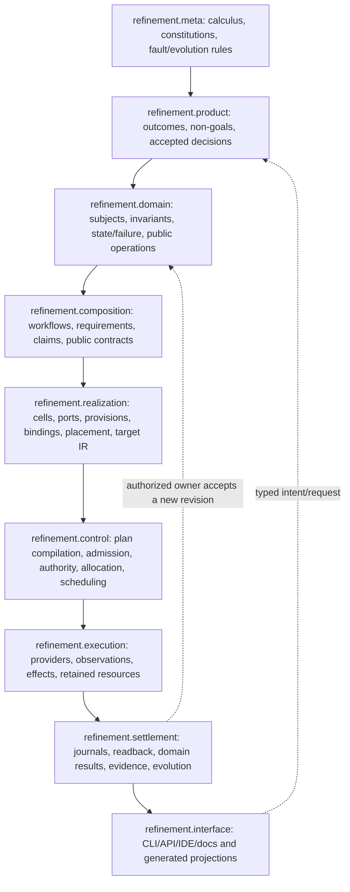
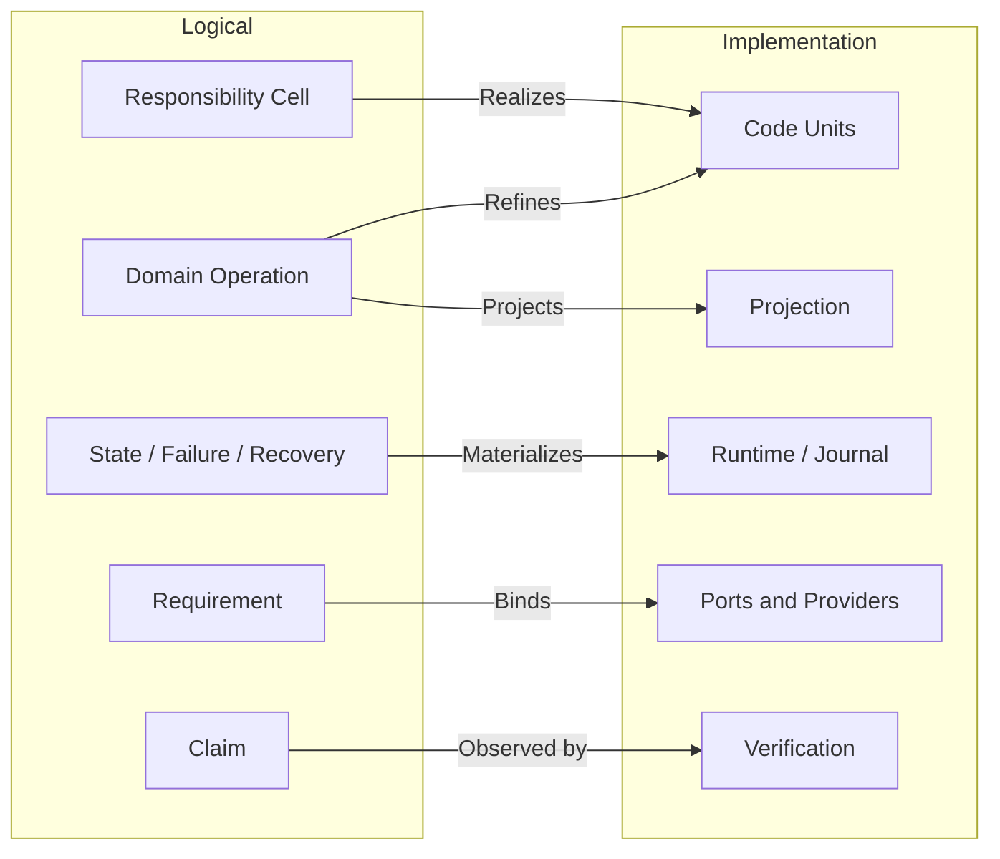

# SEC 实现架构与意图编译

本文是 implementation-architecture 的公共 root，拥有 SEC 逻辑架构到工程实现的统一模型、refinement 和 domain 边界。实体/依赖、源码/生成、执行/物化与迁移/一致性由本文件列出的规范片段拥有。

整个 domain 不拥有产品目标、领域语义、通用原则、运行时状态、具体 Target lowering 或当前源码清单。上游分别是 `docs/product.md`、`docs/design-calculus.md`、`docs/engineering-constitution.md` 和 `docs/system-architecture.md`；面向用户工程的 Target Program/Backend lowering 由 `docs/compiler-target-ir.md` 拥有；实际声明、引用、Effect 与 unknown 由 exact Source Program 观察。

## 1. 统一模型与所有权边界

统一不是把所有逻辑放入一个模块，而是让所有投影引用同一组 semantic identity、relation 和 revision。



这是对 Design Calculus package/envelope、System Architecture operation和本domain realization/migration关系的公共投影，不另定义第二套artifact。每条实线转交都携带exact input/output refs、coverage/frontier、revision与digest；下游只能refine或observe上游，不能补造缺失的产品决定、Authority、业务成功或Verdict。编码只发生在`TargetImplementationDesignPackage + ConformanceModel + ChangePlan`已闭合之后；执行只发生在live admission之后。

| Owner | 拥有 | 不拥有 |
| --- | --- | --- |
| Design Calculus | relation、constraint、transition、proof 的通用演算 | SEC 实体、路径、实现 |
| Engineering Constitution | 通用工程不变量与拒绝语义 | SEC 领域事实、源码结构 |
| SEC System Architecture | logical responsibility、authority、operation、resource、lifecycle、proof | declaration/file/package 的物理实现 |
| Implementation Architecture | logical→implementation 映射、局部变更、生成和迁移 | 产品决策、领域字段、当前事实 |
| Domain owner | Definition、state machine、domain operation、failure algebra | 文件位置、Provider 实现、工作流 |
| Source Program | exact declarations/references/effects/unknown observations | semantic owner、permission、业务价值 |
| Compiler Target IR | 用户工程的 Target Program、Resolution、Binding、lowering | SEC 自身仓库组织与变更 admission |

实现架构只产生 `ImplementationPlan`、`PlacementDecision`、`ChangePlan` 与 typed frontier；它不能签发产品 Definition、AuthorityGrant、EffectTicket、Evidence verdict 或完成状态。

### 1.1 全系统分层与构件类别

SEC 的层级按“谁能定义什么”划分，不按目录、工具或运行进程划分。依赖只沿已声明 contract 向下实现；运行结果只能以新 observation/result/revision 返回上层，不能用反向 import 或 mutable callback 改写上游事实。



| Layer | Authored truth / authority | Derived implementation | 禁止反向拥有 |
| --- | --- | --- | --- |
| `meta` | relation、principle、fault/evolution semantics | validators/model checks | 产品偏好、领域字段 |
| `product` | outcome、non-goal、accepted tradeoff | capability closure/request | path、Provider、代码结构 |
| `domain` | Definition、Invariant、StateMachine、FailureAlgebra、DomainOperation；Authority/Resource等support Domain在此定义policy与state语义 | domain contract/result types | workflow、物理实现、Evidence verdict |
| `composition` | WorkflowDefinition、Requirement、Claim、public relation | PureWorkflow/OperationPlan | child private state、Provider、Grant |
| `realization` | accepted ImplementationDecision/Target/Profile | Responsibility Cell、Provision、Binding、Placement、source/config/test/doc IR | 新业务语义、运行 Authority |
| `control` | 无新Definition；只消费issuer-signed Grant、capacity facts、compiled admission contract与resource ceilings | ExecutionPlan、AdmittedExecution、tickets、ready set | Authority/Resource policy、Effect结果、domain success |
| `execution` | 无新的authored truth | retained Provider attempt、Effect/Observation、resource consumption | policy、Definition、self-proof |
| `settlement` | state/evidence/evolution owner各自的合法transition | journal、settlement、readback、DomainResult、Verdict、migration receipt | 改写原plan、补签Authority |
| `interface` | public interface contract | projection、serialization、human/Agent view | 重算业务、绕过admission |

层与构件类别是两个正交维度；并非表里每个名词都要成为 class、文件或运行实体：

| 构件类别 | 例子 | identity/lifecycle | 实现形态 |
| --- | --- | --- | --- |
| semantic entity | Subject、Domain、DomainOperation、Provider、Attempt | 有稳定 identity；按自身状态机演进 | contract/type + owner implementation |
| typed relation | Requirement、Provision、Binding、EvidenceSupports | 连接 entity；不能冒充节点 | exact refs/edge record |
| invariant/policy/constraint | state guard、eligibility、resource ceiling | 随 owner revision 演进 | pure predicate/decision table/schema |
| algebra constructor | `invoke`、`sequence`、`parallel`、`await` | 不是业务实体；是 closed meta-model syntax | discriminated AST node |
| compiled artifact | PurePlan、ExecutionPlan、PlacementDecision、ChangePlan | content-addressed、immutable、可 stale | canonical value/record |
| live capability | ExecutionCapability、retained session、ticket、Allocation | opaque、scoped、expiring、必须 settlement | internal object/OS handle |
| durable observation | journal record、settlement、readback、Evidence | append/CAS、strict parse、retention | durable canonical record |
| projection | CLI JSON、docs、indexes、human view | 派生且可重建 | generated bytes；不返写 truth |

因此“流程构件”属于`refinement.composition`的代数语法；某次编译出的workflow plan是`composition→control`的immutable compiled artifact；执行中的workflow session才是`control→execution`的live entity。把三者压成同一个可变`Workflow`对象会同时制造第二Definition、运行时热改和不可恢复状态。

### 1.2 逻辑—实现对应关系

逻辑架构与实现架构不是按节点或文件一一同构，而是一个可验证的 refinement relation：

```text
Realizes : ImplementationEntity → exactly one ResponsibilityCell or InfrastructureCell
Materializes : LogicalRequirement → one or more ImplementationEntities | required-unmaterialized
Preserves : ImplementationTransition → LogicalInvariant / StateTransition / FailureSemantics
Projects : LogicalFact → zero or more derivable public/generated views
```



允许的非一一关系：

- 一个 Cell 由多个高内聚 CodeUnit 实现；
- 多个 Operation 复用同一个满足合同的 capability Provider；
- 一个 logical fact 产生多个 deterministic projections；
- 同一实现算法可在不同 Target/Profile 下形成不同 Binding。

禁止的非一一关系：

- 一个 authored declaration 同时拥有两个不相干的 Responsibility；
- 同一 writer/parser/resolver/terminal/Effect identity 有多个 active owner；
- 实现新增 logical model 未声明的 Authority、Effect、state 或 failure；
- logical Requirement 在实现中被路径、环境、fallback 或 presentation 偷换；
- 多个手写 projection 反向成为并列事实。

### 1.3 完美对应的判据

“完美对应”指 semantic completeness 与 observational refinement，不指目录形状相同：

```text
PerfectCorrespondence =
  totalLogicalMaterialization
  ∧ uniqueImplementationOwnership
  ∧ publicBehaviorRefinement
  ∧ effectAndAuthorityNonAmplification
  ∧ stateFailureRecoveryPreservation
  ∧ exactTraceabilityBothDirections
  ∧ noUnexplainedImplementationSurplus
  ∧ boundedExplicitUnknowns
```

| 失配 | 含义 | 结果 |
| --- | --- | --- |
| logical node 无实现 | 尚未完成或明确未来义务 | `required-unmaterialized` |
| implementation node 无 logical owner | orphan、重复轮子或隐藏权力 | reject/retire |
| logical edge 未在实现保持 | requirement/state/failure 被丢失 | reject |
| implementation 多出 Authority/Effect | 权力放大 | reject |
| 多个实现竞争同 identity | duplicate owner/generation | migrate/cut over |
| 地址变化但 relation 不变 | 纯 placement delta | semantic no-op |
| Provider 变化而 contract 不变 | Binding delta | impact/conformance only |
| 无法解释的 dynamic/opaque edge | observation frontier | bounded unknown |

双向 trace 必须可机器查询：从任一逻辑 Requirement 找到实现 declaration、Binding、Effect、settlement、readback 和 tests；从任一 production declaration/Effect/state record 反查唯一 Cell、Operation、Claim 与 evolution state。

### 1.4 对变化与验证的影响

```text
logical delta       → responsibility/operation/claim impact → implementation delta
implementation delta→ recompiled realization graph          → semantic equivalence or drift
address-only delta  → placement/import/config migration      → no semantic claim reset
binding-only delta  → provider conformance/runtime impact    → no Definition rewrite
schema/state delta  → parser/writer/migration/recovery impact → evolution required
```

验证选择由差异类型决定，不由 changed-file 数量决定。只有 logical correspondence 变化才扩展 semantic claims；纯生成投影或地址变化只验证生成/readback/consumer-zero；Provider/physical变化验证 Binding、Effect、settlement 与环境，不重跑无关业务语义。

### 1.5 归属与最优性判定

```text
Logical(x) iff
  x can be stated without declaration/package/file/provider/runtime Address
  and x must remain true across every valid implementation

Implementation(x) iff
  x selects or constrains a realization of accepted logical facts
  using Source Program, Target/Profile, provider, physical or lifecycle facts
```

| 问题 | 裁决 owner | 输出 |
| --- | --- | --- |
| 用户最终要什么、可接受何种取舍 | Product/Domain | accepted outcome/decision |
| 什么实体、责任、状态、操作、权限和失败必须存在 | logical System Architecture | validated logical graph |
| 哪个逻辑候选满足原则且支配其他候选 | Design Calculus + Project Constitution | accepted/non-dominated model 或 frontier |
| 哪种代码/包/Provider/生成/迁移实现逻辑模型 | Implementation Architecture | accepted/non-dominated realization 或 frontier |
| 实际是否按设计存在并运行 | Source Program + runtime readback + Verification | observation/evidence/verdict |

“逻辑可直接推出一个实现”仍分两步：逻辑 owner 只签发约束；Implementation Compiler 证明在当前 Target/physical/cost inputs 下候选实现唯一或支配其他候选，再签发 realization decision。否则逻辑层会偷带路径、工具和平台，implementation observation 也会反向改写业务真相。

最优不是永久全序：先淘汰违反 hard constraints 的方案，再按全生命周期成本做 Pareto dominance；仍有多个非支配候选且差异依赖未给出的产品偏好时，输出 decision frontier。新事实或偏好改变时重编，而不是把旧最优固化为无条件规则。


## 规范片段

本文件保留统一实现模型和逻辑—实现 refinement；实体边界、源码编译、执行运行时和架构迁移由下列独立规范片段拥有。

| 片段 | 独立职责 |
| --- | --- |
| [实现实体、边界与依赖](implementation-architecture/model-and-boundaries.md) | 实现实体代数、Canonical Implementation Graph、Responsibility Cell、依赖可见性、public surface 与 Facade 存在证明。 |
| [源码放置、变更局部性与意图生成](implementation-architecture/source-and-generation.md) | Placement、Change Locality、双向 Semantic Compiler、受控手写模式与 Brownfield round trip。 |
| [执行运行时与物化架构](implementation-architecture/execution-and-materialization.md) | process/container/resource 微内核、dependency generation、Schema/Version、package 与外部工具编排。 |
| [架构迁移、机器准入与一致性验证](implementation-architecture/migration-and-conformance.md) | Architecture Migration、机器准入、对抗模型、伪实现、Conformance Model 与交接包。 |
