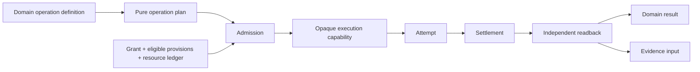
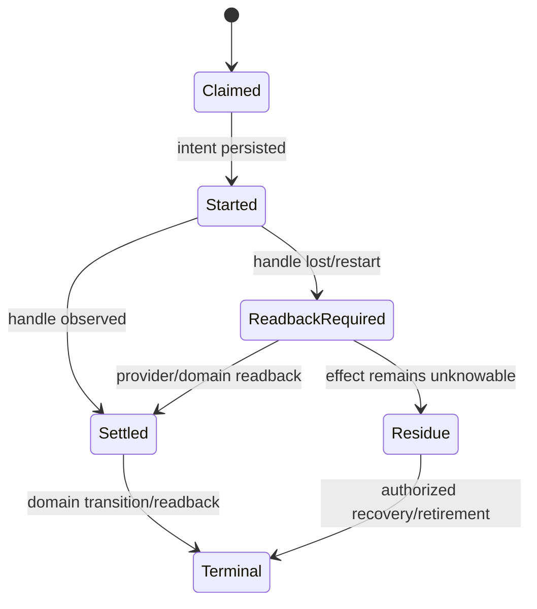
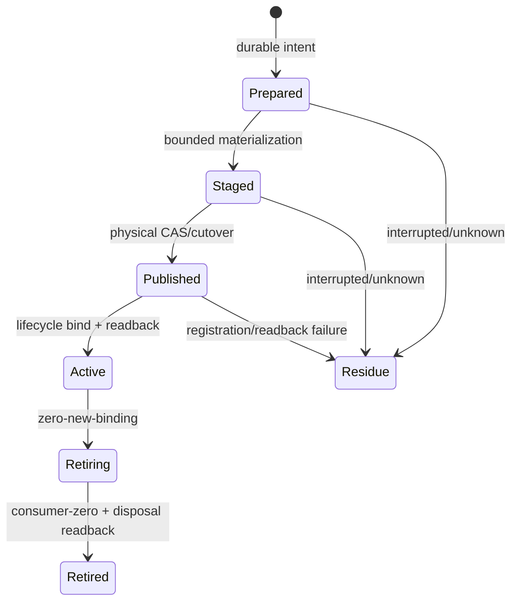

# 执行运行时与物化

本文只拥有 implementation runtime：把已准入计划绑定到 Provider 与资源，产生 Attempt、Settlement、readback 和 typed residue。通用 Operation/Authority/Resource/Lifecycle 语义由系统架构拥有；具体外部工具采用由 external-provider policy 拥有。

## 1. 唯一执行链



| stage | 可以决定 | 不得决定 |
| --- | --- | --- |
| plan compiler | requirements、ordering、idempotency、readback/recovery、resource ceilings | live Provider、Grant、Effect结果 |
| admission | exact grant/binding/allocation/preimage intersection | 业务规则、成功结果 |
| runtime kernel | 按计划调度 capability、记录 attempt、收敛 settlement | Provider选择、policy、DomainResult |
| provider | 物理执行与原始 settlement | Authority、业务成功、Verdict |
| domain result mapper | settlement/readback 到 public result/state transition | 补造 Effect、修改 plan |
| verifier | 对 Claim 产生独立 Verdict | mutation、publication、自证 |

runtime kernel 是 policy-free mechanism，不是全局业务 service。每个 operation 有自己的 immutable plan、allocation 和 journal；共享 kernel 只实现可证明相同的 execution laws。

## 2. Requirement、Provision 与 Binding

Git、Docker、Bun、TypeScript、数据库、网络、filesystem、clock 和 browser 都只是 Provider 实例，不是通用模型分支：

```text
ExecutionRequirement = exact {
  capabilityContractRef,
  subjectAndOperationRefs,
  semanticAndPhysicalConstraints,
  authorityCeilingRef,
  resourceEnvelopeRef,
  settlementAndReadbackContractRef
}

ExecutionBinding = exact {
  requirementRef,
  provisionRef,
  providerGenerationRef,
  retainedSubjectBindings,
  credentialAndEnvironmentClosureRef,
  conformanceRef
}
```

Provider discovery只提交候选 observations；binding compiler按合同选择 eligible Provision。PATH、ambient environment、当前安装、品牌名称、test callback 和 fallback 都不能成为授权。测试 Provider 需要不可伪造的 test origin，production consumer只接受 production-issued capability。

## 3. Resource ledger

资源不是一个 `timeoutMs` 字段，而是父 operation 签发、所有 child 共用的守恒账本：

```text
OperationResourceLedger = exact {
  monotonicDeadline,
  processSlots,
  cpuTime,
  residentAndBufferedBytes,
  inputAndOutputBytes,
  filesystemEntriesAndBytes,
  networkRequestsAndBytes,
  retryAndRecoveryUnits,
  providerSpecificDimensions
}

```

本层直接消费 [Resource algebra](../system-architecture/operations-and-resources.md#8-resource-algebra) 的`Allocate`、`Consume`、`Return`与`Settle`规则，不重定义资源守恒。所有 read、scan、spawn、wait、retry、cleanup、readback 和 recovery消费同一账本。deadline使用单调时钟；caller duration只能收窄，不能扩大 parent absolute deadline。abort 在首次 observation 前、每个 await/effect 前后和 settlement阶段检查。

字节/entry预算在实际流式读取时计量，不要求为了“算预算”先全遍历一次。已有 exact content snapshot/fact shard时直接复用计量事实；必须重新读取时，scanner、parser、copy和digest共享同一流与计数器。预扫一遍再执行一遍，或多个 consumer各自重扫同一树，都是 dominated design。

## 4. Process capability

process 是一次 operation 分配的资源实例；它不是自由函数，也不是 path：

```text
RetainedProcessCapability = opaque {
  providerGenerationRef,
  executablePhysicalBinding,
  cwdPhysicalBinding,
  argvGrammarRef,
  minimalEnvironmentAndCredentialClosureRef,
  ioAndTerminationBudgetRef,
  operationAndAllocationRefs
}

ProcessSettlement =
  | never-started { typedReason }
  | exited { code, signal, boundedOutputRefs, postIdentityReadback }
  | timed-out { terminationAndReadback }
  | cancelled { terminationAndReadback }
  | lost-handle { attemptRef, recoveryRequiredRef }
  | residue { primaryFailure, cleanupFailure, retainedSubjects }
```

production surface不同时公开 retained 与 unretained spawn。可执行文件、cwd、脚本/模块、环境和credential在 spawn 前绑定，在 child image creation/settlement后readback；same-path replacement、parent reparse、loader或配置漂移均 typed block。同步 child 不得阻塞需要timer/cancel的上层 event loop；non-reentrant session由 plan 顺序消费或显式 bounded parallel capabilities，不能放宽成竞态。

Container、remote executor和in-process library调用同样实现 Capability Port：差异只在 Provision/settlement，不在业务 operation。能用成熟 library/SDK 的稳定 machine interface时直接绑定；只有 SEC 需要增加 identity、authority、resource、recovery、Evidence 或 compatibility语义时才建立薄 adapter。

## 5. Durable local Effect worker

可能跨进程、超时、主机重启或丢句柄的 Effect 必须由 operation journal 协调：

```text
EffectJournal = append/CAS {
  operationKey,
  exactPlanGrantBindingAllocationRefs,
  intentBeforeEffect,
  providerAttemptIdentity,
  observedSettlement,
  readback,
  terminal | residue
}
```



相同 `OperationKey` 的后续 caller只能 join terminal/in-flight/recovery，不能盲重发。worker是可替换的 Provider/runtime realization，不是第二 state owner；cold path能从 journal与owner state重建。journal、live handle与provider observation互证，任何单方不能自报完成。

## 6. Materialization 与 generation

dependency、compiler output、generated source、downloaded tool 和 cache 都使用同一 generation protocol：

```text
MaterializationGeneration = exact {
  logicalSubjectRef,
  producerAndProviderGenerationRefs,
  sourceContentAndProvenanceRefs,
  targetPhysicalBindingRef,
  manifestAndSchemaRefs,
  transitionJournalRef,
  lifecycleRegistrationRef,
  readbackAndConsumerRefs
}
```



共享dependency/cache/ecosystem projection path只是target Address。共享只表示多个 consumers绑定同一 immutable generation；它不允许 mutable global cache、caller-supplied provenance、跨 owner lease或path identity。每个 generation由唯一 producer、schema、transition owner和physical binding证明；ready/read/recovery错误必须区分 `absent | mismatch | unresolved | expired | unsafe | residue`，只有明确 absent/mismatch可进入重物化。SEC self-hosting的具体dependency addresses与退役目标只由 [Dependency Materialization](../runtime-and-distribution/dependency-materialization.md) 拥有。

staging intent必须先于目录或注册 Effect；publish、lifecycle bind、ready return、dispose和recovery在同一 owner lease/operation budget内完成。旧格式只在受保护的一次性 migration reader中出现，normal path只接受active generation；unknown residue不能降级成 cache miss。

## 7. Schema、hardcode、test 与 package

这些不是 execution runtime 的第二 owner：

| concern | canonical route |
| --- | --- |
| durable schema/version/migration | state contract + change management；一个 writer/parser identity，真实旧态才有migration |
| hardcoded path/name/version/count | Source Program observation + owner definition；Address/fixture/derived projection不冒充identity |
| tests | Conformance/Verification claims；观察public behavior、durable readback、Effect和failure，不镜像源码文本 |
| package/library/tool选择 | PackageBoundaryProof + external capability adoption；先复用成熟机制，禁止一工具一wrapper |
| caches/indexes | exact ActionKey + rebuildability；不签发Authority或PASS |

## 8. 完成

```text
ExecutionMaterializationClosed =
  every Effect consumes an owner-issued admitted capability
  and every child consumes one conserved operation ledger
  and every process/container/external attempt has retained identity and settlement
  and every lost handle converges to readback, terminal or typed residue
  and every materialized generation has producer provenance, CAS cutover and lifecycle readback
  and no ambient fallback, test seam, cache, path or Provider output creates Authority or DomainResult
```

<!-- sec-clause {"blocker":null,"kind":"stable-decision"} -->
## 规范片段

所有物理执行统一为 Requirement→Provision→Binding→Allocation→Attempt→Settlement→Readback；process、container、dependency generation和外部工具只是该链的 Provider 实例。一个 operation ledger计量全部资源，持久journal负责lost-handle恢复，任何path、ambient fallback或cache都不能成为authority。
