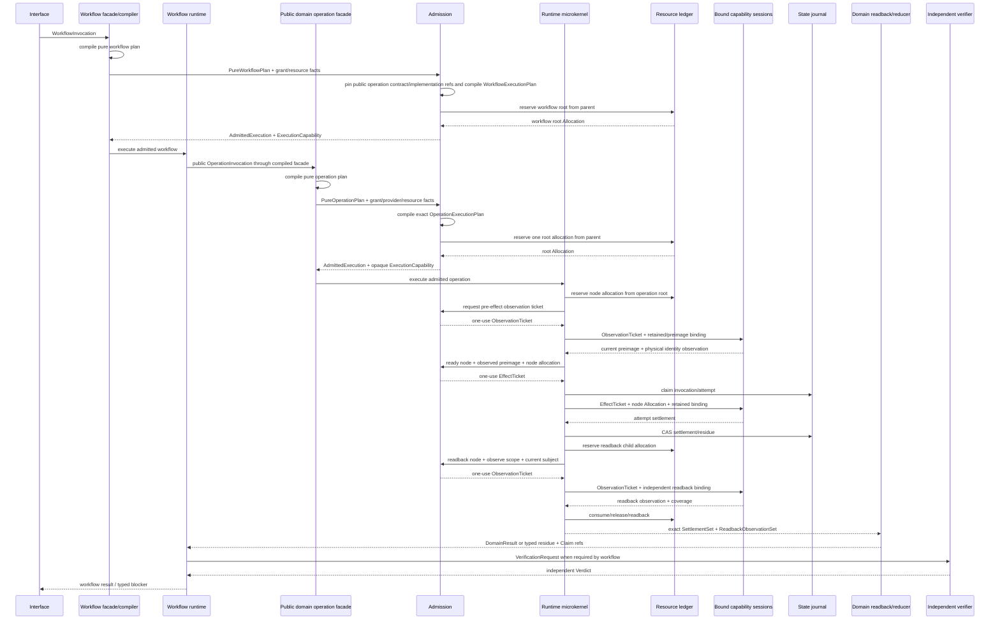
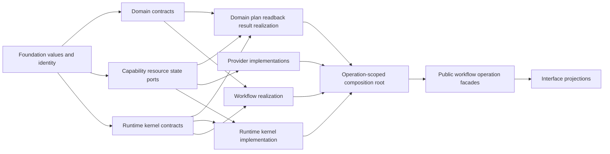
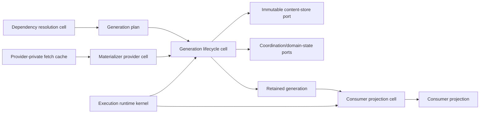

# 执行运行时与物化架构

本片段拥有 process/container/resource 微内核、dependency generation、Schema/Version、package 与外部工具编排。

本片段与 [owner root](../implementation-architecture.md) 共享同一 domain，但只拥有 registry 分配给本片段的 ownership keys；跨片段语义使用引用，不复制定义。

## 10. Process、Container 与其他资源的实现归属

进程、Docker daemon、Git/GitHub、compiler、filesystem、network、credential 都是 capability/resource Subjects，不是脚本字符串。

```text
Requirement
→ eligible Provision
→ retained ProviderBinding
→ child Allocation from one parent ledger
→ EffectTicket
→ Attempt
→ physical Settlement
→ domain readback
→ terminal/residue
```

统一 session 必须计量 wall/monotonic deadline、process count、input/output/record/byte totals、descendants、retry、cleanup 和 recovery；不能每个 helper 重开 timeout。lost handle 通过 durable operation journal + provider readback join，不通过重复 Effect。Docker 启动、Git 命令和 typecheck 只是不同 Provider，消费相同 operation/resource/lifecycle contract。

性能优化只能替换观察或执行 Provider：retained session、native OS API、Language Service、content-addressed fact shard、authenticated in-flight。它们不得建立第二 Source Program、第二 ActionKey、第二 scheduler 或 daemon truth。

### 10.1 Execution Runtime Microkernel

逻辑架构规定“哪些 DomainOperation、依赖、权限、资源、状态和结果必须成立”；实现层必须有一个政策无关的执行微内核统一兑现这些合同。否则每个 domain 会分别手写 Provider 调用、timeout、锁、重试、journal、cleanup 和成功判断，重新形成多套 workflow 与 resource owner。

```text
ExecutionRuntimeMicrokernel =
  typed workflow-plan and operation-plan interpreters
  + admission verifier
  + operation-scoped resource ledger
  + ready-set scheduler
  + bound-capability executor
  + attempt journal coordinator
  + settlement collector
  + cancellation/descendant tree
```

它只解释已经冻结的 `ExecutionPlan`，不拥有 Product/Domain Definition、Policy、WorkflowDefinition、Authority issuance、Provider eligibility、DomainResult 或 Verification verdict。它不是全局 service locator、任意 callback runner、命令总线或第二状态机。

该结构不是因“框架更整齐”而选择；它是以下竞争模型在 SEC 已接受 Requirement 下的裁决：

| 候选 | Hard-constraint / lifecycle 结果 | 裁决 | 反转条件 |
| --- | --- | --- | --- |
| 每个 domain 直接调用 process/filesystem/network 并自管 timeout/journal | 重复 Authority/Resource/Settlement owner；跨域组合无法守恒 | rejected | domain 永远 pure、无 Effect/资源/恢复时直接调用本就合法 |
| 一个 policyful 全局 orchestrator | 吞并 Domain Definition、Workflow、Authority 与 terminal owner | rejected | none；只能作为 generated read-only projection |
| 任意 callback/DI/service-locator framework | callback 可藏 Effect/Provider选择/ambient state；Source Program 与 impact不完整 | rejected | none；exact typed factory不属于此候选 |
| 外部 workflow/task engine 直接拥有业务 DAG | 外部状态/重试/成功语义取代 SEC owner；offline/replaceability受限 | rejected as semantic owner | 其作为满足明确 execution port 的 Provider，并通过等价/settlement验证 |
| 仅静态生成直连代码，无统一 runtime mechanism | pure 路径成本最低，但 Effect/资源/取消/lost-handle机制会重复 | accepted only for pure intra-cell path | requirement closure证明无受控 runtime boundary |
| typed policy-free execution microkernel | 集中不可重复的执行机制，同时让 policy/state/result留在各 owner；可替换 Provider | selected | 共享机制不再存在或其成本经 measurement 支配；需新 DesignDecision |

选择依据只引用已接受的跨域不变量：Authority 不放大、一个 parent resource ledger、at-most-once Effect、exact settlement、cancellation descendants、lost-handle recovery、Provider可替换和 DomainResult独立 readback。微内核不因本表自证完成；实现仍须由 Source Program 证明这些机制只有一个 active owner，并通过 fault/trace/refinement Evidence。

### 10.2 具体实现实体

| 类别 | 实体 | 由谁实现/签发 | 只拥有 | 绝不能拥有 |
| --- | --- | --- | --- | --- |
| logical input | `DomainOperationContract` | domain owner | intent/result/state/failure/effect semantics | Provider、path、handle |
| logical input | `WorkflowDefinition` | workflow owner | operation refs、result edges、guards、join/compensation | callback、resource allocation、child state |
| workflow relation | `PublicOperationRef` | workflow plan compiler | required DomainOperation identity、contract revision、input/result semantics、constraints | child Provider、ambient discovery |
| optional realization relation | `PublicOperationBinding` | implementation/composition compiler | 多 realization 时把一个 exact operation ref绑定到一个 accepted implementation entry | runtime service discovery、Provider选择、grant |
| per-workflow realization | `WorkflowPlanCompiler` | workflow implementation cell | workflow intent + operation contracts → `PureWorkflowPlan` | Provider、child state、Effect callback |
| per-domain realization | `OperationPlanCompiler` | domain implementation cell | intent + exact facts → `PureOperationPlan` | I/O、lease、grant、binding、attempt |
| per-domain realization | `DomainReadbackInterpreter` | domain implementation cell | exact post-observation → typed domain state | retry、Authority、Evidence verdict |
| per-domain realization | `DomainResultReducer` | domain implementation cell | plan + settlements + readback → DomainResult/residue | Provider exit→success shortcut |
| pure boundary | `PureWorkflowPlan` / `PureOperationPlan` | corresponding plan compiler | typed DAG、requirements、guards、obligations、unknown | Provider binding、grant、allocation、runtime handle |
| compiled boundary | `WorkflowExecutionPlan` | control/binding compiler | public operation DAG、exact contract/implementation refs、result mapping、guards/compensation、resource demands | capability Provider/effect node、child internal state |
| compiled boundary | `OperationExecutionPlan` | control/binding compiler | capability/readback DAG、exact bindings、resource demands、grant predicates、settlement obligations | live allocation/ticket、executable functions、ambient lookup |
| invocation | `WorkflowInvocation` / `OperationInvocation` | corresponding public facade | intentRef、subject/snapshot、stable key、parent context | grant、success、Provider choice |
| admitted boundary | `AdmittedExecution<Plan>` | admission owner | exact plan、live grant refs、resource-owner root Allocation ref、epoch | child Effect、business success |
| opaque admission | `ExecutionCapability<Plan>` | admission owner after intersection | exact admitted workflow/operation 可启动匹配 runtime session 的不可伪造权能 | broader grant、wrong plan kind、arbitrary operation |
| runtime session | `WorkflowRuntimeSession` | microkernel composition root | one workflow、public DomainOperation invoke/await/cancel/result collection | child Provider/state、cross-domain policy rewrite |
| runtime session | `OperationRuntimeSession` | microkernel composition root | one DomainOperation、capability/readback nodes、deadline、cancel tree、settlement | global mutable truth、cross-operation budget reset |
| resource | `ResourceLedgerSession` | resource owner | reserve/consume/release/readback parent allocations | business priority、hidden unlimited dimensions |
| scheduling | `ReadySetScheduler` | microkernel | 在 frozen ready-set 内选择合法次序 | 修改 DAG、生成步骤、跳过 blocker |
| capability | `BoundCapabilitySession` | admitted Provider binding | one exact port/provider/epoch/physical closure | service discovery、domain result、grant issuance |
| effect | `EffectTicket` | admission owner | one exact Effect node、preimage、binding、allocation、settlement obligations | reusable general permission |
| observation | `ObservationTicket` | admission owner | one exact readback/query node、observe scope、binding、allocation、coverage | mutation、Evidence verdict |
| attempt | `AttemptHandle` | BoundCapabilitySession/Provider | retained physical attempt control/observation handle | durable truth、DomainResult、Evidence |
| attempt | `ProviderSettlement` | Provider settlement compiler | physical attempt outcome、termination、provider obligations | domain success、journal mutation |
| state | `AttemptRecord` | OperationJournal/state owner | durable invocation/attempt/settlement refs与CAS sequence | Provider outcome重解释、DomainResult |
| state | `OperationJournal` | state owner | invocation/attempt/settlement/residue CAS records | workflow definition、blind replay |
| settlement | `SettlementSet` | operation settlement compiler | exact planned outcomes、resource returns、cleanup/residue refs | semantic success |
| readback | `ReadbackObservationSet` | domain readback observation owner | exact post-state observations、coverage、unknown、settlement | DomainResult、independent Evidence verdict |
| recovery | `PureRecoveryDecision` | domain recovery compiler | join/readback/compensate/retry/blocked语义候选 | grant、allocation、Effect |
| recovery | `AdmittedRecovery` | admission owner | exact recovery decision + grant/binding/allocation/preimage refs | implicit replay、delete unknown |
| proof | `VerificationRequest` | Claim/workflow owner | exact Claim、required Evidence/independence/freshness | Verdict、Effect |
| proof | `Verdict` | independent verification owner | exact request/Evidence judgment | mutation/publish/retry Authority |

这些不是都变成 class 或文件；Implementation Compiler 按 Responsibility Cell、lifecycle 和 co-change graph 选择 `type | value | pure function | internal object | durable record | retained session`。实体身份和边界是强制的，物理对象数量与放置仍由 Placement/Complexity compiler 决定。

### 10.3 调用与资源执行链



调用纪律：

| 调用种类 | 合法机制 |
| --- | --- |
| 同一 cell 内 pure value/algorithm | 普通直接调用；不经过 runtime kernel |
| 跨 cell pure query | 对方公开 typed query port；只读已提供的 immutable value/projection，不触达 filesystem/network/runtime或隐藏资源 |
| 需要新观察的 query | 作为 read-only DomainOperation进入plan/admission，使用`ObservationTicket`、Allocation、coverage与settlement |
| public Workflow | `WorkflowInvocation` → `WorkflowExecutionPlan`；child节点只按exact`PublicOperationRef`调用compiled public facade |
| public DomainOperation | `OperationInvocation` → `OperationExecutionPlan`/admission → operation runtime session |
| Workflow 调子业务 | 只引用 public DomainOperation contract/result；不调用 child Provider或读取child journal |
| filesystem/process/network/container/compiler/Git Effect | 只由 `BoundCapabilitySession` 消费 `EffectTicket` 执行 |
| state transition | state owner消费 exact transition ticket/CAS preimage |
| domain readback | 独立 `ObservationTicket` + readback binding按 obligation观察 exact subject；不复用 Effect Provider自报成功 |
| verification | independent verifier消费 Claim/Evidence；不能被 operation callback内联 |

并非“所有函数调用都框架化”。只有跨 owner、Effect、Authority、Resource、durable state、recovery 或 independent proof 边界进入微内核；纯函数和 cell 内局部协作保持直接、静态、可内联，避免动态 dispatch 与治理税。

资源不会由业务代码直接 `acquire` 一个全局对象。`WorkflowPlanCompiler`与`OperationPlanCompiler`只声明`ResourceDemand`；每层 admission从其 parent allocation保留一次 child root，scheduler只能继续向 ready node切分，不能重新读取 ceiling或创建新预算。Effect与readback Provider只能消费其 child Allocation，cleanup/readback/recovery继续消费同一 top-level remaining。新增 ResourceDimension通过resource contract扩展ledger，不修改每个DomainOperation。

admission 与 reservation 是一个可结算组合：root Allocation 成功但 grant/binding/preimage/admission随后失败时，admission owner必须在同一 settlement内返还 allocation并readback；`AdmittedExecution`未签发不得留下隐式 reservation。运行中任何 node allocation同理进入 attempt/residue，不能靠异常栈自动释放。

### 10.4 组合根、依赖方向与替换

唯一 composition root 只组装本次 AdmittedExecution 已引用的实现：



依赖要求：

- runtime kernel只依赖通用 plan/capability/resource/state contracts，不导入具体 domain；
- Provider只实现 CapabilityPort，不导入 Workflow 或 DomainResult；
- Domain realization引用 port identity与微内核 public operation API，不导入具体 Provider；
- Workflow只依赖各 DomainOperation public contract/result与`PublicOperationRef`；
- 单 realization 的public operation在编译期静态连接；只有Target/Profile存在多个accepted realization时才产生`PublicOperationBinding`，且仍由composition root静态装配，不运行runtime service locator；
- 每个operation的execution plan独立绑定底层`CapabilityProvision`；public operation realization与capability binding不能合并；
- composition root消费AdmittedExecution引用的exact Bindings，并由ImplementationPlan定位对应已接受实现；它不运行第二 resolver；
- interface只调用 operation facade，不持有 ledger、journal、Provider 或 EffectTicket；
- DomainOperation实现替换只改变ImplementationPlan中的`PublicOperationBinding`（单 realization 时是静态连接delta）；底层Provider替换只改变`CapabilityBinding`；两者均不改变逻辑Operation/Workflow identity；
- kernel机制变化若不改变 observable trace，只需 refinement/conformance验证；若改变 failure/resource/settlement语义，必须回到 CapabilityDesignSlice。

因此逻辑与实现不是靠“放在不同目录”分离，而是靠不同 owner、类型和不可达能力分离；实现可替换，但不能越过 relation重新解释逻辑。微内核的存在证明是跨 Domain 统一 Authority admission、资源守恒、attempt settlement、cancellation 与 lost-handle recovery；任何 domain-specific policy一旦进入内核即为边界违规。

### 10.5 Dependency generation 的实现闭包

`docs/runtime-and-distribution.md` 定义 Dependency Requirement、Binding、Generation、Projection 与 lifecycle 语义；本节只拥有它们的目标实现映射。它们不会各自变成 service。最小物理责任集合是三个 Domain Cell 加两个复用基础设施 port：



| 实现单元 | 同置的责任 | 公开输入 → 输出 | 不得拥有 |
| --- | --- | --- | --- |
| Dependency resolution cell | Requirement validation、exact Binding resolution、GenerationKey/plan compilation | accepted requirement + exact lock/config/provider/platform facts → pure binding/generation plans | filesystem、network、process、store mutation |
| Generation lifecycle cell | observe/claim/join/materialize/publish/retain/release/quarantine/GC 的 Domain state/result reduction | generation plan + admitted operation observations → retained generation/result/residue | package-manager internals、consumer业务、Authority issuance |
| Materializer provider cell | Bun package materialization与其provider-private fetch cache session | exact retained provider binding + EffectTicket/allocation → staged tree/settlement | generation readiness、DomainResult、permanent state |
| Consumer projection cell | projection plan、exact target preimage、publish/readback、retirement | retained generation + consumer requirement + admitted operation → projection receipt/result | generation creation、consumer业务状态、path-as-authority |
| shared infrastructure ports | immutable bytes/tree retain；claim/lease/CAS；operation ledger与Effect execution | owner-authored typed requests → physical observations/settlements | dependency policy、GenerationKey、业务终态 |

拆分判据是独立 state/lifecycle/authority 与替换面，不是名词数量。Requirement、Binding、Key和pure plan同置在resolution cell；claim、journal、retain、quarantine和GC同置在generation lifecycle cell，因为它们共同维护一个generation invariant；Bun cache留在Provider；projection只有在consumer地址/lifecycle可独立变化时才是独立cell。若未来Target证明projection与generation必须同一原子状态且无独立consumer，可经DesignDecision合并；不能先机械拆开再靠运行时拼装。

local composition root只装配一个Bun materializer binding、一个Runtime Cache generation-store binding、一个Runtime State coordination/state binding和该consumer已解析的projection binding。它们由TargetImplementationDesignPackage静态引用；operation开始后没有path/env/service discovery。跨repository共享发生在generation store与generation-key claim层，repository-specific state只保存consumer binding，不复制generation journal。

#### 10.5.1 Pure plan 与 Effect plan

```text
AcquireDependencyGenerationPlan {
  requirementRef + bindingRef + generationKey
  storeObservationRequirement
  materializationRequirementIfConclusiveAbsent
  retainAndReadbackObligations
  resourceDemand
}

MaterializeDependencyGenerationPlan {
  generationKey + exact providerBindingRef
  immutable staged/published manifest contracts
  journal transition graph
  verification/readback obligations
  resourceDemandByDimension
}

ProjectDependencyGenerationPlan {
  consumerRef + retainedGenerationRef
  projectionProviderRequirement
  targetPreimage + publication/readback/retirement obligations
  resourceDemand
}
```

这些 plan 只含refs、closed variants与limits，不含callback、path discovery、ambient environment、clock lookup、普通函数provider或live handles。Admission把plan与Grant、eligible Provision、parent Allocation、current store/state observations交集后才签发opaque execution capability；runtime kernel解释Effect DAG，Domain reducer解释settlement/readback。pure ready fast path可以在完成store observation与retain后直接返回，不建立materializer Provider session。

#### 10.5.2 Store、claim 与 retained API

```text
GenerationStorePort:
  observe(key, ObservationTicket, allocation)
    -> ready(descriptor) | absent | unresolved(reason)
  publishNoReplace(claim, stagedDescriptor, manifest, EffectTicket, allocation)
    -> published(exactPhysicalRef) | conflict | residue
  retain(exactPhysicalRef, leaseAllocation)
    -> RetainedDependencyGeneration | stale/unresolved
  quarantine(exactPhysicalRef, transitionTicket)
  retire(exactPhysicalRef, transitionTicket)

GenerationCoordinationPort:
  claimOrJoin(key, operationKey, fencing/allocation)
    -> owner(claim) | join(authenticatedInFlight) | terminal(result) | unresolved
  appendTransition(claim, expectedSequence, record, transitionTicket)
  readback(operationKey, observationTicket)
```

Store descriptor、claim、in-flight和retained generation都是不可JSON伪造的live capability或owner-signed durable ref。`ready`必须绑定manifest digest、store epoch与exact physical identity；`absent`只表示在完整bounded census中确定不存在。缓存、权限错误、reparse、未知schema、partial record、deadline和I/O failure都返回`unresolved`。同一key的joiner只等待已有journal/Provider result，并受自己的parent remaining约束；它不获得owner claim，也不能延长期限。

线性化点由 owning primitive 唯一确定，调用者的先验检查不能替代：

| Transition | Linearization point | Postcondition/readback |
| --- | --- | --- |
| lock publish/update | immutable lock no-replace/CAS rename | exact canonical bytes + producer/input digest |
| generation claim | coordination store fencing-token CAS | one owner or authenticated join |
| stage admission | durable prepared intent publication | no stage/process/network Effect before intent |
| generation publish | immutable store no-replace CAS | root/manifest/Merkle physical identity |
| retain | hold-set CAS bound to exact generation epoch | live retained capability or stale |
| projection publish | target preimage CAS + link/copy publication | source/target/binding readback |
| release | hold-set/consumer-binding CAS | hold removed exactly once |
| collect | final hold-set + physical identity CAS deletion | absent or typed residue |

同一`GenerationKey`若出现不同manifest或Merkle root，不选择“最新”、不覆盖，也不把它当普通cache corruption；resolution/materialization owner返回`provider-nondeterministic`与`generation-conflict`，隔离候选并使相关共享Claim失效。

#### 10.5.3 Consumer 与性能编排

Source Program snapshot记录`generationRef + exact consumed content refs`；typecheck ActionKey记录Source Program、compiler/config/provider与generation manifest refs；audit和test-impact复用同一Source Program fact shards。它们不各自扫描`node_modules`，也不把projection path放入semantic identity。

package graph frontend必须把workspace/local package内容、peer/optional/platform选择、link topology、native ABI与allowed lifecycle effects编译进Generation semantics；动态install script、环境读取或stage外Effect无法完整观察时产生typed unknown，使generation不可共享/发布。time-varying security/support Evidence只影响Requirement Binding eligibility与use，不把相同bytes复制为新generation。

| 路径 | I/O 与计算上界 | 复用点 |
| --- | --- | --- |
| cold absent | 一次provider materialization + 一次同流entry/byte/Merkle验证 + immutable publish/readback | fetch cache只降低provider成本 |
| concurrent same key | 一个materializer；其余journal/provider join | operationKey + GenerationKey |
| warm exact generation | bounded root/manifest/store-epoch/retain checks；按消费读取Merkle shards | retained generation capability |
| source-only delta | zero dependency resolution/materialization；复用generation与未受影响source facts | reverse dependency shards |
| lock/provider/platform delta | new Binding/GenerationKey；旧generation继续服务旧retains，随后GC | immutable generation coexistence during bounded evolution |
| projection delta | generation不变；只重编/执行目标consumer projection | projection receipt/key |

“warm不全扫”成立的前提是Store Provider证明published generation immutable并提供稳定epoch/physical binding；做不到的filesystem实现不符合warm profile，只能选择较贵的verified profile，不能靠stamp跳过。Merkle index在cold materialization读取bytes时同步生成；不得先做全树byte预算扫描再hash，也不得每个consumer重复建立inventory。

#### 10.5.4 故障构造与唯一拒绝点

| 构造出的反例 | 唯一拒绝/恢复点 | 结果与零副作用要求 |
| --- | --- | --- |
| multi-role shared root把cache、generation、lock、stamp混在一起 | Implementation Compiler storage/lifecycle separation | realization rejected；不创建目录 |
| caller提交已有path/stamp/tree自称ready | GenerationStore observe + retained capability issuer | unresolved；zero adopt/install/publish |
| readiness scan发生permission/reparse/deadline/I/O | Generation lifecycle result reducer | unresolved原样保留；不能转absent |
| 两个进程同时请求同一key | Coordination claim CAS | one owner、others join；one materialization |
| joiner deadline短于owner operation | join allocation/remaining gate | joiner typed deadline；owner不扩期 |
| process handle丢失或host重启 | durable transition + provider/store readback | terminal/join/recovery-required；zero blind retry |
| stage已创建但intent未持久化 | plan/admission ordering validator | impossible；intent-before-effect |
| callback/fence失败导致cleanup跳过 | settlement state reducer | primary failure + cleanup result/residue均保留 |
| lifecycle bind在physical observation后竞争替换 | transition ticket + final physical CAS/readback | conflict/unresolved；zero foreign bind |
| generation schema在同identity下改required字段 | state schema/evolution owner | unknown generation blocked；migration-only old reader |
| provider fetch cache命中但tree缺失/损坏 | generation readiness owner | cache事实不参与ready；materialize或unresolved取决于store事实 |
| GC与retain/active claim/recovery hold竞争 | lifecycle linearization + exact delete CAS | retain或GC唯一胜出；partial为residue |
| projection address被ABA替换 | projection internal pre/post physical fence | conflict；不覆盖foreign target |
| consumer删除或换版本 | binding/retention compiler | retire projection；generation仅在all-holds-zero后GC |
| Provider/test runner由普通函数注入 | production origin/capability admission | invalid binding；zero invocation |

#### 10.5.5 可直接实现的完成谓词

```text
DependencyGenerationImplementationClosed =
  contracts and failure variants are closed and strictly parsed
  ∧ every Effect appears in exactly one compiled plan node
  ∧ every plan node consumes one child Allocation from the parent ledger
  ∧ store and coordination ports have one production binding per profile
  ∧ materializer cache is opaque and absent from readiness/identity
  ∧ Source Program/typecheck/audit/test-impact consume the same generation refs
  ∧ all state transitions are intent-before-effect and durable before retry
  ∧ normal readers accept exactly one active generation grammar
  ∧ every retained generation and projection has release/retire/readback
  ∧ cold/warm/delta/cache-disabled semantics are equivalent
  ∧ fault table has property/fault-injection conformance coverage
  ∧ legacy roots have an explicit one-way migration and terminal disposition
  ∧ Source Program proves no second materializer, cache authority or path-based owner
```

实现交接只需发布一个`DependencyGenerationImplementationPackage`，引用上述contracts、plans、state machine、store/profile bindings、conformance model、performance claims、migration plan和exact frontier。代码生成器或ManualImplementationProvider只能materialize这个package；发现新的Effect、state、Provider、resource dimension、consumer或failure时package立即stale，先回设计编译，不能把判断临时写进实现。

## 11. Schema、Version、硬编码与测试

### 11.1 Schema/Version

`version`不是一种统一概念；实现必须使用不同类型表达不同变化轴：

| Identity | 何时存在 | 进入哪些计算 | 命名规则 |
| --- | --- | --- | --- |
| semantic identity | 同一业务含义跨实现保持稳定 | Definition/Operation/Claim refs | 不带`Vn` |
| schema revision | durable/external/cross-process reader必须区分grammar | parser/writer/migration/support | contract-owned kind+revision；normal path单generation |
| algorithm identity | 输出语义可能因算法改变 | derivation/cache/ActionKey | implementation digest/ref，不复制到API名 |
| provider/package version | 外部Provision的被观察属性 | eligibility/Binding/conformance | exact package/binary identity |
| product release/support version | 用户可见兼容与支持边界 | distribution/support/evolution | product owner scheme |
| generation identity | cutover期间区分old/new active realization | activation/readers/retirement | immutable generation ref，不等于schema版本 |

普通API、内部函数、目录、测试名字、policy或单generation算法不带`V1/V2/V3`。只有真实并存reader需要区分时，external/durable contract名才含revision；迁移完成后旧reader、alias、dispatcher和版本测试一起退役。`sec`前缀只用于必须避免外部协议、持久namespace、artifact或环境变量碰撞的边界；内部symbols、types、functions和paths不机械加品牌前缀。

TypeScript target profile对结构化边界使用Zod作为选定Schema Provider：schema是结构与基础constraint的唯一可执行owner，TypeScript type从schema推导；raw JSON在进入Zod前由bounded decoder拒绝duplicate keys、invalid UTF、trailing data与资源越界，owner validator再检查跨字段、provenance和state invariants，canonical serializer负责bytes。不得并列维护interface、手写validator、JSON cast和测试期望四份schema。非JSON/binary/protocol可绑定更适合的mature parser，但必须满足同一strict reader/writer/migration contract。

### 11.2 Hardcode

硬字面按语义分类：

| 类别 | 处置 |
| --- | --- |
| domain invariant / protocol constant | owner contract 中一次定义 |
| environment/provider fact | runtime observation/Target/Profile/Binding，不进业务源码常量 |
| derived list/path/count/version/import/export | 从SourceProgram/owner contract/Placement/Claim graph生成 |
| executable command/query/source text | typed AST/argument records/stable machine protocol；禁止shell/SQL/source拼接 |
| endpoint/credential/config/root | exact Provider/Layout/Secret capability；禁止ambient fallback |
| resource limit/timeout/retry | ResourcePolicy/Profile输入并受parent envelope收窄 |
| test fixture input | 显式 synthetic data，不冒充产品事实 |
| policy choice | policy owner + reversal/activation condition |
| presentation text | projection owner；不得被parser、test或control当machine protocol |
| unknown literal | typed finding，不能靠 allowlist 永久压制 |

内部代码优先传typed identity/ref/value，不传可互换的裸`string`。跨序列化边界才编码字符串，并由owner parser恢复类型。不得建立全局constants/version/path registry；每个常量留在真实semantic/protocol owner，其他消费者引用或消费生成projection。

### 11.3 Test realization

测试只拥有scenario和observation，不拥有生产Definition。保留类别：public behavior、durable readback、Effect sentinel、typed failure/recovery、algorithm/property、external protocol/compatibility。私有contract只有在它是独立parser/state/effect/failure边界且被真实上层消费时才有测试价值；否则直接验证public result或性质，不为private helper制造镜像测试。

测试选择、owner、fixture、producer/consumer、replacement和Evidence从SourceProgram+Claim graph编译。owner-local tests与被观察public boundary同cell放置；cross-domain/system/fault scenarios归verification responsibility，不按source tree镜像。fake Provider必须由不可伪造test issuer创建且production composition root不可接收；production Effect boundary仍需最小真实或conformance Evidence。

只有版本数字、源码文本、函数arity、路径布局、实现数组、调用次数偶然值或自写schema镜像的测试没有独立证明价值。精确数字只有在它表达业务cardinality、resource ceiling、zero Effect、protocol或durable state时保留，并从canonical owner导入/生成而非复制。测试删除要求behavior/effect/state/failure/external/future obligation归零或被更强Claim覆盖，不按文件名、数量、coverage百分比或“当前通过”裁决。

## 12. Package、库、命令与构建编排

| 对象 | 是否成为 owner 的条件 | 默认角色 |
| --- | --- | --- |
| package | 独立发布/部署/runtime/version/security boundary | physical carrier |
| external library | 真实 capability gap + stable machine API + lower lifecycle cost | Provider |
| CLI command | domain operation/interface projection | Invocation Address |
| script | bounded workflow entry；不得复制 domain logic | projection/transport |
| Nx/Bazel/task runner | 可验证 Requirement DAG execution/cache | execution Provider |
| Compiler/LSP | exact language semantics/incremental facts | interpreter Provider |
| AST/search tool | candidate discovery/codemod evidence | observation/transformation Provider |

成熟轮子优先，但先比较能力、正确性、协议、许可证、安全、资源、可替换性和退役成本。采用轮子不等于让它拥有 SEC Definition；自研 wrapper 不得只复制参数、输出或生命周期。

### 12.1 Package 与 entrypoint compiler

```text
PackagePlan = compile(
  ResponsibilityCells,
  public/external consumers,
  runtime/deployment/security/toolchain boundaries,
  dependency and release obligations
)

EntrypointPlan = compile(
  public DomainOperations + Queries + Workflow refs,
  Interface contracts,
  TargetProfile
)
```

- 默认一个Bun-native产品package；只有PackagePlan证明独立发布、部署、runtime、security、toolchain或external support boundary时才拆package。domain数量、目录层级和团队数量不产生package；
- package name/version/exports/dependencies/scripts从PackagePlan、Placement与public demand生成；root config只保留生态必须的canonical入口，不能复制owner事实；
- CLI/API/IDE/Agent entrypoints是同一public operation/query的projection。命令树、参数schema、exit/result映射和machine JSON contract从EntrypointPlan生成；command handler只做parse→invoke→project，不含Domain decision、Provider选择或Effect；
- 不创建一命令一脚本、一工具一wrapper或一目录一barrel。需要给生态工具的thin launcher必须是generated projection，consumer-zero时自动退役；
- dependency declaration表达Requirement，Resolution绑定exact package/integrity/config；package manager只物化lock与依赖，不选择业务实现。SEC host依赖、Target workspace依赖和toolchain Provider依赖分开；
- 多package时使用Bun workspace作为physical carrier，但构建/测试/发布DAG仍由SEC的Requirement/Claim graph产生；workspace tool不得成为semantic scheduler。

命令、package或脚本没有独立业务identity；其稳定identity来自所投影的Operation/Query/Provider Requirement。用户改名或重新放置entrypoint不应改变业务、ActionKey或state identity，除非external protocol本身把地址纳入合同。

### 12.2 Reuse Compiler

最大化的是**合法复用后的全生命周期净收益**，不是共享函数数量。Reuse Compiler 从 ImplementationGraph 聚类 Requirement/contract/behavior/effect/failure/resource/lifecycle 等价候选：

| 可复用层 | 复用单位 | 不得共享 |
| --- | --- | --- |
| value/contract | immutable value、identity、strict parser、failure algebra | 不同 semantic identity 的可变 DTO |
| pure algorithm | 相同输入语义、deterministic result、unknown policy | 偷读 ambient state 的 helper |
| fact/derivation | exact content-addressed shard + interpreter closure | path/mtime/process-local truth |
| DomainOperation | public operation contract/result | 私有 state writer、caller-composed Effect |
| CapabilityPort | Requirement contract | 具体 Provider/credential/path |
| Provider | 同 Requirement、platform/security/resource/settlement conformance | domain success、跨 owner mutable state |
| Workflow pattern | 相同 dependency/compensation algebra 的 parameterized compiler | 用 generic callback 隐藏不同业务状态机 |
| Artifact/cache | 相同 ActionKey、producer、environment、validator | Evidence/Authority/canonical state |

```text
ReuseAllowed(A, B) iff
  semanticRequirementEquivalent
  ∧ failureAndUnknownEquivalent
  ∧ authorityDoesNotExpand
  ∧ resourceAndSettlementComposable
  ∧ lifecycleAndVersionCompatible
  ∧ oneCanonicalOwner
  ∧ lifecycleCost(shared) < lifecycleCost(separate)
```

不满足完整等价时只复用更低层纯算法或 CapabilityPort，不能用 `shared/common/utils/core` 目录名强迫合并。每个复用决定产生 consumer refs、差异 frontier、owner、Binding 和反转条件；Provider/版本/需求变化自动使相关复用 Binding stale。

### 12.3 Complexity Existence Proof

每个 authored entity、public surface、state、adapter、cache、daemon、package、schema、test、workflow 和 abstraction 都必须有可生成的存在证明：

```text
ExistenceProof(node) =
  independent responsibility or invariant
  ∨ real consumer requirement
  ∨ authority/security/protocol boundary
  ∨ state/lifecycle/recovery boundary
  ∨ measured resource/performance dominance
  ∨ accepted FutureObligation with bounded carrying cost
```

证明从owner graph、consumer/effect/state facts、benchmark、external contract和FutureObligation refs派生，不逐文件手写理由。候选方案、删除反事实、成本向量、支配关系和反转条件属于Design Compiler的派生产物；`ImplementationGraph`只保存accepted node与其proof refs，`TargetImplementationDesignPackage`只引用相应决策和推导结果。

若`counterfactualDelete(node)`不降低accepted outcome、约束、恢复、Evidence、未来义务或全生命周期成本，该node为`derivable | duplicate-owner | dominated | orphan`，不能因已有代码、测试、名字或“架构感”继续存在。
