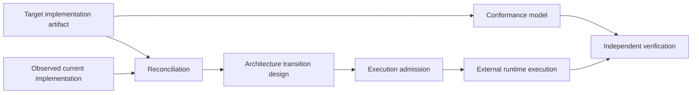
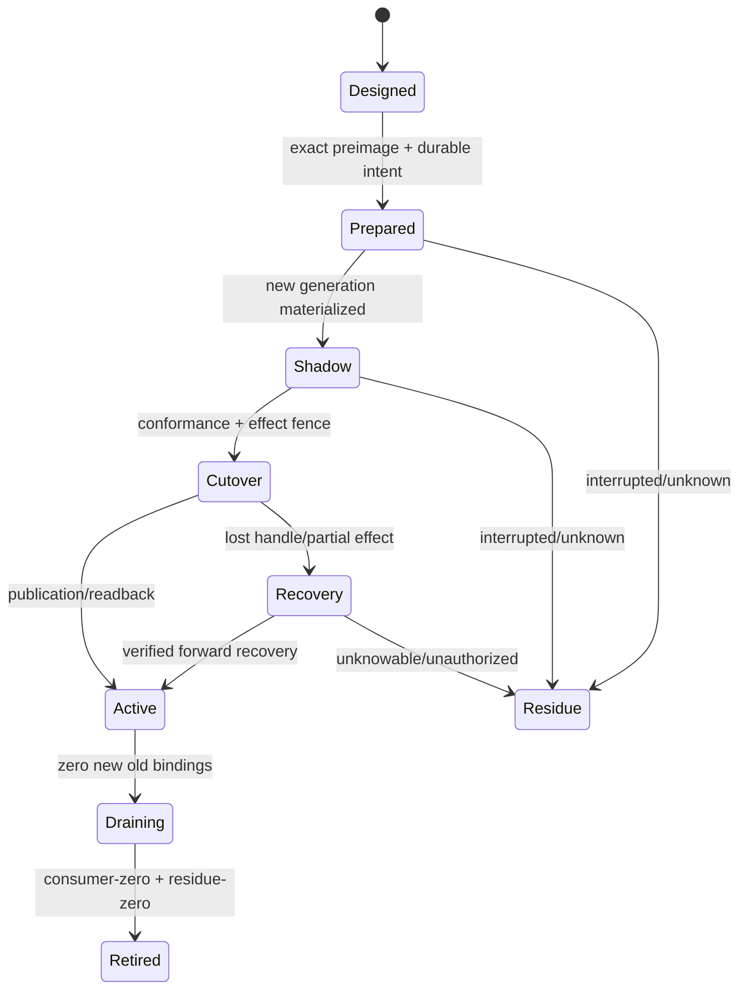

# 架构迁移与一致性

本文只拥有 exact current→accepted target 的 transition design、machine admission 和 implementation conformance。它不修改 target、不执行 Effect、不把测试或迁移状态写回业务 Definition。

## 1. 三个不可合并的产物



| artifact | 回答 | 禁止 |
| --- | --- | --- |
| target artifact | 成品应当是什么 | 当前路径、迁移批次、compatibility shim、完成声明 |
| transition design | 从某个 exact current generation 到 target 如何安全演进 | 修改 target 迁就旧实现、签发 Authority、直接执行 |
| conformance model | 什么 observation 能反驳或支持 target obligations | 自己生成业务事实、导入 implementation private state、充当 Verdict |

这是防止 `contract → compiler → graph/index → contract` 反向环的关键：contract/target只发布 obligations；transition和conformance分别消费 immutable refs；结果以 observation/verdict 新记录返回，绝不被 target import。

## 2. Preservation 与 retirement

“代码里没有 consumer”不能单独决定删除，“未来可能有用”也不能单独决定保留。每个 current carrier先得到一种处置：

```text
CurrentCarrierDisposition =
  | preserve { targetRef, preservedBehaviorAndStateRefs }
  | transform { targetRef, transitionAndReadbackRefs }
  | replace { targetRef, equivalenceAndCutoverRefs }
  | retire { decisionRef, consumerZeroRef, externalUnknownClosureRef }
  | quarantine { residueAndRecoveryRefs }
  | unresolved { unknownRef, closurePredicateRef }
```

```text
PreservationClosed =
  every accepted current ProductCapability is preserved or explicitly retired
  and every accepted FutureObligation is materialized or remains typed future
  and every user/external/durable state has migration or retention semantics
  and no current surplus is kept merely because it exists
  and no target obligation is dropped merely because current has no consumer
```

FutureObligation必须有 owner、purpose、activation predicate、expected public demand、review/expiry和retirement；否则是 speculative shell。满足条件前只存在于设计图，不生成 production type、version、facade、package、runtime或test。

## 3. ArchitectureTransitionDesign

```text
ArchitectureTransitionDesign = exact {
  targetArtifactRef,
  observedImplementationGenerationRef,
  reconciliationRef,
  preservationDecisionRefs,
  transitionStepDagRef,
  temporaryTransitionOnlyArtifactRefs,
  preconditionAndEffectFenceRefs,
  cutoverAndRollbackOrForwardRecoveryRefs,
  consumerZeroAndRetirementRefs,
  conformanceObligationRefs,
  frontierRefs,
  transitionDigest
}
```

```text
ArchitectureTransitionStep = exact {
  stepRef,
  stepKind: carrier | relation-binding | state-schema-data
          | address-projection | consumer-cutover
          | publication-cutover | retirement,
  exact precondition/input/output refs,
  predecessorRefs,
  authority/capability/resource obligation refs,
  effect fence + readback refs,
  rollback or forward-recovery refs,
  stepDigest
}
```

`transitionStepDagRef`表达因果偏序，不强制全序。只有共享writer、state/preimage、authority、indivisible resource或cutover linearization point的steps必须序列化；其余ready antichain可以并行，前提是effects可交换且deterministic merge已证明。步骤种类不按文件扩展；新的carrier或工具通过现有typed relations进入，只有无法表达新的transition semantics时才演进该closed kind。

变化按 semantic identity 和 relation 计算，不按文件 diff：

| observed delta | transition |
| --- | --- |
| Address/placement only | symbol-aware move、imports/config/docs projection再生、old-address consumer-zero |
| implementation representation within freedom envelope | no semantic migration；局部替换+等价验证 |
| Provider/Binding | conformance、generation cutover、in-flight drain、settlement/readback |
| public contract/schema/state | explicit new generation、strict migration reader、consumer transition、old retirement |
| responsibility/Domain boundary | graph repartition、public port migration、state/authority/effect ownership cutover |
| accepted capability retirement | whole producer/consumer/artifact/provider/test/docs closure removal |
| unknown or external consumer | typed frontier；禁止删除或伪 compatibility |

批量 change只有共享一个 owner transition、linearization point与recovery closure时才能原子执行；否则由 DAG 排序的多个小 transition组成。大刀阔斧不等于一个巨大提交，局部性也不等于逐文件补丁。

## 4. Transition 状态机



每一步绑定 exact old/new generations、operation key、grant、allocation、preimage和settlement。可逆的局部 Effect可rollback；外部或不可逆Effect只允许forward recovery/compensation。旧 reader/provider只存在于该 transition 的受限 scope，active normal path永不双读、双写或fallback。

## 5. Machine admission

机器约束从 target graph、transition和conformance obligations生成，不维护路径镜像或手写总清单：

```text
AdmissionResult =
  | admitted { exactActionKey, requiredCapabilities, resourcePlan }
  | rejected { violatedInvariantRefs, minimalConflictCore }
  | unresolved { unknownRefs, affectedClosure, closurePredicate }
  | stale { changedInputRefs }
```

| generated check | authoritative input | 拒绝 |
| --- | --- | --- |
| ownership/placement | recursive scope + ResponsibilityRealization/Placement decisions | orphan、duplicate owner、wrong boundary |
| dependency direction | target Implementation Graph | cycle、private cross-responsibility read、contract→compiler reverse edge |
| public surface | PublicDemand | unneeded export、facade/index shell、missing external contract |
| source truth | exact Source Observation Generation | hidden program string、path/list/version mirror、split scanners |
| Provider/Effect | Requirement/Provision/Binding/Grant contracts | raw transport、ambient fallback、test-origin in production |
| resource/runtime | one operation ledger + settlement algebra | deadline reset、unbounded scan/output、lost handle without recovery |
| state/schema/evolution | owner parser/writer + transition | silent schema drift、normal dual-read/write、unknown→absent |
| tests/evidence | Claim/conformance graph | source-text self-proof、version-only expectation、missing effect/failure boundary |
| performance | lifecycle cost model + ActionKey | redundant full scan/check、stale reuse、cache as authority |

检查器只返回 finding/proof refs；不得直接修复、扩大 scope或以自身PASS签发完成。确定性修复可由独立 transformation compiler在 exact preimage上生成 patch，再重新观察和准入。

## 6. ConformanceModel

```text
ConformanceModel = exact {
  logicalAndTargetArtifactRefs,
  publicBehaviorAndFailureClaims,
  stateEffectRecoveryAndAuthorityClaims,
  securityPrivacyAndRelationalClaims,
  compatibilityAndEvolutionClaims,
  determinismConcurrencyAndResourceClaims,
  coldWarmDeltaAndCacheDisabledEquivalenceClaims,
  generatedFaultAndPropertyFamilies,
  requiredObservableAndIndependentOracleRefs,
  coverageAndUnknownFrontierRefs,
  conformanceDigest
}
```

Conformance Compiler按每个ResponsibilityRealization的实际facets生成claims；无state的pure function不被迫拥有journal测试，无external Effect的operation不被迫拥有Provider测试。每项target field若影响public trace、Authority、Effect、state、failure、security、compatibility、resource或可维护成本，就必须产生observable claim；否则该field没有存在证明。

测试只是某些 claims 的 observation provider：优先性质、关系、state transition、真实 effect/readback和failure boundary。数字、版本、文件路径、数组清单、function arity和源码文本只有在它们本身是公开/持久/安全合同且由唯一 owner派生时可成为 oracle。

## 7. 对抗闭包

对抗不是枚举历史 bug，而是从通用 fault algebra生成：

```text
adversarialFixedPoint(targetArtifact) =
  repeat {
    generate identity/authority/state/effect/resource/concurrency/
             external/compatibility/unknown/performance faults;
    simulate against targetArtifact + transition + conformance;
    add missing rejection, recovery, observable or frontier;
    invalidate reverse-dependent design/evidence;
  }
  until several independent strategy passes add no new fault class
```

至少包含：same-path ABA、stale snapshot、identity spoof、provider substitution、authority amplification、duplicate Effect、lost handle、partial settlement、deadline/abort at every boundary、resource exhaustion、cache corruption、hidden source graph、schema drift、migration interruption、consumer unknown、projection mirror、自证、concurrent external mutation以及clean/warm/delta不等价。反例使前提和反向依赖 stale；不能追加一个品牌条件或测试名称作为“修复”。

## 8. 可闭眼执行的伪流程

```text
target       = compileTarget(logicalArtifact, acceptedProfile)
observed     = observeCurrent(exactWorkspaceView, interpreterClosure)
reconciled   = reconcile(target, observed)
preservation = decidePreserveTransformRetire(reconciled, productObligations)
transition   = compileTransition(target, observed, preservation)
conformance  = compileConformance(logicalArtifact, target)
attack       = adversarialFixedPoint(target, transition, conformance)

if attack.frontier != empty: publish bounded design frontier only
else: publish immutable target + transition + conformance refs

// A later live executor, outside this design contract:
admit(exact refs, current grant/bindings/resources/preimage)
executeAndSettle()
reobserveAndVerify()
cutOverThenRetireOldOnlyAfterConsumerZero()
```

任何步骤缺输入都产生 typed unresolved，不由实现者猜测。任何新事实只重编其反向可达闭包；同一 exact ActionKey 的结论可复用。

## 9. 完成

```text
ArchitectureTransitionDesignClosed =
  exactTargetAndCurrentGenerations
  and totalCurrentCarrierDisposition
  and acceptedCapabilityAndFutureObligationConservation
  and symbol/state/provider/authority/resource migration closure
  and crash-safe cutover/recovery/retirement design
  and zero normal-path compatibility shell
  and bounded unknown frontier

ConformanceModelClosed =
  every material target obligation has an observable claim
  and every claim has an independent oracle/invalidation rule
  and generated adversarial passes reach a fixed point
  and no verifier is imported by the target owner
```

<!-- sec-clause {"blocker":null,"kind":"stable-decision"} -->
## 规范片段

Target、current observation、transition与conformance必须分型并单向依赖。迁移按semantic relation而非文件路径编译，所有现有价值、future obligation、state和external unknown都必须显式处置；normal path不保留双代际兼容壳，验证不能反向定义实现。
