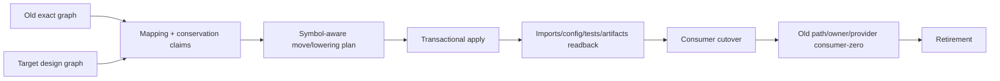

# 架构迁移、机器准入与一致性验证

本片段拥有 Architecture Migration、机器准入、对抗模型、伪实现、Conformance Model 与交接包。

本片段与 [owner root](../implementation-architecture.md) 共享同一 domain，但只拥有 registry 分配给本片段的 ownership keys；跨片段语义使用引用，不复制定义。

## 13. Architecture Migration Transaction

任何重命名、移动、拆分、合并、owner 调整、包变化或生成切换都是一次架构迁移：



```text
ArchitectureMigration {
  oldGraphRevision
  targetDesignRevision
  currentSourceGenerationBindingRef
  targetDesignBindingRef
  consumerCensusRef
  subjectMappings
  capabilityConservationClaims
  authoredMoves
  generatedProjectionUpdates
  packageAndConfigUpdates
  durableStateMigrations
  testClaimMappings
  operationEnvelopeRef
  cutoverPreimageRef
  unknowns
  cutoverPredicate
  rollbackOrForwardRecovery
  retirementSet
}
```

`oldGraphRevision`和`targetDesignRevision`只是语义/实现包的内容引用，不能单独
授权迁移。`currentSourceGenerationBindingRef`必须指向观察 owner 签发的 exact
source/provider/tree 内容世代（含 observation epoch、semantic/implementation
graph digest）；`targetDesignBindingRef`必须指向已冻结的目标设计与 target
profile，而不是执行者临时拼出的路径清单。`consumerCensusRef`必须由 consumer
coverage owner 签发并绑定 current source generation，明确 local coverage、external
consumer status、动态/generated/config/workflow readers 和 retention/revalidation；
空的字面命中集合不能代替它。所有三个引用都必须在同一 migration generation
binding 下相等，否则返回 stale/unknown，不得继续 staging 或 cutover。

`operationEnvelopeRef`绑定本次迁移的 principal、scope、authority grant、resource
allocation、monotonic deadline、cancellation、retry/reentrancy 与 recovery policy；
`cutoverPreimageRef`绑定待替换的 current pointer/registry/physical identities 和
最后一次 readback。每个 filesystem、store、process、external 或 cleanup effect
都只能消费该 envelope 的剩余预算，并在 effect 前后重验 preimage；不能把
`operationId`、commit、branch、退出码或 callback return 当作 envelope、preimage
或 settlement。迁移执行者丢失句柄时只能根据 durable journal + provider/state
readback 重新取得这些引用，不能新建一个计划或按目录猜测。

```text
ArchitectureMigrationAdmitted(m) =
  issuedByMigrationOwner(m)
  ∧ currentSourceGenerationBindingRef == exactCurrentObservedGeneration
  ∧ targetDesignBindingRef == frozenTargetDesignAndProfile
  ∧ consumerCensusRef.completeFor(m.currentSourceGenerationBindingRef)
  ∧ every consumer/status frontier is either closed or explicitly disjoint
  ∧ operationEnvelopeRef.activeFor(m.scope, m.currentSourceGenerationBindingRef)
  ∧ cutoverPreimageRef.matchesCurrentReadback
  ∧ capabilityConservationClaims + unknowns + recovery are closed
```

`ArchitectureMigrationAdmitted`是迁移 owner 的输入准入，不是迁移过程的成功结论；
任一引用、输入 digest、consumer coverage、authority、allocation、deadline 或
preimage 变化都会使 migration stale，并沿 reverse closure 使其 plan、Evidence
和 staging residue 失效。target bytes 写入前后都必须保留 source/target binding
与 journal readback；只有一次 generation-level CAS 成功且新 reader 独立读回后，
才允许执行旧地址/旧 owner 的 retirement。

迁移工具消费 symbol/reference graph，不依赖字符串替换。路径缩短不是成功；所有 imports、package exports、CLI entrypoints、runtime locators、generated registries、tests、docs 和 artifacts 必须重编/readback，旧地址 consumer-zero 后才退休，不留 alias/compat barrel。

Consumer evidence is split into the observed reference set and coverage proof:

```text
ObservedConsumerRefs   = references found by one bounded observer
LocalConsumerCoverage  = complete | unknown
ExternalConsumerStatus = none-observed | present | unknown
```

An empty observed set is not consumer-zero. Literal search, package metadata,
generated entrypoints, dynamic readers and external protocols cover different
universes; each must be bound to the exact source generation or remain a typed
frontier. A migration compiler must reject cutover while local coverage is
`unknown`, even when `ObservedConsumerRefs` is empty.

Registry and target-contract digests are owner-derived from the actual inputs;
caller-supplied digest strings are assertions to verify, not credentials. An
unregistered address is likewise `unclassified` until lifecycle evidence is
provided; directory names cannot classify ownership or retirement.

## 14. Machine admission 与自动化入口

### 14.1 Declaration admission

每个 production declaration 必须可计算：

```text
DeclarationClass
OwnerCell
SemanticSubject
DependencyLayer
Visibility
StateRole
EffectRole
GenerationKind
ProviderOrPort
Lifecycle
ClaimCoverage
FutureObligationRefs
```

信息优先从类型、引用、调用、Effect、state、parser/writer、package 与 owner graph 推导；只有不可计算的产品取舍由 owner metadata 补充。无法分类的 declaration 保持 bounded unknown，并只阻断受影响 promotion/Effect。

### 14.2 Continuous pipeline

```mermaid
flowchart LR
  E[Edit / intent] --> CM[Incremental Content Manifest]
  CM --> SP[Incremental Source Program]
  SP --> AD[Architecture + locality admission]
  AD --> IG[Generated projection / governed patch]
  IG --> DI[Delta + impact]
  DI --> TS[Cheap affected sentinels]
  TS --> F[Freeze exact ActionKey]
  F --> EV[Missing/stale formal evidence only]
  EV --> PR[Promotion readback]
```



- editor loop复用 long-lived Language Service 与 content-addressed fact shards；
- typecheck/audit/test-impact/unused/duplicate/hardcode/placement共用同一 Source Program；
- cheap sentinel 只验证改变的 owner/claim；
- full evidence 对 frozen exact tree/environment 运行一次并按 ActionKey 复用；
- failure input 未变时复用 deterministic failure；
- rule/LogicalDesignPackage/TargetImplementationDesignPackage变化只失效反向依赖它的shards/claims；
- CI/GitHub Actions 是 executor Provider，不是唯一 merge truth；本地受信 executor 可产生同合同 Evidence。

## 15. 对抗模型

| 候选方案/事故 | 失败原因 | 必须回到 |
| --- | --- | --- |
| 一个巨型 `platform` 或 `modules` 目录 | 路径替代 responsibility | Cell + Placement Compiler |
| 每个 domain 固定五层目录 | 空壳、机械跳转、无真实 consumer | graph-demanded roles |
| root `index.ts` 统一出口 | 第二 API 图、环、unused 不可见 | narrow public operation/contract |
| 为未来保留无 consumer 空实现 | active shell 冒充 obligation | FutureObligation + activation predicate |
| 直接删除有未来价值的实现 | capability intent 丢失 | conservation classification + obligation |
| 任何无 consumer 都保留 | orphan 永久污染 | counterfactual + activation evidence |
| AI 按自然语言直接改代码 | scope/semantics/authority 混合 | accepted intent + compilation |
| 每次改动全仓扫描 | observation 没有共享/增量 | Content Manifest + fact shards |
| 每次跑 full `tsc` | final verifier当 editor service | Language Service + affected closure + ActionKey |
| 新 daemon 缓存所有事实 | 第二 truth、生命周期成本 | content-addressed facts；有需求才 daemon |
| Docker/Git/TS 各自做 session | 重复预算/settlement/authority | shared operation/resource kernel + typed ports |
| Provider unavailable 自动 fallback | 改变 identity/semantics | typed unavailable；上游重新 Binding |
| catch-all `false/null` 后写入 | unknown 被降为 absent | discriminated readiness |
| timeout 后 cleanup 无界继续 | parent ledger被绕过 | settlement allocation + typed residue |
| 测试 mock 是普通函数 | test authority可进 production | opaque test issuer / separate entry |
| 全局版本 registry | schema owner被集中复制 | per-contract owner + derived index |
| 多文件同步更新一行 | authored projection/mirror | Change Locality Compiler |
| package manager/workspace接管业务 DAG | 工具获得语义 owner | execution Provider only |
| 只靠 lint path allowlist | 新路径绕过，意图不可见 | declaration/relationship admission |
| 文档声明架构完成 | prose自证实现 | Source Program + readback + Evidence |
| compiler生成代码但手工可改 | dual writer | generated ownership + byte readback |
| migration长期双读双写 | 多 active generation | bounded migration reader + atomic cutover |

## 16. 伪实现合同

```text
compileImplementationArchitecture(input):
  logical := requireValidatedSystemArchitecture(input.logicalRevision)
  source := requireExactSourceProgram(input.sourceRevision)
  entities := classifyDeclarations(source, logical)
  cells := joinAcceptedResponsibilities(entities, logical.responsibilities)
  dag := compileOwnerAndLayerDag(cells, source.references)
  assertNoCrossCellCycleOrDuplicateOwner(dag)
  placements := compilePlacements(cells, dag, source.effects, source.coChange)
  locality := compileChangeLocality(input.intent, logical, source, placements)
  generation := compileIntentToCode(input.intent, locality, placements)
  migration := compileArchitectureMigration(source, generation.targetGraph)
  attacks := modelCheckImplementationDesign(
    entities, dag, placements, locality, generation, migration
  )
  return admissibleOrExactFrontier(...)
```

```text
applyGovernedImplementation(plan, operationCapability):
  require plan.admitted and exact input revisions
  stage generated bytes and governed-authored proposal
  recompile Source Program from staged exact bytes
  require semantic delta == plan.semanticDelta
  require effects/owners/dependencies/unknowns within plan
  publish through operation-scoped transaction
  read back graph, behavior, state, settlements and retirement
  emit terminal receipt; never self-issue verification verdict
```

## 17. Conformance Model：实现设计的可反驳规格

逻辑model checks由`docs/system-architecture.md`完成；本层验证目标实现是否完整、忠实且非支配地refine已冻结逻辑。`ConformanceModel`是独立设计产物，不是测试文件清单，也不包含任何执行PASS：

```text
ConformanceModel {
  logicalDesignPackageRef
  targetImplementationDesignPackageRef
  structuralProperties
  semanticRefinementProperties
  relationalRefinementProperties
  authorityEffectResourceProperties
  stateFailureRecoveryProperties
  evolutionAndExtensionProperties
  economyAndPerformanceProperties
  scenarioGenerators
  faultTransformations
  observableProjections
  independentOracles
  coverageAndNotApplicableProofs
  exactUnknownFrontier
}
```

property和oracle先于代码与测试存在；model checker、type/schema checker、property runner、scenario executor、benchmark和independent verifier只是它们的可替换realization。一个实现可以没有某种测试框架，但不能没有对应的observable与oracle；一个测试即使绿色，也不能扩充`ConformanceModel`中的Claim。relational property必须显式lower为self-composition、product program或等价的trace-tuple oracle，并绑定principal observation partition；若实现只暴露单轨迹observable，相关noninterference/observational-equivalence Claim为`unverifiable-claim`而不是默认满足。

Target Implementation Freeze 前必须成立：

| Property | 必须成立 |
| --- | --- |
| Unity | 每个 semantic fact/identity/writer/parser/resolver/terminal owner 唯一 |
| Orthogonality | Definition/Authority/Capability/Resource/Execution/Proof 不互相冒充 |
| Constraint confluence | constraint composition满足交换、结合、幂等；constraint conflict与candidate violation分型并返回最小冲突核 |
| View structure fidelity | renderer使用containment时parent唯一；跨boundary只走public ports；collapse/expand不改变meaning |
| Context completeness | 最小view闭合适用义务与boundary/unknown；最大coverage可从同一typed refs求传递闭包恢复 |
| Source observation unity | disk/index/worktree/editor/generated overlays按一个exact view合成一个generation；所有consumer引用同一manifest/fact identity |
| Locality | 每个 authored change point有 owner；derived fanout不需手写 |
| Acyclicity | cell/layer DAG 无跨 owner runtime SCC |
| Capability conservation | every accepted ProductCapability/FutureObligation has a mapped realization claim or explicit Product decision |
| No authority amplification | AI/tool/provider/test/projection不能扩大 Grant/Effect |
| Round-trip | brownfield→IR→implementation 保持声明的 behavior/effect/failure/state |
| Incremental equivalence | clean、warm、delta、cache-disabled结果等价 |
| Relational refinement | logical relational Claim在目标实现的trace tuple、可见Observation与declassification边界上被保留 |
| Recovery | 每个 Effect crash/lost-handle/timeout有 terminal或typed residue |
| Evolution | normal path 单 generation；migration bounded 且可退休 |
| Economy | 无 orphan、mirror、dominated facade、second graph/cache/session |
| Future extensibility | 新 Target/language/provider/domain 通过 typed extension加入，不改 core identity |

每个target package维度必须由ConformanceModel覆盖；不存在“先写进设计、以后再想怎么证明”的字段：

| Target design dimension | Required conformance | Rejection |
| --- | --- | --- |
| component/trust-zone topology | owner uniqueness、static DAG、zone crossing、issuer/producer/verifier separation | topology-unowned / cycle / trust-collapse |
| data ownership/persistence/consistency | one schema+transition owner、strict read/write、linearization、retention、recovery | competing-writer / invalid-state / unreadable-residue |
| source placement/visibility | every declaration owned、public-demand minimality、address move equivalence | placement-unresolved / hidden-public-surface |
| package/entrypoint/interface | real release/runtime/security boundary、parse→invoke→project、machine/human channel separation、intent/accessibility/locale/risk/cancel fidelity、no second resolver | package-unjustified / interface-authority / interaction-drift |
| compiler/frontend/backend | deterministic exact inputs、coverage/unknown、round-trip、conservative extension | semantic-drift / incomplete-coverage |
| operation/capability/resource runtime | grant/binding/allocation intersection、at-most-once Effect、settlement/readback | authority-amplified / budget-escaped / effect-unsettled |
| deployment/profile | cold reconstructibility、profile semantic equivalence、tenant/isolation constraints | profile-drift / hidden-singleton |
| concurrency/time/recovery | serializable conflicts、authoritative expiry、lost-handle join/recovery | race / clock-authority / unsafe-replay |
| schema/evolution/provider | exact grammar、one active generation、provider conformance/cutover/retirement | schema-drift / dual-generation / substitution |
| performance/incremental reuse | clean/warm/delta/cache-disabled equivalence + measured lifecycle cost | stale-reuse / dominated-cost |
| generated/authored/opaque ownership | one writer、generation readback、opaque boundary、no unique projection information | dual-writer / hidden-source / mirror |
| implementation observables/Claims | every Claim has observable coverage、independent oracle与invalidation | self-proof / unverifiable-claim |
| exact frontier | every unknown has affected closure、owner、closure condition与promotion block | unknown-crosses-boundary |

必要的生成性质测试：输入顺序置换、地址移动、provider替换、same-path ABA、缓存损坏、unknown注入、partial Effect、lost handle、deadline exhaustion、concurrent mutation、old/new migration interruption、clean/incremental equivalence、manual/generated等价和删除反事实。

### 17.1 通用故障族的实现投影

下表只引用 `docs/design-calculus/compilation.md` 的semantic fault identities，不重新定义故障；它确保每个通用攻击在实现层都有确定拒绝点。fault identity是稳定语义名称，不使用会因插入、重排或扩展而漂移的数字ordinal。

| Fault | 实现层拒绝点 |
| --- | --- |
| `identity-spoof` | semantic identity/Address 分型 + retained physical Binding + same-path ABA check |
| `stale-snapshot` | ImplementationGraph/ChangePlan exact input revisions + pre-effect recompile |
| `unknown-crossing` | exact coverage frontier + discriminated readiness + affected promotion block |
| `authority-amplification` | ExecutionCapability/ObservationTicket/EffectTicket opaque capability；AI/test/provider只提交 observation/proposal |
| `provider-substitution` | Requirement→eligible Provision→Binding；ambient fallback不可达 |
| `resource-reset` | one parent operation ledger贯穿 child/retry/readback/cleanup/recovery |
| `non-reentrant-concurrency` | capability contract驱动 sequence/join/bounded parallel plan |
| `lost-handle` | durable OperationKey/journal + provider/domain readback + join/recovery |
| `cleanup-failure` | settlement保存 primary + cleanup error + typed residue |
| `crash-intermediate-state` | intent-before-effect + immutable journal + state owner recovery |
| `schema-drift` | one owner parser/writer/schema + bounded migration reader + new generation cutover |
| `owner-facade-cycle` | owner/layer DAG + SCC witness + dependency inversion + facade existence proof |
| `projection-mirror` | generated projections from ImplementationGraph + Change Locality rejection |
| `self-proof` | Claim/Evidence issuer separation + exact independent readback |
| `duplicate-effect-delivery` | OperationKey claim + single-flight/join + settlement/readback before retry |
| `future-abstraction-shell` | FutureObligation/reference evidence；active code只在 activation predicate 后生成 |
| `context-loss` | content-addressed design package refs/ChangePlan/operation journal；summary无Authority |
| `external-consumer-unknown` | protocol/support evidence + bounded unknown；内部 consumer-zero不足以删除 |
| `cache-poisoning` | content/config/provider/environment ActionKey + strict cache readback |
| `migration-coexistence` | normal path single generation + migration-only old reader + consumer-zero retirement |
| `hidden-source-graph` | exact content classification + embedded-program interpreter/typed opaque |
| `unbounded-input` | streaming shared entries/bytes/depth/time/signal allocation；不预扫两次 |
| `presentation-as-protocol` | structured machine interface + strict parser；shell/presentation只作显示/transport |
| `architecture-change-without-migration` | ArchitectureMigration old/new graph、symbol-aware move、cutover/readback/retirement |
| `representation-view-confusion` | canonical fact/relation refs + purpose-bound query + coverage/frontier digest + renderer fidelity check |
| `relational-observation-leakage` | Conformance Compiler生成trace-tuple observable与relational oracle；目标实现不得隐藏secret-dependent control/resource/output差异 |
| `split-content-snapshot` | Observation Host签发exact WorkspaceContentView generation；typecheck/audit/test-impact不得分别扫描或重建同名snapshot |
| `bootstrap-dependency-cycle` | bootstrap dependency DAG只根植于已采用host primitives；待启动Provider及其workload route不可反向可达 |
| `implicit-scheduling-policy` | execution plan携带SchedulingRequirement；scheduler记录policy revision与chosen order且没有ambient default |
| `provider-generation-bleed` | every attempt/journal/session pins provider generation；draining generation zero-new-allocation后才retire |
| `human-interface-misoperation` | `HumanInteractionContract`从operation/result生成；preview/confirmation绑定exact plan+preimage+principal，locale/accessibility/cancel/undo不改变semantic invocation或settlement |

### 17.2 代表性系统 trace

| 输入变化 | 唯一 authored change point | 自动派生 | 必要验证/迁移 |
| --- | --- | --- | --- |
| pure query已有immutable input | query contract/consumer | 直接typed调用；不创建runtime session或allocation | result/unknown property；zero hidden observation/effect |
| query需要filesystem/network/runtime新观察 | DomainOperation requirement/readback owner | PureOperationPlan→ObservationTicket→coverage/settlement→typed result | observe authority、budget、provider/subject identity、unknown |
| 多Domain workflow | WorkflowDefinition | PureWorkflowPlan→workflow root allocation→public child OperationInvocations→result join | child state/provider不可达、parent resource conservation、cancel/compensation |
| 单Domain mutation | DomainOperation | PureOperationPlan→exact Binding→AdmittedExecution→preimage→EffectTicket→settlement/readback | authority、at-most-once、partial/lost-handle、independent result |
| 增加领域 invariant | domain contract/decision owner | operation guards、diagnostics、claims、docs projection | behavior + failure/property impact |
| durable schema 演进 | state contract owner | writer/parser schema refs、migration plan、readback claims | old exact grammar→new generation→consumer-zero |
| Git/Docker/TypeScript Provider 替换 | provider Binding/adoption owner | affected operations、ActionKeys、resource plan | conformance、identity、Effect、settlement；不改领域 Definition |
| 源码/目录移动 | PlacementDecision | imports、exports、config、test selection、docs navigation | graph equivalence + old address consumer-zero |
| 多命令组成新业务操作 | DomainOperation owner | Requirement DAG、bindings、allocations、journal/readback | partial failure、lost handle、duplicate delivery |
| typecheck/audit/test-impact重复扫描 | Source Program observation owner | shared fact shards与各 consumer projection | cold/warm/delta/cache-disabled equivalence + performance |
| 退役任意Product capability | Product/Change decision owner | consumer/artifact/test/package/provider retirement closure | capability conservation + external consumer unknown + zero residue |
| 删除或合并测试 | Claim/test-value owner | producer-consumer/effect/failure/replacement census | replacement claim不弱化；非零图不得删除 |
| 引入新语言/Target | frontend/Target/Profile extension owner | language facts→通用 IR；Target bindings→Backend | core semantic identity不变 + unknown/conformance |
| 采用成熟外部库 | Capability adoption owner | port Binding、provider epoch、Impact | license/security/API/resource/settlement/retirement |
| 进程句柄丢失或主机重启 | operation/state owner | journal claim、provider readback、join/recovery | zero duplicate Effect + terminal/residue |
| 新反例推翻设计前提 | Design owner | reverse dependency closure stale、new affected design packages | model/fault rerun + migration；旧Evidence不可复用 |

## 18. Target Implementation DesignPackage

目标实现架构冻结时只发布未来成品设计，不夹带任何被观察实现的inventory或迁移步骤：

```text
TargetImplementationDesignPackage {
  logicalDesignPackageRef
  acceptedImplementationDecisionRefs
  designRationaleIndexRefs
  implementationGraphSchema
  componentAndTrustZoneTopology
  dataOwnershipPersistenceAndConsistencyTopology
  sourcePlacementAndVisibilityRules
  packageEntrypointAndInterfaceProjectionRules
  semanticCompilerFrontendBackendContracts
  operationCapabilityResourceRuntimeContracts
  deploymentProfilesAndExtensionContracts
  concurrencyTimeFailureRecoveryAndCrossDomainProtocols
  schemaEvolutionAndExternalProviderContracts
  performanceCostAndIncrementalReuseModel
  generatedAuthoredOpaqueOwnershipRules
  implementationObservableAndClaimRefs
  alternativesDominanceAndReversalRefs
  exactDesignFrontier
}
```

实现理由不写成本文中的第二份散文结论：不可推导选择引用其Responsibility owner内的`DesignDecision`；来源、目的、候选、成本、支配、避免故障、后果、proof obligations与反转影响由Design Compiler生成typed explanation traces与`DesignRationaleIndex`；本package只保存exact refs。这样后来者既不重复判断，也不能让实现文档成为隐藏的产品或逻辑owner。

`ConformanceModel`不是本package的输入或字段：Conformance Compiler在实现包冻结后独立消费`LogicalDesignPackage + TargetImplementationDesignPackage`，并把结果并列挂入`DesignKnowledgeGraph`。实现包只发布observable/Claim refs，不能反向导入测试、verifier、Evidence或ConformanceModel；否则会形成“实现按自己的验证器定义正确”的依赖环。

`TargetImplementationDesignPackage`只描述未来成品，不包含任何被观察仓库的路径清单、迁移批次、兼容alias、临时adapter、task列表或完成声明。只有它通过§17并明确frontier后，独立迁移编译器才可把某个exact observed implementation graph与本target比较，生成一次`ArchitectureMigration`。迁移不能回写目标设计以迁就输入工程；真实反例若推翻目标前提，必须先重算对应owner decision与受影响DesignPackage。
