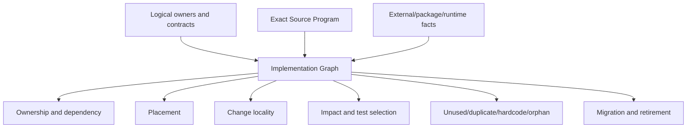
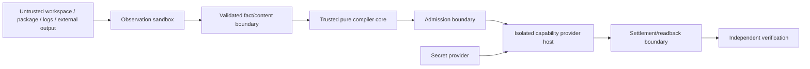
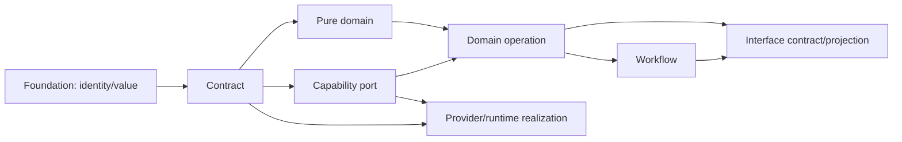
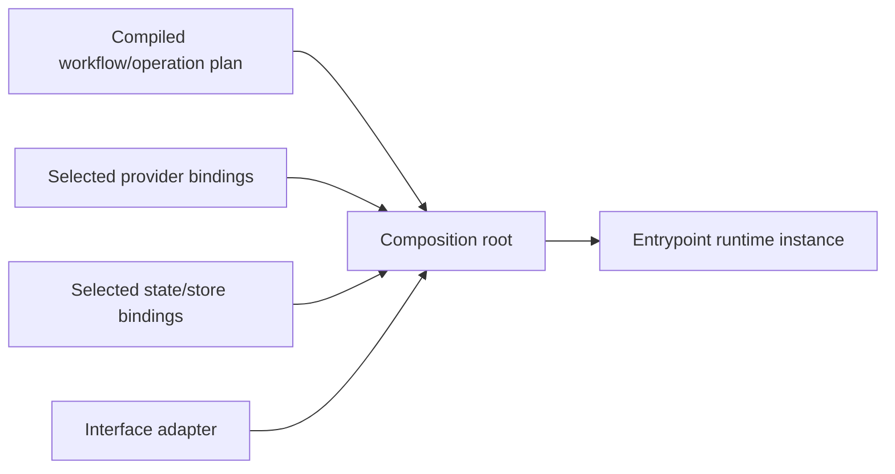
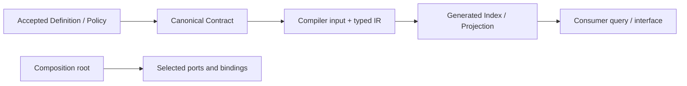

# 实现实体、边界与依赖

本片段拥有实现实体代数、Canonical Implementation Graph、Responsibility Cell、依赖可见性、public surface 与 Facade 存在证明。

本片段与 [owner root](../implementation-architecture.md) 共享同一 domain，但只拥有 registry 分配给本片段的 ownership keys；跨片段语义使用引用，不复制定义。

## 2. 实现实体代数

每个对象必须属于一个主实体，并通过关系连接其他实体；目录、文件名、类名和字符串不能隐式创造实体。

| 平面 | 实体 | 唯一 owner | identity 来源 | 生命周期 |
| --- | --- | --- | --- | --- |
| Purpose | ProductCapability、Outcome、NonGoal、FutureObligation | Product/Domain | accepted definition digest | proposed→accepted→retired |
| Semantics | Subject、Definition、Invariant、FailureKind、ClaimDefinition | Domain contract | semantic owner + canonical content | draft→active→superseded |
| Responsibility | ResponsibilityCell、PublicDemand、OwnerEdge | Architecture + Domain adoption | owned Subject set + obligation refs | candidate→accepted→retired |
| Operation | DomainOperation、WorkflowDefinition、RequirementDAG、StateMachine、AdmissionDecision | Domain/workflow/control owners | operation/workflow definition digest + current admission inputs | planned→admitted→terminal/residue |
| Capability | CapabilityPort、Provision、ProviderBinding | Capability/provider owner | contract + provider epoch | discovered→eligible→bound→settled |
| Resource | ResourceLedger、Allocation、RetainedCapability | Resource owner | parent ledger + allocation key | reserved→consumed/released→terminal |
| Knowledge | ContentSnapshot、SourceProgram、Declaration、Reference、Unknown | Observation/interpreter owner | exact content + interpreter closure | observed→validated→stale |
| Constraint | Constraint、AdmissionPredicate、ReversalCondition | contract/architecture owner | owner definition + applicable subjects | proposed→active→superseded |
| Change | Intent、DesiredDelta、SemanticDelta、BindingDelta、ImpactClosure | Product/Domain + Change Management | accepted intent + endpoint revisions | proposed→admitted→applied/rejected |
| Authority | Principal、AuthorityGrant、Delegation、EffectScope | authority issuer | principal + exact subject/scope/epoch | proposed→active→expired/revoked |
| Implementation | CodeUnit、DataContract、AdapterBoundary、GeneratedProjection | Implementation Architecture + cell owner | owner Subject + realization kind | planned→materialized→retired |
| Physical | SourceArtifact、Package、Config、RuntimeState、Cache、Artifact | physical/lifecycle owner | content digest + Address/physical binding | created→active→terminal/residue |
| Execution | EffectTicket、Attempt、Observation、Settlement、Residue | operation/resource/provider/state owners | OperationKey + binding + allocation | admitted→running→terminal/residue |
| Proof | Gate、Evidence、Verdict、ActionKey | Verification owner | claim set + exact inputs/environment | required→observed→valid/stale |
| Evolution | Generation、Migration、Cutover、Retirement | Change Management + state owner | old/new graph + transition identity | prepared→shadow→active→retired |
| Interface | IntentProjection、QueryProjection、Command/API Contract | interface owner | referenced domain operation/result | draft→published→retired |

实体族、Statement variants、typed relation kinds、planes、hard-constraint families 与 compilation stages 的集合及基数都从 exact meta-model、logical profile 和 registry 编译；prose 不冻结它们的数量。consumer 绑定 model/profile revision 与 canonical digest；集合变化使旧 projection、coverage 和 count 全部 stale。领域实例数量只由 Product/Domain definitions 与 exact graph 决定，任何手写总数、路径清单或测试镜像都不能成为模型约束。

### 2.1 不可混淆关系

```text
Subject ≠ Address
Definition ≠ Observation
Requirement ≠ Provision
Provision ≠ AuthorityGrant
Binding ≠ Allocation
Attempt ≠ Settlement
Settlement ≠ DomainResult
Evidence ≠ Verdict
FutureObligation ≠ ActiveImplementation
GeneratedProjection ≠ SemanticOwner
```

实现必须用不同类型或不可伪造 capability 表达上述边界；共享 `string`、可 JSON 克隆的结构对象或命名约定不足以形成边界。

### 2.2 Canonical Implementation Graph

所有实现判定从同一个不可变 `ImplementationGraph` 编译；它是 exact inputs 的 content-addressed 结果，不是全局手写 registry、数据库真相或 daemon-owned mutable model。

```text
ImplementationGraph {
  inputRevisions: logical architecture + domain definitions + content snapshot
  nodes: accepted entities + observed declarations/artifacts + typed unknowns
  edges:
    owns | realizes | declares | imports | calls | reads | writes
    requires | provides | binds | allocates | effects | settles
    produces | consumes | generates | projects | tests | proves
    migrates | supersedes | retires | preserves | invalidates
  coverage: exact universe + interpreter/provider frontier
  digest: canonical graph bytes
}
```

`ImplementationGraph` 是 `SECSystemModelSnapshot` 中 realization/source/physical relations 的purpose-neutral typed projection，不是全系统唯一图或全局运行时对象。authoritative input仍由各Product/Domain/state/provider owner分别持有；graph compiler只解析这些immutable fragments与Source Program observations，并发布content-addressed snapshot。任何consumer必须声明query purpose/root：普通implementation consumer获得最小完整闭包；全系统架构/审计purpose可获得最大授权coverage，但仍通过generated query而不是production import整图。

```text
ImplementationGraphSlice {
  graphDigest
  purpose + rootSubjectRefs
  selectedFactAndRelationRefs
  detailBudgetAndFrontierRefs
  selectedTypedHyperedgeRefs
  boundaryPortMappings
  coverageAndUnknownFrontier
  upstreamRevisionRefs
  sliceDigest
}

compileSlice(graph, request):
  reject undeclared edge kinds or private-owner traversal
  compute least applicable typed closure under request purpose
  choose a renderer that preserves relation semantics
  omit unrelated facts without hiding boundary/unknown
  prove omitted applicable obligations are not-applicable
  emit immutable slice + reverse-dependency key
```

实现框架的可组合单位是递归`ImplementationScopePackage`，不是全局service、固定五层目录或“所有节点都实现一遍”的模板。它由同一graph按root/purpose生成；最小operation package与全系统package只是展开深度不同：

```text
ImplementationScopePackage = generated {
  scopeRef + purposeRef + selectionAndCoverageDigest,
  exactLogicalAndImplementationRevisionRefs,
  upstreamSemanticRefs: {
    definitionAndPolicyRefs,
    domainOperationAndWorkflowRefs,
    requirementAndClaimRefs
  },
  publicContractRefs,
  ownedResponsibilityCellRefs,
  childScopePackageRefs,
  crossBoundaryPortAndRelationRefs,
  applicableRealizationFamilyRefs: {
    purePlanCompilers,
    stateAndResultRuntime,
    capabilityRequirements,
    persistenceAndRecovery,
    interfaceProjections
  },
  conformanceAndEvolutionObligationRefs,
  each omitted family: notApplicable(derivationRef),
  unknownFrontier,
  packageDigest
}

compileImplementationScope(root, purpose, graph):
  expand semantic containment recursively
  reference upstream semantics without copying or re-owning them
  include only applicable realization families, obligations and public frontier ports
  keep dependency/call/binding/proof/evolution as typed cross-edges, never tree copies
  collapse child detail only with identity/revision/contract/blocker digest
  reject hidden private-state access, duplicate family owner or unexplained omission
```

package不是运行时对象：authoring时它是compiler input/output closure，运行前收窄为`PurePlan`，admission后才产生live capabilities/session。Domain、Workflow、Provider、Store和Verifier分别实现自己的Responsibility Cells；composition root只组装public ports和immutable plans，不能成为全部逻辑的God orchestrator。一个纯计算Domain因此可以只有contract+algorithm+claims；有durable Effect的Domain才加入state/runtime/recovery；无interface的内部scope不会被迫生成CLI/API。任何后续需求先扩展semantic package/typed relations，再由compiler局部重算适用families，而不是修改一个全局switch。

被分类为`pure-cell`的CodeUnit不得消费任何graph slice，只接收已编译immutable values。只有在consumer profile中声明`model-query`职责的Placement、impact、migration或architecture-audit compiler可以读取其purpose对应slice。Domain operation runtime只消费已编译plan与opaque capabilities，不读取总模型。slice按`graphDigest + purpose + root refs + detail budget + compiler identity`复用；上游变化只失效reverse-reachable slices。所有renderer共享fact/relation refs；摘要必须携带selection、coverage、boundary与frontier digest，因此AI可以从最小上下文继续查询而不把摘要误作完整事实。



同一 graph 的投影可以独立缓存，但不能重扫后改变语义。新增 analyzer 只能消费 graph 或贡献一个有 coverage 的 interpreter/provider；不得另建 tests-only regex、imports graph、package graph、process inventory 或 path registry。

```text
ImplementationCoverage =
  exactContentUniverse
  ∧ everyExecutableContentClassified
  ∧ everyDeclarationOwnedOrUnknown
  ∧ everyPublicSurfaceHasConsumerOrObligation
  ∧ everyEffectHasOperationAndSettlement
  ∧ everyDurableStateHasWriterParserRecovery
  ∧ everyGeneratedProjectionHasUpstreamOwner
```

覆盖不足只形成精确 frontier；不能把未观察对象计为 absent、unused、safe-to-delete 或 admissible。

### 2.3 目标组件拓扑

SEC的系统边界不由单一orchestrator或工具wrapper集合定义。组件表示一个具有唯一owner、invariant、public demand与lifecycle的工程责任；进程、package和目录分别属于Execution、Distribution与Address/Placement关系，不能据此推导组件identity：

```mermaid
flowchart LR
  PD[Product / Domain Definition Authorities] --> DC[Design Compiler]
  DC --> LD[Logical DesignPackage]
  RS[Repository Snapshot Boundary] --> OH[Observation Host]
  FE[Language / Config / Artifact Frontends] --> OH
  OH --> SP[Source Program Snapshot]
  LD --> IC[Implementation Compiler]
  SP --> IC
  TP[Target / Policy / Catalog Facts] --> IC
  IC --> IP[TargetImplementationDesignPackage + Target Program + Change Plan]
  LD --> CC[Conformance Compiler]
  IP --> CC
  CC --> CM[ConformanceModel]
  IP --> TB[Target Backend]
  TB --> MA[Canonical source/config/test/doc artifact plan]
  UI[Public request / workflow intent] --> PW[Domain and Workflow Plan Compilers]
  LD --> PW
  SP --> PW
  IP --> PW
  PW --> PP[Pure Workflow / Operation Plans]
  MA --> PP
  PP --> AR[Admission Runtime]
  LF[Live grants / provider / resource / state facts] --> AR
  AR --> AE[AdmittedExecution + opaque capabilities]
  AE --> OK[Policy-free Operation Runtime Kernel]
  CP[Capability Provider Host] --> OK
  PS[Persistence Fabric] --> OK
  OK --> SO[Attempt / settlement / readback observations]
  SO --> DR[Per-domain State and Result Runtime]
  PP --> DR
  DR --> VE[Independent Verification]
  CM --> VE
  VE --> ER[Evolution / Publication Runtime]
  DR --> PG[Interface Projection Gateways]
  VE --> PG
  ER --> PG
```



| Component | Required input | Authoritative output | 不得拥有 |
| --- | --- | --- | --- |
| Design Compiler | accepted product/domain definitions + meta-model | validated `LogicalDesignPackage` / exact frontier | source placement、Provider、Effect |
| Observation Host | retained WorkspaceContentView + frontend bindings + budgets | one `SourceObservationGeneration` containing `ContentSnapshot`、`SourceProgramSnapshot`、coverage/unknown and shard refs | Domain adoption、write authority |
| Implementation Compiler | logical package + source facts + Target/Profile/catalog/policy | `TargetImplementationDesignPackage`、ImplementationGraph、Resolution/Binding/Placement/Change plans、observable/Claim refs | live discovery、Effect、business success |
| Conformance Compiler | logical package + target implementation package + fault/property calculus | `ConformanceModel`、coverage/frontier | tests、Evidence、Verdict、mutation |
| Target Backend | validated Target/source/config/test/doc IR | canonical bytes and materialization obligations | filesystem publication、Provider selection |
| Domain/Workflow Plan Compilers | public request + exact semantic/observation/binding refs | immutable `PureOperationPlan` / `PureWorkflowPlan` | live grant、Effect、hidden callback |
| Admission Runtime | PurePlan + current grant/Provision/resource/state facts | exact `AdmittedExecution` + non-forgeable capabilities | Definition、Policy重算、business success |
| Operation Runtime Kernel | admitted immutable plans + opaque capabilities | attempt/settlement/resource/readback observation sets | Domain rules、Provider selection、Verdict |
| Capability Provider Host | exact Provision bindings and tickets | bounded physical observation/Effect settlement | business plan、Authority issuance、DomainResult |
| Persistence Fabric | owner schema + exact CAS/append/content operations | retained bytes/identities/transaction result | schema meaning、state transition legality |
| Per-domain State/Result Runtime | PurePlan + settlements + independent readback | legal state transition、DomainResult/recovery | Capability选择、Authority、Verdict |
| Independent Verification | ConformanceModel + exact result/environment/Evidence | Verdict/freshness/invalidation | mutation、publication、producer self-proof |
| Evolution/Publication Runtime | accepted compatibility/cutover/retirement plan | active-generation/publication/retirement result | Compatibility重新决策、永久双写 |
| Interface Projection Gateways | public operation/query/result refs | CLI/API/IDE/Agent/human projections | second resolver、direct state/Provider access |

核心之间只传immutable、strictly parsed、content-addressed artifacts或opaque live capabilities。任何组件若需要读取另一个组件的private database、callback、process globals或目录约定才能工作，说明缺少public contract或责任边界错误。Domain/Workflow Plan Compiler和State/Result Runtime是由各Responsibility Cell实现的家族，不是两个全局service；共享kernel只承载可证明相同的mechanism。

### 2.4 目标数据与持久化拓扑

语义owner与物理store正交：一个store可以承载多个隔离namespace，一个Domain也可随Target/Profile选择不同store，但每份数据仍只有一个schema/transition owner。

| Data class | Canonical owner | Persistence semantics | 可丢失/重建 | 合法引用 |
| --- | --- | --- | --- | --- |
| accepted definitions/decisions | Product/Domain/Policy owner | immutable revision + issuer/acceptance chain | no | semantic refs only |
| exact content snapshots/blobs | Observation/content owner | immutable content address + coverage | source可重读时可重建 | content refs, never path identity |
| Source Program/fact shards | Observation/interpreter owner | immutable `SourceObservationGeneration` derivation artifacts | yes | exact WorkspaceContentView + interpreter/config/provider closure |
| LogicalDesignPackage/ImplementationGraph/plans | corresponding compiler owner | immutable compiled artifacts | yes from exact inputs | upstream refs + compiler identity |
| Domain state | each Domain state owner | strict transition, CAS/append, readback, recovery | no | domain state refs |
| workflow/operation attempts | operation runtime state owner | intent-before-Effect, append/CAS, settlement/residue | no while active/retained | OperationKey + plan/grant/binding refs |
| authority grants/delegations | issuer owner | revocable/expiring, use/settlement audit | no while valid/retained | opaque grant refs |
| allocations/resource accounts | resource owner | monotonic consumption/return/leak settlement | no while operation active | parent/child allocation refs |
| Evidence/Verdict | verification owner | immutable Evidence + validity/invalidation state | no for supported Claim window | claim/environment/action refs |
| generation/cutover/retirement | evolution owner | one active generation + durable transition | no until old consumer-zero | old/new graph refs |
| credentials/secrets | credential provider owner | non-exportable/lease-scoped, never content-addressed payload | provider-defined | opaque credential capability only |
| caches/indexes/projections | derivation/projection owner | disposable, bounded, validated | yes | exact producer/input key |

文件扩展名、目录名、Git ignore状态和“可以重新下载”都不能决定保留或删除。每个被发现的物理对象由inventory与上述owner facts编译一个临时`PhysicalRetentionDecision`；它是清理计划输入，不是新的truth store：

```text
PhysicalRetentionDecision = {
  physicalSubjectRef + exactAddressAndBindingRef,
  authoredGeneratedOpaqueClass,
  ownerAndProducerRefs,
  activeConsumerRefs,
  authorityStateRecoveryEvidenceRefs,
  externalContractAndUserOwnershipRefs,
  derivationInputsAndRebuildCapabilityRef,
  retentionExpiryAndCleanupCapabilityRef,
  rationaleIndexRef,
  disposition: required | rebuildable-active | retained-evidence |
               recovery-authority | user-owned-unknown | orphan | dominated,
  unknownFrontierRef
}

CleanupAdmitted(x) =
  x.disposition in {orphan, dominated}
  ∧ x.activeConsumerRefs = empty
  ∧ x.authorityStateRecoveryEvidenceRefs = empty
  ∧ x.externalContractAndUserOwnershipRefs = empty
  ∧ x.unknownFrontierRef = empty
  ∧ cleanup capability binds an exact contained physical subject
  ∧ no live attempt/process/lease retains that subject
```

`rebuildable-active`不是垃圾：删除它会把当前开发/运行成本转嫁给下一次operation。`retained-evidence`和`recovery-authority`即使没有代码import也不能删除。`user-owned-unknown`保持不动并明确frontier。只有`CleanupAdmitted`成立才可执行；cleanup必须记录preimage、处理reparse/mount边界、受同一operation budget约束并readback目标已不存在。generated-state registry、dependency manager、runtime-state owner和artifact retention owner分别提供自己的facts；不得另建一个按路径硬编码的全仓清理脚本。

物理存储只需四种最小能力，不建立“万能仓库数据库”：

```text
ImmutableContentStore  = put-if-absent(bytes,digest) + verified read + retain/release
DomainStateStore       = strict read + compare-and-transition + append observation + snapshot
CoordinationStore      = claim/join/lease/expiry with owner-bound fencing token
SecretCapabilityStore  = resolve opaque credential/secret lease without exporting authority
```

它们是ports，不是固定产品。local profile可由retained filesystem/OS primitives实现，team/hosted profile可由database/object store/queue/secret service实现；store替换只改变Provision/Binding，不能改变Domain transition或OperationKey。

跨Domain不要求全局ACID：每个Domain在自己的linearization point提交state；Workflow保存public result refs并使用Saga/compensation/forward recovery。不可逆Effect没有伪rollback。Event是已提交结果的immutable通知，不是新truth；transport允许at-least-once，业务幂等由OperationKey与consumer transition保证。Domain commit与event publication必须共享原子outbox或可从committed state确定性重建的cursor，丢消息靠owner state/readback重建，不能让broker offset成为Domain状态。

时间也不是全局truth：

| Time concern | 唯一语义 | 实现约束 |
| --- | --- | --- |
| single-host operation deadline | 从parent operation一次派生的remaining duration | 单调时钟；所有child/retry/readback/cleanup只消费剩余量 |
| distributed lease/expiry | 协调store签发的epoch、fencing token与其自身时间域 | 不比较不同主机的monotonic clock，不信任caller wall time |
| external timestamp | 带producer/clock-domain/uncertainty的Observation | 只用于声明过的ordering/freshness Claim |
| human calendar policy | Domain Definition中的时区、calendar、inclusive/exclusive规则 | 编译为显式policy input，不散落`Date.now()` |

clock skew、suspend/resume、DST、leap adjustment和host migration只能导致expired/unresolved/re-admission，不能扩长Grant、复活lease或把未知Effect判为未发生。

### 2.5 部署与运行形态

同一LogicalDesignPackage、ImplementationGraph、OperationKey和Claim语义必须跨运行形态保持不变；只有Provision/Binding、Allocation和physical settlement不同：

| Profile | 组件部署 | 允许的优化 | 不得改变 |
| --- | --- | --- | --- |
| embedded IDE/local | pure compilers与query同进程；Effect交给local kernel/provider host | Language Service、memory-mapped facts、local content store | semantic/result/failure/authority |
| local durable worker | kernel/provider/state host为长期本机服务 | join in-flight、native OS observations、warm fact shards | 不能成为第二truth或后台无限Effect |
| CI/release | frozen artifact与executor隔离 | remote cache、sharding、parallel independent Claims | executor不能自签Gate/publication |
| team/remote | state/content/evidence可远程共享 | distributed stores、work queues、tenant quotas | cross-domain ownership、idempotency、unknown |
| offline | 只选择满足Requirement的local Provisions | local cache/content/provider reuse | 不得降低Claim或用ambient fallback |
| constrained/sandboxed | capability host隔离、资源维度更窄 | process/container sandbox、read-only snapshot | 拒绝语义必须一致 |

系统不要求一个永远运行的daemon。长期进程只有在measurement证明能降低生命周期成本时作为可替换Provision存在；cold path始终能从canonical inputs重建，warm与cold结果等价。

### 2.6 Trust zones 与数据流



- untrusted content永远作为data进入parser/frontend，不能成为instruction、配置authority或可执行callback；
- pure compiler core无credential、network、filesystem write、process spawn或ambient discovery能力；
- admission签发的opaque capability只能用于exact plan/subject/epoch/allocation；序列化或object spread不能复制；
- provider host只接收最小环境与secret lease，输出bounded settlement；raw diagnostics经过redaction/projection才离开zone；
- tenant/repository/workspace/operation identities参与每个state、allocation与credential binding，禁止跨边界复用；
- Verification与publication使用不同authority，producer、executor和publisher不能组成自证闭环。

### 2.7 Extension points：扩展能力而不扩散核心

| Extension kind | 贡献 | 必须通过 | 不得注入 |
| --- | --- | --- | --- |
| language/config/artifact frontend | covered typed observations + unknown | snapshot determinism、coverage、clean/incremental equivalence | Domain truth、write Effect |
| target/backend | Target IR lowering + canonical bytes | type/behavior/source-map/determinism conformance | Provider选择、业务规则 |
| capability provider | Provision + settlement/readback behavior | identity/security/resource/failure/conformance | DomainResult、Authority |
| domain package | Definitions、operations、state/failure、claims | meta-model validation、owner uniqueness、workflow/public boundary | private cross-domain access |
| workflow package | public Operation refs/result mappings/compensation | closed algebra、acyclicity/bounded fixpoint、resource/authority projection | callbacks、Provider instances |
| policy package | eligible-set ranking/constraints | deterministic inputs、scope、reversal | Effect、hidden observation |
| interface projection | input/output mapping | public contract、schema/support window、round-trip | second writer/resolver |

扩展以declarative contracts、typed IR和conformance facts进入compile-time catalog；只有无法静态表达的opaque implementation由治理过的CodeUnit实现。运行时不加载任意callbacks，不按品牌switch核心逻辑，不允许extension自行注册Authority、state store或global singleton。若现有meta-model无法表达新需求，先进行meta-model evolution，而不是在extension里藏第二语言。

扩展局部性必须可计算：

| 新增需求 | 允许改变 | 正常不得改变 |
| --- | --- | --- |
| new Domain | new domain definitions/cells/public operations/workflows that consume them | existing domain private state、shared kernel semantics |
| new Workflow | workflow definition/result mapping/compensation and its claim set | child operations/providers/state machines |
| new language/config format | one frontend + fact/coverage conformance | domain contracts、SourceProgram identity、other frontends |
| new Target/backend | target profile/backend/catalog bindings | Engineering IR、Domain semantics、SourceProgram |
| new Provider | provision/conformance/security/settlement implementation | Requirement、DomainResult、Authority issuer |
| new interface | projection/parser/support contract | domain decision/state/provider |
| new deployment profile | composition/bindings/stores/allocations | logical state/failure/effect semantics |

若一个实例扩展要求修改core switch、多个既有Domain或公共kernel contract，结果是`meta-model-insufficient | boundary-wrong | cross-domain-feature`，不能把高扇出当作正常插件成本。

## 3. Responsibility Cell 的工程实现

Responsibility Cell 是最小稳定语义所有权单元，不是固定目录模板。

```text
ResponsibilityCell =
  owned Subjects
  + public domain operations / queries
  + state writer / parser / resolver ownership
  + Effect / settlement / readback / recovery closure
  + failure algebra
  + proof obligations
  + evolution conditions
```

一个 cell 可以物化为多个 CodeUnit；一个 CodeUnit 不能同时实现多个互不相干的 cell。是否拆分由 declaration/reference/effect/co-change graph 决定，不由文件行数决定。

| 物化角色 | 允许内容 | 依赖方向 | 拒绝条件 |
| --- | --- | --- | --- |
| contract | identity、value、schema、strict parser、failure/result algebra | foundation only | import operation/provider/runtime |
| domain | invariant、pure transition、decision/compiler | contract | Effect、ambient observation |
| operation | Requirement DAG、Effect plan、readback/recovery/terminal | contract + domain + ports | 自选 Provider、重算 Authority |
| port | capability requirement 和 typed settlement | contract/domain | 具体库、PATH、credential |
| provider | 外部/物理 capability 的实现与 conformance | port + foundation/runtime primitive | 解释业务成功 |
| runtime | lease、journal、worker、allocation、terminal readback | operation + port/provider | 新定义领域规则 |
| projection | CLI/API/Agent/read model | public operation/query/result | 重算 decision、写 canonical state |
| verification | public/effect/failure/property/compatibility claim | public surface + test capability | 私有源码文本作 oracle |

角色只在真实内容存在时物化；禁止空目录、空 `index`、逐文件 facade、统一 export barrel 或为了视觉对称建立层。

### 3.1 Cell 切分判定

```text
split(A, B) iff
  independent semantic responsibility
  ∨ independent state writer/parser/resolver
  ∨ independent authority/security boundary
  ∨ independent lifecycle/recovery
  ∨ reusable capability with multiple real consumers
  ∨ different deployment/versioning boundary
```

```text
merge(A, B) iff
  same Subject/invariant/change cadence
  ∧ no independent public consumer
  ∧ no independent state/authority/lifecycle
  ∧ separation only adds translation/re-export/mirror
```

`unknown` 不触发机械拆分或合并；它生成 bounded Design frontier。

### 3.2 Infrastructure Cell 与未来能力

`InfrastructureCell` 仍是 Responsibility Cell；其 outcome 是被真实 domain/compiler/operation consumer 需要的共享语义或 capability，不是“通用”“core”“以后会用”。它必须满足相同的唯一 owner、public demand、Effect/lifecycle/recovery 和验证条件。

未来能力分离为 Definition 与 active implementation：

```text
FutureObligation {
  desiredCapability
  preservedConstraints
  evidenceOrReferenceImplementation
  activationPredicate
  intendedConsumers
  reversalPredicate
  supersessionRule
}
```

| 状态 | 保存什么 | production authority |
| --- | --- | --- |
| active demand | owner contract + implementation + consumer graph | 按 operation contract |
| accepted future obligation | 意图、不变量、激活条件、必要算法 Evidence | none |
| bounded experiment | isolated reference implementation + expiry + hypothesis | none |
| superseded | 替代映射与理由 | none |
| orphan | 无 demand/obligation/experiment/evidence | delete |

如果现有实现包含尚不能完整形式化的独特算法知识，先将其作为 content-addressed reference evidence 绑定到 FutureObligation，再从 production graph 退役；不能靠 Git 偶然可恢复，也不能让无 consumer 的 active API、facade、版本或 test shell 永久存在。

## 4. 依赖、可见性与 Facade

### 4.1 Static dependency DAG 与 runtime composition graph

两种图不能混用。下图箭头`A → B`表示`B`可以静态import/依赖`A`：



Provider实现CapabilityPort，因此可以依赖port/contract；DomainOperation和Workflow不得依赖Provider。Interface只依赖public operation/workflow contracts与result projections，不依赖runtime实现。

runtime wiring由独立composition graph表示，边含义是“被组合根装配”，不是低层反向import高层：



Composition root是Target/Profile专属的叶节点，只组装已选择实现，不拥有合同、Provider policy、Domain state或业务流程。反馈通过data/result/next-request进入新的上层operation，不通过反向import、callback type、global registry或root barrel成环。SCC只允许同一cell内不可进一步分离的declaration cohesion；跨cell SCC必须经依赖反转或operation重构消除。

### 4.2 Public surface

对外公开的对象只有：

- immutable value/contract；
- strict parser/validator；
- query；
- DomainOperation；
- CapabilityPort；
- terminal result/readback；
- 明确的 external protocol projection。

实现类、runtime helper、raw provider、test issuer、路径、内部state record和重导出聚合器默认private。public contract的canonical declaration由其owner文件拥有；生成的package export map或最小entry module只能引用这些declaration，不能复制type、schema、constant、parser或状态，也不能被下层owner反向import。

### 4.3 Facade existence proof

```text
FacadeAllowed =
  authorityIntersection
  ∨ externalProtocolNormalization
  ∨ independentLifecycleOrCompatibility
  ∨ semanticOperationOverMultipleCapabilities
```

每个facade必须登记它新增的不可由下层表达的invariant、真实consumer和retirement condition，并保持`stateOwners=0 ∧ schemaOwners=0 ∧ domainDecisions=0`。只有缩短import、隐藏移动、保留名字、汇总exports或“未来可能有用”的facade是`duplicate-owner`。纯export entry若生态协议强制存在，只能由public-surface graph生成；空`index`、手写barrel和contract copy没有存在条件。

### 4.4 合同、编译图与索引的单向投影

`Contract`、`CompilerIR`、`Index/Projection`和`Consumer`不是同一层的可互相拉取的资料库；它们的关系必须分成依赖边与来源边。下图箭头表示“右侧可以读取左侧的已接受输入”，而不是文件目录：



图中箭头是读取依赖方向；下表箭头是关系发起端到目标端，二者不可互换。`GeneratedFrom`/`ProjectsFrom`是来源证明，不是反向import：

| 关系 | 唯一允许方向 | 语义 | 禁止形态 |
| --- | --- | --- | --- |
| `Defines` | owner → contract/definition | authoring authority | compiler、index或facade定义上游事实 |
| `Imports`/`Calls` | contract → compiler/operation → projection/consumer | 静态依赖 | projection/index → compiler；consumer → private compiler/provider |
| `Compiles` | compiler → IR/plan | 从已接受输入产生不可变结果 | compiler读取自己生成的index作为当前语义输入 |
| `GeneratedFrom`/`ProjectsFrom` | artifact/projection → exact source/IR refs | provenance、digest、coverage | 生成物回写source、index成为Definition |
| `Consumes` | consumer → public contract/result/projection | 只读使用 | consumer重算owner决策或绕过contract parser |
| `Assembles` | composition root → selected ports/bindings | runtime wiring | owner/contract反向import composition root |

因此，index的schema/parser若属于公共投影，只拥有该表示合同与readback；编译器拥有`CompilerIR`和生成算法。二者只能通过typed input/output ref协作，不能互相import实现、共享可变registry或把index再喂回当前`CompilerIR`。迁移/恢复读取旧index时必须标成隔离的`MigrationInput`，绑定旧generation与物理preimage；它不能满足当前Definition/Contract，也不能形成普通read path或永久双读。

机器判定在同一 `ImplementationGraph` 上完成：

```text
checkImplementationDirection(graph):
  reject any static edge projection/index -> compiler/contract-owner
  reject any provenance edge used as a static dependency
  reject any cross-cell SCC after excluding generated-data edges
  reject any current compiler input whose only origin is a generated projection
  require every projection source, target contract and consumer ref to resolve
  require projection bytes to carry source/contract/compiler digests and no writeback edge
```

违规统一产生 `generated-projection-backedge | implementation-scc | projection-origin-unbound | projection-writeback`；不能通过换文件、补 `index`、加alias或把一条边改名消除。Composition root 和显式 `MigrationInput` 是唯一窄例外，且二者都不产生新的semantic owner。

### 4.5 Contract Facade 的可计算存在证明

Facade不是“方便导出”的第四种owner，而是一个有边界的只读投影。其descriptor只记录：

```text
FacadeDescriptor = {
  canonicalOwnerRef,
  exposedContractRefs,
  realConsumerRefs,
  addedBoundaryInvariantRefs,
  lifecycleAndRetirementRef,
  underlyingDependencyRefs
}
```

`acceptFacade(f)` 当且仅当：`|canonicalOwnerRef| = 1`、`realConsumerRefs ≠ ∅`、`addedBoundaryInvariantRefs ≠ ∅`，且`stateOwners = schemaOwners = domainDecisionOwners = 0`；其静态依赖必须从facade指向canonical owner，canonical owner不得反向依赖facade。任何facade若可由直接引用替代、只有路径/品牌/历史名称价值、重复type/schema/parser/constant、隐藏provider选择、扩大Authority/Effect，或未声明retirement condition，均返回`duplicate-owner`并从实现图退役。

`FacadeProof`与`ImplementationDirectionCheck`共享同一owner/SCC/provenance事实；测试只需验证真实consumer的公共行为、边界收窄和consumer-zero退役，不冻结facade文件名、export数量或index层级。这样“合同→编译→索引→消费者”与“owner→facade→消费者”都只能向外展开，任何反向拉图都会在编译期被拒绝，而不是等运行时或迁移后才发现。
