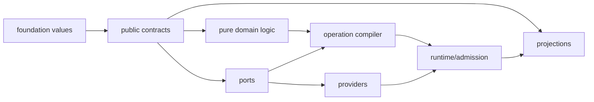

# 实现实体、边界与依赖

本文只拥有 Canonical Implementation Graph、ResponsibilityRealization、实现可见性、public surface 以及 package/facade/index 的存在证明。逻辑实体与 Domain 边界来自上游；path、目录与文件名只在 Placement 中出现。

## 1. Canonical Implementation Graph

目标设计与当前观察使用相同的节点/关系语言，但必须是不同 generation：

```text
ImplementationGraph =
  | TargetImplementationGraph {
      targetDesignArtifactRef,
      recursivelySortedScopeArtifactRefs,
      responsibilityRealizationRefs,
      implementationUnitRefs,
      boundaryBindingAndRelationRefs,
      boundaryProofRefs, frontierRefs,
      graphDigest
    }
  | ObservedImplementationGraph {
      sourceObservationGenerationRef,
      observedImplementationUnitRefs,
      observedRelationRefs,
      coverage, unknownRefs,
      graphDigest
    }
```

实现图只拥有realization与unit；Contract、Port、Provider、Store、External Subject和RuntimeEntity保持其上游或运行时identity，以`ContractRef/RequirementRef/ProvisionRef/BindingRef/RuntimeObservationRef`接入。`realizes/imports/exposes/invokes/reads/writes/persists/generatedFrom`是Design Calculus relation的implementation specializations，不形成第二edge ontology；`requires/binds/allocates/grants/settles/proves`直接引用系统关系。

每条关系携带source/target identity、visibility、generation、applicable constraints与provenance。语言特有declaration、symbol、import和call先由Source Program观察，再投影为这些通用关系；不能让正则、路径或package名直接写图。目标图不得包含live attempt/allocation/settlement，观察图只能引用runtime observation，不能把运行实例提升为target node。

目标图只含 accepted realization；观察图只含 exact current facts。二者唯一合法连接是 Reconciliation：

```text
ReconciliationRelation =
  | matched {
      nonempty targetRefs, nonempty observedRefs,
      semanticOriginBindingRef, coverageAndPreservedClaimRefs
    }
  | missing { nonempty targetRefs, obligationRefs }
  | surplus { nonempty observedRefs, consumerAndRetirementCensusRef }
  | drift {
      nonempty targetRefs, nonempty observedRefs,
      semanticOriginBindingRef, violatedConstraintRefs
    }
  | unresolved { refs, unknownRef, closurePredicateRef }
```

Reconciliation relation是typed hyperedge。split、merge、aggregate与decomposition必须携带coverage、overlap与information-loss proof；不得把文件、symbol或数组位置的一对一对应写成默认模型。

## 2. Responsibility realization

`ResponsibilityScope` 是逻辑责任；`ResponsibilityAssignment` 绑定决策权；`ResponsibilityRealization` 是二者在一个 exact Target/Profile generation 下的派生实现投影。三者不能合并，realization 也不是新的语义身份、owner、固定层、module 模板或目录：

```text
ResponsibilityRealization = exact derived {
  realizationRef,
  responsibilityScopeRef,
  responsibilityAssignmentRef,
  targetDesignGenerationRef,
  applicableFacetRefs,
  governedDecisionRefs,
  implementationFreedomEnvelopeRef,
  implementationUnitRefs,
  publicContractAndPortRefs,
  childRealizationRefs,
  observableAndConformanceRefs,
  frontierRefs,
  realizationDigest
}
```

`ImplementationUnit`是generation-bound实现carrier，不是semantic identity：

```text
ImplementationUnit = exact derived {
  implementationUnitRef,
  responsibilityRealizationRef,
  semanticOriginRefs,
  representationProfileRef,
  implementationRegionRef,
  declaration/content/artifact refs,
  roleRelationRefs,
  visibility,
  placementDecisionRef,
  generationRef,
  unitDigest
}
```

它统一承载source、schema、config、manifest、template、asset、generated output及其他target representation；具体role由typed relations表达，不为每种文件建根类型。process/container/handle是RuntimeEntity或resource Attempt，不是ImplementationUnit。Projection与Verification adapter是unit承担的role，不是独立node identity；generated status来自`generatedFrom`relation，不是第二对象层。

递归关系来自 `ResponsibilityScope` 的 parent/child containment，realization 只投影该关系，不再创造一棵实现层责任树。一个 realization 可由多个高内聚ImplementationUnits实现；一个unit不能承载互不相干的ResponsibilityScopes。只有下式成立才增加unit边界：

```text
ImplementationUnitPartitionRequired =
  sameResponsibilityScope
  and (languageOrCompilationBoundary
       or privateChangeCohesion
       or trustRuntimeReleaseBoundary)
  and reducedChangeFailureOrResourceCoupling
  and addedBoundaryCost < avoidedLifecycleCost
```

若候选部分拥有独立 invariant、public demand 或 lifecycle，先回到逻辑层裁决是否需要 child ResponsibilityScope；实现层不能用拆文件替代语义建模。其余情况只使用普通函数、value或aggregate。行数、作者人数、文件夹对称、测试数和“未来可能复用”都不能单独产生scope、realization或ImplementationUnit。

每个 realization 按实际义务选择实现角色，不机械创建层：

| role | 必要时包含 | 禁止 |
| --- | --- | --- |
| contract | identity、exact values、strict parser、public result/failure algebra | runtime、Provider、Effect |
| pure decision logic | invariant、pure decision/transition | ambient observation、write |
| operation | requirement DAG、effect plan、readback/recovery/result mapping | 自选 Provider、自签 Authority |
| port | capability requirement、typed settlement ceiling | 具体工具、PATH、credential |
| provider | Provision、physical execution、settlement | 业务结果、policy |
| runtime | allocation、attempt、journal、terminal recovery | 新 Definition |
| projection | public query/result 到 CLI/API/IDE/docs 的映射 | 重算 owner fact |
| verification adapter | Claim 所需 observation 的测试/检查入口 | 私有实现文本作 oracle |

没有内容的角色不物化；禁止空目录、空 `index`、逐文件 facade 和为了“整齐”建立的 boilerplate。

## 3. 依赖与组合

静态 dependency graph 与运行时 composition graph 分离：



允许的静态方向由 target graph 生成，不以手写路径 allowlist 固化。核心约束：

1. contract 只依赖更基础的 value/grammar，不导入 compiler、provider、runtime、projection 或 test；
2. compiler 消费 contract/definitions 并产生 immutable graph/artifact refs；contract 和 index 不能反向导入 compiler 输出；
3. operation 只声明 Port/Requirement，不导入具体 Provider；
4. Provider 实现 Port，不解释 DomainResult；
5. projection 只读取 public contract/result，不读 private state、journal 或 process；
6. runtime composition 只通过 opaque capabilities 和 immutable refs；callback/service locator/global singleton 不形成隐藏边。

静态图必须是 DAG。若多个 realizations 在运行时相互调用，workflow 必须把循环表示成显式 state machine、bounded feedback 或 SCC protocol；不能以 import cycle 承载。发现 cycle 时的修复顺序是：识别被双方真正共享的 semantic contract → 将该合同归唯一更低 ResponsibilityScope → 两侧只依赖合同；禁止复制 type、造 `common` 包或用 facade 隐藏反向边。

## 4. Public surface

public 不是 `export` 的同义词。每项 public surface 必须由真实 demand 证明：

```text
PublicDemand = exact {
  consumerOrExternalContractRef,
  requiredSemanticOperationOrValueRef,
  supportedLifecycleAndCompatibilityRef,
  disclosureAndAuthorityCeilingRef
}

PublicSurface = least set satisfying all active PublicDemand
```

只有 public contract、operation/query/result 和明确 extension port 可跨 ResponsibilityScope；内部 algorithm、store schema primitive、journal、Provider handle、compiler helper 与 test seam 默认 private。动态 import、reflection、CLI string、workflow、config 和外部 consumer 均由 Source Program/contract evidence计入 demand，无法判定时保留 bounded unknown。

## 5. Contract、Facade 与 Index

三者不是层级模板：

| construct | 唯一合法作用 | 何时不存在 |
| --- | --- | --- |
| contract | 拥有 public semantic grammar、parser、result/failure；可被 producer/consumer 独立引用 | 没有独立 consumer、durable/external boundary 或 revision语义 |
| facade | 将多个已存在 public contracts 投影成一个稳定 consumer boundary；不新增 identity/field/policy | 单纯缩短 import、保留旧路径、转发一个 symbol、掩盖 cycle |
| index | 从 owner graph 生成 navigation/export projection | 手写清单、拥有常量/type、参与 runtime resolver、只有一个 child |

```text
FacadeAdmitted =
  activePublicDemandCount > 0
  and facadeReducesConsumerCoupling
  and noNewSemanticIdentity
  and noReverseDependency
  and noHiddenCompatibilityGeneration
  and removalWouldMeasurablyWorsenCorrectChangeCost
```

`contract → compiler → generated graph/index` 是单向链。generated index 可引用 contract identity，contract 绝不能读取 index、compiler registry 或 compiled graph。否则 schema/owner 会被自己的投影定义，形成自证环。需要双向查询时，由独立 query compiler 消费两端 immutable refs并返回新 projection；不在任一 owner 中加反向 import。

## 6. Package 与物理边界

ResponsibilityScope、ResponsibilityRealization、package、文件、进程和部署均非一一对应。只有存在独立发布、语言/ABI、security sandbox、failure isolation、资源结算、支持窗口或实测构建成本收益时才建立 package：

```text
PackageBoundaryProof = exact {
  containedRealizationRefs,
  publicDemandAndEntrypointRefs,
  independentLifecycleReasonRefs,
  dependencyAndCycleResultRefs,
  buildRuntimeSecurityCostVector,
  rejectedAlternativeRefs,
  reversalPredicateRefs
}
```

物理 placement 由 [Placement and Locality](placement-and-locality.md) 编译；process/container/resource 由 [执行运行时与物化](execution-and-materialization.md) 处理。`Domain ≠ ResponsibilityScope ≠ ResponsibilityRealization ≠ package ≠ directory ≠ process`。

## 7. Extension

Extension是public contract/port上允许新candidate、frontend、backend或Provider加入的关系视图，不是独立object hierarchy。language frontend贡献observations/coverage，target backend贡献lowering，Provider贡献Provision/settlement，业务扩展贡献accepted Definitions/public operations。扩展不得注册global owner、mutable singleton、Authority issuer或任意callback。若加入一种扩展必须修改多个core switch，结果是`meta-model-insufficient | boundary-wrong | cross-domain-feature`，需回到上游重算。

现行`capability.typed-extension` authority key只约束该迁移边界：target publication后其meaning由PublicContract/Port/ImplementationCandidate/Conformance relations完整承载，旧key consumer-zero即退役；不得据此恢复`TypedExtension` type、registry或runtime。

## 8. 完成

```text
ImplementationGraphClosed =
  every realization traces to exactly one responsibility scope and assignment
  and every ImplementationUnit traces to exactly one realization
  and every cross-responsibility edge terminates at an admitted public contract or port
  and the static graph is acyclic
  and every public symbol has live demand or an accepted external/future obligation
  and every contract/facade/index/package has an existence proof
  and target and observed generations never share mutable ownership
  and every unknown has an affected closure
```

<!-- sec-clause {"blocker":null,"kind":"stable-decision"} -->
## 规范片段

SEC 的逻辑责任递归存在于 ResponsibilityScope；实现层只保存由 scope、assignment、target 与适用决策编译出的 ResponsibilityRealization。contract、facade、index、package 和物理目录只有通过存在证明才出现；compiler graph只能由合同单向生成，任何反向 import、镜像类型或手写 index 都是边界错误。
