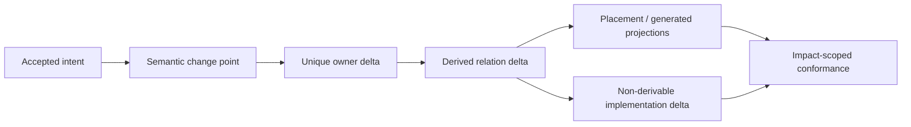

# 实现 Placement 与变更局部性

本文拥有logical carrier到ImplementationUnit/source/package address的placement decision，以及authored change locality。它不拥有Domain边界、source observation、target lowering、package manager或实际文件迁移。

## 1. Corpus 与 workspace 边界

```text
ImplementationCorpus =
  | ProductAuthoredSourceCorpus {
      authoredCorpusRef,
      nonempty authoredSourceRootBindingRefs,
      exact generation ref
    }
  | TargetWorkspaceCorpus { ProjectBindingRef, WorkspaceContentViewRef }
  | GeneratedCorpus { generator/package ref, target manifest ref }
  | OpaqueExternalCorpus { provider/binding/coverage ref }
```

每个产品profile只有一个逻辑authored corpus与一个Source Program truth，但可因repository、language、package、security或filesystem边界证明而绑定多个physical roots。SEC self-hosting profile当前把其主要Address绑定到`src/`，但`src/`不是通用模型常量或semantic identity。目标workspace是用户在IDE中开发的工程实例，不复制进SEC authored corpus；`Project`只在有独立业务identity时存在，不能作为workspace或源码的泛称。

Path只属于Address。Workspace move、worktree、editor overlay或generated overlay改变ContentView/Address revision，不改变Project/Subject identity。

## 2. Responsibility-first placement

```text
place(ImplementationUnit) = f(
  responsibilityScope and realization,
  dependency layer and visibility,
  state/effect/recovery closure,
  trust and lifecycle boundary,
  runtime/release/package boundary,
  co-change and consumer graph,
  authored/generated/opaque role
)
```

```text
PlacementDecision = exact {
  implementationUnitRef,
  responsibilityScopeRef,
  responsibilityRealizationRef,
  semanticOriginRefs,
  role,
  visibility,
  packagePlacement,
  logicalAddress,
  allowedDependencyBoundaryRefs,
  generationKind,
  colocatedVerificationClaimRefs,
  migrationObligationRefs,
  decisionDigest
}

PackagePlacement =
  | SameProductPackage { packageRef }
  | IndependentPackage {
      packageRef,
      release/deployment/security/runtime/toolchain boundary decision ref
    }
```

Default是一个产品package内按ResponsibilityRealization高内聚组织；只有独立发布、部署、runtime、security、toolchain或external support boundary证明收益时才拆package。Domain数量、团队、目录美观、文件长度和工具品牌都不是package理由。

Realization内部按semantic subject/operation命名ImplementationUnit。只有上游已证明独立ResponsibilityScope，或实现层显著private co-change/compilation子图需要unit partition时才增加层次；后者不创造semantic scope。禁止空目录、逐目录`index`、root barrel、`common/shared/utils`和路径镜像测试。

## 3. Boundary cost

```text
PlacementCost =
  authoredOwnerCount
  + duplicatedMeaning
  + privateCrossBoundaryEdges
  + contextReadCost
  + invalidatedFactShards
  + verificationImpact
  + release/runtime coupling
  + migration/retirement cost
  + residual unknown risk
```

候选必须先满足owner、dependency、state/authority/security/lifecycle硬约束，再做Pareto裁决。文件少但混合owner/Effect/state不是优化；文件多但只有转发/re-export也不是模块化。

## 4. Change Locality Compiler

目标是最少修改不可推导的authored facts，不是最少文件：



```text
compileChangeLocality(intent, model):
  semanticDelta := resolveAcceptedChangePoint(intent)
  owners := irreducibleOwners(semanticDelta)
  authored := minimalNonDerivableDelta(owners, semanticDelta)
  derived := regenerateAllDependentProjections(model + authored)
  impact := reverseReachableImpact(authored + derived)
  reject duplicate facts, handwritten mirrors, unexplained fanout and private cross-responsibility edges
  return pure ChangePlan(authored, derived, impact, migration/proof obligations)
```

常规单责任变更的`TouchedOwners = 1`。真实跨owner outcome必须由ChangeTransaction绑定各owner precondition、order、rollback/forward recovery和readback；“每个文件一行”不是原子性。

## 5. Semantic origin before variable

跨public、durable、process、configuration、state、Effect或Proof边界的每个field/constant/schema/index必须满足：

```text
ImplementationValueOrigin =
  | LoweredFromAcceptedSemanticCarrier { semanticOriginRef, loweringRef }
  | ObservedAndOwnerAdopted { observationRef, adoptionDecisionRef }
  | ImplementationLocalFreedom { freedomEnvelopeRef }
```

Name、path、type、test和邻近代码不能事后决定变量意义或owner。无法反查origin的值是`implementation-semantic-surplus`；若会改变public behavior/state/Effect/authority/resource/failure/evolution，必须回到上游设计，不能在实现中合理化。

可由owner fact派生的schema version、path、exports、tests、docs与config必须生成；不可推导的实现选择必须落在ImplementationFreedomEnvelope或owner Decision，不得散成hardcoded literals。

## 6. Imports 与 move

Placement Compiler从同一decision graph生成symbol-level logical addresses、package exports、import map、ownership、test impact和docs navigation。Move compiler使用语言Compiler API/Source Program重写definition/reference/re-export/config关系并验证graph equivalence；人或Agent不维护长相对路径、alias清单和字符串替换。

```text
MoveClosed =
  same semantic identities and public contracts
  and all static/dynamic/config/test/doc consumers rewritten from exact graph
  and old address consumer-zero
  and generated projections/readback match target placement
  and no compatibility alias unless an external support window requires it
```

## 7. Completion

```text
PlacementClosed =
  every ImplementationUnit traces to one ResponsibilityRealization/Assignment and semantic origin
  and every public surface has real demand
  and every package boundary has independent lifecycle reason
  and dependency direction is acyclic across realizations
  and all derived path/import/export/test/doc projections have one source
  and every authored fanout is irreducible or rejected
  and moves preserve identity with old-address consumer-zero
```

<!-- sec-clause {"blocker":null,"kind":"stable-decision"} -->
## 规范片段

Implementation placement由Responsibility、visibility、state/effect/lifecycle、trust、package boundary和co-change graph编译；path不是identity。正确变更只修改最小不可推导owner facts，其余地址/import/export/test/docs由同一graph派生，跨owner变化必须由显式transaction闭合。
