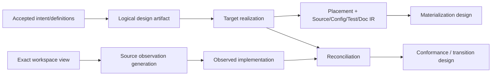

# Source、Placement 与 Generation

本文是implementation source/generation入口，不再同时拥有三个独立责任：

- [Placement and Locality](placement-and-locality.md)：`src/`/Target workspace边界、ImplementationUnit/package placement、semantic origin与最小authored delta；
- [Target, Observation and Round Trip](target-observation-and-roundtrip.md)：正向target synthesis、反向current reconstruction、reconciliation、governed-authored与self-hosting；
- [Source Observation and Incrementality](source-observation-and-incrementality.md)：WorkspaceContentView、Source Program、fact shards、TypeScript route与cold/warm/delta成本。

## 1. 唯一总链



每个箭头只有一个writer和closed input/output grammar。Target不读取current implementation决定愿望；Observation不采用target；Reconciliation不回写任一输入；Placement不创造semantic identity；Materialization不执行Effect。

## 2. Source ownership

| source | owner | rules |
| --- | --- | --- |
| product first-party implementation | one logical authored corpus with profile-bound physical roots | all declarations trace to semantic origin、ResponsibilityScope与ResponsibilityRealization；SEC self-hosting profile currently binds its primary Address to `src/` |
| target workspace | explicit ProjectBinding + WorkspaceContentView | remains in user workspace; path is Address only |
| deterministic generated | compiler + exact target IR | edit upstream only; canonical byte readback |
| governed authored | responsibility owner + freedom envelope | candidate re-enters Source Program/reconciliation/conformance |
| opaque external | external Provider binding | no silent edit/interpretation beyond coverage |

`source`作为语义角色不等于目录名。SEC自身authored implementation统一在`src/`；用户目标工程的源码是Target workspace content，不迁入SEC仓库。

## 3. Local change and full product preservation

正确局部变更只修改不可推导的minimum owner facts；所有path/import/export/config/test/doc projections从同一graph再生。与此同时，任何target/current transition必须保留用户已接受的全部现有能力和FutureObligations，或由有权Product decision明确retire；局部性不能以丢业务换取。

```text
ImplementationChangeClosed =
  minimal irreducible authored owner delta
  and all derived fanout generated
  and exact current/target reconciliation
  and no accepted capability silently lost
  and no current surplus silently preserved
  and conformance/evolution obligations complete
```

## 4. Tools

Compiler API、Language Service、AST tools、semantic scanners、codemods、build orchestrators和AI都是Capability Providers。优先复用成熟机制，但只在其真实Requirement、identity、security、resource、failure与retirement闭包下绑定；不为每个工具建wrapper、第二graph或品牌分支。

## 5. Completion

```text
SourceAndGenerationDesignClosed =
  PlacementClosed
  and TargetObservationRoundTripClosed
  and SourceObservationClosed
  and every generated/authored/opaque region has exactly one owner
  and every source/config/test/doc artifact traces to accepted semantic origin
  and every target product can be rebuilt, observed, reconciled and evolved
```

<!-- sec-clause {"blocker":null,"kind":"stable-decision"} -->
## 规范片段

每个产品profile只维护一个逻辑authored source corpus和一个跨consumer Source Program truth；可有多个经证明的physical root bindings，具体root是Address而不是通用identity。Placement、target synthesis、current observation与reconciliation是独立单向compiler responsibilities；正确局部变更与完整业务能力保真必须同时成立。
