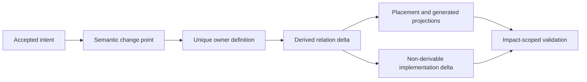
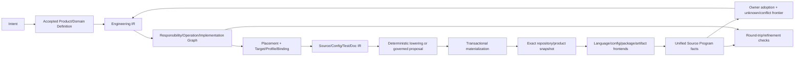
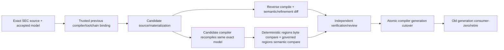
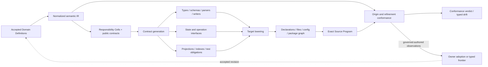
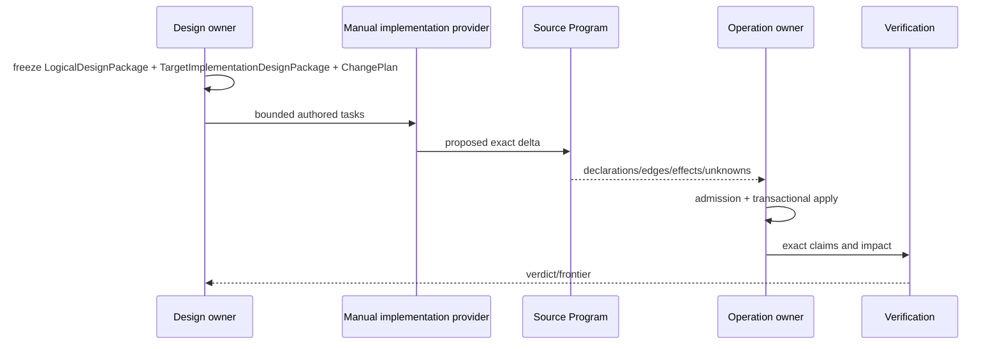
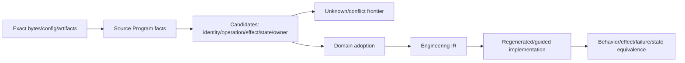

# 源码放置、变更局部性与意图生成

本片段拥有 Placement、Change Locality、双向 Semantic Compiler、受控手写模式与 Brownfield round trip。

本片段与 [owner root](../implementation-architecture.md) 共享同一 domain，但只拥有 registry 分配给本片段的 ownership keys；跨片段语义使用引用，不复制定义。

## 5. Placement Compiler：从语义图推导源码组织

### 5.1 唯一 authored source root

| Root | 语义 |
| --- | --- |
| `src/**` | SEC全部authored machine input：production code、owner-local verification、cross-domain scenarios、CLI/dev operations、contracts与随owner演进的resources；唯一authored source root |
| `docs/**` | stable definitions/decisions 和 generated navigation；无 runtime truth |
| ecosystem-mandated root files | 外部工具无法迁入`src`的最小bootstrap/config；优先从owner contract生成且不得复制业务语义 |
| Runtime State | durable operation/recovery state；不进入 Git authored source |
| Cache | 可删除、可重算、有限额的 acceleration facts |
| Artifacts | exact published result/Evidence；不作为 mutable truth |

所有SEC authored machine input只有一个`src/`根；工具入口、开发流程、测试场景和owner-governed resources也按真实Responsibility放置。其他顶层位置只能承载文档、生态强制bootstrap或非源码运行产物，不能形成第二源码图。路径不能编码semantic identity。

### 5.2 Cell-first layout

示意路径不是固定模板：

```text
src/<domain>/<responsibility-cell>/
  <semantic-subject or operation named code units>
  <owner-local *.test.* beside the observed public boundary>
  <owner-governed non-code inputs only when inseparable from the cell>
```

目录层级由cohesion与可读性成本触发，不按`contract/domain/application/infrastructure`机械复制。小cell直接平铺subject-named units；只有独立public surface、state/effect lifecycle或显著co-change子图存在时才增加一层。禁止空目录、root barrel、逐目录`index.ts`、`common/shared/utils`以及以工具品牌建owner。

一个Responsibility Cell可以物理容纳多个正交typed relations，只要它们共享owner、trust、atomic consistency、lifecycle并强共变；不得把逻辑模型中的每个node/edge机械变成文件、class、service或database table。相反，任何独立Authority、state machine、version/evolution或外部consumer都不能为了“少文件”埋进同一实现对象。Placement Compiler同时计算boundary-collapse cost与over-factoring/join/context cost，选择满足语义边界的最小物理单元。

跨cell引用使用由PlacementDecision生成的short semantic import address；Language Service和symbol-aware move compiler维护definition/reference/export/config/test关系。开发者不手写相对路径链、path alias清单或exports镜像。public surface由真实consumer demand生成最小named entry；没有external/package boundary时直接引用该public declaration，不为“统一入口”制造facade。

package只在独立发布、部署、runtime、security、toolchain或真实external version boundary成立时创建；默认是一个产品package内的多个Responsibility Cells。system/e2e/property/fault场景归`src/verification/system-scenarios/`这一真实verification responsibility，而不是按被测源码目录镜像。

### 5.3 Placement function

```text
place(codeUnit) = f(
  responsibilityCell,
  dependencyLayer,
  visibility,
  stateAndEffectClosure,
  lifecycleAndRecovery,
  runtimePackaging,
  coChangeGraph,
  authoredGeneratedOpaque
)
```

Placement 输出：

```text
PlacementDecision {
  codeUnitId
  ownerCellId
  role
  visibility
  packageBoundary?
  logicalAddress
  allowedDependencyCells
  generationKind
  colocatedVerificationClaims
  migrationObligations
  evidenceDigest
}
```

源码路径由 PlacementDecision 生成；import alias、package export、test selection、ownership、architecture boundary 与文档导航均从同一 decision graph 投影，禁止手写路径镜像。

## 6. Change Locality Compiler

目标不是最少修改文件，而是最少修改**不可推导的 authored facts**。



```text
AuthoredDelta = MinimalOwnerDefinitionDelta + NonDerivableImplementationDelta
DerivedDelta  = regenerate(accepted owner graph, exact Source Program)
TouchedOwners = irreducibleOwners(AuthoredDelta)
```

常规单责任语义变化的 `TouchedOwners = 1`。多 owner 只在同一 accepted intent 跨越不可合并的真实责任时成立，并必须由一个 ChangeTransaction 绑定各 owner 的 precondition、apply order、rollback/forward recovery 和 readback；“每处改一行”不是 transaction。

### 6.1 局部性成本

不使用固定评分阈值；比较候选方案的 Pareto 关系：

```text
LifecycleCost =
  authoredOwnerCount
  + authoredFactDuplication
  + nonDerivedFileFanout
  + contextReadBytes
  + invalidatedFactShards
  + verificationClosure
  + migrationAndRetirementCost
  + residualUnknownRisk
```

如果方案 B 在所有维度不差且至少一项更优，方案 A 被支配并删除。低文件数但引入第二 owner、隐藏字符串源码或失去 readback 的方案不构成优化。

### 6.2 扇出根治规则

| 观察 | 根因分类 | 目标表达 |
| --- | --- | --- |
| 多文件重复版本/Schema 字面 | canonical contract 未被引用 | owner literal type + strict parser；projection generated |
| 多测试复制路径/列表/计数 | Source Program/owner graph 被手写镜像 | relation/property assertion + derived fixture |
| 多 CLI 复制字段 | projection 没有 command-specific contract | named projection compiler |
| import move 修改全仓 | placement/import graph 非生成 | symbol-aware move plan + generated aliases/config |
| 多 Provider 重复 deadline/env | operation/resource contract 未下沉 | shared opaque operation session |
| 多文档重复原则 | owner/projection 混淆 | canonical clause refs + generated navigation/context |
| 多处 `if platform/version` | Target/Profile/Binding 泄漏 | Resolution/Binding compiler + provider conformance |

### 6.3 Locality admission

```text
compileChangeLocality(intent, graph):
  semanticDelta := resolveAcceptedChangePoint(intent)
  owners := irreducibleSemanticOwners(semanticDelta)
  authored := computeNonDerivableDelta(owners, semanticDelta)
  derived := compileAllProjections(graph + authored)
  impact := computeFactAndBindingImpact(graph, authored, derived)
  reject duplicate facts, handwritten projections, unexplained fanout
  return ChangePlan(authored, derived, impact, migration, proof)
```

任何未解释的 authored 多点修改、同一 literal 多 owner 变化、跨 cell private import 或新增 facade 都产生 typed `change-locality-unresolved`，不允许用测试绿色消除。

## 7. 双向 Semantic Compiler：Intent-to-Product 与 Repository-to-Model

自动生成产品的权威链不是自然语言→补丁，而是 accepted intent→可验证语义→implementation binding→target lowering；任意既有仓库的反编译链则是 exact bytes→语言事实→统一 Source Program→candidate semantics/unknown→owner adoption。两条链共享一个 Engineering/Implementation graph，在 round trip 处互相校验，不能形成两套模型。



`SourceProgram`是exact snapshot的语言无关语义观察；SEC authored machine input物理根统一为`src/`，任意Target workspace则按其retained snapshot与language frontend读取。目录名永远只属于Address/Placement。

### 7.1 Intent contract

```text
Intent {
  desiredOutcomes
  explicitNonGoals
  preservedCapabilities
  acceptedTradeoffs
  targetSubjects
  constraints
  uncertainty
}
```

Intent 不含 path、provider、implementation、test count、version label 或 Effect permission。自然语言解析只产生 proposal 与 ambiguity frontier；只有 Product/Domain owner 的 accepted Definition 才进入编译。

机器负责所有由已知 inputs、relations、constraints 和 policies 可决定的结论；只有在多个非支配终局之间仍缺少授权偏好时，才请求 Product/Domain decider 提供新的 choice input。人工不能替代可计算的 owner、impact、placement、provider eligibility、resource、test selection 或 retirement 判断。

### 7.2 三种实现类别

| Kind | 来源 | 修改方式 | Authority |
| --- | --- | --- | --- |
| deterministic-generated | 完整 IR + Target/Profile/Binding 可确定 bytes | 只改上游 owner并重编；禁止手改 | compiler receipt |
| governed-authored | 当前算法不能从规范唯一确定，但可验证责任/合同 | ChangePlan 约束下由人/Agent/工具提出 patch | accepted plan + exact readback |
| opaque-external | 外部库、binary、远端服务、未知/不可读内容 | provider adoption、upgrade、replace 或 typed opaque | external capability contract |

`governed-authored` 不是永久例外：每次手写中可稳定推导的事实进入 IR/compiler，不能推导的部分保持最小并记录 FutureObligation。`opaque-external` 不能被代码生成器静默编辑或把 presentation 当 protocol。

### 7.3 Compilation products

编译输入不是一个所有字段可选的“超级模型”，而是同一 exact universe 中多个 owner snapshot 的引用闭包：

```text
SemanticCompilationInput {
  acceptedProductDefinitionRefs
  validatedEngineeringSnapshotRef
  domainContractAndWorkflowRefs
  targetProfileRef
  implementationCatalogAndPolicyRefs
  exactRepositoryOrEmptyWorkspaceSnapshotRef
  provider/resource/environmentFactRefs
  evolutionAndSupportObligationRefs
}
```

每层只新增它拥有的语义，并保存到上游 source refs 的双向 provenance：

| IR / artifact | 新增内容 | 不得补写 |
| --- | --- | --- |
| Engineering IR | accepted entities/facts/responsibilities/invariants | source syntax、candidate implementation |
| Application/Behavior IR | target-neutral components、state、data/control/effect semantics | framework、package、path |
| Requirement/Candidate/Decision/Binding graph | hard requirements、完整候选闭包、选择理由、exact realization | 产品语义、Compatibility结论 |
| Target Program IR | package/module/declaration/statement/resource/config ownership | live filesystem、Provider discovery |
| Source/Config/Test/Doc IR | canonical target-language AST、package/config/artifact/test/projection plans | Effect执行、手工字节 |
| ProductMaterialization plan | exact bytes/digests、writer/readback/migration/verification obligations | completion或Support Claim |

```text
IntentCompilation {
  acceptedDefinitionRefs
  semanticDelta
  preservedCapabilityClaims
  futureObligations
  responsibilityDelta
  operationDelta
  implementationBindings
  placementDecisions
  generatedArtifacts
  governedAuthoredTasks
  opaqueBoundaries
  impactAndMigration
  verificationClaims
  exactUnknownFrontier
}
```

当输入是既有工程时，编译器必须证明target realization覆盖该工程仍被Product owner接受的能力与future obligations，并逐项产生`preserved | superseded-by-better | rejected-with-product-decision | unknown`。代码、测试或文档存在本身不证明capability conservation。

### 7.4 AI 与工具角色

AI、Compiler API、LSP、ast-grep、semgrep、codemod、Nx/Bazel 等只可成为阶段 Provider：

- compiler/type checker 拥有语言语义；
- LSP 拥有编辑期增量导航；
- AST/codemod 执行已批准的 symbol-aware transformation；
- build orchestrator 执行 Requirement DAG 和 cache，不拥有业务 DAG；
- AI 提议不可唯一 lower 的 governed-authored delta；
- domain owner + operation admission + readback 决定是否接受。

不得为每个工具建立镜像 wrapper 或第二 graph；工具变化只改变 Provider Binding，不改变上游 Definition。

### 7.5 成品编译与收敛条件

“从语义编译成源代码成品”的输出不是孤立source files，而是满足install、execute、verify与evolve合同的`ProductMaterialization`：

```text
ProductMaterialization =
  repository source/config/package graph
  + generated public interfaces and projections
  + build/runtime/deployment bindings
  + migrations and durable schemas
  + behavior/effect/failure/recovery tests
  + supply-chain/provider/resource obligations
  + exact readback and retirement receipts
```

Target backend 只负责将 typed Source/Target IR lower 为具体语言、框架、配置和包布局；它不能决定产品语义。SEC 自身源码和用户 workspace 共用上游 Engineering IR/Requirement/Claim/Effect 模型，但通过不同 `TargetProfile` 与 backend 输出：SEC self-hosted implementation 由本文件约束，用户工程 Target Program/Backend 的具体语义由 `docs/compiler-target-ir.md` 拥有。新增语言或框架只新增 frontend/backend Provision 和 conformance facts，不复制 Domain、Workflow、ActionKey 或 verification graph。

```text
SemanticCompilationFixedPoint(snapshot, acceptedModel) iff
  decompile(snapshot).adoptedGraph == acceptedModel.implementationGraph
  ∧ type/build/publicBehavior(snapshot) refines accepted contracts
  ∧ effects/state/failure/recovery traces satisfy obligations
  ∧ generated bytes equal canonical lowering where deterministic
  ∧ governed-authored regions contain no unexplained semantic surplus
  ∧ unknown frontier is empty or explicitly bounded away from requested Claim/Effect
```

达到 fixed point 前只能称 proposal、partial materialization 或 typed frontier，不能称“业务已写完”。未来编译器逐步缩小 governed-authored 区域；不确定算法实现仍可由 Agent/人提出，但必须经同一 reverse compile、semantic diff、transaction 和 readback，不形成旁路。

### 7.6 Self-hosting 与 compiler trust

SEC 最终用同一双向 Semantic Compiler治理自身，但 self-hosting 不能变成 candidate compiler 自证：



- bootstrap seed只拥有启动所需的最小 compiler/toolchain capability identity，不拥有当前产品 Definition；seed、source、config、dependency、Target/Profile、frontend/backend和environment共同进入 ActionKey；
- candidate compiler只能产出 proposal/materialization和自举观察，不能签发自己的admission、Evidence verdict或cutover；
- deterministic-generated区域要求同输入byte-equivalent；governed-authored与opaque区域要求Source Program、public behavior、Effect/failure/state/refinement等价，不能强求偶然字节相同；
- compiler/frontend/backend变化产生新generation；正常路径只消费一个active generation，旧generation只在bounded migration/rollback窗口可读并在consumer-zero后退役；
- 若trusted previous compiler缺失或无法解析新meta-model，进入explicit bootstrap/migration authority流程，不能由candidate放宽parser或保留永久双编译。

这条链同时适用于SEC自身仓库与用户workspace；区别仅是Product/Domain definitions、TargetProfile、authority和publication owner，不复制compiler core。

### 7.7 Pass graph：从定义到完整工程成品

每个pass只有一个输入grammar、一个输出grammar和一个validation boundary；不能传递可选字段大包，也不能在后续pass补造上游语义：

#### 7.7.1 语义原点闭包：变量不参与架构裁决

跨public、durable、process、configuration、state、Effect或Proof边界的实现内容必须由accepted semantic source正向lower，或由Source Program反向证明与该source一致；不得先写变量、字段、常量、schema、index或路径，再靠名字/目录/人工表格猜归属。



```text
BoundaryImplementation =
  | DeterministicLowering { semanticOriginRef, compilerRef, outputRef }
  | GovernedAuthoredRealization {
      kind: algorithm | content | configuration | template,
      contractRef, responsibilityCellRef, conformanceRef
    }
  | ExternalProvisionBinding { requirementRef, provisionRef, bindingRef }

LexicalValue = private implementation detail of one ResponsibilityCell
```

```text
LexicalOnly(v) iff
  no independent semantic identity, consumer, authority, lifecycle or invalidation
  ∧ every observable change caused by v remains inside an accepted contract equivalence class
```

值不以“变量/常量/字段/配置”分类；这些只是表示。角色约束的是某个boundary上的`ValueOccurrence`，不是给semantic Subject永久贴一个标签。同一Subject可经明确relation产生state、observation、derived或representation occurrences；每个occurrence只能有一个role，角色转换必须可追溯：

```text
ValueRole =
  | DefinitionValue      // accepted business/domain meaning or invariant
  | PolicyParameter      // owner-issued decision input with alternatives/reversal
  | OperationInput       // request-scoped desired value; no authority by itself
  | DerivedValue         // pure function of exact refs + algorithm revision
  | ObservationValue     // measured/read value + method/coverage/uncertainty
  | StateValue           // state-machine-owned durable or live state
  | CapabilityValue      // opaque provision/grant/allocation handle; non-serializable authority
  | RepresentationValue  // schema/encoding/target projection of another role
  | LexicalValue         // private implementation detail inside one accepted equivalence class

ValueOriginTrace = {
  valueOccurrenceRef,
  semanticSubjectRef,
  role,
  ownerOrProducerRef,
  predecessorOccurrenceAndRelationRefs,
  exactInputRefs,
  consumerBoundaryRefs,
  authorityAndLifecycleRefs when applicable,
  representationAndAddressRefs,
  revisionOrObservationDigest
}

ValueRelation =
  | derivesFrom(inputOccurrenceRefs, algorithmRef)
  | observes(subjectOrStateRef, methodAndCoverageRef)
  | represents(sourceOccurrenceRef, schemaAndTargetRef)
  | transitionsFrom(previousStateOccurrenceRef, transitionRef)
  | bindsCapability(requirementRef, provisionAndGrantRefs)
```

| Role | 谁能改变 | 变化如何传播 | 禁止混淆 |
| --- | --- | --- | --- |
| DefinitionValue | Product/Domain owner的accepted revision | 重编logical→implementation→claims | 用当前实现、默认值或测试反向定义 |
| PolicyParameter | policy/decision owner | 重编eligible set/ranking与reverse consumers | scheduler/default/env暗定policy |
| OperationInput | caller request，经admission约束 | 只影响该OperationKey/plan | caller字段自签Grant/Provider |
| DerivedValue | canonical algorithm owner；输入变化触发重算 | 按derivation DAG精确失效 | 手写缓存/镜像变第二truth |
| ObservationValue | observation/provider owner | coverage/frontier决定可支持的Claim | observation冒充Definition或success |
| StateValue | state-machine owner | 仅合法transition/CAS/readback | 普通赋值、file exists、boolean代替状态 |
| CapabilityValue | issuer/provider/resource owner | bind/use/settle/expire；不得clone/serialize | DTO、path、function object冒充能力 |
| RepresentationValue | contract/backend owner；必须引用被表示occurrence | schema/target evolution与consumer migration | 字段名、Vn、path成为semantic identity；序列化descriptor冒充Capability |
| LexicalValue | owning CodeUnit | 不越过public/durable/effect/proof边界 | 为每个局部值建registry/owner |

若常量、分支、默认值或算法参数独立改变public behavior、state、Authority、Effect、resource、failure、compatibility或Claim，它不再是`LexicalValue`；Source Program必须把它投影为`implementation-semantic-surplus`，直到owner采用为某个非lexical role并补全origin/relation，或删除。名称、scope、`const`、private修饰符和“只是配置”都不能豁免。反之，局部临时量、循环索引和中间表达式若满足`LexicalOnly`，不得为追求可追踪性将其升格为系统实体。

除`LexicalValue`外的occurrence只有在对应public/durable/process/state/effect/proof contract声明后才可穿越该boundary；`CapabilityValue`只能以opaque live capability穿越允许的进程内边界，序列化时只能产生无Authority的descriptor occurrence；`RepresentationValue`不能新增上游语义或Authority。普通局部变量不是系统实体、没有独立owner记录。所谓“字段归谁”被消除为以下可计算查询，而不是新增一份per-variable registry：

| 查询 | 唯一答案来源 |
| --- | --- |
| 这个值表示什么 | `semanticOriginRef`指向的Domain Definition/State/Claim |
| 谁能改变它 | 对应StateMachine/DomainOperation与当前AuthorityGrant |
| 谁拥有编码与兼容 | 由public/durable contract生成的schema/parser/writer与Evolution合同 |
| 为什么出现在此文件/接口 | PlacementDecision + lowering trace |
| 谁消费、变化会失效什么 | Source Program references + compiled reverse dependency closure |
| 是手写还是生成 | `BoundaryImplementation` discriminant；不能由注释或路径推断 |

正向编译按semantic identity产生稳定refs；字段名、symbol名、文件名和序号只是Target backend可替换的Address/representation。一个语义fact可生成多个语言/协议投影，但它们只引用同一origin，不复制Definition。一个artifact可承载多个facts，但每项fact都有独立origin/refinement trace；不得用“文件owner”吞掉内部不同生命周期或权限。

确定性规则：

- contract可推导部分必须一次生成type、strict schema/parser、canonical writer、public export、consumer projection与test obligations；禁止分别手写再同步；
- 不可推导的算法、业务内容、配置或模板允许`GovernedAuthoredRealization`，但其输入输出、允许Effect、failure/recovery、resource与proof obligations仍由contract生成并由reverse compile验证；
- index/barrel/package exports从accepted public demand生成，不手写空facade或路径镜像；
- FutureObligation只保存在Product/Domain source，触发consumer出现后才lower实现，不用空代码预占未来；
- Brownfield lift只产生Observation/Candidate/Unknown；只有Domain owner adoption能建立新的semantic origin，现有名字、测试和调用量都不能自动升格；
- 任一boundary declaration缺少origin/refinement trace时返回`implementation-origin-unbound`；同一origin出现不等价active writers/parsers/resolvers时返回`implementation-origin-duplicated`；实现中出现semantic source未声明的state/Authority/Effect/failure时返回`implementation-semantic-surplus`。

字段概念变化必须先改semantic/contract source，再由影响闭包原子重生成writer、parser、consumer、projection与tests，最后退役旧generation。只改一个字符串、保留alias/双读或让测试冻结旧名字，都违反origin closure。

| Pass | Input | Output | 可并行/增量单位 | 禁止 |
| --- | --- | --- | --- | --- |
| Definition compile | accepted Product/Domain/Workflow/Policy refs | validated LogicalDesignPackage | independent Definitions | 读取源码迁就实现 |
| Universe capture | retained Target/SEC repository boundary | ContentSnapshot + classification frontier | content unit | 执行目标代码 |
| Frontend compile | content units + exact frontend/config bindings | typed fact shards | content/interpreter key | 正则替代语言语义 |
| Source Program link | fact shards + resolution closure | cross-file/language/package graph | affected SCC/subject | 第二imports/test graph |
| Semantic adoption | observations + owner Definitions | adopted semantic snapshot/frontier | independent claims | confidence自动升格 |
| Responsibility compile | semantics + consumer/effect/state relations | Cells、Owner DAG、public demand | affected owner closure | 路径决定owner |
| Resolution compile | Requirements + candidates + policy/Target facts | Decisions、Bindings | independent Requirement | first-found/ambient fallback |
| Change/Impact compile | exact before/after semantic+binding refs | Delta、Impact、Claim obligations | affected relation closure | changed files=impact |
| Target compile | Application/Behavior + exact Bindings | Target Program IR | package/module graph shard | backend重选实现 |
| Source/Test/Config/Doc lower | Target Program + backend/profile | typed AST/IR and canonical bytes | independent artifact | executable string template、手写projection |
| Operation compile | DesiredDelta + exact preimage + public contracts | Pure plans + readback/recovery obligations | independent DomainOperation | Effect、grant、live discovery |
| Materialize/verify/evolve | admitted plan + capabilities | exact state/artifact result + Verdict/evolution refs | Requirement DAG | producer自证、永久双写 |

Executable source只能由typed target-language AST/LST、verified codemod或governed-authored declaration产生；任意字符串内的可执行程序都必须被embedded-program frontend识别并进入同一Source Program。Formatter只处理presentation，不能成为semantic pass。Tests从Claim/Failure/Effect/Compatibility obligations生成选择与骨架；不可推导的业务scenario仍由Domain owner authored，但测试永远不是Definition owner。

### 7.8 增量、共享事实与性能


目标复杂度是`O(changed content + affected relation closure + required Effects)`，不是每个consumer各做`O(repository)`。为此：

- 一个exact snapshot只产生一个ContentSnapshot与SourceProgram generation；typecheck、architecture、audit、unused、duplicate、hardcode、test-impact、docs和Agent ReadPlan消费同一fact identities；
- TypeScript frontend由仓库锁定Compiler API/TypeChecker/Language Service拥有parse、symbol、alias、re-export与incremental Program语义；native checker可作为final typecheck execution Provider，但不能建立第二Program、第二project graph或fallback；
- editor/Agent循环复用long-lived language service和content-addressed fact shards；服务丢失时从canonical inputs clean rebuild，daemon memory不是真相；
- authoring diagnostics只失效受影响closure；正式type Evidence只在frozen exact source/config/dependency/compiler/environment ActionKey上执行一次，fresh PASS、fresh deterministic failure与authenticated in-flight分别reuse、reuse-failure与join；
- host级昂贵事实（例如ACL、toolchain physical identity）由native retained observation绑定host/subject/security epoch并跨进程验证；mutation、expiry或coverage变化精确失效，不能缓存path-only PASS；
- streaming observation在一次遍历中同时计算content digest、entry/byte/depth/resource accounting与fact inputs；不得为了预算或计数先全扫再读第二遍；
- cache-disabled clean、cold、warm、incremental和distributed execution对同一exact inputs产生byte/semantic-equivalent结果；性能Provider异常只退回同一clean algorithm。

“共享一个snapshot”必须物化为可消费的generation，而不是要求所有caller碰巧同时读到相同filesystem：

```text
WorkspaceContentView =
  retained base snapshot
  + exact authored worktree overlay
  + exact editor/IDE unsaved overlay
  + generated/opaque content bindings
  + frontend/config/provider generations

SourceObservationGeneration = {
  workspaceAndViewSubject,
  tenant/repository/access scope + security epoch,
  canonical content manifest + coverage,
  immutable content/fact shard refs,
  SourceProgram generation ref,
  reverse dependency index ref,
  producer/interpreter/config/environment closure,
  generation lifecycle + retention,
  unknown frontier,
  generation digest
}
```

Observation Host对一个exact `WorkspaceContentView`只签发一个`SourceObservationGeneration`。磁盘、Git index、worktree和未保存editor buffer是不同overlay source，必须以明确precedence和各自revision合成为view；任何consumer不得自行重读其中一个层并称为同一snapshot。watcher/editor event只使相关content key stale，不进入generation identity或canonical bytes；producer按bytes/readback建立新generation。跨进程consumer通过immutable generation descriptor与content-addressed shards attach；descriptor/shard access必须绑定tenant、repository、workspace与security epoch，不能用相同digest跨未授权边界推断或读取内容。长期Language Service可保留live handles和warm state，但丢失后只能从同一descriptor clean rebuild，不能从daemon memory补事实。

generation发布采用single-flight keyed by `workspace/tenant/security scope + exact view contents + frontend/config/provider closure`；joiner受自己的deadline约束且不能延长producer。相同key的并发producer必须产生byte-equivalent descriptor，否则返回`source-observation-nondeterministic`并隔离两者。最后一个consumer release后generation按retention policy回收；active Action、Evidence或migration引用仍在时不得清理。这样跨进程复用只避免重复观察，不把cache、pointer或服务存活变成source authority。

性能决定使用`PerformanceScenario + Environment + Distribution + ResourceBudget + CorrectnessClaims + CriticalPath`，比较cold/warm/delta、P50/P95/尾延迟、CPU/IO/memory/process/network与全生命周期维护成本。单次计时、静态timeout、代码行数或“用了daemon/Nx/native”不构成优化证明。

### 7.9 目标工具与运行时 Binding 原则

具体工具是可替换Provision；下表冻结的是目标Responsibility与优先Binding，不是工具获得的语义所有权：

| Requirement | Preferred mature mechanism | SEC-owned value above it | 排除 |
| --- | --- | --- | --- |
| TypeScript source semantics | locked TypeScript Compiler API/TypeChecker/Language Service | exact SourceProgram facts、coverage、cross-consumer reuse | regex/name resolver、第二AST图 |
| final TypeScript checking | verified native checker compatible with Target profile | ActionKey、typed diagnostics、Evidence normalization | per-edit full check、silent fallback |
| schema/structural validation | Zod in TypeScript profile + strict raw decoder/canonical serializer | domain invariants、duplicate/unknown/version/provenance policy | `JSON.parse as T`、type/schema双写 |
| semantic rename/import move | Compiler API/Language Service rename + AST codemod | ArchitectureMigration/readback/consumer-zero | string replacement、manual path lists |
| structural candidate queries | ast-grep | bounded candidates linked back to SourceProgram | candidate=authority |
| cross-language security/data-flow candidates | Semgrep / language-native analyzers | normalized findings+coverage/unknown | scanner verdict=self-proof |
| independent dependency/cycle conformance | adopted graph verifier；dependency-cruiser是待adoption候选 | compare independently observed edges/cycles with canonical SourceProgram closure | 未入ledger工具成为默认、authoring第二imports graph、tool config定义owner |
| unused/export/package candidates | Knip on a frozen exact snapshot | independent surplus candidates joined to real public/external consumers | zero matches自动删除、Knip cache成为truth |
| textual duplication candidates | jscpd | clone candidates joined to semantic/effect/failure/reuse analysis | token clone等于duplicate-owner或自动合并 |
| unsupported-language structure | tree-sitter frontend | typed partial facts and frontier | pretending full type semantics |
| navigation only | LSP/ctags/fd/rg | human/Agent discovery hints | changing semantic decisions |
| runtime/tool execution | Bun-only SEC host runtime + retained process capability | operation/resource/settlement semantics | Node as SEC runtime、raw shell/PATH |
| repository semantics | Git machine protocols behind one repository-semantic Provider | exact snapshot/ref/tree/membership result | multiple spawn wrappers、presentation parsing |
| hosted source control | provider API session with fixed endpoint/principal/credential binding | repository-scoped semantic operations | ambient CLI profile/token routing |
| local container/build | Docker/BuildKit capability Provider when Requirement requires it | OperationKey、resource/lost-handle/readback semantics | daemon exit=business success |
| task DAG/cache executor | SEC Runtime Kernel; external Nx/Bazel/Dagger only as measured execution Provider | Domain/Workflow DAG、ActionKey、Claim semantics | external scheduler becoming owner |

采用成熟机制前由Requirement、security、license、platform、protocol、performance与retirement比较候选；已选择的Provider必须pin exact package/binary/integrity/config/environment closure。若更好Provider出现，只做Binding/evolution，不复制上层graph或长期保留compatibility route。

工具表中的`Preferred mature mechanism`只有在下面的绑定封套成立后才进入实现图；未采用的候选（例如尚未完成评估的`dependency-cruiser`）不产生安装、lockfile、package、route或默认执行路径：

```text
MechanismBinding = exact {
  requirementRef, providerRef, semanticOwnerRef,
  surveyEvidenceRef,
  sourceGenerationRef, observedRevision, integrity,
  outputFactDigest, coverageFrontier,
  operationEnvelopeRef, settlementRef,
  replacementRetirementRef
}
```

`requirementRef`、`semanticOwnerRef`和`operationEnvelopeRef`必须来自当前已准入的逻辑/实现图；`sourceGenerationRef`与`observedRevision`绑定一次 exact snapshot/environment；工具输出只能成为该 owner 认可的 Observation/Provision，不能改写 Definition、Authority、ActionKey 或 DomainResult。缺任一字段的绑定分类为`candidate-unbound`，不得影响正常路径；替换必须在同一 requirement/provider relation 上使旧 binding stale，并完成 settlement/readback 后才能退役，禁止并行保留别名或第二 graph。

## 8. 自动编译实现前的受控模式

当前没有覆盖全部工程语义的双向 Semantic Compiler 时，人、Agent 和外部工具共同作为 `ManualImplementationProvider`，但不能拥有定义、范围或成功。



### 8.1 ManualImplementationProvider contract

必须绑定：

- accepted intent、LogicalDesignPackage、TargetImplementationDesignPackage 和 revision；
- exact source snapshot、owner cells 和 public contracts；
- authored/derived/opaque classification；
- allowed semantic delta，不以 path glob替代；
- preserved capability/failure/recovery claims；
- resource budget、Effect restrictions 和 terminal condition；
- exact unknown frontier；
- replacement/retirement obligations；
- compiler takeover condition。

它只能提交 proposal。未分类 declaration、未声明 Effect、生产可达 test seam、source root 外 executable、字符串隐藏代码、unknown 通过 terminal、手写 generated projection 或无 owner public surface 均 fail closed。

### 8.2 无自动生成时的最高控制强度

```text
ControlledManualChange =
  frozen semantic intent
  ∧ one owner change point
  ∧ exact Source Program before/after
  ∧ architecture + locality admission
  ∧ operation-scoped Effect application
  ∧ impact-derived verification
  ∧ capability conservation
  ∧ old path/owner retirement
  ∧ exact terminal readback
```

文件 diff 是该流程的物理产物，不是 scope、semantic delta 或完成证明。

## 9. Brownfield 反编译与 round trip

已有代码先成为事实，再由 owner Adopt 为语义；不得根据路径、名字、测试或相似性自动宣布业务意图。



反编译输出至少包括 declaration/reference/type/alias/re-export/call/data/control/effect/resource/process/provider/schema/state/persistence/config/package/entrypoint/test/artifact/external/embedded-program/unknown facts。跨语言 frontend 可以替换，统一 semantic adoption 和 implementation compiler 不复制。

任意仓库接入使用一个可扩展、fail-closed 的 frontend 协议，而不是为每种语言另造审计系统：

```text
RepositoryObservationRequest {
  retainedSnapshot
  contentManifest
  explicitEntryHints
  language/config/package/artifact frontend requirements
  parent resource/deadline allocation
  external/opaque handling policy
}

RepositorySemanticObservation {
  exact input revision + content coverage
  declarations/types/symbols/references/control/data facts
  entrypoints/packages/build/runtime/deployment relations
  effects/capabilities/providers/resources/credentials
  schemas/state/persistence/migrations
  tests/claims/artifacts/interfaces/external contracts
  dynamic/embedded/binary/unreadable unknown frontier
}
```

| Frontend | 拥有 | 不拥有 |
| --- | --- | --- |
| language compiler/TypeChecker/LSP | 该语言 exact snapshot 的 parse/type/symbol/alias facts | Domain、业务价值、Authority |
| tree-sitter/ast-grep/semgrep/ctags | 缺正式 compiler frontend 时的结构候选与 unknown | 最终跨文件语义或成功 Claim |
| package/build/config frontend | dependency、script、target、entrypoint、configuration facts | 业务 workflow、Effect permission |
| artifact/schema/state frontend | strict format、writer/reader、durability/migration candidates | 自动接受 provenance/owner |
| binary/external frontend | manifest、signature、ABI/API、observed capability与opaque边界 | 把不可读内容声明为安全或完整 |

frontend 结果经统一 normalization 后形成同一个 Source Program fact graph；跨语言关系通过 canonical Subject/Requirement/Effect/Claim identities连接。无法静态解析的 dynamic import、reflection、code generation、native binary、remote behavior或缺失 bytes必须进入 coverage frontier，并由 runtime observation、外部合同或 owner decision收窄，不能用正则猜成“没有”。

反编译只能证明“仓库现在做了什么、依赖什么、还有什么未知”，不能从实现存在推导“产品应该要什么”。candidate Domain/owner/operation 只有经 Product/Domain owner adoption才进入 accepted model；orphan、duplicate、dominated 与 future obligation也因此不会被“当前无 consumer”机械删除或被空壳永久保留。

Round trip 的完成条件不是字节相同，而是：

```text
Preserved accepted semantics
∧ equivalent public behavior
∧ no broader Effect/authority
∧ equivalent or stronger failure/recovery
∧ no lost durable state or external contract
∧ no unexplained unknown
∧ dominated realization has an explicit retirement obligation
```
