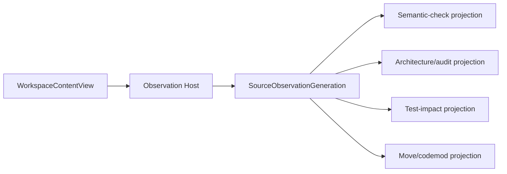

# Source Observation 与增量事实

本文拥有exact WorkspaceContentView、SourceObservationGeneration、跨consumer fact shards与增量失效的语言无关实现设计。它不拥有Domain adoption、target realization、具体语言/工具Provider选择、Verification verdict或实际cache地址。

## 1. One content view

```text
WorkspaceContentView = exact {
  tenant/repository/workspace/access scope refs,
  base/index/worktree/editor/generated overlay refs,
  explicit precedence,
  content manifest and physical binding refs,
  viewDigest
}
```

Disk、Git index、worktree、untracked与unsaved editor buffer是不同overlay source；必须由Observation Host按声明precedence合成一个view。任何consumer不得自行重读某一层并称为同一snapshot。

```text
SourceObservationGeneration = exact {
  WorkspaceContentViewRef,
  language/config/package/artifact frontend binding refs,
  parser/type/provider/config revisions,
  canonical content/declaration/reference/effect/unknown fact shard refs,
  coverage and opaque frontier,
  generationDigest
}
```

Watcher/editor events只使相关content keys stale，不进入semantic identity。Producer按bytes与readback建立新generation；长期进程的memory不能补造事实。

## 2. Source Program owner

Source Program是跨语言的typed observation schema：

```text
SourceProgramFact =
  | ContentFact
  | DeclarationFact
  | SymbolReferenceFact
  | ImportExportFact
  | CallAndCapabilityFact
  | EffectSinkFact
  | EntrypointFact
  | SchemaWriterReaderFact
  | PackageConfigArtifactFact
  | TestClaimObservationFact
  | DynamicOrOpaqueFrontier
```

每个frontend必须提供exact input coverage、parser semantics、unknown behavior、incremental/clean equivalence与resource bounds。Compiler/LSP拥有语言语义；ast-grep/semgrep/tree-sitter/ctags/regex只在其真实能力内生成candidate或补充事实，不能竞争symbol/type/alias/re-export owner。

隐藏在string/template/config/binary中的program只有在registered frontend可严格解释时才进入fact graph；否则保留opaque frontier。不得复制“只认`tests/**`”等路径正则形成第二test/source ontology。

## 3. Shared fact shards

```text
FactShardKey = digest(
  exact content subset refs,
  frontend/interpreter/config/provider revisions,
  fact kind and algorithm identity,
  security/tenant scope
)
```

Shards immutable、content-addressed、strictly validated。Source Program、semantic check、repository audit、test impact、architecture compiler和codemod读取同一generation及其purpose-reachable shards；各consumer只拥有projection，不得重新扫描并发布同名事实。



跨进程attach必须验证descriptor/shard digest、producer、input/config/provider generation、tenant/repository/workspace/security scope与freshness。Invalid item是stale/foreign/unresolved，不静默转为cache miss后触发Effect。

## 4. Reusable item classes

本片段消费System Architecture定义的三种reuse，不另建cache语义：

| item | source example | authority ceiling |
| --- | --- | --- |
| ObservationCertificate | filesystem identity、ACL/provider health observation | only the observed predicate/coverage |
| DerivationShard | parsed AST/symbol/reference/reverse-edge facts | same clean derivation only |
| AccelerationSeed | compiler build-info、parser memo、editing-service warm state | cost only; discardable |

一个物理store可保存多类bytes，但必须有不同variant、validator、freshness与consumer contract。Daemon、cache hit、mtime和path不升格为truth。

## 5. Language semantics 与 final check ports

```text
LanguageFrontendBinding = exact {
  languageAndGrammarRef,
  compilerFrontendAndSemanticModelRef,
  supportedFactKinds,
  incrementalInvalidationAndCoverageRefs,
  unknownAndResourceContracts
}

EditingQueryBinding = same WorkspaceContentView + same semantic fact identities
FinalCheckBinding   = selected compatible Provider + exact SemanticCheckActionKey
```

- 每种语言由一个canonical compiler/frontend拥有parse、symbol、type、alias、resolution与跨文件semantic graph；
- editing service只提供同一content view上的低延迟query，不签发final Evidence；
- final checker是可替换execution Provider，不得建立第二source/project graph或silent fallback；
- AST query、codemod和presentation工具只在其声明能力内提供candidate/transform，不重算语言truth；
- Provider unavailable/mismatch/unverified返回typed result，不能退回ambient tool。

```text
SemanticCheckActionKey = digest(
  SourceObservationGenerationRef,
  exact language/project/config references,
  dependency generation and package closure,
  checker/provider identity,
  canonical diagnostic-affecting args,
  environment/target profile
)
```

相同ActionKey可复用terminal；输入变化只失效反向可达shards。Final frozen tree/environment只需一次full Evidence；editing循环使用editing service或affected closure，不反复裸跑full checker。SEC self-hosting所选的具体语言/checker与性能绑定只由 [Runtime and Distribution](../runtime-and-distribution.md) 的toolchain profile拥有，本片段不复制。

## 6. Performance model

目标不是常驻daemon，而是消除重复Observation与不可验证的cold setup：

```text
SourceLoopCost =
  attach/validate WorkspaceContentView
  + changed-content frontend work
  + reverse invalidation
  + selected consumer projection
  + required final checker work
  + settlement/readback
```

优化顺序：

1. semantic check/audit/test-impact共享一个exact generation；
2. content-addressed fact shards跨进程可验证attach；
3. native retained OS/provider session替代每进程presentation shell证明；
4. warm service只保留AccelerationSeed/live handles，cold path仍可从canonical inputs重建；
5. 以`cold/warm/delta/cache-disabled`同输入结果等价和实测成本做Pareto裁决。

```text
IncrementalCorrect =
  result(incremental, SemanticCheckActionKey) == result(clean, SemanticCheckActionKey)
  and changed unrelated content leaves result byte-identical
  and every relevant content/config/provider change invalidates
  and cache/service loss changes only cost
```

## 7. Resource and failure boundary

Observation、frontend、attach与consumer projection共享一个operation allocation：entries、bytes、depth、memory、CPU/time、open handles/processes与output。不得每层重置deadline/counter，也不得为算bytes预扫整棵树后再扫描。

Frontend优先single-pass streaming inventory并在同一次读取中计算content digest、byte consumption与facts；若协议要求readback，再以明确的第二阶段budget执行。Abort/deadline/permission/unsafe path/parser failure保留typed原因，不能catch为`false/null/absent`。

## 8. Completion

```text
SourceObservationClosed =
  one exact WorkspaceContentView per generation
  and every source kind has one frontend or typed opaque frontier
  and all consumers reference the same fact identities
  and incremental/clean/cache-disabled results are equivalent
  and cross-process reuse validates complete scope and invalidation
  and every admitted language has one semantics owner and one selected final checker route
  and resource exhaustion/cancellation never becomes absence or success
  and loss of warm state affects cost only
```

<!-- sec-clause {"blocker":null,"kind":"stable-decision"} -->
## 规范片段

每个exact workspace view只产生一个SourceObservationGeneration；language facts、semantic check、audit、test-impact和rewrite共享content-addressed shards与同一invalidations。canonical compiler/frontend拥有语言语义，final checker是可替换Provider；cache、daemon、path和工具候选不能形成第二source graph或改变clean结果。
