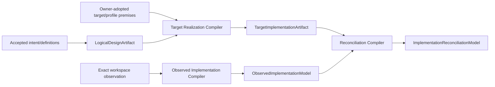
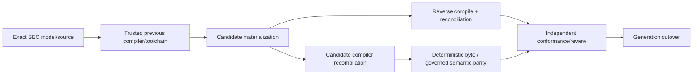

# 目标编译、现状重建与 Round Trip

本文拥有target realization、observed implementation与reconciliation三个单向compiler family，以及governed-authored/opaque边界和round-trip判据。它不拥有Source Program observation、Product/Domain meaning、runtime Effect或architecture migration。

## 1. 三模型隔离



三者不能共用writer、payload或完成状态：

| model | may read | may emit | cannot do |
| --- | --- | --- | --- |
| target realization | logical artifact + adopted Target/Profile/mechanism-class/cost/future premises | target responsibility realizations、contract/port refs、algorithms、placement、ImplementationBindings、frontier | read current code、adopt observation、bind live Provision、plan migration Effect |
| observed implementation | exact SourceObservationGeneration + config/package/artifact/runtime observations | declarations/edges/effects/state/unknown facts | decide value、repair target、claim conformance |
| reconciliation | one closed target + one closed observed model | preserves/drifts/surplus/required-unmaterialized/unknown relations | write either input、change target to fit sunk cost |

世界Observation若需要成为target premise，必须先由其原owner签发`ObservedAsPremise` adoption；current path、installed package和migration cost不能直接进入target compiler。

## 2. Intent boundary

```text
Intent = {
  desiredOutcomeRefs,
  explicitNonGoalRefs,
  preservedCapabilityRefs,
  acceptedTradeoffRefs,
  targetSubjectRefs,
  constraintRefs,
  ambiguityFrontierRefs
}
```

Intent不含path、Provider、implementation、test count、version label或Effect permission。Natural-language/AI解析只产生proposal与ambiguity；Product/Domain owner adoption后才形成Definition。

## 3. Realization classes

```text
ImplementationRegion =
  | DeterministicGenerated {
      sourceIRRefs, loweringRef, canonicalBytes obligation
    }
  | GovernedAuthored {
      responsibility/public contract refs,
      implementation freedom envelope,
      required reverse-conformance refs
    }
  | OpaqueExternal {
      provision/binding/conformance/security/settlement refs,
      explicit unknown ceiling
    }
```

`GovernedAuthored`不是永久逃生口：可稳定推导的事实回收进IR/compiler，剩余选择必须在freedom envelope内。`OpaqueExternal`不能由generator静默编辑，也不能把presentation output当protocol。

### 3.1 Responsibility realization facets

每个ResponsibilityScope在特定Target/Profile下只编译与其义务有关的facets；产物是 [Canonical Implementation Graph](model-and-boundaries.md) 定义的可重建`ResponsibilityRealization`，不是新的semantic entity、class、layer、folder或service。该对象只引用已接受的assignment、decision、freedom envelope、contracts、ImplementationUnits与conformance；不自行选择任何一项。

| facet | 何时适用 | 编码前必须冻结 |
| --- | --- | --- |
| boundary | 有public/foreign consumer | input/result/failure、information/authority ceiling、compatibility |
| algorithm/data | 有非平凡变换或查询 | observable semantics、algorithm family、data-structure invariants、time/space/I-O/communication bounds、alternatives |
| state | 有durable/mutable state | state machine、linearization、schema/query/index、retention/migration/recovery |
| operation/effect | 有observation或Effect | pure plan、requirements、idempotency、settlement/readback/result |
| concurrency/resource | 有共享state/capability或规模边界 | ordering/commutativity、allocation、backpressure/fairness、cancel/deadline |
| provider/physical | 有external/OS/runtime capability | port/provision/binding、identity/security/environment、generation/retirement |
| compilation/source | 产生或解释source/config/artifact | grammar/pass/lowering、coverage/unknown、incremental invalidation、canonical bytes |
| interface/operability | 有human/machine/public/support边界 | semantic invocation、schema/disclosure、accessibility/cancel/undo、diagnostics/incident objectives |

pure deterministic responsibility通常只有boundary+algorithm；无state就不生成state facet，无Effect就不生成operation/runtime facet。适用facet缺失产生`realization-detail-unbound`；机械加入无用facet并制造wrapper、state、version、test或package产生`over-realized-responsibility`。

```text
ImplementationFreedomEnvelope = exact {
  responsibilityScopeRef,
  allowedRepresentationAndLocalAlgorithmEquivalenceRefs,
  preservedPublicTraceInvariantAndFailureRefs,
  preservedAuthorityEffectStateSecurityCompatibilityRefs,
  complexityAndResourceCeilingRefs,
  determinismConcurrencyAndPortabilityBounds,
  forbiddenBoundaryCrossingRefs,
  conformanceObligationRefs,
  envelopeDigest
}
```

只有在全部observable与cost边界内等价的选择才是local freedom；一旦候选越界，必须回到有权decision或frontier，不能在代码review时临时合理化。

### 3.2 Realization decision compiler

结构、算法、数据结构、状态、并发、资源、Provider、placement和interface不是编码时自由散落的选择。compiler对每个ResponsibilityScope生成decision dependency graph：

```text
compileResponsibilityRealization(scope, targetProfile, budget):
  obligations := exact reachable logical/public/failure/evolution closure(scope)
  facets := derive applicable facets and not-applicable proofs(obligations)
  variables := derive decision variables(facets, targetProfile)
  graph := dependency graph among variables and their hard constraints
  components := condense strongly connected variable sets into joint decisions

  for component in topological antichains(components):
    candidates := enumerate only owner/catalog supplied admissible candidates
    candidates := propagate hard constraints and remove dominated candidates
    classify each variable as
      derived-by-closed-rule
      | implementation-local-freedom
      | governed-design-choice
      | bounded-frontier
    solve independent components in parallel; serialize shared-constraint components

  emit ResponsibilityRealization only when every applicable variable is classified
  emit conformance obligations from the same decisions, never from current code
```

算法不枚举“宇宙中所有技术”。relation closure与SCC condensation对图规模为线性/近线性；候选只来自accepted mechanism catalog、Target/Profile与explicit alternatives。约束耦合后的多目标选择一般可能NP-hard，因此只在bounded joint component内使用exact branch-and-bound/ILP/SAT或等价solver；budget耗尽返回带上下界和closure predicate的frontier，不能用heuristic分数签发选择。

```text
parallelizable(a,b) iff
  no dependency path(a,b)
  and no shared indivisible constraint/state/authority/resource decision
  and deterministic merge of their artifacts is proven
```

编译并行仅提高pure calculation速度，不改变结果或owner。若调度顺序本身可观察，它属于algorithm/state/concurrency decision并由相应assignment控制；若不可观察且保持trace/resource等价，才可留给runtime scheduler。adaptive或learning system同样不例外：owner采用的是update law、objective、guardrail和reversal envelope，每次runtime update是StateTransition，不是模型自行获得设计Authority。

## 4. Forward compilation

```text
LogicalCompilationInput = {
  accepted Product/Domain definition refs,
  validated semantic snapshot ref,
  public operation/workflow refs,
  evolution/support/future-obligation refs
}

TargetRealizationInput = {
  logicalDesignArtifactRef,
  Target/Profile refs,
  owner-adopted technology/mechanism-class/resource-ceiling/environment premise refs,
  candidate catalog/policy/cost refs,
  target unknown frontier
}
```


每个pass只有一个closed input/output grammar和validation boundary；后续pass不能补造上游meaning。Target backend只选择language/framework/config/package realization，不决定Product语义、Provider live availability或Effect terminal。

```text
ProductMaterializationDesign =
  source/config/package graph
  + public interfaces/projections
  + build/runtime/deployment bindings
  + durable schemas/migration obligations
  + behavior/effect/failure/recovery claim scenarios
  + supply-chain/provider/resource obligations
  + readback/retirement obligations
```

## 5. Observed reconstruction

```text
ObservedImplementationInput = {
  exact SourceObservationGenerationRef,
  SourceProgram/frontend coverage refs,
  config/package/artifact/runtime/external observation refs,
  exact unknown frontier
}
```

Reverse compiler只陈述“此exact snapshot中观察到什么”：declarations、references、calls、effects、writers/readers、schemas、packages、entrypoints、providers、tests/claims、durable state与unknown。名称/目录相似只产生candidate relation；Domain adoption必须独立。

任意语言或仓库通过frontend输出同一typed Source Program relations；unknown/dynamic/opaque保持边界。禁止为每种工具建立第二graph或让regex/search result签发symbol/effect truth。

## 6. Reconciliation

```text
ReconciliationResult =
  | CandidateCorrespondence {
      nonempty targetRefs, nonempty observedRefs,
      candidateEvidenceAndCoverageRefs,
      competingCandidateRefs
    }
  | Preserves {
      nonempty targetRefs, nonempty observedRefs,
      adoptedSemanticOriginBindingRef,
      refinementProofRef
    }
  | Drifts {
      nonempty targetRefs, nonempty observedRefs,
      adoptedSemanticOriginBindingRef,
      violatedObligationRefs
    }
  | IncompatibleCorrespondence {
      nonempty targetRefs, nonempty observedRefs, violatedConstraintRefs
    }
  | RequiredUnmaterialized { nonempty targetRefs, implementationDesignRef }
  | SurplusCandidate { nonempty observedRefs, dispositionFrontierRef }
  | DuplicateOwner { competingObservedRefs, canonicalOwnerRef }
  | BoundedUnknown { affectedRefs, frontierRefs }
```

这些variants是hyperedges而非强制一对一文件映射。多target或多observed端必须证明semantic coverage、overlap/non-overlap、composition/decomposition与信息损失；数组顺序、同名和共同目录不提供对应语义。`CandidateCorrespondence`不能被consumer当作Preserves；owner adoption产生新的semantic-origin binding generation，随后才可重编Reconciliation。Observed-only不是自动垃圾；必须闭合consumer/effect/durable/future/external obligation。Target-only不是缺陷设计；若implementation design完整则保持`required-unmaterialized`。删除与保留决策由Product/Domain/Evolution owner接受，reconciliation只提供typed facts。

## 7. Tools and AI

Compiler API、LSP、ast-grep、semgrep、tree-sitter、codemod、build orchestrator与AI只作为Capability Provision：

| capability | legitimate role | forbidden ownership |
| --- | --- | --- |
| language compiler/type checker | syntax/symbol/type semantics | Product/Domain meaning |
| Language Service | editing-time incremental navigation | durable truth or final Verdict |
| structural query/codemod | candidate discovery / admitted transformation | second Source Program graph |
| build orchestrator | execute compiled Requirement DAG and cache | business Workflow/Claim |
| AI | propose ambiguity-bounded governed-authored delta | authority、fact、completion |

成熟机制先经Design Compiler候选比较；选中后只改变Provider/Mechanism Binding，不复制Requirement或上游graph。

## 8. Manual implementation provider

当target bytes不能唯一lower时，system签发：

```text
ManualImplementationRequest = {
  exact logical/target artifact refs,
  responsibility/public contract refs,
  freedom envelope,
  forbidden boundary crossings,
  required Source Program/refinement/conformance outputs,
  resource/authority ceiling
}
```

Human/Agent/tool返回candidate bytes与explanation refs；不能返回“accepted”、Grant、Evidence或terminal。Candidate必须重新经过exact Source Program、reconciliation、conformance与受控materialization；不存在手写旁路。

## 9. Self-hosting trust

SEC可用同一compiler family治理自身，但candidate不能自证：



Bootstrap seed只拥有启动所需的minimum compiler/toolchain identity。Candidate不能签发自己的admission、Verdict或cutover；previous compiler无法解析新meta-model时进入explicit bootstrap/evolution design，不放宽parser或永久双编译。

## 10. Round-trip

```text
RoundTripConformance(snapshot, closedTarget) =
  reconcile(decompile(snapshot), closedTarget).semanticAndRealizationDelta is empty
  and public behavior refines accepted contracts
  and state/effect/failure/recovery traces satisfy obligations
  and deterministic regions equal canonical lowering bytes
  and governed-authored regions contain no unexplained semantic surplus
  and opaque/unknown frontier is disjoint from requested Claim/Effect
```

达到该fixed point前只能称proposal、partial materialization或frontier，不能称“业务已写完”。

## 11. Completion

```text
TargetObservationRoundTripClosed =
  target/observed/reconciliation compilers are unidirectional and exact
  and every target choice is derived, owner-decided, freedom-bounded or frontier
  and every observed object/edge is classified or bounded unknown
  and every reconciliation relation has exact endpoint revisions
  and every governed/opaque region has conformance and authority ceilings
  and self-hosting keeps issuer/verifier/cutover independent
```

<!-- sec-clause {"blocker":null,"kind":"stable-decision"} -->
## 规范片段

Target synthesis、current reconstruction与reconciliation必须是三个单向compiler family；目标不能由当前路径和沉没成本反推，观察不能采用目标，reconciliation不能回写任一输入。自动生成、受治理手写与opaque外部实现共享同一round-trip与conformance边界。
