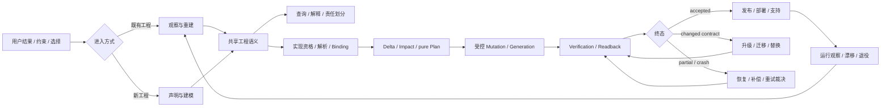
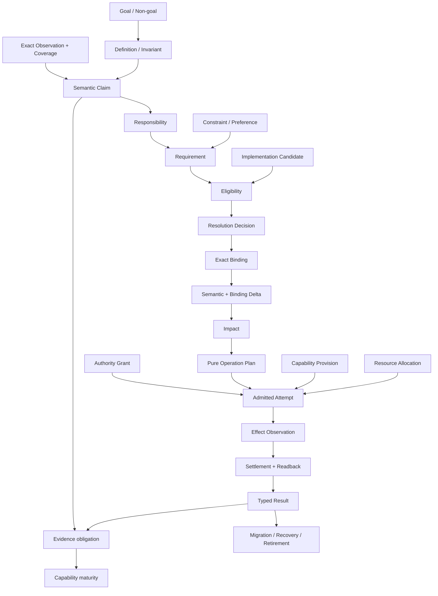
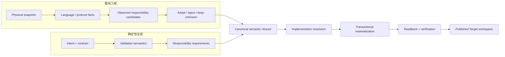
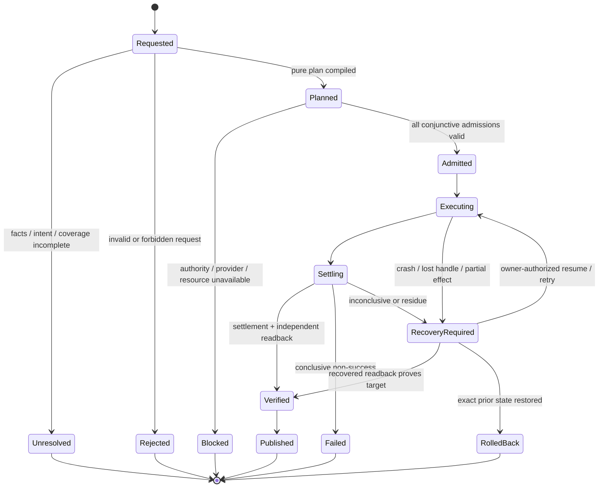
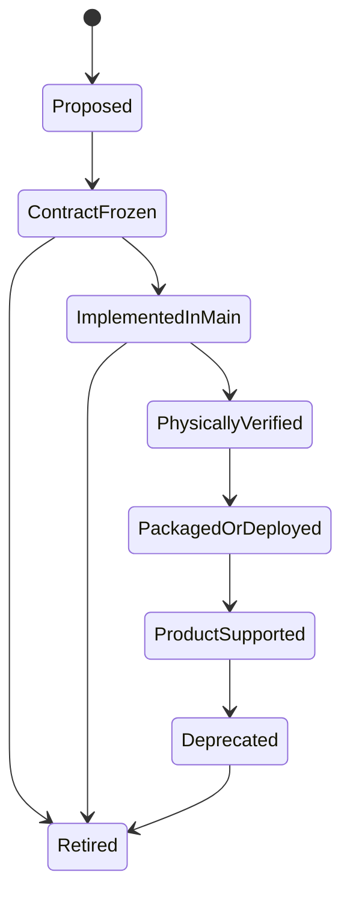
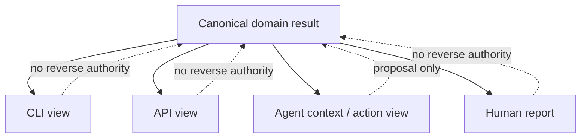
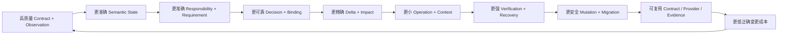

# 产品目标与系统边界

本文只拥有 SEC 的产品目的、用户可观察能力、业务边界与成功判据。通用事实/关系/约束语言由 `docs/design-calculus.md` 拥有，通用工程原则由 `docs/engineering-constitution.md` 拥有，SEC 对象、authority、Effect、Evidence 和演进机制的项目实例化由 `docs/system-architecture.md` 及对应领域 owner 拥有；交付顺序由 `docs/roadmap.md` 拥有。本文不复制实现清单、路径、版本、Provider inventory 或当前完成状态。

## 产品定义

SEC 是位于框架、工具链和 AI 之上的**工程语义与受控演进系统**：把散落在源码、配置、依赖、测试、运行环境和维护者经验中的工程知识，转化为可声明、可观察、可解析、可组合、可验证、可迁移和可退役的事实；再在明确权限、资源和失败边界内把用户意图变成真实 Target workspace 的正确变化。

```text
产品价值排序 = 用户结果正确性
             ≻ 不可逆风险与恢复能力
             ≻ 正确变更的全生命周期成本
             ≻ 单次运行速度、局部代码量、报告数量
```

局部速度只有在不降低前三项时才是优化。代码、IR、Block、Slot、Adapter、测试、文档、脚本、AI、Provider 和界面都是可替换手段，不产生产品目的。

## 用户、世界与边界

| 概念 | 产品含义 | 不得混同 |
| --- | --- | --- |
| SEC repository | 实现 SEC 产品的工程 | 用户目标工程、SEC Runtime State |
| Target workspace | 用户在 IDE 中开发、观察、生成、验证和演进软件的真实工作区 | SEC repository、单个 Project 对象 |
| Authoring Source | 能产生权威工程事实的语义角色 | 某个固定目录、任意源码文本 |
| Source Program Model | 对 exact content snapshot 的物理、语法、符号和依赖观察 | 业务语义 owner、写权限、完成证明 |
| Engineering Semantic Model | 用户意图、责任、合同、状态、Effect、权限与实现要求的 canonical meaning | 源码图、某个框架模型、AI 推断 |
| Implementation Binding | 某项 Requirement 在特定 Target 上采用的 exact 实现闭包 | 包名、路径、版本标签或偏好本身 |
| Operation | 一次有 identity、约束、资源、Effect、结算和终态的业务变化 | 命令、进程、脚本或单个函数调用 |
| Evidence | 支持明确 Claim 的独立观察 | producer 自报、测试绿色、文件存在 |
| Project | 仅在领域合同确有独立业务对象时使用 | workspace、repository、生成结果的泛称 |

## 全产品能力拓扑



两条入口共享从“工程语义”开始的全部 identity、决策、Effect 和证明；Brownfield 不能获得一套弱化真值，deterministic generation 也不能绕过同一约束。

## 业务能力合同

| 能力 | 用户提交 | SEC 必须给出 | 不能伪装成成功 |
| --- | --- | --- | --- |
| Observe | workspace、范围、观察目的 | exact snapshot、coverage、physical/symbol facts、unknown/opaque | 路径枚举、部分扫描、缓存命中 |
| Reconstruct | observations、已接受 definitions | responsibility/state/effect/permission 候选、冲突与 provenance | AI confidence、目录命名、相似代码 |
| Declare | intent、contract、constraint、acceptance | canonical semantic definition 与可判定 invariant | prompt、模板、fixture、自报 schema |
| Query/Explain | question、subject、revision | source→meaning→binding→effect→evidence 的可追踪答案 | presentation 文本、过期报告 |
| Resolve | semantic requirement、Target、policy、catalog | eligible set、拒绝原因、唯一 Decision 与 exact Binding | popularity、semver、首个可用包 |
| Plan | desired delta、current binding、constraints | pure Semantic/Binding Delta、Impact、operation obligations | 创建目录、下载、探测、lease 或写 staging |
| Mutate/Generate | admitted plan、authority、resources | exact Effect、settlement、independent readback | command exit、进程结束、文件存在 |
| Verify | declared claims、exact result、environment | typed verdict、coverage、freshness、invalidation | producer 自证、数字/版本镜像 |
| Upgrade/Migrate | old/new contracts、support horizon | compatibility decision、cutover、recovery、old consumer-zero | 永久双读、alias、仅修改版本号 |
| Recover | durable intent、observations、current physical state | join、complete、exact rollback、authorized retry 或 residue | blind replay、删状态、猜测 absent |
| Publish/Operate | verified artifact、target environment | deployment/readback/support maturity、drift signal | 本地 PASS、artifact upload、latest 名称 |
| Retire/Reduce | replacement proof、consumer/effect census | semantic superset、净删除、retirement receipt | unused 标签、零仓内 import、测试删除 |
| Extend ecosystem | external capability/language/target contract | typed adoption maturity、conformance、exit/retirement | 一对一 wrapper、品牌分支、永久自研轮子 |
| Agent/Interface | intent/query/authorized operation | 同一 canonical result 的最小投影与下一合法动作 | 第二 resolver、第二写路径、聊天状态 |

## Canonical 业务对象关系



每条箭头是有 owner、revision、coverage、validity 和 failure semantics 的关系；相邻名字、同一文件或结构相似不能建立关系。

## 用户控制语义

| 控制 | 对候选集的作用 | 不合格时结果 |
| --- | --- | --- |
| Intent | 声明所需行为，由系统解析实现 | unresolved 或 blocked，不猜实现 |
| Constraint | 删除违反 Target、成本、许可、安全、隐私、资源或可移植性的候选 | 被删除候选不可回退进入 |
| Prefer | 在全部硬约束合格后排序 | 解释性选择下一合格项 |
| Require | 只允许指定实现族 | 指定族不合格则 blocked |
| Forbid | 排除指定能力、包、Effect 或平台 | 无剩余候选则 blocked |
| Pin | 绑定 exact package/version/integrity/config/Provider | identity 或 eligibility 不符则 blocked |
| Custom | 接受用户 Typed Invocation、Governed Source 或 Provider | 未知内部保持 opaque，边界仍验证 |
| Bounded override | 在可豁免 constraint 上临时放宽 | 绑定 issuer、理由、expiry、验证与 reversal |

`Constraint` 永远先于 `Prefer`；`Require/Pin` 不能把不合格实现变合格；override 不能豁免 semantic truth、authority、durable integrity、Evidence honesty 或不可逆安全边界。

## 两条主链的收敛



Brownfield 的 inferred relation 只有经 owner 采用才进入 canonical semantics；生成链没有真实 Target readback也不能把计划当实现。二者在 `Canonical semantic closure` 后完全共用下游。

## Operation 业务状态机



| 终态 | 用户可依赖的含义 | 禁止推导 |
| --- | --- | --- |
| `rejected` | 请求本身无效、越界或违反不可豁免约束；零 Effect | 未来永远不支持 |
| `unresolved` | facts/coverage/identity/意图不足；零猜测 | absent、mismatch、允许写入 |
| `blocked` | 合法计划当前缺 authority/capability/resource/Evidence | 计划错误、Effect 未发生 |
| `failed` | attempt 已结算且未达成功；残留状态明确 | 自动重试、prior state 已恢复 |
| `recovery-required` | 已有或可能有 Effect，但无法证明 terminal | 失败、成功、可 replay |
| `rolled-back` | exact prior state 经独立 readback 恢复 | 原计划完成 |
| `published` | target readback、Claims 和 publication terminal 同一 identity 闭合 | product-supported、所有环境可用 |

取消和超时是触发 settlement/recovery 的原因，不是无需 readback 的独立成功终态。

## 支持成熟度



成熟度只能逐级由各层独立 Evidence 提升；文档、类型、candidate、单平台测试、artifact 或发布动作不能跨级。能力可以因 Evidence stale、Provider drift、支持窗口结束或真实反例降级为 unresolved/deprecated，而不是维持虚假支持标签。

## External capability 与任意类库

“可以调用”“SEC 理解其行为”“可自动选择”“正式支持”是四个不同结果：

```text
physical presence
→ typed invocation
→ governed declaration
→ observed candidate
→ verified Provider / Adapter
→ SEC-owned normalized projection
```

陌生类库可先结构化使用；未知行为必须显式 `unknown | opaque`。正式采用需要 contract、Target、security/license、credential、resource、failure、conformance、migration 和 retirement 闭合。成熟轮子优先，但只能替换其真正支配的自研实现；旧 owner 未 consumer-zero 时不得保留两套图、wrapper 或缓存。

## 变更、迁移与能力保真

替换旧系统不是比较文件或当前输出，而是比较完整业务义务：

```text
Coverage(new, old) =
  observable outcomes
  ∧ accepted future obligations
  ∧ failure / recovery semantics
  ∧ authority / security boundaries
  ∧ migration / retirement path
  ∧ lifecycle cost not worse
```

| 证据 | 能证明 | 不能证明 |
| --- | --- | --- |
| current consumer/effect graph | 当前真实义务 | 未激活的未来承诺 |
| accepted roadmap/domain obligation | 有 issuer 的未来设计目的 | 当前已实现 |
| comment/dead API/test name/version suffix | 导航候选 | 未来价值或保留权 |
| replacement conformance/readback | 当前语义覆盖 | old consumer-zero |
| retirement census | 旧图已无真实 consumer | 新图正确 |

缺少任一必要覆盖时返回 `design-intent-unresolved`。兼容只服务真实并存窗口；迁移完成必须同时满足新图 active、旧图 consumer-zero、rollback/recovery terminal 和迁移机制自身退役。

## Agent 与多入口一致性

CLI、API、Agent、报告和未来 UI 只能投影同一 canonical identity、Decision、Binding、Result 和 Evidence：



Agent 只能在最小充分 Context、明确 operation、权限、资源和路径交集内提议或执行；模型能力、自然语言信心、Skill、聊天历史和大上下文不能扩大 authority。用户不必理解内部脚本或每个类库，但必须能看见选择理由、unknown、Impact、Evidence、失败和恢复状态。

## 业务场景逻辑演算

| 场景 | 必须成立的路径 | 正确终态 | 必须拒绝的捷径 |
| --- | --- | --- | --- |
| 只理解既有工程 | exact snapshot → observation → coverage/unknown → query | 可追踪 answer 或 unresolved | 目录名推断业务、扫描部分冒充完整 |
| Brownfield 受控改动 | adopted semantics → Delta/Impact → plan → admitted Effect → readback | published / recovery-required | AI 直接改文件、测试绿即完成 |
| 从意图生成新工程 | contract → lowering → resolution → materialization → verification | byte-stable Target result | 模板偶然选择、目标分支硬编码 |
| 使用陌生 package | typed invocation → opaque boundary → optional conformance | governed unknown 或 verified binding | 自动宣称正式支持 |
| 指定/禁止实现 | hard eligibility → require/forbid/pin semantics | exact binding 或 blocked | 偏好覆盖硬约束 |
| Provider/依赖升级 | old/new binding delta → compatibility → migration → cutover | new binding + old consumer-zero | semver 等于兼容、永久双读 |
| Effect 中途 crash | durable intent → current readback → recover/rollback/retry decision | verified / rolled-back / recovery-required | PID/exit 推断、blind replay |
| workspace 并发变化 | preimage/CAS mismatch → invalidate plan/Evidence | typed conflict/unresolved | 覆盖外部变化、继续旧计划 |
| external provider 离线 | requirement 不变、binding unavailable | blocked；合法本地替代可重新解析 | 降格 proof、裸 fallback |
| Agent 上下文丢失 | reload canonical projection + live facts + operation state | same legal next action | summary/memory 继承权限 |
| instruction injection | content 作为 data → precedence/admission check | ignored or typed unknown | 源码/日志/PR 文本改写 Agent 原则 |
| 架构模型出现反例 | invalidate dependent claims → extend model → equivalence → cutover | new single generation | 旧模型旁加例外/V2 facade |
| 退役无用能力 | producer/consumer/effect/external/future census → replacement proof | net deletion + retirement receipt | unused/零 import 直接硬删 |
| Target 浏览器应用 | 作为 Target contract 观察/生成/验证 | Target capability result | 复活 SEC 自身 browser/Workbench 产品面 |

任一场景无法沿统一对象与状态机演算，说明产品模型缺维度；不得以专项脚本、专用状态、例外测试或提示词绕过。

## 非目标与永久边界

SEC 不是通用 IDE、低代码私有运行时、模板市场、包管理器、单纯代码知识图、万能软件市场、自由式整仓 AI 编码器或通用 AGI。

SEC 产品自身不拥有 browser、Playwright、Workbench、local HTML view、前端 UI graph 或第二交互运行时；这些已退役。它仍可治理或生成 Target workspace 的浏览器应用。Block/Slot 芯片化、统一插槽、旧目录形状、Vn facade、全局 service locator 和一对一工具 wrapper 也不是产品目标。

永久边界：

- canonical Authoring Source 和正式 published state 才是工程事实；projection、缓存、报告、聊天和 Evidence 不反向成为事实源；
- Brownfield 与 generation 共用一个 Engineering Semantic Model；
- unknown、ambiguous、stale、conflicted 和 opaque 是一等状态；
- AI、interface、Provider、test 和 producer 不能自签 semantic truth、authority、Verification 或 completion；
- Implementation Resolution、Compatibility、Verification、publication、deployment 与 product support 是不同状态；
- 自动写入必须闭合 identity、owner、authority、Delta、Impact、resource、settlement、readback、recovery 和 Evidence；
- 新业务模型、Target、Provider 或语言不得要求核心按品牌、fixture、目录或版本标签分支；
- 未被真实用户结果或已接受义务消费的结构保持 proposal，不能靠“未来可能”进入 active architecture。

## 产品完备性与成功判据

SEC 的产品闭环不是“所有能力都有代码”，而是对已声明支持域满足：

```text
ProductClosed(scope) =
  outcomesDefined
  ∧ exactUniverseObserved
  ∧ semanticCoverageExplicit
  ∧ responsibilityAndOwnerUnique
  ∧ implementationDecisionDeterministic
  ∧ everyEffectAdmittedAndSettled
  ∧ claimsIndependentlyVerified
  ∧ recoveryAndRetirementReachable
  ∧ everyUnknownBounded
  ∧ allUserViewsSemanticallyEquivalent
```

首个 TypeScript 产品闭环还必须证明：

| 维度 | 成功性质 |
| --- | --- |
| Generality | 彼此无关的真实业务模型、外部工程和实现候选不要求核心增加品牌/fixture分支 |
| Observation | exact Target snapshot、Source Program、coverage、unknown/opaque 可重复 |
| Semantics | 同一模型同时服务 Brownfield 与 deterministic generation |
| Resolution | 相同语义、Target、constraints、catalog、policy 和 provider revisions 得到相同 Decision/Binding |
| Mutation | 每个支持的 operation class 有 authorization、CAS、resource、transaction、settlement、readback和recovery |
| Change | predicted Impact 与 actual Fact/Binding Delta 可比较；不兼容变化产生 Migration |
| Verification | behavior、durable state、Effect、failure/property和环境适用性由独立 Evidence 支持 |
| Extensibility | 未知 package 可 typed 使用但不虚报支持；新 Target/语言走相同 admission |
| Interface | Agent/CLI/API解释选择、淘汰、影响、unknown和恢复，不建立第二写路径 |
| Distribution | implemented、physically verified、packaged/deployed、product-supported 分别可验证 |
| Cost | snapshot/facts/results按完整 identity复用；正确变化成本随复用下降而非治理对象数量上升 |

## 长期飞轮



长期资产是 stable identity、Contract、Fact provenance、Source/Implementation binding、Verification、Migration 和经验证的 Provider 协议；不是 Prompt、模板、Slot、Block 数量、测试数量或某个流行工具。
