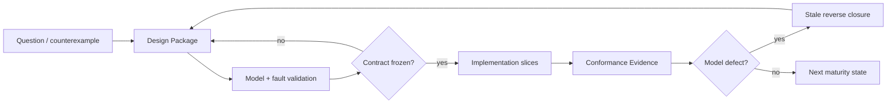

# 稳定交付路线

## 1. 所有权

本文件只拥有稳定 capability DAG、阶段依赖、进入/退出 Evidence、反转条件和产品完成边界。

| 不属于本文件 | 唯一来源 |
|---|---|
| 当前 main/SHA/tree/PR/CI/Review | live provider 与 exact readback |
| 当前 Work Package、blocker、candidate | control plane 与 docs/work |
| 产品价值与非目标 | product |
| 事实种类、关系、约束、原则语言和设计演算 | design calculus |
| 通用工程原则 | engineering constitution |
| SEC owner、operation、resource 与架构实例化 | system architecture |
| logical model 到 declaration/package/file/generated artifact 的实现、局部变更和意图编译 | implementation architecture |
| 兼容、迁移、退役 | change management |
| Provider 成熟度 | external provider policy |
| PASS、Evidence、Gate | verification governance |
| 通用 Agent 行为原则 | agent constitution |
| SEC Task/Operation/Skill/Work Package 行为 profile | development governance |

路线是能力偏序，不是日期表、Issue 镜像或“代码存在即完成”的清单。

## 2. 成熟度

~~~mermaid
stateDiagram-v2
  [*] --> Proposed
  Proposed --> ContractFrozen
  ContractFrozen --> ImplementedInMain
  ImplementedInMain --> PhysicallyVerified
  PhysicallyVerified --> PackagedOrDeployed
  PackagedOrDeployed --> ProductSupported

  ContractFrozen --> Proposed: design invalidated
  ImplementedInMain --> ContractFrozen: implementation disproves contract
  PhysicallyVerified --> ImplementedInMain: environment or evidence invalidated
  ProductSupported --> PhysicallyVerified: incident EOL or provider withdrawal
~~~

| 层级 | 可证明 | 不能证明 |
|---|---|---|
| proposed | 目标与候选关系已记录 | 合同正确、可实现 |
| contract-frozen | 对象、owner、输入输出、拒绝边界已冻结 | 代码存在 |
| implemented-in-main | canonical main 含实现 | 物理环境可用 |
| physically-verified | exact subject/environment 上成立 | 可分发、受支持 |
| packaged/deployed | 可重复安装或部署 | 长期支持 |
| product-supported | 支持策略、运营、撤销与恢复闭合 | 永久有效 |

任何类型、文档、测试、提交、PR 或示例都只能提供其实际层级的 Evidence。

### 2.1 Design-to-implementation gate

| Change kind | 实现前必须冻结 | 可省略 |
|---|---|---|
| 新产品能力/跨 owner 架构/公共合同/持久状态/Effect/resource/provider/layout/evolution | `docs/design-calculus.md` 定义的完整 Design Package + SEC scenario traces；涉及实现结构时同时冻结 `docs/implementation-architecture.md` 的 entity/placement/locality/generation/migration 投影 | production code |
| 已冻结 operation 内的局部实现纵切片 | Design Package ref、exact owned closure、acceptance/settlement/proof obligations | 重做全局哲学 |
| 用于消解一个 design unknown 的 experiment | hypothesis、isolated inputs/effects、expiry、expected observation、retirement | production integration/authority |
| incident recovery | 当前状态 readback、最小安全 transition、residue/rollback | 新功能与无关重构 |



该 gate 防止边写边发现结构，但不要求每个叶节点重复全套设计；叶节点必须引用现有 frozen package，找不到则返回 design-unbound。

## 3. 唯一能力 DAG

~~~mermaid
flowchart TD
  R0[R0 Theory and Authority] --> R1[R1 Engineering Semantic Kernel]
  R1 --> R2[R2 Verification Truth Kernel]
  R2 --> R3[R3 Physical Workspace Observation]
  R3 --> R4[R4 TypeScript Source Program Model]
  R4 --> R5[R5 Responsibility and Implementation Architecture]
  R5 --> R6[R6 Semantic Delta and Impact]
  R6 --> R7[R7 Operation Authorization and Planning]
  R7 --> R8[R8 Transactional Controlled Mutation]
  R8 --> R9[R9 Brownfield and Provider Adoption]
  R9 --> R10[R10 Target Profile and Type Algebra]
  R10 --> R11[R11 Resolution and Target Lowering]
  R11 --> R12[R12 General TypeScript Engineering Compiler]
  R12 --> R13[R13 Agent and CLI Semantic Operator]
  R13 --> R14[R14 Agent Operation and VerificationSession]
  R14 --> R15[R15 Release Deployment and Operations]
  R15 --> R16[R16 Registry and Additional Languages]

  R9 -. governed existing implementation .-> R11
  R2 -. truth kernel .-> R6
  R2 -. truth kernel .-> R8
  R2 -. truth kernel .-> R15
~~~

这不是十七套子系统。R1 提供共同语义；R2 提供共同真值；R3–R6 提供事实与变化；R7–R8 提供受控行动；R9–R12 提供吸收、选择和生成；R13–R16 提供交互、开发闭环、交付与扩展。

## 4. 阶段合同

| 阶段 | 依赖 | 唯一产物 | 最小退出 Evidence | 反转触发 |
|---|---|---|---|---|
| R0 | 用户终局、现实约束 | product boundary、owner map、root DAG | 无并列总计划/owner；稳定文档无动态事实 | 核心对象或 authority 无法共用 |
| R1 | R0 | validated Engineering Semantic Model | canonical bytes 稳定；三组无关模型不改 core | 第二 identity/revision/loader 出现 |
| R2 | R1 | Requirement/Gate/Result/Claim/Aggregate | zero-test、unknown、stale、self-proof 不能 PASS | consumer 对同一真值不一致 |
| R3 | R2 | exact Physical Observation / Content Manifest | tracked/declared inventory 无未解释遗漏；unknown 不等于 absent | 读取路径被当 identity |
| R4 | R3 | TypeScript Source Program Model | clean/incremental bytes 等价；dynamic/opaque 显式 | 正则/名字图改变 TS 语义 |
| R5 | R4 | Responsibility decisions、Owner DAG、Implementation/Placement decisions | owner 由关系闭包导出；实际 Source Program 满足 layer/visibility/locality；至少一项真实 Adopt | 只能靠路径/品牌/人工清单 |
| R6 | R5 | Fact Delta、Binding Delta、Impact | independently validated endpoints；unknown 保守传播 | comparator 重新 resolve 或判 compatibility |
| R7 | R6 | immutable Engineering Operation plan | dry-run 零 Effect；caller 不能提交 derived authority | intent、plan、authorization 混合 |
| R8 | R7 | journaled canonical transition | crash/CAS/rollback/recovery/readback；replay 不重复 Effect | mutation 绕过 journal/lease/fence |
| R9 | R8 | adopted Brownfield responsibility / Provider candidate | 两个真实外部工程；至少一个 governed mutation | candidate 被自动提升 authority |
| R10 | R9 | Target Profile、Type Algebra | Host/Target 正交；未知组合 emit 前拒绝 | 从 cwd/host 猜 Target |
| R11 | R10 | ResolutionDecision、ImplementationBinding、Target Program | hard eligibility 先于 policy；backend 不重选实现 | 库名分支或万能 resolver |
| R12 | R11 | general TS compiler result | 多类业务、provider switch、round-trip、byte parity | 新业务要求 core 品牌分支 |
| R13 | R12 | user/Agent semantic projections | CLI/Agent 同 plan；expert pin 也不能绕 eligibility | interface 重算语义或权限 |
| R14 | R13 | Task Capsule refs、Action DAG、VerificationSession | 一次真实 orient→merge→readback；resume 不靠聊天 | Skill/prose/候选 verifier 自授权 |
| R15 | R14 | package/deployment/operations truth | reproducible artifact、真实 deploy/rollback、SBOM/attestation | live-worktree copy 或支持状态自报 |
| R16 | R15 | governed registry/provider/language extension | signed identity、migration/revocation、统一 resolution | 新语言建立第二 semantic core |

每个出口都是合取条件；未满足项保持 typed incomplete，不能由后续阶段倒推为完成。

## 5. R0–R2：基础真值

### R0 — Theory / Authority

必须冻结：

| 对象 | 唯一性要求 |
|---|---|
| Product | 问题、终局、边界、成功判据唯一 |
| Design Calculus | Subject/Claim/Relation/Constraint、原则语言与模型演算唯一 |
| Engineering Constitution | 工程 identity/truth/owner/capability/resource/effect/proof/evolution 原则唯一 |
| Agent Constitution | Agent epistemics/reasoning/authorization/action/recovery/self-correction 原则唯一 |
| SEC Architecture | owner、operation、resource 与通用原则的项目实例化唯一 |
| SEC Implementation Architecture | entity realization、placement、change locality、intent compilation 与 migration 唯一 |
| Meta-model evolution | relation、constraint、execution/proof、materialization 可迁移 |
| Current state | 只由 live resolver；不得写进稳定路线 |

human/formal/role/boundary/enforcement/AI views 必须由同一 principles 编译；任一视图不能改变 owner、unknown 或拒绝结论。

### R1 — Engineering Semantic Kernel

R1 只包含跨语言、Provider、类库和 Target 仍成立的语义：

- stable Entity、Fact、Assertion、Contract、Responsibility、State、Operation、Policy、Permission、Effect、Scenario、Acceptance；
- identity、authority、confidence、provenance、validity、canonical ordering、semantic revision；
- raw → strict validate → normalize → deep-freeze 的单边界；
- conflict、ambiguous、unknown、opaque 是一等状态；
- Projection、Explain、cache 可重建，不能反向写事实；
- package、library、Provider、Adapter、Binding 与 semantic identity 分域。

R1 不包含语言 AST、文件路径、品牌类库、完整未来 IR 宇宙或无 consumer 的平台。

### R2 — Verification Truth

~~~mermaid
flowchart LR
  REQ[Requirement] --> G[Gate]
  G --> EX[Execution or reuse]
  EX --> RES[Result]
  RES --> C[Claim]
  C --> A[Aggregate]
  E[Evidence + exact subject] --> C
  A --> S{passed failed not-run unsupported invalidated}
~~~

必须区分 executed/reused/not-executed、applicable/not-applicable、required/not-required。candidate verifier、empty selection、wrong environment、stale Evidence、cleanup failure 与 unsupported provider 都不能产生 PASS。

## 6. R3–R6：事实、源码、所有权和变化

### R3 — Physical Observation

唯一 Content Manifest 覆盖 repository、workspace、package、target、file、config、test、workflow、resource、artifact，并分类 tracked/untracked/ignored/generated/vendor/binary/secret/protected/temporary/opaque。

~~~mermaid
flowchart LR
  G[Git object facts] --> CM[Content Manifest]
  F[Retained filesystem facts] --> CM
  CM --> SP[Source Program]
  CM --> TI[Test Impact]
  CM --> AU[Repository Audit]
  CM --> RP[AI Read Plan]
~~~

同一 content universe 只观察一次；dirty frontier 增量读取。symlink、junction/reparse、hardlink、case、Unicode、encoding、mode 和 unreadable 保留真实状态。SEC 手写 production executable source 的目标布局为 src；历史入口只有完成 consumer migration 后才能退役。

### R4 — TypeScript Source Program

| 层 | 产物 | 权威边界 |
|---|---|---|
| syntax | file/module/declaration/span/import/export | Compiler API exact snapshot |
| symbol | definition/reference/alias/re-export/merge | Program/TypeChecker |
| type | signature/generic/overload/resolution | repository-locked TypeScript |
| invocation | TypedInvocation / ExternalCallBinding | 类型正确，不推断 runtime behavior |
| candidate | call/data/control/effect/provider candidates | observed/derived，非 business authority |
| frontier | dynamic/unknown/opaque/conflict | 不得降为 absent |

事实 shard key 为 content digest + interpreter contract + resolution/config closure。Language Service、watch、worker、cache 只优化等价计算；provider unavailable 不能触发第二语义入口。

R4 性能出口同时要求：

- Source Program、typecheck、audit、test-impact 共用 exact Content Manifest；
- cold、warm、delta、cache-disabled clean compile 的 bytes/diagnostics 等价；
- authoring query 使用增量 Language Service；
- final frozen tree 只产生一次 ActionKey-bound full type evidence；
- Windows/Provider 物理证明使用 retained session，不为每个进程重复昂贵 shell discovery。

### R5 — Responsibility / Implementation Architecture

Responsibility Cell 由 declaration SCC、single writer/issuer/parser 和 Effect→settlement→readback→recovery 闭包共同生成。

| 状态 | 含义 |
|---|---|
| candidate | 机器观察到可能边界 |
| accepted | domain owner Adopt，形成 authority |
| rejected | 明确不是该 responsibility |
| ambiguous | 多个解释不能消解 |
| opaque | 当前 frontend 无法观察 |

Owner DAG 与 public demand 由系统架构编译；CodeUnit role、visibility、PlacementDecision、Change Locality、generated/authored/opaque classification 和 ArchitectureMigration 由 `docs/implementation-architecture.md` 从同一 Source Program 与 accepted Responsibility graph 编译。path、目录、index、facade、descriptor、package 或测试不能自报 owner。

R5 不是一次性的目录整理。每个 semantic delta 都先定位唯一 authored change point，再生成所有可推导投影；常规单责任变化只修改一个 owner，真实跨 owner 变化进入一个带 precondition、readback、recovery 和 retirement 的 ChangeTransaction。Intent-to-Code 未覆盖的部分由受相同合同约束的 ManualImplementationProvider 提议，不能成为第二设计 owner。

### R6 — Delta / Impact

~~~mermaid
flowchart LR
  A[Validated snapshot A] --> D[Fact Delta]
  B[Validated snapshot B] --> D
  BA[Binding set A] --> BD[Binding Delta]
  BB[Binding set B] --> BD
  D --> I[Impact fixpoint]
  BD --> I
  I --> V[Verification requirements]
  I --> C[Change Management]
  C --> CD[Compatibility Decision]
  C --> M[Migration obligations]
~~~

Comparator 只比较 independently validated endpoints；不重新运行 Resolver，不用包名/semver/API 相似度猜匹配或兼容。Impact 区分 definite/possible/unknown，并保留 witness、cycles、predicted/actual/full omission。

## 7. R7–R9：意图、Effect 和吸收

### R7 — Operation / Authorization / Planning

~~~text
EffectiveGrant =
  CallerCapability
  ∩ OperationPolicy
  ∩ TargetRequirement
  ∩ SourceOwner
  ∩ Scope
  ∩ ProviderCapability
  ∩ CurrentRevision
  ∩ VerificationRequirement
~~~

caller 只提交 intent/constraint/prefer/require/forbid/pin/custom；Eligibility、Decision、Binding、Delta、Impact、Compatibility、Verification、rollback 和 terminal 都由 owner 派生。

一个 operation 共享 absolute deadline、AbortSignal 和不可逆 aggregate ledger，覆盖 lock、child、retry、readback、cleanup、recovery。process/container/Git/compiler session 只供应 transport settlement；domain terminal 必须由领域 readback 产生。

### R8 — Transactional Mutation

~~~mermaid
sequenceDiagram
  participant O as Operation
  participant L as Lease owner
  participant J as Journal owner
  participant E as Effect capability
  participant V as Verification

  O->>L: acquire exact subject lease
  O->>O: reobserve and replan
  O->>J: durable intent
  O->>E: stage under shared budget
  E-->>O: physical settlement
  O->>V: prepublication proof
  O->>E: CAS publish
  O->>O: canonical readback and actual delta
  O->>V: postpublication proof
  O->>J: terminal or recovery-required
  O->>L: release and readback
~~~

journal schema、stage identity、producer provenance、pointer、rollover 与 migration 必须由同一 transition owner 管理。失败只能是：publish 前零 live change；publish 后 exact rollback；或 typed recovery-required。terminal replay 不重复 Effect。

### R9 — Brownfield / Provider Adoption

~~~mermaid
flowchart LR
  A[Attach] --> L[Lift]
  L --> R[Reconcile]
  R --> AD[Adopt]
  AD --> G[Govern]
  G --> N[Normalize]

  P0[L0 physical dependency] --> P1[L1 typed invocation]
  P1 --> P2[L2 declared invocation]
  P2 --> P3[L3 inferred candidate]
  P3 --> P4[L4 verified candidate]
  P4 --> P5[L5 normalized projection]
~~~

Adopt 只把 existing code/Provider/Adapter 放入正式 candidate catalog，不产生最终 Binding。Normalize 必须证明 round-trip、runtime/Acceptance parity、consumer migration、rollback 与 old writer/dependency retirement。

## 8. R10–R12：目标、选择和编译

### R10 — Target Profile / Type Algebra

Target Profile 显式声明 language、runtime、module、delivery、package manager、persistence、database、UI、verification、deployment 与 capabilities。Host、Toolchain、Target、Runtime Environment 正交；SEC 自身 host runtime policy 不能限制 Target workspace 的目标 runtime。

Type Algebra 覆盖 primitive、nominal、enum、optional、list、map、record、union、result、async、stream 及 recursion/nullability/discrimination/serialization/target mapping。未知组合在 Resolution 或 emit 前拒绝。

### R11 — Resolution / Lowering

~~~mermaid
flowchart TD
  S[Validated Application and Behavior] --> REQ[Implementation Requirement]
  TP[Target Profile and Type Algebra] --> REQ
  REQ --> CAT[Candidate closures]
  CAT --> EL[Hard eligibility]
  EL --> POL[Resolution policy]
  POL --> DEC[Resolution Decision]
  DEC --> B[Exact Implementation Binding]
  B --> TPI[Target Program IR]
  TPI --> BE[Backend AST printer formatter]
~~~

Candidate 是完整 Provider/Reference/Existing/Custom/Block-delivered closure，不是包名。Contract、Type、Target、Effect/Permission、安全、license、dependency、support 和 owner 是 hard eligibility；policy 只在合格候选中排序。Backend 不得重新选库或解释业务兼容。

Application/Behavior 只表达可验证、可 lowering 的语义；复杂算法进入 Governed Extension/Opaque Boundary。Block Capability Resolver 只解析自己的领域 binding，不拥有产品最终选择。

### R12 — General TypeScript Compiler

出口必须覆盖：

- state/lifecycle、reservation/concurrency、approval/policy、Governed Extension 等无关业务；
- source/test/config/artifact generation；
- Reference、第三方、repository-existing 与 Custom implementation；
- positive、negative、failure、provider switch、upgrade、round-trip；
- incremental graph 的 content/pass/profile/requirement/candidate/policy/decision/binding/provider/backend keys；
- unknown 扩大失效；clean/incremental Decision、Binding、Delta 与 bytes 等价；
- dependency/provider 升级经新 Binding → Binding Delta/Impact → Compatibility/Migration；
- 新业务主要增加 Contract/Provider/Adapter，不增加 core 品牌分支。

## 9. R13–R14：产品操作面和 SEC 自身开发闭环

### R13 — Agent / CLI Semantic Operator

Architecture、Scenario、State、Contract、Effect/Permission、Implementation、Impact 与 Evidence 通过 stable references 互相下钻。用户可声明 intent、constraint、prefer、require、forbid、pin、custom 和 bounded override；所有模式进入同一 Engineering Operation。

Interface 不计算 Eligibility、Binding、Delta、Compatibility 或 terminal。AI 只能提交 proposal，不能扩大 scope、permission、Effect 或 Verification。

### R14 — Agent Operation Compiler / VerificationSession

~~~mermaid
flowchart TD
  U[User outcome] --> WD[WorkDecision]
  WD --> TC[Task Capsule compiler]
  TC --> RP[Bounded Read Plan]
  RP --> SK{zero or one Skill}
  SK --> C[Candidate generation]
  C --> AD[Requirement and Action DAG]
  AD --> VS[VerificationSession]
  VS --> RV[Independent Review]
  RV --> PM[Promotion]
  PM --> MR[New-main readback]
  MR --> CL[Retirement and cleanup]
~~~

R14 不建立 general Run Kernel。Task Capsule 是 pure unbound content；VerificationSession 只保存 Task Capsule、Action/Evidence、Review、Provider、Integration 的 typed references。一个 logical run 只有一个 mutable worktree 和一个 active candidate ref；finding 产生同一 run 的新 generation。

关键出口：

- Requirement tri-state、subject-closure ActionKey、fresh PASS reuse、fresh failure reuse、in-flight join；
- physicalStartsPerActionKey 不大于一；
- candidate control 与 active-main control 分离；
- context compression/restart 从 authority 重算，不从聊天恢复权限；
- candidate Skill/verifier/workflow 不能授权自身；
- Review subject、Promotion identity 与 Candidate generation 分离；
- exact new-main readback 后才完成；Issue/PR prose 无完成 authority；
- legacy Skill/journal/API/branch/worktree 在 consumer-zero + physical readback 后退役。

### 现行 R14 工作选择投影

以下块仍被现行 WorkSelection 与 document-control consumer 读取，因此在迁移完成前必须保持机器可读。它是运行期工作目录的过渡载体，不是稳定 capability DAG；只能由唯一 renderer 原子更新，不得手工成为第二 roadmap。终态是由 canonical work records 编译独立 runtime projection，再将本块及 roadmap reader 一次性退役。

<!-- sec-work-selection-roadmap-catalog-v1:begin -->
```json
{
  "schema": "sec-roadmap-work-catalog-v1",
  "stageRef": "r14-agent-operation",
  "items": [
    {
      "packageId": "development-critical-path-spine-v1",
      "workId": "issue-398",
      "tracking": "issue-398",
      "currentSpecRef": "github:issue/398",
      "ownerRef": "github:issue/398",
      "kind": "focused",
      "disposition": "active",
      "priorityClass": "active-critical-path",
      "priorityEvidenceRefs": ["github:issue/398"],
      "prerequisiteWorkIds": [],
      "orderedAfterWorkIds": [],
      "reproductionOrEvidenceFreshness": "fresh",
      "rootCauseState": "repeat-root-cause",
      "rootCauseRef": "github:issue/398",
      "scopeClosure": "closed",
      "exitCriteriaRef": "github:issue/398#完成定义",
      "nearTermConsumerRef": "github:issue/316",
      "humanDecisionRef": null
    },
    {
      "packageId": "operation-read-plan-authority-canary-v1",
      "workId": "issue-346",
      "tracking": "issue-346",
      "currentSpecRef": "github:issue/346",
      "ownerRef": "github:issue/346",
      "kind": "focused",
      "disposition": "active",
      "priorityClass": "product-critical-path",
      "priorityEvidenceRefs": ["roadmap:r14/read-fast-path"],
      "prerequisiteWorkIds": [],
      "orderedAfterWorkIds": [],
      "reproductionOrEvidenceFreshness": "fresh",
      "rootCauseState": "repeat-root-cause",
      "rootCauseRef": "github:issue/346",
      "scopeClosure": "closed",
      "exitCriteriaRef": "github:issue/346#acceptance",
      "nearTermConsumerRef": null,
      "humanDecisionRef": null
    },
    {
      "packageId": "sec-static-convergence-v1",
      "workId": "issue-311",
      "tracking": "issue-311",
      "currentSpecRef": "github:issue/311",
      "ownerRef": "github:issue/311",
      "kind": "program",
      "disposition": "active",
      "priorityClass": "product-critical-path",
      "priorityEvidenceRefs": ["roadmap:r14/static-convergence"],
      "prerequisiteWorkIds": [],
      "orderedAfterWorkIds": [],
      "reproductionOrEvidenceFreshness": "fresh",
      "rootCauseState": "repeat-root-cause",
      "rootCauseRef": "github:issue/311",
      "scopeClosure": "closed",
      "exitCriteriaRef": "github:issue/311#acceptance",
      "nearTermConsumerRef": null,
      "humanDecisionRef": null
    },
    {
      "packageId": "candidate-control-transaction-v1",
      "workId": "issue-321",
      "tracking": "issue-321",
      "currentSpecRef": "github:issue/321",
      "ownerRef": "github:issue/321",
      "kind": "focused",
      "disposition": "active",
      "priorityClass": "product-critical-path",
      "priorityEvidenceRefs": ["roadmap:r14/candidate-control"],
      "prerequisiteWorkIds": [],
      "orderedAfterWorkIds": [],
      "reproductionOrEvidenceFreshness": "fresh",
      "rootCauseState": "repeat-root-cause",
      "rootCauseRef": "github:issue/321",
      "scopeClosure": "closed",
      "exitCriteriaRef": "github:issue/321#完成定义",
      "nearTermConsumerRef": null,
      "humanDecisionRef": null
    },
    {
      "packageId": "typescript-7-checker-acceleration-v1",
      "workId": "issue-312",
      "tracking": "issue-312",
      "currentSpecRef": "github:issue/312",
      "ownerRef": "github:issue/312",
      "kind": "focused",
      "disposition": "active",
      "priorityClass": "near-term-acceleration",
      "priorityEvidenceRefs": ["roadmap:r14/read-path-cutover"],
      "prerequisiteWorkIds": ["issue-346"],
      "orderedAfterWorkIds": [],
      "reproductionOrEvidenceFreshness": "fresh",
      "rootCauseState": "not-repeated",
      "rootCauseRef": "github:issue/312",
      "scopeClosure": "closed",
      "exitCriteriaRef": "github:issue/312#acceptance",
      "nearTermConsumerRef": "github:issue/316",
      "humanDecisionRef": null
    },
    {
      "packageId": "execution-wave-v1",
      "workId": "issue-349",
      "tracking": "issue-349",
      "currentSpecRef": "github:issue/349",
      "ownerRef": "github:issue/349",
      "kind": "focused",
      "disposition": "deferred",
      "priorityClass": "defer",
      "priorityEvidenceRefs": ["roadmap:r14/execution-wave"],
      "prerequisiteWorkIds": ["issue-321"],
      "orderedAfterWorkIds": ["issue-312"],
      "reproductionOrEvidenceFreshness": "fresh",
      "rootCauseState": "not-repeated",
      "rootCauseRef": "github:issue/349",
      "scopeClosure": "closed",
      "exitCriteriaRef": "github:issue/349#acceptance",
      "nearTermConsumerRef": null,
      "humanDecisionRef": null
    }
  ]
}
```
<!-- sec-work-selection-roadmap-catalog-v1:end -->

## 10. R15–R16：交付和扩展

### R15 — Release / Deployment / Operations

Release 只从 clean exact tree、Target Profile 与 exact Binding closure 构建。package/public projection、exports、runtime assets、dependencies、licenses、native/install-script、SBOM、checksums、signing/attestation 与 publication receipt 必须闭合。

Deployment 独立拥有 config、secrets、migration、feature flag、canary、rollback、observability、SLO 与 incident。Support maturity 可因 EOL、incident、Provider withdrawal 或 physical regression 失效，并触发重新 Resolution、Delta/Impact、Compatibility 与 Migration。

### R16 — Registry / Additional Languages

Registry item 必须有 identity、content digest、producer trust、Effect/Permission、conformance、compatibility、migration、revocation/yank 与 supply-chain Evidence。official/private/community 是 policy，不是质量捷径。

新语言只增加 Language Frontend、Source Analysis Provider、Language Service/transform、Target Backend、Build/Runtime Adapter 与 cross-language boundary；语言私有 AST/IR 不能成为 Engineering IR，Registry 不能成为第二 Resolver。

## 11. 横切能力何时激活

| 横切能力 | 激活触发 | 必须进入的 owner | 禁止 |\n+|---|---|---|---|\n+| determinism | 两次等价计算或 durable bytes | 产生该结果的 domain owner | 全局排序工具成为第二 owner |\n+| identity/revision | 两个可区分 subject/state | semantic/change owner | path、名字、随机 UUID 冒充 identity |\n+| provenance/Explain | claim 被下游消费 | claim/evidence owner | 自报 digest 自证 authority |\n+| security/permission | operation 触达 trust boundary | operation/provider owner | presentation 或 caller JSON 扩权 |\n+| compatibility/migration | 两个真实可观察状态共存 | change management | 无 consumer 的兼容壳 |\n+| transaction/recovery | Effect 可部分完成或跨进程 | state/effect owner | catch 后当 absent 重做 |\n+| performance/resource | 有真实 latency/cost/budget | resource owner | 每层重置 timeout 或重复扫描 |\n+| docs/governance | 规则跨任务复用 | canonical principle owner | 在 roadmap/AGENTS 重复规则正文 |\n+| external tool | 缺口由成熟能力填补 | provider capability owner | 一对一 wrapper 镜像工具 |\n+
未来价值不靠空代码保存。尚无 consumer 的合理未来需求记录为 capability obligation：目标、触发条件、必守不变量、潜在 consumer 和拒绝建立实现的原因。consumer 出现后重新进入相应阶段编译。

## 12. 受约束扩展轨道

~~~mermaid
flowchart LR
  P[R0 to R16 product spine] --> W[Workspace Domains]
  P --> C[Reference Repository Conformance]
  P --> S[Specialized Target or Provider]
  W --> P
  C --> P
  S --> P
~~~

### Workspace Domain

~~~text
W0 inventory → W1 validated identity → W2 query/projection
→ W3 Delta/Impact → W4 governed mutation
→ W5 migration/compatibility → W6 fault/recovery → W7 supported
~~~

Repository、Documentation、Workflow/Gate、Agent Operations、Evidence、Release、Product Decision 等 domain 可在 W1/W2 先提供只读价值；进入 W3 以后必须消费产品主脊的真实 owner。

### Reference Repository Conformance

~~~text
C0 exact census → C1 classification → C2 mechanism decisions
→ C3 owner/entry/public surface coverage → C4 domain bindings
→ C5 semantic/effect/failure parity → C6 migration/readback
→ C7 retirement → C8 unexplained delta = 0
~~~

具体参考仓库由 conformance owner 登记，roadmap 不硬编码其资产路径或计数。完成门为 unclassified、undecided、missing parity、unexplained delta、unauthorized retirement 全部为零。

### Specialized Target / Provider

~~~text
S0 corpus and architecture → S1 physical/provider contract
→ S2 source-model support → S3 cross-artifact Impact
→ S4 governed mutation → S5 resolution/lowering/round-trip
→ S6 runtime/compatibility/acceptance → S7 supported
~~~

Web、Bun/Node/Edge、Persistence、Mobile、Native、Systems、Hardware、High Assurance、ML/Data 都只是可能的 Target/Provider 轨道。它们不得改变 R1 authority，也不得建立第二 compiler、Resolver、Binding comparator 或 Compatibility evaluator。

## 13. 实现切片与反转

一个实现切片必须纵向闭合：

~~~text
owner contract
→ production behavior
→ failure/recovery boundary
→ targeted Verification
→ consumer migration
→ replaced path retirement
→ exact-main readback
~~~

| 观察到的问题 | 返回阶段 | 禁止下游补丁 |
|---|---|---|
| identity/owner 不唯一 | R0/R1 | alias、facade、第二 registry |
| PASS 语义分裂 | R2 | 新 boolean、测试自证 |
| 同一源码被重复发现 | R3/R4 | 第三份 regex/AST graph |
| 文件组织只能靠路径清单或多文件同步改一行 | R5 | 固定目录镜像测试、手写投影 |
| delta 与 compatibility 混合 | R6/change | 万能 upgrade resolver |
| plan 有 Effect | R7 | 给 dry-run 加 cleanup |
| crash 后无法判定 | R8 | 删除 residue 或重做 |
| Provider candidate 自授权 | R9 | 加 allowlist 名称 |
| Target 从 Host 推断 | R10 | 平台 if/else |
| Backend 重新选实现 | R11 | adapter 例外 |
| 新业务修改 core 品牌分支 | R12 | 增加模板组合 |
| CLI/Agent 产生权限 | R13/R14 | trusted flag |
| release 从 live tree 构建 | R15 | 复制后补 hash |
| 新语言复制语义核心 | R16 | 跨语言同步层 |

架构变化本身是 migration：先冻结新旧 meta-model 的映射与等价条件，再 shadow、比较、切 consumer、退役旧 owner。不能在下游永久维持双写。

## 14. 执行优先级

~~~text
Priority =
  product outcome unblocking
  × causal centrality
  × affected consumer closure
  × failure severity
  ÷ lifecycle cost
~~~

优先处理能同时删除重复扫描、重复 owner、重复 Effect 和重复 Evidence 的根节点。基础设施只有真实产品 consumer 时建设；每个非 P0/P1 基础设施切片后，至少两个切片直接推进 R3–R13 产品能力，除非新的真实 blocker 改变因果图。

成熟工具优先，但必须先做 capability gap、owner、security/license、operation budget、retirement census；工具输出只提供候选或 Evidence，不能替代领域 consumer。

## 15. 无代码逻辑验证

| 场景 | 路线结论 |
|---|---|
| 类型和测试存在，但没有真实 deploy | 最多 physically-verified，不能 product-supported |
| 新 provider 输出更丰富 | 进入 R9 candidate；不能跳过 R11 resolution |
| 同一内容被 typecheck/audit/test-impact 各扫一遍 | R3/R4 出口失败 |
| TypeScript daemon 更快但产生第二 truth | 拒绝；只允许等价增量投影 |
| 旧代码有未来设计价值但无 consumer | 保存 capability obligation，不保留 active empty shell |
| browser UI 从 SEC core 退役 | core graph consumer-zero 后退役；Target browser capability仍可存在 |
| dry-run 创建缓存或锁 | R7 失败，不用 cleanup 美化 |
| child 完成但 handle 丢失 | R8 journal/readback；不能重做 Effect |
| 两个候选都满足合同 | hard eligibility 后按 policy/tie-break 决策 |
| provider 替换且 API 相同 | 仍产生 Binding Delta，经 Impact/Compatibility |
| Agent summary 声称已验证 | R14 拒绝，重建 exact Action/Evidence refs |
| 新语言需要特殊 AST | 增加 frontend/provider；R1 不变 |
| 路线阶段设计被实现证伪 | 返回最早失效阶段，后继 Evidence stale |

## 16. SEC-TS 首个产品完成边界

~~~mermaid
flowchart LR
  O[Exact observation] --> S[Source model]
  S --> R[Responsibility Adopt]
  R --> D[Delta and Impact]
  D --> P[Authorized plan]
  P --> M[Transactional mutation]
  M --> B[Resolution and Binding]
  B --> C[Compiler output]
  C --> U[Agent CLI operation]
  U --> V[Verification and Review]
  V --> X[Package deploy rollback]
~~~

SEC-TS 的第一个完整产品边界要求：

1. R1/R2 canonical semantics 与 Verification truth 闭合；
2. R3/R4 对真实 TypeScript 工程建立可重复 Physical/Source 模型且无重复 content discovery；
3. R5 至少一个真实 Responsibility Adopt；
4. R6 predicted/actual Fact/Binding Delta 与 Impact 可校准，Compatibility 独立；
5. R7/R8 一个 canonical 与一个 Brownfield operation 完成 transaction/recovery；
6. R9 两个外部工程 Attach→Adopt，至少一个 Provider candidate、一个 Normalize；
7. R10–R12 对同一 Contract 解析多个无关实现并冻结唯一 Decision/Binding；
8. R13 用户能声明意图/约束/pin/custom并解释选择、影响与迁移；
9. R14 完成一次真实 SEC 自身开发、独立 Review、promotion 与 new-main readback；
10. R15 产生 clean package、真实 deployment 与 rollback；
11. unknown、opaque、unsupported、Eligibility、Delta、Verification、Compatibility、Support 始终可区分；
12. 被替代 owner、路径、测试、Provider、adapter、branch、worktree 与临时状态均已按 Evidence 退役。

~~~text
ProductComplete =
  all required stage exits
  AND no duplicate semantic/effect/truth owner
  AND no unexplained unknown on the supported surface
  AND every Effect has settlement and recovery
  AND every public claim has independent Evidence
  AND exact distributed/deployed result is read back
~~~
